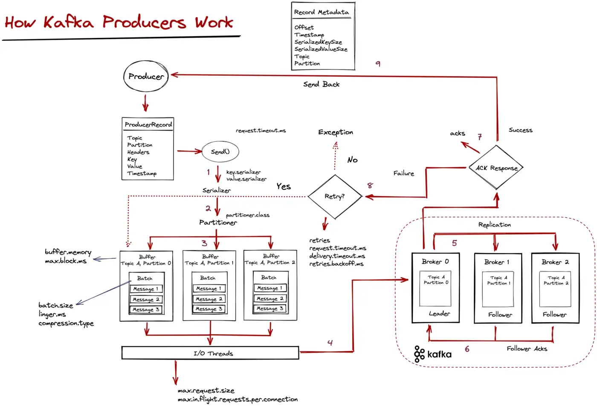
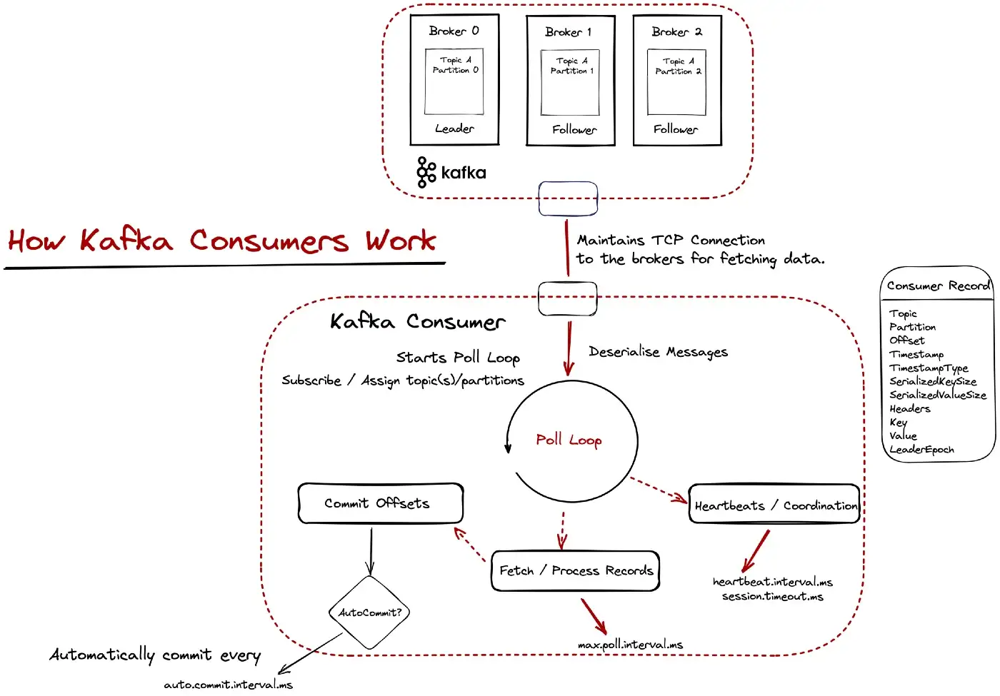
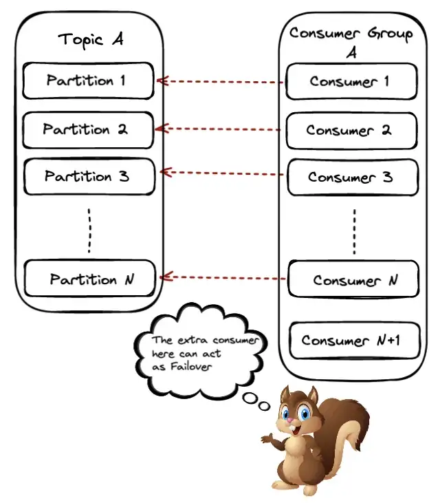
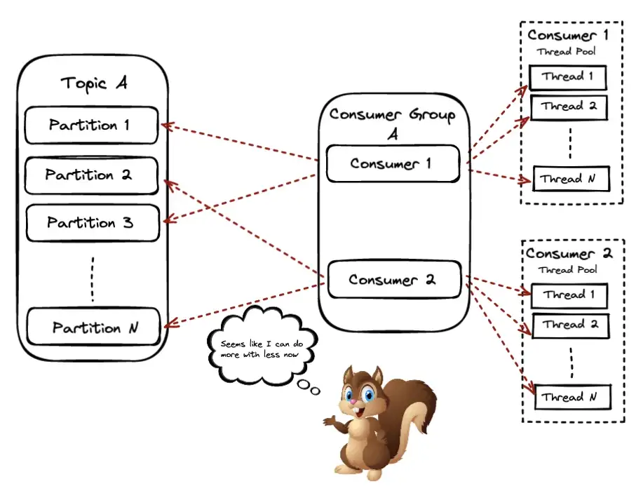

_This article is brought to you by [Giannis Polyzos](https://github.com/polyzos). Giannis is a proud alumnus of Rock the JVM, working as a Solutions Architect with a focus on Event Streaming and Stream Processing Systems._

_Enter Giannis:_

## 1. Introduction

Apache Kafka is a well-known event streaming platform used in many organizations worldwide.
It is used as the backbone of many data infrastructures, thus it's important to understand how to use it efficiently.
The focus of this article is to provide a better understanding of how Kafka works under the hood to better design and tune your client applications.

Since we will discuss **how things work**, this article assumes some basic familiarity with Kafka, i.e.:
- Understanding Kafka on a high level
- Experience with the Java Client API for creating Producers and Consumers
- Some familiarity with Docker will be helpful (but not required)

")

We will use a file ingestion data pipeline for clickstream data as an example to cover the following:
1. Ingest click stream data from the filesystem into Kafka
2. Explain how Kafka producers work, configurations and tuning for throughput / latency
3. How Kafka consumers work, configurations and scaling the consuming side
4. Caveats with consumer offsets and different approaches for handling them

The relevant e-commerce datasets can be found [here](https://www.kaggle.com/datasets/mkechinov/ecommerce-behavior-data-from-multi-category-store).
The code samples are written in Kotlin, but the implementation should be easy to port in Java or Scala.
You can find the source code on Github [here](https://github.com/polyzos/kafka-streaming-ledger).

> _To make the most out of this article, I'd recommend cloning the GitHub repo and following the code snippets there, so you can run them easily, instead of reproducing things yourself from scratch, unless you're a Kafka expert already._

So, let us dive right in.

## 2. Environment Setup

First, we want to have a Kafka Cluster up and running.
Make sure you have [docker compose](https://docs.docker.com/compose/) installed on your machine, as we will use the following `docker-compose.yaml` file to set up a 3-node Kafka Cluster.

```shell
version: "3.7"
services:
  zookeeper:
    image: bitnami/zookeeper:3.8.0
    ports:
      - "2181:2181"
    volumes:
      - ./logs/zookeeper:/bitnami/zookeeper
    environment:
      ALLOW_ANONYMOUS_LOGIN: "yes"
  kafka0:
    image: bitnami/kafka:3.3.1
    ports:
      - "9092:9092"
    volumes:
      - ./logs/kafka0:/bitnami/kafka
    environment:
      KAFKA_CFG_ZOOKEEPER_CONNECT: zookeeper:2181
      ALLOW_PLAINTEXT_LISTENER: "yes"
      KAFKA_ADVERTISED_PORT: 9092
      KAFKA_ADVERTISED_HOST_NAME: kafka0
      KAFKA_LISTENERS: >-
        INTERNAL://:29092,EXTERNAL://:9092
      KAFKA_ADVERTISED_LISTENERS: >-
        INTERNAL://kafka0:29092,EXTERNAL://localhost:9092
      KAFKA_LISTENER_SECURITY_PROTOCOL_MAP: >-
        INTERNAL:PLAINTEXT,EXTERNAL:PLAINTEXT
      KAFKA_INTER_BROKER_LISTENER_NAME: "INTERNAL"
    depends_on:
      - zookeeper
  kafka1:
    image: bitnami/kafka:3.3.1
    ports:
      - "9093:9093"
    volumes:
      - ./logs/kafka1:/bitnami/kafka
    environment:
      KAFKA_CFG_ZOOKEEPER_CONNECT: zookeeper:2181
      ALLOW_PLAINTEXT_LISTENER: "yes"
      KAFKA_LISTENERS: >-
        INTERNAL://:29092,EXTERNAL://:9093
      KAFKA_ADVERTISED_LISTENERS: >-
        INTERNAL://kafka1:29092,EXTERNAL://localhost:9093
      KAFKA_LISTENER_SECURITY_PROTOCOL_MAP: >-
        INTERNAL:PLAINTEXT,EXTERNAL:PLAINTEXT
      KAFKA_INTER_BROKER_LISTENER_NAME: "INTERNAL"
    depends_on:
        - zookeeper
  kafka2:
    image: bitnami/kafka:3.3.1
    ports:
      - "9094:9094"
    volumes:
      - ./logs/kafka2:/bitnami/kafka
    environment:
      KAFKA_CFG_ZOOKEEPER_CONNECT: zookeeper:2181
      ALLOW_PLAINTEXT_LISTENER: "yes"
      KAFKA_LISTENERS: >-
        INTERNAL://:29092,EXTERNAL://:9094
      KAFKA_ADVERTISED_LISTENERS: >-
        INTERNAL://kafka2:29092,EXTERNAL://localhost:9094
      KAFKA_LISTENER_SECURITY_PROTOCOL_MAP: >-
        INTERNAL:PLAINTEXT,EXTERNAL:PLAINTEXT
      KAFKA_INTER_BROKER_LISTENER_NAME: "INTERNAL"
    depends_on:
      - zookeeper
```

All you have to do is navigate to the root folder of the project where the `docker-compose.yaml` file is located and run

```shell
docker-compose up
```

This command will start a 3-node Kafka Cluster.

> _Note: You might want to increase your docker resources (I'm running with 6GB RAM) to make sure you don't run into any issues._

Wait a bit for the cluster to start, then we will need to create our topic to store our clickstream events. For that we will create a topic with 5 partitions and a replication factor of 3 (leader + 2 replicas) using the following command:

```shell
bin/kafka-topics.sh --create \
  --topic ecommerce.events \
  --replication-factor 3 \
  --partitions 5 \
  --bootstrap-server localhost:9092
```

Verify the topic was created successfully:
```shell
bin/kafka-topics.sh --bootstrap-server localhost:9092 --describe ecommerce.events

Topic: ecommerce.events	TopicId: oMhOjOKcQZaoPp_8Xc27lQ	PartitionCount: 5	ReplicationFactor: 3	Configs:
	Topic: ecommerce.events	Partition: 0	Leader: 1001	Replicas: 1001,1002,1003	Isr: 1001,1002,1003
	Topic: ecommerce.events	Partition: 1	Leader: 1003	Replicas: 1003,1001,1002	Isr: 1003,1001,1002
	Topic: ecommerce.events	Partition: 2	Leader: 1002	Replicas: 1002,1003,1001	Isr: 1002,1003,1001
	Topic: ecommerce.events	Partition: 3	Leader: 1001	Replicas: 1001,1003,1002	Isr: 1001,1003,1002
	Topic: ecommerce.events	Partition: 4	Leader: 1003	Replicas: 1003,1002,1001	Isr: 1003,1002,1001
```

## 3. Show me the Code 👀

The producer will send some events to Kafka.

The data model for the click events should look similar to the following payload.


Creating Kafka Producers is pretty straightforward, the important part is creating and sending records and the produce method should look similar to the following:
```kotlin
fun produce(topic: String, key: K, value: V) {
  ProducerRecord(topic, key, value)
    .also { record ->
      producer.send(record) { _, exception ->
        exception?.let {
          logger.error { "Error while producing: $exception" }
        } ?: kotlin.run {
          counter.incrementAndGet()
          if (counter.get() % 100000 == 0) {
            logger.info { "Total messages sent so far ${counter.get()}." }
          }
        }
      }
    }
}

producerResource.produce(KafkaConfig.EVENTS_TOPIC, event.userid, event)
```
For every event we create a **ProducerRecord** object and specify the `topic`, the `key` (here we partition on the userId),
and finally the event payload as the `value`.

The `send()` method is asynchronous, so we specify a callback that gets triggered when we receive a result back.

If the message was successfully written to Kafka we print the metadata, otherwise if an exception is returned we log it.

_But what actually happens when the `send()` method is called?_



Kafka does a lot of things under the hood when the `send()` method is invoked, so let’s outline them below:

1. The message is serialized using the specified serializer.
2. The partitioner determines which partition the message should be routed to.
3. Internally Kafka keeps message buffers; we have one buffer for each partition and each buffer can hold many batches of messages grouped for each partition.
4. Finally, the I/O threads pick up these batches and sent them over to the brokers.
At this point, our messages are in-flight from the client to the brokers. The brokers have sent/receive network buffers for the network threads to pick up the messages and hand them over to some IO thread to actually persist them on disk.
5. On the leader broker, the messages are written on disk and sent to the followers for replication. One thing to note here is that the messages are first written on the PageCache and periodically are flushed on disk.
(_Note:_ PageCache to disk is an extreme case for message loss, but still you might want to be aware of that)
6. The followers (in-sync replicas) store and sent an acknowledgment back they have replicated the message.
7. A `RecordMetadata` response is sent back to the client.
8. If a failure occurred without receiving an ACK, we check if message retry is enabled; if so, we need to resend it.
9. The client receives the response.

## 4. Tradeoffs between Latency and Throughput

In distributed systems, most things come with tradeoffs, and it’s up to the developer to find that "sweet spot" between different tradeoffs; thus it’s important to understand how things work.

One important aspect might be tuning between throughput and latency. Some key configurations to that are `batch.size` and `linger.ms`. These configs work as follows: the producer will batch together records, and when the batch is full, it will send it whole. Otherwise, it will wait at most `linger.ms` to enqueue a new item, and if that time is expired, it will send a (partially full) batch.

Having a small `batch.size` and also `linger` set to 0 can reduce latency and process messages as soon as possible — but it might reduce throughput. Configuring for low latency is also useful for slow produce rate scenarios. Having fewer records accumulated than the specified `batch.size` will result in the client waiting `linger.ms` for more records to arrive.

On the other hand, a larger `batch.size` might use more memory (as we will allocate buffers for the specified batch size) but it will increase the throughput. Other configuration options like `compression.type`, `max.in.flight.requests.per.connection`, and `max.request.size` can help here.


Let’s better illustrate this with an example.

Our event data is stored in CSV files that we want to ingest into Kafka, and since it is not real-time data ingestion, we don’t really care about latency here, but having a good throughput so that we can ingest them fast.

Using the default configurations ingesting 5.000.000 messages takes around 119 seconds.

```shell
13:17:22.885 INFO  [kafka-producer-network-thread | producer-1] io.ipolyzos.utils.LoggingUtils - Total messages sent so far 4800000.
13:17:25.323 INFO  [kafka-producer-network-thread | producer-1] io.ipolyzos.utils.LoggingUtils - Total messages sent so far 4900000.
13:17:27.960 INFO  [kafka-producer-network-thread | producer-1] io.ipolyzos.utils.LoggingUtils - Total messages sent so far 5000000.
13:17:27.967 INFO  [main] io.ipolyzos.producers.ECommerceProducer - Total time '119' seconds
13:17:27.968 INFO  [main] io.ipolyzos.utils.LoggingUtils - Total Event records sent: '5000000'
13:17:27.968 INFO  [main] io.ipolyzos.utils.LoggingUtils - Closing Producers ...
```
Setting `batch.size` to 64Kb (16 is the default), linger.ms greater than 0 and finally `compression.type` to gzip
```kotlin
        properties[ProducerConfig.BATCH_SIZE_CONFIG]        = "64000"
        properties[ProducerConfig.LINGER_MS_CONFIG]         = "20"
        properties[ProducerConfig.COMPRESSION_TYPE_CONFIG]  = "gzip"
```
Has the following impact on the ingestion time.

```shell
13:18:34.377 INFO  [kafka-producer-network-thread | producer-1] io.ipolyzos.utils.LoggingUtils - Total messages sent so far 4800000.
13:18:35.280 INFO  [kafka-producer-network-thread | producer-1] io.ipolyzos.utils.LoggingUtils - Total messages sent so far 4900000.
13:18:35.980 INFO  [kafka-producer-network-thread | producer-1] io.ipolyzos.utils.LoggingUtils - Total messages sent so far 5000000.
13:18:35.983 INFO  [main] io.ipolyzos.producers.ECommerceProducer - Total time '36' seconds
13:18:35.984 INFO  [main] io.ipolyzos.utils.LoggingUtils - Total Event records sent: '5000000'
13:18:35.984 INFO  [main] io.ipolyzos.utils.LoggingUtils - Closing Producers ...
```

From around 119 seconds, the time dropped to 36 seconds. In both cases `ack=1`.
I will leave it up to you to experiment and try different configuration options to see how they better come in handy based on your use case.
You might also want to test against a real cluster to test the networking in place. For example running this similar example on a real cluster takes around _184 seconds_ to ingest 1000000 messages and when adding the configurations changes drops down to _18 seconds_.

If you are concerned with exactly-once semantics, set `enable.idempotency` to true, which will also result in ACKs set to all.

## 5. Kafka Consumers: Switching to the Other Side of the Wall

Up to this point, we have ingested clickstream events into Kafka, so let's see what reading those events looks like.

A typical Kafka consumer loop should look similar to the following snippet:
```kotlin
private fun consume(topic: String) {
        consumer.subscribe(listOf(topic))
        try {
            while (true) {
                val records: ConsumerRecords<K, V> = consumer.poll(Duration.ofMillis(100))
                records.forEach { record ->
                    // simulate the consumers doing some work
                    Thread.sleep(20)
                    logger.info { record }
                }
                logger.info { "[$consumerName] Records in batch: ${records.count()} - Total Consumer Processed: ${counter.get()} - Total Group Processed: ${consumePartitionMsgCount.get()}" }
            }
        } catch (e: WakeupException) {
            logger.info("[$consumerName] Received Wake up exception!")
        } catch (e: Exception) {
            logger.warn("[$consumerName] Unexpected exception: {}", e.message)
        } finally {
            consumer.close()
            logger.info("[$consumerName] The consumer is now gracefully closed.")
        }
    }
```

Let’s try to better understand what happens here. The following diagram provides a more detailed explanation.


Kafka uses a pull-based model for data fetching. At the "heart of the consumer" sits the poll loop. The poll loop is important for two reasons:
1. It is responsible for fetching data (providing **ConsumerRecords**) for the consumer to process and
2. Sends heartbeats and coordinates the consumers so the consumer group knows the available consumers and if a rebalancing needs to take place.

The consuming applications maintain TCP connections with the brokers and sent fetch requests to fetch data. The data is cached and periodically returned from the _poll()_ method. When data is returned from the _poll()_ method the actual processing takes place and once it’s finished more data is requested and so on.

What’s important to note here (and we will dive deeper into it in the next part) is committing message offsets. This is Kafka’s way of knowing that a message has been fetched and processed successfully. By default, offsets are committed automatically at regular intervals.

The amount of data - how much it is going to be fetched, when more data needs to be requested etc. are dictated by configuration options like, `fetch.min.bytes`, `max.partition.fetch.bytes`, `fetch.max.bytes`, `fetch.max.wait.ms`. You might think that the default options might be ok for you, but it’s important to test them out and think through your use case carefully.

To make this more clear let’s assume that you fetch 500 records from the `poll()` loop to process, but the processing for some reason takes too long for each message. The config `max.poll.interval.ms` dictates the maximum time a consumer can be idle before fetching more records; i.e. calling the poll method and if this threshold is reached the consumer is considered `lost` and a rebalance will be triggered — although our application was just slow on processing.

So decreasing the number of records the `poll()` loop should return and/or better tuning some configurations like `heartbeat.interval.ms` and `session.timeout.ms` used for consumer group coordination might be reasonable in this case.

## 6. Running the Consumer

At this point, I will start one consuming instance on my `ecommerce.events` topic. Remember that this topic consists of 5 partitions.
I will execute against my Kafka cluster, using the default consumer configuration options and my goal is to see how long it takes for a consumer to read 10000 messages from the topic, assuming a 20ms processing time per message.

```shell
12:37:13.362 INFO  [main] io.ipolyzos.utils.LoggingUtils - [Consumer-1] Records in batch: 500 - Elapsed Time: 226 seconds - Total Consumer Processed: 9500 - Total Group Processed: 9500
12:37:25.039 INFO  [main] io.ipolyzos.Extensions - Batch Contains: 500 records from 1 partitions.
12:37:25.040 INFO  [main] io.ipolyzos.Extensions -
+--------+------------------+-----------+---------------+-----------+----------------------------------------------+---------------+-------------------------------------------------+-------------+
| Offset | Topic            | Partition | Timestamp     | Key       | Value                                        | TimestampType | Teaders                                         | LeaderEpoch |
+--------+------------------+-----------+---------------+-----------+----------------------------------------------+---------------+-------------------------------------------------+-------------+
| 9999   | ecommerce.events | 4         | 1674469663415 | 513376382 | {eventTime=1572569126000, eventType=view ... | CreateTime    | RecordHeaders(headers = [], isReadOnly = false) | Optional[1] |
| 9998   | ecommerce.events | 4         | 1674469663415 | 529836227 | {eventTime=1572569124000, eventType=view ... | CreateTime    | RecordHeaders(headers = [], isReadOnly = false) | Optional[1] |
| 9997   | ecommerce.events | 4         | 1674469663415 | 513231964 | {eventTime=1572569124000, eventType=view ... | CreateTime    | RecordHeaders(headers = [], isReadOnly = false) | Optional[1] |
| 9996   | ecommerce.events | 4         | 1674469663415 | 564378632 | {eventTime=1572569124000, eventType=view ... | CreateTime    | RecordHeaders(headers = [], isReadOnly = false) | Optional[1] |
| 9995   | ecommerce.events | 4         | 1674469663415 | 548411752 | {eventTime=1572569124000, eventType=view ... | CreateTime    | RecordHeaders(headers = [], isReadOnly = false) | Optional[1] |
+--------+------------------+-----------+---------------+-----------+----------------------------------------------+---------------+-------------------------------------------------+-------------+
12:37:25.041 INFO  [main] io.ipolyzos.utils.LoggingUtils - [Consumer-1] Records in batch: 500 - Elapsed Time: 237 seconds - Total Consumer Processed: 10000 - Total Group Processed: 10000
12:37:27.509 INFO  [Thread-0] io.ipolyzos.utils.LoggingUtils - [Consumer-1] Detected a shutdown, let's exit by calling consumer.wakeup()...

```
We can see that it takes a single consumer around 4 minutes for this kind of processing. So how can we do better?

## 7. Scaling the Consuming Side

Consumer Groups are Kafka’s way of sharing the work between different consumers and also the level of parallelism. The highest level of parallelism you can achieve with Kafka is having one consumer consuming from each partition of a topic.

### 7.1. #Partitions > #Consumers

In the scenario, the available partitions will be shared equally among the available consumers of the group and each consumer will have ownership of those partitions.


### 7.2. #Partitions = #Consumers


When the partition number is equal to the available consumers each consumer will be reading from exactly one partition. In this scenario, we also reach the maximum parallelism we can achieve on a particular topic.

### 7.3. #Partitions < #Consumers


This scenario is similar to the previous one, only now we will have one consumer running but stays idle. On the one hand, this means we waste resources, but we can also use this consumer as a _failover_ in case another one in the group goes down.

When a consumer goes down or similarly a new one joins the group, Kafka will have to trigger a rebalance. This means that partitions need to be revoked and reassigned to the available consumers in the group.

Let’s run again our previous example — consuming 10k messages — but this time having 5 consumers in our consumer group. I will be creating 5 consuming instances from within a single JVM (using Kotlin [coroutines](/kotlin-coroutines-101), but you can easily re-adjust the code (found [here](https://github.com/polyzos/kafka-streaming-ledger/blob/main/src/main/kotlin/io/ipolyzos/consumers/PerPartitionConsumer.kt)) and just start multiple JVMs.
```shell
12:39:53.233 INFO  [DefaultDispatcher-worker-1] io.ipolyzos.Extensions -
+--------+------------------+-----------+---------------+-----------+----------------------------------------------+---------------+-------------------------------------------------+-------------+
| Offset | Topic            | Partition | Timestamp     | Key       | Value                                        | TimestampType | Teaders                                         | LeaderEpoch |
+--------+------------------+-----------+---------------+-----------+----------------------------------------------+---------------+-------------------------------------------------+-------------+
| 1999   | ecommerce.events | 0         | 1674469663077 | 512801708 | {eventTime=1572562526000, eventType=view ... | CreateTime    | RecordHeaders(headers = [], isReadOnly = false) | Optional[1] |
| 1998   | ecommerce.events | 0         | 1674469663077 | 548190452 | {eventTime=1572562525000, eventType=view ... | CreateTime    | RecordHeaders(headers = [], isReadOnly = false) | Optional[1] |
| 1997   | ecommerce.events | 0         | 1674469663077 | 517445703 | {eventTime=1572562520000, eventType=view ... | CreateTime    | RecordHeaders(headers = [], isReadOnly = false) | Optional[1] |
| 1996   | ecommerce.events | 0         | 1674469663077 | 512797937 | {eventTime=1572562519000, eventType=view ... | CreateTime    | RecordHeaders(headers = [], isReadOnly = false) | Optional[1] |
| 1995   | ecommerce.events | 0         | 1674469663077 | 562837353 | {eventTime=1572562519000, eventType=view ... | CreateTime    | RecordHeaders(headers = [], isReadOnly = false) | Optional[1] |
+--------+------------------+-----------+---------------+-----------+----------------------------------------------+---------------+-------------------------------------------------+-------------+
12:39:53.233 INFO  [DefaultDispatcher-worker-1] io.ipolyzos.utils.LoggingUtils - [Consumer-2] Records in batch: 500 - Elapsed Time: 47 seconds - Total Consumer Processed: 2000 - Total Group Processed: 10000
12:39:55.555 INFO  [Thread-10] io.ipolyzos.utils.LoggingUtils - [Consumer-3] Detected a shutdown, let's exit by calling consumer.wakeup()...
```

As expected we can see that the consumption time dropped to less than a minute time.

But if Kafka’s maximum level of parallelism is one consumer per partition, does this mean we hit the scaling limit? Let’s see how to tackle this next.

### 7.4. The Parallel Consumer Pattern

Up to this point, we might have two questions in mind:
1. If #partitions = #consumers in the consumer group, how can I scale even further if needed? It’s not always easy to calculate the number of partitions beforehand and/or I might need to account for sudden spikes.
2. How can I minimize rebalancing time?

One solution to this can be the parallel consumer pattern. You can have consumers in your group consuming from one or more partitions of the topic, but then they propagate the actual processing to other threads.

One such implementation can be found [here](https://github.com/confluentinc/parallel-consumer).

It provides three ordering guarantees — _Unordered_, _Keyed_ and _Partition_.
1. _Unordered_ — provides no guarantees
2. _Key_ — guarantees ordering per key BUT with the caveat that the keyspace needs to be quite large, otherwise you might not observe much performance improvement.
3. _Partition—Only_ one message will be processed per partition at any time.

Along with that it also provides different ways for committing offset. This is a pretty nice library you might want to look at.



Going once more back to our example to answer the question — how can we break the scaling limit? We will be using the parallel consumer pattern — you can find the code [here](https://github.com/polyzos/kafka-streaming-ledger/blob/main/src/main/kotlin/io/ipolyzos/consumers/ParallelScalingConsumer.kt).
Using one _parallel consumer instance_ on our _5-partition_ topic, specifying a _Key Ordering_, and using a parallelism of _100 threads_
```shell
12:48:42.752 INFO  [pc-pool-1-thread-87] io.ipolyzos.utils.LoggingUtils - [Consumer-0] Records in batch: 5 - Elapsed Time: 2 seconds - Total Consumer Processed: 9970 - Total Group Processed: 9970
12:48:42.752 INFO  [pc-pool-1-thread-98] io.ipolyzos.utils.LoggingUtils - [Consumer-0] Records in batch: 5 - Elapsed Time: 2 seconds - Total Consumer Processed: 9970 - Total Group Processed: 9970
12:48:42.758 INFO  [pc-pool-1-thread-26] io.ipolyzos.utils.LoggingUtils - [Consumer-0] Records in batch: 5 - Elapsed Time: 2 seconds - Total Consumer Processed: 9975 - Total Group Processed: 9975
12:48:42.761 INFO  [pc-pool-1-thread-72] io.ipolyzos.utils.LoggingUtils - [Consumer-0] Records in batch: 5 - Elapsed Time: 2 seconds - Total Consumer Processed: 9980 - Total Group Processed: 9980
12:48:42.761 INFO  [pc-pool-1-thread-75] io.ipolyzos.utils.LoggingUtils - [Consumer-0] Records in batch: 5 - Elapsed Time: 2 seconds - Total Consumer Processed: 9985 - Total Group Processed: 9985
12:48:42.761 INFO  [pc-pool-1-thread-21] io.ipolyzos.utils.LoggingUtils - [Consumer-0] Records in batch: 5 - Elapsed Time: 2 seconds - Total Consumer Processed: 9990 - Total Group Processed: 9990
12:48:42.765 INFO  [pc-pool-1-thread-13] io.ipolyzos.utils.LoggingUtils - [Consumer-0] Records in batch: 5 - Elapsed Time: 2 seconds - Total Consumer Processed: 9995 - Total Group Processed: 9995
12:48:42.765 INFO  [pc-pool-1-thread-56] io.ipolyzos.utils.LoggingUtils - [Consumer-0] Records in batch: 5 - Elapsed Time: 2 seconds - Total Consumer Processed: 10000 - Total Group Processed: 10000
```

Makes the consuming and processing time of **10k messages** take as much as **2 seconds**.

> _Notice from the logs how different batches are processed on different threads on the same consumer instance._

and if we use _5 parallel consumer instances_, it takes just a few milliseconds.
```shell
12:53:23.800 INFO  [pc-pool-2-thread-85] io.ipolyzos.utils.LoggingUtils - [Consumer-1] Records in batch: 5 - Elapsed Time: 672 milliseconds - Total Consumer Processed: 2031 - Total Group Processed: 10015
12:53:23.800 INFO  [pc-pool-4-thread-11] io.ipolyzos.utils.LoggingUtils - [Consumer-3] Records in batch: 5 - Elapsed Time: 683 milliseconds - Total Consumer Processed: 1865 - Total Group Processed: 10015
12:53:23.800 INFO  [pc-pool-5-thread-80] io.ipolyzos.utils.LoggingUtils - [Consumer-5] Records in batch: 5 - Elapsed Time: 670 milliseconds - Total Consumer Processed: 2062 - Total Group Processed: 10020
12:53:23.801 INFO  [pc-pool-6-thread-6] io.ipolyzos.utils.LoggingUtils - [Consumer-4] Records in batch: 5 - Elapsed Time: 654 milliseconds - Total Consumer Processed: 2018 - Total Group Processed: 10025
12:53:23.801 INFO  [pc-pool-4-thread-41] io.ipolyzos.utils.LoggingUtils - [Consumer-3] Records in batch: 5 - Elapsed Time: 684 milliseconds - Total Consumer Processed: 1870 - Total Group Processed: 10030
12:53:23.801 INFO  [pc-pool-3-thread-8] io.ipolyzos.utils.LoggingUtils - [Consumer-2] Records in batch: 5 - Elapsed Time: 672 milliseconds - Total Consumer Processed: 2054 - Total Group Processed: 10035
12:53:23.801 INFO  [pc-pool-5-thread-89] io.ipolyzos.utils.LoggingUtils - [Consumer-5] Records in batch: 5 - Elapsed Time: 671 milliseconds - Total Consumer Processed: 2067 - Total Group Processed: 10040
12:53:23.801 INFO  [pc-pool-5-thread-66] io.ipolyzos.utils.LoggingUtils - [Consumer-5] Records in batch: 5 - Elapsed Time: 671 milliseconds - Total Consumer Processed: 2072 - Total Group Processed: 10045
12:
```
So basically we have accomplished getting our processing time from ~ minutes down to seconds.

> _Notice in the screenshot how different batches are processed on different threads on different consumer instances._

## 8. Offsets and How to Handle Them

Up to this point, we have seen the whole message lifecycle in Kafka — PPC (Produce, Persist, Consume)

One thing really important though — especially when you need to trust your system provides the best guarantees when processing each message exactly once — is committing offsets.

Fetching messages from Kafka, processing them and marking them as processed, by actually providing such guarantees has a few pitfalls and is not provided out of the box.

This is what we will see next, i.e. what do I need to take into account to get the best possible exactly-once processing guarantees out of my applications?

We will take a look at a few scenarios for committing offsets and what caveats each approach might have.

### 8.1. Committing Offsets Automatically
This is the default behavior with enable.auto.commit set to true. The caveat here is that the message is consumed and the offsets will be committed periodically, BUT this doesn’t mean the message has been successfully processed. If the message fails for some reason, its offset might have been committed and as far as Kafka is concerned that message has been processed successfully.

### 8.2. Committing Offsets Manually
Setting `enable.auto.commit` to false takes Kafka consumers out of the "autopilot mode" and it’s up to the application to commit the offsets. This can be achieved by using the `commitSync()` or `commitAsync()` methods on the consumer API.

When committing offsets manually we can do so either when the whole batch returned from the `poll()` method has finished processing in which case all the offsets up to the highest one will be committed, or we might want to commit after each individual message is done with it’s processing for even stronger guarantees.

#### 8.2.1. Commit/Message

```kotlin
if (perMessageCommit) {
    logger.info { "Processed Message: ${record.value()} with offset: ${record.partition()}:${record.offset()}" }
  val commitEntry: Map<TopicPartition, OffsetAndMetadata> =
      mapOf(TopicPartition(record.topic(), record.partition()) to OffsetAndMetadata(record.offset()))

  consumer.commitSync(commitEntry)
  logger.info { "Committed offset: ${record.partition()}:${record.offset()}" }
}
```

#### 8.2.2. Commit/Batch

```kotlin
// Process all the records
records.forEach { record ->
  // simulate the consumers doing some work
  Thread.sleep(20)
  logger.info { "Processing Record: ${record.value()}" }
}
// Commit up to the highest offset
val maxOffset: Long = record.maxOfOrNull { it.offset() }!!
conssumer.commitAsync { topicPartition, offsetMetadata ->
  logger.info { "Processed up to offset: $maxOffset - Committed: $topicPartition and $offsetMetadata" }

}
```
This gives us control over how message offsets are committed, and we can trust that we will wait for the actual processing to finish before committing the offset.

For those who want to account for (or at least try to) _every unhappy_ path there is also the possibility that things fail in the commit process itself. In this case the message will be reprocessed

### 8.3. Idempotency with External Storage

You can use an external data store and keep track of the offsets there (for example like Apache Cassandra).

Consuming messages and using something like a transaction for both processing the message, as well as committing the offsets will guarantee that either both will succeed or fail and thus idempotency is ensured.

One thing to note here is that offsets are now stored in an external datastore. When starting a new consumer or a rebalancing takes place you need to make sure your consumer fetches the offsets from the external datastore.

One way to achieve this can be adding a `ConsumerRebalanceListener` and when `onPartitionsRevoked` and `onPartitionsAssigned` methods are called store (commit) or retrieve the offsets from the external datastore.


## 9. Wrapping Up

As takeaways:
- Don't rely on the default configurations; Try to fine-tune between throughput and latency
- Partitions play an important role in scaling Kafka.
- The Parallel-Consumer pattern can further help you scale your applications.
- Consuming a message is different from actually processing it successfully
- Auto-committing offsets can have a negative impact on your application guarantees
