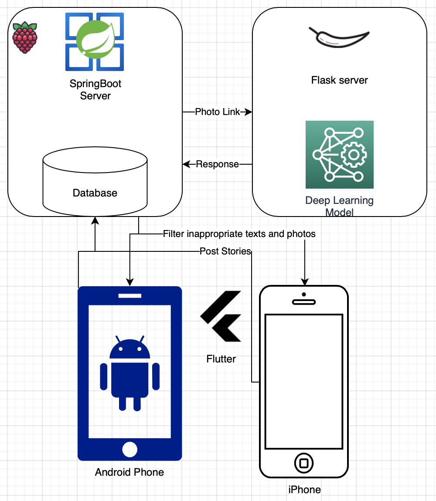

2022년 여름 - 임베디드 SW 경진대회
2022년 2학기 - 종합프로젝트
2022년 P학기 - P-실무 프로젝트

인생 첫 번째 프로젝트를 시작으로, 어느덧 3개의 프로젝트를 마무리했다.
지금껏 IOT 시스템 솔루션을 개발하며 안드로이드 모바일개발자 역할을 소화해왔다.
코틀린과 안드로이드 스튜디오를 사용한 개발에 익숙해지던 중, 아버지의 권유를 받아 인공지능 공부를 시작하게 되었다.

3학년 1학기 인공지능과목과 모바일프로그래밍 과목을 모두 수강했었으나, 사용자와 가깝게 상호작용하며 결과물을 받아올 수 있는 모바일 환경에 매력을 느꼈고, 모바일 개발자로서의 진로를 정해두고 있었다. 그러나 최근 코딩을 직접 해주는 인공지능 API의 등장 등, 모바일 개발자로서의 미래가 길게 유지되기 힘들 것이라는 전망 등의 영향으로 인공지능을 다시 공부하게 되었다.

이번 '도란도란' 프로젝트는 사용자들이 자유롭게 글과 이미지를 게시하고 소통할 수 있는 모바일 플랫폼을 만드는 것이 목적이다. 그리고 주요 기능으로는 비속어 및 선정성 높은 사진을 걸러내는 것을 목표로 하고 있다. 남녀노소 많은 사람들이 다양한 플랫폼을 통해 의사소통을 하고 있고, 디지털 폭력에 노출되기 쉬운 상황이다. 온라인 게임 등에서도 채팅에서 비속어를 사용하지 못하게 하는 비속어 차단 기능이 있다. 최초에는 대중적으로 사용하는 비속어들만 등록하여 필터링을 했으나, 사용자들은 비속어 사이에 특수문자 혹 숫자를 끼워 사용하며 필터링을 피하는 경우도 있었다. 더 나아가 요즘에는 비속어에 해당되는 단어는 하나도 사용하지 않고 일상적인 단어들로만 구성하여 상대방을 모욕하는 일도 비일비재하다.

따라서 우리 '도란도란' 팀은, 인공지능 모델을 학습시켜 변형된 비속어 문자메시지나 적절 여부를 따지기 애매한 사진도 걸러낼 수 있는 솔루션을 개발하기로했다.
이미 모바일 어플리케이션 파트와 스프링 서버 파트는 많은 부분이 진행된 상황이고, 필자는 이번주 공식적으로 첫 참여하게 되었다.

첫 주차의 임무는 플라스크 서버를 구축하여 스프링 서버로부터 사진 링크를 전달 받을 수 있는 환경을 구축하는 것이다.
그와 더불어 선정적인 사진 필터링을 위한 데이터셋도 수집하는 과정에 있다.

위 그림은 전반적인 도란도란 솔루션 플로우 이미지로, 하단의 모바일 플랫폼 사용자가 게시글 혹 사진을 등록하는 것으로 시작이 된다.
등록 요청을 받은 스프링 서버는 해당하는 글과 그림을 데이터베이스에 저장한다.
그리고 데이터가 저장된 링크를 플라스크 서버로 전송하고, 플라스크 서버내의 필터링 API를 통해 글 혹은 사진이 적절한지 판단하게 된다.
적절하지 않다고 판단된 데이터는 필터링 될 것이고, 사용자가 부적절하게 생각한 이미지와 글은 신고기능을 통해 추후 모델을 재학습하는 용도로 사용한다.