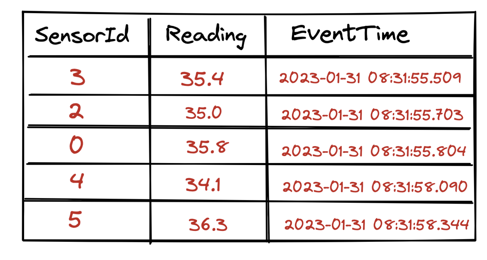
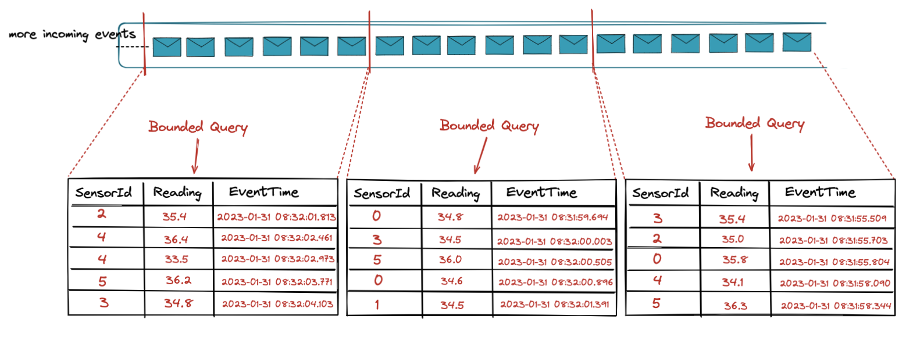
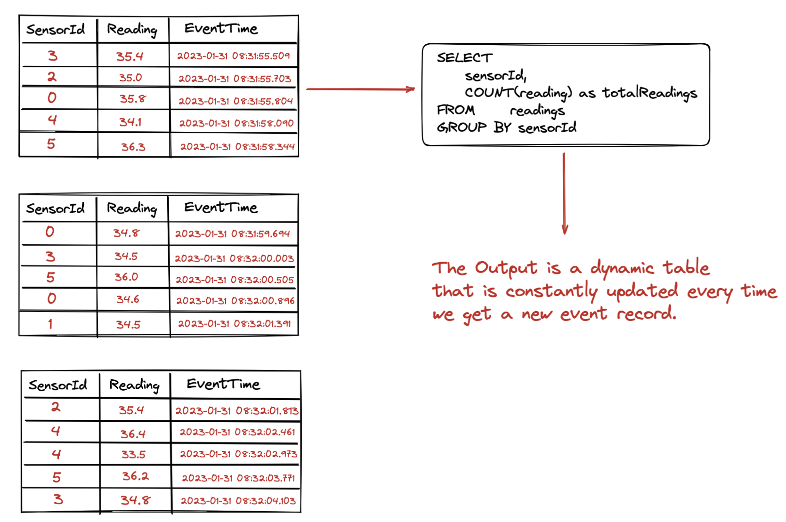
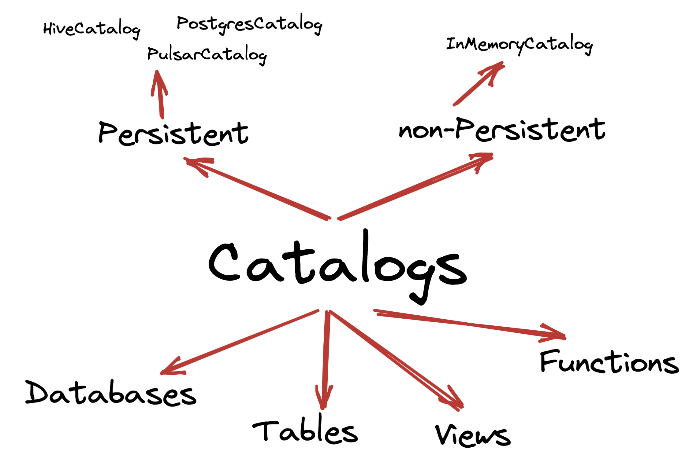
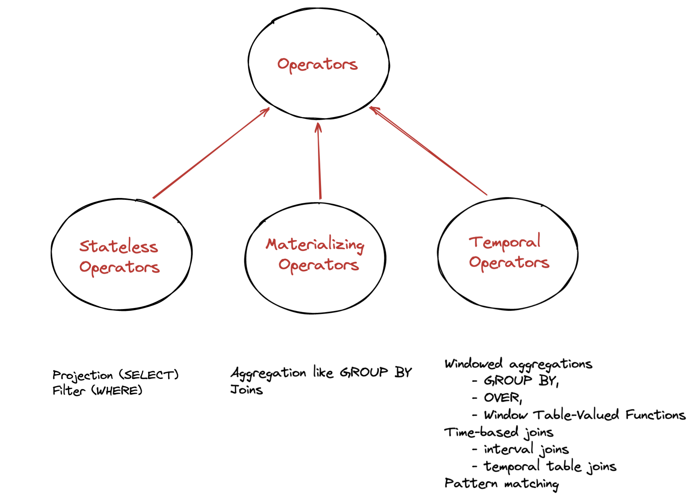
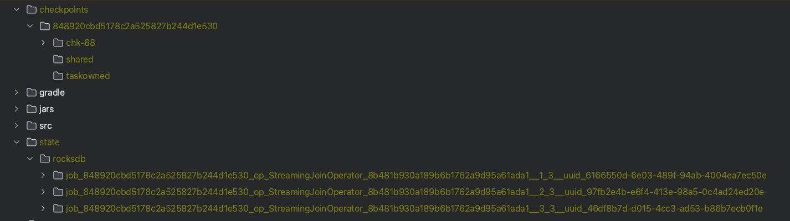

_This article is brought to you by [Giannis Polyzos](https://github.com/polyzos). Giannis is a proud alumnus of Rock the JVM, working as a Solutions Architect with a focus on Event Streaming and Stream Processing Systems._

_Enter Giannis:_

Flink SQL is a powerful high level API for running queries on streaming (and batch) datasets. In this article we will see:
1. Why it's powerful and how it helps democratize Stream Processing and Analytics
2. Understand basic concepts around Streaming and Flink SQL
3. Setup Kafka and Flink Clusters and get started with Flink SQL
4. Understand different kinds of Processing Operators and Functions
5. Different ways of running Flink SQL Queries

> _Daniel here: If you need to learn the fundamentals of streaming with Flink, check out the long-form [Flink course](https://rockthejvm.com/p/flink) here at Rock the JVM._

## 1. Streaming (and Batch) SQL
### 1.1 Unified Batch and Streaming

When we hear about SQL (referenced as batch SQL here) we think of the following tabular format you typically find in RDBMS,
on which we operate and run computations - from simple projections (like SELECT and Filter), to Aggregations to Windowed Functions.



Batch SQL Queries operate on static data, i.e. on data stored on disk, already available and the results are considered complete.

How can Tables relate with Streams?

Let's think of a data stream now


A stream is basically an *unbounded* dataset of incoming events, i.e. it has no end.
In the heart of a stream is the *append-only log*, i.e. each incoming events can be considered as a *row* that gets appended at the end of the log - similar to a database table.

In practice if we follow this mental model we can think of a stream as a collection of snapshots of bounded datasets.



This is what is enables Unified Batch and Streaming Architecture and allows the use of a single API - like Flink SQL - to handle both Batch and Streaming data; no underlying code changes needed.

### 1.2 Streaming SQL Semantics

The rules are as follows:
- The Input tables are constantly changing and possibly unbounded
    - *Append Only Streams:* Keeps all the history in the stream. Every new event is an insert operation in the append-only log
    - *Changelog Streams:* Keeps the most recent value (for some key).
- Query results are never final, continuously updated, and potentially unbounded



One the left side we have our append-log (or a collection of bounded datasets as we discussed above) and we run a *Streaming SQL Query* on that table.

As we keep ingesting new events, they get appended as new rows to the log. These events yield changes, which results in the output table being continuously updated.

This is called a *Dynamic Table*.

## 2. Flink SQL Logical Components



Flink consists of *catalogs* that hold metadata for databases, tables, functions and views.

A catalog can be non-persisted (In Memory Catalog) or persistent backed by an external system like the PostgresCatalog, the PulsarCatalog and the HiveCatalog.

For In Memory catalogs all metadata will be available only for the lifetime of the session.

In contrast, catalogs like PostgresCatalog enables users to connect the two systems and then Flink
automatically references existing metadata by mapping them to it’s corresponding metadata.

For example, Flink can map Postgres tables to its own table automatically, and users don’t have to manually re-writing DDLs in Flink SQL.

Within the catalogs you create databases and tables in these databases.

When creating a table it's full table name identifier is: *<catalog_name>.<database_name>.<table_name>* and when a catalogs and/or database is not specified
the default ones are used.

## 3. Environment Setup
As a warmup exercise let's start the Flink SQL CLI to run a few commands; but first we need to have a Flink and a Kafka Cluster up and running.

Make sure you have [docker compose](https://docs.docker.com/compose/) installed on your machine, as we will use the following `docker-compose.yaml` file to set up the required clusters.

```yaml
version: "3.7"
services:
  zookeeper:
    image: bitnami/zookeeper:3.8.0
    ports:
      - "2181:2181"
    environment:
      ALLOW_ANONYMOUS_LOGIN: "yes"
  kafka:
    image: bitnami/kafka:3.3.1
    ports:
      - "9092:9092"
    environment:
      KAFKA_CFG_ZOOKEEPER_CONNECT: zookeeper:2181
      ALLOW_PLAINTEXT_LISTENER: "yes"
      KAFKA_ADVERTISED_PORT: 9092
      KAFKA_ADVERTISED_HOST_NAME: kafka
      KAFKA_LISTENERS: >-
        INTERNAL://:29092,EXTERNAL://:9092
      KAFKA_ADVERTISED_LISTENERS: >-
        INTERNAL://kafka:29092,EXTERNAL://localhost:9092
      KAFKA_LISTENER_SECURITY_PROTOCOL_MAP: >-
        INTERNAL:PLAINTEXT,EXTERNAL:PLAINTEXT
      KAFKA_INTER_BROKER_LISTENER_NAME: "INTERNAL"
    depends_on:
      - zookeeper
  jobmanager:
    build: .
    container_name: jobmanager
    ports:
      - "8081:8081"
    command: jobmanager
    environment:
      - |
        FLINK_PROPERTIES=
        jobmanager.rpc.address: jobmanager
  taskmanager:
    build: .
    depends_on:
      - jobmanager
    command: taskmanager
    deploy:
      replicas: 1
    environment:
      - |
        FLINK_PROPERTIES=
        jobmanager.rpc.address: jobmanager
        taskmanager.numberOfTaskSlots: 1
```

### 3.1 The Flink SQL Client
Run `docker-compose up`, wait for a few seconds and your clusters should be up and running.

Let's start the Flink SQL CLI by running `docker exec -it jobmanager ./bin/sql-client.sh` and then execute the following commands as a warmup with the sql client:

```shell
Flink SQL> SHOW CATALOGS;
+-----------------+
|    catalog name |
+-----------------+
| default_catalog |
+-----------------+
1 row in set

// Create a new Database
Flink SQL> CREATE DATABASE mydbl

Flink SQL> SHOW DATABASES;
+------------------+
|    database name |
+------------------+
| default_database |
|            mydbl |
+------------------+
2 rows in set

Flink SQL> use mydbl;
[INFO] Execute statement succeed.

// currently we have no tables
Flink SQL> SHOW TABLES;
Empty set

// a truncated output of some available functions.
Flink SQL> SHOW FUNCTIONS;
+-------------------------------+
|                 function name |
+-------------------------------+
|             AGG_DECIMAL_MINUS |
|              AGG_DECIMAL_PLUS |
|                ARRAY_CONTAINS |
|                      COALESCE |
|             CURRENT_WATERMARK |
|                      GREATEST |
|                        IFNULL |
|                       IS_JSON |
|                    JSON_ARRAY |
|  JSON_ARRAYAGG_ABSENT_ON_NULL |
|    JSON_ARRAYAGG_NULL_ON_NULL |
|                   JSON_EXISTS |
|                   JSON_OBJECT |
| JSON_OBJECTAGG_ABSENT_ON_NULL |
|   JSON_OBJECTAGG_NULL_ON_NULL |
|                    JSON_QUERY |
|                   JSON_STRING |
|                    JSON_VALUE |
|                         LEAST |
|              SOURCE_WATERMARK |

```

It's time now to get into some interesting stuff, but before that let's also create the Kafka topics we will be using for our examples.

```shell
docker exec -it depths-of-flink-kafka-1 kafka-topics.sh --create \
  --topic sensor.info \
  --partitions 1 \
  --config cleanup.policy=compact \
  --bootstrap-server localhost:9092

docker exec -it depths-of-flink-kafka-1 kafka-topics.sh --create \
  --topic sensor.readings \
  --partitions 3 \
  --bootstrap-server localhost:9092

docker exec -it depths-of-flink-kafka-1 kafka-topics.sh --bootstrap-server localhost:9092 --describe

------- Output -------
Topic: sensor.info	TopicId: zFY47WiRS721XIUik2nRBg	PartitionCount: 1	ReplicationFactor: 1	Configs: cleanup.policy=compact
	Topic: sensor.info	Partition: 0	Leader: 1001	Replicas: 1001	Isr: 1001

Topic: sensor.readings	TopicId: HGvGHOeKQQCxG3cly2R7Lw	PartitionCount: 3	ReplicationFactor: 1	Configs:
	Topic: sensor.readings	Partition: 0	Leader: 1001	Replicas: 1001	Isr: 1001
	Topic: sensor.readings	Partition: 1	Leader: 1001	Replicas: 1001	Isr: 1001
	Topic: sensor.readings	Partition: 2	Leader: 1001	Replicas: 1001	Isr: 1001
```

### 3.2 Create Tables

Let's go back to our Flink SQL cli and the first thing we need is some tables to work with.

We will be using the [Kafka Flink SQL connector](https://nightlies.apache.org/flink/flink-docs-release-1.16/docs/connectors/table/kafka/) to read sensor information and sensor readings from the two Kafka topic we already created.
The following block shows how to create a table from a Kafka topic.

*Note:* We will be using the default catalogs as well as the default database.

```shell
CREATE TABLE readings (
  sensorId STRING,
  reading DOUBLE,
  eventTime_ltz AS TO_TIMESTAMP_LTZ(`timestamp`, 3),
  `ts` TIMESTAMP(3) METADATA FROM 'timestamp',
  `timestamp` BIGINT,
    WATERMARK FOR eventTime_ltz AS eventTime_ltz - INTERVAL '30' SECONDS
) WITH (
  'connector' = 'kafka',
  'topic' = 'sensor.readings',
  'properties.bootstrap.servers' = 'kafka:29092',
  'properties.group.id' = 'group.sensor.readings',
  'format' = 'json',
  'scan.startup.mode' = 'earliest-offset',
  'json.timestamp-format.standard' = 'ISO-8601',
  'json.fail-on-missing-field' = 'false',
  'json.ignore-parse-errors' = 'true'
);


  Flink SQL> DESCRIBE readings;
+---------------+----------------------------+------+-----+-------------------------------------+----------------------------------------+
|          name |                       type | null | key |                              extras |                              watermark |
+---------------+----------------------------+------+-----+-------------------------------------+----------------------------------------+
|      sensorId |                     STRING | TRUE |     |                                     |                                        |
|       reading |                     DOUBLE | TRUE |     |                                     |                                        |
| eventTime_ltz | TIMESTAMP_LTZ(3) *ROWTIME* | TRUE |     | AS TO_TIMESTAMP_LTZ(`timestamp`, 3) | `eventTime_ltz` - INTERVAL '30' SECOND |
|            ts |               TIMESTAMP(3) | TRUE |     |           METADATA FROM 'timestamp' |                                        |
|     timestamp |                     BIGINT | TRUE |     |                                     |                                        |
+---------------+----------------------------+------+-----+-------------------------------------+----------------------------------------+
5 rows in set
```

The *CREATE TABLE* syntax consists of column definitions, watermarks and connector properties (more details [here](https://nightlies.apache.org/flink/flink-docs-master/docs/dev/table/sql/create/#create-table)).

We can observe the following column types in Flink SQL:
1. *Physical (or regular) columns*
2. *Metadata columns:* like the `ts` column in our statement that is basically Kafka metadata for accessing the `timestamp` from a Kafka Record.
3. *Computed columns:* virtual columns like the *eventTime_ltz* in our statement, that is a formatted timestamp derived from our `timestamp` BIGINT column. Virtual Columns can reference other columns, perform simple computations (like 5 * reading) or use built-in functions

*Note:* Specifying a Time attributes (here _eventTime_ltz_) and watermarks is what allows us to operate properly on even time and also set constraints on temporal operators, which we will shortly.

Let's also create a table for our sensor information topic.
```shell
CREATE TABLE sensors (
  sensorId STRING,
  latitude String,
  longitude String,
  sensorType STRING,
  generation STRING,
  deployed BIGINT
) WITH (
  'connector' = 'kafka',
  'topic' = 'sensor.info',
  'properties.bootstrap.servers' = 'kafka:29092',
  'properties.group.id' = 'group.sensor.info',
  'format' = 'json',
  'scan.startup.mode' = 'earliest-offset',
  'json.timestamp-format.standard' = 'ISO-8601',
  'json.fail-on-missing-field' = 'false',
  'json.ignore-parse-errors' = 'true'
);

Flink SQL> DESCRIBE sensors;
+------------+--------+------+-----+--------+-----------+
|       name |   type | null | key | extras | watermark |
+------------+--------+------+-----+--------+-----------+
|   sensorId | STRING | TRUE |     |        |           |
|   latitude | STRING | TRUE |     |        |           |
|  longitude | STRING | TRUE |     |        |           |
| sensorType | STRING | TRUE |     |        |           |
| generation | STRING | TRUE |     |        |           |
|   deployed | BIGINT | TRUE |     |        |           |
+------------+--------+------+-----+--------+-----------+
```
You might wonder why there is no time attribute or watermark specified on this topic.

The sensor information is basically used to hold *state* - i.e it's a *changelog stream* backed by a compacted Kafka topic (compared to an *append-only stream*) because we are only interested in keeping the latest sensor
information to perform event enrichment later (when we will discuss joins.)

At this point we have two tables created within our default database.
```shell
Flink SQL> SHOW TABLES;
>
+------------+
| table name |
+------------+
|   readings |
|    sensors |
+------------+
2 rows in set
```

Next up we need some data in our topics (and tables) to work with.
I will use the following Producer code that can be found [here](https://github.com/polyzos/select-star-from-streams/blob/main/src/main/kotlin/io/ipolyzos/producers/SensorProducer.kt)
to generate information for _10 sensors_ and _10.000 readings_. You can modify the code to ingest more data if you want.

*Note:* I skipped added the implementation here since our focus is on Flink SQL.

### 3.3 Run our First Query
Let's run the following query and see an output similar to the following with information for our 10 sensors.

```shell
SELECT * FROM sensors;

------- Sample Output -------

+----+--------------------------------+--------------------------------+--------------------------------+--------------------------------+--------------------------------+----------------------+
| op |                       sensorId |                       latitude |                      longitude |                     sensorType |                     generation |             deployed |
+----+--------------------------------+--------------------------------+--------------------------------+--------------------------------+--------------------------------+----------------------+
| +I |                              1 |                      83.964156 |                      47.567865 |                      PROXIMITY |                              0 |        1610920880369 |
| +I |                              2 |                      70.211600 |                      87.285699 |                      PROXIMITY |                              0 |        1669725385766 |
| +I |                              3 |                     -78.843922 |                     -159.70556 |                    TEMPERATURE |                              2 |        1645179854537 |
| +I |                              4 |                      77.304485 |                      102.32052 |                      PROXIMITY |                              2 |        1596841078647 |
| +I |                              5 |                     -11.876575 |                      57.576944 |                      PROXIMITY |                              3 |        1667359403631 |
| +I |                              6 |                      59.134005 |                     -159.71549 |                      PROXIMITY |                              0 |        1604501300175 |
| +I |                              7 |                     -16.478654 |                      141.49999 |                    TEMPERATURE |                              1 |        1614461145113 |
| +I |                              8 |                     -64.380075 |                      164.37186 |                      PROXIMITY |                              2 |        1673640554153 |
| +I |                              9 |                     -33.693995 |                     -2.4277239 |                    TEMPERATURE |                              3 |        1645551899832 |
| +I |                             10 |                     -88.115880 |                      11.500759 |                      PROXIMITY |                              2 |        1623336384463 |
```

## 4. Operators



### 4.1 Stateless Operators
Stateless Operators are the simplest and include common operations like Projections and Filters that require no state.

*Query* Only Sensor Readings > 40
```shell
SELECT  sensorId, reading, eventTime_ltz
FROM    readings
WHERE   reading > 40

------- Sample Output -------

+----+--------------------------------+--------------------------------+-------------------------+
| op |                       sensorId |                        reading |           eventTime_ltz |
+----+--------------------------------+--------------------------------+-------------------------+
| +I |                              1 |                          40.18 | 2023-01-30 20:17:45.297 |
| +I |                              1 |                          41.87 | 2023-01-30 20:17:45.334 |
| +I |                              1 |                          41.72 | 2023-01-30 20:17:45.577 |
| +I |                              8 |                          40.91 | 2023-01-30 20:17:45.825 |
| +I |                              5 |                          40.94 | 2023-01-30 20:17:46.030 |
| +I |                              7 |                          40.73 | 2023-01-30 20:17:46.164 |
| +I |                              5 |                          40.13 | 2023-01-30 20:17:46.468 |
| +I |                              5 |                          40.22 | 2023-01-30 20:17:46.495 |
| +I |                              7 |                          40.02 | 2023-01-30 20:17:46.890 |
| +I |                              7 |                          40.92 | 2023-01-30 20:17:46.971 |
```

### 4.2 Materializing Operators
Materializing Operators perform computations that are not constrained by temporal conditions and thus never complete - the input / output records are constantly updated or deleted.

Consider a *GROUP BY sensorId operation*. The query needs to maintain *state* for every sensorId, in order to update the results accordingly each time a new event for a sensor arrives.

This means the state is kept around forever and constantly growing with every new sensor generated event.

*Query:* Total readings per Sensor
```shell
SELECT   sensorId, COUNT(reading) as totalReadings
FROM     readings
GROUP BY sensorId

------- Sample Output -------

+----+--------------------------------+----------------------+
| op |                       sensorId |        totalReadings |
+----+--------------------------------+----------------------+
| +I |                              4 |                    1 |
| -D |                              4 |                    1 |
| +I |                              6 |                    1 |
| -D |                              6 |                    1 |
| +I |                              4 |                    2 |
| -D |                              4 |                    2 |
| +I |                              6 |                    2 |
| -D |                              6 |                    2 |
| +I |                              4 |                    6 |
| -D |                              4 |                    6 |
| +I |                              6 |                    3 |
| -D |                              6 |                    3 |
| +I |                              4 |                    7 |
| -D |                              4 |                    7 |
| +I |                              6 |                    7 |
| -D |                              6 |                    7 |
| +I |                              4 |                    8 |
| -D |                              4 |                    8 |
```
*Notice the op column* - when we have an update for a given *key* the previous row is deleted and updated to the new value.
For example
```shell
| +I |                              4 |                    1 |
| -D |                              4 |                    1 |
| +I |                              4 |                    2 |
```

Now consider a query that joins the *sensor information* and *sensor readings* tables.

*Query:* Enrich Sensor readings with Sensor Information (Regular Join)
```shell
SELECT
  sensors.sensorId,
  reading,
  eventTime_ltz,
  latitude,
  longitude,
  sensorType
FROM readings
  JOIN sensors ON readings.sensorId = sensors.sensorId

------- Sample Output -------

+----+--------------------------------+--------------------------------+-------------------------+--------------------------------+--------------------------------+--------------------------------+
| op |                       sensorId |                        reading |           eventTime_ltz |                       latitude |                      longitude |                     sensorType |
+----+--------------------------------+--------------------------------+-------------------------+--------------------------------+--------------------------------+--------------------------------+
| +I |                              1 |                          40.18 | 2023-01-30 20:17:45.297 |                      83.964156 |                      47.567865 |                      PROXIMITY |
| +I |                              1 |                          38.95 | 2023-01-30 20:17:45.301 |                      83.964156 |                      47.567865 |                      PROXIMITY |
| +I |                              1 |                          41.87 | 2023-01-30 20:17:45.334 |                      83.964156 |                      47.567865 |                      PROXIMITY |
| +I |                              1 |                          39.92 | 2023-01-30 20:17:45.375 |                      83.964156 |                      47.567865 |                      PROXIMITY |
| +I |                              1 |                          39.28 | 2023-01-30 20:17:45.408 |                      83.964156 |                      47.567865 |                      PROXIMITY |
| +I |                              7 |                          39.99 | 2023-01-30 20:17:45.443 |                     -16.478654 |                      141.49999 |                    TEMPERATURE |
| +I |                              1 |                          38.27 | 2023-01-30 20:17:45.551 |                      83.964156 |                      47.567865 |                      PROXIMITY |
| +I |                              7 |                          38.46 | 2023-01-30 20:17:45.553 |                     -16.478654 |                      141.49999 |                    TEMPERATURE |
| +I |                              1 |                          41.72 | 2023-01-30 20:17:45.577 |                      83.964156 |                      47.567865 |                      PROXIMITY |
| +I |                              7 |                          40.73 | 2023-01-30 20:17:46.164 |                     -16.478654 |                      141.49999 |                    TEMPERATURE |

```
Both tables are kept in memory which means the state will keep growing for both sides of the joins and thus it's important to
expire state by using a ttl.

You can achieve this using [`table.exec.state.ttl`](https://nightlies.apache.org/flink/flink-docs-release-1.16/docs/dev/table/config/#table-exec-state-ttl).
Keep in mind though that there is a tradeoff between accuracy and state size, as expiring state too early might result in incomplete results.

*If you need to keep really large state around you will need to configure Flink to use Rocksdb as a state backend,*

Unlike Materializing Operators, Temporal Operators (that we will see next) will automatically expire state that is no longer useful, by using time constraints - although you may need to set an idle state retention interval

For example a time Window that is considered _complete_ doesn't need to be kept around in state.

### 4.3 Temporal Operators
Temporal Operators are constraint by time. Records and computations are associated with a temporal condition, i.e a time window of 30 seconds
and accept new records - previously added records can not be updated or deleted.

As we previously mentioned they hold records and/or results in state, but only until they are no longer required.

*Query:* Find the 1 minute average value for each sensor
```shell
SELECT
  sensorId,
  window_start,
  window_end,
  COUNT(reading) AS totalReadings,
  LISTAGG(CAST(reading AS STRING)) AS readingsList,
  ROUND(AVG(reading),1) as averageReading
FROM TABLE(TUMBLE(TABLE readings, DESCRIPTOR(eventTime_ltz), INTERVAL '1' MINUTE))
GROUP BY sensorId, window_start, window_end

------- Sample Output -------

+----+--------------------------------+-------------------------+-------------------------+----------------------+--------------------------------+--------------------------------+
| op |                       sensorId |            window_start |              window_end |        totalReadings |                   readingsList |                 averageReading |
+----+--------------------------------+-------------------------+-------------------------+----------------------+--------------------------------+--------------------------------+
| +I |                              4 | 2023-01-30 16:44:00.000 | 2023-01-30 16:45:00.000 |                   17 | 40.59,40.17,39.98,39.66,40.... |                           40.1 |
| +I |                              1 | 2023-01-30 16:44:00.000 | 2023-01-30 16:45:00.000 |                   26 | 40.23,38.84,36.6,39.31,39.9... |                           39.6 |
| +I |                              4 | 2023-01-30 16:45:00.000 | 2023-01-30 16:46:00.000 |                  440 | 40.31,43.09,40.19,40.35,39.... |                           39.9 |
| +I |                              1 | 2023-01-30 16:45:00.000 | 2023-01-30 16:46:00.000 |                  469 | 41.03,40.12,40.7,38.88,40.8... |                           40.0 |
| +I |                              1 | 2023-01-30 16:46:00.000 | 2023-01-30 16:47:00.000 |                  469 | 39.49,39.42,40.09,40.66,38.... |                           39.9 |
| +I |                              4 | 2023-01-30 16:46:00.000 | 2023-01-30 16:47:00.000 |                  447 | 40.44,40.98,39.79,39.21,40.... |                           40.0 |
| +I |                              4 | 2023-01-30 16:47:00.000 | 2023-01-30 16:48:00.000 |                  459 | 36.82,40.19,39.66,39.83,42.... |                           40.0 |
| +I |                              1 | 2023-01-30 16:47:00.000 | 2023-01-30 16:48:00.000 |                  494 | 40.45,39.37,41.69,40.41,39.... |                           40.1 |
| +I |                              1 | 2023-01-30 16:48:00.000 | 2023-01-30 16:49:00.000 |                  494 | 40.35,39.02,41.26,37.56,41.... |                           40.0 |
| +I |                              4 | 2023-01-30 16:48:00.000 | 2023-01-30 16:49:00.000 |                  447 | 41.15,39.46,38.72,37.01,39.... |                           40.0 |
| +I |                              2 | 2023-01-30 16:44:00.000 | 2023-01-30 16:45:00.000 |                   20 | 39.12,41.12,41.68,38.75,39.... |                           40.3 |
| +I |                              2 | 2023-01-30 16:45:00.000 | 2023-01-30 16:46:00.000 |                  497 | 40.07,39.5,38.64,39.95,40.5... |                           40.0 |
```

*Query:* Find reading statistics (max, min, average and stddev) for all readings per sensorId over the previous minute.
```shell
SELECT
  eventTime_ltz,
  sensorId,
  reading,
  ROUND(AVG(reading) OVER minuteInterval, 1) AS minuteAvgTemp,
  MAX(reading) OVER minuteInterval AS minuteMinTemp,
  MIN(reading) OVER minuteInterval AS minuteMaxTemp,
  ROUND(STDDEV(reading) OVER minuteInterval, 5) AS minuteStdevTemp
FROM readings
WINDOW minuteInterval AS (
  PARTITION BY sensorId
  ORDER BY eventTime_ltz
  RANGE BETWEEN INTERVAL '1' MINUTE PRECEDING AND CURRENT ROW
);
```

### 5. (Temporary) Views
As we mentioned Flink SQL is quite rich and provides a lot of function - so covering everything in this article is impossible.
One more useful feature though I want to mention is *Temporary Views*.

Similar to database Views it can be used to store the results of a query.
A view is not physically materialized, but instead it is run every time the view is referenced in a query.
Temporary Views are very useful to structure and decompose more complicated queries or reuse queries within other queries.

Once more let us better illustrate this with an example.

Following our previous query that calculates statistics we can make use of Temporary Views to store the output
of the query and reuse it the calculated statistics to filter readings; for example find *readings > average + 2 * standard deviation*.

That's a simple example that can be used to build more sophisticated outlier detection logic.

```shell
--- Create a Temporary View -- CREATE [TEMPORARY] VIEW
CREATE VIEW readings_stats AS
SELECT
  eventTime_ltz,
  sensorId,
  reading,
  ROUND(AVG(reading) OVER minuteInterval, 1) AS minuteAvgTemp,
  MAX(reading) OVER minuteInterval AS minuteMinTemp,
  MIN(reading) OVER minuteInterval AS minuteMaxTemp,
  ROUND(STDDEV(reading) OVER minuteInterval, 5) AS minuteStdevTemp
FROM readings
WINDOW minuteInterval AS (
  PARTITION BY sensorId
  ORDER BY eventTime_ltz
  RANGE BETWEEN INTERVAL '1' MINUTE PRECEDING AND CURRENT ROW
);

--- Run a filter query on the results to get the readings we want
SELECT
  sensorId,
  reading,
  ROUND(minuteAvgTemp + 2 * minuteStdevTemp, 2) as threshold
FROM readings_stats
WHERE reading > minuteAvgTemp + 2 * minuteStdevTemp

------- Sample Output -------
+----+--------------------------------+--------------------------------+--------------------------------+
| op |                       sensorId |                        reading |                      threshold |
+----+--------------------------------+--------------------------------+--------------------------------+
| +I |                              5 |                           41.6 |                          41.42 |
| +I |                              3 |                           42.1 |                          41.69 |
| +I |                              5 |                           41.6 |                          41.52 |
| +I |                              3 |                           42.6 |                          42.52 |
| +I |                              5 |                           41.7 |                          41.69 |
| +I |                              3 |                           41.5 |                          41.38 |
| +I |                              7 |                           41.1 |                          41.07 |
| +I |                              4 |                           42.5 |                          41.97 |
| +I |                              1 |                           41.3 |                           41.2 |
| +I |                              1 |                           41.8 |                          41.74 |
```

## 6. The TableEnvironment and SQL Queries
Up to this point we have been using the Flink SQL cli to submit sql queries.
For production cases though - or if you are running in environments like Kubernetes for example using the [Flink Operator](https://github.com/apache/flink-kubernetes-operator), you might need other ways to achieve this.

*Note 1:* Flink *1.16* introduced [*Flink SQL Gateway*](https://nightlies.apache.org/flink/flink-docs-release-1.16/docs/dev/table/sql-gateway/overview/) that you can use to submit queries.

Next we will see how we can use the TableEnvironment to run such queries through code.

*Note 2:* If you are running on kubernetes using the Flink Operator you might wanna also check these example [here](https://github.com/apache/flink-kubernetes-operator/tree/main/examples/flink-sql-runner-example)

*Note 3:* Seeing the sample code below might seem weird as I'm using Kotlin. Whether you are using Java, Kotlin or Scala should be exactly the same - I'm just using kotlin these days and because Java 17 is unfortunately not supported yet at Flink I wanted to leverage Kotlin for multiline strings to write my queries.

### 6.1 Running SQL Queries with Code
```kotlin
class EnrichmentStream {
    private val checkpointsDir  = "file://${System.getProperty("user.dir")}/checkpoints/"
    private val rocksDBStateDir = "file://${System.getProperty("user.dir")}/state/rocksdb/"

    companion object {
        @JvmStatic
        fun main(args: Array<String>) {
            EnrichmentStream().runStream()
        }
    }

    fun runStream() {
        val environment = StreamExecutionEnvironment
            .createLocalEnvironmentWithWebUI(Configuration())

        environment.parallelism = 3

        // Checkpoint Configurations
        environment.enableCheckpointing(5000)
        environment.checkpointConfig.minPauseBetweenCheckpoints = 100
        environment.checkpointConfig.setCheckpointStorage(checkpointsDir)

        val stateBackend = EmbeddedRocksDBStateBackend()
        stateBackend.setDbStoragePath(rocksDBStateDir)
        environment.stateBackend = stateBackend

        environment.checkpointConfig.externalizedCheckpointCleanup =
            CheckpointConfig.ExternalizedCheckpointCleanup.RETAIN_ON_CANCELLATION

        // Configure Restart Strategy
        environment.restartStrategy = RestartStrategies.fixedDelayRestart(5, Time.seconds(5))

        val tableEnvironment = StreamTableEnvironment.create(environment)

        // Run some SQL queries to check the existing Catalogs, Databases and Tables
        tableEnvironment
            .executeSql("SHOW CATALOGS")
            .print()

        tableEnvironment
            .executeSql("SHOW DATABASES")
            .print()

        tableEnvironment
            .executeSql("SHOW TABLES")
            .print()

        tableEnvironment
            .executeSql(Queries.CREATE_SENSORS_TABLE)
            .print()

        tableEnvironment
            .executeSql(Queries.CREATE_READINGS_TABLE)
            .print()

        tableEnvironment
            .executeSql("SHOW TABLES")
            .print()

        tableEnvironment
            .executeSql(Queries.JOIN_SENSOR_READINGS_WITH_INFO_QUERY)
            .print()
    }
}
```

The TableEnvironment is the entrypoint for Table API and SQL integration and is responsible for:
- Registering a Table in the internal catalog
- Registering catalogs
- Loading pluggable modules
- Executing SQL queries
- Registering a user-defined (scalar, table, or aggregation) function
- Converting between DataStream and Table (in case of StreamTableEnvironment)

The code snippet illustrated above runs the *Join Operations* we saw before (you can find the queries [here](https://github.com/polyzos/depths-of-flink/blob/main/src/main/kotlin/io/ipolyzos/compute/Queries.kt))
and the output should be similar.

### 6.2 A Short Discussion: Checkpoints and State
As extras you might notice two things:
1. Checkpoint is enabled
2. Rocksdb as a state backend is enabled.

We are not going into detail for these concepts here as it's a story for another day. For those interested if you run the code above you should see two output directories, `checkpoints` and `state`.



Since we are consuming (at most) from 3 kafka partitions, I'm using a parallelism of 3 as you might have also noticed in the code and so the stateful operator that runs the join will
store state for each of the three tasks.

You can use a sample code file I have added [here](https://github.com/polyzos/depths-of-flink/blob/main/src/main/kotlin/io/ipolyzos/inspect/RocksDBInspect.kt) to see what gets written in state.
```shell
Processing state of operator: job_848920cbd5178c2a525827b244d1e530_op_StreamingJoinOperator_8b481b930a189b6b1762a9d95a61ada1__2_3__uuid_97fb2e4b-e6f4-413e-98a5-0c4ad24ed20e}
	Column Family 'right-records' has 3 entries.
	Column Family 'left-records' has 670 entries.
Processing state of operator: job_848920cbd5178c2a525827b244d1e530_op_StreamingJoinOperator_8b481b930a189b6b1762a9d95a61ada1__3_3__uuid_46df8b7d-d015-4cc3-ad53-b86b7ecb0f1e}
	Column Family 'right-records' has 4 entries.
	Column Family 'left-records' has 879 entries.
Processing state of operator: job_848920cbd5178c2a525827b244d1e530_op_StreamingJoinOperator_8b481b930a189b6b1762a9d95a61ada1__1_3__uuid_6166550d-6e03-489f-94ab-4004ea7ec50e}
	Column Family 'right-records' has 3 entries.
	Column Family 'left-records' has 521 entries.
```
You can see that we have two [column families](https://github.com/EighteenZi/rocksdb_wiki/blob/master/Column-Families.md) - one for the left side of the join (sensor readings) and one for the right (sensor information).
Notice for example for the `right-records` since we have _10 sensor ids_ these keys are distributed among the three tasks.

Also note as discussed previously since there are no time constraints you will notice the state growing indefinitely (unless `table.exec.state.ttl` is configured).

I hope I sparked some interest for those curious that want to dive deeper themselves.
In this article though we will conclude with this high level overview.

## 7. Wrap Up
Flink is a powerful Stateful Stream Processing engine, enabling Unified Batch and Streaming architectures.

Flink SQL is a high level API, using the well-known SQL syntax making it easy for everyone - like scientists or non-JVM (or python) engineers to leverage the power of Stream Processing with Apache Flink.

Flink SQL is extremely rich and supports a wide-variety of built-in operators and functions

Unless there are some really sophisticated use cases (that can not be expressed in SQL and need low-level Datastream API access) Flink SQL is the best candidate for Stream Processing
