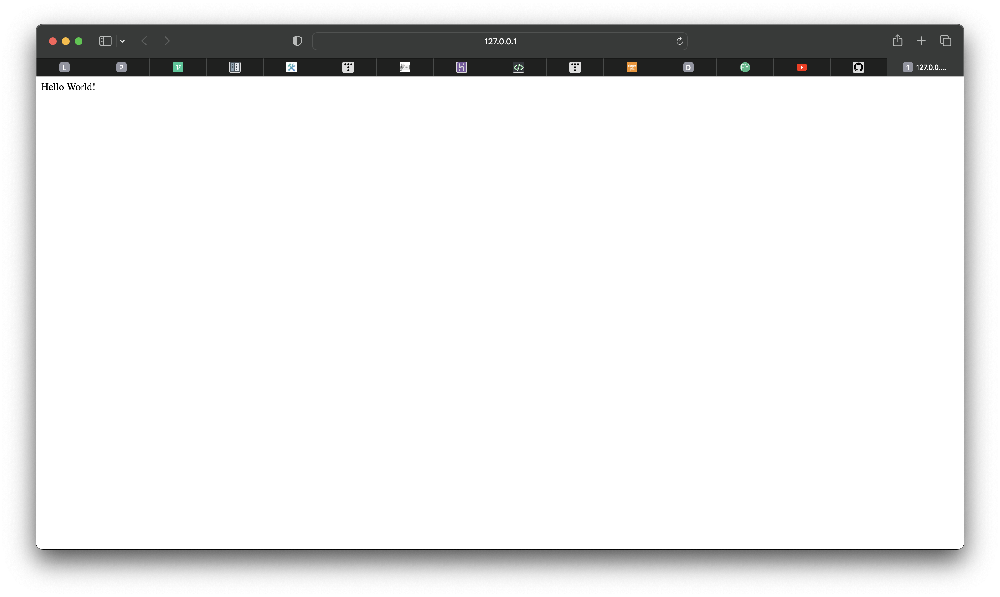
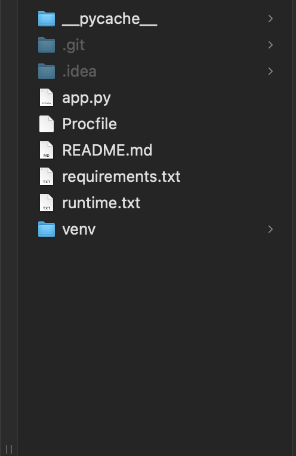
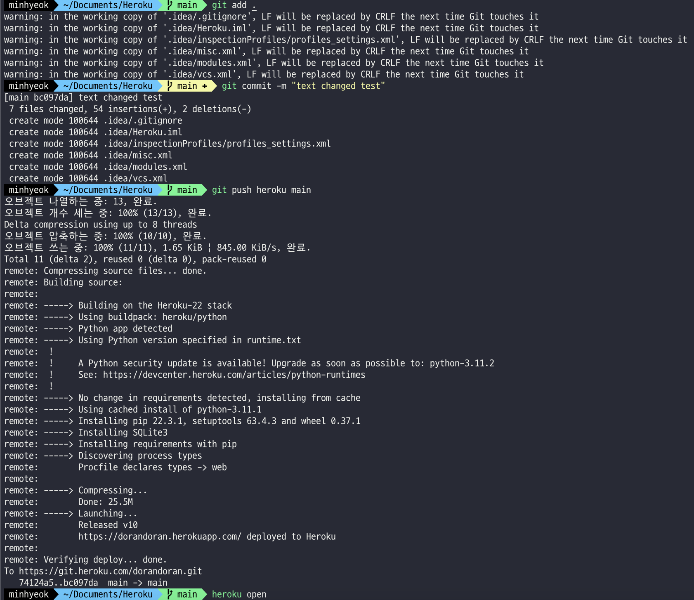
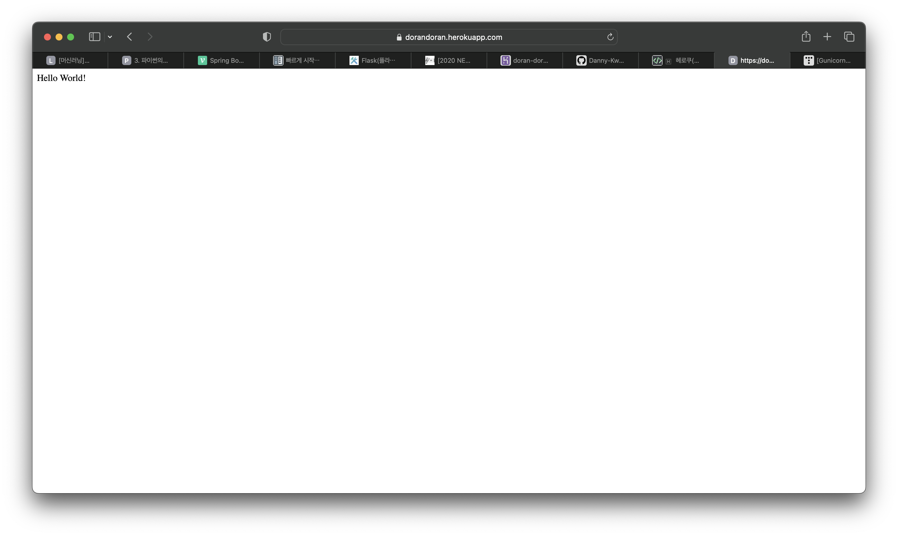

프로젝트의 첫 할일은, "Flask 서버를 구축해서 Spring 서버와 통신을 해보자!" 였다.
아직 파이썬이나 딥러닝에 익숙하지 않은 필자이기에 여러모로 공부가 필요한 상황이지만, 파이썬으로 웹 서버 만들기에 도전하게 되었다.
Flask 웹 서버로 해주어야할 기능은:
1. Spring 서버로 부터 사진이 저장된 링크를 수신한다.
2. 수신한 링크에 접속하여 사진을 받아, 딥러닝 모델에 대입시킨다.
3. 딥러닝 모델로부터 받아온 결과를 다시 Spring 서버로 반환한다.(선정성이 높은 사진인지, 아닌지 이진분류를 통하여)

신고 기능을 구현받아 정확히 분류되지 못한 사진을 다시 검토하는 등 추가 기능들도 있어야하지만, 큰 범주에서는 이렇게 세 가지 기능이 필수적이다.
그럼 파이썬에서는 어떻게 서버를 구축할까?
알아보기 위해 우선 간단한 파이썬 예제 코드를 가져왔다.

```python
from flask import Flask

app = Flask(__name__)

@app.route('/')
def hello_world():
    return 'Hello World!"

if __name__ == '__main__':
    app.run()

```

위의 파이썬 코드를 작성하면, Flask 서버가 만들어진다.
여기서 중요하게 봐야할 부분은 @app.route('/')와 그 밑에 정의된 함수들이다.
여기에 REST API를 사용하여 각 해당 URI에서 어떤 방식을 사용하게 될지 정할 수 있다.
바로 밑에 있는 함수에서는 자세한 기능을 적어주는데, 위의 코드에서는 간단하게 Hello World! 라는 문자를 화면에 띄워주는 역할을 한다.



이렇게 하면 간단히 로컬에서 127.0.0.1:5000에 접속하여 확인할 수 있는 웹 페이지가 만들어졌다.
자세한 기능을 어떻게 구성할지는 다음에 살펴보기로 하고, 이번에는 이 웹 어플리케이션을 어떻게 외부에서 열어볼 수 있을지에 대해서 알아보았다.
필자는 이전에 프로젝트들을 진행하며, AWS 웹 호스팅 서비스를 사용해보기도 했고, Raspberripi에서 Ubuntu Linux로 배포해 보기도 했다.
그러나 이번엔 라즈베리파이 기기가 없는 점도 있고, AWS에서 예상치 못한 과금이 생겼던 전적도 있었기에 다른 서비스를 사용해 보기로 했다.

따라서 Heroku 서비스를 이용한 '무료 웹 호스팅'을 진행했다.
Heroku 서비스를 이용하기 위해서는 우선 Heroku 계정과 깃허브 Repository가 필요하다.
우선 가상환경을 켜주도록 하자. 필자는 virtualenv를 활용하였다.

우선 원하는 경로에 접속한후,
```bash
virtualenv venv
source venv/bin/activate
```
를 작성하여 가상환경을 활성화 시켜준다.

그 다음, gunicorn을 설치한다.(Heroku 에서는 Flask를 바로 인식할 수 없기 때문에 gunicorn이라는 인터페이스를 거쳐야한다.)
```bash
pip install gunicorn
```
그리고 이 디렉터리에는 Procfile과 requirements.txt 라는 파일이 필수적으로 존재해야 한다.



결과적으로 위 사진과 같은 파일들로 구성이 되게 되는데, 위에 언급한 파일들 외의 파일들은 필수적인지 잘 모르겠다.

우선 Procfile은 Heroku에게 프로그램 진입점을 알려주는 역할을 하는 파일이고, 아래와 같이 작성한다

```txt
web: gunicorn app:app
```
여기서 띄어쓰기는 보이는 그대로 똑같이 작성해야만 하며, app.py라는 파일을 app이라고 작성하면 된다.
예를들어 서버 코드가 작성된 파일이름이 main.py인 경우 'web: gunicorn main:app' 이라고 작성하면 된다.

다음으로, requirements.txt 는 이 웹프로그램에서 필요한 모듈들의 버전을 명시해주는 파일이다.

```bash
pip freeze > requirements.txt
```
의 코드를 작성하여 이 파일을 만들 수 있고, 내부에 작성하는 요령은 다음과 같다.

```txt
click==7.1.2
Flask==1.1.2
gunicorn==20.1.0
itsdangerous==1.1.0
Jinja2==2.11.3
MarkupSafe==1.1.1
Werkzeug==1.0.1
```
필자는 이와 같이 구성했다.
처음에는 gunicorn==20.1.0 만 작성하고 실행을 하려 했는데, H10 오류가 나면서 http 503 오류코드가 전송되었다.
이런 일이 발생되었을 때 Procfile에서 입력 실수가 있었을 경우가 많다는 검색 결과를 믿고 Procfile을 열심히 수정해보려고 했으나, requirements.txt에 모든 모듈이 작성되어 있지 않아서 그런 문제가 발생한 것이었다.

그 다음 runtime.txt를 만들어 python 버전을 적어준다.

```txt
python-3.11.1
```
여기서 Heroku는 모든 버전의 python이 동작가능한 것은 아니기 때문에, 잘 찾아보고 원하는 버전을 활용하기를 바란다.

이제 Heroku를 깃허브 레포지토리에 연결하는 과정을 거치면 되며, Heroku 사이트에 접속하여 웹 어플리케이션을 등록한 후 github 레포지토리 연결 및 자동 Deploy 까지 설정해주면 된다.
이 부분은 Heroku 홈페이지에 접속하면 쉽게 해결할 수 있는 부분이기에 특별한 언급 없이 넘어가도록 하겠다.

마지막으로, 로컬에서 Heroku에 연결하는 과정만 해결하면 된다.

1. git init
2. git remote add origin "깃 레포지토리 주소"
의 과정을 통해서 본인의 레포지토리를 리모트 해주고,



위 사진과 같이
1. git add .
2. git commit -m "message"
3. git push heroku main

의 코드들을 작성하여 heroku에 배포를 완료할 수 있다.
그리고 해당 웹사이트의 url을 직접 입력하여 들어가거나 heroku open 명령어를 이용해서 스스로 만든 웹 어플리케이션에 접속할 수 있다.

에려 내역을 확인하고 싶다면

```bash
heroku logs --tail
```
의 코드를 작성하여 로그를 확인해볼 수 있다.


외부에서도 접속이 가능한 url이 정상적으로 작동하는 모습이다.

```bash
2023-02-09T09:37:38.000000+00:00 app[api]: Build started by user "사용자 이름"
2023-02-09T09:37:51.900438+00:00 heroku[web.1]: Restarting
2023-02-09T09:37:51.927157+00:00 heroku[web.1]: State changed from up to starting
2023-02-09T09:37:51.349090+00:00 app[api]: Release v10 created by user "사용자 이름"
2023-02-09T09:37:51.349090+00:00 app[api]: Deploy bc097daf by user "사용자 이름"
2023-02-09T09:37:52.681570+00:00 heroku[web.1]: Stopping all processes with SIGTERM
2023-02-09T09:37:52.732155+00:00 app[web.1]: [2023-02-09 09:37:52 +0000] [7] [INFO] Worker exiting (pid: 7)
2023-02-09T09:37:52.732298+00:00 app[web.1]: [2023-02-09 09:37:52 +0000] [2] [INFO] Handling signal: term
2023-02-09T09:37:52.732486+00:00 app[web.1]: [2023-02-09 09:37:52 +0000] [8] [INFO] Worker exiting (pid: 8)
2023-02-09T09:37:52.735339+00:00 app[web.1]: [2023-02-09 09:37:52 +0000] [2] [WARNING] Worker with pid 7 was terminated due to signal 15
2023-02-09T09:37:52.832779+00:00 app[web.1]: [2023-02-09 09:37:52 +0000] [2] [INFO] Shutting down: Master
2023-02-09T09:37:53.022742+00:00 heroku[web.1]: Process exited with status 0
2023-02-09T09:37:53.200906+00:00 heroku[web.1]: Starting process with command `gunicorn app:app`
2023-02-09T09:37:54.339523+00:00 heroku[web.1]: State changed from starting to up
2023-02-09T09:37:54.226654+00:00 app[web.1]: [2023-02-09 09:37:54 +0000] [2] [INFO] Starting gunicorn 20.1.0
2023-02-09T09:37:54.226977+00:00 app[web.1]: [2023-02-09 09:37:54 +0000] [2] [INFO] Listening at: http://0.0.0.0:32319 (2)
2023-02-09T09:37:54.227017+00:00 app[web.1]: [2023-02-09 09:37:54 +0000] [2] [INFO] Using worker: sync
2023-02-09T09:37:54.230059+00:00 app[web.1]: [2023-02-09 09:37:54 +0000] [7] [INFO] Booting worker with pid: 7
2023-02-09T09:37:54.236673+00:00 app[web.1]: [2023-02-09 09:37:54 +0000] [8] [INFO] Booting worker with pid: 8
2023-02-09T09:37:55.000000+00:00 app[api]: Build succeeded
2023-02-09T09:38:08.302042+00:00 heroku[router]: at=info method=GET path="/" host=dorandoran.herokuapp.com request_id=debe36e7-0f6b-496e-a01a-7f9ecb5c8fea fwd="222.238.106.88" dyno=web.1 connect=0ms service=1ms status=200 bytes=157 protocol=https
2023-02-09T09:38:08.301511+00:00 app[web.1]: 10.1.54.135 - - [09/Feb/2023:09:38:08 +0000] "GET / HTTP/1.1" 200 5 "-" "Mozilla/5.0 (Macintosh; Intel Mac OS X 10_15_7) AppleWebKit/605.1.15 (KHTML, like Gecko) Version/16.3 Safari/605.1.15"
```
로그를 보면 HTTP STATUS=200으로 정상작동 하는 것을 확인할 수 있다.