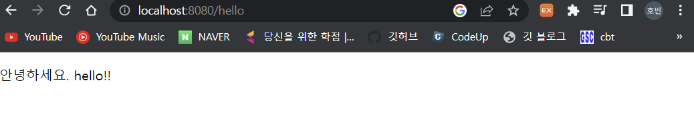
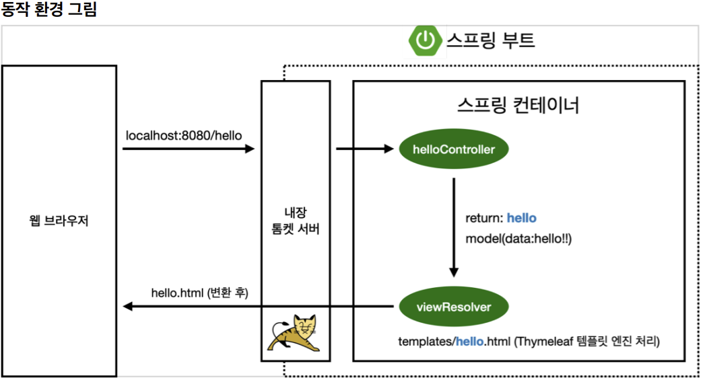

# 0. view 환경 설정

## Welcome Page 만들기

- springboot 에서 welcomepage 는 resources > static > index.html 을 기본적으로 찾는다.

- 따라서 해당 폴더에 index.html 을 설정해놓으면 기본페이지 생성가능

- 기본페이지(localhost:8080)

- ```html
  <!DOCTYPE HTML>
  <html>
  <head>
   <title>Hello</title>
   <meta http-equiv="Content-Type" content="text/html; charset=UTF-8" />
  </head>
  <body>
  Hello
  <a href="/hello">hello</a>
  </body>
  </html>
  ```

  

## thymeleaf 템플릿 엔진을 통한 페이지 생성

### /hello 페이지 생성

- Controller 생성

- ```java
  @Controller
  public class HelloController {
   @GetMapping("hello")
   public String hello(Model model) {
   model.addAttribute("data", "hello!!");
   return "hello";
   }
  }
  ```

  - model 을 통해 key 값("data") 와 value 값("hello!!") 를 만들고 "hello" 를 리턴한다.

### hello.html 생성

- ```html
  <!DOCTYPE HTML>
  <html xmlns:th="http://www.thymeleaf.org">
  <head>
   <title>Hello</title>
   <meta http-equiv="Content-Type" content="text/html; charset=UTF-8" />
  </head>
  <body>
  <p th:text="'안녕하세요. ' + ${data}" >안녕하세요. 손님</p>
  </body>
  </html>
  
  ```

  - th:text 를 통해 키값(data) 로 value 값(hello!!) 을 받음

- 

### 동작환경 그림

- 

- 컨트롤러에서 리턴값으로 문자를 반환하면 viewResolver 가 찾아서 처리한다.
- 즉, return 값으로 "hello" 를 반환하였으므로 resources 에서 hello.html 을 찾음
  - resources:templates/ + {ViewName} + .html

## 빌드하고 실행하기

- intellij 가 아닌 직접 실행하기 위해 빌드
- 콘솔에서 /gradlew build 로 빌드하면 build 폴더에 libs 가 생김
- 해당 폴더에서 java -jar hello-spring-0.0.1-SNAPSHOT.jar 로 실행
- hello-spring 에서 /gradlew clean 으로 build 폴더 삭제 가능 -> 빌드가 잘 안될 떄 삭제 후 다시 빌드하면 된다.