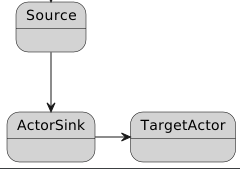
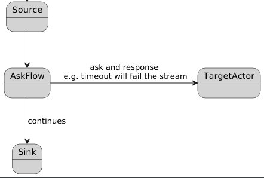
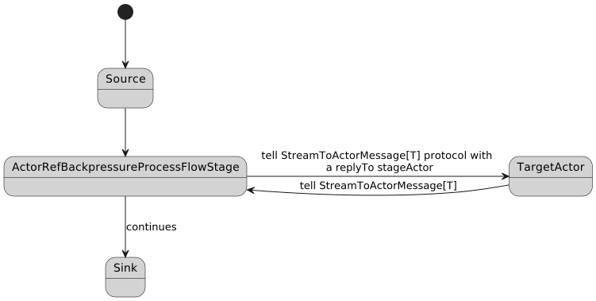

_This article is brought to you by [Niklas Uhrberg](https://github.com/niklasuhrberg), a Rock the JVM alumnus who is a software architect with a focus on distributed systems. He's passionate about Scala, Akka and Kafka, and this piece is derived from his real-world experience._

> If you want to learn Akka, we have more than 40 hours of training here at Rock the JVM in the [Akka Bundle](https://rockthejvm.com/p/the-akka-bundle), which ties in very well with this article.

_Enter Niklas:_

Akka Streams and Akka actors-based code have their distinct properties and bridging between these two programming models
is useful in some scenarios. This is an account of a way to enhance the standard ways to bridge the gap. To make the
most out of this text the reader should know Akka Streams ([taught here](https://rockthejvm.com/p/akka-streams) at Rock the JVM) and actors and ideally have some experience using them together. The reader is encouraged to study the example code on [GitHub](https://github.com/niklasuhrberg/akka-streamtoactor-interop) (see references) to get the full context and to experiment with the examples. In real world scenarios, using stream elements that originate from actors or enter an actor
based part of a system is an excellent way of connecting Akka Streams to other types of processing.

## 1. Motivation - Stream to Actor Scenario

Let's consider a common scenario: subscribing to a Kafka topic and processing the messages. Assume that the processing
of each message involves actor based processing, i.e. not just processing in Akka flows within an Akka stream. Depending on your requirements, this may not be so simple.

There are two standard approaches, both of which are described in the Akka documentation:

1. Define a Sink using `ActorSink.actorRefWithBackpressure` with a protocol for backpressure and lifecycle, i.e. messages
   to initiate, finish and ack to control backpressure. Then connect the sink to the source, where Alpakka Kafka is often
   used.

   

2. Use the ask pattern in an Akka Flow. This can be done in plain vanilla style or with the `ActorFlow.ask` flow which is
   just a small convenience utility.

   

Now to the core of why this article was written: Neither of these two approaches or variants thereof satisfy all the
following reasonable requirements:

1. The Kafka commit must not happen until the processing in "actor land" is completed.
2. There must be no arbitrariness about the error handling, i.e. no unknown states or outcomes.
3. An error in the stream part must be propagated to the actor part.
4. The actor based part must be able to process messages asymmetrically, i.e. sometimes receive more or fewer messages
   than emitted downstream.

## 2. Analysis of the Standard Approaches

The actor sink based approach has no room for committing to Kafka conditionally, if you don't go at length and commit
inside the actor part in some way. In short, if you do not use auto commit, it's an impractical setup. You will
recognize this approach sketched in

```scala
val source = akka.kafka.scaladsl.Consumer
      .committableSource(...) // In practice autocommit will be enabled
val sink = Sink.actorRefWithBackpressure(
  targetActor, // The actor processing the logic
  onInitMessage = InitMessage, // Backpressure and lifecycle protocol
  ackMessage = AckMessage,
  onCompleteMessage = OnCompleteMessage,
  onFailureMessage = onErrorMessage)

source.runWith(sink)
```

I will leave it at that and instead discuss the ask based approach more in detail since it has a straight forward
solution for the Kafka commits.

Let's start by going through the requirements above. Akka Streams has excellent support for committing to Kafka in
different ways. See the code snippet where an Akka source is connected and run with the Alpakka committer sink.

This way the messages will not be committed in case the stream fails before reaching the committer sink and the commit
step can be skipped based on application logic by simply not propagating the message all the way to the committer sink
(see the example application on GitHub accompanying this article).

The snippet below intentionally leaves out an interesting part in the SomePassthroughFlow. The role of this flow is to
propagate the Kafka related information needed by the sink, but being irrelevant for the actor. If we do not use a
pass-through flow we would have to pollute the actor message protocol with Kafka related information which is clearly
not desirable. (Describing a pass-through flow is outside the scope of this article, it is a standard concept in
streaming applications)

```scala
val source = akka.kafka.scaladsl.Consumer
      .committableSource(...)
val actorFlow = ActorFlow.ask[Int, Invocation, ProcessMessage](targetActor) { (in, ref) =>
   Invocation(s"Invocation no $in", ref)
}

sampleSource
   .via(SomePassThroughFlow(actorflow))
   .runWith(Committer.sink(CommitterSettings(system))
```

The remaining requirements 2–4 are more problematic.

The ask pattern is used with a timeout that, while suitable for many scenarios, sometimes may not make sense. A
timeout leaves the stream part clueless about what happened in the actor processing part, all it knows is that it has
taken longer time that it was willing to wait. If the ask times out everything in the actor part may have gone perfectly
well, only that it took longer time than expected. You might therefore be inclined not to use an approach that mandates
a timeout.

Next to requirement 3 about the actor being notified if the stream fails which is clearly a cumbersome shortcoming of
the ask based approach should you need this. Study the flow below for a small snippet from the accompanying source code
for this article.

```scala
val askFlow: Flow[Int, ProcessMessage, NotUsed] =
      ActorFlow.ask[Int, Invocation, ProcessMessage](targetActor)((in, q) => Invocation(s"Invocation no $in", q))

Source(1 to 5)
  .map {
    case 3 =>
      logger.debug(s"Step 1, 3 arrived, will throw exception")
      throw new IllegalStateException("3 is a bad number")
    case other => other
  }
  .via(askFlow)
  .runWith(Sink.foreach(response => logger.debug(s"Got response $response"))
```

The target actor (not defined in the snippet) will never know if the stream fails or completes unless this is handled
separately and explicitly. You therefore face risks, for example that of not cleaning up resources. It should be noted
though that it is possible to e.g. handle the notification of the target actor outside the stream itself, by
connecting that functionality to the completion or failure of the stream. See the following snippet for an example.

```scala
val futureDone = Source(1 to 5)
      .via(askFlow)
      .runWith(Sink.foreach(response => logger.debug(s"Got response $response")))
   // This handles the propagation of stream completion or failure to the actor
    futureDone.onComplete {
      case Success(value) => logger.debug("Stream with ask completed successfully")
        targetActor ! StreamCompleted
      case Failure(exception) => logger.error(s"Stream with ask failed with ${exception.getMessage}")
        targetActor ! StreamFailed
    }
```

Finally, to requirement 4 which is about the multiplicity of messages flowing through the actor based part. In the ask
based approach there is only one possibility, one message in and one message out (the ask response). If you need to send
multiple responses this is simply not possible, but in Akka Streams there is nothing preventing you from emitting
multiple messages downstream from a flow no matter what happens upstream and vice versa, having a flow consuming
messages without emitting. This is a perfectly viable usage in the example use case with Kafka message processing.

Let's assume that some messages cannot be processed immediately, and you wish to store them for later processing, for example
using Akka Persistence, but still continue fetching more Kafka messages. Then it makes perfect sense to sometimes emit
more messages from the actor based flow to enable monotonically increasing offset for the commit step. You might have
some messages that should have a commit as a consequence and others that do not, if each Kafka message is firstly
processed by either storing it or handling the message immediately and then the stored messages are processed later
causing emit downstream but without Kafka commit.

```scala
def inflowFromKafka(messageIn:KafkaMessageWithCommitInfo)= {
  if(shouldStoreForLater(messageIn)) {
    store(messageIn)
    emitMessageSignallingKafkaCommit
  }
}

def processStoredMessage = {
  val message = obtainASuitablStoredMessageForProcessing
  emitMessageSignallingProcessedResult(process(message))
}
```

The pseudocode above expresses some aspects of the use case sketched to show that there can be multiple emitted
messages for one message in. One Kafka message in can result in one message out to signal Kafka commit because the
information has been successfully stored and then later when the stored information is properly processed achieving the
desired result, it is propagated downstream using a second message. This is not possible to achieve with the ask based
approach, leading us to the next approach.

## 3. The StageActor Approach
Now that we can appreciate the pros and cons using the standard approaches with an actor based sink and the variants of
actor based flows it's time to present an alternative approach that will satisfy all the requirements described above.
The general setup has the same anatomy as the ask based flow with the important difference that the communication with
the target actor is now based on actor messaging which is not restricted to request - response style.



ActorRefBackpressureProcessFlowStage is the name of a custom GraphStage used in the example code and
StreamToActorMessage[T] is the messaging protocol used to control message passing and backpressure.
To set up a stream according to the diagram above we will have the target actor process StreamToActorMessage[T] messages
and construct the ActorRefBackpressureProcessFlowStage passing the actor ref of the target actor.
The StreamToActorMessage[T] message protocol will be described in detail, for now we note that they serve the same
purpose as in the sink based approach to manage the stream semantics.

```scala
val targetActor = ctx.actorOf(PropsAdapter[StreamToActorMessage[FlowMessage]](TargetActor()))
val actorFlow: Flow[FlowMessage, FlowMessage, NotUsed] =
     Flow.fromGraph(new ActorRefBackpressureProcessFlowStage[FlowMessage](targetActor))
```

Internally the ActorRefBackpressureProcessFlowStage uses the stage actor, a perhaps not so well known part of the
Akka Streams toolbox. In short, the stage actor (although it's not an actor per se) imitates some actor functionality
and can be used inside a custom GraphStage to communicate with the "outside world".

The following is an excerpt from the GraphStage documentation:

```scala

/*
Initialize a StageActorRef which can be used to interact with from the outside world "as-if" an [[Actor]].
The messages are looped through the getAsyncCallback mechanism of GraphStage so they are safe to modify
internal state of this operator.
 */

final protected def getStageActor(receive: ((ActorRef, Any)) => Unit): StageActor

/**
   * Minimal actor to work with other actors and watch them in a synchronous ways
   *
   * Not for user instantiation, use [[#getStageActor]].
   */
final class StageActor @InternalApi() private[akka]
```

By creating a custom Flow component using the stage actor we can create a bridge from the stream to the actor based part
of an application that has all the properties we desire. Let's now see in some more detail exactly how this is achieved.
We start out with a custom GraphStage, `ActorRefBackpressureProcessFlowStage`,  from which we want to communicate with
the actor based part of an application. The point of communication with this is naturally an actor, the target actor
embodying "the outside world" mentioned in the Akka docs above. The communication from  ActorRefBackpressureProcessFlowStage
to the target actor is just ordinary actor message passing.
The first message passed to the target actor in this example:

```scala
// In ActorRefBackpressureProcessFlowStage
targetActor ! StreamInit[T](self.ref) //self.ref is the stage actor ref
```

and in the target actor

```scala
case StreamInit(replyTo) => // replyTo is the stage actor
      logger.debug("Received StreamInit, will signal demand by responding ack")
      replyTo ! StreamAck
      Behaviors.same
```

and the other way is mediated via the stage actor. An abbreviated example:

```scala
getStageActor({
   case (_, StreamAck) =>
     onAck()
   case StreamElementIn(msg:Invocation, replyTo)  =>
   case (_, StreamElementOut(elemOut)) =>
     onElementOut(elemOut)
// Only some cases mentioned here for brevity
})
```

The messaging protocol used between the stage actor and the target actor serves two purposes. Communicating the
application specific information and the stream lifecycle and backpressure signalling. `StreamToActorMessage[T]` is just
the trait used in the example code, where T is the type of the application specific message that is tunneled to the
target actor.
The `StreamToActorMessage` trait contains virtually the same type of messages used in the sink based approach.

```scala
case class StreamInit[T](replyTo:ActorRef[StreamToActorMessage[T]]) extends StreamToActorMessage[T]
case object StreamAck extends StreamToActorMessage[Nothing]
case object StreamCompleted extends StreamToActorMessage[Nothing]
case class StreamFailed(ex: Throwable) extends StreamToActorMessage[Nothing]
case class StreamElementIn[T](msg: T, replyTo:ActorRef[StreamToActorMessage[T]]) extends StreamToActorMessage[T]
case class StreamElementOut[T](msg: T) extends StreamToActorMessage[T]
case class StreamElementOutWithAck[T](msg:T) extends StreamToActorMessage[T]
```

The interaction starts with the target actor receiving a StreamInit message. This is when it gets hold of the stage
actor ref and can start communicating with it. The replyTo in this message is a reference to the stage actor.
At some point in time the target actor responds with a StreamAck message to signal demand, which triggers the stream
to start processing. The next step typically is the StreamElementIn message through which the application specific
message (of type T) is tunneled. At this point the target actor may either signal more demand, cause downstream emit
by responding StreamElementOut or both in any order it sees fit.

StreamCompleted will be sent to the target actor on stream completion, and StreamFailed on stream failure.
The target actor may use StreamElementOutWithAck as a convenience combining emitting an element and signalling demand at the same time. Communicating failure from the target actor to the stream is triggered by the target actor stopping which is detected by the stage actor watching the target actor. This is a full-bodied protocol for managing stream processing both ways including completion and failure.

In the vocabulary of Akka Streams the ActorRefBackpressureProcessFlowStage:

* __Emits__ when the target actor sends a message to the stage actor and downstream signals demand
* __Backpressures__ unless the target actor signals demand
* __Completes when__ the upstream completes
* __Fails__ when the target actor terminates
* __Cancels__ when downstream cancels

The stage based actor approach to this problem has been addressed e.g. by Frank van Meeuwen. I have used the code with
kind permission in this article and the original source code can be found on GitHub. (See references)

## 4. Putting the StageActor to Use

It's about time to take a look at the example code with some code snippets.
Example target actor code showing two elements out for each element in:

```scala
def apply():Behavior[StreamToActorMessage] = Behaviors.receiveMessage[StreamToActorMessage] {
    case StreamInit(replyTo) =>
      replyTo ! StreamAck // The first interaction
      Behaviors.same

    case StreamElementIn(msg, replyTo)  =>
      replyTo ! StreamElementOut(Response(msg.name, Random.nextInt(100)))
      replyTo ! StreamElementOut(Response(msg.name, Random.nextInt(100))
      replyTo ! StreamAck // Signal more demand
      Behaviors.same
}
```

Remember that the stage actor approach completely decouples the rate of elements consumed by the custom flow from
the rate of elements emitted by it.

A simple example putting the central piece in a context that is runnable:

```scala
object StreamWithStageActor extends LazyLogging {

  implicit val timeout = Timeout(5.seconds)

  def apply(): Behavior[Nothing] = Behaviors.setup[Nothing] { ctx =>
    implicit val system: ActorSystem[_] = ctx.system
    import system.executionContext
     // The PropsAdapter is necessary because the stage actor is classic Akka
    val targetActor = ctx.actorOf(PropsAdapter[StreamToActorMessage[FlowMessage]](TargetActor()))
    val actorFlow: Flow[FlowMessage, FlowMessage, NotUsed] =
      Flow.fromGraph(new ActorRefBackpressureProcessFlowStage[FlowMessage](targetActor))
        val value = Source(1 to 3)
          .map(number => Invocation(s"Name $number"))
          .via(actorFlow)
          .log("logflow", response => s"Got response $response")
          .runWith(Sink.ignore)

    value onComplete {
      case Success(value) => logger.debug("Stream completed successfully")
      case Failure(exception) => logger.error(s"Stream failed with $exception")
    }
    Behaviors.empty
  }
}
```

In the accompanying code on GitHub, there are more involved streams examples  both using the ask based approach and
the stage actor based approach to make it easy to play around with different variants that show how recovering,
throwing exceptions both in the stream part and in the actor part will affect the behavior.
See the comments in the code and README file.

## 5. Inside the custom GraphStage

Lastly a few glimpses of the ActorRefBackpressureProcessFlowStage code. While explaining the GraphStage is outside
the scope of this article, just peeking into a couple of part is enlightening.

Basically a custom GraphStage is created by encoding the behavior when elements flow in, emit elements and keep track
of the logic for when demand should be signaled and the lifecycle functionality.

At the outset the preStart method will be called, which is pretty self-explanatory. Self, the actual stage actor,
watches our target actor to manage the failure logic. Also, the StreamInit message is passed onto the target actor to
bootstrap the interactions.

```scala
private lazy val self = getStageActor(stageActorReceive)

override def preStart(): Unit = {
  self.watch(targetActor)
  tellFlowActor(StreamInit[T](self.ref))
  expectingAck = true
}
```

The `stageActorReceive` method defines the stage actor behavior. Without going into details the code should give a feeling of the
translational functionality.

```scala
def stageActorReceive(messageWithSender: (ActorRef, Any)): Unit = {
  def onAck(): Unit = {
    firstAckReceived = true
    expectingAck = false
    pullIfNeeded()
    completeStageIfNeeded()
  }

  def onElementOut(elemOut: Any): Unit = {
    val elem = elemOut.asInstanceOf[T]
    emit(out, elem)
  }

  messageWithSender match {
    case (_, StreamAck) =>
      onAck()
    case (_, StreamElementOut(elemOut)) =>
      onElementOut(elemOut)
    case (_, StreamElementOutWithAck(elemOut)) =>
      onElementOut(elemOut)
      onAck()
    case (actorRef, Failure(cause)) =>
      terminateActorAndFailStage(new RuntimeException(s"Exception during processing by actor $actorRef: ${cause.getMessage}", cause))

    case (_, Terminated(targetRef)) =>
      failStage(new WatchedActorTerminatedException("ActorRefBackpressureFlowStage", targetRef))

    case (actorRef, unexpected) =>
      terminateActorAndFailStage(new IllegalStateException(s"Unexpected message: `$unexpected` received from actor `$actorRef`."))
  }
}
```

On the other side, in the GraphStage handlers api we can see the corresponding for the stream interaction.
The InHandler and OutHandler traits are the core of the api.

```scala
setHandler(in, new InHandler {
  override def onPush(): Unit = {
    val elementIn = grab(in)
    targetActor ! StreamElementIn[T](elementIn, self.ref)
    expectingAck = true
  }

  override def onUpstreamFailure(ex: Throwable): Unit = {
    self.unwatch(targetActor)
    targetActor ! StreamFailed(ex)
    super.onUpstreamFailure(ex)
  }

  override def onUpstreamFinish(): Unit = {
    if(!expectingAck) {
      self.unwatch(targetActor)
      targetActor ! StreamCompleted)
      super.onUpstreamFinish()
    }
  }
})

setHandler(out, new OutHandler {
  override def onPull(): Unit = {
    if (!firstPullReceived) {
      firstPullReceived = true
      pullIfNeeded() //Only do the first pull
    }
  }

  override def onDownstreamFinish(cause: Throwable): Unit = {
    self.unwatch(targetActor)
    targetActor ! StreamCompleted)
    super.onDownstreamFinish(cause)
  }
})
```

## 6. Another Take on Pass-Through

The careful reader may have spotted a gap in the account of the stage based approach in the context of the original
use case with Kafka where committing is a crucial part.

In the ask based example we saw the pass-through flow in action, which basically zips together the element that should
pass through (carrying the information later used for Kafka commits) with the response from the target actor.
You might now ask what happens in the stage based approach if the target actor responds multiple times for a single
message in. The answer is it will simply not work without some modification.

The complexity of the solution depends on the case at hand, and one example solution is provided in the example code.
There must be some management of state and a mapping from messages to the target actor and messages from the target actor.
Sticking to the use case with Kafka commit information, the most common scenario will be that there is one message from
the target actor that should be associated with the commit information and consequently the state can be deleted as soon
as that message has been observed. There must be some identifier to map a response message to the original message to
the target actor, and in an enterprise application setting this will already be present. The following is a
brief explanation of the simple example provided in the accompanying code.

The application messages must have an identifier:
```scala
object IdFlowMessages {
   trait FlowMessageWithId {
      def id: UUID
   }
   case class InvocationWithId(id: UUID, name: String) extends FlowMessageWithId
   case class ResponseWithId(id: UUID, name: String, sum: Int) extends FlowMessageWithId
}
```

The stream signature is now slightly different. The input to the stage actor based flow is a tuple of the application
message and the pass-through and the output is a tuple of the application message and an option of the pass-through
since not all flow elements will carry the pass-through on. Note that the term pass-through now has a slightly different
meaning. It just means the pass-through will accompany one message following the `PassthroughActorRefBackpressureProcessFlowStage`.

```scala
val targetActor = ctx.actorOf(PropsAdapter[StreamToActorMessage[FlowMessageWithId]](PassthroughTargetActor()))
val actorFlow: Flow[(FlowMessageWithId, PassThrough), (FlowMessageWithId, Option[PassThrough]), NotUsed] =
   Flow.fromGraph(new PassthroughActorRefBackpressureProcessFlowStage[FlowMessageWithId, PassThrough](targetActor))
```

Finally, a peek into the modified custom GraphStage, `PassthroughActorRefBackpressureProcessFlowStage`. It makes the assumption
about the application messages that they have an identifier and also keeps a mapping from this id to the pass-through internally.

```scala
class PassthroughActorRefBackpressureProcessFlowStage[T<:FlowMessageWithId, P]
(private val targetActor: ActorRef) extends GraphStage[FlowShape[(T, P), (T, Option[P])]] {

// ....

val passThroughMessageMapping: mutable.Map[UUID, P] =
   mutable.Map[UUID, P]()
// ....

override def onPush(): Unit = {
   val elementIn = grab(in)
   passThroughMessageMapping.put(elementIn._1.id, elementIn._2)
   tellTargetActor(StreamElementIn[T](elementIn._1, self.ref))
   expectingAck = true
}

def onElementOut(elemOut: Any): Unit = {
   val elem = elemOut.asInstanceOf[T]
   // .remove(elem.id) results in a Option that is folded over
   passThroughMessageMapping
      .remove(elem.id)
      .fold(emit(out, (elem, None)))(value => emit(out, (elem, Some(value))))
}
```

When an element arrives (onPush) its pass-through is associated with the identifier to be obtained later.
When onElementOut is processed the stored pass-through element is removed once it is not needed anymore and this simple
state management will be good enough for the normal case where not a very big number of elements are stored in the mapping
keeping the necessary state.

## 7. Conclusion

We have studied a custom Akka flow component based of the stage actor that gives us all the functionality to create a
full-blown interaction between Akka Streams and actor based code. This can be used in different use cases where the
functionality needs to include parts interacting with actor based code, or other code all together where an actor is
used as a bridge between the two. The standard approaches fall short of supporting different rate of input to output and
do not integrate the failure logic as in the showcased code.

### References

1. Sample applications for the ask based and stage actor based approaches described in the article:
   https://github.com/niklasuhrberg/akka-streamtoactor-interop
2. Frank van Meeuwen GitHub repo: https://github.com/fmeeuw/akka-playground
3. Akka Streams documentation on actor interoperability: https://doc.akka.io/docs/akka/current/stream/actor-interop.html
