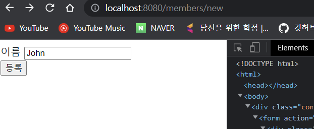
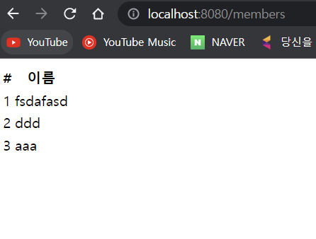

# 0. 홈화면 추가

## HomeController 추가

- "/" 가 homepage 이며, index.html 은 무시된다
- 이유는 톰캣에서 요청을 받으면 컨트롤러를 먼저 살펴보기 때문이다

- ```java
  package com.example.hellospring.controller;
  
  import org.springframework.stereotype.Controller;
  import org.springframework.web.bind.annotation.GetMapping;
  
  @Controller
  public class HomeController {
  
      //컨트롤러 우선이기 때문에 index 는 무시됨
      @GetMapping("/")
      public String home(){
          return "home";
      }
  }
  ```

  - return 값이 home 이므로 home.html 을 호출하여 렌더링한다.

## home.html

- templates 폴더에 생성

- ```html
  <!DOCTYPE HTML>
  <html xmlns:th="http://www.thymeleaf.org">
  <body>
  <div class="container">
      <div>
          <h1>Hello Spring</h1>
          <p>회원 기능</p>
          <p>
              <a href="/members/new">회원 가입</a>
              <a href="/members">회원 목록</a>
          </p>
      </div>
  </div> <!-- /container -->
  </body>
  </html>
  ```

  - 간단하게 a 태그로 회원가입과 회원목록

# 1. 등록

## 등록 컨트롤러

- ```java
  package com.example.hellospring.controller;
  
  import com.example.hellospring.domain.Member;
  import com.example.hellospring.service.MemberService;
  import org.springframework.beans.factory.annotation.Autowired;
  import org.springframework.stereotype.Controller;
  import org.springframework.ui.Model;
  import org.springframework.web.bind.annotation.GetMapping;
  import org.springframework.web.bind.annotation.PostMapping;
  
  
  @Controller
  public class MemberController {
  
      private final MemberService memberService;
  
      //생성자 주입
      @Autowired
      public MemberController(MemberService memberService) {
          this.memberService = memberService;
      }
  
      @GetMapping("/members/new")
      public String createForm(){
          return "members/createMemberForm";
      }
  }
  ```

  - templates > members 폴더 생성 후 createMemberForm.html 생성

## createMemberForm.html (회원등록 폼 HTML)

- ```html
  <!DOCTYPE HTML>
  <html xmlns:th="http://www.thymeleaf.org">
  <body>
  <div class="container">
      <form action="/members/new" method="post">
          <div class="form-group">
              <label for="name">이름</label>
              <input type="text" id="name" name="name" placeholder="이름을
  입력하세요">
          </div>
          <button type="submit">등록</button>
      </form>
  </div> <!-- /container -->
  </body>
  </html>
  ```

## 회원등록 폼 HTML 에서 데이터를 전달 받을 폼 객체

### 폼 객체 클래스

- 폼 객체 클래스는 controller 와 같은 폴더에 만든다.

- 이 때 웹에서 넘겨주는 post 방식의 name 대로 객체를 만든다. 

  - name="name" 이므로 String name 생성

- getter, setter 생성한다.

- ```java
  package com.example.hellospring.controller;
  
  public class MemberForm {
      private String name;
  
      public String getName() {
          return name;
      }
  
      public void setName(String name) {
          this.name = name;
      }
  }
  ```


### 데이터를 넘겨주고 받는 방식

1. 데이터를 post 방식으로 서버에 넘겨준다. 

   - 

2. 이 때 /members/new 으로 name 태그의 이름대로 넘긴다. 즉, name = "name" 이므로 서버에서 받을 때는 생성자의 setName 으로 받는다.

   - ```java
     //컨트롤러에서 PostMapping
     
     PostMapping("/members/new")
         public String create(MemberForm form){
             Member member = new Member();
             member.setName(form.getName());
     
             memberService.join(member);
     
             return "redirect:/";
         }
     ```

   - 해당 컨트롤러에서 create 의 생성자(MemberForm form)로 넘어온 데이터를 받는다.

3. form 으로 데이터를 받으면, setName 으로 MemberForm 이 생성된다.

4. form.getName() 으로 받아온 데이터를 사용하면 된다.

### redirect:

- return 값으로 redirect:/ 을 사용하면 홈화면으로 redirect, 다른 url 로 하면 다른 곳으로 redirect

# 2. 회원 조회

## 회원 조희 리스트 html

- members 패키지에 memberList.html 로 생성한다.

- ```html
  <!DOCTYPE HTML>
  <html xmlns:th="http://www.thymeleaf.org">
  <body>
  <div class="container">
      <div>
          <table>
              <thead>
              <tr>
                  <th>#</th>
                  <th>이름</th>
              </tr>
              </thead>
              <tbody>
  <!--       th:each 면 for:each 문법과 같이 루프문을 도는거임 -->
              <tr th:each="member : ${members}">
                  <td th:text="${member.id}"></td>
                  <td th:text="${member.name}"></td>
              </tr>
              </tbody>
          </table>
      </div>
  </div> <!-- /container -->
  </body>
  </html>
  ```

  - th:each="member : ${members}" 는 for:each 문법과 같이 각각의 member 에 대해 루프문을 돈다
  - 따라서 members 는 서버에서 리스트 형식으로 넘겨주면 된다.

## 회원 조회 controller

- ```java
  package com.example.hellospring.controller;
  
  import com.example.hellospring.domain.Member;
  import com.example.hellospring.service.MemberService;
  import org.springframework.beans.factory.annotation.Autowired;
  import org.springframework.stereotype.Controller;
  import org.springframework.ui.Model;
  import org.springframework.web.bind.annotation.GetMapping;
  import org.springframework.web.bind.annotation.PostMapping;
  
  @Controller
  public class MemberController {
  
      private final MemberService memberService;
  
      //생성자 주입
      @Autowired
      public MemberController(MemberService memberService) {
          this.memberService = memberService;
      }
  
    ...
  
      @GetMapping("/members")
      public String management(Model model){
          model.addAttribute("members", memberService.findMembers());
          return "members/memberList";
      }
  }
  ```

  1. memberService.findMembers() 를 통해서 모든 멤버를 리스트 형식으로 받는다.

  2. Model model 을 통해서 모든 멤버를 리스트 형식으로 model 에 넘겨준다.
     - model.addAttribute("members", memberService.findMembers());
  3. 웹에서 각 member 별로 id, name 을 렌더링
     - 
  4. return "members/memberList" 페이지 렌더링