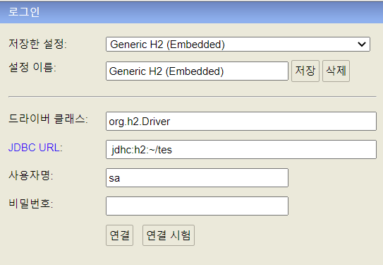
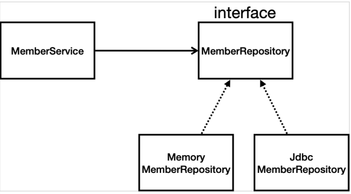
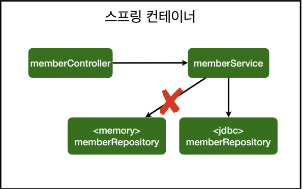
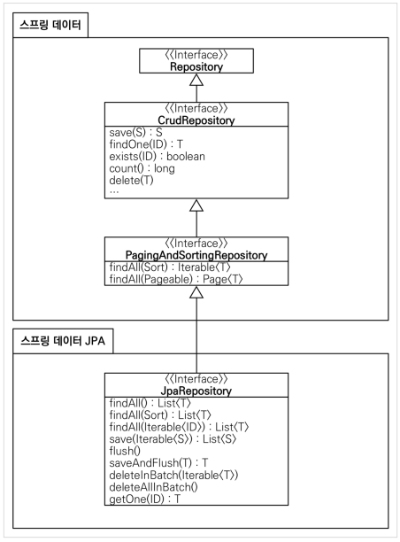

# 0. H2 DB 설치

- 개발이나 테스트 용도로 가볍고 편리한 DB, 웹 화면을 제공한다.
- h2는 1.4.200 버전으로 설치
- H2/bin/h2.bat 파일 실행 후 최초 jdhc:h2:~/test 로 실행한다.
  - 

- 이후부터는 jdbc:h2:tcp://localhost/~/test 로 실행한다.
  - 소켓으로 접속하는 방법이다.

## H2 DB 에 테이블 생성

- ```sql
  drop table if exists member CASCADE;
  create table member
  (
   id bigint generated by default as identity,
   name varchar(255),
   primary key (id)
  );
  ```

  - name, id 생성

- 테이블 관리를 위해 프로젝트 루트에 `sql/ddl.sql `파일을 생성하여 붙여넣는다.

## DB 에 멤버 생성

- `insert into MEMBER(name) values('Hobeen')` 로 생성

- id 는 자동으로 생성된다.

# 1. 순수 JDBC

## 환경설정

- build.gradle 파일에 jdbc, h2 데이터베이스 관련 라이브러리 추가
  - implementation 'org.springframework.boot:spring-boot-starter-jdbc' 
  - runtimeOnly 'com.h2database:h2'

- 스프링 부트 데이터베이스 연결 설정 추가(resources/application.properties)
  - spring.datasource.url=jdbc:h2:tcp://localhost/~/test
  - spring.datasource.driver-class-name=org.h2.Driver 
  - spring.datasource.username=sa

## JdbcRepository 구현

- 현재는 사용하지 않으므로 참고만 하면 된다.
- 코드 생략...

## 스프링 설정 변경

- configuration 에서 Repository Bean 설정을 변경해야 한다.

- ```java
  @Configuration
  public class SpringConfig {
  
      private DataSource dataSource;
  
      @Autowired
      public SpringConfig(DataSource dataSource) {
          this.dataSource = dataSource;
      }
  
      @Bean
      public MemberService memberService(){
          return new MemberService(memberRepository());
      }
  
      @Bean
      public MemberRepository memberRepository(){
          //return new MemoryMemberRepository();
          return new JdbcMemberRepository(dataSource);
      }
  }
  ```

  - DataSource 는 spring 에서 자동으로 주입하는 데이터
  - DataSource는 데이터베이스 커넥션을 획득할 때 사용하는 객체다. 스프링 부트는 데이터베이스 커넥션 정보를 바탕으로 DataSource를 생성하고 스프링 빈으로 만들어둔다. 그래서 DI를 받을 수 있다.
  - interface 인 memberRepository 의 return 값을 변경해주는 것으로 Repository 변경이 가능하다.

## 구현클래스 및 스프링 설정 이미지

### 구현클래스 이미지



- MemberService 는 memberRepository() 를 의존하고 있다.
- MemberRepository 는 Memory~ 와 Jdbc~ 를 구현체로 가지고 있다.

### 스프링 설정 이미지



- 기존에 memory 를 스프링빈으로 등록했다면, 얘를 빼 다시 jdbc 버전으로 등

- 개방-폐쇄 원칙(OCP, Open-Closed Principle) 
  - 확장에는 열려있고, 수정, 변경에는 닫혀있다.
  - 다형성을 잘 활용하면, 코드를 변경하지 않고 기능을 수정할 수 있다.
- 스프링의 DI (Dependencies Injection)을 사용하면 기존 코드를 전혀 손대지 않고, 설정만으로 구현 클래스를 변경할 수 있다. 

# 2. 스프링 통합 테스트

- 스프링 컨테이너와 DB까지 연결한 통합 테스트이다.
- 순수 자바테스트는 단위 테스트로, 속도가 빠르다.
  - 단위로 쪼개서 단위 테스트를 잘 만들고 확인하는 게 더 좋은 테스트일 수도 있다.

## 통합 테스트

### 테스트 코드

- ```java
  package com.example.hellospring.service;
  
  import com.example.hellospring.domain.Member;
  import com.example.hellospring.repository.MemberRepository;
  import com.example.hellospring.repository.MemoryMemberRepository;
  import org.junit.jupiter.api.AfterEach;
  import org.junit.jupiter.api.BeforeEach;
  import org.junit.jupiter.api.Test;
  import org.springframework.beans.factory.annotation.Autowired;
  import org.springframework.boot.test.context.SpringBootTest;
  import org.springframework.transaction.annotation.Transactional;
  
  import static org.assertj.core.api.Assertions.assertThat;
  import static org.junit.jupiter.api.Assertions.assertThrows;
  
  @SpringBootTest
  @Transactional
  class MemberServiceIntegrationTest {
  
      //테스트는 어차피 테스트하고 말거기 때문에 필드 주입도 가능
      @Autowired
      MemberService memberService;
      @Autowired
      MemberRepository memberRepository;
  
      @Test
      void join() {
          //given
          Member member = new Member();
          member.setName("John");
  
          //when
          Long saveId = memberService.join(member);
  
          //then
          Member foundedMember = memberService.findOne(saveId).get();
        assertThat(member.getName()).isEqualTo(foundedMember.getName());
      }
  
      @Test
      void duplicated(){
          //given
          Member member1 = new Member();
          member1.setName("John");
  
          Member member2 = new Member();
          member2.setName("John");
  
          //when
          memberService.join(member1);
  
          //then
          IllegalStateException e = assertThrows(IllegalStateException.class, () -> memberService.join(member2));
          assertThat(e.getMessage()).isEqualTo("이미 존재하는 회원입니다.");
      }
  
      @Test
      void findMembers() {}
  
      @Test
      void findOne() {}
  }
  ```

### 필요 어노테이션

- @SpringBootTest : 스프링 컨테이너와 테스트를 함께 실행한다. 
- @Transactional : 테스트 케이스에 이 애노테이션이 있으면, 테스트 시작 전에 트랜잭션을 시작하고, 테스트 완료 후에 항상 롤백한다. 이렇게 하면 DB에 데이터가 남지 않으므로 다음 테스트에 영향을 주지 않는다.

### 필요 설정

- 기존에 @AfterEach, @BeforeEach 는 @Transactional 로 대체되어 삭제한다.
- MemberService 와 MemoryMemberRepository 는 필드 주입으로 사용한다.
  - 이 때 MemoryMemberRepository 는 @Autowired 를 붙여 Bean 으로 관리되기 때문에 MemberRepository 로 변경

# 3. 스프링 JdbcTemplate

- 순수 Jdbc와 동일한 환경설정을 하면 된다. 
- 스프링 JdbcTemplate과 MyBatis 같은 라이브러리는 JDBC API에서 본 반복 코드를 대부분 제거해준다. 하지만 SQL은 직접 작성해야 한다.
- 즉, 코드를 줄일 수 있다.

## JdbcTemplateMemberRepository

- ```java
  package com.example.hellospring.repository;
  
  import com.example.hellospring.domain.Member;
  import org.springframework.beans.factory.annotation.Autowired;
  import org.springframework.jdbc.core.JdbcTemplate;
  import org.springframework.jdbc.core.RowMapper;
  import org.springframework.jdbc.core.namedparam.MapSqlParameterSource;
  import org.springframework.jdbc.core.simple.SimpleJdbcInsert;
  
  import javax.sql.DataSource;
  import java.sql.ResultSet;
  import java.sql.SQLException;
  import java.util.HashMap;
  import java.util.List;
  import java.util.Map;
  import java.util.Optional;
  
  public class JdbcTemplateMemberRepository implements MemberRepository{
  
      //dataSource 를 DI
      private JdbcTemplate jdbcTemplate;
  
      @Autowired
      public JdbcTemplateMemberRepository(DataSource dataSource){
          jdbcTemplate = new JdbcTemplate(dataSource);
      }
  
      @Override
      public Member save(Member member) {
          SimpleJdbcInsert jdbcInsert = new SimpleJdbcInsert(jdbcTemplate);
          jdbcInsert.withTableName("member").usingGeneratedKeyColumns("id");
          Map<String, Object> parameters = new HashMap<>();
          parameters.put("name", member.getName());
          Number key = jdbcInsert.executeAndReturnKey(new MapSqlParameterSource(parameters));
          member.setId(key.longValue());
          return member;
      }
  
      @Override
      public Optional<Member> findById(Long id) {
          List<Member> result = jdbcTemplate.query("select * from member where id = ?", memberRowMapper(), id);
          return result.stream().findAny();
      }
  
      @Override
      public Optional<Member> findByName(String name) {
              List<Member> result = jdbcTemplate.query("select * from member where name = ?", memberRowMapper(), name);
              return result.stream().findAny();
          }
  
  
      @Override
      public List<Member> findAll() {
          return jdbcTemplate.query("select * from member", memberRowMapper());
      }
  
      private RowMapper<Member> memberRowMapper(){
          return (rs, rowNum) -> {
              Member member = new Member();
              member.setId(rs.getLong("id"));
              member.setName(rs.getString("name"));
              return member;
          };
      }
  }
  ```

## 스프링 설정 변경

- springConfig 상 빈 설정 변경

- ```java
  private DataSource dataSource;
  @Autowired
  public SpringConfig(DataSource dataSource) {
      this.dataSource = dataSource;
  }
  @Bean
   public MemberRepository memberRepository() {
   	return new JdbcTemplateMemberRepository(dataSource);
   }
  ```

  

# 4. JPA

- JPA는 기존의 반복 코드는 물론이고, 기본적인 SQL도 JPA가 직접 만들어서 실행해준다. 
- JPA를 사용하면, SQL과 데이터 중심의 설계에서 객체 중심의 설계로 패러다임을 전환을 할 수 있다. 
- JPA를 사용하면 개발 생산성을 크게 높일 수 있다.

## 기본 환경 설정

### build.gradle

- ```java
  //implementation 'org.springframework.boot:spring-boot-starter-jdbc'
  implementation 'org.springframework.boot:spring-boot-starter-data-jpa
  ```

  - jpa 에 jdbc 를 포함하고 있기 때문에 삭제

### application.properties

- ```
  spring.jpa.show-sql=true
  spring.jpa.hibernate.ddl-auto=none
  ```

  - show-sql : JPA가 생성하는 SQL을 출력한다. (콘솔로그)
  - ddl-auto : JPA는 테이블을 자동으로 생성하는 기능을 제공하는데 none 를 사용하면 해당 기능을 끈다. create 로 변하면 엔티티 정보를 바탕으로 테이블도 직접 생성해준다. 

## JPA Entity 매핑

- Member 객체를 entity 화 시킴

- ```java
  @Entity
  public class Member {
       @Id 
       @GeneratedValue(strategy = GenerationType.IDENTITY)
       private Long id;
       private String name;
      
       public Long getId() {
       	return id;
       }
      
       public void setId(Long id) {
       	this.id = id;
       }
      
       public String getName() {
       	return name;
       }
      
       public void setName(String name) {
       	this.name = name;
       }
  }
  ```

  - @Entity 어노테이션으로 엔티티화
  - @Id 를 통해서 id 지정
  - @GeneratedValue(strategy = GenerationType.IDENTITY) : value 값을 db가 알아서 생성해주는게 아이덴티티 타입이다.

## 서비스 계층에 트랜잭션 추가

- ```java
  @Transactional
  public class MemberService {
  ...
  }
  ```

  - 스프링은 해당 클래스의 메서드를 실행할 때 트랜잭션을 시작하고, 메서드가 정상 종료되면 트랜잭션을 커밋한다. 
  - 만약 런타임 예외가 발생하면 롤백한다. JPA를 통한 모든 데이터 변경은 트랜잭션 안에서 실행해야 한다.


## JpaMemberRepository

- jpa 는 모두 EntityManger 를 통해 동작한다.

- ```java
  package com.example.hellospring.repository;
  
  import com.example.hellospring.domain.Member;
  import jakarta.persistence.EntityManager;
  
  import java.util.List;
  import java.util.Optional;
  
  public class JpaMemberRepository implements MemberRepository{
  
      //EntityManger 생성 및 DI를 위한 생성자 주입
      private final EntityManager em;
  
      public JpaMemberRepository(EntityManager em) {
          this.em = em;
      }
  
      @Override
      public Member save(Member member) {
          em.persist(member);
          return member;
      }
  
      @Override
      public Optional<Member> findById(Long id) {
          Member member = em.find(Member.class, id);
          return Optional.ofNullable(member);
      }
  
      @Override
      public Optional<Member> findByName(String name) {
          List<Member> result = em.createQuery("select m from Member m where m.name = :name", Member.class)
                  .setParameter("name", name)
                  .getResultList();
  
          return result.stream().findAny();
      }
  
      @Override
      public List<Member> findAll() {
          //ctrl alt n = 인라인 옵션
          //변수가 return 값이랑 같으면 합쳐준다.
          return em.createQuery("select m from Member m", Member.class)
                  .getResultList();
      }
  
  }
  ```

  - save, findById 는  sql 문이 필요없다


## 스프링 설정 변경

- springConfig 상 빈 설정 변경

- ```java
  private EntityManager em;
  
  @Autowired
  public SpringConfig(EntityManager em) {
  	this.em = em;
  }
  
  @Bean
  public MemberRepository memberRepository() {
  	return new JpaMemberRepository(em);
  }
  ```


# 5. 스프링 데이터 JPA

- 리포지토리에 구현 클래스 없이 인터페이스 만으로 개발을 완료할 수 있다.
- 그리고 반복 개발해온 기본 CRUD 기능도 스프링 데이터 JPA가 모두 제공한다.
- 실무에서 관계형 데이터베이스를 사용한다면 스프링 데이터 JPA는 이제 선택이 아니라 필수이다.

## SpringDataJpaMemberRepository

- 앞의 JPA 설정을 그대로 사용한다.

- ```java
  package com.example.hellospring.repository;
  import com.example.hellospring.domain.Member;
  import org.springframework.data.jpa.repository.JpaRepository;
  import java.util.Optional;
  
  //JpaRepository 가 있으면 spring bean 에 자동 등록 됨
  public interface SpringDataJpaMemberRepository extends JpaRepository<Member, Long>, MemberRepository {
  
      @Override
      Optional<Member> findByName(String name);
  }
  
  ```

  - JpaRepository 가 있으면 spring bean 에 자동 등록된다.
  - findByName 등 변수 이름을 통해 설정하는 거는 직접 등록해줘야 함
    - ex. findByNameAndId, findByEmail 등등...

## 스프링 설정 변경

- ```java
  package com.example.hellospring;
  
  import com.example.hellospring.repository.*;
  import com.example.hellospring.service.MemberService;
  import org.springframework.beans.factory.annotation.Autowired;
  import org.springframework.context.annotation.Bean;
  import org.springframework.context.annotation.Configuration;
  
  @Configuration
  public class SpringConfig {
  
      private MemberRepository memberRepository;
  
      @Autowired
      public SpringConfig(MemberRepository memberRepository) {
          this.memberRepository = memberRepository;
      }
  
      @Bean
      public MemberService memberService(){
          return new MemberService(memberRepository);
      }
  }
  ```

  - 스프링 데이터 JPA가 SpringDataJpaMemberRepository 를 스프링 빈으로 자동 등록해준다.

## 스프링 데이터 JPA 제공 기능

- 인터페이스를 통한 기본적인 CRUD 
- findByName() , findByEmail() 처럼 메서드 이름 만으로 조회 기능 제공 
- 페이징 기능 자동 제공
- 복잡한 동적 쿼리는 Querydsl이라는 라이브러리를 사용하면 된다.
- 이 조합으로 해결하기 어려운 쿼리는 JPA가 제공하는 네이티브 쿼리를 사용하거나, 앞서 학습한 스프링 JdbcTemplate를 사용하면 된다.
- 


