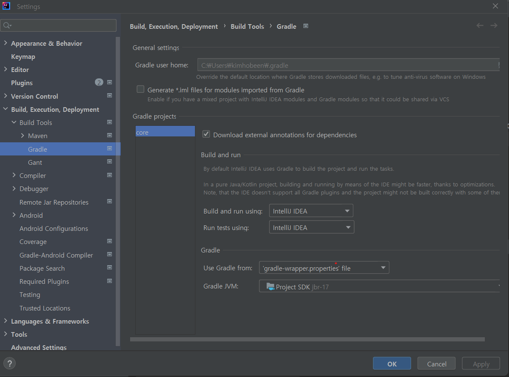
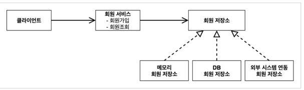
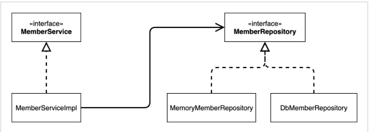

# 0. 프로젝트 생성

- spring initializer 로 프로젝트 생성한다. 이때 dependency 는 아무 것도 넣지 않는다.
- setting 에서 gradle 을 찾아서 build and run using 과 run tests using 을 Intellij IDEA 로 변한다. 
  - 이렇게 하면 Gradle 보다 실행속도가 더 빠르다.
  - 

* 참고: 프로젝트 환경설정을 편리하게 하려고 스프링 부트를 사용한 것이다. 지금은 스프링 없는 순수한 자바로만 개발을 진행한다는 점을 꼭 기억하자! 스프링 관련은 한참 뒤에 등장한다. 

# 1. 비즈니스 요구사항과 설계

## 회원

- 회원을 가입하고 조회할 수 있다. 
- 회원은 일반과 VIP 두 가지 등급이 있다. 
- 회원 데이터는 자체 DB를 구축할 수 있고, 외부 시스템과 연동할 수 있다. (미확정)

## 주문과 할인 정책

- 회원은 상품을 주문할 수 있다. 
- 회원 등급에 따라 할인 정책을 적용할 수 있다. 
- 할인 정책은 모든 VIP는 1000원을 할인해주는 고정 금액 할인을 적용해달라. (나중에 변경 될 수 있다.) 
- 할인 정책은 변경 가능성이 높다. 회사의 기본 할인 정책을 아직 정하지 못했고, 오픈 직전까지 고민을 미루고 싶다. 최악의 경우 할인을 적용하지 않을 수도 있다. (미확정)

요구사항을 보면 회원 데이터, 할인 정책 같은 부분은 지금 결정하기 어려운 부분이다. 그렇다고 이런 정책이 결정될 때 까지 개발을 무기한 기다릴 수도 없다. 인터페이스를 만들고 구현체를 언제든지 갈아끼울 수 있도록 설계하면 된다. 

# 2. 회원 도메인 설계

## 회원 도메인 협력관계

- 

- 회원 저장소는 따로 만든다.

## 회원 서비스 다이어그램

- 

- MemberService 인터페이스로 역할을 만들고 그거에 대한 구현체로 MemberServiceImpl 생성
- MemberRepository 도 인터페이스로 역할, 구현체는 따로 만든다.

## 회원 객체 다이어그램

- 

# 3. 회원 도메인 개발

## 회원 엔티티

### 회원 등급

- ```java
  package hello.core.member;
  
  public enum Grade {
      BASIC,
      VIP
  }
  ```

### 회원 엔티티(Member 클래스)

- ```java
  package hello.core.member;
  
  public class Member {
  
      private Long Id;
      private String name;
      private Grade grade;
  
      public Member(){}
      public Member(Long id, String name, Grade grade) {
          Id = id;
          this.name = name;
          this.grade = grade;
      }
  
      public Long getId() {
          return Id;
      }
  
      public void setId(Long id) {
          Id = id;
      }
  
      public String getName() {
          return name;
      }
  
      public void setName(String name) {
          this.name = name;
      }
  
      public Grade getGrade() {
          return grade;
      }
  
      public void setGrade(Grade grade) {
          this.grade = grade;
      }
  }
  ```

  - 생성자 및 getter/setter 생성

## Repository

### MemberRepository(Interface)

- save 와 findById 만 구현

- ```java
  package hello.core.repository;
  
  import hello.core.member.Member;
  
  public interface MemberRepository {
      void save(Member member);
  
      Member findById(Long memberId);
  }
  ```

### MemoryMemberRepository

- 인터페이스 구현체

- 저장소로 Map 을 사용, sequence 로 id 생

- ```java
  package hello.core.repository;
  
  import hello.core.member.Member;
  
  import java.util.HashMap;
  import java.util.Map;
  
  public class MemoryMemberRepository implements MemberRepository{
  
      private static Map<Long, Member> store = new HashMap<>();
      Long sequence = 0L;
  
      @Override
      public void save(Member member) {
          member.setId(++sequence);
          store.put(member.getId(), member);
      }
  
      @Override
      public Member findById(Long memberId) {
          return store.get(memberId);
      }
  }
  ```

## 회원 서비스

### MemberService (Interface)

- 회원가입(join) 과 회원조회(findMember) 사용

- ```java
  package hello.core.Service;
  
  import hello.core.member.Member;
  
  public interface MemberService {
      void join(Member member);
  
      Member findMember(Long memberId);
  }
  ```

### MemberServiceImpl (class)

- ```java
  package hello.core.Service;
  
  import hello.core.member.Member;
  import hello.core.repository.MemberRepository;
  import hello.core.repository.MemoryMemberRepository;
  
  public class MemberServiceImpl implements MemberService{
  
      private final MemberRepository memberRepository = new MemoryMemberRepository();
  
      @Override
      public void join(Member member) {
          memberRepository.save(member);
      }
  
      @Override
      public Member findMember(Long memberId) {
          return memberRepository.findById(memberId);
      }
  }
  ```

  - memberRepository 는 MemoryMemberRepository 로 구현
  - memberRepository 를 사용하여 save, findById 사용

  - 문제점으로, MemberRepository 와 MemoryMemberRepository 둘 다 의존하고 있으므로 DIP 에 어긋남

# 4. 회원 도메인 실행과 테스트

## main 에서 회원 도메인 실행

- ```java
  package hello.core;
  
  import hello.core.Service.MemberService;
  import hello.core.Service.MemberServiceImpl;
  import hello.core.member.Grade;
  import hello.core.member.Member;
  
  public class MemberApp {
      public static void main(String[] args) {
          MemberService memberService = new MemberServiceImpl();
          Member john = new Member(1L, "John", Grade.VIP);
          memberService.join(john);
  
          Member findMember = memberService.findMember(1L);
          //soutv
          System.out.println("findMember = " + findMember.getName());
          System.out.println("john = " + john.getName());
      }
  }
  
  ```

  - 어플리케이션 로직으로 테스트하는 것은 좋은 방법이 아니며, Junit 테스트를 사용하는 게 좋음

## Junit 테스트

- ```java
  package hello.core.member;
  
  import hello.core.Service.MemberService;
  import hello.core.Service.MemberServiceImpl;
  import org.assertj.core.api.Assertions;
  import org.junit.jupiter.api.Test;
  
  import static org.assertj.core.api.Assertions.*;
  
  public class MemberServiceTest {
  
      MemberService memberService = new MemberServiceImpl();
  
      @Test
      void join(){
          //given
          Member member = new Member(1L, "John", Grade.VIP);
  
          //when
          memberService.join(member);
          Member findMember = memberService.findMember(1L);
  
          //then
          assertThat(member).isEqualTo(findMember);
      }
  }
  ```
