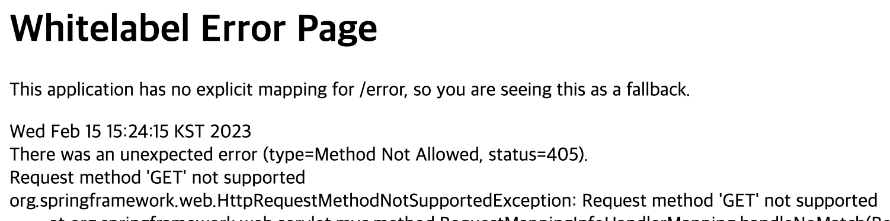

## 1. 요청 매핑 애노테이션을 이용한 경로 매핑
웹 어플리케이션을 개발하는 것은 다음 코드를 작성하는 것이다.
- 특정 요청 URL을 처리할 코드
- 처리 결과를 HTML과 같은 형식으로 응답하는 코드

이 중 첫 번째는 @Controller 애노테이션ㅇ르 사용한 컨트롤러 클래스를 이요해서 구현한다. 컨트롤러 클래스는 요청 매핑 애노테이션을 사용해서 메서드가 처리할 요청 경로를 지정한다. 요청 매핑 애노테이션에는 @RequestMapping, @GetMappig, @PostMapping 등이 있다. 앞어 HellloController 클래스는 다음과 같이 @GetMapping 애노테이션을 사용해서 "/hello" 요청 경로를 hello() 메서드가 처리하도록 설정했다.

```java
@Controller
public class HelloController{
    @GetMapping("/hello")
    public String hello(Model model,
            @RequestParam(value = "name", required = false) String name){
                model.addAttribute("greeting", "안녕하세요, " + name);
                return "hello";
            }
}
```

요청 매핑 애노테이션ㅇ르 적용한 메서드를 두 개 이상 정의할 수도 있다. 예를 들어 회원 가입 과정을 생각해보자. 일반적인 회원 가입 과정은 '약관 동의' -> '회원 정보 입력' -> '가입 완료'인데 각 과정을 위한 URL을 다음과 같이 정할 수 있을 것이다.
- 약관 동의 화면 요청 처리 : http://localhost:8080/register/step1
- 회원 정보 입력 화면 : http://localhost:8080/register/step2
- 가입 처리 결과 화면 : http://localhost:8080/register/step3

이렇게 여러 단계를 거쳐 하나의 기능이 완성되는 경우 관련 요청 경로를 한 개의 컨트롤러 클래스에서 처리하면 코드 관리에 도움이 된다. 다음과 같이 회원 가입 과정을 처리하는 컨트롤러 클래스를 한 개만 만들고 세 개의 메서드에서 각 요청 경로를 처리하도록 구현할 수 있다.

```java
@Controller
public class RegisterController{

    @RequestMapping("/register/step1")
    public String handleStep1(){
        return "register/step1";
    }

    @RequestMapping("/register/step2")
    public String handleStep2(){
        return "register/step2";
    }

    @RequestMapping("/register/step3")
    public String handleStep3(){
        return "register/step3";
    }
}
```

이 코드를 보면 각 요청 매핑 애노테이션의 경로가 "/register"로 시작한다. 이 경우 다음 코드처럼 공통되는 부분의 경로를 담은 @RequestMapping 애노테이션을 클래스에 적용하고 각 메서드는 나머지 경로를 값으로 갖는 요청 매핑 애노테이션을 적용할 수 있다.

```java
@Controller
@RequestMapping("/register")
public class RegisterController{

    @RequestMapping("/step1")
    public String handleStep1(){
        return "register/step1";
    }
    ...
}
```

> 스프링 MVC는 클래스에 적용한 요청 매핑 애노테이션의 경로와 메서드에 적용한 요청 매핑 애노테이션의 경로를 합쳐서 경로를 찾기 때문에 위 코드에서 handleStep1() 메서드가 처리하는 경로는 "/step1"이 아닌 "/register/step1" 이 된다.

>HTTP에서 GET, POST, PATCH 등을 메서드(method)라고 부른다.

## 2, GET과 POST 구분: @GetMapping, @PostMapping
스프링 MVC는 별도 설정이 없으면 GET과 POST 방식에 상관없이 @RequstMapping에 지정한 경로와 일치하는 요청을 처리한다. 만약 POST 방식 요청만 처리하고 싶다면 다음과 같이 @PostMapping 애노테이션을 사용해서 제한할 수 있다. 
```java
@Controller
public class RegisterController{

    @PostMapping("/register/step2")
    public String handleStep2(){
        return "register/step2";
    }
}
```
위와 같이 설정함녀 handleStep2() 메서든느 POST 방식의 "/register/step2"요청 경로만 처리하여 GET 방식의 "/register/step2" 요청 경로는 처리하지 않는다. 동일하게 @GetMapping 애노테이션을 사용하면 GET 방식만 처리하도록 제한할 수 있다. 이 두 애노테이션을 사용하면 GET과 POST 방ㅅ기을 각각 다른 메서드가 처리하도록 설정할 수 있다.

>@GetMapping 애노테이션과 @PostMapping 애노테이션은 스프링 4.3버전에 추가된 것으로 이전 버전까지는 다음 코드처럼 @RequestMapping 애노테이션의 method 속성을 사용해서 HTTP 방식을 제한 했다.
```java
@Controller
public class LoginController{
    @RequestMapping(value = "/member/login", method = RequestMethod.GET)
    public String form(){
        ...
    }

    @RequestMapping(value = "/member/login", method = RequstMethod.Post)
    public Sdtring form(){
        ...
    }
}
```

> @GetMapping, @PostMapping 애노테이션 뿐만 아니라 @PutMapping, @DeleteMapping, @PatchMapping 애노테이션을 재공하므로 HTTP의 GET, POST, PUT, DELETE, PATCH에 대한 매핑을 제한할 수 있다.

## 3. 요청 파라미터 접근
약관 동의 화면을 생성하는 step1.jsp 코드를 보면 다음처럼 약관에 동의할 경우 값이 true인 'agree' 요청 파라미터의 값을 POST 방식으로 전송한다. 따라서 폼에서 지정한 agree 요청 파라미터의 값을 이용해서 약관 동의 여부를 확인할 수 있다.
```jsp
<form action="step2" mothod="post">
<label>
    <input type="checkbox" name="agree" value="true"> 약관 동의
</label>
<input type = "submit" value="다음 단계" />
</form>
```

컨틀롤러 메서드에서 요청 파라미터를 사용하는 방법
- HttpServletRequest를 직접 이용
- @RequestParm 애노테이션을 사용하는 것

### 3,1 HttpServletRequest 이용
다음과 같이 컨트롤러 처리 메서드의 파라미터로 HttpServletRequest 타입을 사용하고 HttpServletRequest의 getParameter() 메서드를 이용해서 파라미터의 값을 구하면 된다.

```java
@Controller
public class RegisterController{

    @RequestMapping("/register/step1")
    public String handleStep1(){
        return "register/step1";
    }

    @PostMapping("/register/step2")
    public String handleStep2(HttpServletRequest request){
        String agreeParam = requst.getParameter("agree");
        if(agreeParam == null || !agreeParam.equals("true")){
            return "register/step1"
        }
        return "register/step2";
    }
}
```

### 3.2 @RequestParam 애노테이선을 사용하는 것
요청 파라미터 개수가 몇 개 안 되면 이 애노테이션을 사용해서 간단하게 요청 파라미터의 값을 구할 수 있다. 다음은 위 코드를 @RequestParam 애노테이션을 사용해서 구현한 코드이다.

```java
@Controller
public class RestController{
    ...
    @PostMapping("/register/step2")
    public String handleStep2(
        @RequestParam(value="agree", defaultValue="false") Boolean agreeVal){
        
        if(!agree){
            return "register/step1";
        }
        return "register/step2";
        
    }
}
```
@RequestParam 애노테이션은 다음의 속성을 제공한다. 이 표에 따르면 위 코드는 agreeVal 요청 파라미터의 값을 읽어와 agree 파라미터에 할당한다. 요청 파라미터의 값이 없으면 "false" 문자열을 값으로 사용한다.

|속성|타입|설명|
|------|---|---|
|value|Stirng|HTTP 요청 파라미터의 이름을 지정한다.|
|required|boolean|필수 여부를 지정한다. 이 값이 true이면서 해당 요청 파라미터에 값이 없으면 익셉션이 발생한다. 기본값은 true이다.|
|defaultValue|String|요청 파라미터가 값이 없을 때 사용할 문자열 값을 지정한다. 기본값은 없다.|

@RequestParam 애노테이션을 사용한 코드를 보면 다음과 같이 agreeVal 파라미터의 타입이 Boolean이다.
```java
@RequestParam(value="agree", defaultValue="false") Boolean agreeVal
```
**스프링 MVC는 파라미터 타입에 맞게 String 값을 변환해 준다.** 위 코드는 agree 요청 파라미터의 값을 읽어와 Boolean 타입으로 변환해서 agreeVal 파라미터에 전달한다. Boolean 타입 외에 int, long, Integer, Long 등 기본 데이터 타입과 래퍼 타입에 대한 변환을 지원한다.

## 4. 리다이렉트 처리
Controller 클래스에서 POST 방식만을 처리했을 때 웹 브라우저에 주소를 직접 입력하면 다음과 같은 에러 화면이 출력된다.


따라서 웹 브라우저에 직접 주소를 입력할 때 사용되는 GET방식 요청은 처리되지 않는다. 스프링 MVC는 메서드가 GET 요청의 처리를 지원하지 않는다면 그림과 같이 405 상태 코드를 응답합다.

잘못된 전송ㅇ 방식으로 요청이 왔을 때 에러 화면보다 알맞은 경롤로 리다이렉트하는 것이 더 좋을 때가 있다. 예를 들어 위와 같은 에러 화면 대신 다른 화면으로 이동하도록 구현하면 좋을 것이다.

컨트롤러에서 특정 페이지로 리다이렉트시키는 방법은 간단하다. "redirect:경로"를 뷰 이름으로 리턴하면 된다. 다음은 그 예이다.
```java
@Controller
public class RegisterController{
    ...
    @GetMapping("/register/step2")
    public String handleStep2Get(){
        return "redirect:/register/step1";
    }
}
```
 **@RequstMapping, @GetMapping 등 요청 매핑 관련 애노테이션을 적용한 메서드가 "redirect:"로 시작하는 경로를 리턴하면 나머지 경로를 이용해서 리다이렉트할 경로를 구한다.** "redirect:"뒤의 무자열이 "/"로 시작하면 웹 어플리케이션을 기준으로 이동경로를 생성한다.\

### 4.1 "/"로 시작할 경우
예를 들어 뷰 값으로 "redirect:/register/step1"을 사용했는데 이 경우 이동 경로가 "/"로 시작하므로 실제 리다이렉트할 경로는 웹 어플리케이션 경로와 "register/step1"을 연결한 "웹 어플리케이션 경로/register/step1"이 된다.

### 4.2 "/"로 시작하지 않을 경우
"/"로 시작하지 않으면 현재 경로를 기준으로 상대 경로를 사용한다. 예를 들어 "redirect:step1"을 리턴했으면 현재 요청 경로인 "http://localhost:8080/sp5-chap11/register/step2"를 기준으로 상대 경로인 "http://localhost:8080/sp5-chap/step1"을 리다이렉트 경로로 사용한다.

### 4.3 완전 경로
"redirect:http://localhost:8080/sp5-chap/register/step1"과 같이 완전한 URL을 사용하면 해당 경로로 리다이렉트한다.

## Ref.
- 최범균, 스프링프로그래밍입문5, 가메출판사.