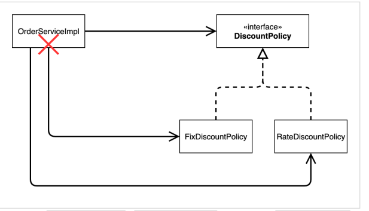
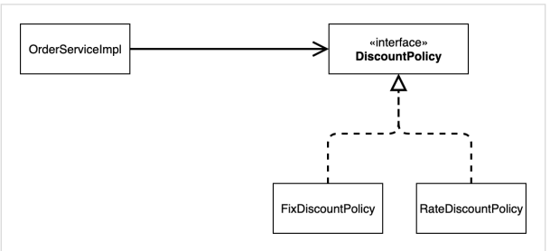
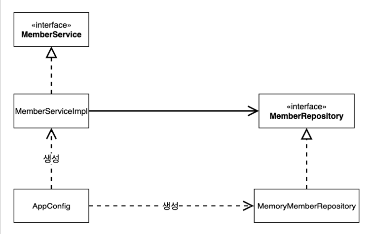
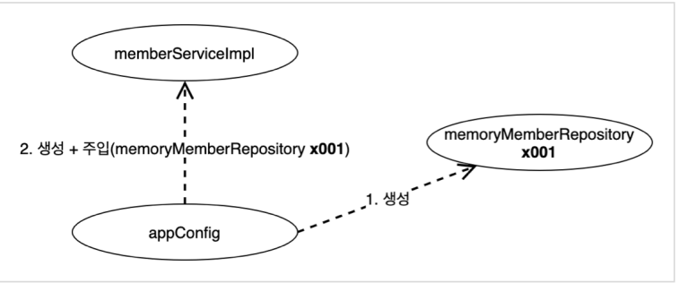
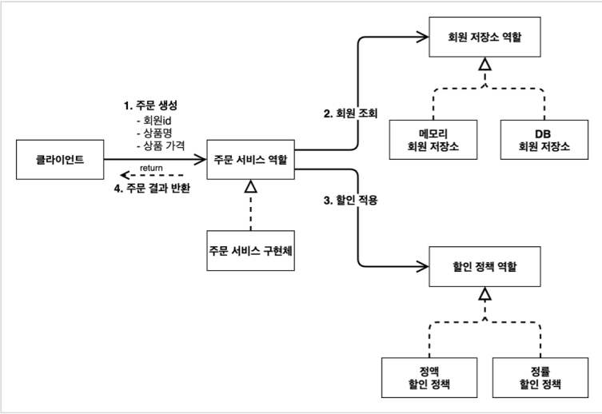
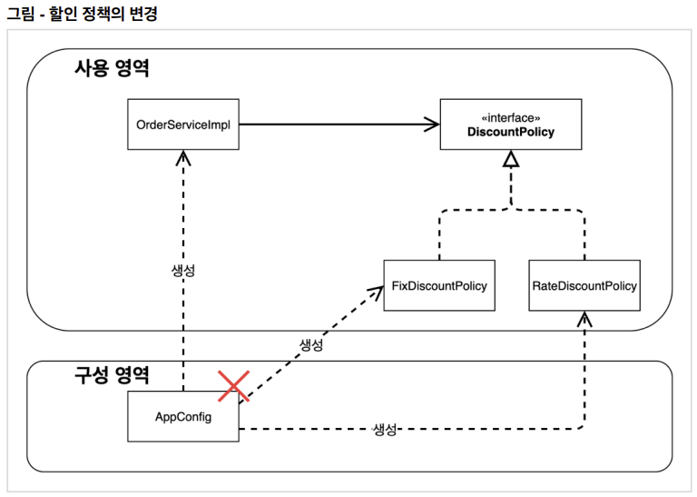
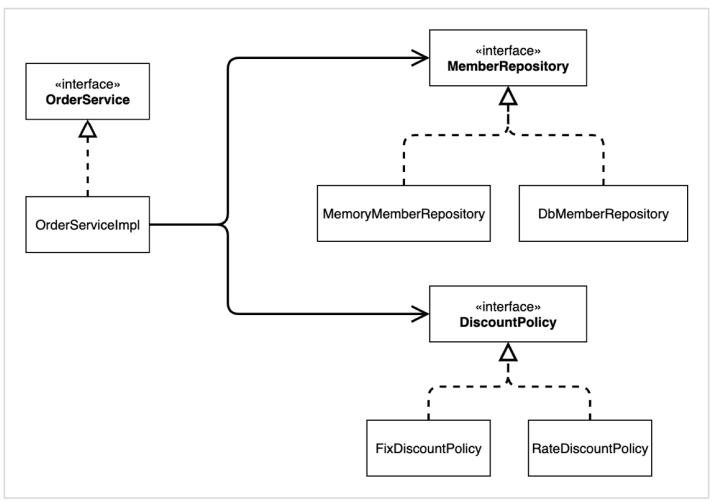
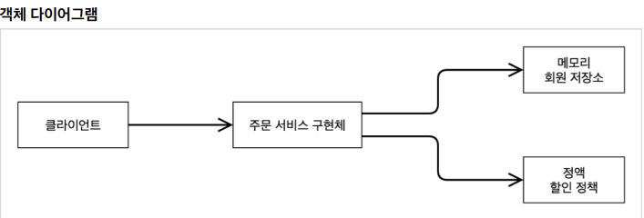

# 1. 새로운 할인 정책 개발

- 정액 할인 정책을 정률 할인 정책으로 변경

## RateDiscountPolicy 추가

- ``` java
  package hello.core.discount;
  
  import hello.core.member.Grade;
  import hello.core.member.Member;
  
  public class RateDiscountPolicy implements DiscountPolicy{
      private int discountPercent = 10; //1000원 할인
  
      @Override
      public int discount(Member member, int price) {
          if(member.getGrade() == Grade.VIP){
              return price * discountPercent / 100;
          }
          return 0;
      }
  }
  ```

  - 일정 퍼센트 (discountPercent) 를 변수로 넣은 후, return 시 price 에 곱하고 100으로 나눠준다.

## RateDiscountPolicyTest

- ```java
  package hello.core.discount;
  
  import hello.core.member.Grade;
  import hello.core.member.Member;
  import org.assertj.core.api.Assertions;
  import org.junit.jupiter.api.DisplayName;
  import org.junit.jupiter.api.Test;
  
  import static org.assertj.core.api.Assertions.*;
  import static org.junit.jupiter.api.Assertions.*;
  
  class RateDiscountPolicyTest {
  
      RateDiscountPolicy discountPolicy = new RateDiscountPolicy();
  
      @Test
      @DisplayName("VIP 는 10% 할인이 적용되어야 한다.")
      void discount() {
          //given
          Member member = new Member(1L, "VIP1", Grade.VIP);
          //when
          int discount = discountPolicy.discount(member, 10000);
          //then
          assertThat(discount).isEqualTo(1000);
      }
  
      @Test
      @DisplayName("VIP 가 아니면 할인이 적용되지 않아야 한다.")
      void NotDiscount() {
          //given
          Member member = new Member(2L, "BASIC1", Grade.BASIC);
          //when
          int discount = discountPolicy.discount(member, 10000);
          //then
          assertThat(discount).isEqualTo(1000);
      }
  }
  ```

  - discount() 는 정상적으로 작동
  - Notdiscount() 처럼 오류가 나는 케이스도 테스트 해봐야 한다.
  - @DIsplayName : 콘솔에서 테스트 이름이 나온다.
    - 

# 2. 새로운 할인 정책 적용과 문제점

- 추가한 할인 정책을 적용하여면 클라이언트인 OrderServiceImpl 코드를 코쳐야 한다.

- ```java
  public class OrderServiceImpl implements OrderService {
  
      MemberRepository memberRepository = new MemoryMemberRepository();
      // private final DiscountPolicy discountPolicy = new FixDiscountPolicy();
  	private final DiscountPolicy discountPolicy = new RateDiscountPolicy();
  
      @Override
      public Order createOrder(Long memberId, String itemName, int itemPrice) {
          Member member = memberRepository.findById(memberId);
          int discountPrice = discountPolicy.discount(member, itemPrice);
  
          return new Order(memberId, itemName, itemPrice, discountPrice);
      }
  }
  ```

## 문제점 발견

- 역할과 구현을 충실하게 분리하고,
- 다형성도 활용하고 인터페이스와 구현객체도 분리했고,
- OCP, DIP 같은 객체지향 설계 원칙도 충실히 준수했으나,
  - 그렇게 보이지만 사실은 아니다.
- 

- 위 그림처럼 추상(인터페이스) 뿐만 아니라구체(구현) 클래스에도 의존하고 있다.
  - 추상(인터페이스) 의존: DiscountPolicy 
  - 구체(구현) 클래스: FixDiscountPolicy , RateDiscountPolicy
- 지금 코드는 기능을 확장해서 변경하면, 클라이언트 코드에 영향을 준다! 따라서 OCP를 위반한다.

## 문제해결

- DIP를 위반하지 않도록 인터페이스에만 의존하도록 의존관계를 변경하면 된다.

- 

- ```java
  public class OrderServiceImpl implements OrderService {
   //private final DiscountPolicy discountPolicy = new RateDiscountPolicy();
   private DiscountPolicy discountPolicy;
  }
  ```

  - 인터페이스에만 의존하도록 설계와 코드를 변경했다. 
  - 그런데 구현체가 없는데 어떻게 코드를 실행할 수 있을까? 
  - 실제 실행을 해보면 NPE(null pointer exception)가 발생한다.
  -  문제를 해결하려면 누군가가 클라이언트인 OrderServiceImpl 에 DiscountPolicy 의 구현 객체를 대신 생성하고 주입해주어야 한다.

# 3. 관심사의 분리

- Service 에서 구현체를 직접 생성하지 않고 AppConfig 로 생성 후 생성자로 주입받게 설계해야 한다.
- AppConfig 등장 
  - 애플리케이션의 전체 동작 방식을 구성(config)하기 위해, 구현 객체를 생성하고, 연결하는 책임을 가지는 별도의 설정 클래스

## AppConfig

- ```java
  package hello.core;
  
  import hello.core.Service.MemberService;
  import hello.core.Service.MemberServiceImpl;
  import hello.core.Service.OrderService;
  import hello.core.Service.OrderServiceImpl;
  import hello.core.discount.FixDiscountPolicy;
  import hello.core.repository.MemoryMemberRepository;
  
  public class AppConfig {
  
      public MemberService memberService(){
          return new MemberServiceImpl(new MemoryMemberRepository());
      }
  
      public OrderService orderService(){
          return new OrderServiceImpl(new MemoryMemberRepository(), new FixDiscountPolicy());
      }
  }
  
  ```

- Appconfig 는 애플리케이션의 실제 동작에 필요한 구현 객체를 생성한다. 
  - MemberServiceImpl 
  - MemoryMemberRepository 
  - OrderServiceImpl 
  - FixDiscountPolicy 
- AppConfig는 생성한 객체 인스턴스의 참조(레퍼런스)를 생성자를 통해서 주입(연결)해준다.
  -  MemberServiceImpl -> MemoryMemberRepository
  -  OrderServiceImpl -> MemoryMemberRepository , FixDiscountPolicy

## MemberServiceImpl - 생성자 주입

- ```java
  public class MemberServiceImpl implements MemberService {
      private final MemberRepository memberRepository;
      
      public MemberServiceImpl(MemberRepository memberRepository) {
      	this.memberRepository = memberRepository;
      }
      
      public void join(Member member) {
      	memberRepository.save(member);
      }
      
      public Member findMember(Long memberId) {
      	return memberRepository.findById(memberId);
      }
  }
  ```

  - 설계 변경으로 MemberServiceImpl 은 MemoryMemberRepository 를 의존하지 않는다! 
  - 단지 MemberRepository 인터페이스만 의존한다. 
  - MemberServiceImpl 입장에서 생성자를 통해 어떤 구현 객체가 들어올지(주입될지)는 알 수 없다. 
  - MemberServiceImpl 의 생성자를 통해서 어떤 구현 객체를 주입할지는 오직 외부( AppConfig )에서 결정된다. 
  - MemberServiceImpl 은 이제부터 의존관계에 대한 고민은 외부에 맡기고 실행에만 집중하면 된다.

## 클래스 / 회원 객체 인스턴스 다이어그램

### 클래스 다이어그램

- 

- 객체의 생성과 연결은 AppConfig 가 담당한다. 
- DIP 완성: MemberServiceImpl 은 MemberRepository 인 추상에만 의존하면 된다. 이제 구체 클래스를 몰라도 된다. 
- 관심사의 분리: 객체를 생성하고 연결하는 역할과 실행하는 역할이 명확히 분리되었다.

### 회원 객체 인스턴스 다이어그램

- 

- appConfig 객체는 memoryMemberRepository 객체를 생성하고 그 참조값을 memberServiceImpl 을 생성하면서 생성자로 전달한다.
- 클라이언트인 memberServiceImpl 입장에서 보면 의존관계를 마치 외부에서 주입해주는 것 같다고 해서 DI(Dependency Injection) 우리말로 의존관계 주입이라 한다.

## OrderServiceImpl - 생성자 주입

- ```java
  public class OrderServiceImpl implements OrderService {
      private final MemberRepository memberRepository;
      private final DiscountPolicy discountPolicy;
      
      public OrderServiceImpl(MemberRepository memberRepository, DiscountPolicy
      discountPolicy) {
          this.memberRepository = memberRepository;
          this.discountPolicy = discountPolicy;
  	}
      ...
  }
  ```

  - 설계 변경으로 OrderServiceImpl 은 FixDiscountPolicy 를 의존하지 않는다! 
  - 단지 DiscountPolicy 인터페이스만 의존한다. 
  - OrderServiceImpl 입장에서 생성자를 통해 어떤 구현 객체가 들어올지(주입될지)는 알 수 없다. 
  - OrderServiceImpl 의 생성자를 통해서 어떤 구현 객체을 주입할지는 오직 외부( AppConfig )에서 결정한다. 
  - OrderServiceImpl 은 이제부터 실행에만 집중하면 된다.
  - OrderServiceImpl 에는 MemoryMemberRepository , FixDiscountPolicy 객체의 의존관계가 주입된다.

## AppConfig 실행

- MemberApp, OrderApp 에서 Appconfig 호출 후 사용하면 된다.

  - ```java
    AppConfig appConfig = new AppConfig();
    MemberService memberService = appConfig.memberService();
    OrderService orderService = appConfig.orderService();
    ```

- Test 에서는 인터페이스 호출 후 @BeforeEach 로 각 테스트 실행 전에 호출 한다.

  - ```java
    MemberService memberService;
    OrderService orderService;
    @BeforeEach
    public void beforeEach() {
        AppConfig appConfig = new AppConfig();
        memberService = appConfig.memberService();
        orderService = appConfig.orderService();
    }
    ```

    

# 4. AppConfig 리팩토링

- 현재 AppConfig를 보면 중복이 있고, 역할에 따른 구현이 잘 안보인다.

- 기대하는 그림
  - 

### 리팩토링

- ```java
  public class AppConfig {
  
      public MemberService memberService(){
          return new MemberServiceImpl(memberRepository());
      }
  
      private MemberRepository memberRepository(){
          return new MemoryMemberRepository();
      }
  
      public OrderService orderService(){
          return new OrderServiceImpl(memberRepository(), discountPolicy());
      }
  
      public DiscountPolicy discountPolicy(){
          return new FixDiscountPolicy();
      }
  }
  ```

  - new MemoryMemberRepository() 이 부분이 중복 제거되었다. 이제 MemoryMemberRepository 를 다른 구현체로 변경할 때 한 부분만 변경하면 된다. 
  - AppConfig 를 보면 역할과 구현 클래스가 한눈에 들어온다. 애플리케이션 전체 구성이 어떻게 되어있는지 빠르게 파악할 수 있다.

# 5. 새로운 구조와 할인 정책 적용

- 정액 할인 정책을 정률 할인 정책으로 변경
- FixDiscountPolicy -> RateDiscountPolicy
- 
  - FixDiscountPolicy -> RateDiscountPolicy 로 변경해도 구성 영역만 영향을 받고, 사용 영역은 전혀 영향을 받지 않는다.

## 코드 변경

- ```java
  public class AppConfig {
  
      public MemberService memberService(){
          return new MemberServiceImpl(memberRepository());
      }
  
      private MemberRepository memberRepository(){
          return new MemoryMemberRepository();
      }
  
      public OrderService orderService(){
          return new OrderServiceImpl(memberRepository(), discountPolicy());
      }
  
      public DiscountPolicy discountPolicy(){
          //return new FixDiscountPolicy();
          return new RateDiscountPolicy();
      }
  }
  ```

  - AppConfig 에서 할인 정책 역할을 담당하는 구현을 FixDiscountPolicy RateDiscountPolicy 객체로 변경했다. 
  - 이제 할인 정책을 변경해도, 애플리케이션의 구성 역할을 담당하는 AppConfig만 변경하면 된다. 
  - 클라이언트 코드인 OrderServiceImpl 를 포함해서 사용 영역의 어떤 코드도 변경할 필요가 없다. 구성 영역은 당연히 변경된다. 

# 6. 좋은 객체 지향 설계의 5가지 원칙의 적용

- 여기서 3가지 SRP, DIP, OCP 적용

## SRP 단일 책임 원칙

- 한 클래스는 하나의 책임만 가져야 한다.
- 클라이언트 객체는 직접 구현 객체를 생성하고, 연결하고, 실행하는 다양한 책임을 가지고 있음다.
- SRP 단일 책임 원칙을 따르면서 관심사를 분리했다.
- 구현 객체를 생성하고 연결하는 책임은 AppConfig가 담당하고 클라이언트 객체는 실행하는 책임만 담당한다.


## DIP 의존관계 역전 원칙

- 새로운 할인 정책을 개발하고, 적용하려고 하니 클라이언트 코드도 함께 변경해야 했다. 왜냐하면 기존 클라이언트 코드( OrderServiceImpl )는 DIP를 지키며 DiscountPolicy 추상화 인터페이스에 의존하는 것 같았지만, FixDiscountPolicy 구체화 구현 클래스에도 함께 의존했다.
- 클라이언트 코드가 DiscountPolicy 추상화 인터페이스에만 의존하도록 코드를 변경했다.
- 하지만 클라이언트 코드는 인터페이스만으로는 아무것도 실행할 수 없다. 
- AppConfig가 FixDiscountPolicy 객체 인스턴스를 클라이언트 코드 대신 생성해서 클라이언트 코드에 의존관계를 주입했다. 이렇게해서 DIP 원칙을 따르면서 문제도 해결했다.

## OCP 

- 소프트웨어 요소는 확장에는 열려 있으나 변경에는 닫혀 있어야 한다.

- 다형성 사용하고 클라이언트가 DIP를 지킴
-  애플리케이션을 사용 영역과 구성 영역으로 나눔 AppConfig가 의존관계를 FixDiscountPolicy -> RateDiscountPolicy 로 변경해서 클라이언트 코드에 주입하므로 클라이언트 코드는 변경하지 않아도 됨
- 소프트웨어 요소를 새롭게 확장해도 사용 영역의 변경은 닫혀 있다!

# 7. IoC, DI, 그리고 컨테이너

## IoC(제어의 역전)

- 기존 프로그램은 클라이언트 구현 객체가 스스로 필요한 서버 구현 객체를 생성하고, 연결하고, 실행했다. 한마디로 구현 객체가 프로그램의 제어 흐름을 스스로 조종했다. 개발자 입장에서는 자연스러운 흐름이다.
- 반면에 AppConfig가 등장한 이후에 구현 객체는 자신의 로직을 실행하는 역할만 담당한다. 프로그램의 제어 흐름은 이제 AppConfig가 가져간다. 예를 들어서 OrderServiceImpl 은 필요한 인터페이스들을 호출하지만 어떤 구현 객체들이 실행될지 모른다. 
- 프로그램에 대한 제어 흐름에 대한 권한은 모두 AppConfig가 가지고 있다. 심지어 OrderServiceImpl 도 AppConfig가 생성한다. 그리고 AppConfig는 OrderServiceImpl 이 아닌 OrderService 인터페이스의 다른 구현 객체를 생성하고 실행할 수 도 있다. 그런 사실도 모른체 OrderServiceImpl 은 묵묵히 자신의 로직을 실행할 뿐이다.
- 이렇듯 프로그램의 제어 흐름을 직접 제어하는 것이 아니라 외부에서 관리하는 것을 제어의 역전(IoC)이라 한다.

## 프레임워크 vs 라이브러리

- 프레임워크가 내가 작성한 코드를 제어하고, 대신 실행하면 그것은 프레임워크가 맞다. (JUnit) 
- 반면에 내가 작성한 코드가 직접 제어의 흐름을 담당한다면 그것은 프레임워크가 아니라 라이브러리다.

## DI(의존관계 주입)

- OrderServiceImpl 은 DiscountPolicy 인터페이스에 의존한다. 실제 어떤 구현 객체가 사용될지는 모른다. 
- 의존관계는 정적인 클래스 의존 관계와, 실행 시점에 결정되는 동적인 객체(인스턴스) 의존 관계 둘을 분리해서 생각해야 한다.

### 정적인 클래스 의존관계

- 클래스가 사용하는 import 코드만 보고 의존관계를 쉽게 판단할 수 있다. 정적인 의존관계는 애플리케이션을 실행하지 않아도 분석할 수 있다. 
- 클래스 다이어그램을 보면 OrderServiceImpl 은 MemberRepository , DiscountPolicy 에 의존한다는 것을 알 수 있다. 
- 그런데 이러한 클래스 의존관계 만으로는 실제 어떤 객체가 OrderServiceImpl 에 주입 될지 알 수 없다.
- 

### 동적인 객체 인스턴스 의존 관계

- 애플리케이션 실행 시점에 실제 생성된 객체 인스턴스의 참조가 연결된 의존 관계다.
- 

- 애플리케이션 실행 시점(런타임)에 외부에서 실제 구현 객체를 생성하고 클라이언트에 전달해서 클라이언트와 서버의 실제 의존관계가 연결 되는 것을 의존관계 주입이라 한다. 
- 객체 인스턴스를 생성하고, 그 참조값을 전달해서 연결된다. 
- 의존관계 주입을 사용하면 클라이언트 코드를 변경하지 않고, 클라이언트가 호출하는 대상의 타입 인스턴스를 변경할 수 있다. 
- 의존관계 주입을 사용하면 정적인 클래스 의존관계를 변경하지 않고, 동적인 객체 인스턴스 의존관계를 쉽게 변경할 수 있다.

## IoC 컨테이너, DI 컨테이너

- AppConfig 처럼 객체를 생성하고 관리하면서 의존관계를 연결해 주는 것을 IoC 컨테이너 또는 DI 컨테이너라 한다. 
- 의존관계 주입에 초점을 맞추어 최근에는 주로 DI 컨테이너라 한다. 
- 또는 어샘블러, 오브젝트 팩토리 등으로 불리기도 한다.

# 7. 스프링으로 전환하기

## AppConfig

- @Configuration, @Bean 어노테이션을 사용하여 각 메서드를 스프링 컨테이너에 스프링 빈으로 등록한다.

- ```java
  package hello.core;
  
  import hello.core.Service.MemberService;
  import hello.core.Service.MemberServiceImpl;
  import hello.core.Service.OrderService;
  import hello.core.Service.OrderServiceImpl;
  import hello.core.discount.DiscountPolicy;
  import hello.core.discount.FixDiscountPolicy;
  import hello.core.discount.RateDiscountPolicy;
  import hello.core.repository.MemberRepository;
  import hello.core.repository.MemoryMemberRepository;
  import org.springframework.context.annotation.Bean;
  import org.springframework.context.annotation.Configuration;
  
  @Configuration
  public class AppConfig {
  
      @Bean
      public MemberService memberService(){
          return new MemberServiceImpl(memberRepository());
      }
  
      @Bean
      public MemberRepository memberRepository(){
          return new MemoryMemberRepository();
      }
  
      @Bean
      public OrderService orderService(){
          return new OrderServiceImpl(memberRepository(), discountPolicy());
      }
  
      @Bean
      public DiscountPolicy discountPolicy(){
          return new RateDiscountPolicy();
      }
  }
  ```

## MemberApp 에 스프링 컨테이너 적용

- 스프링 컨테이너(ApplicationContext) 를 사용하여 DI 적용
- OrderApp 도 같은 방법으로 MemberService 와 OrderService 사용

- ```java
  package hello.core;
  
  import hello.core.Service.MemberService;
  import hello.core.member.Grade;
  import hello.core.member.Member;
  import org.springframework.context.ApplicationContext;
  import org.springframework.context.annotation.AnnotationConfigApplicationContext;
  
  public class MemberApp {
      public static void main(String[] args) {
  //        AppConfig appConfig = new AppConfig();
  //        MemberService memberService = appConfig.memberService();
  
          ApplicationContext applicationContext = new AnnotationConfigApplicationContext(AppConfig.class);
          MemberService memberService = applicationContext.getBean("memberService", MemberService.class);
  
          Member member = new Member(1L, "memberA", Grade.VIP);
          memberService.join(member);
          Member findMember = memberService.findMember(1L);
          System.out.println("new member = " + member.getName());
          System.out.println("find Member = " + findMember.getName());
      }
  }
  ```

## 스프링 컨테이너

- ApplicationContext 를 스프링 컨테이너라 한다. 
- 기존에는 개발자가 AppConfig 를 사용해서 직접 객체를 생성하고 DI를 했지만, 이제부터는 스프링 컨테이너를 통해서 사용한다.
-  스프링 컨테이너는 @Configuration 이 붙은 AppConfig 를 설정(구성) 정보로 사용한다. 여기서 @Bean 이라 적힌 메서드를 모두 호출해서 반환된 객체를 스프링 컨테이너에 등록한다. 이렇게 스프링 컨테이너에 등록된 객체를 스프링 빈이라 한다. 
- 스프링 빈은 @Bean 이 붙은 메서드의 명을 스프링 빈의 이름으로 사용한다. ( memberService , orderService ) 
- 이전에는 개발자가 필요한 객체를 AppConfig 를 사용해서 직접 조회했지만, 이제부터는 스프링 컨테이너를 통해서 필요한 스프링 빈(객체)를 찾아야 한다. 
- 스프링 빈은 applicationContext.getBean() 메서드를 사용해서 찾을 수 있다. 
- 기존에는 개발자가 직접 자바코드로 모든 것을 했다면 이제부터는 스프링 컨테이너에 객체를 스프링 빈으로 등록하고, 스프링 컨테이너에서 스프링 빈을 찾아서 사용하도록 변경되었다.