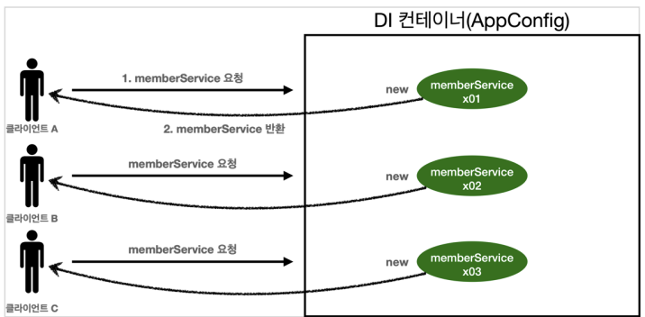
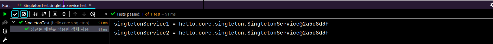
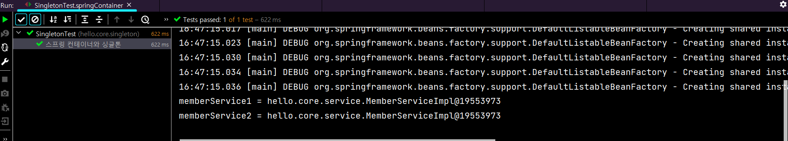
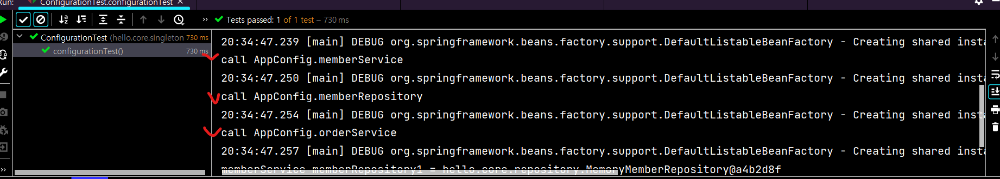
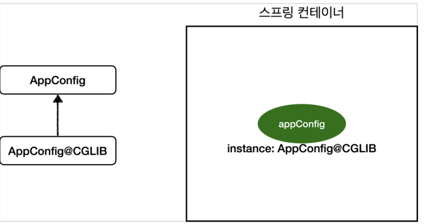
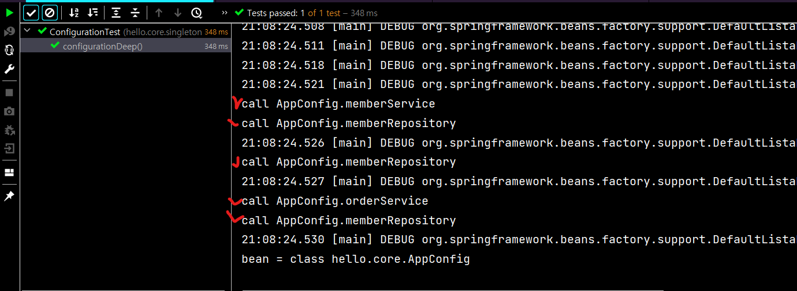

# 1. 웹 어플리케이션과 싱글톤

- 대부분의 스프링 애플리케이션은 웹 애플리케이션이다. 물론 웹이 아닌 애플리케이션 개발도 얼마든지 개발할 수 있다.
- 웹 애플리케이션은 보통 여러 고객이 동시에 요청을 한다.

## 스프링 없는 순수한 DI 컨테이너 테스트

- 

- ```java
  package hello.core.singleton;
  
  import ...;
  
  public class SingletonTest {
  
      @Test
      @DisplayName("스프링 없는 순수한 DI 컨테이너")
      void pureContainer() {
          AppConfig appConfig = new AppConfig();
          
          //1. 조회 : 호출할 때마다 객체 생성
          MemberService memberService1 = appConfig.memberService();
  
          //2. 조회 : 호출할 때마다 객체 생성
          MemberService memberService2 = appConfig.memberService();
  
          //호출 시 참조값이 다른 것을 확인
          //repository 까지 총 4개의 객체를 생성됨
          System.out.println("memberService1 = " + memberService1);
          System.out.println("memberService2 = " + memberService2);
  
          //memeberService1 =! memberService2
          Assertions.assertThat(memberService1).isNotSameAs(memberService2);
  
      }
  }
  ```

  - 우리가 만들었던 스프링 없는 순수한 DI 컨테이너인 AppConfig는 요청을 할 때 마다 객체를 새로 생성한다. 
  - 고객 트래픽이 초당 100이 나오면 초당 100개 객체가 생성되고 소멸된다! 메모리 낭비가 심하다.
  - 해결방안은 해당 객체가 딱 1개만 생성되고, 공유하도록 설계하면 된다. 
    - 싱글톤 패턴

# 2. 싱글톤 패턴

- 클래스의 인스턴스가 딱 1개만 생성되는 것을 보장하는 디자인 패턴이다.
- 그래서 객체 인스트너스를 2개 이상 생성하지 못하도록 막아야 한다.
  - private 을 사용하여 외부에서 new 를 못쓰게 만들면 된다.

## SingletonService (main)

- ```java
  package hello.core.singleton;
  
  public class SingletonService {
  
      private static final SingletonService instance = new SingletonService();
  
      public static SingletonService getInstance() {
          return instance;
      }
  
      //생성자를 private 으로 선언하면 다른곳에서 new 로 만들 수 없다
      private  SingletonService(){}
  
      public void logic() {
          System.out.println("싱글톤 객체 로직 호출");
      }
  }
  ```

  - static 영역에 객체 instance를 미리 하나 생성해서 올려둔다.
  -  이 객체 인스턴스가 필요하면 오직 getInstance() 메서드를 통해서만 조회할 수 있다. 이 메서드를 호출하면 항상 같은 인스턴스를 반환한다.
  - 딱 1개의 객체 인스턴스만 존재해야 하므로, 생성자를 private으로 막아서 혹시라도 외부에서 new 키워드로 객체 인스턴스가 생성되는 것을 막는다.

## Test

- ```java
  @Test
  @DisplayName("싱글톤 패턴을 적용한 객체 사용")
  void singletonServiceTest() {
      SingletonService singletonService1 = SingletonService.getInstance();
      SingletonService singletonService2 = SingletonService.getInstance();
  
      System.out.println("singletonService1 = " + singletonService1);
      System.out.println("singletonService2 = " + singletonService2);
  
      //same 은 == 을 뜻한다. //instance 를 비교
      assertThat(singletonService1).isSameAs(singletonService2);
      //스프링 컨테이너는 기본적으로 객체를 싱글톤으로 만들어준다.
  }
  ```

- 
  - 호출할 때마다 같은 객체 인스턴스를 반환한다.

## 싱글톤 패턴 문제점

- 싱글톤 패턴을 구현하는 코드 자체가 많이 들어간다. 
- 의존관계상 클라이언트가 구체 클래스에 의존해서 DIP를 위반한다. 
- 클라이언트가 구체 클래스에 의존해서 OCP 원칙을 위반할 가능성이 높다. 
- 테스트하기 어렵다.
- 내부 속성을 변경하거나 초기화 하기 어렵다. 
- private 생성자로 자식 클래스를 만들기 어렵다. 
- 결론적으로 유연성이 떨어진다. 
- 안티패턴으로 불리기도 한다.

# 3. 싱글톤 컨테이너

- 스프링 컨테이너는 싱글톤 패턴의 문제점을 해결하면서, 객체 인스턴스를 싱글톤(1개만 생성)으로 관리한다.
- 스프링 컨테이너는 싱글턴 패턴을 적용하지 않아도, 객체 인스턴스를 싱글톤으로 관리한다. 
- 컨테이너는 객체를 하나만 생성해서 관리한다. 스프링 컨테이너는 싱글톤 컨테이너 역할을 한다. 
  - 이렇게 싱글톤 객체를 생성하고 관리하는 기능을 싱글톤 레지스트리라 한다. 
- 스프링 컨테이너의 이런 기능 덕분에 싱글턴 패턴의 모든 단점을 해결하면서 객체를 싱글톤으로 유지할 수 있다. 싱
  - 글톤 패턴을 위한 지저분한 코드가 들어가지 않아도 된다. 
  - DIP, OCP, 테스트, private 생성자로 부터 자유롭게 싱글톤을 사용할 수 있다.

## Test (스프링 컨테이너 사용)

- ```java
  @Test
  @DisplayName("스프링 컨테이너와 싱글톤")
  void springContainer() {
      AnnotationConfigApplicationContext ac = new AnnotationConfigApplicationContext(AppConfig.class);
  
      MemberService memberService1 = ac.getBean("memberService", MemberService.class);
      MemberService memberService2 = ac.getBean("memberService", MemberService.class);
  
      System.out.println("memberService1 = " + memberService1);
      System.out.println("memberService2 = " + memberService2);
  
      assertThat(memberService1).isSameAs(memberService2);
  }
  ```

  - 

# 4. 싱글톤 방식의 주의점

- 싱글톤 패턴이든, 스프링 같은 싱글톤 컨테이너를 사용하든, 객체 인스턴스를 하나만 생성해서 공유하는 싱글톤 방식은 여러 클라이언트가 하나의 같은 객체 인스턴스를 공유하기 때문에 싱글톤 객체는 상태를 유지(stateful)하게 설계하면 안된다.
- 무상태(stateless)로 설계해야 한다! 
  - 특정 클라이언트에 의존적인 필드가 있으면 안된다. 
  - 특정 클라이언트가 값을 변경할 수 있는 필드가 있으면 안된다! 
  - 가급적 읽기만 가능해야 한다. 
  - 필드 대신에 자바에서 공유되지 않는, 지역변수, 파라미터, ThreadLocal 등을 사용해야 한다. 
- 스프링 빈의 필드에 공유 값을 설정하면 정말 큰 장애가 발생할 수 있다

## stateful 상태인 서비스 (오류)

- ```java
  package hello.core.singleton;
  
  public class StatefulService {
      private int price;
  
      public void order(String name, int price){
          System.out.println("name = " + name + " price = " + price);
          this.price = price; // 여기가 문제!
      }
  
      public int getPrice(){
          return price;
      }
  }
  ```

  - price 가 StatefulService 의 전역변수로 설정되어 있다.

## 서비스 테스트

- ```java
  class StatefulServiceTest {
  
      @Test
      void statefulServiceSingleton() {
          ApplicationContext ac = new AnnotationConfigApplicationContext(TestConfig.class);
          StatefulService statefulService1 = ac.getBean(StatefulService.class);
          StatefulService statefulService2 = ac.getBean(StatefulService.class);
  
          //ThreadA : A 사용자가 10000원 주문
          int userA = statefulService1.order("userA", 10000);
          //ThreadB : B 사용자가 20000원 주문
          int userB = statefulService2.order("userB", 20000);
  
          ThreadA : 사용자 A 가 주문 금액 조회
          int priceA = statefulService1.getPrice();
          System.out.println("priceA = " + priceA);
  
          assertThat(statefulService1.getPrice()).isEqualTo(20000);
      }
  
      //test 용 빈
      static class TestConfig{
          @Bean
          public StatefulService statefulService(){
              return new StatefulService();
          }
      }
  ```

  - test 결과 A 의 주문결과는 20000원이다.
    - ThreadA가 사용자A 코드를 호출하고 ThreadB가 사용자B 코드를 호출한다 가정하자. 
    - StatefulService 의 price 필드는 공유되는 필드인데, 특정 클라이언트가 값을 변경한다. 
    - 사용자A의 주문금액은 10000원이 되어야 하는데, 20000원이라는 결과가 나왔다.

## stateless 상태의 Service (단순하게 표현한 것임)

- ```java
  package hello.core.singleton;
  
  public class StatefulService {
  
      public int order(String name, int price){
          System.out.println("name = " + name + " price = " + price);
          return price;
      }
  
  }
  ```

  - price 를 지역변수로 설정한다.
  - 하지만 단순화한 예제로, 실제는 더 복잡하다!

# 5. @Configuration 과 싱글톤

- 아래 코드는 Appconfig.java

- ```java
  package hello.core;
  
  import hello.core.service.MemberService;
  import hello.core.service.MemberServiceImpl;
  import hello.core.service.OrderService;
  import hello.core.service.OrderServiceImpl;
  import hello.core.discount.DiscountPolicy;
  import hello.core.discount.RateDiscountPolicy;
  import hello.core.repository.MemberRepository;
  import hello.core.repository.MemoryMemberRepository;
  import org.springframework.context.annotation.Bean;
  import org.springframework.context.annotation.Configuration;
  
  @Configuration
  public class AppConfig {
  
      @Bean
      public MemberService memberService(){
          return new MemberServiceImpl(memberRepository());
      }
  
      @Bean
      public MemberRepository memberRepository(){
          return new MemoryMemberRepository();
      }
  
      @Bean
      public OrderService orderService(){
          return new OrderServiceImpl(memberRepository(), discountPolicy());
      }
  
      @Bean
      public DiscountPolicy discountPolicy(){
          return new RateDiscountPolicy();
      }
  }
  ```

- 스프링 빈 호출 시 Appconfig 에서 memberService 를 호출 시 `return new MemberServiceImpl(memberRepository());` 를 통해 새로운 memberRepository() 를 호출한다.

- 그리고 orderService 에서도 마찬가지로 new 로 memberRepository 를 호출한다.

- 둘 다 new 로 호출하고 있는데 싱글톤이 유지되고 있는지 확인이 필요하다.

## 싱글톤 test (memberRepository 주소값 확인)

- ```java
  //test 용
  public MemberRepository getMemberRepository(){
      return memberRepository;
  }
  ```

  - MemberServiceImpl 과 OrderServiceImpl 에 해당 테스트용 메서드를 작성한다.

- ```java
  package hello.core.singleton;
  
  import...;
  
  public class ConfigurationTest {
  
      @Test
      void configurationTest() {
          ApplicationContext ac = new AnnotationConfigApplicationContext(AppConfig.class);
  
          OrderServiceImpl orderService = ac.getBean("orderService", OrderServiceImpl.class);
          MemberServiceImpl memberService = ac.getBean("memberService", MemberServiceImpl.class);
          MemberRepository memberRepository = ac.getBean("memberRepository", MemberRepository.class);
  
          MemberRepository memberRepository1 = memberService.getMemberRepository();
          MemberRepository memberRepository2 = orderService.getMemberRepository();
  
          assertThat(memberRepository2).isSameAs(memberRepository1);
  
          System.out.println("memberService memberRepository1 = " + memberRepository1);
          System.out.println("orderService memberRepository2 = " + memberRepository2);
          System.out.println("memberRepository = " + memberRepository);
      }
  
  }
  ```

  - test 에서 OrderServiceImpl 과 MemberServiceImpl 을 호출하여 getMemberRepository() 메서드로 주소값을 비교해보면 똑같다.

## AppConfig 로 로그 출력하여 스프링 빈이 몇번 호출되는지 확인

- Appconfig 에 call 로그를 만들고 출력

- ```java
  package hello.core;
  
  import ...;
  
  @Configuration
  public class AppConfig {
  
      @Bean
      public MemberService memberService(){
          System.out.println("1 call AppConfig.memberService");
          return new MemberServiceImpl(memberRepository());
      }
  
      @Bean
      public MemberRepository memberRepository(){
          System.out.println("2 call AppConfig.memberRepository");
          return new MemoryMemberRepository();
      }
  
      @Bean
      public OrderService orderService(){
          System.out.println("3 call AppConfig.orderService");
          return new OrderServiceImpl(memberRepository(), discountPolicy());
      }
  
      @Bean
      public DiscountPolicy discountPolicy(){
          return new RateDiscountPolicy();
      }
  }
  
  ```

  - 예상은 1번 2번, 2번, 3번, 2번으로 호출될 것 같지만 (스프링 빈 호출 순서는 상관 없음)
  - 실제로는 1번씩만 호출된다.
    - 

# 6. @Configuration 과 바이트코드 조작의 마법

## AppConfig 가 싱글톤을 보장하는 이유

### AppConfig 클래스 정보 확인

- ```java
  @Test
  void configurationDeep() {
      ApplicationContext ac = new AnnotationConfigApplicationContext(AppConfig.class);
      AppConfig bean = ac.getBean(AppConfig.class);
  
      System.out.println("bean = " + bean.getClass());
  }
  ```

- 정보확인 결과 `bean = class hello.core.AppConfig$$SpringCGLIB$$0` 라고 나온다.

  - 순수한 클래스라면 `bean = class hello.core.AppConfig` 라고 나와야 한다.

- 이것은 내가 만든 클래스가 아니라 스프링이 CGLIB라는 바이트코드 조작 라이브러리를 사용해서 AppConfig 클래스를 상속받은 임의의 다른 클래스를 만들고, 그 다른 클래스를 스프링 빈으로 등록한 것이다.

### AppConfig@CGLIB

- 
- AppConfig@CGLIB 에서 if~else 문으로 @Bean이 붙은 메서드마다 이미 스프링 빈이 존재하면 존재하는 빈을 반환하고, 스프링 빈이 없으면 생성해서 스프링 빈으로 등록하고 반환하는 코드가 동적으로 만들어진다.
- 덕분에 싱글톤이 보장되는 것이다.

## @Configuration 이 없다면?

- `bean = class hello.core.AppConfig` 결과가 나오며
- 스프링 빈으로 등록되지만 싱글톤은 보장되지 않는다.
  - @Autowired 를 사용하면 되긴 하다.
- 
  - 스프링 빈이 싱글톤이 보장안되고 계속 생성되는 것을 볼 수 있다.