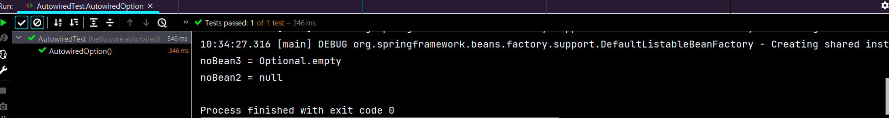

# 0. 다양한 의존관계 주입 방법

## 생성자 주입

- 생성자를 통해 주입, 불변/필수 의존관계에 사용한다.

- ```java
   @Autowired
   public OrderServiceImpl(MemberRepository memberRepository, DiscountPolicy
  discountPolicy) {
       this.memberRepository = memberRepository;
       this.discountPolicy = discountPolicy;
   }
  ```

- 생성자가 딱 1개만 있으면 @Autowired를 생략해도 자동 주입 된다.

## 수정자 주입(setter 주입)

- setter라 불리는 필드의 값을 변경하는 수정자 메서드를 통해서 의존관계를 주입하는 방법이다.

  - 선택, 변경 가능성이 있는 의존관계에 사용한다.
  -  자바빈 프로퍼티 규약의 수정자 메서드 방식을 사용하는 방법이다.

- ```java
  @Autowired
   public void setMemberRepository(MemberRepository memberRepository) {
   	this.memberRepository = memberRepository;
   }
   @Autowired
   public void setDiscountPolicy(DiscountPolicy discountPolicy) {
   	this.discountPolicy = discountPolicy;
   }
  ```

- @Autowired 의 기본 동작은 주입할 대상이 없으면 오류가 발생한다. 주입할 대상이 없어도 동작하게 하려면 @Autowired(required = false) 로 지정하면 된다.

## 필드 주입(웬만하면 사용 x)

- 필드에 바로 주입하는 방법이다.

- 코드가 간결해서 많은 개발자들을 유혹하지만 외부에서 변경이 불가능해서 테스트 하기 힘들다는 치명적인 단점이 있다.

- ```java
  @Autowired
   private MemberRepository memberRepository;
   @Autowired
   private DiscountPolicy discountPolicy;
  ```

## 일반 메서드 주입

- 일반 메서드를 통해 주입받는 것으로, 일반적으로 잘 사용하지 않는다.

- ```java
  @Autowired
   public void init(MemberRepository memberRepository, DiscountPolicy
  discountPolicy) {
       this.memberRepository = memberRepository;
       this.discountPolicy = discountPolicy;
   }
  ```

# 1. 옵션처리

- 주입할 스프링 빈이 없어도 동작해야 할 때가 있다. 그런데 @Autowired 만 사용하면 required 옵션의 기본값이 true 로 되어 있어서 자동 주입 대상이 없으면 오류가 발생한다.

## 자동 주입대상을 옵션으로 처리하는 방법

- @Autowired(required=false) : 자동 주입할 대상이 없으면 수정자 메서드 자체가 호출되지 않는다.
- org.springframework.lang.@Nullable : 자동 주입할 대상이 없으면 null이 입력된다. 
- Optional<> : 자동 주입할 대상이 없으면 Optional.empty 가 입력된다.

## 예제

- ```java
  package hello.core.autowired;
  
  import hello.core.member.Member;
  import org.junit.jupiter.api.Test;
  import org.springframework.beans.factory.annotation.Autowired;
  import org.springframework.context.ApplicationContext;
  import org.springframework.context.annotation.AnnotationConfigApplicationContext;
  import org.springframework.lang.Nullable;
  
  import java.util.Optional;
  
  public class AutowiredTest {
  
      @Test
      void AutowiredOption(){
          ApplicationContext ac = new AnnotationConfigApplicationContext(TestBean.class);
      }
  
      static class TestBean{
          @Autowired(required = false)
          public void setNoBean1(Member noBean1){
              System.out.println("noBean1 = " + noBean1);
          }
  
          @Autowired
          public void setNoBean2(@Nullable Member noBean2){
              System.out.println("noBean2 = " + noBean2);
          }
  
          @Autowired
          public void setNoBean3(Optional<Member> noBean3){
              System.out.println("noBean3 = " + noBean3);
          }
      }
  }
  ```

- 

- 테스트를 돌리면 noBean1 은 아예 호출이 되지 않는 것을 알 수 있다.

# 2. 생성자 주입

- 과거에는 수정자 주입과 필드 주입을 많이 사용했지만, 최근에는 스프링을 포함한 DI 프레임워크 대부분이 생성자 주입을 권장한다. 그 이유는 다음과 같다. 

## 불변 

- 대부분의 의존관계 주입은 한번 일어나면 애플리케이션 종료시점까지 의존관계를 변경할 일이 없다. 오히려 대부분의 의존관계는 애플리케이션 종료 전까지 변하면 안된다.(불변해야 한다.) 
- 수정자 주입을 사용하면, setXxx 메서드를 public으로 열어두어야 한다. 
- 누군가 실수로 변경할 수도 있고, 변경하면 안되는 메서드를 열어두는 것은 좋은 설계 방법이 아니다. 
- 생성자 주입은 객체를 생성할 때 딱 1번만 호출되므로 이후에 호출되는 일이 없다. 따라서 불변하게 설계할 수 있다. 

## 누락 

- 프레임워크 없이 순수한 자바 코드를 단위 테스트 하는 경우에 다음과 같이 수정자 의존관계인 경우 컴파일 오류가 발생하지 않지만, 
- 생성자 주입을 사용하면 다음처럼 주입 데이터를 누락 했을 때 컴파일 오류가 발생한다. 그리고 IDE에서 바로 어떤 값을 필수로 주입해야 하는지 알 수 있다.

# 3. 롬복과 최신트랜드

- 기본 코드에서 계속 중복되는 내용을 생략하고 간단하게 만들기 위해서 롬복(Lombok) 사용

## 기본코드

- ```java
  @Component
  public class OrderServiceImpl implements OrderService {
  
      private final MemberRepository memberRepository;
      private final DiscountPolicy discountPolicy;
  
      @Autowired
      public OrderServiceImpl(MemberRepository memberRepository, DiscountPolicy discountPolicy) {
          this.memberRepository = memberRepository;
          this.discountPolicy = discountPolicy;
      }
  ```

## lombok 적용

- ```java
  @Component
  @RequiredArgsConstructor
  public class OrderServiceImpl implements OrderService {
  
      private final MemberRepository memberRepository;
      private final DiscountPolicy discountPolicy;
  
  //    @Autowired
  //    public OrderServiceImpl(MemberRepository memberRepository, DiscountPolicy discountPolicy) {
  //        this.memberRepository = memberRepository;
  //        this.discountPolicy = discountPolicy;
  //    }
  ```

- @RequiredArgsConstructor 을 통해 final 이 붙은 매개변수를 파라미터로 받아 생성자를 만들어준다.

- ctrl + F12 를 해보면 해당 클래스의 메서드와 변수를 확인할 수 있는데, 생성자가 만들어졌다는 것을 알 수 있다.

- **최근에는 생성자를 딱 1개 두고, @Autowired 를 생략하는 방법을 주로 사용한다. 여기에 Lombok 라이브러리의 @RequiredArgsConstructor 함께 사용하면 기능은 다 제공하면서, 코드는 깔끔하게 사용할 수 있다.**

# 4. 조회 빈이 2개 이상되는 문제

- @Autowired 는 타입으로 조회하기 때문에 다음 코드와 유사하게 동작한다.
  - ac.getBean(DiscountPolicy.class) (실제로는 더 많은 기능을 제공한다.)
- DiscountPolicy 의 하위 타입인 FixDiscountPolicy , RateDiscountPolicy 둘다 스프링 빈으로 선언하면 NoUniqueBeanDefinitionException 오류가 발생한다.

- 스프링 빈을 수동 등록해서 문제를 해결해도 되지만, 의존 관계 자동 주입에서 해결하는 여러 방법이 있다

# 5. @Autowired 필드 명, @Qualifier, @Primary(조회 빈 2개 이상 문제 해결)

## @Autowired 필드 명 매칭

- @Autowired 는 타입 매칭을 시도하고, 이때 여러 빈이 있으면 필드 이름, 파라미터 이름으로 빈 이름을 추가 매칭한다.

- ```java
  @Autowired
  private DiscountPolicy rateDiscountPolicy
  ```

- 필드 명이 rateDiscountPolicy 이므로 정상 주입된다. 필드 명 매칭은 먼저 타입 매칭을 시도 하고 그 결과에 여러 빈이 있을 때 추가로 동작하는 기능이다.

## @Qualifier 사용

- @Qualifier 는 추가 구분자를 붙여주는 방법이다. 주입시 추가적인 방법을 제공하는 것이지 빈 이름을 변경하는 것은 아니다.
- NoSuchBeanDefinitionException 예외가 발생할 수 있다.
- @Qualifier 의 단점은 주입 받을 때 다음과 같이 모든 코드에 @Qualifier 를 붙여주어야 한다는 점이다.

### 예제

- RateDiscountPolicy 와 FixDiscountPolicy 클래스에 @Qualifier 를 붙인다.

  - ```java
    @Component
    @Qualifier("mainDiscountPolicy")
    public class RateDiscountPolicy implements DiscountPolicy{
    ```

  - ```java
    @Component
    @Qualifier("fixDiscountPolicy")
    public class FixDiscountPolicy implements DiscountPolicy {
    ```

- 생성자, 수정자 등 자동 주입 시 @Qulifier("name") 을 붙여준다.

  - ```java
    @Autowired
        public OrderServiceImpl(MemberRepository memberRepository, @Qualifier("mainDiscountPolicy") DiscountPolicy discountPolicy) {
            this.memberRepository = memberRepository;
            this.discountPolicy = discountPolicy;
        }
    ```

- 직접 빈 등록 시에도  @Qualifier를 동일하게 사용할 수 있다.

  - ```java
    @Bean
    @Qualifier("mainDiscountPolicy")
    public DiscountPolicy discountPolicy() {
    	return new ...
    }
    ```

## @Primary 사용 

- @Primary 는 우선순위를 정하는 방법이다. @Autowired 시에 여러 빈이 매칭되면 @Primary 가 우선권을 가진다.

- rateDiscountPolicy 가 우선권을 가질 때

  - ```java
    @Component
    @Primary
    public class RateDiscountPolicy implements DiscountPolicy {}
    
    @Component
    public class FixDiscountPolicy implements DiscountPolicy {}
    ```

  - 생성자, 수정자는 그냥 사용하면 된다.

## @Primary, @Qualifier 활용

### 우선순위

- 스프링은 자동보다는 수동이, 넒은 범위의 선택권 보다는 좁은 범위의 선택권이 우선 순위가 높다.
- @Primary 는 기본값 처럼 동작하는 것이고, @Qualifier 는 매우 상세하게 동작한다.
- 따라서 @Qualifier 가 우선권이 높다.

### 구분 사용 예시

- main DB 의 커넥션을 획득하는 스프링 빈은 @Primary
- sub DB 의 커넥션을 획득하는 스프링 빈은 @Qualifier
- **sub DB 기능을 이용해야 할 때만 @Qualifier 를 붙여주면 코드를 깔끔하게 유지할 수 있다!**

# 6. 어노테이션 직접 만들기

## Qualifier 문제점

- Qualifier("mainDiscountPolicy") 이렇게 문자를 적으면 컴파일시 타입 체크가 안된다.
  - ex. mainnDiscountPolicy 처럼 오타가 나도 문자열이기 때문에 컴파일 오류 x

## Qualifier 를 포함한 어노테이션 만들기(@MainDiscountPolicy)

- hello.core.annotation 에 생성한다.
- @Qualifier 에서 사용하는 모든 어노테이션을 다 붙여넣는다.
- 마지막으로 @Qualifier("mainDiscountPolicy") 를 사용한다.

- ```java
  package hello.core.annotation;
  
  import org.springframework.beans.factory.annotation.Qualifier;
  
  import java.lang.annotation.*;
  
  @Target({ElementType.FIELD, ElementType.METHOD, ElementType.PARAMETER, ElementType.TYPE, ElementType.ANNOTATION_TYPE})
  @Retention(RetentionPolicy.RUNTIME)
  @Inherited
  @Documented
  @Qualifier("mainDiscountPolicy")
  public @interface MainDiscountPolicy {
  }
  ```

- 애노테이션에는 상속이라는 개념이 없다. 이렇게 여러 애노테이션을 모아서 사용하는 기능은 스프링이 지원해주는 기능이다. @Qulifier 뿐만 아니라 다른 애노테이션들도 함께 조합해서 사용할 수 있다. 
- 단적으로 @Autowired도 재정의 할 수 있다. 물론 스프링이 제공하는 기능을 뚜렷한 목적 없이 무분별하게 재정의 하는 것은 유지보수에 더 혼란만 가중할 수 있다.

### @MainDiscountPolicy 사용

- 해당 어노테이션은 @Qualifier 처럼 사용하면 되지만, 문자열이 없어서 컴파일 오류를 잡기 쉽다.

- ```java
  @Component
  @MainDiscountPolicy
  public class RateDiscountPolicy implements DiscountPolicy {}
  ```

- ```java
  @Autowired
  public OrderServiceImpl(MemberRepository memberRepository,
   @MainDiscountPolicy DiscountPolicy discountPolicy) {
       this.memberRepository = memberRepository;
       this.discountPolicy = discountPolicy;
  }
  ```

# 7. 조회한 빈이 모두 필요할 때(List, Map)

- 의도적으로 정말 해당 타입의 스프링 빈이 다 필요한 경우도 있다.
-  예를 들어서 할인 서비스를 제공하는데, 클라이언트가 할인의 종류(rate, fix)를 선택할 수 있다고 가정해보자. 
- 스프링을 사용하면 소위 말하는 전략 패턴을 매우 간단하게 구현할 수 있다.

## 테스트 코드

- ```java
  package hello.core.autowired;
  
  import ...;
  
  public class AllBeanTest {
  
      @Test
      void findAllBean(){
          //아래의 DiscountService 도 config 로 등록
          AnnotationConfigApplicationContext ac = new AnnotationConfigApplicationContext(AutoAppConfig.class, DiscountService.class);
  
          DiscountService discountService = ac.getBean(DiscountService.class);
  		//등록되었는지 확인
          assertThat(discountService).isInstanceOf(DiscountService.class);
  
          Member member = new Member(1L, "userA", Grade.VIP);
  
          //discountService.discount 로 fixDiscountPolicy 구현
          int discountPrice = discountService.discount(member, 10000, "fixDiscountPolicy");
          assertThat(discountPrice).isEqualTo(1000);
  
          //discountService.discount 로 rateDiscountPolicy 구현
          int rateDiscountPrice = discountService.discount(member, 20000, "rateDiscountPolicy");
          assertThat(rateDiscountPrice).isEqualTo(2000);
  
  
      }
  
      static class DiscountService{
          private final Map<String, DiscountPolicy> policyMap;
          private final List<DiscountPolicy> policies;
  
          @Autowired //생략가능
          public DiscountService(Map<String, DiscountPolicy> policyMap, List<DiscountPolicy> policies) {
              this.policyMap = policyMap;
              this.policies = policies;
              System.out.println("policyMap = " + policyMap);
              System.out.println("policies = " + policies);
          }
  
          //discountCode(fix or rate) 를 매개변수로 받아서 해당 정책에 맞게 DiscountPolicy 를 변경
          public int discount(Member member, int price, String discountCode) {
              DiscountPolicy discountPolicy = policyMap.get(discountCode);
              return discountPolicy.discount(member, price);
          }
      }
  }
  ```

## 주입분석

- Map : map의 키에 스프링 빈의 이름을 넣어주고, 그 값으로 DiscountPolicy 타입으로 조회한 모든 스프링 빈을 담아준다.
-  List : DiscountPolicy 타입으로 조회한 모든 스프링 빈을 담아준다. 
- 만약 해당하는 타입의 스프링 빈이 없으면, 빈 컬렉션이나 Map을 주입한다.

# 8. 자동, 수동의 올바른 실무 운영 기준

- 기본적으로 자동 빈 등록이 기본이며 자동으로 해도 OCP, DIP 를 지킬 수 있다.
- 어플리케이션은 크게 업무 로직과 기술 지원 로직으로 나눌 수 있다.
  - 업무 로직 빈: 웹을 지원하는 컨트롤러, 핵심 비즈니스 로직이 있는 서비스, 데이터 계층의 로직을 처리하는 리포지토리등이 모두 업무 로직이다. 보통 비즈니스 요구사항을 개발할 때 추가되거나 변경된다. 
  - 기술 지원 빈: 기술적인 문제나 공통 관심사(AOP)를 처리할 때 주로 사용된다. 데이터베이스 연결이나, 공통 로그 처리 처럼 업무 로직을 지원하기 위한 하부 기술이나 공통 기술들이다
- 기술 지원 로직은 업무 로직과 비교해서 그 수가 매우 적고, 보통 애플리케이션 전반에 걸쳐서 광범위하게 영향을 미친다. 그리고 업무 로직은 문제가 발생했을 때 어디가 문제인지 명확하게 잘 드러나지만, 기술 지원 로직은 적용이 잘 되고 있는지 아닌지 조차 파악하기 어려운 경우가 많다. 그래서 이런 기술 지원 로직들은 가급적 수동 빈 등록을 사용해서 명확하게 드러내는 것이 좋다.

## 비즈니스 로직 중에서 다형성을 적극 활용할 때

- 아까 사용한  List, Map 등과 같이 의존관계 자동 주입 시 코드를 한번에 쉽게 파악할 수 없다면 수동 빈으로 등록하거나 또는 자동으로하면 특정 패키지에 같이 묶어두는게 좋다