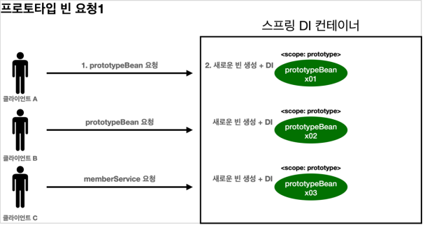
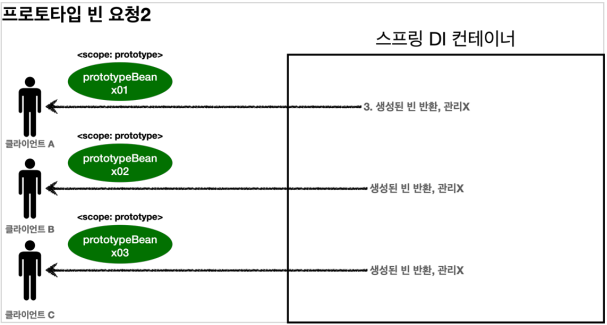
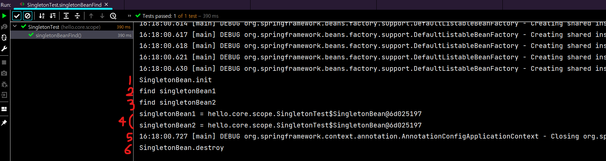
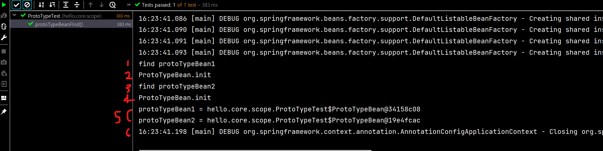
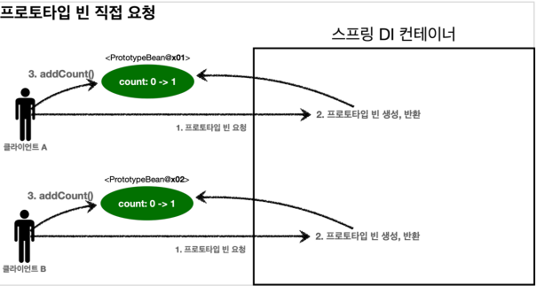
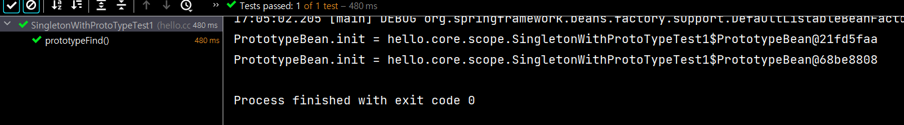
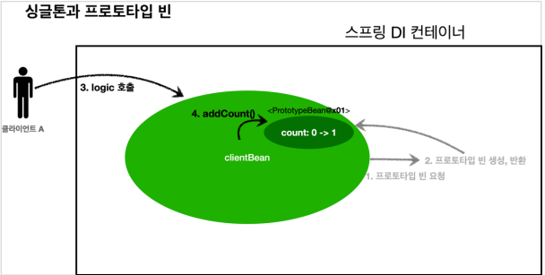
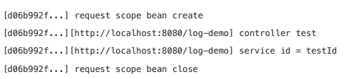
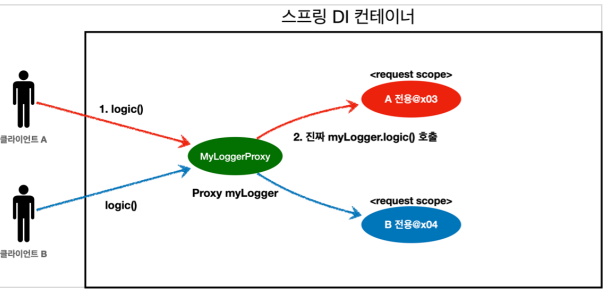

# 0. 빈 스코프란?

- 스코프는 빈이 존재할 수 있는 범위를 뜻한다.

## 종류

- 싱글톤: 기본 스코프, 스프링 컨테이너의 시작과 종료까지 유지되는 가장 넓은 범위의 스코프이다. 
- 프로토타입: 스프링 컨테이너는 프로토타입 빈의 생성과 의존관계 주입까지만 관여하고 더는 관리하지 않는 매우 짧은 범위의 스코프이다. 
- 웹 관련 스코프
  -  request: 웹 요청이 들어오고 나갈때 까지 유지되는 스코프이다. 
  - session: 웹 세션이 생성되고 종료될 때 까지 유지되는 스코프이다. 
  - application: 웹의 서블릿 컨텍스트와 같은 범위로 유지되는 스코프이다.

# 1. 프로토타입 스코프

- 싱글톤 스코프의 빈을 조회하면 스프링 컨테이너는 항상 같은 인스턴스의 스프링 빈을 반환한다. 반면에 프로토타입 스코프를 스프링 컨테이너에 조회하면 스프링 컨테이너는 항상 새로운 인스턴스를 생성해서 반환한다.

## 프로토타입 빈 요청

- 
- 
  1. 프로토타입 스코프의 빈을 스프링 컨테이너에 요청한다. 
  2. 스프링 컨테이너는 이 시점에 프로토타입 빈을 생성하고, 필요한 의존관계를 주입한다.
  3. 스프링 컨테이너는 생성한 프로토타입 빈을 클라이언트에 반환한다.
  4. 이후에 스프링 컨테이너에 같은 요청이 오면 항상 새로운 프로토타입 빈을 생성해서 반환한다.

- **여기서 핵심은 스프링 컨테이너는 프로토타입 빈을 생성하고, 의존관계 주입, 초기화까지만 처리한다는 것이다.**
-  클라이언트에 빈을 반환하고, 이후 스프링 컨테이너는 생성된 프로토타입 빈을 관리하지 않는다. 프로토타입 빈을 관리할 책임은 프로토타입 빈을 받은 클라이언트에 있다. 그래서 @PreDestroy 같은 종료 메서드가 호출되지 않는다.

## 싱글톤 스코프 빈 테스트

- ```java
  package hello.core.scope;
  
  import jakarta.annotation.PostConstruct;
  import jakarta.annotation.PreDestroy;
  import org.assertj.core.api.Assertions;
  import org.junit.jupiter.api.Test;
  import org.springframework.context.annotation.AnnotationConfigApplicationContext;
  import org.springframework.context.annotation.Scope;
  import static org.assertj.core.api.Assertions.*;
  
  public class SingletonTest {
  
      @Test
      void singletonBeanFind(){
          // 직접 등록하면 자동으로 컴포넌트화가 되어 스캔돼서 등록됨
          AnnotationConfigApplicationContext ac = new AnnotationConfigApplicationContext(SingletonBean.class);
  
          System.out.println("find singletonBean1");
          SingletonBean singletonBean1 = ac.getBean(SingletonBean.class);
          System.out.println("find singletonBean2");
          SingletonBean singletonBean2 = ac.getBean(SingletonBean.class);
          System.out.println("singletonBean1 = " + singletonBean1);
          System.out.println("singletonBean2 = " + singletonBean2);
          //같은 인스턴스임
          assertThat(singletonBean1).isSameAs(singletonBean2);
  
          ac.close();
      }
  
      @Scope("singleton")
      static class SingletonBean{
          @PostConstruct
          public void init(){
              System.out.println("SingletonBean.init");
          }
          @PreDestroy
          public void destroy(){
              System.out.println("SingletonBean.destroy");
          }
      }
  }
  ```

- 

  - 1번에서 콜백 실행
  - 2, 3, 4번에서 출력(사용)
  - 4번에서 같은 스프링 빈임을 알 수 있음
  - 6번에서 스프링빈 종료 전 콜백 실행

## 프로토타입 스코프 빈 테스트

- ```java
  package hello.core.scope;
  
  import jakarta.annotation.PostConstruct;
  import jakarta.annotation.PreDestroy;
  import org.assertj.core.api.Assertions;
  import org.junit.jupiter.api.Test;
  import org.springframework.context.annotation.AnnotationConfigApplicationContext;
  import org.springframework.context.annotation.Scope;
  import static org.assertj.core.api.Assertions.*;
  import static org.assertj.core.api.Assertions.assertThat;
  
  public class ProtoTypeTest {
  
      @Test
      void protoTypeBeanFind(){
          AnnotationConfigApplicationContext ac
                  = new AnnotationConfigApplicationContext(ProtoTypeBean.class);
  
          System.out.println("find protoTypeBean1");
          ProtoTypeBean protoTypeBean1 = ac.getBean(ProtoTypeBean.class);
          System.out.println("find protoTypeBean2");
          ProtoTypeBean protoTypeBean2 = ac.getBean(ProtoTypeBean.class);
  
          System.out.println("protoTypeBean1 = " + protoTypeBean1);
          System.out.println("protoTypeBean2 = " + protoTypeBean2);
  
          assertThat(protoTypeBean1).isNotSameAs(protoTypeBean2);
  
          ac.close();
      }
  
      @Scope("prototype")
      static class ProtoTypeBean{
          @PostConstruct
          public void init(){
              System.out.println("ProtoTypeBean.init");
          }
  
          @PreDestroy
          public void destroy(){
              System.out.println("ProtoTypeBean.destroy");
          }
      }
  }
  
  ```

-  

  - 싱글톤 빈은 스프링 컨테이너 생성 시점에 초기화 메서드가 실행 되지만, 프로토타입 스코프의 빈은 스프링 컨테이너에서 빈을 조회할 때 생성되고, 초기화 메서드도 실행된다.
  - 따라서 1번(사용)이 먼저 실행되고 2번(초기화 메서드)이 실행된다. (3, 4번 동일)
  - 프로토타입 빈을 2번 조회했으므로 완전히 다른 스프링 빈이 생성된다.(5번)
  - 프로토타입 빈은 스프링 컨테이너가 생성과 의존관계 주입 그리고 초기화 까지만 관여하고, 더는 관리하지 않는다. 따라서 프로토타입 빈은 스프링 컨테이너가 종료될 때 @PreDestroy 같은 종료 메서드가 전혀 실행되지 않는다.(6번)
  - 종료 메서드를 호출해야 한다면 클라이언트가 직접 해야한다. (protoTypeBean.destroy())

# 2. 프로토타입 스코프 - 싱글톤 빈과 함께 사용시 문제점

## 프로토타입 빈 직접 요청

- 
  1. 클라이언트A 는 스프링 컨테이너에 프로토타입 빈을 요청한다. 
  2. 스프링 컨테이너는 프로토타입 빈을 새로 생성해서 반환(x01)한다. 해당 빈의 count 필드 값은 0이다.
  3. 클라이언트는 조회한 프로토타입 빈에 addCount() 를 호출하면서 count 필드를 +1 한다.
  4.  결과적으로 프로토타입 빈(x01)의 count는 1이 된다. 
  5. 클라이언트B 도 동일하다.

## 예제코드 (test)

- 주석 확인

- ```java
  package hello.core.scope;
  
  import jakarta.annotation.PostConstruct;
  import jakarta.annotation.PreDestroy;
  import org.assertj.core.api.Assertions;
  import org.junit.jupiter.api.Test;
  import org.springframework.context.annotation.AnnotationConfigApplicationContext;
  import org.springframework.context.annotation.Scope;
  
  import static org.assertj.core.api.Assertions.*;
  
  public class SingletonWithProtoTypeTest1 {
  
      @Test
      void prototypeFind() {
          AnnotationConfigApplicationContext ac = new AnnotationConfigApplicationContext(PrototypeBean.class);
          //prototypeBean1 에 addCount() 결과 1
          PrototypeBean prototypeBean1 = ac.getBean(PrototypeBean.class);
          prototypeBean1.addCount();
          assertThat(prototypeBean1.getCount()).isEqualTo(1);
          //prototypeBean2 도 마찬가지로 addCount() 결과 1 이다.
          PrototypeBean prototypeBean2 = ac.getBean(PrototypeBean.class);
          prototypeBean2.addCount();
          assertThat(prototypeBean2.getCount()).isEqualTo(1);
      }
  
  
      @Scope("prototype")
      static class PrototypeBean {
          private int count = 0;
  
          public void addCount() {count++;}
  
          public int getCount() {return count;}
  
          @PostConstruct
          public void init() {
              System.out.println("PrototypeBean.init = " + this);
          }
  
          @PreDestroy
          public void destroy() {
              System.out.println("PrototypeBean.destroy");
          }
      }
  }
  ```

  - 

  - 두 프로토타입은 값이 다르고, @PreDestroy 는 실행되지 않는다.

## 싱글톤 빈에서 프로토타입 빈 사용

- 이번에는 clientBean 이라는 싱글톤 빈이 의존관계 주입을 통해서 프로토타입 빈을 주입받아서 사용하는 예를 보자.
- 

- 
  1. clientBean 은 싱글톤이므로, 보통 스프링 컨테이너 생성 시점에 함께 생성되고, 의존관계 주입도 발생한다. clientBean 은 의존관계 자동 주입을 사용한다. 주입 시점에 스프링 컨테이너에 프로토타입 빈을 요청한다.
  2. 스프링 컨테이너는 프로토타입 빈을 생성해서 clientBean 에 반환한다. 프로토타입 빈의 count 필드 값은 0이다. 
     - 이제 clientBean 은 프로토타입 빈을 내부 필드에 보관한다. (정확히는 참조값을 보관한다.)
  3. 클라이언트 A는 clientBean 을 스프링 컨테이너에 요청해서 받는다. 싱글톤이므로 항상 같은 clientBean 이 반환된다. 클라이언트 A는 clientBean.logic() 을 호출한다.
  4. clientBean 은 prototypeBean의 addCount() 를 호출해서 프로토타입 빈의 count를 증가한다. count값이 1이 된다.
  5. 클라이언트 B는 clientBean 을 스프링 컨테이너에 요청해서 받는다.싱글톤이므로 항상 같은 clientBean 이 반환된다. 클라이언트 B는 clientBean.logic() 을 호출한다.
     - 여기서 중요한 점이 있는데, clientBean이 내부에 가지고 있는 프로토타입 빈은 이미 과거에 주입이 끝난 빈이다. 주입 시점에 스프링 컨테이너에 요청해서 프로토타입 빈이 새로 생성이 된 것이지, 사용 할 때마다 새로 생성되는 것이 아니다!
  6. clientBean 은 prototypeBean의 addCount() 를 호출해서 프로토타입 빈의 count를 증가한다. 원래 count 값이 1이었으므로 2가 된다.

## 예제코드 (test)

- ```java
  package hello.core.scope;
  
  import jakarta.annotation.PostConstruct;
  import jakarta.annotation.PreDestroy;
  import org.assertj.core.api.Assertions;
  import org.junit.jupiter.api.Test;
  import org.springframework.context.annotation.AnnotationConfigApplicationContext;
  import org.springframework.context.annotation.Scope;
  
  import static org.assertj.core.api.Assertions.*;
  
  public class SingletonWithProtoTypeTest1 {
  
      @Test
      void singletoneClientUsePrototype(){
          AnnotationConfigApplicationContext ac =
                  new AnnotationConfigApplicationContext(ClientBean.class, PrototypeBean.class);
  
          //clientBean1 호출 후 addCount() (logic()) 호출 결과 1
          ClientBean clientBean1 = ac.getBean(ClientBean.class);
          int count1 = clientBean1.logic();
          assertThat(count1).isEqualTo(1);
          //이후에 clientBean2 호출 후 addCount() (logic()) 호출 결과 2
          ClientBean clientBean2 = ac.getBean(ClientBean.class);
          int count2 = clientBean2.logic();
          assertThat(count2).isEqualTo(2);
  
          //clientBean1의 prototypeBean 과 clientBean2의 prototypeBean 은 같다.
          assertThat(clientBean1.prototypeBean).isSameAs(clientBean2.prototypeBean);
  
  
      }
  
      @Scope("singleton")
      static class ClientBean{
          private final PrototypeBean prototypeBean; //생성시점에 주입
  
          public ClientBean(PrototypeBean prototypeBean) {
              this.prototypeBean = prototypeBean;
          }
  
          public int logic(){
              prototypeBean.addCount();
              return prototypeBean.getCount();
          }
      }
  
       @Scope("prototype")
      static class PrototypeBean {
          private int count = 0;
  
          public void addCount() {count++;}
  
          public int getCount() {return count;}
  
          @PostConstruct
          public void init() {
              System.out.println("PrototypeBean.init = " + this);
          }
  
          @PreDestroy
          public void destroy() {
              System.out.println("PrototypeBean.destroy");
          }
      }
  }
  ```

- 싱글톤 빈은 생성 시점에만 의존관계 주입을 받기 때문에, 프로토타입 빈이 새로 생성되기는 하지만, 싱글톤 빈과 함께 계속 유지되는 것이 문제다.

# 3. 프로토타입 스코프 - 싱글톤 빈과 함께 사용시 Provider로 문제 해결

- 가장 간단한 방법은 싱글톤 빈이 프로토타입을 사용할 때 마다 스프링 컨테이너에 새로 요청하는 것이다.
- 의존관계를 외부에서 주입(DI) 받는게 아니라 직접 필요한 의존관계를 찾는 것을 Dependency Lookup (DL) 의존관계 조회(탐색) 이라한다.

## ObjectFactory, ObjectProvider 예제 코드

- ClientBean 클래스에 `private ObjectProvider<PrototypeBean> prototypeBeanProvider;` 추가

- ClientBean 클래스의 logic() 메서드 변경

- ```java
  package hello.core.scope;
  
  import jakarta.annotation.PostConstruct;
  import jakarta.annotation.PreDestroy;
  import org.assertj.core.api.Assertions;
  import org.junit.jupiter.api.Test;
  import org.springframework.context.annotation.AnnotationConfigApplicationContext;
  import org.springframework.context.annotation.Scope;
  
  import static org.assertj.core.api.Assertions.*;
  
  public class SingletonWithProtoTypeTest1 {
  
      @Test
      void singletoneClientUsePrototype(){
          AnnotationConfigApplicationContext ac =
                  new AnnotationConfigApplicationContext(ClientBean.class, PrototypeBean.class);
  
          //이제 둘 다 결과가 1로 나옴
          ClientBean clientBean1 = ac.getBean(ClientBean.class);
          int count1 = clientBean1.logic();
          assertThat(count1).isEqualTo(1);
          
          ClientBean clientBean2 = ac.getBean(ClientBean.class);
          int count2 = clientBean2.logic();
          assertThat(count2).isEqualTo(1);
      }
  
     @Scope("singleton")
      static class ClientBean{
  
          @Autowired
          private ObjectProvider<PrototypeBean> prototypeBeanProvider;
  
          public int logic(){
              //getObject() 를 하면 그때 스프링빈에서 찾아준다.
              PrototypeBean prototypeBean = prototypeBeanProvider.getObject();
              prototypeBean.addCount();
              return prototypeBean.getCount();
          }
      }
  
       @Scope("prototype")
      static class PrototypeBean {
          private int count = 0;
  
          public void addCount() {count++;}
  
          public int getCount() {return count;}
  
          @PostConstruct
          public void init() {
              System.out.println("PrototypeBean.init = " + this);
          }
  
          @PreDestroy
          public void destroy() {
              System.out.println("PrototypeBean.destroy");
          }
      }
  }
  ```

- 지정한 빈을 컨테이너에서 대신 찾아주는 DL 서비스를 제공하는 것이 바로 ObjectProvider 이다. 참고로 과거에는 ObjectFactory 가 있었는데, 여기에 편의 기능을 추가해서 ObjectProvider 가 만들어졌다.
- ObjectProvider 의 getObject() 를 호출하면 내부에서는 스프링 컨테이너를 통해 해당 빈을 찾아서 반환한다. (DL) 
- 스프링이 제공하는 기능을 사용하지만, 기능이 단순하므로 단위테스트를 만들거나 mock 코드를 만들기는 훨씬 쉬워진다.

## Provider

- ObjectProvider 랑 똑같이 사용한다.

  - implementation 'jakarta.inject:jakarta.inject-api:2.0.1'
  - import jakarta.inject.Provider; (javax 아님)

- ```java
  @Scope("singleton")
  static class ClientBean {
  
      @Autowired
      private Provider<PrototypeBean> provider;
  
      public int logic(){
          //get() 를 하면 그때 스프링빈에서 찾아준다.
          PrototypeBean prototypeBean = provider.get();
          prototypeBean.addCount();
          int count = prototypeBean.getCount();
          return count;
      }
  }
  ```

### 특징

- 자바 표준이고, 기능이 단순하므로 단위테스트를 만들거나 mock 코드를 만들기는 훨씬 쉬워진다. 
- Provider 는 지금 딱 필요한 DL 정도의 기능만 제공한다.
- get() 메서드 하나로 기능이 매우 단순하다. 
- 별도의 라이브러리가 필요하다. 
- 자바 표준이므로 스프링이 아닌 다른 컨테이너에서도 사용할 수 있다.

## 정리

- 프로토타입 빈은 매번 사용할 때 마다 의존관계 주입이 완료된 새로운 객체가 필요하면 사용하면 된다. 
  - 그런데 실무에서 웹 애플리케이션을 개발해보면, 싱글톤 빈으로 대부분의 문제를 해결할 수 있기 때문에 프로토타입 빈을 직접적으로 사용하는 일은 매우 드물다. 
- ObjectProvider , JSR330 Provider 등은 프로토타입 뿐만 아니라 DL이 필요한 경우는 언제든지 사용할 수 있다.
  - 예를 들어, 순환 참조 등을 해결하기 위해 의존관계 주입을 뒤로 미룰 때 사용할 수도 있다.

# 4. 웹 스코프(request 스코프 예제 중심)

- 웹 스코프는 웹 환경에서만 동작한다. 
- 웹 스코프는 프로토타입과 다르게 스프링이 해당 스코프의 종료시점까지 관리한다. 따라서 종료 메서드가 호출된다.

## request 스코프 예제 개발

- 동시에 여러 HTTP 요청이 오면 정확히 어떤 요청이 남긴 로그인지 구분하기 어렵다. 이럴때 사용하기 딱 좋은것이 바로 request 스코프이다.

- 다음과 같은 로그가 남도록 추가 기능 개발

  - 

  - 기대하는 공통 포멧: [UUID][requestURL] {message}

## MyLogger

- 로그를 출력하기 위한 클래스이다. 

- @Scope(value = "request") 를 사용해서 request 스코프로 지정했다. 이제 이 빈은 HTTP 요청 당 하나씩 생성되고, HTTP 요청이 끝나는 시점에 소멸된다.

- 이 빈이 생성되는 시점에 자동으로 @PostConstruct 초기화 메서드를 사용해서 uuid를 생성해서 저장해둔다. 이 빈은 HTTP 요청 당 하나씩 생성되므로, uuid를 저장해두면 다른 HTTP 요청과 구분할 수 있다.

-  빈이 소멸되는 시점에 @PreDestroy 를 사용해서 종료 메시지를 남긴다. 

- requestURL 은 이 빈이 생성되는 시점에는 알 수 없으므로, 외부에서 setter로 입력 받는다.

- ```java
  package hello.core.common;
  
  import jakarta.annotation.PostConstruct;
  import jakarta.annotation.PreDestroy;
  import org.springframework.context.annotation.Scope;
  import org.springframework.stereotype.Component;
  
  import java.util.UUID;
  
  @Component
  @Scope(value="request")
  public class MyLogger {
  
      private String uuid;
      private String requestURL;
  
      public void setRequestURL(String requestURL) {
          this.requestURL = requestURL;
      }
  
      public void log(String message){
          System.out.println("[" + uuid + "]" + "[" + requestURL + "] " + message);
      }
  
      @PostConstruct
      public void init(){
          uuid = UUID.randomUUID().toString();
          System.out.println("[" + uuid + "]  request scope bean create : " + this);
      }
  
      @PreDestroy
      public void close(){
          System.out.println("[" + uuid + "]  request scope bean close : " + this);
      }
  }
  ```

## LogDemoController

- 로거가 잘 작동하는지 확인하는 테스트용 컨트롤러다. 
- 여기서 HttpServletRequest를 통해서 요청 URL을 받았다. 
  - requestURL 값 http://localhost:8080/log-demo

- ```java
  package hello.core.web;
  
  import hello.core.common.MyLogger;
  import jakarta.servlet.http.HttpServletRequest;
  import lombok.RequiredArgsConstructor;
  import org.springframework.beans.factory.ObjectProvider;
  import org.springframework.stereotype.Controller;
  import org.springframework.web.bind.annotation.RequestMapping;
  import org.springframework.web.bind.annotation.ResponseBody;
  
  @Controller
  @RequiredArgsConstructor
  public class LogDemoController {
  
      private final LogDemoService logDemoService;
      private final ObjectProvider<MyLogger> myLoggerProvider;
  
      @RequestMapping("log-demo")
      @ResponseBody
      public String logDemo(HttpServletRequest request) {
          String requestURL = request.getRequestURL().toString();
          MyLogger myLogger = myLoggerProvider.getObject();
          myLogger.setRequestURL(requestURL);
  
          myLogger.log("controller test");
          logDemoService.logic("testId");
          return "OK";
      }
  }
  ```

## LogDemoService

- ```java
  package hello.core.web;
  
  import hello.core.common.MyLogger;
  import lombok.RequiredArgsConstructor;
  import org.springframework.beans.factory.ObjectProvider;
  import org.springframework.stereotype.Service;
  
  @Service
  @RequiredArgsConstructor
  public class LogDemoService {
  
      private final ObjectProvider<MyLogger> myLoggerProvider;
  
      public void logic(String id) {
          MyLogger myLogger = myLoggerProvider.getObject();
          myLogger.log("service id = " + id);
      }
  }
  ```


## Provider 사용

- MyLogger 는 request 가 있어야 호출되기 때문에 스프링 시작부터 빈이 생성되는게 아니라 지연되어야 한다.
- 따라서 ObjectProvider 를 통해 ObjectProvider.getObject() 를 호출하는 시점까지 request scope 빈의 생성을 지연한다.

# 5. 스코프와 프록시

## 프록시 적용

- ```java
  @Component
  @Scope(value = "request", proxyMode = ScopedProxyMode.TARGET_CLASS)
  public class MyLogger {
  }
  ```

-  proxyMode = ScopedProxyMode.TARGET_CLASS 를 추가해주자. 

  - 적용 대상이 인터페이스가 아닌 클래스면 TARGET_CLASS 를 선택 
  - 적용 대상이 인터페이스면 INTERFACES 를 선택 

- 이렇게 하면 MyLogger의 가짜 프록시 클래스를 만들어두고 HTTP request와 상관 없이 가짜 프록시 클래스를 다른 빈에 미리 주입해 둘 수 있다.

- 나머지 클래스(LogDemoController, LogDemoService) 에서도 provider 코드를 없애고 `    private final MyLogger myLogger;` 를 선언해서 바로 사용 가능하다.

## 동작원리

- 주입된 myLogger 값은 `myLogger = class hello.core.common.MyLogger$$SpringCGLIB$$0` 로 출력된다.
- @Scope 의 proxyMode = ScopedProxyMode.TARGET_CLASS) 를 설정하면 스프링 컨테이너는 CGLIB 라는 바이트코드를 조작하는 라이브러리를 사용해서, MyLogger를 상속받은 가짜 프록시 객체를 생성한다.
- 그리고 스프링 컨테이너에 "myLogger"라는 이름으로 진짜 대신에 이 가짜 프록시 객체를 등록한다.
- 그래서 의존관계 주입도 이 가짜 프록시 객체가 주입된다.
- 

### 가짜 프록시 객체는 요청이 오면 그때 내부에서 진짜 빈을 요청하는 위임 로직이 들어있다.

- 가짜 프록시 객체는 내부에 진짜 myLogger를 찾는 방법을 알고 있다. 
- 클라이언트가 myLogger.logic() 을 호출하면 사실은 가짜 프록시 객체의 메서드를 호출한 것이다. 
- 가짜 프록시 객체는 request 스코프의 진짜 myLogger.logic() 를 호출한다. 
- 가짜 프록시 객체는 원본 클래스를 상속 받아서 만들어졌기 때문에 이 객체를 사용하는 클라이언트 입장에서는 사실 원본인지 아닌지도 모르게, 동일하게 사용할 수 있다(다형성)

## 동작 정리

- CGLIB라는 라이브러리로 내 클래스를 상속 받은 가짜 프록시 객체를 만들어서 주입한다.
-  이 가짜 프록시 객체는 실제 요청이 오면 그때 내부에서 실제 빈을 요청하는 위임 로직이 들어있다. 
- 가짜 프록시 객체는 실제 request scope와는 관계가 없다. 그냥 가짜이고, 내부에 단순한 위임 로직만 있고, 싱글톤 처럼 동작한다.

### 특징

- 프록시 객체 덕분에 클라이언트는 마치 싱글톤 빈을 사용하듯이 편리하게 request scope를 사용할 수 있다. 
- 사실 Provider를 사용하든, 프록시를 사용하든 핵심 아이디어는 진짜 객체 조회를 꼭 필요한 시점까지 지연처리 한다는 점이다. 
- 단지 애노테이션 설정 변경만으로 원본 객체를 프록시 객체로 대체할 수 있다. 이것이 바로 다형성과 DI 컨테이너가 가진 큰 강점이다. 
- **꼭 웹 스코프가 아니어도 프록시는 사용할 수 있다.**