# 0. 프로젝트 생성

- 스트링부트 initializer 로 프로젝트 생성
  - Packaging는 Jar가 아니라 War를 선택한다. -> JSP를 실행하기 위해서 필요
  - spring web, lombok 추가
- Setting 변경
  - Settings 에서 Build Tools > Gradle 에서 'Building and run using' 과 'Run tests unsing' 을 Intellij IDEA 로 변경
  - Settings 에서 Compiler > Annotation Processors 에서 Enable annotation processing 체크
    - 그래야 롬복을 사용할 수 있다.
- Postman 다운로드 > HTTP API 실행 및 확인 목적


# 1. Hello 서블릿 (서블릿 페이지 생성)

- build.gradle 에서 dependencies 에 `providedRuntime 'org.springframework.boot:spring-boot-starter-tomcat'` 을 삭제해야 한다. -> 답변

  - gradle의 providedRuntime는 별도의 런타임 환경에서 라이브러리가 제공된다는 뜻입니다. 그래서 이 부분을 실행할 때 해당 라이브러리를 사용하지 않아서 발생하는 문제입니다. (별도의 톰캣 서버를 띄우고 그 서버에 빌드된 결과를 두고 실행하는 것으로 이해하시면 됩니다.)

    이 부분을 제거하면 기본으로 해당 라이브러리가 포함됩니다.

    IDE가 이 부분을 실행할 때 인식하면 문제가 없는데, 무료 버전의 경우 인식을 하지 않더라구요. 이 부분은 크게 고민하지 않으셔도 되는데, 이후에는 모두 War 대신에 Jar를 사용하는데, 이때는 문제가 발생하지 않습니다.

## 스프링 부트 서블릿 환경 구성

### hello.servlet.ServletApplication

- ```java
  package hello.servlet;
  
  import org.springframework.boot.SpringApplication;
  import org.springframework.boot.autoconfigure.SpringBootApplication;
  import org.springframework.boot.web.servlet.ServletComponentScan;
  
  @ServletComponentScan //서블릿 자동 등록
  @SpringBootApplication
  public class ServletApplication {
  
  	public static void main(String[] args) {
  		SpringApplication.run(ServletApplication.class, args);
  	}
  }
  ```

  - @ServletComponentScan 스프링 부트는 서블릿을 직접 등록해서 사용할 수 있도록 @ServletComponentScan 을 지원한다

### hello.servlet.basic.HelloServlet (서블릿 등록)

- @WebServlet 으로 서블릿을 등록하고 서블릿 name 과 URL 매핑을 한다.
- @Override 를 통해 `protected void service(HttpServletRequest request, HttpServletResponse response)` 를 불러와 실행한다. HTTP 요청을 통해 매핑된 URL이 호출되면 서블릿 컨테이너는 메서드를 실행한다.

- ```java
  package hello.servlet.basic;
  
  import jakarta.servlet.ServletException;
  import jakarta.servlet.annotation.WebServlet;
  import jakarta.servlet.http.HttpServlet;
  import jakarta.servlet.http.HttpServletRequest;
  import jakarta.servlet.http.HttpServletResponse;
  
  import java.io.IOException;
  
  @WebServlet(name = "helloServlet", urlPatterns = "/hello")
  public class HelloServlet extends HttpServlet {
  
      @Override
      protected void service(HttpServletRequest request, HttpServletResponse response) throws ServletException, IOException {
  
          //콘솔 로그에 찍힘
          System.out.println("HelloServlet.service");
          System.out.println("request = " + request);
          System.out.println("response = " + response);
  
          
          String username = request.getParameter("username");
          System.out.println("username = " + username);
  
          response.setContentType("text/plain");
          response.setCharacterEncoding("utf-8");
          response.getWriter().write("hello " + username);
      }
  }
  
  ```

  - http://localhost:8080/hello?username=Kim 로 접속 시
  - response 를 통해 body 에 "hello " + username 이 출력된다.
  - 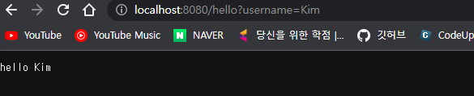

  - 쿼리파라미터를 통해 request 로 받은 콘솔 로
  - 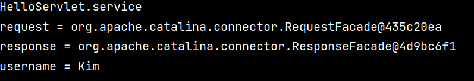

## HTTP 요청 메시지 로그로 확인하기

- application.properties 에 logging.level.org.apache.coyote.http11=debug 설정 추가
- 서버가 받은 HTTP 요청 메시지를 출력
- 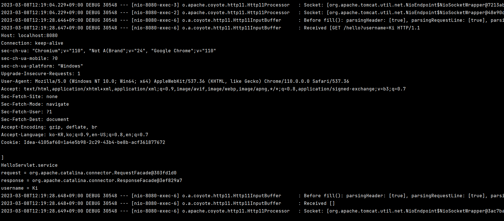

- 운영서버에 이렇게 모든 요청 정보를 다 남기면 성능저하가 발생할 수 있다. 개발 단계에서만 적용한다.

## 서블릿 컨테이너 동작 방식 설명

### 내장 톰캣 서버 생성

- 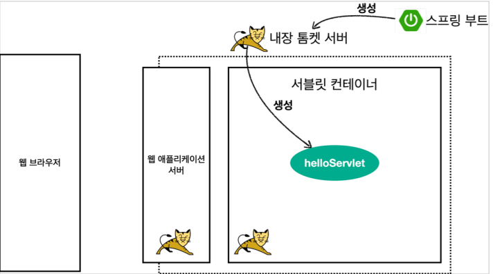

- 스프링부트가 실행되면 내장 톰켓서버가 자동 실행되고 서블릿 컨테이너을 생성한다.

###  애플리케이션 서버의 요청 응답 구조

- 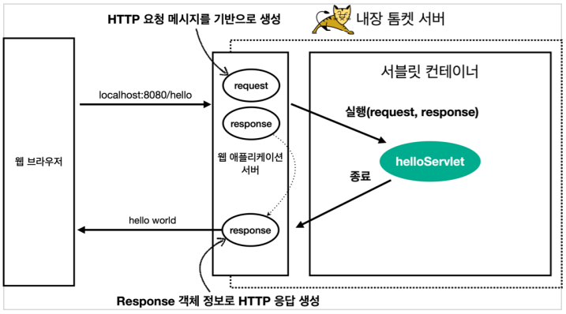

- HTTP 요청 메세지를 기반으로 WAS 에서 request 를 생성하여 helloServlet 실행한다.
-  서블릿에서 response 를 생성하면 WAS 에서 HTTP 응답 메시지를 생성하여 리턴한다.

## Welcome 페이지 추가

- main/webapp/index.html 을 생성하면 http://localhost:8080 호출시 index.html 페이지가 열린다.

- 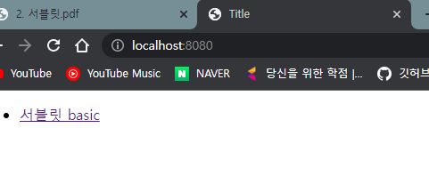

# 2. HttpServletRequest - 개요

## HttpServletRequest 역할

- HTTP 요청 메시지를 개발자가 직접 파싱해서 사용해도 되지만, 매우 불편할 것이다. 
- 서블릿은 개발자가 HTTP 요청 메시지를 편리하게 사용할 수 있도록 개발자 대신에 HTTP 요청 메시지를 파싱한다. 
- 그리고 그 결과를 HttpServletRequest 객체에 담아서 제공한다.

## HTTP 요청 메시지

```http
POST /save HTTP/1.1
Host: localhost:8080
Content-Type: application/x-www-form-urlencoded
username=kim&age=20
```

- START LINE (POST /save HTTP/1.1)
  - HTTP 메소드, URL, 쿼리 스트링, 스키마, 프로토콜 
- 헤더 : 헤더 조회 
  - Host: localhost:8080
    Content-Type: application/x-www-form-urlencoded
- 바디 : form 파라미터 형식 조회, message body 데이터 직접 조회
  - username=kim&age=20

## 임시 저장소 기능

- 해당 HTTP 요청이 시작부터 끝날 때 까지 유지되는 임시 저장소 기능 
- 저장: request.setAttribute(name, value) 
- 조회: request.getAttribute(name)

## 세션 관리 기능

- request.getSession(create: true)

# 3. HttpServletRequest - 기본 사용법

## hello.servlet.basic.request.RequestHeaderServlet 

- ```java
  @WebServlet(name = "requestHeaderServlet", urlPatterns = "/request-header")
  public class RequestHeaderServlet extends HttpServlet {
  
      @Override
      protected void service(HttpServletRequest request, HttpServletResponse response) throws ServletException, IOException {
  
          printStartLine(request);
          printHeaders(request);
          printHeaderUtils(request);
          printEtc(request);
          
          response.getWriter().write("ok");
  
      }
  ```

## start-line 정보

- ```java
  private static void printStartLine(HttpServletRequest request) {
          //start line 정보
          System.out.println("--- REQUEST-LINE - start ---");
          System.out.println("request.getMethod() = " + request.getMethod()); //GET
          System.out.println("request.getProtocol() = " + request.getProtocol()); //HTTP/1.1
          System.out.println("request.getScheme() = " + request.getScheme()); //http
          // http://localhost:8080/request-header
          System.out.println("request.getRequestURL() = " + request.getRequestURL());
          // /request-header
          System.out.println("request.getRequestURI() = " + request.getRequestURI());
          //username=hi
          System.out.println("request.getQueryString() = " +
                  request.getQueryString());
          System.out.println("request.isSecure() = " + request.isSecure()); //https사용 유무
          System.out.println("--- REQUEST-LINE - end ---");
          System.out.println();
      }
  ```

- 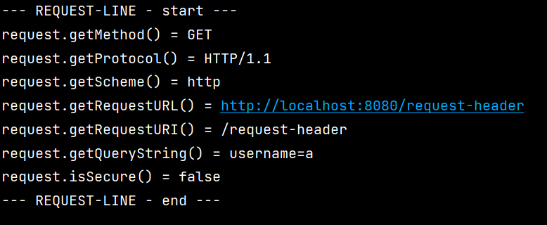

## 헤더 정보

- ```java
   private void printHeaders(HttpServletRequest request){
          System.out.println("--- REQUEST-LINE - start ---");
    
  //        Enumeration<String> headerNames = request.getHeaderNames();
  //        while(headerNames.hasMoreElements()){
  //            String headerName = headerNames.nextElement();
  //            System.out.println("headerName : " + headerName);
  //        }
  
          request.getHeaderNames().asIterator()
                          .forEachRemaining(headerName -> System.out.println("headerName = " + headerName));
  
          System.out.println("--- REQUEST-LINE - end ---");
          System.out.println();
      }
  ```

- 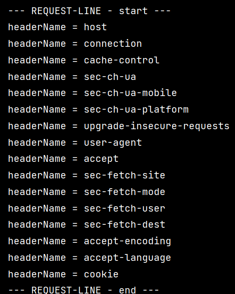

## Header 편리한 조회

- ```java
      private void printHeaderUtils(HttpServletRequest request) {
          System.out.println("--- Header 편의 조회 start ---");
          System.out.println("[Host 편의 조회]");
          System.out.println("request.getServerName() = " +
                  request.getServerName()); //Host 헤더
          System.out.println("request.getServerPort() = " +
                  request.getServerPort()); //Host 헤더
          System.out.println();
          System.out.println("[Accept-Language 편의 조회]");
          request.getLocales().asIterator()
                  .forEachRemaining(locale -> System.out.println("locale = " +
                          locale));
          System.out.println("request.getLocale() = " + request.getLocale());
          System.out.println();
          System.out.println("[cookie 편의 조회]");
          if (request.getCookies() != null) {
              for (Cookie cookie : request.getCookies()) {
                  System.out.println(cookie.getName() + ": " + cookie.getValue());
              }
          }
          System.out.println();
          System.out.println("[Content 편의 조회]");
          System.out.println("request.getContentType() = " +
                  request.getContentType());
          System.out.println("request.getContentLength() = " +
                  request.getContentLength());
          System.out.println("request.getCharacterEncoding() = " +
                  request.getCharacterEncoding());
          System.out.println("--- Header 편의 조회 end ---");
          System.out.println();
      }
  ```

  

- 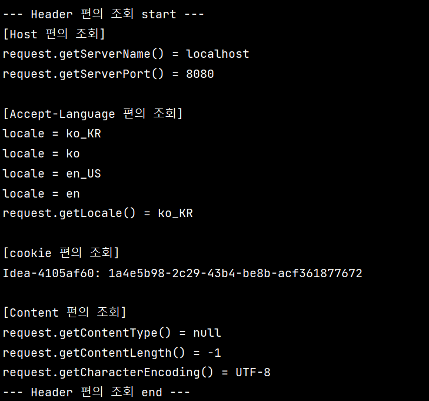

## 기타 정보 

- 기타 정보는 HTTP 메시지의 정보는 아니다.

- ```java
  private void printEtc(HttpServletRequest request) {
      System.out.println("--- 기타 조회 start ---");
      System.out.println("[Remote 정보]");
      System.out.println("request.getRemoteHost() = " +
              request.getRemoteHost()); //
      System.out.println("request.getRemoteAddr() = " +
              request.getRemoteAddr()); //
      System.out.println("request.getRemotePort() = " +
              request.getRemotePort()); //
      System.out.println();
      System.out.println("[Local 정보]");
      System.out.println("request.getLocalName() = " +
              request.getLocalName()); //
      System.out.println("request.getLocalAddr() = " +
              request.getLocalAddr()); //
      System.out.println("request.getLocalPort() = " +
              request.getLocalPort()); //
      System.out.println("--- 기타 조회 end ---");
      System.out.println();
  }
  ```

- 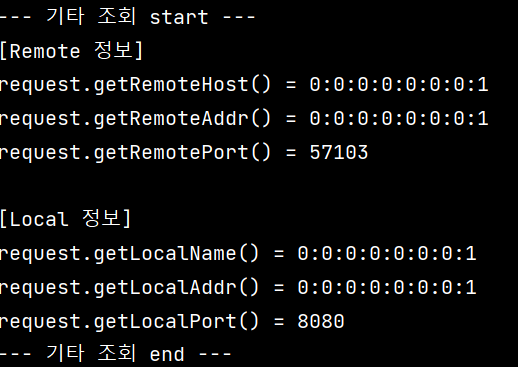

# 4. HTTP 요청 데이터 - 개요

- HTTP 요청 메시지를 통해 클라이언트에서 서버로 데이터를 전달하는 방법에는 3가지가 있다.

1. GET - 쿼리 파라미터 

   - /url?username=hello&age=20 

   - 메시지 바디 없이, URL의 쿼리 파라미터에 데이터를 포함해서 전달 

   - 예) 검색, 필터, 페이징등에서 많이 사용하는 방식

2. POST - HTML Form

   - content-type: application/x-www-form-urlencoded 
   - 메시지 바디에 쿼리 파리미터 형식으로 전달 username=hello&age=20 
   - 예) 회원 가입, 상품 주문, HTML Form 사용

3. HTTP message body에 데이터를 직접 담아서 요청

   - HTTP API에서 주로 사용, JSON, XML, TEXT 

4. 데이터 형식은 주로 JSON 사용 

   - POST, PUT, PATCH

# 4-1. HTTP 요청 데이터 - GET 쿼리 파라미터

- 전달할 데이터 
  - username=hello&age=20
- `http://localhost:8080/request-param?username=hello&age=20` 이렇게 전송

## 쿼리 파라미터 조회 메서드

- 서버에서 클라이언트로부터 받은 쿼리 파라미터 조회

### 전체 파라미터 조회

- ```java
  package hello.servlet.basic.request;
  
  import ..;
  
  /*
  * 1. 파라미터 전송 기능
  * http://localhost:8080/request-param?username=hello&age=20
  * */
  
  @WebServlet(name = "requestParamServlet", urlPatterns = "/request-param")
  public class RequestParamServlet extends HttpServlet {
  
      @Override
      protected void service(HttpServletRequest request, HttpServletResponse response) throws ServletException, IOException {
  
          System.out.println("[전체 파라미터 조회] - start");
          
          request.getParameterNames().asIterator()
                          .forEachRemaining(paramName ->
                                  System.out.println(paramName + " = " + request.getParameter(paramName)));
          
          System.out.println("[전체 파라미터 조회] - end");
          System.out.println();
  
          
          response.getWriter().write("ok");
      }
  }
  ```

- request.getParameterNames 는 Enumeration<String> 클래스 이다.
- asIterator().forEachRemaining 을 통해 paramName 을 꺼낸다.
- request.getParameter 를 통해 value 를 꺼낸다.
- 

### 단일 파라미터 조회

- ```java
  @WebServlet(name = "requestParamServlet", urlPatterns = "/request-param")
  public class RequestParamServlet extends HttpServlet {
      @Override
      protected void service(HttpServletRequest request, HttpServletResponse response) throws ServletException, IOException {
  
          System.out.println("[단일 파라미터 조회] - start");
  
          String username = request.getParameter("username");
          String age = request.getParameter("age");
  
          System.out.println("username = " + username);
          System.out.println("age = " + age);
  
          System.out.println("[단일 파라미터 조회] - end");
       	response.getWriter().write("ok");
  	}
  }
  
  ```

  - request.getParamter("key") 를 통해 해당 파라미터의 value 값 조회가 가능하다.
  - 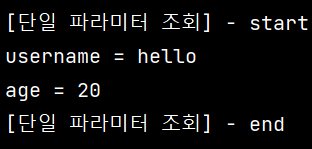

### 이름이 같은 복수 파라미터 조회

- `http://localhost:8080/request-param?username=hello&age=20&username=heool` 와 같이 username 이 2개 이상 있으면 첫번째 value 값(hello) 만 request.getParameter 를 통해 조회되고 heool 는 버려진다.

- 따라서 getParameterValues 를 통해서 조회해야 한다.

- ```java
  package hello.servlet.basic.request;
  
  import jakarta.servlet.ServletException;
  import jakarta.servlet.annotation.WebServlet;
  import jakarta.servlet.http.HttpServlet;
  import jakarta.servlet.http.HttpServletRequest;
  import jakarta.servlet.http.HttpServletResponse;
  
  import java.io.IOException;
  import java.util.Enumeration;
  
  /*
  * 1. 파라미터 전송 기능
  * http://localhost:8080/request-param?username=hello&age=20
  * */
  
  @WebServlet(name = "requestParamServlet", urlPatterns = "/request-param")
  public class RequestParamServlet extends HttpServlet {
      @Override
      protected void service(HttpServletRequest request, HttpServletResponse response) throws ServletException, IOException {
  
          System.out.println("[이름이 같은 복수 파라미터 조회] - start");
  
          String[] usernames = request.getParameterValues("username");
  
          for (String name : usernames) {
              System.out.println("username = " + name);
          }
          
          System.out.println("[이름이 같은 복수 파라미터 조회] - end");
  
          response.getWriter().write("ok");
      }
  }
  ```

  - getParameterValues 는 값이 2개 이상이기 때문에 String[] 클래스다.
  - iter 통해 값 출력이 가능하다.

# 4-2. HTTP 요청 데이터 - POST HTML Form

- HTML의 Form을 사용해서 클라이언트에서 서버로 데이터를 전송하는 방식이다.
- content-type: application/x-www-form-urlencoded 
- 메시지 바디에 쿼리 파리미터 형식으로 데이터를 전달한다. username=hello&age=20

## html 코드

- src/main/webapp/basic/hello-form.html 생성

- ```html
  <!DOCTYPE html>
  <html>
  <head>
      <meta charset="UTF-8">
      <title>Title</title>
  </head>
  <body>
      <form action="/request-param" method="post">
          username: <input type="text" name="username" />
          age: <input type="text" name="age" />
          <button type="submit">전송</button>
      </form>
  </body>
  </html>
  
  ```

  - `http://localhost:8080/basic/hello-form.html` 로 접속

  - 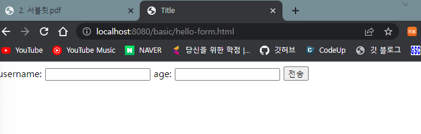

- kim / 20 입력 시 `http://localhost:8080/request-param` 로 이동

## 결과

- `http://localhost:8080/request-param` 에 쿼리파라미터로 kim / 20 을 준 것과 같은 결과이다.
- application/x-www-form-urlencoded 형식은 앞서 GET에서 살펴본 쿼리 파라미터 형식과 같다. 따라서 쿼리 파라미터 조회 메서드를 그대로 사용하면 된다.
- 클라이언트(웹 브라우저) 입장에서는 두 방식에 차이가 있지만, 서버 입장에서는 둘의 형식이 동일하므로, request.getParameter() 로 편리하게 구분없이 조회할 수 있다.
- GET URL 쿼리 파라미터 형식으로 클라이언트에서 서버로 데이터를 전달할 때는 HTTP 메시지 바디를 사용하지 않기 때문에 content-type이 없다.
- POST HTML Form 형식으로 데이터를 전달하면 HTTP 메시지 바디에 해당 데이터를 포함해서 보내기 때문에 바디에 포함된 데이터가 어떤 형식인지 content-type을 꼭 지정해야 한다. 이렇게 폼으로 데이터를 전송하는 형식을 application/x-www-form-urlencoded 라 한다.

# 4-3. HTTP 요청 데이터 - API 메시지 바디 - 단순 텍스트

- HTTP message body에 데이터를 직접 담아서 요청 
- HTTP API에서 주로 사용, JSON, XML, TEXT 
- 데이터 형식은 주로 JSON 사용 
- POST, PUT, PATCH 에서 사용

## 텍스트 메시지를 HTTP 메시지 바디에 담아서 전송

- HTTP 메시지 바디의 데이터를 InputStream을 사용해서 직접 읽을 수 있다.

- ```java
  package hello.servlet.basic.request;
  
  import ...;
  
  @WebServlet(name = "requestBodyStringServlet", urlPatterns = "/request-body-string")
  public class RequestBodyStringServlet extends HttpServlet {
      @Override
      protected void service(HttpServletRequest request, HttpServletResponse response) throws ServletException, IOException {
  
          ServletInputStream inputStream = request.getInputStream();
          String messageBody = StreamUtils.copyToString(inputStream, StandardCharsets.UTF_8);
  
          System.out.println("messageBody = " + messageBody);
  
          response.getWriter().write("OK");
  
      }
  }
  
  ```

- nputStream은 byte 코드를 반환한다.

- byte 코드를 우리가 읽을 수 있는 문자(String)로 보려면 문자표 (Charset)를 지정해주어야 한다. 여기서는 UTF_8 Charset을 지정해주었다.

- 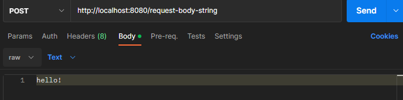

- raw 데이터로 보내면 `messageBody = hello!` 이 출력된다.

# 4-4. HTTP 요청 데이터 - API 메시지 바디 - JSON

- 이번에는 HTTP API에서 주로 사용하는 JSON 형식으로 데이터를 전달한다.

## JSON 형식 파싱 추가

- JSON 형식으로 파싱할 수 있게 객체를 하나 생성한다.
- `hello.servlet.basic.HelloData`

- ```java
  package hello.servlet.basic;
  
  import lombok.Data;
  import lombok.Getter;
  import lombok.Setter;
  
  @Getter @Setter
  public class HelloData {
      private String username;
      private int age;
  }
  ```

## RequestBodyJsonServlet 

- JSON 결과를 파싱해서 사용할 수 있는 자바 객체로 변환하려면 Jackson, Gson 같은 JSON 변환 라이브러리를 추가해서 사용해야 한다. 
- 스프링 부트로 Spring MVC를 선택하면 기본으로 Jackson 라이브러리( ObjectMapper )를 함께 제공한다

- ```java
  package hello.servlet.basic.request;
  
  import ...;
  
  @WebServlet(name = "requestBodyJsonServlet", urlPatterns = "/request-body-json")
  public class RequestBodyJsonServlet extends HttpServlet {
  
      private ObjectMapper objectMapper = new ObjectMapper();
  
      @Override
      protected void service(HttpServletRequest request, HttpServletResponse response) throws ServletException, IOException {
  
          ServletInputStream inputStream = request.getInputStream();
          String messageBody = StreamUtils.copyToString(inputStream, StandardCharsets.UTF_8);
  
          System.out.println("messageBody = " + messageBody);
  
          //objectMapper 로 messageBody 를 helloData 로 변환
          HelloData helloData = objectMapper.readValue(messageBody, HelloData.class);
  
          System.out.println("helloData.username = " + helloData.getUsername());
          System.out.println("helloData.age = " + helloData.getAge());
  
          response.getWriter().write("OK");
      }
  }
  
  ```

- POST 방식으로 raw data(JSON 형식)

  - {"username": "hello", "age" : 20}

- 결과

  - 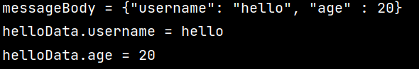

- HTML form 데이터도 메시지 바디를 통해 전송되므로 직접 읽을 수 있다. 하지만 편리한 파리미터 조회 기능( request.getParameter(...) )을 이미 제공하기 때문에 파라미터 조회 기능을 사용하면 된다.

# 5. HttpServletResponse - 기본 사용법

## HttpServletResponse 역할

- HTTP 응답 메시지 생성 
  - HTTP 응답코드 지정 
  - 헤더 생성 
  - 바디 생성 
- 편의 기능 제공 
  - Content-Type, 쿠키, Redirect

## HttpServletResponse - 기본 사용법

- hello.servlet.basic.response.ResponseHeaderServlet

- 주석 확인

- response.set~ 으로 거의 설정

- 편의기능(Content-Type, 쿠키, Redirect) 은 2개 방법이 적혀있다.

- ```java
  package hello.servlet.basic.response;
  
  import jakarta.servlet.ServletException;
  import jakarta.servlet.annotation.WebServlet;
  import jakarta.servlet.http.Cookie;
  import jakarta.servlet.http.HttpServlet;
  import jakarta.servlet.http.HttpServletRequest;
  import jakarta.servlet.http.HttpServletResponse;
  
  import java.io.IOException;
  
  @WebServlet(name = "responseHeaderServlet", urlPatterns = "/response-header")
  public class ResponseHeaderServlet extends HttpServlet {
  
      @Override
      protected void service(HttpServletRequest request, HttpServletResponse response) throws ServletException, IOException {
          //[status-line]
          response.setStatus(HttpServletResponse.SC_OK);
  
          //[response-headers]
          response.setHeader("Content-Type", "text/plain;charset=utf-8");
          response.setHeader("Cache-Control", "no-cache, no-store, must-revalidate");
          response.setHeader("Pragma", "no-cache");
          response.setHeader("my-header", "hello");
  
  
          //[Header 의 편의 메서드]
          content(response);
          cookie(response);
          rediect(response);
  
          response.getWriter().write("OK");
      }
  
  
      private void content(HttpServletResponse response) {
          //Content-Type: text/plain;charset=utf-8
          //Content-Length: 2
          
          //content-type 과 charset 을 설정하는 2가지 방법
          //response.setHeader("Content-Type", "text/plain;charset=utf-8");
          response.setContentType("text/plain");
          response.setCharacterEncoding("utf-8");
          //response.setContentLength(2); //(생략시 자동 생성)
      }
  
      private void cookie(HttpServletResponse response) {
          
          //쿠키설정 방법
          //Set-Cookie: myCookie=good; Max-Age=600;
          //response.setHeader("Set-Cookie", "myCookie=good; Max-Age=600");
          
          //위에처럼 하면 되지만 양식맞추기가 힘들기 때문에 Cookie 클래스 사용
          Cookie cookie = new Cookie("myCookie", "good");
          cookie.setMaxAge(600); //600초
          response.addCookie(cookie);
      }
  
      private void rediect(HttpServletResponse response) throws IOException {
          //Status Code 302
          //Location: /basic/hello-form.html
          
          //redirect 설정하는 2가지 방법
  //        response.setStatus(HttpServletResponse.SC_FOUND); //302
  //        response.setHeader("Location", "/basic/hello-form.html");
          //위에 2개 코드와 같은 의미임
          response.sendRedirect("/basic/hello-form.html");
      }
  }
  ```

- 결과는 해당 url 에서 개발자도구로 확인가능하다.

# 5-1. HTTP 응답 데이터 - 단순 텍스트, HTML

- HTTP 응답 메시지는 주로 다음 내용을 담아서 전달한다.
  - 단순 텍스트 응답 
    - 앞에서 살펴봄 ( writer.println("ok"); ) 
  - HTML 응답 
  - HTTP API - MessageBody JSON 응답

## HttpServletResponse - HTML 응답

- HTTP 응답으로 HTML을 반환할 때는 content-type을 text/html 로 지정해야 한다

- ```java
  package hello.servlet.basic.response;
  
  import jakarta.servlet.ServletException;
  import jakarta.servlet.annotation.WebServlet;
  import jakarta.servlet.http.HttpServlet;
  import jakarta.servlet.http.HttpServletRequest;
  import jakarta.servlet.http.HttpServletResponse;
  
  import java.io.IOException;
  import java.io.PrintWriter;
  
  @WebServlet(name = "responseHtmlServlet", urlPatterns = "/response-html")
  
  public class ResponseHtmlServlet extends HttpServlet {
  
      @Override
      protected void service(HttpServletRequest request, HttpServletResponse response) throws ServletException, IOException {
          //Content_Type: text/html;charset=utf-8 설정
          response.setContentType("text/html");
          response.setCharacterEncoding("utf-8");
  
          PrintWriter writer = response.getWriter();
          writer.println("<html>");
          writer.println("<body>");
          writer.println("    <div>hi!<div>");
          writer.println("<body>");
          writer.println("<html>");
      }
  }
  ```

- 실행 후 페이지 소스보기
  - 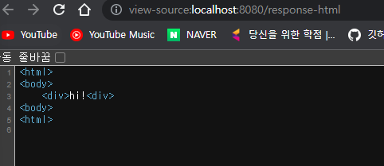

## 5-2. HTTP 응답 데이터 - API JSON

- hello.servlet.web.response. ResponseJsonServlet

- ```java
  package hello.servlet.basic.response;
  
  import com.fasterxml.jackson.databind.ObjectMapper;
  import hello.servlet.basic.HelloData;
  import jakarta.servlet.ServletException;
  import jakarta.servlet.annotation.WebServlet;
  import jakarta.servlet.http.HttpServlet;
  import jakarta.servlet.http.HttpServletRequest;
  import jakarta.servlet.http.HttpServletResponse;
  
  import java.io.IOException;
  
  @WebServlet(name = "responseJsonServlet", urlPatterns = "/response-json")
  public class ResponseJsonServlet extends HttpServlet {
  
      private ObjectMapper objectMapper = new ObjectMapper();
  
      @Override
      protected void service(HttpServletRequest request, HttpServletResponse response) throws ServletException, IOException {
          //Content-Type: applicatino/json
          response.setContentType("application/json");
          response.setCharacterEncoding("utf-8");
  
          HelloData helloData = new HelloData();
          helloData.setUsername("kim");
          helloData.setAge(20);
  
          //{"username":"kim","age":20}
          String result = objectMapper.writeValueAsString(helloData);
          response.getWriter().write(result);
      }
  }
  
  ```

  - Jackson 라이브러리가 제공하는 objectMapper.writeValueAsString() 를 사용하면 객체를 JSON 문자로 변경할 수 있다.