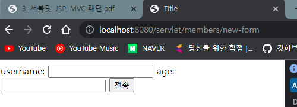
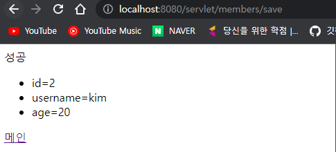
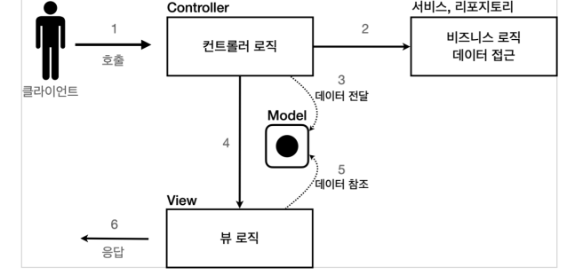

# 0. 회원 관리 웹 애플리케이션 요구사항

- 회원 정보 
  - 이름: username 
  - 나이: age 
- 기능 요구사항 
  - 회원 저장 
  - 회원 목록 조회

## 회원 도메인 모델

- ```java
  package hello.servlet.domain.member;
  
  import lombok.Getter;
  import lombok.NoArgsConstructor;
  import lombok.Setter;
  
  @Getter @Setter
  @NoArgsConstructor
  public class Member {
      private Long id;
      private String username;
      private int age;
  
      public Member(String username, int age) {
          this.username = username;
          this.age = age;
      }
  }
  ```

  - 생성자는 username 과 age 만 사용 / id 는 Member 를 회원 저장소에 저장하면 회원 저장소가 할당한다.

## 회원 저장소

- 회원 저장소는 싱글톤 패턴을 적용했다. 스프링을 사용하면 스프링 빈으로 등록하면 되지만, 지금은 최대한 스프링 없이 순수 서블릿 만으로 구현하는 것이 목적이다.

- 싱글톤 패턴은 객체를 단 하나만 생생해서 공유해야 하므로 생성자를 private 접근자로 막아둔다.

- ```java
  package hello.servlet.domain.member;
  
  import java.util.ArrayList;
  import java.util.HashMap;
  import java.util.List;
  import java.util.Map;
  
  public class MemberRepository {
  
      private Map<Long, Member> store = new HashMap<>();
      private static long sequence = 0L;
  
      private static final MemberRepository instance = new MemberRepository();
  
      public static MemberRepository getInstance() {
          return instance;
      }
  
      private MemberRepository(){}
  
      public Member save(Member member){
          member.setId(++sequence);
          store.put(member.getId(), member);
          return member;
      }
  
      public Member findById(Long id){
          return store.get(id);
      }
  
      public List<Member> findAll(){
          return new ArrayList<>(store.values());
      }
  
      public void clearStore() {
          store.clear();
      }
  }
  ```

## 회원 저장소 테스트 코드


- ```java
  package hello.servlet.domain.member;
  
  import org.assertj.core.api.Assertions;
  import org.junit.jupiter.api.AfterEach;
  import org.junit.jupiter.api.Test;
  
  import java.util.List;
  
  import static org.assertj.core.api.Assertions.*;
  
  public class MemberRepositoryTest {
  
      MemberRepository memberRepository = MemberRepository.getInstance();
  
      //테스트마다 저장소에 멤버가 저장되므로 초기화를 해줘야 한다.
      @AfterEach
      void afterEach() {
          memberRepository.clearStore();
      }
  
      //save 테스드
      @Test
      void save(){
          //given
          Member member = new Member("hello", 20);
  
          //when
          Member savedMember = memberRepository.save(member);
  
          //then
          Member findMember = memberRepository.findById(savedMember.getId());
          assertThat(findMember).isEqualTo(savedMember);
      }
  
      //findAll 테스트
      @Test
      void findAll(){
          //given
          Member member1 = new Member("member1", 20);
          Member member2 = new Member("member2", 20);
          memberRepository.save(member1);
          memberRepository.save(member2);
  
          //when
          List<Member> result = memberRepository.findAll();
  
          //then
          assertThat(result.size()).isEqualTo(2);
          assertThat(result).contains(member1, member2);
      }
  }
  ```

# 1. 서블릿으로 회원 관리 웹 애플리케이션 만들기

## MemberFormServlet - 회원 등록 폼

- MemberFormServlet 은 단순하게 회원 정보를 입력할 수 있는 HTML Form을 만들어서 응답한다.

- 

- ```java
  package hello.servlet.web.servlet;
  
  import hello.servlet.domain.member.MemberRepository;
  import jakarta.servlet.ServletException;
  import jakarta.servlet.annotation.WebServlet;
  import jakarta.servlet.http.HttpServlet;
  import jakarta.servlet.http.HttpServletRequest;
  import jakarta.servlet.http.HttpServletResponse;
  
  import java.io.IOException;
  import java.io.PrintWriter;
  
  @WebServlet(name = "memberFormServlet", urlPatterns = "/servlet/members/new-form")
  public class MemberFormService extends HttpServlet {
  
      private MemberRepository memberRepository = MemberRepository.getInstance();
  
      @Override
      protected void service(HttpServletRequest request, HttpServletResponse response) throws ServletException, IOException {
  
          response.setContentType("text/html");
          response.setCharacterEncoding("utf-8");
  
          PrintWriter w = response.getWriter();
          w.write("<!DOCTYPE html>\n" +
                  "<html>\n" +
                  "<head>\n" +
                  " <meta charset=\"UTF-8\">\n" +
                  " <title>Title</title>\n" +
                  "</head>\n" +
                  "<body>\n" +
                  "<form action=\"/servlet/members/save\" method=\"post\">\n" +
                  " username: <input type=\"text\" name=\"username\" />\n" +
                  " age: <input type=\"text\" name=\"age\" />\n" +
                  " <button type=\"submit\">전송</button>\n" +
                  "</form>\n" +
                  "</body>\n" +
                  "</html>\n");
      }
  }
  ```

- 

## MemberSaveServlet - 회원 저장

- request.getParameter 로 username 과 age 를 받아서 memberRepository 에 저장한다.

- ```java
  package hello.servlet.web.servlet;
  
  import hello.servlet.domain.member.Member;
  import hello.servlet.domain.member.MemberRepository;
  import jakarta.servlet.ServletException;
  import jakarta.servlet.annotation.WebServlet;
  import jakarta.servlet.http.HttpServlet;
  import jakarta.servlet.http.HttpServletRequest;
  import jakarta.servlet.http.HttpServletResponse;
  
  import java.io.IOException;
  import java.io.PrintWriter;
  
  @WebServlet(name = "memberSaveServlet",urlPatterns = "/servlet/members/save")
  public class MemberSaveServlet extends HttpServlet {
      private MemberRepository memberRepository = MemberRepository.getInstance();
  
      @Override
      protected void service(HttpServletRequest request, HttpServletResponse response) throws ServletException, IOException {
  
          System.out.println("MemberSaveServlet.service");
          String username = request.getParameter("username");
          int age = Integer.parseInt(request.getParameter("age"));
  
          Member member = new Member(username, age);
          memberRepository.save(member);
  
          response.setContentType("text/html");
          response.setCharacterEncoding("utf-8");
          PrintWriter w = response.getWriter();
          w.write("<html>\n" +
                  "<head>\n" +
                  " <meta charset=\"UTF-8\">\n" +
                  "</head>\n" +
                  "<body>\n" +
                  "성공\n" +
                  "<ul>\n" +
                  " <li>id="+member.getId()+"</li>\n" +
                  " <li>username="+member.getUsername()+"</li>\n" +
                  " <li>age="+member.getAge()+"</li>\n" +
                  "</ul>\n" +
                  "<a href=\"/index.html\">메인</a>\n" +
                  "</body>\n" +
                  "</html>");
      }
  }
  ```

- MemberSaveServlet 은 다음 순서로 동작한다. 
  1. 파라미터를 조회해서 Member 객체를 만든다. 
  2. Member 객체를 MemberRepository를 통해서 저장한다. 
  3. Member 객체를 사용해서 결과 화면용 HTML을 동적으로 만들어서 응답한다.

- 

## MemberListServlet - 회원 목록

- ```java
  package hello.servlet.web.servlet;
  
  import hello.servlet.domain.member.Member;
  import hello.servlet.domain.member.MemberRepository;
  import jakarta.servlet.ServletException;
  import jakarta.servlet.annotation.WebServlet;
  import jakarta.servlet.http.HttpServlet;
  import jakarta.servlet.http.HttpServletRequest;
  import jakarta.servlet.http.HttpServletResponse;
  
  import java.io.IOException;
  import java.io.PrintWriter;
  import java.util.List;
  
  @WebServlet(name = "memberListServlet", urlPatterns = "/servlet/members")
  public class MemberListServlet extends HttpServlet {
  
      private MemberRepository memberRepository = MemberRepository.getInstance();
  
      @Override
      protected void service(HttpServletRequest request, HttpServletResponse response) throws ServletException, IOException {
  
          List<Member> members = memberRepository.findAll();
  
          response.setContentType("text/html");
          response.setCharacterEncoding("utf-8");
  
          PrintWriter w = response.getWriter();
          w.write("<html>");
          w.write("<head>");
          w.write(" <meta charset=\"UTF-8\">");
          w.write(" <title>Title</title>");
          w.write("</head>");
          w.write("<body>");
          w.write("<a href=\"/index.html\">메인</a>");
          w.write("<table>");
          w.write(" <thead>");
          w.write(" <th>id</th>");
          w.write(" <th>username</th>");
          w.write(" <th>age</th>");
          w.write(" </thead>");
          for (Member member : members) {
              w.write(" <tr>");
              w.write(" <td>" + member.getId() + "</td>");
              w.write(" <td>" + member.getUsername() + "</td>");
              w.write(" <td>" + member.getAge() + "</td>");
              w.write(" </tr>");
          }
          w.write(" </tbody>");
          w.write("</table>");
          w.write("</body>");
          w.write("</html>");
      }
  }
  ```

- MemberListServlet 은 다음 순서로 동작한다.
  1. memberRepository.findAll() 을 통해 모든 회원을 조회한다. 
  2. 회원 목록 HTML을 for 루프를 통해서 회원 수 만큼 동적으로 생성하고 응답한다.

## 템플릿 엔진으로

- 자바 코드에 HTML 을 만드는 것은 비효율적이다.
- 차라리 HTML 문서에 동적으로 변경해야 하는 부분만 자바 코드를 넣을 수 있다면 더 편리할 것이다. 이것이 바로 템플릿 엔진이 나온 이유이다. 템플릿 엔진을 사용하면 HTML 문서에서 필요한 곳만 코드를 적용해서 동적으로 변경할 수 있다.

### Welcome 페이지 변경

- ```java
  <!DOCTYPE html>
  <html>
  <head>
      <meta charset="UTF-8">
      <title>Title</title>
  </head>
  <body>
  <ul>
      <li><a href="basic.html">서블릿 basic</a></li>
      <li>서블릿
          <ul>
              <li><a href="/servlet/members/new-form">회원가입</a></li>
              <li><a href="/servlet/members">회원목록</a></li>
          </ul>
      </li>
      <li>JSP
          <ul>
              <li><a href="/jsp/members/new-form.jsp">회원가입</a></li>
              <li><a href="/jsp/members.jsp">회원목록</a></li>
          </ul>
      </li>
      <li>서블릿 MVC
          <ul>
              <li><a href="/servlet-mvc/members/new-form">회원가입</a></li>
              <li><a href="/servlet-mvc/members">회원목록</a></li>
          </ul>
      </li>
      <li>FrontController - v1
          <ul>
              <li><a href="/front-controller/v1/members/new-form">회원가입</a></li>
              <li><a href="/front-controller/v1/members">회원목록</a></li>
          </ul>
      </li>
      <li>FrontController - v2
          <ul>
              <li><a href="/front-controller/v2/members/new-form">회원가입</a></li>
              <li><a href="/front-controller/v2/members">회원목록</a></li>
          </ul>
      </li>
      <li>FrontController - v3
          <ul>
              <li><a href="/front-controller/v3/members/new-form">회원가입</a></li>
              <li><a href="/front-controller/v3/members">회원목록</a></li>
          </ul>
      </li>
      <li>FrontController - v4
          <ul>
              <li><a href="/front-controller/v4/members/new-form">회원가입</a></li>
              <li><a href="/front-controller/v4/members">회원목록</a></li>
          </ul>
      </li>
      <li>FrontController - v5 - v3
          <ul>
              <li><a href="/front-controller/v5/v3/members/new-form">회원가입</a></li>
              <li><a href="/front-controller/v5/v3/members">회원목록</a></li>
          </ul>
      </li>
      <li>FrontController - v5 - v4
          <ul>
              <li><a href="/front-controller/v5/v4/members/new-form">회원가입</a></li>
              <li><a href="/front-controller/v5/v4/members">회원목록</a></li>
          </ul>
      </li>
      <li>SpringMVC - v1
          <ul>
              <li><a href="/springmvc/v1/members/new-form">회원가입</a></li>
              <li><a href="/springmvc/v1/members">회원목록</a></li>
          </ul>
      </li>
      <li>SpringMVC - v2
          <ul>
              <li><a href="/springmvc/v2/members/new-form">회원가입</a></li>
              <li><a href="/springmvc/v2/members">회원목록</a></li>
          </ul>
      </li>
      <li>SpringMVC - v3
          <ul>
              <li><a href="/springmvc/v3/members/new-form">회원가입</a></li>
              <li><a href="/springmvc/v3/members">회원목록</a></li>
          </ul>
      </li>
  </ul>
  </body>
  </html>
  ```

  

스프링부트 혹은 스프링 프레임워크의 기본 폴더 구조 규약때문에 그렇습니다 :)

프레임워크는 대체로 리소스를 보관하는 폴더와 형식을 규정해 놓습니다.

만약 사용자가 이를 바꿀수 있다면, 특정 설정파일만 수정하도록 합니다. 즉, 프레임워크가 커스터마이징을 지원하지 않는 항목은 규약을 따라야 합니다.

# 2. JSP로 회원 관리 웹 애플리케이션 만들기

https://codevang.tistory.com/240

## 환경설정

- JSP 라이브러리 추가

  - JSP를 사용하려면 먼저 다음 라이브러리를 추가해야 한다. (build.gradle)

  - ```groovy
    //JSP 추가 시작
    implementation 'org.apache.tomcat.embed:tomcat-embed-jasper'
    implementation 'jakarta.servlet:jakarta.servlet-api' //스프링부트 3.0 이상
    implementation 'jakarta.servlet.jsp.jstl:jakarta.servlet.jsp.jstl-api' //스프링부트 3.0 이상
    implementation 'org.glassfish.web:jakarta.servlet.jsp.jstl' //스프링부트 3.0 이상
    //JSP 추가 끝
    ```

- jsp 는 main/webapp/jsp 폴더에 넣어줘야 한다. (java 폴더 x)

  - 이유 : 스프링부트 혹은 스프링 프레임워크의 기본 폴더 구조 규약때문에 그렇습니다 :)

    프레임워크는 대체로 리소스를 보관하는 폴더와 형식을 규정해 놓습니다.

    만약 사용자가 이를 바꿀수 있다면, 특정 설정파일만 수정하도록 합니다. 즉, 프레임워크가 커스터마이징을 지원하지 않는 항목은 규약을 따라야 합니다. (라고 하네)

  - 스프링 프레임워크 폴더 구조 : https://codevang.tistory.com/240

  

## 회원등록 폼 JSP

- main/webapp/jsp/members/new-form.jsp

- ```jsp
  <%@ page contentType="text/html;charset=UTF-8" language="java" %>
  <html>
  <head>
      <title>Title</title>
  </head>
  <body>
      <form action="/jsp/members/save.jsp" method="post">
          username: <input type="text" name="username" />
          age: <input type="text" name="age" />
          <button type="submit">전송</button>
      </form>
  </body>
  </html>
  
  ```

  - `<%@ page contentType="text/html;charset=UTF-8" language="java" %>`
    - 첫 줄은 JSP문서라는 뜻이다. JSP 문서는 이렇게 시작해야 한다.
  - 회원 등록 폼 JSP를 보면 첫 줄을 제외하고는 완전히 HTML와 똑같다. JSP는 서버 내부에서 서블릿으로 변환되는데, 우리가 만들었던 MemberFormServlet과 거의 비슷한 모습으로 변환된다.
  - 실행
    - ` http://localhost:8080/jsp/members/new-form.jsp` -> 실행시 .jsp 까지 함께 적어주어야 한다

## 회원 저장 JSP

- main/webapp/jsp/members/save.jsp

- ```jsp
  <%@ page import="hello.servlet.domain.member.MemberRepository" %>
  <%@ page import="hello.servlet.domain.member.Member" %>
  <%@ page contentType="text/html;charset=UTF-8" language="java" %>
  <%
  // request, response 사용 가능
      MemberRepository memberRepository = MemberRepository.getInstance();
      System.out.println("MemberSaveServlet.service");
      String username = request.getParameter("username");
      int age = Integer.parseInt(request.getParameter("age"));
  
      Member member = new Member(username, age);
      memberRepository.save(member);
  %>
  <html>
  <head>
   <meta charset="UTF-8">
  </head>
  <body>
  성공
  <ul>
   <li>id=<%=member.getId()%></li>
   <li>username=<%=member.getUsername()%></li>
   <li>age=<%=member.getAge()%></li>
  </ul>
  <a href="/index.html">메인</a>
  </body>
  </html>
  ```

- 회원 저장 JSP를 보면, 회원 저장 서블릿 코드와 같다. 다른 점이 있다면, HTML을 중심으로 하고, 자바 코드를 부분부분 입력해주었다. <% ~ %> 를 사용해서 HTML 중간에 자바 코드를 출력하고 있다.
- import 문
  - <%@ page import="hello.servlet.domain.member.MemberRepository" %>
- <% ~~ %>
  - 이 부분에는 자바 코드를 입력할 수 있다.
-  <%= ~~ %> 
  - 이 부분에는 자바 코드를 출력할 수 있다.

## 회원 목록 JSP

- main/webapp/jsp/members.jsp

- ```jsp
  <%@ page import="hello.servlet.domain.member.MemberRepository" %>
  <%@ page import="hello.servlet.domain.member.Member" %>
  <%@ page import="java.util.List" %>
  <%@ page contentType="text/html;charset=UTF-8" language="java" %>
  <%
  // request, response 사용 가능
      MemberRepository memberRepository = MemberRepository.getInstance();
      List<Member> members = memberRepository.findAll();
  %>
  <html>
  <head>
   <meta charset="UTF-8">
   <title>Title</title>
  </head>
  <body>
  <a href="/index.html">메인</a>
  <table>
   <thead>
   <th>id</th>
   <th>username</th>
   <th>age</th>
   </thead>
   <tbody>
  <%
   for (Member member : members) {
   out.write(" <tr>");
   out.write(" <td>" + member.getId() + "</td>");
   out.write(" <td>" + member.getUsername() + "</td>");
   out.write(" <td>" + member.getAge() + "</td>");
   out.write(" </tr>");
   }
  %>
   </tbody>
  </table>
  </body>
  </html>
  ```

  - 회원 리포지토리를 먼저 조회하고, 결과 List를 사용해서 중간에  HTML 태그를 반복해서 출력하고 있다.

## 서블릿과 JSP의 한계

- 뷰 영역과 비즈니스 로직이 섞여 있어서 JSP가 너무 많은 역할을 하며 유지보수에 어렵다.

# 3. MVC 패턴 - 개요

- MVC 패턴은 지금까지 학습한 것 처럼 하나의 서블릿이나, JSP로 처리하던 것을 컨트롤러(Controller)와 뷰(View)라는 영역으로 서로 역할을 나눈 것을 말한다. 웹 애플리케이션은 보통 이 MVC 패턴을 사용한다.
- 컨트롤러: HTTP 요청을 받아서 파라미터를 검증하고, 비즈니스 로직을 실행한다. 그리고 뷰에 전달할 결과 데이터를 조회해서 모델에 담는다. 
- 모델: 뷰에 출력할 데이터를 담아둔다. 뷰가 필요한 데이터를 모두 모델에 담아서 전달해주는 덕분에 뷰는 비즈니스 로직이나 데이터 접근을 몰라도 되고, 화면을 렌더링 하는 일에 집중할 수 있다. 
- 뷰: 모델에 담겨있는 데이터를 사용해서 화면을 그리는 일에 집중한다. 여기서는 HTML을 생성하는 부분을 말한다.
- 

# 4. MVC 패턴 - 적용

- 컨트롤러 : 서블릿
- 뷰 : jsp
- 모델 : HttpServletRequest 객체를 사용
  - request는 내부에 데이터 저장소를 가지고 있는데, request.setAttribute() , request.getAttribute() 를 사용하면 데이터를 보관하고, 조회할 수 있다.

## 회원 등록

### 회원등록 폼 - 컨트롤러

- hello.servlet.web.servletmvc.MvcMemberFormServlet

- ```java
  package hello.servlet.web.servletmvc;
  
  import jakarta.servlet.RequestDispatcher;
  import jakarta.servlet.ServletException;
  import jakarta.servlet.annotation.WebServlet;
  import jakarta.servlet.http.HttpServlet;
  import jakarta.servlet.http.HttpServletRequest;
  import jakarta.servlet.http.HttpServletResponse;
  
  import java.io.IOException;
  
  @WebServlet(name = "mvcMemberFormServlet", urlPatterns = "/servlet-mvc/members/new-form")
  public class MvcMemberFormServlet extends HttpServlet {
  
      @Override
      protected void service(HttpServletRequest request, HttpServletResponse response) throws ServletException, IOException {
          
          //컨트롤러에서 뷰로 경로 이동할 때 필요하다
          String viewPath = "/WEB-INF/views/new-form.jsp";
          RequestDispatcher dispatcher = request.getRequestDispatcher(viewPath);
          dispatcher.forward(request, response);
      }
  }
  ```

- dispatcher.forward() : 다른 서블릿이나 JSP로 이동할 수 있는 기능이다. 서버 내부에서 다시 호출이 발생한다.
- /WEB-INF 폴더 > 이 경로안에 JSP가 있으면 외부에서 직접 JSP를 호출할 수 없다. 우리가 기대하는 것은 항상 컨트롤러를 통해서 JSP를 호출하는 것이다.

### redirect vs forward

- 리다이렉트는 실제 클라이언트(웹 브라우저)에 응답이 나갔다가, 클라이언트가 redirect 경로로 다시 요청한다. 따라서 클라이언트가 인지할 수 있고, URL 경로도 실제로 변경된다. 
- 반면에 포워드는 서버 내부에서 일어나는 호출이기 때문에 클라이언트가 전혀 인지하지 못한다.

### 회원 등록 폼 - 뷰

- main/webapp/WEB-INF/views/new-form.jsp

- 상대 경로 사용

- ```jsp
  <%@ page contentType="text/html;charset=UTF-8" language="java" %>
  <html>
  <head>
   <meta charset="UTF-8">
   <title>Title</title>
  </head>
  <body>
  <!-- 상대경로 사용, [현재 URL이 속한 계층 경로 + /save] -->
  <form action="save" method="post">
   username: <input type="text" name="username" />
   age: <input type="text" name="age" />
   <button type="submit">전송</button>
  </form>
  </body>
  </html>
  ```

## 회원 저장

### 회원 저장 - 컨트롤러

- MvcMemberSaveServle

- ```java
  package hello.servlet.web.servletmvc;
  
  import hello.servlet.domain.member.Member;
  import hello.servlet.domain.member.MemberRepository;
  import jakarta.servlet.RequestDispatcher;
  import jakarta.servlet.ServletException;
  import jakarta.servlet.annotation.WebServlet;
  import jakarta.servlet.http.HttpServlet;
  import jakarta.servlet.http.HttpServletRequest;
  import jakarta.servlet.http.HttpServletResponse;
  
  import java.io.IOException;
  
  @WebServlet(name = "mvcMemberSaveServlet", urlPatterns = "/servlet/members/save")
  public class MvcMemberSaveServlet extends HttpServlet {
  
      MemberRepository memberRepository = MemberRepository.getInstance();
  
      @Override
      protected void service(HttpServletRequest request, HttpServletResponse response) throws ServletException, IOException {
  
          String username = request.getParameter("username");
          int age = Integer.parseInt(request.getParameter("age"));
  
          Member member = new Member(username, age);
          memberRepository.save(member);
          
          //Model 에 데이터를 보관해야 한다.
          request.setAttribute("member", member);
  
          String viewPath = "/WEB-INF/views/save-result.jsp";
          RequestDispatcher dispatcher = request.getRequestDispatcher(viewPath);
          dispatcher.forward(request, response);
      }
  }
  
  ```

  - 클라이언트가 form 으로 제출한 parameter 를 받아서 member 를 만들고 모델로 보낸다.(setAttribute)
  - 그리고 request 와 response 를 jsp 로 보낸다

### 회원 저장 - 뷰

- main/webapp/WEB-INF/views/save-result.jsp

- ```jsp
  <%@ page contentType="text/html;charset=UTF-8" language="java" %>
  <html>
  <head>
   <meta charset="UTF-8">
  </head>
  <body>
  성공
  <ul>
   <li>id=${member.id}</li>
   <li>username=${member.username}</li>
   <li>age=${member.age}</li>
  </ul>
  <a href="/index.html">메인</a>
  </body>
  </html>
  ```

- JSP는 ${} 문법을 제공하는데, 이 문법을 사용하면 request의 attribute에 담긴 데이터를 편리하게 조회할 수 있다.

## 회원목록 조회

### 회원 목록 조회 - 컨트롤러

- MvcMemberListServlet

- ```java
  package hello.servlet.web.servletmvc;
  
  import ..;
  
  @WebServlet(name = "mvcMemberListServlet", urlPatterns = "/servlet-mvc/members")
  public class MvcMemberListServlet extends HttpServlet {
  
      MemberRepository memberRepository = MemberRepository.getInstance();
  
      @Override
      protected void service(HttpServletRequest request, HttpServletResponse response) throws ServletException, IOException {
  
          List<Member> members = memberRepository.findAll();
  
          //model 에 담는 방법
          request.setAttribute("members", members);
  
          //model 에서 view 로 보내기 request 가 모델역할
          String viewPath = "/WEB-INF/views/members.jsp";
          RequestDispatcher dispatcher = request.getRequestDispatcher(viewPath);
          dispatcher.forward(request, response);
  
      }
  }
  ```

  - setAttribute 를 통해 model 에 members 를 보낸다.

### 회원 목록 조회 - 뷰

- main/webapp/WEB-INF/views/members.jsp

- ```java
  <%@ page contentType="text/html;charset=UTF-8" language="java" %>
  <%@ taglib prefix="c" uri="http://java.sun.com/jsp/jstl/core"%>
  <html>
  <head>
      <meta charset="UTF-8">
      <title>Title</title>
  </head>
  <body>
      <a href="/index.html">메인</a>
      <table>
          <thead>
              <th>id</th>
              <th>username</th>
              <th>age</th>
          </thead>
          <tbody>
              <c:forEach var="item" items="${members}">
                  <tr>
                  <td>${item.id}</td>
                  <td>${item.username}</td>
                  <td>${item.age}</td>
                  </tr>
              </c:forEach>
          </tbody>
      </table>
  </body>
  </html>
  
  ```

  - for(Member member : members) -> <c:forEach var="item" items="${members}"> \</c:forEach> 로 사용가능
  -  이 기능을 사용하려면 다음과 같이 선언해야 한다.
    - <%@ taglib prefix="c" uri="http://java.sun.com/jsp/jstl/core"%>

# 5. MVC 패턴 - 한계

## MVC 컨트롤러의 단점

### 포워드 중복

- View로 이동하는 코드가 항상 중복 호출되어야 한다. 물론 이 부분을 메서드로 공통화해도 되지만, 해당 메서드도 항상 직접 호출해야 한다.

- ```java
  RequestDispatcher dispatcher = request.getRequestDispatcher(viewPath);
  dispatcher.forward(request, response);
  ```

### ViewPath에 중복

- `String viewPath = "/WEB-INF/views/new-form.jsp";`

### 사용하지 않는 코드

- HttpServletRequest request, HttpServletResponse response
- 이런 HttpServletRequest , HttpServletResponse 를 사용하는 코드는 테스트 케이스를 작성하기도 어렵다.

### 공통 처리가 어렵다

- 기능이 복잡해질 수 록 컨트롤러에서 공통으로 처리해야 하는 부분이 점점 더 많이 증가할 것이다. 
- 단순히 공통 기능을 메서드로 뽑으면 될 것 같지만, 결과적으로 해당 메서드를 항상 호출해야 하고, 실수로 호출하지 않으면 문제가 될 것이다. 
- 그리고 호출하는 것 자체도 중복이다.

## 결론

- 이 문제를 해결하려면 컨트롤러 호출 전에 먼저 공통 기능을 처리해야 한다. 
- 소위 수문장 역할을 하는 기능이 필요하다. 
- 프론트 컨트롤러(Front Controller) 패턴을 도입하면 이런 문제를 깔끔하게 해결할 수 있다. (입구를 하나로!) 
- 스프링 MVC의 핵심도 바로 이 프론트 컨트롤러에 있다.

