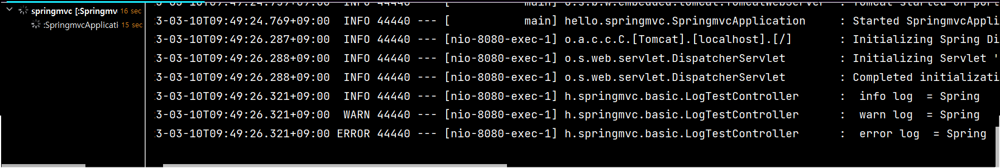

# 1. 로깅 간단히 알아보기

- 운영 시스템에서는 System.out.println() 같은 시스템 콘솔을 사용해서 필요한 정보를 출력하지 않고, 별도의 로깅 라이브러리를 사용해서 로그를 출력한다.
- SLF4J, Logback 과 같은 기본적인 로깅 라이브러리를 사용한다.
- 로그 라이브러리는 Logback, Log4J, Log4J2 등등 수 많은 라이브러리가 있는데, 그것을 통합해서 인터페이스로 제공하는 것이 바로 SLF4J 라이브러리다.
- SLF4J는 인터페이스이고, 그 구현체로 Logback 같은 로그 라이브러리를 선택하면 된다. 실무에서는 스프링 부트가 기본으로 제공하는 Logback을 대부분 사용한다.

## LogTestController

- ```java
  package hello.springmvc.basic;
  
  import lombok.extern.slf4j.Slf4j;
  import org.slf4j.Logger;
  import org.slf4j.LoggerFactory;
  import org.springframework.web.bind.annotation.RequestMapping;
  import org.springframework.web.bind.annotation.RestController;
  
  //return 문자를 그대로 반환함
  @RestController
  @Slf4j
  public class LogTestController {
  //    private final Logger log = LoggerFactory.getLogger(getClass());
  
      @RequestMapping("/log-test")
      public String logTest(){
          String name = "Spring";
  
          log.trace(" trace log = {}", name);
          log.debug(" debug log = {}", name);
          log.info(" info log  = {}", name);
          log.warn(" warn log  = {}", name);
          log.error(" error log  = {}", name);
  
  
          return "ok";
      }
  }
  ```

  - private final Logger log = LoggerFactory.getLogger(getClass()); 
    - 로그 라이브러리, log.info 를 통해 로그 출력이 가능하다
  - @Slf4j : 로그 인터페이스로 Logger 코드를 대체할 수 있다 (이거를 주로 쓴다.)
  - 
    - 이렇게 시간, 로그 레벨, 프로세스 ID, 사용하는 쓰레드, 클래스, 로그 메세지 등을 출력할 수 있다.

## 로그 레벨 설정

- application.properties

- ```properties
  #전체 로그 레벨 설정(기본 info)
  logging.level.root=info
  #hello.springmvc 패키지와 그 하위 로그 레벨 설정
  logging.level.hello.springmvc=debug
  ```

  - LEVEL: TRACE > DEBUG > INFO > WARN > ERROR 
  - 개발 서버는 debug 출력 / 운영 서버는 info 출력

## 올바른 로그 사용법

- log.debug("data="+data) 
  - 로그 출력 레벨을 info로 설정해도 해당 코드에 있는 "data="+data가 실제 실행이 되어 버린다. 결과적으로 문자 더하기 연산이 발생한다. 
- log.debug("data={}", data)  (이게 올바른 사용법이다.)
  - 로그 출력 레벨을 info로 설정하면 아무일도 발생하지 않는다. 따라서 앞과 같은 의미없는 연산이 발생하지 않는다.

## 로그 사용시 장점

- 쓰레드 정보, 클래스 이름 같은 부가 정보를 함께 볼 수 있고, 출력 모양을 조정할 수 있다. 
- 로그 레벨에 따라 개발 서버에서는 모든 로그를 출력하고, 운영서버에서는 출력하지 않는 등 로그를 상황에 맞게 조절할 수 있다. 
- 시스템 아웃 콘솔에만 출력하는 것이 아니라, 파일이나 네트워크 등, 로그를 별도의 위치에 남길 수 있다. 특히 파일로 남길 때는 일별, 특정 용량에 따라 로그를 분할하는 것도 가능하다. 
- 성능도 일반 System.out보다 좋다. (내부 버퍼링, 멀티 쓰레드 등등) 그래서 실무에서는 꼭 로그를 사용해야 한다.

# 2. 요청 매핑

## MappingController

- ```java
  ackage hello.springmvc.basic.requestMapping;
  
  import org.slf4j.Logger;
  import org.slf4j.LoggerFactory;
  import org.springframework.web.bind.annotation.*;
  
  @RestController
  public class MappingController {
  
      private Logger log = LoggerFactory.getLogger(getClass());
  
      //대부분의 속성을 배열[] 로 제공하므로 다중 설정이 가능하다. {"/hello-basic", "/hello-go"}
      @RequestMapping({"/hello-basic", "hello-go"})
      public String helloBasic() {
          log.info("helloBasic");
          return "ok";
      }
  }
  ```

  - 스프링 부트 3.0 부터는 `/hello-basic` , `/hello-basic/` 는 서로 다른 URL 요청을 사용해야 한다.
  - @RequestMapping 에 method 속성으로 HTTP 메서드를 지정하지 않으면 HTTP 메서드와 무관하게 호출된다.(모두 허용 GET, HEAD, POST, PUT, PATCH, DELETE)

## HTTP 메서드 매핑

- ```java
  @RequestMapping(value = "/mapping-get-v1", method = RequestMethod.GET)
  public String mappingGetV1() {
      log.info("mappingGetV1");
      return "ok";
  }
  ```

  - 메서드를 지정하거나, `GetMapping(value = "/mapping-get-v1"` 와 같이 사용할 수 있다.

## PathVariable(경로 변수) 사용

- ```java
  @GetMapping("/mapping/{userId}")
      public String mappingPath(@PathVariable("userId") String data) {
          log.info("mapping Path userId={}", data);
          return "ok";
      }
  
      /**
       * PathVariable 사용 다중
       */
      @GetMapping("/mapping/users/{userId}/orders/{orderId}")
      public String mappingPath(@PathVariable String userId, @PathVariable Long
              orderId) {
          log.info("mappingPath userId={}, orderId={}", userId, orderId);
          return "ok";
      }
  ```

  - 최근 HTTP API는 다음과 같이 리소스 경로에 식별자를 넣는 스타일을 선호한다. (/mapping/userA)
  - @PathVariable 의 이름과 파라미터 이름이 같으면 생략할 수 있다. `@PathVariable String data`
  - 여러 개 넣으면 다중으로 사용할 수 있다.

## 특정 헤더 조건 매핑

- ```java
  /**
       * 파라미터로 추가 매핑
       * params="mode",
       * params="!mode"
       * params="mode=debug"
       * params="mode!=debug" (! = )
       * params = {"mode=debug","data=good"}
       */
      @GetMapping(value = "/mapping-param", params = "mode=debug")
      public String mappingParam() {
          log.info("mappingParam");
          return "ok";
      }
  ```

  - 파라미터 매핑과 비슷하지만, HTTP 헤더를 사용한다.

## 미디어 타입 조건 매핑 - HTTP 요청 Content-Type, consume

- ```java
  /**
   * 특정 헤더로 추가 매핑
   * headers="mode",
   * headers="!mode"
   * headers="mode=debug"
   * headers="mode!=debug" (! = )
   */
  @GetMapping(value = "/mapping-header", headers = "mode=debug")
  public String mappingHeader() {
      log.info("mappingHeader");
      return "ok";
  }
  ```

- ```java
  /**
   * Content-Type 헤더 기반 추가 매핑 Media Type
   * consumes="application/json"
   * consumes="!application/json"
   * consumes="application/*"
   * consumes="*\/*"
   * MediaType.APPLICATION_JSON_VALUE
   */
  @PostMapping(value = "/mapping-consume", consumes = "application/json")
  public String mappingConsumes() {
      log.info("mappingConsumes");
      return "ok";
  }
  ```

  - HTTP 요청의 Content-Type 헤더를 기반으로 미디어 타입으로 매핑한다. 
  - 만약 맞지 않으면 HTTP 415 상태코드(Unsupported Media Type)을 반환한다.
  - `consumes = MediaType.APPLICATION_JSON_VALUE` 이렇게도 쓴다.

## 미디어 타입 조건 매핑 - HTTP 요청 Accept, produce

- ```java
  /**
   * Accept 헤더 기반 Media Type
   * produces = "text/html"
   * produces = "!text/html"
   * produces = "text/*"
   * produces = "*\/*"
   * produces = "text/plain"
   * produces = {"text/plain", "application/*"}
   * produces = MediaType.TEXT_PLAIN_VALUE
   * produces = "text/plain;charset=UTF-8"
   */
  @PostMapping(value = "/mapping-produce", produces = "text/html")
  public String mappingProduces() {
      log.info("mappingProduces");
      return "ok";
  }
  ```

- HTTP 요청의 Accept 헤더를 기반으로 미디어 타입으로 매핑한다. 
- 만약 맞지 않으면 HTTP 406 상태코드(Not Acceptable)을 반환한다.
- `produce = MediaType.TEXT_PLAIN_VALUE` 이렇게도 쓴다.

# 3. 요청 매핑 - API 예시

## 회원 관리 

- API 회원 목록 조회: GET /users 
- 회원 등록: POST /users 
- 회원 조회: GET /users/{userId} 
- 회원 수정: PATCH /users/{userId} 
- 회원 삭제: DELETE /users/{userId}

## MappingClassController (구현 핸들)

- ```java
  package hello.springmvc.basic.requestMapping;
  
  import org.springframework.web.bind.annotation.*;
  
  @RestController
  @RequestMapping("/mapping/users")
  public class MappingClassController {
  
      @GetMapping
      public String user() {
          return "get users";
      }
  
      @PostMapping
      public String addUser() {
          return "post user";
      }
  
      @GetMapping("/{userId}")
      public String findUser(@PathVariable String userId) {
          return "get userId = " + userId;
      }
  
      @PatchMapping("/{userId}")
      public String updateUser(@PathVariable String userId){
          return "update userId = " + userId;
      }
  
      @DeleteMapping("{userId}")
      public String deleteUser(@PathVariable String userId){
          return "delete userId = " + userId;
      }
  }
  ```

- `"/mapping/users"` : 클래스 레벨에 매핑 정보를 두면 메서드 레벨에서 해당 정보를 조합해서 사용한다.

# 4. HTTP 요청 - 기본, 헤더 조회

- HTTP 헤더 정보를 조회하는 방법

- ```java
  package hello.springmvc.basic.request;
  
  import jakarta.servlet.http.HttpServletRequest;
  import jakarta.servlet.http.HttpServletResponse;
  import lombok.extern.slf4j.Slf4j;
  import org.springframework.http.HttpMethod;
  import org.springframework.util.MultiValueMap;
  import org.springframework.web.bind.annotation.CookieValue;
  import org.springframework.web.bind.annotation.RequestHeader;
  import org.springframework.web.bind.annotation.RequestMapping;
  import org.springframework.web.bind.annotation.RestController;
  
  import java.util.Locale;
  
  @Slf4j
  @RestController
  public class RequestHeaderController {
  
      @RequestMapping("/headers")
      public String headers(HttpServletRequest request,
                            HttpServletResponse response,
                            HttpMethod httpMethod,
                            Locale locale,
                            @RequestHeader MultiValueMap<String, String> headerMap,
                            @RequestHeader("host") String host,
                            @CookieValue(value = "myCookie", required = false) String cookie
                            ){
          log.info("request={}", request);
          log.info("response={}", response);
          log.info("httpMethod={}", httpMethod);
          log.info("locale={}", locale);
          log.info("headerMap={}", headerMap);
          log.info("header host={}", host);
          log.info("myCookie={}", cookie);
          return "ok";
  
  
      }
  }
  ```

- HttpMethod : HTTP 메서드를 조회한다. org.springframework.http.HttpMethod `httpMethod=GET`
- Locale : Locale 정보를 조회한다. `locale=ko_KR`
- @RequestHeader MultiValueMap headerMap : 모든 HTTP 헤더를 MultiValueMap 형식으로 조회한다.
  - `headerMap={host=[localhost:8080], connection=[keep-alive], cache-control=[max-age=0], sec-ch-ua=["Chromium";v="110", "Not A(Brand";v="24", "Google Chrome";v="110"], sec-ch-ua-mobile=[?0], sec-ch-ua-platform=["Windows"], upgrade-insecure-requests=[1], user-agent=[Mozilla/5.0 (Windows NT 10.0; Win64; x64) AppleWebKit/537.36 (KHTML, like Gecko) Chrome/110.0.0.0 Safari/537.36], accept=[text/html,application/xhtml+xml,application/xml;q=0.9,image/avif,image/webp,image/apng,*/*;q=0.8,application/signed-exchange;v=b3;q=0.7], sec-fetch-site=[none], sec-fetch-mode=[navigate], sec-fetch-user=[?1], sec-fetch-dest=[document], accept-encoding=[gzip, deflate, br], accept-language=[ko-KR,ko;q=0.9,en-US;q=0.8,en;q=0.7], cookie=[Idea-4105af60=1a4e5b98-2c29-43b4-be8b-acf361877672; JSESSIONID=014059C988DAEB1D02CCDF921E228D1F]}`
- @RequestHeader("host") String host `header host=localhost:8080`
  - 특정 HTTP 헤더를 조회한다.
  - 속성 
    - 필수 값 여부: required 
    - 기본 값 속성: defaultValue
- @CookieValue(value = "myCookie", required = false) String cookie
  - 특정 쿠키를 조회한다. 
  - 속성 
    - 필수 값 여부: required 
    - 기본 값: defaultValue

## MultiValueMap

- MAP과 유사한데, 하나의 키에 여러 값을 받을 수 있다. 

- HTTP header, HTTP 쿼리 파라미터와 같이 하나의 키에 여러 값을 받을 때 사용한다. 

  - keyA=value1&keyA=value2

- ```java
  MultiValueMap<String, String> map = new LinkedMultiValueMap();
  map.add("keyA", "value1");
  map.add("keyA", "value2");
  //[value1,value2]
  List<String> values = map.get("keyA");
  ```

# 5. HTTP 요청 파라미터 - 쿼리 파라미터, HTML Form

## HTTP 요청 메시지를 통해 클라이언트에서 서버로 데이터를 전달하는 방법

- GET - 쿼리 파라미터 
  - /url?username=hello&age=20
- POST - HTML Form 
  - content-type: application/x-www-form-urlencoded 
  - 메시지 바디에 쿼리 파리미터 형식으로 전달 username=hello&age=2
- HTTP message body에 데이터를 직접 담아서 요청 
  - HTTP API에서 주로 사용, JSON, XML, TEXT 
  - 데이터 형식은 주로 JSON 사용 
  - POST, PUT, PATCH

- GET 쿼리 파리미터 전송 방식이든, POST HTML Form 전송 방식이든 둘다 형식이 같으므로 구분없이 조회할 수 있다. 이것을 간단히 요청 파라미터(request parameter) 조회라 한다

## RequestParamController

- ```java
  package hello.springmvc.basic.request;
  
  import jakarta.servlet.http.HttpServletRequest;
  import jakarta.servlet.http.HttpServletResponse;
  import lombok.extern.slf4j.Slf4j;
  import org.springframework.stereotype.Controller;
  import org.springframework.web.bind.annotation.RequestMapping;
  
  import java.io.IOException;
  
  @Slf4j
  @Controller
  public class RequestParamController {
      @RequestMapping("/request-param-v1")
      public void requestparamV1(HttpServletRequest request, HttpServletResponse response) throws IOException {
          String username = request.getParameter("username");
          int age = Integer.parseInt(request.getParameter("age"));
  
          log.info("username={}, age={}", username, age);
  
          response.getWriter().write("ok");
      }
  }
  ```

- 여기서는 단순히 `request.getParameter()` 을 통해 HttpServletRequest가 제공하는 방식으로 요청 파라미터를 조회했다.

## Post Form 페이지 생성

- 리소스는 /resources/static 아래에 두면 스프링 부트가 자동으로 인식한다.

- ```html
  <!DOCTYPE html>
  <html>
  <head>
    <meta charset="UTF-8">
    <title>Title</title>
  </head>
  <body>
  <form action="/request-param-v1" method="post">
    username: <input type="text" name="username" />
    age: <input type="text" name="age" />
    <button type="submit">전송</button>
  </form>
  </body>
  </html>
  ```

- 생성 후 보내면 RequestParamController 의 `request.getParameter` 로 파라미터를 받는다.

## HTTP 요청 파라미터 - @RequestParam

- 스프링이 제공하는 @RequestParam 을 사용하면 요청 파라미터를 매우 편리하게 사용할 수 있다.

## requestParamV2 ~ V4

- ```java
  @ResponseBody
  @RequestMapping("/request-param-v2")
  public String requestParamV2(
          @RequestParam("username") String memberName,
          @RequestParam("age") int memberAge){
  
      log.info("username={}, age={}", memberName, memberAge);
  
      return "ok";
  }
  
  @ResponseBody
  @RequestMapping("/request-param-v3")
  public String requestParamV3(
          @RequestParam String username,
          @RequestParam int age){
  
      log.info("username={}, age={}", username, age);
  
      return "ok";
  }
  @ResponseBody
  @RequestMapping("/request-param-v4")
  public String requestParamV4(String username, int age){
  
      log.info("username={}, age={}", username, age);
  
      return "ok";
  }
  ```

- V2 : @RequestParam 을 통해 파라미터 이름으로 바인딩할 수 있다.
- @ResponseBody : View 조회를 무시하고, HTTP message body에 직접 해당 내용 입력
- V3 : HTTP 파라미터 이름이 변수 이름과 같으면 @RequestParam(name="xx") 생략 가능하다.
  - @RequestParam Sting username ~
- V4 : String , int , Integer 등의 단순 타입이면 @RequestParam 도 생략 가능하다.
  - @RequestParam 애노테이션을 생략하면 스프링 MVC는 내부에서 required=false 를 적용한다. required 옵션은 바로 다음에 설명한다.

## 파라미터 필수 여부 - requestParamRequired

- ```java
  @ResponseBody
  @RequestMapping("/request-param-required")
  public String requestParamRequired(
          @RequestParam(required = true) String username,
          @RequestParam(required = false) Integer age){
  
      log.info("username={}, age={}", username, age);
  
      return "ok";
  }
  ```

- @RequestParam.required 
  - 파라미터 필수 여부 
  - 기본값이 파라미터 필수( true )이다. (@RequestParam 을 생략하면 기본값이 false 가 된다.)
- 파라미터 이름만 사용 시
  - /request-param?username=
  - 파라미터 이름만 있고 값이 없는 경우에는 빈문자로 통과한다. (null)
- 주의! - 기본형(primitive)에 null 입력
  - `@RequestParam(required = false) int age`는 required 가 false 이기 때문에 없어도 되지만 null 을 int 에 입력하는 것은 불가능하기 때문에 null 을 받을 수 있는 Integer 로 변경하거나, defaultValue 를 사용

## 기본 값 적용 - requestParamDefault

- ```java
  @ResponseBody
  @RequestMapping("/request-param-default")
  public String requestParamDefault(
          @RequestParam(required = true, defaultValue = "guest") String username,
          @RequestParam(required = false, defaultValue = "-1") int age){
  
      log.info("username={}, age={}", username, age);
  
      return "ok";
  }
  ```

- 파라미터에 값이 없는 경우 defaultValue 를 사용하면 기본 값을 적용할 수 있다. 이미 기본 값이 있기 때문에 required 는 의미가 없다.
- defaultValue 는 빈 문자의 경우에도 설정한 기본 값이 적용된다.

## 파라미터를 Map으로 조회하기 - requestParamMap

- ```java
  @ResponseBody
  @RequestMapping("/request-param-map")
  public String requestParamMap(@RequestParam Map<String, Object> paramMap){
  
      log.info("username={}, age={}", paramMap.get("username"), paramMap.get("age"));
  
      return "ok";
  }
  ```

- 파라미터를 Map, MultiValueMap으로 조회할 수 있다.

- 파라미터의 값이 1개가 확실하다면 Map 을 사용해도 되지만, 그렇지 않다면 MultiValueMap 을 사용하자. (하지만 파라미터 value 값이 2개인 경우는 거의 없다.)

  - `@RequestParam MultiValueMap `
  - `MultiValueMap(key=[value1, value2, ...] ex) (key=userIds, value=[id1, id2])`

# 6. HTTP 요청 파라미터 - @ModelAttribute

- 스프링은 요청 파라미터르 받아서 객체를 만들고 값을 넣어주는 과정을 자동화해주는 `@ModelAttibute` 기능을 제공한다.

## HelloData(요청 파라미터를 바인딩 받을 객체)

- ```java
  package hello.springmvc.basic;
  
  import lombok.Data;
  
  @Data
  public class HelloData {
      private String username;
      private int age;
  }
  ```

- 롬복 @Data (@Getter , @Setter , @ToString , @EqualsAndHashCode , @RequiredArgsConstructor 자동 지정)

## @ModelAttribute 적용 - modelAttributeV1

- ```java
  @ResponseBody
      @RequestMapping("/model-attribute-v1")
      public String modelAttributeV1(@ModelAttribute HelloData helloData){
  
          log.info("username={}, age={}", helloData.getUsername(), helloData.getAge());
  
          return "ok";
      }
  ```

- 스프링MVC는 @ModelAttribute 가 있으면 다음을 실행한다.

  - HelloData 객체를 생성한다.
  - 요청 파라미터의 이름으로 HelloData 객체의 프로퍼티를 찾는다. 그리고 해당 프로퍼티의 setter를 호출해서 파라미터의 값을 입력(바인딩) 한다.
    - 예) 파라미터 이름이 username 이면 setUsername() 메서드를 찾아서 호출하면서 값을 입력한다.

- 바인딩 오류
  - age=abc 처럼 숫자가 들어가야 할 곳에 문자를 넣으면 BindException 이 발생한다

## @ModelAttribute 생략 - modelAttributeV2

- ```java
  @ResponseBody
  @RequestMapping("/model-attribute-v2")
  public String modelAttributeV2(HelloData helloData){
  
      log.info("username={}, age={}", helloData.getUsername(), helloData.getAge());
  
      return "ok";
  }
  ```

- @ModelAttribute 는 생략할 수 있다. 그런데 @RequestParam 도 생략할 수 있으니 혼란이 발생할 수 있다.
- 스프링은 해당 생략시 다음과 같은 규칙을 적용한다. 
  - String , int , Integer 같은 단순 타입 = @RequestParam 
  - 나머지 = @ModelAttribute (argument resolver 로 지정해둔 타입 외(HttpServletRequest 와 같은))

# 7. HTTP 요청 메시지 - 단순 텍스트

## HTTP message body에 데이터를 직접 담아서 요청

- HTTP API에서 주로 사용, 
- JSON, XML, TEXT 데이터 형식은 주로 JSON 사용 
- POST, PUT, PATCH
- 요청 파라미터와 다르게, HTTP 메시지 바디를 통해 데이터가 직접 넘어오는 경우는 @RequestParam , @ModelAttribute 를 사용할 수 없다. (물론 HTML Form 형식으로 전달되는 경우는 요청 파라미터로 인정된다.)

## RequestBodyStringController

- HTTP 메시지 바디의 데이터를 InputStream 을 사용해서 직접 읽을 수 있다.

- ```java
  @Slf4j
  @Controller
  public class RequestBodyStringController {
  
      @PostMapping("/request-body-string-v1")
      public void requestBodyString(HttpServletRequest request, HttpServletResponse response) throws IOException {
          ServletInputStream inputStream = request.getInputStream();
          String messageBody = StreamUtils.copyToString(inputStream, StandardCharsets.UTF_8);
  
          log.info("messagebody={}", messageBody);
  
          response.getWriter().write("ok");
  
      }
  }
  ```

  - request 를 통해 `getInputStream()` 메서드로 메세지 바디를 밥아서 출력한다.

## Input, Output 스트림, Reader - requestBodyStringV2

- ```java
  @PostMapping("/request-body-string-v2")
  public void requestBodyStringV2(InputStream inputStream, Writer responseWriter) throws IOException {
  
      String messageBody = StreamUtils.copyToString(inputStream, StandardCharsets.UTF_8);
  
      log.info("messagebody={}", messageBody);
  
      responseWriter.write("ok");
  
  }
  ```

- 스프링 MVC는 다음 파라미터를 지원한다. 

  - InputStream(Reader): HTTP 요청 메시지 바디의 내용을 직접 조회 
  - OutputStream(Writer): HTTP 응답 메시지의 바디에 직접 결과 출력

## HttpEntity - requestBodyStringV3

- HttpEntity: HTTP header, body 정보를 편리하게 조회

- 응답에서도 HttpEntity 사용 가능

- ```java
  @PostMapping("/request-body-string-v3")
  public HttpEntity<String> requestBodyStringV3(HttpEntity<String> httpEntity) {
      String messageBody = httpEntity.getBody();
      log.info("messageBody={}", messageBody);
      return new HttpEntity<>("ok");
  }
  ```

  - HttpEntity 를 상속받은 다음 객체들도 같은 기능을 제공한다. 
    - RequestEntity 
      - HttpMethod, url 정보가 추가, 요청에서 사용 
    - ResponseEntity 
      - HTTP 상태 코드 설정 가능, 응답에서 사용
      - ` return new ResponseEntity("Hello World", responseHeaders, HttpStatus.CREATED)`

## @RequestBody - requestBodyStringV4

- ```java
  /**
   * @RequestBody
   * - 메시지 바디 정보를 직접 조회(@RequestParam X, @ModelAttribute X)
   * - HttpMessageConverter 사용 -> StringHttpMessageConverter 적용
   *
   * @ResponseBody
   * - 메시지 바디 정보 직접 반환(view 조회X)
   * - HttpMessageConverter 사용 -> StringHttpMessageConverter 적용
   */
  
  @PostMapping("/request-body-string-v3")
  public HttpEntity<String> requestBodyStringV3(RequestEntity<String> httpEntity) throws IOException {
  
      String messageBody = httpEntity.getBody();
  
      log.info("messagebody={}", messageBody);
  
      return new ResponseEntity<>("ok",HttpStatus.CREATED);
  
  }
  ```

- @RequestBody 를 사용하면 HTTP 메시지 바디 정보를 편리하게 조회할 수 있다. 참고로 헤더 정보가 필요하다면 HttpEntity 를 사용하거나 @RequestHeader 를 사용하면 된다.
- @ResponseBody 를 사용하면 응답 결과를 HTTP 메시지 바디에 직접 담아서 전달할 수 있다. 물론 이 경우에도 view를 사용하지 않는다.

# 8. HTTP 요청 메시지 - JSON

- HTTP API에서 주로 사용하는 JSON 데이터 형식을 조회

## RequestBodyJsonController

### HttpServletRequest, objectMapper 사용

- ```java
  @Slf4j
  @Controller
  public class RequestBodyJsonController {
  
      private ObjectMapper objectMapper = new ObjectMapper();
  
      @PostMapping("/request-body-json-v1")
      public void requestBodyJsonV1(HttpServletRequest request, HttpServletResponse response) throws IOException {
          ServletInputStream inputStream = request.getInputStream();
          String messageBody = StreamUtils.copyToString(inputStream, StandardCharsets.UTF_8);
  
          log.info("messageBody = {}", messageBody);
          HelloData helloData = objectMapper.readValue(messageBody, HelloData.class);
          log.info("username = {}, age = {}", helloData.getUsername(), helloData.getAge());
  
          response.getWriter().write("ok");
      }
  }
  ```

  - HttpServletRequest를 사용해서 직접 HTTP 메시지 바디에서 데이터를 읽어와서, 문자로 변환한다.
  - 문자로 된 JSON 데이터를 Jackson 라이브러리인 objectMapper 를 사용해서 자바 객체로 변환한다.

### requestBodyJsonV2 - @RequestBody 문자 변환

- ```java
  /**
   * @RequestBody
   * HttpMessageConverter 사용 -> StringHttpMessageConverter 적용
   *
   * @ResponseBody
   * - 모든 메서드에 @ResponseBody 적용
   * - 메시지 바디 정보 직접 반환(view 조회X)
   * - HttpMessageConverter 사용 -> StringHttpMessageConverter 적용
   */
  
  @ResponseBody
      @PostMapping("/request-body-json-v2")
      public String requestBodyJsonV2(@RequestBody String messageBody) throws IOException {
  
          log.info("messageBody = {}", messageBody);
          HelloData helloData = objectMapper.readValue(messageBody, HelloData.class);
          log.info("username = {}, age = {}", helloData.getUsername(), helloData.getAge());
  
          return "ok";
      }
  ```

  - 이전에 학습했던 @RequestBody 를 사용해서 HTTP 메시지에서 데이터를 꺼내고 messageBody에 저장한다. 
  - 문자로 된 JSON 데이터인 messageBody 를 objectMapper 를 통해서 자바 객체로 변환한다.

## requestBodyJsonV3 - @RequestBody 객체 변환

- ```java
  /**
   * @RequestBody 생략 불가능(@ModelAttribute 가 적용되어 버림)
   * HttpMessageConverter 사용 -> MappingJackson2HttpMessageConverter (contenttype: application/json)
   *
   */
   
  @ResponseBody
  @PostMapping("/request-body-json-v3")
  public String requestBodyJsonV3(@RequestBody HelloData helloData){
  
      log.info("username = {}, age = {}", helloData.getUsername(), helloData.getAge());
  
      return "ok";
  }
  ```

- @RequestBody 에 직접 만든 객체를 지정할 수 있다.
- HttpEntity , @RequestBody 를 사용하면 HTTP 메시지 컨버터가 HTTP 메시지 바디의 내용을 우리가 원하는 문자나 객체 등으로 변환해준다.
- HTTP 메시지 컨버터는 문자 뿐만 아니라 JSON도 객체로 변환해주는데, 우리가 방금 V2에서 했던 작업을 대신 처리해준다.
- **@RequestBody는 생략 불가능하다**
  - HelloData에 @RequestBody 를 생략하면 @ModelAttribute 가 적용되어버린다.

## requestBodyJsonV4 - HttpEntity

- ```java
  @ResponseBody
  @PostMapping("/request-body-json-v4")
  public String requestBodyJsonV4(HttpEntity<HelloData> data){
      //꺼내서 출력을 해야함
      HelloData helloData = data.getBody();
      log.info("username = {}, age = {}", helloData.getUsername(), helloData.getAge());
  
      return "ok";
  }
  ```

- 이 경우는 data 에서 HelloData 로 꺼내야 한다.

## requestBodyJsonV5

- ```java
  /**
   * @RequestBody 생략 불가능(@ModelAttribute 가 적용되어 버림)
   * HttpMessageConverter 사용 -> MappingJackson2HttpMessageConverter (contenttype: application/json)
   *
   * @ResponseBody 적용
   * - 메시지 바디 정보 직접 반환(view 조회X)
   * - HttpMessageConverter 사용 -> MappingJackson2HttpMessageConverter 적용
  (Accept: application/json)
   */
   
  @ResponseBody
  @PostMapping("/request-body-json-v5")
  public HelloData requestBodyJsonV5(@RequestBody HelloData helloData){
      //꺼내서 출력을 해야함
      log.info("username = {}, age = {}", helloData.getUsername(), helloData.getAge());
  
      //나갈 때도 적용이 된다.
      return helloData;
  }
  ```

  - @ResponseBody
    - 응답의 경우에도 @ResponseBody 를 사용하면 해당 객체를 HTTP 메시지 바디에 직접 넣어줄 수 있다. 물론 이 경우에도 HttpEntity 를 사용해도 된다.
    - @RequestBody 요청 
      - JSON 요청 -> HTTP 메시지 -> 컨버터 객체 
    - @ResponseBody 응답 
      - 객체->  HTTP 메시지 컨버터 -> JSON 응답

# 9 . HTTP 응답 - 정적 리소스, 뷰 템플릿

- 스프링(서버)에서 응답 데이터를 만드는 방법은 크게 3가지이다.
  - 정적 리소스 
    - 예) 웹 브라우저에 정적인 HTML, css, js를 제공할 때는, 정적 리소스를 사용한다. 
  - 뷰 템플릿 사용 
    - 예) 웹 브라우저에 동적인 HTML을 제공할 때는 뷰 템플릿을 사용한다. 
  - HTTP 메시지 사용 
    - HTTP API를 제공하는 경우에는 HTML이 아니라 데이터를 전달해야 하므로, HTTP 메시지 바디에 JSON 같은 형식으로 데이터를 실어 보낸다.

## 정적 리소스

- 스프링 부트는 클래스패스의 다음 디렉토리에 있는 정적 리소스를 제공한다. 
  - /static , /public , /resources , /META-INF/resources
- 다음 경로에 파일이 들어있으면 웹 브라우저에서 다음과 같이 실행하면 된다.
  - `src/main/resources/static/basic/hello-form.html`
  - `http://localhost:8080/basic/hello-form.html`
- 정적 리소스는 해당 파일을 변경 없이 그대로 서비스하는 것이다.

## 뷰 템플릿

- 뷰 템플릿을 거쳐서 HTML이 생성되고, 뷰가 응답을 만들어서 전달한다. 
- 일반적으로 HTML을 동적으로 생성하는 용도로 사용하지만, 다른 것들도 가능하다. 뷰 템플릿이 만들 수 있는 것이라면 뭐든지 가능하다.

### 뷰 템플릿 경로

- `src/main/resources/templates`

### 뷰 템플릿 생성

- `src/main/resources/templates/response/hello.html`

- ```html
  <!DOCTYPE html>
  <html xmlns:th="http://www.thymeleaf.org">
  <head>
      <meta charset="UTF-8">
      <title>Title</title>
  </head>
  <body>
  	<p th:text="${data}">empty</p>
  </body>
  </html>
  ```

## ResponseViewController - 뷰 템플릿을 호출하는 컨트롤러

- ```java
  package hello.springmvc.basic.response;
  
  import org.springframework.stereotype.Controller;
  import org.springframework.ui.Model;
  import org.springframework.web.bind.annotation.RequestMapping;
  import org.springframework.web.servlet.ModelAndView;
  
  @Controller
  public class ResponseViewController {
  	//1
      @RequestMapping("/response-view-v1")
      public ModelAndView responseViewv1(){
          ModelAndView mav = new ModelAndView("response/hello")
                  .addObject("data", "hello");
  
          return mav;
      }
  	//2
      @RequestMapping("/response-view-v2")
      public String responseViewv2(Model model){
          model.addAttribute("data", "hello!");
          return "response/hello";
      }
  	//3
      @RequestMapping("/response/hello")
      public void responseViewv3(Model model){
          model.addAttribute("data", "hello!");
  
      }
  }
  
  ```

  1. ModelAndView 를 통해 html 로 data 를 보낸다.
  2. model 에 `addAttribute` 메서드를 통해 데이터를 저장한다. 
     - @ResponseBody 가 없으면 response/hello 로 뷰 리졸버가 실행되어서 뷰를 찾고, 렌더링 한다.
  3. void 를 바환하는 경우, `@RequestMapping("/response/hello")` 에서 URL 을 참고해서 실행한다.
     -  방식은 명시성이 너무 떨어지고 이렇게 딱 맞는 경우도 많이 없어서, 권장하지 않는다.

## HTTP 메시지

- @ResponseBody , HttpEntity 를 사용하면, 뷰 템플릿을 사용하는 것이 아니라, HTTP 메시지 바디에 직접 응답 데이터를 출력할 수 있다.

# 10. HTTP 응답 - HTTP API, 메시지 바디에 직접 입력

- HTTP API를 제공하는 경우에는 HTML이 아니라 데이터를 전달해야 하므로, HTTP 메시지 바디에 JSON 같은 형식으로 데이터를 실어 보낸다.

## ResponseBodyController

- ```java
  package hello.springmvc.basic.response;
  
  import hello.springmvc.basic.HelloData;
  import jakarta.servlet.http.HttpServletResponse;
  import lombok.extern.slf4j.Slf4j;
  import org.springframework.http.HttpStatus;
  import org.springframework.http.ResponseEntity;
  import org.springframework.stereotype.Controller;
  import org.springframework.web.bind.annotation.GetMapping;
  import org.springframework.web.bind.annotation.ResponseBody;
  import org.springframework.web.bind.annotation.ResponseStatus;
  import org.springframework.web.bind.annotation.RestController;
  
  import java.io.IOException;
  
  @Slf4j
  //@ResponseBody
  //@Controller
  @RestController
  public class ResponseBodyController {
  
      @GetMapping("/response-body-string-v1")
      public void responseBodyV1(HttpServletResponse response) throws IOException {
          response.getWriter().write("ok");
      }
  
      @GetMapping("/response-body-string-v2")
      public ResponseEntity<String> responseBodyV2() {
          return new ResponseEntity<>("ok", HttpStatus.OK);
      }
  
      @GetMapping("/response-body-String-v3")
      public String responseBodyV3() {
          return "ok";
      }
  
      @GetMapping("/response-body-json-v1")
      public ResponseEntity<HelloData> responseBodyJsonV1(){
          HelloData helloData = new HelloData();
          helloData.setUsername("userA");
          helloData.setAge(20);
  
          return new ResponseEntity<>(helloData, HttpStatus.OK);
      }
  
      @ResponseStatus(HttpStatus.OK)
      @GetMapping("/response-body-json-v2")
      public HelloData responseBodyJsonV2(){
          HelloData helloData = new HelloData();
          helloData.setUsername("userA");
          helloData.setAge(20);
  
          return helloData;
      }
  }
  ```

### responseBodyV1

- 서블릿을 직접 다룰 때 처럼 HttpServletResponse 객체를 통해서 HTTP 메시지 바디에 직접 ok 응답 메시지를 전달한다. 
- response.getWriter().write("ok")

### responseBodyV2

- ResponseEntity 엔티티는 HttpEntity 를 상속 받았는데, HttpEntity는 HTTP 메시지의 헤더, 바디 정보를 가지고 있다. 
- ResponseEntity 는 여기에 더해서 HTTP 응답 코드를 설정할 수 있다.

### responseBodyV3

- @ResponseBody 를 사용하면 view를 사용하지 않고, HTTP 메시지 컨버터를 통해서 HTTP 메시지를 직접 입력할 수 있다. 
- ResponseEntity 도 동일한 방식으로 동작한다.

### responseBodyJsonV1

- ResponseEntity 를 반환한다. HTTP 메시지 컨버터를 통해서 JSON 형식으로 변환되어서 반환된다.

### responseBodyJsonV2

- ResponseEntity 는 HTTP 응답 코드를 설정할 수 있는데, @ResponseBody 를 사용하면 이런 것을 설정하기 까다롭다. 
- @ResponseStatus(HttpStatus.OK) 애노테이션을 사용하면 응답 코드도 설정할 수 있다. 
- 물론 애노테이션이기 때문에 응답 코드를 동적으로 변경할 수는 없다. 프로그램 조건에 따라서 동적으로 변경하려면 ResponseEntity 를 사용하면 된다

### @RestController

- @Controller 대신에 @RestController 애노테이션을 사용하면, 해당 컨트롤러에 모두 @ResponseBody 가 적용되는 효과가 있다. 
- 따라서 뷰 템플릿을 사용하는 것이 아니라, HTTP 메시지 바디에 직접 데이터를 입력한다. 
- 이름 그대로 Rest API(HTTP API)를 만들 때 사용하는 컨트롤러이다.
-  참고로 @ResponseBody 는 클래스 레벨에 두면 전체 메서드에 적용되는데, @RestController 에노테이션 안에 @ResponseBody 가 적용되어 있다.

# 11. HTTP 메시지 컨버터, 요청 매핑 헨들러 어뎁터 구조

- 강의 자료 "스프링 MVC - 기본 기능" 마지막 참고 (코드내용 없음)