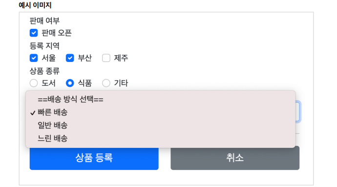

# 0. 타임리프 스프링 통합

- **MVC 1 에서 마지막에 만들었던 상품관리 페이지 사용**
- 타임리프는 크게 2가지 메뉴얼을 제공한다.
  - 기본 메뉴얼: https://www.thymeleaf.org/doc/tutorials/3.0/usingthymeleaf.html 
  - 스프링 통합 메뉴얼: https://www.thymeleaf.org/doc/tutorials/3.0/thymeleafspring.html 
- 타임리프를 설정하기 위해서는 프 템플릿 엔진을 스프링 빈에 등록하고, 타임리프용 뷰 리졸버를 스프링 빈으로 등록하는 과정이 필요하지만, 스프링 부트는 이런 부분을 모두 자동화해준다.
  - build.gradle 에 `implementation 'org.springframework.boot:spring-boot-starter-thymeleaf'` 한줄이면 ok!
- 스프링 부트가 제공하는 타임리프 설정, thymeleaf 검색 필요
  -  https://docs.spring.io/spring-boot/docs/current/reference/html/appendix-applicationproperties.html#common-application-properties-templating

# 1. 등록/수정 폼 (th:object)

- `th:object` 를 적용하려면 먼저 해당 오브젝트 정보를 넘겨주어야 한다.
- 넘겨받는 오브젝트가 없다면 데이터가 비어있는 빈 오브젝트를 만들어서 뷰에 전달하면 된다.

## 등록 폼 

### FormItemController 변경

- ```java
  @GetMapping("/add")
  public String addForm(Model model) {
      model.addAttribute("item", new Item());
      return "form/addForm";
  }
  ```

  - new Item() 을 통해  빈 오브젝트를 만들어서 뷰에 전달한다.

### form/addForm.html 변경 코드 부분

- ```html
  <!DOCTYPE HTML>
  <html xmlns:th="http://www.thymeleaf.org">
  <head>
      <meta charset="utf-8">
      <link th:href="@{/css/bootstrap.min.css}"
            href="../css/bootstrap.min.css" rel="stylesheet">
      <style>
          .container {
              max-width: 560px;
          }
      </style>
  </head>
  <body>
  
  <div class="container">
  
      <div class="py-5 text-center">
          <h2>상품 등록 폼</h2>
      </div>
  
      <form action="item.html" th:action th:object="${item}" method="post">
          <div>
              <label for="itemName">상품명</label>
              <input type="text" id="itemName" th:field="*{itemName}" class="form-control" placeholder="이름을 입력하세요">
          </div>
          <div>
              <label for="price">가격</label>
              <input type="text" id="price" th:field="*{price}" class="form-control" placeholder="가격을 입력하세요">
          </div>
          <div>
              <label for="quantity">수량</label>
              <input type="text" id="quantity" th:field="*{quantity}" class="form-control" placeholder="수량을 입력하세요">
          </div>
  
          <hr class="my-4">
  
          <div class="row">
              <div class="col">
                  <button class="w-100 btn btn-primary btn-lg" type="submit">상품 등록</button>
              </div>
              <div class="col">
                  <button class="w-100 btn btn-secondary btn-lg"
                          onclick="location.href='items.html'"
                          th:onclick="|location.href='@{/form/items}'|"
                          type="button">취소</button>
              </div>
          </div>
  
      </form>
  
  </div> <!-- /container -->
  </body>
  </html>
  ```

  - `th:object="${item}"` : <form> 에서 사용할 객체를 지정한다. 선택 변수 식( *{...} )을 적용할 수 있다.
  - `th:field="*{itemName}"`
    - `${item.itemName}` 와 같다. th:object 로 item 을 선택했기 때문에 선택 변수 식이 적용가능하다.
  - th:field 는 id , name , value 속성을 모두 자동으로 만들어준다.
    - ex) `th:field="*{itemName}"` 
    - -> id="itemName" name="itemName" value="" (value 는 비어있으므로)
    - label for="itemName" 때문에 id 는 그대로 남겨둔다.

### 렌더링 전

- ```html
  <input type="text" id="itemName" th:field="*{itemName}" class="form-control"
  placeholder="이름을 입력하세요">
  ```

### 렌더링 후

- ```html
  <input type="text" id="itemName" class="form-control" placeholder="이름을
  입력하세요" name="itemName" value="">
  ```

## 수정 폼 

- FormItemController 는 변경 사항 없음(이미 model.attribute 로 모델을 받기때문)

### form/editForm.html 변경 코드 부분

- ```html
  <!DOCTYPE HTML>
  <html xmlns:th="http://www.thymeleaf.org">
  <head>
      <meta charset="utf-8">
      <link th:href="@{/css/bootstrap.min.css}"
            href="../css/bootstrap.min.css" rel="stylesheet">
      <style>
          .container {
              max-width: 560px;
          }
      </style>
  </head>
  <body>
  
  <div class="container">
  
      <div class="py-5 text-center">
          <h2>상품 수정 폼</h2>
      </div>
  
      <form action="item.html" th:action th:object="${item}" method="post">
          <div>
              <label for="id">상품 ID</label>
              <input type="text" id="id" class="form-control" th:field="*{id}" readonly>
          </div>
          <div>
              <label for="itemName">상품명</label>
              <input type="text" id="itemName" class="form-control" th:field="*{itemName}">
          </div>
          <div>
              <label for="price">가격</label>
              <input type="text" id="price" class="form-control" th:field="*{price}">
          </div>
          <div>
              <label for="quantity">수량</label>
              <input type="text" id="quantity" class="form-control" th:field="*{quantity}">
          </div>
  
          <hr class="my-4">
  
          <div class="row">
              <div class="col">
                  <button class="w-100 btn btn-primary btn-lg" type="submit">저장</button>
              </div>
              <div class="col">
                  <button class="w-100 btn btn-secondary btn-lg"
                          onclick="location.href='item.html'"
                          th:onclick="|location.href='@{/form/items/{itemId}(itemId=${item.id})}'|"
                          type="button">취소</button>
              </div>
          </div>
  
      </form>
  
  </div> <!-- /container -->
  </body>
  </html>
  ```

  - 수정 폼의 경우 id , name , value 를 모두 신경써야 했는데, 많은 부분이 th:field 덕분에 자동으로 처리되는 것을 확인할 수 있다.

### 렌더링 전

- ```html
  <input type="text" id="itemName" th:field="*{itemName}" class="form-control">
  ```

### 렌더링 후

- ```html
  <input type="text" id="itemName" class="form-control" name="itemName" value="itemA"
  ```


# 2. 요구사항 추가

- 타임리프를 사용해서 폼에서 체크박스, 라디오 버튼, 셀렉트 박스를 편리하게 사용하는 방법을 학습

## 추가 요구 사항

- 판매 여부 
  - 판매 오픈 여부 
  - 체크 박스로 선택할 수 있다. 
- 등록 지역 
  - 서울, 부산, 제주 
  - 체크 박스로 다중 선택할 수 있다. 
- 상품 종류 
  - 도서, 식품, 기타 
  - 라디오 버튼으로 하나만 선택할 수 있다. 
- 배송 방식 
  - 빠른 배송, 일반 배송, 느린 배송 
  - 셀렉트 박스로 하나만 선택할 수 있다.

### 예시 이미지 

- 

## ItemType - 상품 종류

- ```java
  package hello.itemservice.domain.item;
  
  public enum ItemType {
  
      BOOK("도서"), FOOD("음식"), ETC("기타");
  
      private final String description;
  
      ItemType(String description) {
          this.description = description;
      }
  }
  
  ```

  - 상품 종류는 ENUM 을 사용한다. 설명을 위해 description 필드를 추가했다.

## 배송 방식 - DeliveryCode

- ```java
  package hello.itemservice.domain.item;
  
  import lombok.AllArgsConstructor;
  import lombok.Data;
  import org.springframework.beans.factory.annotation.Autowired;
  
  /**
   * FAST : 빠른 배송
   * NORMAL : 일반 배송
   * SLOW : 느린 배송
   */
  
  @Data
  @AllArgsConstructor
  public class DeliveryCode {
  
      private String code;
      private String displayName;
  }
  
  ```

  - code 는 FAST 같은 시스템에서 전달하는 값이고, displayName 은 빠른 배송 같은 고객에게 보여주는 값이다.

## Item - 상품

- ```java
  package hello.itemservice.domain.item;
  
  import lombok.Data;
  
  import java.util.List;
  
  @Data
  public class Item {
  
      private Long id;
      private String itemName;
      private Integer price;
      private Integer quantity;
  
      private Boolean open; //판매 여부
      private List<String> regions; //등록 지역
      private ItemType itemType; //상품 종류
      private String deliveryCode; //배송 방식
  
      public Item() {
      }
  
      public Item(String itemName, Integer price, Integer quantity) {
          this.itemName = itemName;
          this.price = price;
          this.quantity = quantity;
      }
  }
  ```

  - open, regions, itemType, deliveryCode 를 추가한다.

# 3. 체크박스 - 단일

## 체크박스 렌더링과 문제

### 단순 HTML 체크 박스

- `resources/templates/form/addForm.html` 추가

- ```html
  <hr class="my-4">
  <!-- single checkbox -->
  <div>판매 여부</div>
  <div>
   <div class="form-check">
   <input type="checkbox" id="open" name="open" class="form-check-input">
   <label for="open" class="form-check-label">판매 오픈</label>
   </div>
  </div>
  ```

### FormItemController 추가

- 상품이 등록되는 곳에 다음과 같이 로그를 남겨서 값이 잘 넘어오는지 확인해보자.

- ```java
  @PostMapping("/add")
  public String addItem(@ModelAttribute Item item, RedirectAttributes redirectAttributes) {
      log.info("item.open={}", item.getOpen());
      ...
  ```

### 실행로그

- FormItemController : item.open=true //체크 박스를 선택하는 경우 
- FormItemController : item.open=null //체크 박스를 선택하지 않는 경우
- 체크 박스를 체크하면 HTML Form에서 open=on 이라는 값이 넘어간다. 스프링은 on 이라는 문자를 true 타입으로 변환해준다.

### 문제점

- HTML checkbox는 선택이 안되면 클라이언트에서 서버로 값 자체를 보내지 않는다. 
- 수정의 경우에는 상황에 따라서 이 방식이 문제가 될 수 있다. 사용자가 의도적으로 체크되어 있던 값을 체크를 해제해도 저장시 아무 값도 넘어가지 않기 때문에, 서버 구현에 따라서 값이 오지 않은 것으로 판단해서 값을 변경하지 않을 수도 있다.

## 히든 필드를 통한 체크 해제 인식

### 체크 해제를 인식하기 위한 히든 필드

- `<input type="hidden" name="_open" value="on"/>`  -> 기존 체크박스 코드에 추가

- ```html
  <!-- single checkbox -->
      <div>판매 여부</div>
      <div>
          <div class="form-check">
              <input type="checkbox" id="open" name="open" class="form-check-input">
              <input type="hidden" name="_open" value="on"/> <!--히든필드 추가-->
              <label for="open" class="form-check-label">판매 오픈</label>
          </div>
      </div>
  ```

### 실행로그

- FormItemController : item.open=true //체크 박스를 선택하는 경우 
- FormItemController : item.open=false //체크 박스를 선택하지 않는 경우

### 체크 박스 체크

- `open=on&_open=on`
- 체크 박스를 체크하면 스프링 MVC가 open 에 값이 있는 것을 확인하고 사용한다. 이때 _open 은 무시한다.

### 체크 박스 미체크

- `_open=on`
- 체크 박스를 체크하지 않으면 스프링 MVC가 _open 만 있는 것을 확인하고, open 의 값이 체크되지 않았다고 인식한다.
- 이 경우 서버에서 Boolean 타입을 찍어보면 결과가 null 이 아니라 false 인 것을 확인할 수 있다.

## 타임리프를 통한 체크박스

- 타임리프가 제공하는 폼 기능을 사용하면  _open 부분을 자동으로 처리할 수 있다.

### 타임리프 - addForm 체크 박스 코드 추가

- ```html
  <!-- single checkbox -->
  <div>판매 여부</div>
  <div>
   <div class="form-check">
   <input type="checkbox" id="open" th:field="*{open}" class="form-checkinput">
   <label for="open" class="form-check-label">판매 오픈</label>
   </div>
  </div>
  ```

#### 타임리프 체크 박스 HTML 생성 결과

- ```html
  <hr class="my-4">
  <!-- single checkbox -->
  <div>판매 여부</div>
  <div>
      <div class="form-check">
          <input type="checkbox" id="open" class="form-check-input" name="open" value="true">
          <input type="hidden" name="_open" value="on"/>
          <label for="open" class="form-check-label">판매 오픈</label>
      </div>
  </div>
  ```

  - 타임리프를 사용하면 체크 박스의 히든 필드와 관련된 부분도 함께 해결해준다.
    - ` <input type="hidden" name="_open" value="on"/>` 자동 생성

### 타임리프 - item 체크 박스 코드 추가

- ```html
  <hr class="my-4">
  <!-- single checkbox -->
  <div>판매 여부</div>
  <div>
      <div class="form-check">
          <input type="checkbox" id="open" th:field="${item.open}" class="form-check-input" disabled>
          <label for="open" class="form-check-label">판매 오픈</label>
      </div>
  </div>
  ```

  - item.html 에는 th:object 를 사용하지 않았기 때문에 th:field 부분에 ${item.open} 으로 적어주어야 한다.
  - disabled 를 사용해서 상품 상세에서는 체크 박스가 선택되지 않도록 했다.

#### html 생성 결과

- ```html
  <hr class="my-4">
  <!-- single checkbox -->
  <div class="form-check">
   <input type="checkbox" id="open" class="form-check-input" disabled
  name="open" value="true"
   checked="checked">
   <label for="open" class="form-check-label">판매 오픈</label>
  </div>
  ```

  - `checked="checked"` 로 값이 true 인 경우 체크를 자동으로 처리해준다.
  - 상품 상세에서는 체크박스가 체크되지 않도록 disabled 속성을 넣어준다.

## 타임리프 - editForm 체크 박스 코드 추가

- 코드는 addForm 과 동일

### ItemRepository - update() 코드를 다음과 같이 수정

- ```java
  public void update(Long itemId, Item updateParam) {
   Item findItem = findById(itemId);
   findItem.setItemName(updateParam.getItemName());
   findItem.setPrice(updateParam.getPrice());
   findItem.setQuantity(updateParam.getQuantity());
   findItem.setOpen(updateParam.getOpen());
   findItem.setRegions(updateParam.getRegions());
   findItem.setItemType(updateParam.getItemType());
   findItem.setDeliveryCode(updateParam.getDeliveryCode());
  }
  ```

  

# 4. 체크박스 - 멀티

- 등록 지역 : 서울, 부산, 제주 ->  체크 박스로 다중 선택할 수 있다.

## FormItemController - 추가

- ```java
  //자동으로 모델에 담긴다.
      @ModelAttribute("regions")
      public Map<String, String> regions(){
  
          //Hashmap 은 순서를 보장하지 않기 때문에 LinkedHashMap 사용
          Map<String, String> regions = new LinkedHashMap<>();
          regions.put("SEOUL", "서울");
          regions.put("BUSAN", "부산");
          regions.put("JEJU", "제주");
  
          return regions;
      }
  ```

  - 등록 폼, 상세화면, 수정 폼에서 모두 중복해서 사용해야 한다.
  - 따라서 `@ModelAttribute("regions")` 를 통해 별도의 메서드로 만들 수 있다.
  - 이렇게 하면 해당 컨트롤러를 요청할 때 regions 에서 반환한 값이 자동으로 모델( model )에 담기게 된다.
  - 만약 이게 복잡해지면 클래스를 따로 빼는 것을 추천

## addForm.html - 추가

- ```html
  <!-- multi checkbox -->
  <div>
   <div>등록 지역</div>
   <div th:each="region : ${regions}" class="form-check form-check-inline">
   <input type="checkbox" th:field="*{regions}" th:value="${region.key}"
  class="form-check-input">
   <label th:for="${#ids.prev('regions')}" th:text="${region.value}" class="form-check-label">서울</label>
   </div>
  </div>
  ```

  - th:each 로 각 region 마다 반복문을 돌게 한다.
  - input 에 `th:field="*{regions}"` 를 넣으면,
    - id 를 자동 생성해준다. (regions1, regions2 regions3)
    - name 은 중복가능하므로 regions 로 똑같이 된다.
  - input 에 `th:value="${region.key}"` 를 통해 "SEOUL", "BUSAN", "JEJU" 를 루프문으로 넣어준다.

### label

-  label 은 체크박스가 아니라 글자를 눌러도 체크박스에 체크될 수 있게 해준다.
- HTML의 id 가 타임리프에 의해 동적으로 만들어지기 때문에  `<label for="id 값">` 으로 label 의 대상이 되는 id 값을 임의로 지정하는 것은 곤란하다.
- 타임리프는 ids.prev(...) , ids.next(...) 을 제공해서 동적으로 생성되는 id 값을 사용할 수 있도록 한다.

### 타임리프 HTML 생성 결과

- ```html
  <!-- multi checkbox -->
  <div>
      <div>등록 지역</div>
      <div class="form-check form-check-inline">
          <input type="checkbox" value="SEOUL" class="form-check-input"
          id="regions1" name="regions">
          <input type="hidden" name="_regions" value="on"/>
          <label for="regions1"
          class="form-check-label">서울</label>
      </div>
      <div class="form-check form-check-inline">
          <input type="checkbox" value="BUSAN" class="form-check-input"
          id="regions2" name="regions">
          <input type="hidden" name="_regions" value="on"/>
          <label for="regions2"
          class="form-check-label">부산</label>
      </div>
      <div class="form-check form-check-inline">
          <input type="checkbox" value="JEJU" class="form-check-input"
          id="regions3" name="regions">
          <input type="hidden" name="_regions" value="on"/>
          <label for="regions3"
          class="form-check-label">제주</label>
      </div>
  </div>
  <!-- -->
  ```

  -  `<label for="id 값">`에 지정된 id 가 checkbox 에서 동적으로 생성된 regions1 , regions2 , regions3 에 맞추어 순서대로 입력된 것을 확인할 수 있다.

### 로그 출력

- `FormItemController.addItem()` 에 코드 추가
  - `log.info("item.regions={}", item.getRegions());`
- 서울, 부산 선택 : `item.regions=[SEOUL, BUSAN]`
- 지역 선택X : `item.regions=[]`

## item.html - 추가

- ```html
  <!-- multi checkbox -->
  <div>
   <div>등록 지역</div>
   <div th:each="region : ${regions}" class="form-check form-check-inline">
   <input type="checkbox" th:field="${item.regions}" th:value="${region.key}" class="form-check-input" disabled>
   <label th:for="${#ids.prev('regions')}"
   th:text="${region.value}" class="form-check-label">서울</label>
   </div>
  </div>
  ```

  - th:object 를 사용하지 않았기 때문에 th:field 부분에 ${item.regions} 으로 적어주어야 한다.
  - disabled 를 사용해서 상품 상세에서는 체크 박스가 선택되지 않도록 했다
  - 타임리프는 th:field 에 지정한 값과 th:value 의 값을 비교해서 체크를 자동으로 처리해준다. (`checked="checked"`)

## editForm.html - 추가

- addForm 과 똑같은 코드를 추가한다.


# 5. 라디오 버튼

- 상품 종류 : 도서, 식품, 기타 -> 라디오 버튼으로 하나만 선택할 수 있다.

## ItemType 수정

- getDescription 을 생성하여 타임리프에서 type.desciption 을 사용할 수 있게 해야 한다.

- type.getDesciption() -> type.desciption 이기 때문

- ```java
  package hello.itemservice.domain.item;
  
  public enum ItemType {
  
      BOOK("도서"), FOOD("음식"), ETC("기타");
  
      private final String description;
  
      ItemType(String description) {
          this.description = description;
      }
  
      //추가
      public String getDescription() {
          return description;
      }
  }
  ```

  

## FormItemController - 추가

- ```java
  @ModelAttribute("itemTypes")
  public ItemType[] itemTypes(){
      return ItemType.values();
  }
  ```

  - itemTypes 를 등록 폼, 조회, 수정 폼에서 모두 사용하므로 @ModelAttribute 으로 모든 메서드에 적용한다.
  - `ItemType.values()` 를 사용하면 해당 ENUM의 모든 정보를 배열로 반환한다. 예) [BOOK, FOOD, ETC]
    - 따라서 `ItemType[]` 으로 선언

## addForm.html - 추가

- ```html
  <!-- radio button -->
      <div>
          <div>상품 종류</div>
          <div th:each="type : ${itemTypes}" class="form-check form-check-inline">
              <input type="radio" th:field="*{itemType}" th:value="1ype.name()}" class="form-check-input">
              <label th:for="${#ids.prev('itemType')}" th:text="${type.description}" class="form-check-label">
                  BOOK
              </label>
          </div>
      </div>
  ```

- type.name() 을 사용하면 enum 의 이름을 직접 호출해준다. ex) BOOK, FOOD, ETC
- ` th:text="${type.description}" ` 를 통해 보여지는 부분은 "도서", "음식", "기타" 로 하였다.

### 로그 추가 후 로그 확인

- `log.info("item.itemType={}", item.getItemType());`
  - item.itemType=FOOD: 값이 있을 때 
  - item.itemType=null: 값이 없을 때
- 라디오 버튼은 이미 선택이 되어 있다면, 수정시에도 항상 하나를 선택하도록 되어 있으므로 체크 박스와 달리 별도의 히든 필드를 사용할 필요가 없다.

## item.html, editForm.html

- 같은 코드
- 태그에서 선택한 식품( FOOD )에 checked="checked" 가 적용된 것을 확인할 수 있다.

## 타임리프에서 ENUM 직접 사용하기

- `<div th:each="type : ${T(hello.itemservice.domain.item.ItemType).values()}">`
  - ENUM에 values() 를 호출하면 해당 ENUM의 모든 정보가 배열로 반환된다.
- 직접 경로를 설정해줘서 타임리프를 쓸 수 있다.
- 그런데 이렇게 사용하면 ENUM의 패키지 위치가 변경되거나 할때 자바 컴파일러가 타임리프까지 컴파일 오류를 잡을 수 없으므로 추천하지는 않는다.

# 6. 셀렉트 박스

- 배송 방식 : 빠른 배송, 일반 배송, 느린 배송 -> 셀렉트 박스로 하나만 선택할 수 있다.

## FormItemController - 추가

- ```java
  @ModelAttribute("deliveryCodes")
  public List<DeliveryCode> deliveryCodes(){
      List<DeliveryCode> deliveryCodes = new ArrayList<>();
      deliveryCodes.add(new DeliveryCode("FAST", "빠른 배송"));
      deliveryCodes.add(new DeliveryCode("NORMAL", "일반 배송"));
      deliveryCodes.add(new DeliveryCode("SLOW", "느린 배송"));
  
      return deliveryCodes;
  }
  ```

  - List 형태로 model 에 반환한다.

## addForm.html - 추가

- ```html
  <!-- SELECT -->
  <div>
      <div>배송 방식</div>
      <select th:field="*{deliveryCode}" class="form-select">
      <option value="">==배송 방식 선택==</option>
      <option th:each="deliveryCode : ${deliveryCodes}" th:value="${deliveryCode.code}"
      th:text="${deliveryCode.displayName}">FAST</option>
      </select>
  </div>
  <hr class="my-4">
  ```

  - `<hr class="my-4">` 으로 맨 밑에 밑줄을 넣어 구분한다.
  - 그 외엔 특별한 게 없다.

## addForm.html - 렌더링된 코드

- ```html
  <!-- SELECT -->
      <div>
          <div>배송 방식</div>
          <select class="form-select" id="deliveryCode" name="deliveryCode">
              <option value="">==배송 방식 선택==</option>
              <option value="FAST">빠른 배송</option>
              <option value="NORMAL">일반 배송</option>
              <option value="SLOW">느린 배송</option>
          </select>
      </div>
  
      <hr class="my-4">
  ```

## item.html / editForm.html

- 체크 박스, 라디오 버튼과 비슷하다.
- item.html 에는 `<select th:field="${item.deliveryCode}" class="form-select" disabled>` 처럼 disabled 를 넣어서 수정하지 못하도록 한다.

# 7. 내가 생각하는 add 및 item 상세 페이지 과정

- `@ModelAttribute("regions")` 처럼 먼저 만들어지는 Model 은 어떻게 들어가고 item 상세 페이지에 출력되는가?

## add 시

1. regions -> Map 으로 반환 / itemTypes -> List<> 로 반환 / deliveryCodes -> List<> 로 반환
2. addForm 에서 체크박스, 라디오 버튼, 셀렉트 박스는 Form 태그 안에 들어가 있다. 따라서 선택한 값만 POST 로 반환된다.
3. Item item 에 
   1. Map regions 는 List 형식으로 서버로 넘어온다. (name="regions") -> Item 에 regions 로 등록된다.
   2. List<> itemTypes 는 1개만 선택되어서 서버로 넘어온다. (name="itemType") -> Item 에 ItemType Book 으로 넘어온다.
   3. List<> deliveryCodes 도 1개만 선택돼서 서버로 넘어온다. (name="deliveryCode") -> Item 에 String 으로 넘어온다.
4. 그리고 @PostMapping("/add") 에서 itemRepository.save(item) 으로 저장된다.

## 상세 페이지에서

1. @PathVariable long itemId 로 저장된 item 을 불러온다.
2. 그 item 에는 체크박스, 라디오 버튼, 셀렉트 박스의 값이 있으므로 그대로 렌더링한다.