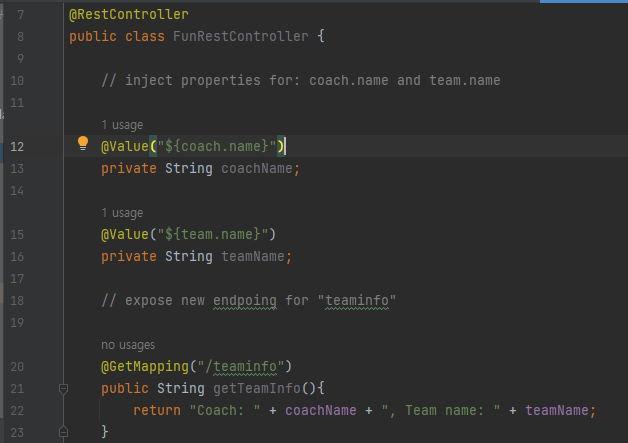

# 직접 Property 커스텀하기

- Problem
  
  - You need for your app to be configurable .. no hard-coding of values
  
  - You need for to read app configuration from a perperties file

- Solution: Application Properties file
  
  - By default, Spring Boot reads information from a standard properties file
    
    - Located at: ***src/main/resources/application.properties*** (Standard Spring Boot file name)
  
  - You can define ANY custom properties in this file
  
  - Your Spring Boot app can access properties using ***@Value*** (No additional coing or configuration required)

## Development Process

1. Define custom properties in ***application.properties***

2. Inject properties into Spring Boot application using ***@Value***

### Step 1: Define custom application properties

```java
File: src/main/resources/application.properties

# Define custom properties

coach.name = Mickey Mouse
tean.name = The Mouse Club
```

### Step 2: Inject properties into Spring Boot app

```java
@RestController
public class FunrestController {
    // inject properties for: coach.name and team.name

    @Value("${coach.name}")
    private String coachName;

    @Value("${team.name}")
    private String teamName;
    // 위에 있던 속성 주
}
```

### Result





출처 : 유데미, luv2code.com
