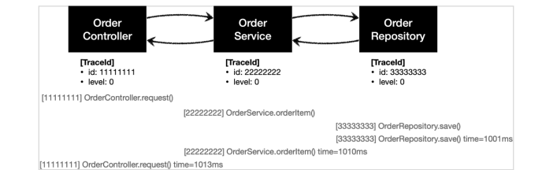
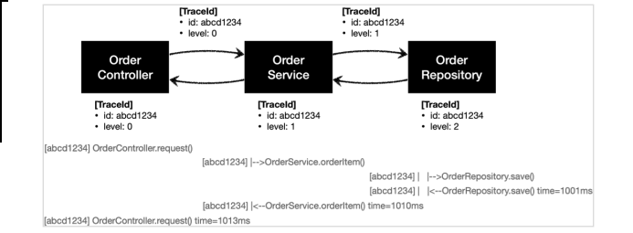

# 0. 예제 프로젝트 만들기 - V0

- 상품을 주문하는 프로세스로 가정하고, 일반적인 웹 애플리케이션에서 Controller Service Repository로 이어지는 흐름을 최대한 단순하게 만든다.

## OrderRepositoryV0

- ```java
  package hello.advanced.v0;
  
  import lombok.RequiredArgsConstructor;
  import org.springframework.stereotype.Repository;
  
  @Repository
  @RequiredArgsConstructor
  public class OrderRepositoryV0 {
  
      public void save(String itemId) {
          if (itemId.equals("ex")) {
              throw new IllegalStateException("예외 발생");
          }
          sleep(1000);
      }
  
      private static void sleep(int milis) {
          try {
              Thread.sleep(milis);
          } catch (InterruptedException e) {
              e.printStackTrace();
          }
      }
  }
  ```

  - sleep(1000) : 리포지토리는 상품을 저장하는데 약 1초 정도 걸리는 것으로 가정하기 위해 1초 지연을 주었다. (1000ms) 
  - 예외가 발생하는 상황도 확인하기 위해 파라미터 itemId 의 값이 ex 로 넘어오면 IllegalStateException 예외가 발생하도록 했다.

## OrderServiceV0

- ```java
  package hello.advanced.v0;
  
  import lombok.RequiredArgsConstructor;
  import org.springframework.stereotype.Service;
  
  @Service
  @RequiredArgsConstructor
  public class OrderServiceV0 {
  
      private final OrderRepositoryV0 orderRepository;
  
      public void orderItem(String itemId){
          orderRepository.save(itemId);
      }
  }
  ```

  - @Service : 컴포넌트 스캔의 대상이 된다. 
  - 실무에서는 복잡한 비즈니스 로직이 서비스 계층에 포함되지만, 예제에서는 단순함을 위해서 리포지토리에 저장을 호출하는 코드만 있다.

## OrderControllerV0

- ```java
  package hello.advanced.v0;
  
  import lombok.RequiredArgsConstructor;
  import org.springframework.web.bind.annotation.GetMapping;
  import org.springframework.web.bind.annotation.RestController;
  
  @RestController
  @RequiredArgsConstructor
  public class OrderControllerV0 {
  
      private final OrderServiceV0 orderService;
  
      @GetMapping("/v0/request")
      public String request(String itemId) {
          orderService.orderItem(itemId);
          return "ok";
      }
  }
  ```

  - /v0/request 메서드는 HTTP 파라미터로 itemId 를 받을 수 있다.

## 로그 추적기 - 요구사항 분석

## 요구사항

- 모든 PUBLIC 메서드의 호출과 응답 정보를 로그로 출력
- 애플리케이션의 흐름을 변경하면 안됨
  - 로그를 남긴다고 해서 비즈니스 로직의 동작에 영향을 주면 안됨
- 메서드 호출에 걸린 시간
- 정상 흐름과 예외 흐름 구분
  - 예외 발생시 예외 정보가 남아야 함
- 메서드 호출의 깊이 표현 
- HTTP 요청을 구분
  - HTTP 요청 단위로 특정 ID를 남겨서 어떤 HTTP 요청에서 시작된 것인지 명확하게 구분이 가능해야 함 
  - 트랜잭션 ID (DB 트랜잭션X), 여기서는 하나의 HTTP 요청이 시작해서 끝날 때 까지를 하나의 트랜잭션이라 함

## 예시

```
정상 요청
[796bccd9] OrderController.request()
[796bccd9] |-->OrderService.orderItem()
[796bccd9] | |-->OrderRepository.save()
[796bccd9] | |<--OrderRepository.save() time=1004ms
[796bccd9] |<--OrderService.orderItem() time=1014ms
[796bccd9] OrderController.request() time=1016ms

예외 발생
[b7119f27] OrderController.request()
[b7119f27] |-->OrderService.orderItem()
[b7119f27] | |-->OrderRepository.save()
[b7119f27] | |<X-OrderRepository.save() time=0ms
ex=java.lang.IllegalStateException: 예외 발생!
[b7119f27] |<X-OrderService.orderItem() time=10ms
ex=java.lang.IllegalStateException: 예외 발생!
[b7119f27] OrderController.request() time=11ms
ex=java.lang.IllegalStateException: 예외 발생!
```

> 모니터링 툴을 도입하면 많은 부분이 해결되지만, 지금은 학습이 목적이라는 사실을 기억하자.

# 1. 로그 추적기 V1 - 프로토타입 개발

- 먼저 로그 추적기를 위한 기반 데이터를 가지고 있는 TraceId , TraceStatus 클래스를 만든다.

## TraceId

- ```java
  package hello.advanced.trace;
  
  import lombok.Getter;
  
  import java.util.UUID;
  
  @Getter
  public class TraceId {
      private String id;
      private int level;
  
      public TraceId() {
          this.id = createId();
          this.level = 0;
      }
  
      public TraceId(String id, int level) {
          this.id = id;
          this.level = level;
      }
  
      private String createId() {
          //UUID 앞 8자리만 사용
          return UUID.randomUUID().toString().substring(0, 8);
      }
  
      //레벨이 하나씩 증가하는 것을 표현
      public TraceId createNextId(){
          return new TraceId(id, level + 1);
      }
  
      public TraceId createPreviousId(){
          return new TraceId(id, level - 1);
      }
  
      public boolean isFirstLevel(){
          return level == 0;
      }
  }
  ```

- 여기서는 트랜잭션ID와 깊이를 표현하는 level을 묶어서 TraceId 라는 개념을 만들었다. TraceId 는 단순히 id (트랜잭션ID)와 level 정보를 함께 가지고 있다.

  - ```
    [796bccd9] OrderController.request()    //트랜잭션ID:796bccd9, level:0
    [796bccd9] |-->OrderService.orderItem() //트랜잭션ID:796bccd9, level:1
    [796bccd9] | |-->OrderRepository.save() //트랜잭션ID:796bccd9, level:2
    ```

### UUID

- TraceId 를 처음 생성하면 createId() 를 사용해서 UUID를 만들어낸다. UUID가 너무 길어서 여기서는 앞 8자리만 사용한다. 이 정도면 로그를 충분히 구분할 수 있다. 여기서는 이렇게 만들어진 값을 트랜잭션ID 로 사용한다

### createNextId()

- 다음 TraceId 를 만든다. 예제 로그를 잘 보면 깊이가 증가해도 트랜잭션ID는 같다. 대신에 깊이가 하나 증가한다.

- ```
  [796bccd9] OrderController.request()
  [796bccd9] |-->OrderService.orderItem() //트랜잭션ID가 같다. 깊이는 하나 증가한다.
  ```

### createPreviousId()

- createNextId() 의 반대 역할을 한다.

## TraceStatus

- TraceStatus 클래스: 로그의 상태 정보를 나타낸다.

- ```java
  package hello.advanced.trace;
  
  import lombok.AllArgsConstructor;
  import lombok.Getter;
  
  @Getter
  @AllArgsConstructor
  
  public class TraceStatus {
  
      private TraceId traceId;
      private Long startTimeMs;
      private String message;
  }
  ```

  - startTimeMs : 로그 시작시간이다. 로그 종료시 이 시작 시간을 기준으로 시작~종료까지 전체 수행 시간을 구할 수 있다.

## HelloTraceV1

- TraceId , TraceStatus 를 사용해서 실제 로그를 생성하고, 처리하는 기능을 개발한다.

- ```java
  package hello.advanced.trace.hellotrace;
  
  import hello.advanced.trace.TraceId;
  import hello.advanced.trace.TraceStatus;
  import lombok.extern.slf4j.Slf4j;
  import org.springframework.stereotype.Component;
  
  @Slf4j
  @Component
  public class HelloTraceV1 {
  
      private static final String START_PREFIX = "-->";
      private static final String COMPLETE_PREFIX = "<--";
      private static final String EX_PREFIX = "<X-";
  
      //로그 시작
      public TraceStatus begin(String message) {
          TraceId traceId = new TraceId();
          Long startTimeMs = System.currentTimeMillis();
          log.info("[{}] {}{}", traceId.getId(), addSpace(START_PREFIX, traceId.getLevel()), message);
          return new TraceStatus(traceId, startTimeMs, message);
      }
  
      //로그 끝
      public void end(TraceStatus status) {
          complete(status, null);
      }
      //로그 끝 + 예외
      public void exception(TraceStatus status, Exception e) {
          complete(status, e);
      }
      
      //end() , exception() , 의 요청 흐름을 한곳에서 편리하게 처리한다. 실행 시간을 측정하고 로그를 남긴다.
      private void complete(TraceStatus status, Exception e) {
          Long stopTimeMs = System.currentTimeMillis();
          long resultTimeMs = stopTimeMs - status.getStartTimeMs();
          TraceId traceId = status.getTraceId();
          if (e == null) {
              log.info("[{}] {}{} time={}ms", traceId.getId(),
                      addSpace(COMPLETE_PREFIX, traceId.getLevel()), status.getMessage(),
                      resultTimeMs);
          } else {
              log.info("[{}] {}{} time={}ms ex={}", traceId.getId(),
                      addSpace(EX_PREFIX, traceId.getLevel()), status.getMessage(), resultTimeMs,
                      e.toString());
          }
      }
  
      private static String addSpace(String prefix, int level) {
          StringBuilder sb = new StringBuilder();
          for (int i = 0; i < level; i++) {
              sb.append( (i == level - 1) ? "|" + prefix : "| ");
          }
          return sb.toString();
      }
  }
  ```

## test

- ```java
  package hello.advanced.trace.hellotrace;
  
  import hello.advanced.trace.TraceStatus;
  import org.junit.jupiter.api.Test;
  import org.springframework.test.context.TestPropertySource;
  
  public class HelloTraceV1Test {
  
      @Test
      void begin_end(){
          HelloTraceV1 trace = new HelloTraceV1();
          TraceStatus status = trace.begin("hello");
          trace.end(status);
      }
  
      @Test
      void begin_exception(){
          HelloTraceV1 trace = new HelloTraceV1();
          TraceStatus status = trace.begin("hello");
          trace.exception(status, new IllegalStateException());
      }
  }
  ```

### begin_end() - 실행 로그

```
[41bbb3b7] hello
[41bbb3b7] hello time=5ms
```

### begin_exception() - 실행 로그

```
[898a3def] hello
[898a3def] hello time=13ms ex=java.lang.IllegalStateException
```

# 2. 로그 추적기 V1 - 적용

## OrderControllerV1

- ```java
  package hello.advanced.app.v1;
  
  import hello.advanced.trace.TraceStatus;
  import hello.advanced.trace.hellotrace.HelloTraceV1;
  import lombok.RequiredArgsConstructor;
  import org.springframework.web.bind.annotation.GetMapping;
  import org.springframework.web.bind.annotation.RestController;
  
  @RestController
  @RequiredArgsConstructor
  public class OrderControllerV1 {
  
      private final OrderServiceV1 orderService;
      //주입
      private final HelloTraceV1 trace;
  
      @GetMapping("/v1/request")
      public String request(String itemId) {
  
          TraceStatus status = null;
  
          try{
              status = trace.begin("OrderController.request()");
              orderService.orderItem(itemId);
              trace.end(status);
              return "ok";
          }catch (Exception e){
              trace.exception(status, e);
              throw e; //예외를 꼭 다시 던져줘야 한다.
          }
      }
  }
  
  ```

  - 단순하게 trace.begin() , trace.end() 코드 두 줄만 적용하면 될 줄 알았지만, 실상은 그렇지 않다. trace.exception() 으로 예외까지 처리해야 하므로 지저분한 try , catch 코드가 추가된다.
  - begin() 의 결과 값으로 받은 TraceStatus status 값을 end() , exception() 에 넘겨야 한다. 결국 try , catch 블록 모두에 이 값을 넘겨야한다. 따라서 try 상위에 TraceStatus status 코드를 선언해야 한다. 만약 try 안에서 TraceStatus status 를 선언하면 try 블록안에서만 해당 변수가 유효하기 때문에 catch 블록에 넘길 수 없다. 따라서 컴파일 오류가 발생한다.
  - **throw e : 예외를 꼭 다시 던져주어야 한다. 그렇지 않으면 여기서 예외를 먹어버리고, 이후에 정상 흐름으로 동작한다. 로그는 애플리케이션에 흐름에 영향을 주면 안된다. 로그 때문에 예외가 사라지면 안된다.**

### 실행 

- 정상: `http://localhost:8080/v1/request?itemId=hello` 
- 예외: `http://localhost:8080/v1/request?itemId=ex`

## OrderServiceV1

- controller 와 비슷

- ```java
  package hello.advanced.app.v1;
  
  import hello.advanced.trace.TraceStatus;
  import hello.advanced.trace.hellotrace.HelloTraceV1;
  import lombok.RequiredArgsConstructor;
  import org.springframework.stereotype.Service;
  
  @Service
  @RequiredArgsConstructor
  public class OrderServiceV1 {
  
      private final OrderRepositoryV1 orderRepository;
      private final HelloTraceV1 trace;
  
      public void orderItem(String itemId){
  
          TraceStatus status = null;
  
          try{
              status = trace.begin("OrderService.orderItem()");
              orderRepository.save(itemId);
              trace.end(status);
          }catch (Exception e){
              trace.exception(status, e);
              throw e;
          }
  
          orderRepository.save(itemId);
      }
  }
  ```

## OrderRepositoryV1

- controller 와 비

- ```java
  package hello.advanced.app.v1;
  
  import hello.advanced.trace.TraceStatus;
  import hello.advanced.trace.hellotrace.HelloTraceV1;
  import lombok.RequiredArgsConstructor;
  import org.springframework.stereotype.Repository;
  
  @Repository
  @RequiredArgsConstructor
  public class OrderRepositoryV1 {
  
      private final HelloTraceV1 trace;
  
      public void save(String itemId) {
  
          TraceStatus status = null;
          try{
              status = trace.begin("OrderService.orderItem()");
  
              //저장 로직
              if (itemId.equals("ex")) {
                  throw new IllegalStateException("예외 발생");
              }
              sleep(1000);
  
              trace.end(status);
          }catch (Exception e){
              trace.exception(status, e);
              throw e; //예외를 꼭 다시 던져줘야 한다.
          }
      }
  
      private static void sleep(int milis) {
          try {
              Thread.sleep(milis);
          } catch (InterruptedException e) {
              e.printStackTrace();
          }
      }
  }
  ```

## 실행 및 로그

- 정상 실행 : `http://localhost:8080/v1/request?itemId=hello`

- ```
  [11111111] OrderController.request()
  [22222222] OrderService.orderItem()
  [33333333] OrderRepository.save()
  [33333333] OrderRepository.save() time=1000ms
  [22222222] OrderService.orderItem() time=1001ms
  [11111111] OrderController.request() time=1001ms
  ```

- 

- `TraceId` 클래스는 계속 생성된다. 
  - 따라서 level 값은 항상 0이다. 그리고 트랜잭션ID 값도 다르다

# 3. 로그 추적기 V2 - 파라미터로 동기화 개발

- 트랜잭션ID와 메서드 호출의 깊이를 표현하는 하는 가장 단순한 방법은 첫 로그에서 사용한 트랜잭션ID 와 level 을 다음 로그에 넘겨주면 된다.
- 현재 로그의 상태 정보인 트랜잭션ID 와 level 은 TraceId 에 포함되어 있다. 따라서 TraceId 를 다음 로그에 넘겨주면 된다. 이 기능을 추가한 HelloTraceV2 를 개발해보자.

## HelloTraceV2

- 다른 건 V1 이랑 똑같은데, `public TraceStatus beginSync(TraceId beforeTraceId, String message) ` 메서드만 추가했다.
- beforeTraceId 를 받아서 trace.complete 를 호출한다.

- ```java
  package hello.advanced.trace.hellotrace;
  
  import hello.advanced.trace.TraceId;
  import hello.advanced.trace.TraceStatus;
  import lombok.extern.slf4j.Slf4j;
  import org.springframework.stereotype.Component;
  
  @Slf4j
  @Component
  public class HelloTraceV2 {
  
      private static final String START_PREFIX = "-->";
      private static final String COMPLETE_PREFIX = "<--";
      private static final String EX_PREFIX = "<X-";
  
      public TraceStatus begin(String message) {
          TraceId traceId = new TraceId();
          Long startTimeMs = System.currentTimeMillis();
          log.info("[{}] {}{}", traceId.getId(), addSpace(START_PREFIX, traceId.getLevel()), message);
          return new TraceStatus(traceId, startTimeMs, message);
      }
  
      //v2 추가 메서드
      public TraceStatus beginSync(TraceId beforeTraceId, String message) {
          TraceId nextId = beforeTraceId.createNextId();
          Long startTimeMs = System.currentTimeMillis();
          log.info("[{}] {}{}", nextId.getId(), addSpace(START_PREFIX, nextId.getLevel()), message);
          return new TraceStatus(nextId, startTimeMs, message);
      }
  
      public void end(TraceStatus status) {
          complete(status, null);
      }
      public void exception(TraceStatus status, Exception e) {
          complete(status, e);
      }
      private void complete(TraceStatus status, Exception e) {
          Long stopTimeMs = System.currentTimeMillis();
          long resultTimeMs = stopTimeMs - status.getStartTimeMs();
          TraceId traceId = status.getTraceId();
          if (e == null) {
              log.info("[{}] {}{} time={}ms", traceId.getId(),
                      addSpace(COMPLETE_PREFIX, traceId.getLevel()), status.getMessage(),
                      resultTimeMs);
          } else {
              log.info("[{}] {}{} time={}ms ex={}", traceId.getId(),
                      addSpace(EX_PREFIX, traceId.getLevel()), status.getMessage(), resultTimeMs,
                      e.toString());
          }
      }
  
      private static String addSpace(String prefix, int level) {
          StringBuilder sb = new StringBuilder();
          for (int i = 0; i < level; i++) {
              sb.append( (i == level - 1) ? "|" + prefix : "| ");
          }
          return sb.toString();
      }
  }
  ```

## HelloTraceV2Test

- 처음에는 begin(..) 을 사용하고, 이후에는 beginSync(..) 를 사용하면 된다. beginSync(..) 를 호출할 때 직전 로그의 traceId 정보를 넘겨주어야 한다.

- ```java
  package hello.advanced.trace.hellotrace;
  
  import hello.advanced.trace.TraceStatus;
  import org.junit.jupiter.api.Test;
  
  public class HelloTraceV2Test {
  
      @Test
      void begin_end(){
          HelloTraceV2 trace = new HelloTraceV2();
          TraceStatus status1 = trace.begin("hello1");
          TraceStatus status2 = trace.beginSync(status1.getTraceId(), "hello2");
          trace.end(status2);
          trace.end(status1);
      }
  
      @Test
      void begin_exception(){
          HelloTraceV2 trace = new HelloTraceV2();
          TraceStatus status1 = trace.begin("hello1");
          TraceStatus status2 = trace.beginSync(status1.getTraceId(), "hello2");
  
          trace.exception(status2, new IllegalStateException());
          trace.exception(status1, new IllegalStateException());
      }
  }
  ```

### begin_end_level2() - 실행 로그

```
[0314baf6] hello1
[0314baf6] |-->hello2
[0314baf6] |<--hello2 time=2ms
[0314baf6] hello1 time=25ms
```

### begin_exception_level2() - 실행 로그

```
[37ccb357] hello
[37ccb357] |-->hello2
[37ccb357] |<X-hello2 time=2ms ex=java.lang.IllegalStateException
[37ccb357] hello time=25ms ex=java.lang.IllegalStateException
```

# 4. 로그 추적기 V2 - 적용

## V2 적용하기

- 메서드 호출의 깊이를 표현하고, HTTP 요청도 구분해보자. 
- 이렇게 하려면 처음 로그를 남기는 OrderController.request() 에서 로그를 남길 때 어떤 깊이와 어떤 트랜잭션 ID를 사용했는지 다음 차례인 OrderService.orderItem() 에서 로그를 남기는 시점에 알아야한다. 
- **결국 현재 로그의 상태 정보인 트랜잭션ID 와 level 이 다음으로 전달되어야 한다.**
- 이 정보는 TraceStatus.traceId 에 담겨있다. 따라서 traceId 를 컨트롤러에서 서비스를 호출할 때 넘겨주면 된다.
  - 

## OrderControllerV2

- ```java
  package hello.advanced.app.v2;
  
  import hello.advanced.trace.TraceStatus;
  import hello.advanced.trace.hellotrace.HelloTraceV2;
  import lombok.RequiredArgsConstructor;
  import org.springframework.web.bind.annotation.GetMapping;
  import org.springframework.web.bind.annotation.RestController;
  
  @RestController
  @RequiredArgsConstructor
  public class OrderControllerV2 {
  
      private final OrderServiceV2 orderService;
      private final HelloTraceV2 trace;
  
      @GetMapping("/v2/request")
      public String request(String itemId) {
  
          TraceStatus status = null;
  
          try{
              status = trace.begin("OrderController.request()");
              orderService.orderItem(status.getTraceId(), itemId);
              trace.end(status);
              return "ok";
          }catch (Exception e){
              trace.exception(status, e);
              throw e; //예외를 꼭 다시 던져줘야 한다.
          }
      }
  }
  ```

  - TraceStatus status = trace.begin() 에서 반환 받은 TraceStatus 에는 트랜잭션ID 와 level 정보가 있는 TraceId 가 있다.
  - orderService.orderItem() 을 호출할 때 TraceId 를 파라미터로 전달한다.
    - `orderItem(status.getTraceId(), itemId);`

## OrderServiceV2

- ```java
  package hello.advanced.app.v2;
  
  import hello.advanced.trace.TraceId;
  import hello.advanced.trace.TraceStatus;
  import hello.advanced.trace.hellotrace.HelloTraceV2;
  import lombok.RequiredArgsConstructor;
  import org.springframework.stereotype.Service;
  
  @Service
  @RequiredArgsConstructor
  public class OrderServiceV2 {
  
      private final OrderRepositoryV2 orderRepository;
      private final HelloTraceV2 trace;
  
      public void orderItem(TraceId traceId, String itemId){
  
          TraceStatus status = null;
  
          try{
              status = trace.beginSync(traceId, "OrderService.orderItem()");
              orderRepository.save(status.getTraceId(), itemId);
              trace.end(status);
          }catch (Exception e){
              trace.exception(status, e);
              throw e;
          }
      }
  }
  ```

  - orderItem() 은 파라미터로 전달 받은 traceId 를 사용해서 trace.beginSync() 를 실행한다.
    - beginSync() 는 내부에서 다음 traceId 를 생성하면서 트랜잭션ID는 유지하고 level 은 하나 증가시킨다.
  - beginSync() 가 반환한 새로운 TraceId 를 orderRepository.save() 를 호출하면서 파라미터로 전달한다.
  - TraceId 를 파라미터로 전달하기 위해 orderRepository.save() 의 파라미터에 TraceId 를 추가해야 한다.

## OrderRepositoryV2

- ```java
  package hello.advanced.app.v2;
  
  import hello.advanced.trace.TraceId;
  import hello.advanced.trace.TraceStatus;
  import hello.advanced.trace.hellotrace.HelloTraceV2;
  import lombok.RequiredArgsConstructor;
  import org.springframework.stereotype.Repository;
  
  @Repository
  @RequiredArgsConstructor
  public class OrderRepositoryV2 {
  
      private final HelloTraceV2 trace;
  
      public void save(TraceId traceId, String itemId) {
  
          TraceStatus status = null;
          try{
              status = trace.beginSync(traceId, "OrderService.orderItem()");
  
              //저장 로직
              if (itemId.equals("ex")) {
                  throw new IllegalStateException("예외 발생");
              }
              sleep(1000);
  
              trace.end(status);
          }catch (Exception e){
              trace.exception(status, e);
              throw e; //예외를 꼭 다시 던져줘야 한다.
          }
      }
  
      private static void sleep(int milis) {
          try {
              Thread.sleep(milis);
          } catch (InterruptedException e) {
              e.printStackTrace();
          }
      }
  }
  ```

  - save() 는 파라미터로 전달 받은 traceId 를 사용해서 trace.beginSync() 를 실행한다.
  - beginSync() 는 내부에서 다음 traceId 를 생성하면서 트랜잭션ID는 유지하고 level 은 하나 증가시킨다.
  - beginSync() 는 이렇게 갱신된 traceId 로 새로운 TraceStatus 를 반환한다.

## 실행 로그

### 정상

```
[c80f5dbb] OrderController.request()
[c80f5dbb] |-->OrderService.orderItem()
[c80f5dbb] | |-->OrderRepository.save()
[c80f5dbb] | |<--OrderRepository.save() time=1005ms
[c80f5dbb] |<--OrderService.orderItem() time=1014ms
[c80f5dbb] OrderController.request() time=1017ms
```

### 예외

```
[ca867d59] OrderController.request()
[ca867d59] |-->OrderService.orderItem()
[ca867d59] | |-->OrderRepository.save()
[ca867d59] | |<X-OrderRepository.save() time=0ms ex=java.lang.IllegalStateException: 예외 발생!
[ca867d59] |<X-OrderService.orderItem() time=7ms ex=java.lang.IllegalStateException: 예외 발생!
[ca867d59] OrderController.request() time=7ms ex=java.lang.IllegalStateException: 예외 발생
```


# 5. 남은 문제

- HTTP 요청을 구분하고 깊이를 표현하기 위해서 TraceId 동기화가 필요하다.
- **TraceId 의 동기화를 위해서 관련 메서드의 모든 파라미터를 수정해야 한다.** 
  - **만약 인터페이스가 있다면 인터페이스까지 모두 고쳐야 하는 상황이다.**
- 로그를 처음 시작할 때는 begin() 을 호출하고, 처음이 아닐때는 beginSync() 를 호출해야 한다. 
  - 만약에 컨트롤러를 통해서 서비스를 호출하는 것이 아니라, 다른 곳에서 서비스를 처음으로 호출하는 상황이라면 파리미터로 넘길 TraceId 가 없다.