# 0. 예제 프로젝트 만들기 v1

**소스코드 중 proxy-start 를 사용**

- 예제는 크게 3가지 상황으로 만든다. (버전 업이 개선을 의미하는 것은 아니다.)
  - v1 - 인터페이스와 구현 클래스 - 스프링 빈으로 수동 등록 
  - v2 - 인터페이스 없는 구체 클래스 - 스프링 빈으로 수동 등록 
  - v3 - 컴포넌트 스캔으로 스프링 빈 자동 등록

## OrderRepositoryV1

- ```java
  package hello.proxy.app.v1;
  
  public interface OrderRepositoryV1 {
      void save(String itemId);
  }
  ```

## OrderRepositoryV1Impl

- ```java
  package hello.proxy.app.v1;
  
  public class OrderRepositoryV1Impl implements OrderRepositoryV1{
      @Override
      public void save(String itemId) {
          if (itemId.equals("ex")) {
              throw new IllegalStateException("예외 발생");
          }
          sleep(1000);
      }
  
      private void sleep(int millis) {
          try {
              Thread.sleep(millis);
          } catch (InterruptedException e) {
              e.printStackTrace();
          }
      }
  }
  ```

## OrderServiceV1

- ```java
  package hello.proxy.app.v1;
  
  public interface OrderServiceV1 {
      void orderItem(String itemId);
  }
  ```

## OrderServiceV1Impl

- ```java
  package hello.proxy.app.v1;
  
  public class OrderServiceImplV1 implements OrderServiceV1{
  
      private final OrderRepositoryV1 orderRepositoryV1;
  
      public OrderServiceImplV1(OrderRepositoryV1 orderRepositoryV1) {
          this.orderRepositoryV1 = orderRepositoryV1;
      }
  
      @Override
      public void orderItem(String itemId) {
          orderRepositoryV1.save(itemId);
  
      }
  }
  ```

## OrderControllerV1

- ```java
  package hello.proxy.app.v1;
  
  import org.springframework.web.bind.annotation.GetMapping;
  import org.springframework.web.bind.annotation.RequestMapping;
  import org.springframework.web.bind.annotation.RequestParam;
  import org.springframework.web.bind.annotation.ResponseBody;
  
  @RequestMapping //스프링은 @controller 또는 @RequestMapping 이 있어야 스프링 컨트롤러로 인식
  @ResponseBody
  public interface OrderControllerV1 {
  
      @GetMapping("/v1/request")
      String request(@RequestParam("itemId") String itemId);
  
      @GetMapping("/v1/no-log")
      String noLog();
  }
  ```

- @RequestMapping : 스프링MVC는 타입에 @Controller 또는 @RequestMapping 애노테이션이 있어야 스프링 컨트롤러로 인식한다. 그리고 스프링 컨트롤러로 인식해야, HTTP URL이 매핑되고 동작한다. 이 애노테이션은 인터페이스에 사용해도 된다.
- @ResponseBody : HTTP 메시지 컨버터를 사용해서 응답한다. 이 애노테이션은 인터페이스에 사용해도 된다.
- @RequestParam("itemId") String itemId : 인터페이스에는 @RequestParam("itemId") 의 값을 생략하면 itemId 단어를 컴파일 이후 자바 버전에 따라 인식하지 못할 수 있다. 인터페이스에서는 꼭 넣어주자. 클래스에는 생략해도 대부분 잘 지원된다.
- **스프링 부트 3.0 이상** : @RequestMapping -> @RestController
  - 스프링 부트 3.0(스프링 프레임워크 6.0)부터는 클래스 레벨에 @RequestMapping 이 있어도 스프링 컨트롤러로 인식하지 않는다. 오직 @Controller 가 있어야 스프링 컨트롤러로 인식한다.

## OrderControllerV1Impl

- ```java
  package hello.proxy.app.v1;
  
  public class OrderControllerV1Impl implements OrderControllerV1 {
  
      private final OrderServiceV1 orderService;
  
      public OrderControllerV1Impl(OrderServiceV1 orderService) {
          this.orderService = orderService;
      }
  
      @Override
      public String request(String itemId) {
          orderService.orderItem(itemId);
          return "ok";
      }
  
      @Override
      public String noLog() {
          return "OK";
      }
  }
  ```

## AppV1Config

- ```java
  package hello.proxy.config;
  
  import hello.proxy.app.v1.*;
  import org.springframework.context.annotation.Bean;
  import org.springframework.context.annotation.Configuration;
  
  @Configuration
  public class AppV1Config {
  
      @Bean
      public OrderControllerV1 orderControllerV1(){
          return new OrderControllerV1Impl(orderServiceV1());
      }
  
      @Bean
      public OrderServiceV1 orderServiceV1(){
          return new OrderServiceImplV1(orderRepositoryV1());
      }
  
      @Bean
      public OrderRepositoryV1 orderRepositoryV1(){
          return new OrderRepositoryV1Impl();
      }
  }
  ```

## ProxyApplication - 코드 추가

- ```java
  package hello.proxy;
  
  import hello.proxy.config.AppV1Config;
  import org.springframework.boot.SpringApplication;
  import org.springframework.boot.autoconfigure.SpringBootApplication;
  import org.springframework.context.annotation.Import;
  
  @Import(AppV1Config.class)
  @SpringBootApplication(scanBasePackages = "hello.proxy.app") //주의
  public class ProxyApplication {
  
  	public static void main(String[] args) {
  		SpringApplication.run(ProxyApplication.class, args);
  	}
  }
  ```

  - @Import(AppV1Config.class) : 클래스를 스프링 빈으로 등록한다. 여기서는 AppV1Config.class 를 스프링 빈으로 등록한다. 일반적으로 @Configuration 같은 설정 파일을 등록할 때 사용하지만, 스프링 빈을 등록할 때도 사용할 수 있다.

# 1. 예제 프로젝트 만들기 v2

- v2 - 인터페이스 없는 구체 클래스 - 스프링 빈으로 수동 등록

## OrderRepositoryV2

- ```java
  package hello.proxy.app.v2;
  
  public class OrderRepositoryV2{
  
      public void save(String itemId) {
          if (itemId.equals("ex")) {
              throw new IllegalStateException("예외 발생");
          }
          sleep(1000);
      }
  
      private void sleep(int millis) {
          try {
              Thread.sleep(millis);
          } catch (InterruptedException e) {
              e.printStackTrace();
          }
      }
  }
  ```

## OrderServiceV2

- ```java
  package hello.proxy.app.v2;
  
  import hello.proxy.app.v1.OrderRepositoryV1;
  import hello.proxy.app.v1.OrderServiceV1;
  
  public class OrderServiceV2 {
  
      private final OrderRepositoryV2 orderRepository;
  
      public OrderServiceV2(OrderRepositoryV2 orderRepository) {
          this.orderRepository = orderRepository;
      }
  
      public void orderItem(String itemId) {
          orderRepository.save(itemId);
  
      }
  }
  ```

## OrderControllerV2

- ```java
  package hello.proxy.app.v2;
  
  import hello.proxy.app.v1.OrderControllerV1;
  import hello.proxy.app.v1.OrderServiceV1;
  import org.springframework.web.bind.annotation.*;
  
  //컴포넌트 스캔을 피하기 위해 Controller 는 사용하지 않음
  @ResponseBody
  @RequestMapping("/v2")
  public class OrderControllerV2 {
  
      private final OrderServiceV2 orderService;
  
      public OrderControllerV2(OrderServiceV2 orderService) {
          this.orderService = orderService;
      }
  
      @RequestMapping("/request")
      public String request(@RequestParam("itemId") String itemId) {
          orderService.orderItem(itemId);
          return "ok";
      }
      @RequestMapping("/no-log")
      public String noLog() {
          return "OK";
      }
  }
  ```

  - @RequestMapping : 스프링MVC는 타입에 @Controller 또는 @RequestMapping 애노테이션이 있어야 스프링 컨트롤러로 인식한다. 그리고 스프링 컨트롤러로 인식해야, HTTP URL이 매핑되고 동작한다. 그런데 여기서는 @Controller 를 사용하지 않고, @RequestMapping 애노테이션을 사용했다. 그 이유는 @Controller 를 사용하면 자동 컴포넌트 스캔의 대상이 되기 때문이다. 여기서는 컴포넌트 스캔을 통한 자동 빈 등록이 아니라 수동 빈 등록을 하는 것이 목표다. 따라서 컴포넌트 스캔과 관계 없는 @RequestMapping 를 타입에 사용했다.

> 주의! - 스프링 부트 3.0 이상 스프링 부트 3.0 이상이라면 정상 동작하지 않는다. 꼭 예제 프로젝트 만들기 v1 마지막에 있는 스프링 부트 3.0 변경 사항을 확인해서 코드를 변경하자!

## AppV2Config

- ```java
  package hello.proxy.config;
  
  import hello.proxy.app.v1.*;
  import hello.proxy.app.v2.OrderControllerV2;
  import hello.proxy.app.v2.OrderRepositoryV2;
  import hello.proxy.app.v2.OrderServiceV2;
  import org.springframework.context.annotation.Bean;
  import org.springframework.context.annotation.Configuration;
  
  @Configuration
  public class AppV2Config {
  
      @Bean
      public OrderControllerV2 orderController(){
          return new OrderControllerV2(orderService());
      }
  
      @Bean
      public OrderServiceV2 orderService(){
          return new OrderServiceV2(orderRepository());
      }
  
      @Bean
      public OrderRepositoryV2 orderRepository(){
          return new OrderRepositoryV2();
      }
  }
  ```

## ProxyApplication

- ```java
  package hello.proxy;
  
  import hello.proxy.config.AppV1Config;
  import hello.proxy.config.AppV2Config;
  import org.springframework.boot.SpringApplication;
  import org.springframework.boot.autoconfigure.SpringBootApplication;
  import org.springframework.context.annotation.Import;
  
  @Import({AppV1Config.class, AppV2Config.class})
  @SpringBootApplication(scanBasePackages = "hello.proxy.app") //주의
  public class ProxyApplication {
  
  	public static void main(String[] args) {
  		SpringApplication.run(ProxyApplication.class, args);
  	}
  
  }
  ```

  - @Import 안에 배열로 config 2개 설정

# 2. 예제 프로젝트 만들기 v3

- 이번에는 컴포넌트 스캔으로 스프링 빈을 자동 등록해보자.

## OrderRepositoryV3, OrderServiceV3, OrderControllerV3

- V2 버전에서 @Repository, @Service, @RestController 만 붙이면 된다. (controller 에서는 @ResponseBody 삭)
- ProxyApplication 에서 @SpringBootApplication(scanBasePackages = "hello.proxy.app") 를 사용했고, 각각 @RestController , @Service , @Repository 애노테이션을 가지고 있기 때문에 컴포넌트 스캔의 대상이 된다.

# 3. 요구사항 추가

## 로그 추적기

- 템플릿 패턴, 콜백 패턴에서 쓰는 로그추적기의 요구사항과 동일

## 추가 요구사항

- **원본 코드를 전혀 수정하지 않고, 로그 추적기를 적용.**
- 특정 메서드는 로그를 출력하지 않는 기능 
  - 보안상 일부는 로그를 출력하면 안된다. 
- 다음과 같은 다양한 케이스에 적용할 수 있어야 한다.
  - v1 - 인터페이스가 있는 구현 클래스에 적용 
  - v2 - 인터페이스가 없는 구체 클래스에 적용 
  - v3 - 컴포넌트 스캔 대상에 기능 적용

# 4. 프록시, 프록시 패턴, 데코레이터 패턴 - 소개

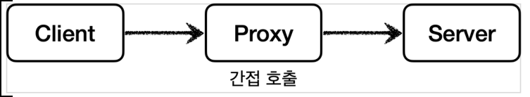

- 클라이언트와 서버 개념에서 일반적으로 클라이언트가 서버를 직접 호출하고, 처리 결과를 직접 받는다. 이것을 직접 호출이라 한다.
- 그런데 클라이언트가 요청한 결과를 서버에 직접 요청하는 것이 아니라 어떤 대리자를 통해서 대신 간접적으로 서버에 요청할 수 있다. 대리자를 영어로 프록시(Proxy)라 한다.

## 프록시의 역할

### 대체 가능

- 서버와 프록시는 같은 인터페이스를 사용해야 한다. 
- 그리고 클라이언트가 사용하는 서버 객체를 프록시 객체로 변경해도 클라이언트 코드를 변경하지 않고 동작할 수 있어야 한다.
  - 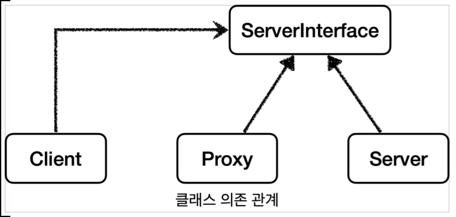

-  런타임(애플리케이션 실행 시점)에 클라이언트 객체에 DI를 사용해서 Client -> Server 에서 Client -> Proxy 로 객체 의존관계를 변경해도 클라이언트 코드를 전혀 변경하지 않아도 된다.
- DI를 사용하면 클라이언트 코드의 변경 없이 유연하게 프록시를 주입할 수 있다.
  - 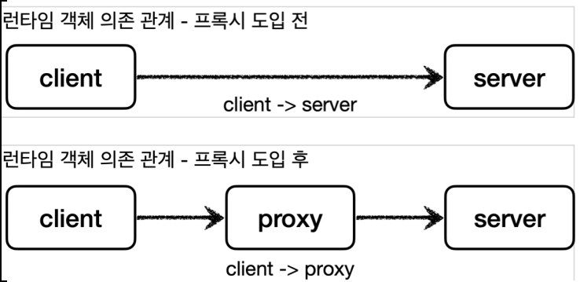

## 프록시의 주요 기능

- 프록시를 통해서 할 수 있는 일은 크게 2가지로 구분할 수 있다.

### 접근 제어

- 권한에 따른 접근 차단 
- 캐싱 
- 지연 로딩

### 부가 기능 추가

- 원래 서버가 제공하는 기능에 더해서 부가 기능을 수행한다. 
- 예) 요청 값이나, 응답 값을 중간에 변형한다. 
- 예) 실행 시간을 측정해서 추가 로그를 남긴다.

## 프록시 패턴 vs 데코레이터 패턴

- 둘다 프록시를 사용하는 방법이지만 GOF 디자인 패턴에서는 이 둘을 의도(intent)에 따라서 프록시 패턴과 데코레이터 패턴으로 구분한다.
- 프록시 패턴: 접근 제어가 목적 
- 데코레이터 패턴: 새로운 기능 추가가 목적

**둘다 프록시를 사용하지만, 의도가 다르다는 점이 핵심이다. 용어가 프록시 패턴이라고 해서 이 패턴만 프록시를 사용하는 것은 아니다. 데코레이터 패턴도 프록시를 사용한다.**

*즉, 프록시와 프록시 패턴은 다른 개념이라고 생각해야 함*

# 5. 프록시 패턴 - 예제 코드1 (src/test)

## 프록시 패턴 적용 전 의존관계

- 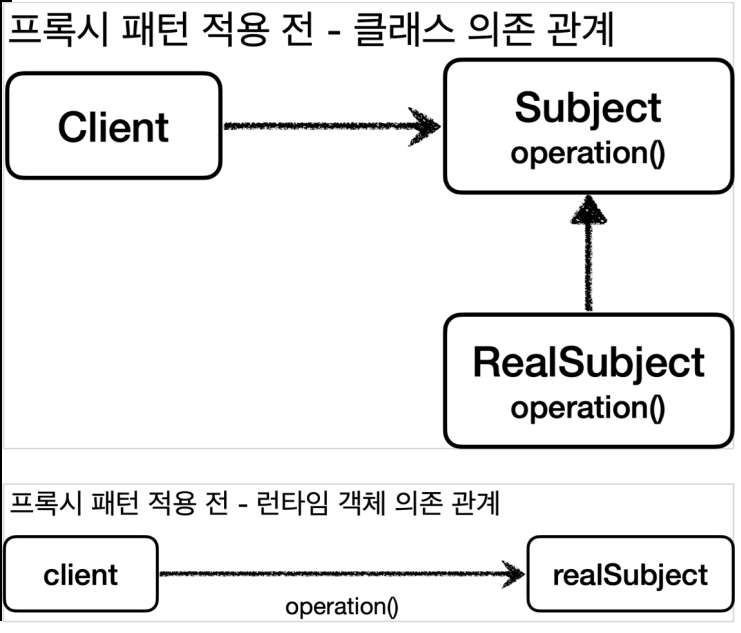

## Subject 인터페이스

- ```java
  package hello.proxy.pureproxy.proxy.code;
  
  public interface Subject {
      String operation();
  }
  ```

## RealSubject

- RealSubject 는 Subject 인터페이스를 구현했다. operation() 은 데이터 조회를 시뮬레이션 하기 위해 1초 쉬도록 했다. 예를 들어서 데이터를 DB나 외부에서 조회하는데 1초가 걸린다고 생각하면 된다. 
- **호출할 때 마다 시스템에 큰 부하를 주는 데이터 조회라고 가정하자**

- ```java
  package hello.proxy.pureproxy.proxy.code;
  
  import lombok.extern.slf4j.Slf4j;
  
  @Slf4j
  public class RealSubject implements Subject{
      @Override
      public String operation() {
          log.info("실제 객체 호출");
          sleep(1000);
          return "data";
      }
  
      private void sleep(int millis) {
          try {
              Thread.sleep(1000);
          } catch (InterruptedException e) {
              e.printStackTrace();
          }
      }
  }
  ```

## ProxyPatternClient

- ```java
  package hello.proxy.pureproxy.proxy.code;
  
  public class ProxyPatternClient {
  
      private Subject subject;
  
      public ProxyPatternClient(Subject subject) {
          this.subject = subject;
      }
  
      public void execute(){
          subject.operation();
      }
  }
  ```

  - Subject 인터페이스에 의존하고, Subject 를 호출하는 클라이언트 코드이다.
  - execute() 를 실행하면 subject.operation() 를 호출한다.

## ProxyPatternTest

- ```java
  package hello.proxy.pureproxy.proxy;
  
  import hello.proxy.pureproxy.proxy.code.ProxyPatternClient;
  import hello.proxy.pureproxy.proxy.code.RealSubject;
  import org.junit.jupiter.api.Test;
  
  public class ProxyPatternTest {
  
      @Test
      void noProxyTest(){
          RealSubject realSubject = new RealSubject();
          ProxyPatternClient client = new ProxyPatternClient(realSubject);
          client.execute();
          client.execute();
          client.execute();
      }
  }
  ```

### 실행 결과

- ```
  RealSubject - 실제 객체 호출
  RealSubject - 실제 객체 호출
  RealSubject - 실제 객체 호출
  ```

- client.execute()을 3번 호출하면 다음과 같이 처리된다.
  1. client -> realSubject 를 호출해서 값을 조회한다. (1초)
  2. client -> realSubject 를 호출해서 값을 조회한다. (1초)
  3. client -> realSubject 를 호출해서 값을 조회한다. (1초)

그런데 이 데이터가 한번 조회하면 변하지 않는 데이터라면 어딘가에 보관해두고 이미 조회한 데이터를 사용하는 것이 성능상 좋다. 이런 것을 캐시라고 한다. 프록시 패턴의 주요 기능은 접근 제어이다. 캐시도 접근 자체를 제어하는 기능 중 하나이다.

# 6. 프록시 패턴 - 예제 코드2 (src/test)

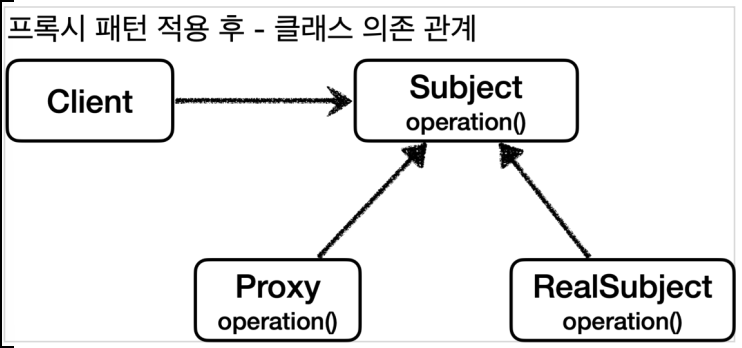

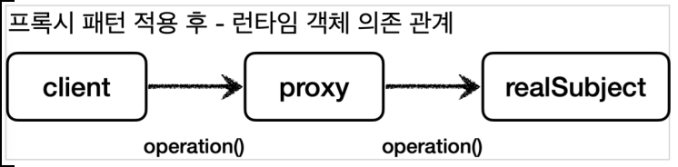

## CacheProxy

- ```java
  package hello.proxy.pureproxy.proxy.code;
  
  import lombok.extern.slf4j.Slf4j;
  
  @Slf4j
  public class CacheProxy implements Subject{
  
      private Subject target;
      private String cacheValue;
  
      public CacheProxy(Subject target) {
          this.target = target;
      }
  
      @Override
      public String operation() {
          log.info("프록시 호출");
          if (cacheValue == null) {
              cacheValue = target.operation();
          }
          return cacheValue;
      }
  }
  ```

  - 앞서 설명한 것 처럼 프록시도 실제 객체와 그 모양이 같아야 하기 때문에 Subject 인터페이스를 구현해야 한다.

- private Subject target : 클라이언트가 프록시를 호출하면 프록시가 최종적으로 실제 객체를 호출해야 한다. 따라서 내부에 실제 객체의 참조를 가지고 있어야 한다. 이렇게 프록시가 호출하는 대상을 target 이라 한다.

- operation() : 구현한 코드를 보면 cacheValue 에 값이 없으면 실제 객체( target )를 호출해서 값을 구한다. 그리고 구한 값을 cacheValue 에 저장하고 반환한다. 만약 cacheValue 에 값이 있으면 실제 객체를 전혀 호출하지 않고, 캐시 값을 그대로 반환한다. 따라서 처음 조회 이후에는 캐시( cacheValue ) 에서 매우 빠르게 데이터를 조회할 수 있다.

## ProxyPatternTest - cacheProxyTest() 추가

- ```java
  package hello.proxy.pureproxy.proxy;
  
  import hello.proxy.pureproxy.proxy.code.CacheProxy;
  import hello.proxy.pureproxy.proxy.code.ProxyPatternClient;
  import hello.proxy.pureproxy.proxy.code.RealSubject;
  import org.junit.jupiter.api.Test;
  
  public class ProxyPatternTest {
      @Test
      void cacheProxyTest(){
  
          RealSubject realSubject = new RealSubject();
          CacheProxy cacheProxy = new CacheProxy(realSubject);
          ProxyPatternClient client = new ProxyPatternClient(cacheProxy);
  
          client.execute();
          client.execute();
          client.execute();
      }
  }
  ```

	1. realSubject 와 cacheProxy 를 생성하고 둘을 연결한다.
	1. 결과적으로 cacheProxy 가 realSubject 를 참조하는 런타임 객체 의존관계가 완성된다. 
	1. 마지막으로 client 에 realSubject 가 아닌 cacheProxy 를 주입한다.
	1. 이 과정을 통해서 client -> cacheProxy -> realSubject 런타임 객체 의존 관계가 완성된다.

### 실행결과

```
CacheProxy - 프록시 호출
RealSubject - 실제 객체 호출
CacheProxy - 프록시 호출
CacheProxy - 프록시 호출
```

## 실행 흐름

1. client의 cacheProxy 호출 (client.operation())
2. cacheValue == null 이므로  realSubject를 호출하여 `target.operation();` 실행 (실제 DB 확인)
3. client의 cacheProxy 호출 (client.operation())
4. cacheValue == "data" 이므로 cacheValue 를 그대로 반환 (proxy 캐시 확인)
5. client의 cacheProxy 호출 (client.operation())
6. cacheValue == "data" 이므로 cacheValue 를 그대로 반환 (proxy 캐시 확인)

**결과적으로 캐시 프록시를 도입하기 전에는 3초가 걸렸지만, 캐시 프록시 도입 이후에는 최초에 한번만 1 초가 걸리고, 이후에는 거의 즉시 반환한다.**

# 7. 데코레이터 패턴 - 예제 코드1 (src/test)

## 데코레이터 패턴 적용 전 의존관계

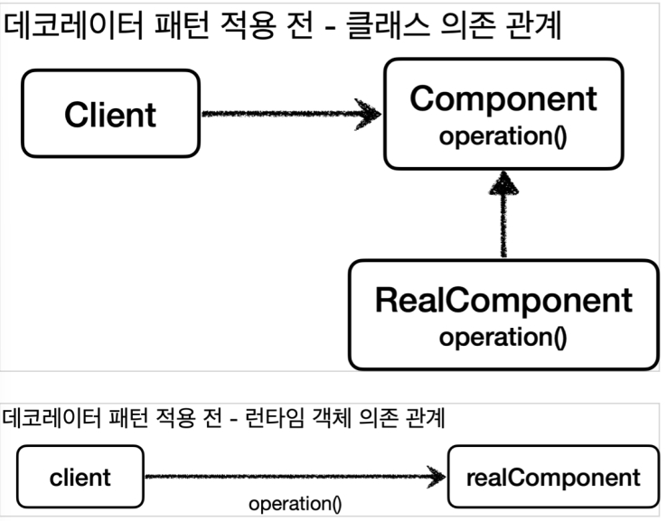

## Component 인터페이스

- ```java
  package hello.proxy.pureproxy.decorator.code;
  
  public interface Component {
      String operation();
  }
  ```

## RealComponent

- RealComponent 는 Component 인터페이스를 구현한다.

- ```java
  package hello.proxy.pureproxy.decorator.code;
  
  import lombok.extern.slf4j.Slf4j;
  
  @Slf4j
  public class RealComponent implements Component{
      @Override
      public String operation() {
          log.info("RealComoponent 실행");
          return "data";
      }
  }
  ```

- operation() : 단순히 로그를 남기고 "data" 문자를 반환한다.

## DecoratorPatternClient

- ```java
  package hello.proxy.pureproxy.decorator.code;
  
  import lombok.extern.slf4j.Slf4j;
  
  @Slf4j
  public class DecoratorPatternClient {
  
      private Component component;
  
      public DecoratorPatternClient(Component component) {
          this.component = component;
      }
  
      public void execute() {
          String result = component.operation();
          log.info("result={}", result);
      }
  }
  ```

- 클라이언트 코드는 단순히 Component 인터페이스를 의존한다.
- execute() 를 실행하면 component.operation() 을 호출하고, 그 결과를 출력한다.

## DecoratorPatternTest

- ```java
  package hello.proxy.pureproxy.decorator;
  
  import hello.proxy.pureproxy.decorator.code.Component;
  import hello.proxy.pureproxy.decorator.code.DecoratorPatternClient;
  import hello.proxy.pureproxy.decorator.code.RealComponent;
  import lombok.extern.slf4j.Slf4j;
  import org.junit.jupiter.api.Test;
  
  @Slf4j
  public class DecoratorPatternTest {
  
      @Test
      void noDecorator(){
          Component realComponent = new RealComponent();
          DecoratorPatternClient client = new DecoratorPatternClient(realComponent);
          client.execute();
      }
  }
  ```

  - 테스트 코드는 client -> realComponent 의 의존관계를 설정하고, client.execute() 를 호출한다.

### 실행결과

```
RealComponent - RealComponent 실행
DecoratorPatternClient - result=data
```

# 8. 데코레이터 패턴 - 예제 코드2 (src/test)

### 부가 기능 추가

- 이번에는 프록시를 활용해서 부가 기능을 추가해보자. 이렇게 프록시로 부가 기능을 추가하는 것을 데코레이터 패턴이라 한다.

데코레이터 패턴: 원래 서버가 제공하는 기능에 더해서 부가 기능을 수행한다.

- 예) 요청 값이나, 응답 값을 중간에 변형한다. 
- 예) 실행 시간을 측정해서 추가 로그를 남긴다.

## 응답 값을 꾸며주는 데코레이터

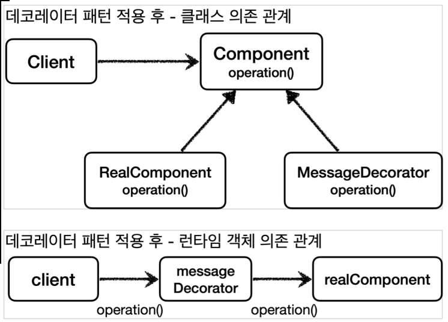

## MessageDecorator

- MessageDecorator 는 Component 인터페이스를 구현한다.
- 프록시가 호출해야 하는 대상을 component 에 저장한다.

- ```java
  package hello.proxy.pureproxy.decorator.code;
  
  import lombok.extern.slf4j.Slf4j;
  import org.mockito.ScopedMock;
  
  @Slf4j
  public class MessageDecorator implements Component {
  
      private Component component;
  
      public MessageDecorator(Component component) {
          this.component = component;
      }
  
      @Override
      public String operation() {
          log.info("MessageDecorator 실행");
          //data --> *****data*****
          String result = component.operation();
          String decoResult = "*****" + result + "*****";
          log.info("MessageDecorator 꾸미기 적용 전 ={}, 적용 후={}", result, decoResult);
          return decoResult;
      }
  }
  ```

  - operation() 을 호출하면 프록시와 연결된 대상을 호출( component.operation()) 하고, 그 응답 값에 ***** 을 더해서 꾸며준 다음 반환한다. 

## DecoratorPatternTest - 추가

- ```java
  package hello.proxy.pureproxy.decorator;
  
  import hello.proxy.pureproxy.decorator.code.Component;
  import hello.proxy.pureproxy.decorator.code.DecoratorPatternClient;
  import hello.proxy.pureproxy.decorator.code.MessageDecorator;
  import hello.proxy.pureproxy.decorator.code.RealComponent;
  import lombok.extern.slf4j.Slf4j;
  import org.junit.jupiter.api.Test;
  
  @Slf4j
  public class DecoratorPatternTest {
  
      @Test
      void Decorator1() {
          Component realComponent = new RealComponent();
          Component messageDecorator = new MessageDecorator(realComponent);
          DecoratorPatternClient client = new DecoratorPatternClient(messageDecorator);
  
          client.execute();
      }
  }
  ```

### 실행 결과

```
MessageDecorator - MessageDecorator 실행
RealComponent - RealComponent 실행
MessageDecorator - MessageDecorator 꾸미기 적용 전=data, 적용 후=*****data*****
DecoratorPatternClient - result=*****data*****
```

- 실행 결과를 보면 MessageDecorator 가 RealComponent 를 호출하고 반환한 응답 메시지를 꾸며서 반환한 것을 확인할 수 있다.

# 9. 데코레이터 패턴 - 예제 코드3 (src/test)

- 이번에는 기존 데코레이터에 더해서 실행 시간을 측정하는 기능까지 추가해보자.

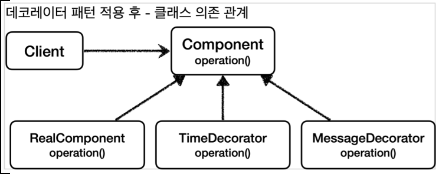

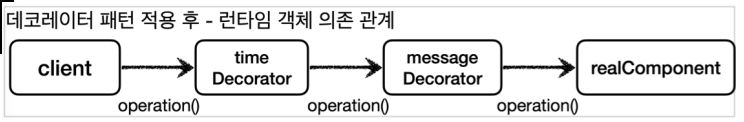

## TimeDecorator

- ```java
  package hello.proxy.pureproxy.decorator.code;
  
  import lombok.extern.slf4j.Slf4j;
  
  @Slf4j
  public class TimeDecorator implements Component{
  
      private Component component;
  
      public TimeDecorator(Component component) {
          this.component = component;
      }
  
      @Override
      public String operation() {
          log.info("TimeDecorator 실행");
  
          long startTime = System.currentTimeMillis();
          String result = component.operation();
          long endTime = System.currentTimeMillis();
  
          long resultTime = endTime - startTime;
  
          log.info("TimeDecorator 종료 resultTime={}ms", resultTime);
          return result;
      }
  }
  ```

## DecoratorPatternTest - 추가

- ```java
  package hello.proxy.pureproxy.decorator;
  
  import hello.proxy.pureproxy.decorator.code.*;
  import lombok.extern.slf4j.Slf4j;
  import org.junit.jupiter.api.Test;
  
  @Slf4j
  public class DecoratorPatternTest {
  
      @Test
      void Decorator2() {
          Component realComponent = new RealComponent();
          Component messageDecorator = new MessageDecorator(realComponent);
          TimeDecorator timeDecorator = new TimeDecorator(messageDecorator);
          DecoratorPatternClient client = new DecoratorPatternClient(timeDecorator);
  
          client.execute();
      }
  }
  ```

  - client -> timeDecorator -> messageDecorator -> realComponent 의 객체 의존관계를 설정하고, 실행한다.

### 실행 결과

```
TimeDecorator 실행
MessageDecorator 실행
RealComponent 실행
MessageDecorator 꾸미기 적용 전=data, 적용 후=*****data*****
TimeDecorator 종료 resultTime=7ms
result=*****data*****
```

# 10. 인터페이스 기반 프록시 - 적용

- 인터페이스와 구현체가 있는 V1 App에 지금까지 학습한 프록시를 도입해서 LogTrace 를 사용해보자.

## 의존관계 확인

### V1 기본 클래스 의존 관계 / V1 런타임 객체 의존 관계

- 
- 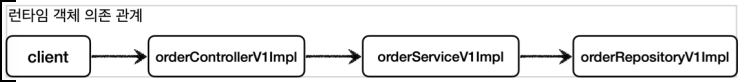

### V1 프록시 의존 관계 추가

- 리포지토리는 생략했다.

- 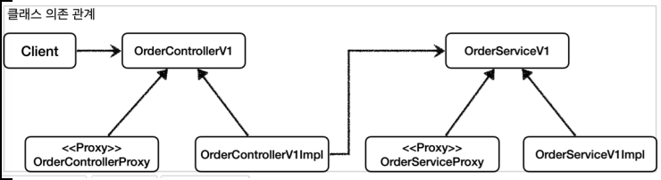
- 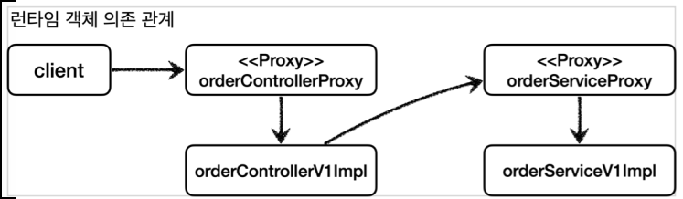

## OrderRepositoryInterfaceProxy

- ```java
  package hello.proxy.config.v1_proxy.interface_proxy;
  
  import hello.proxy.app.v1.OrderRepositoryV1;
  import hello.proxy.trace.TraceStatus;
  import hello.proxy.trace.logtrace.LogTrace;
  import lombok.RequiredArgsConstructor;
  
  @RequiredArgsConstructor
  public class OrderRepositoryInterfaceProxy implements OrderRepositoryV1 {
  
      //실제 구현해주는 target
      private final OrderRepositoryV1 target;
      //log 출력을 위해 주입
      private final LogTrace logTrace;
  
      @Override
      public void save(String itemId) {
          TraceStatus status = null;
          try{
              status = logTrace.begin("OrderRepository.request()");
              //target 호출
              target.save(itemId);
              logTrace.end(status);
          }catch(Exception e){
              logTrace.exception(status, e);
              throw e;
          }
      }
  }
  ```

  - OrderRepositoryV1 target : 프록시가 실제 호출할 원본 리포지토리의 참조를 가지고 있어야 한다.

## OrderServiceInterfaceProxy

- repository 와 같음

- ```java
  package hello.proxy.config.v1_proxy.interface_proxy;
  
  import hello.proxy.app.v1.OrderServiceV1;
  import hello.proxy.trace.TraceStatus;
  import hello.proxy.trace.logtrace.LogTrace;
  import lombok.RequiredArgsConstructor;
  
  @RequiredArgsConstructor
  public class OrderServiceInterfaceProxy implements OrderServiceV1 {
  
      private final OrderServiceV1 target;
      private final LogTrace logTrace;
  
      @Override
      public void orderItem(String itemId) {
          TraceStatus status = null;
          try{
              status = logTrace.begin("OrderService.reqeust()");
              target.orderItem(itemId);
              logTrace.end(status);
          }catch (Exception e){
              logTrace.exception(status, e);
              throw e;
          }
      }
  }
  ```

## OrderControllerInterfaceProxy

- ```java
  package hello.proxy.config.v1_proxy.interface_proxy;
  
  import hello.proxy.app.v1.OrderControllerV1;
  import hello.proxy.app.v1.OrderServiceV1;
  import hello.proxy.trace.TraceStatus;
  import hello.proxy.trace.logtrace.LogTrace;
  import lombok.RequiredArgsConstructor;
  
  @RequiredArgsConstructor
  public class OrderControllerInterfaceProxy implements OrderControllerV1 {
  
      private final OrderControllerV1 target;
      private final LogTrace logTrace;
  
      @Override
      public String request(String itemId) {
          TraceStatus status = null;
  
          try{
              status = logTrace.begin("OrderController.request()");
              String result = target.request(itemId);
              logTrace.end(status);
              return result;
          }catch (Exception e){
              logTrace.exception(status, e);
              throw e;
          }
      }
  
      @Override
      public String noLog() {
          return target.noLog();
      }
  }
  ```

- noLog() 메서드는 로그를 남기지 않아야 한다. 따라서 별도의 로직 없이 단순히 target 을 호출하면 된다.

## InterfaceProxyConfig

- 

- ```java
  package hello.proxy.config.v1_proxy;
  
  import hello.proxy.app.v1.*;
  import hello.proxy.config.v1_proxy.interface_proxy.OrderControllerInterfaceProxy;
  import hello.proxy.config.v1_proxy.interface_proxy.OrderRepositoryInterfaceProxy;
  import hello.proxy.config.v1_proxy.interface_proxy.OrderServiceInterfaceProxy;
  import hello.proxy.trace.logtrace.LogTrace;
  import org.springframework.context.annotation.Bean;
  import org.springframework.context.annotation.Configuration;
  
  @Configuration
  public class InterfaceProxyConfig {
      
      @Bean
      public OrderControllerV1 orderController(LogTrace logTrace){
          OrderControllerV1Impl controllerImpl = new OrderControllerV1Impl(orderService(logTrace));
          return new OrderControllerInterfaceProxy(controllerImpl, logTrace);
      }
  
      @Bean
      public OrderServiceV1 orderService(LogTrace logTrace){
          OrderServiceV1Impl serviceImpl = new OrderServiceV1Impl(orderRepository(logTrace));
          return new OrderServiceInterfaceProxy(serviceImpl, logTrace);
      }
  
      @Bean
      public OrderRepositoryV1 orderRepository(LogTrace logTrace){
          OrderRepositoryV1Impl repositoryImpl = new OrderRepositoryV1Impl();
          return new OrderRepositoryInterfaceProxy(repositoryImpl, logTrace);
      }
  }
  ```

- LogTrace 는 ProxyApplication 에 등록할 예정

### V1 프록시 런타임 객체 의존 관계 설정

- 각 프록시클래스가 반환된다. 이 때 실제 구현체와 logTrace 를 주입받는다.
- 실제 구현체는 new 로 선언되어야 한다.
- 이를 통해 프록시를 실제 스프링 빈 대신 등록한다. 실제 객체는 스프링 빈으로 등록하지 않는다.
- 실제 객체가 스프링 빈으로 등록되지 않는다고 해서 사라지는 것은 아니다. 프록시 객체가 실제 객체를 참조하기 때문에 프록시를 통해서 실제 객체를 호출할 수 있다. 쉽게 이야기해서 프록시 객체 안에 실제 객체가 있는 것이다.

## 스프링 빈에 등록된 모양

- 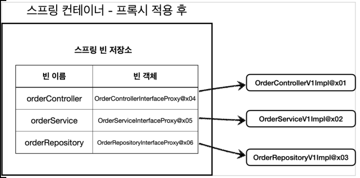

- InterfaceProxyConfig 를 통해 프록시를 적용한 후 스프링 컨테이너에 프록시 객체가 등록된다. 스프링 컨테이너는 이제 실제 객체가 아니라 프록시 객체를 스프링 빈으로 관리한다
- 이제 실제 객체는 스프링 컨테이너와는 상관이 없다. 실제 객체는 프록시 객체를 통해서 참조될 뿐이다.
- 프록시 객체는 스프링 컨테이너가 관리하고 자바 힙 메모리에도 올라간다. 반면에 실제 객체는 자바 힙 메모리에는 올라가지만 스프링 컨테이너가 관리하지는 않는다.

## 런타임 객체 의존 관계

- 리포지토리 생략
- 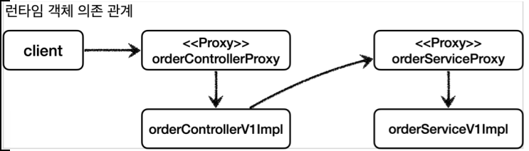

## ProxyApplication

- ```java
  package hello.proxy;
  
  import hello.proxy.config.AppV1Config;
  import hello.proxy.config.AppV2Config;
  import hello.proxy.config.v1_proxy.InterfaceProxyConfig;
  import hello.proxy.trace.logtrace.LogTrace;
  import hello.proxy.trace.logtrace.ThreadLocalLogTrace;
  import org.springframework.boot.SpringApplication;
  import org.springframework.boot.autoconfigure.SpringBootApplication;
  import org.springframework.context.annotation.Bean;
  import org.springframework.context.annotation.Import;
  
  //@Import({AppV1Config.class, AppV2Config.class})
  @Import(InterfaceProxyConfig.class)
  @SpringBootApplication(scanBasePackages = "hello.proxy.app") //주의
  public class ProxyApplication {
  
  	public static void main(String[] args) {
  		SpringApplication.run(ProxyApplication.class, args);
  	}
  
  	@Bean
  	public LogTrace logTrace(){
  		return new ThreadLocalLogTrace();
  	}
  }
  ```

- import InterfaceProxyConfig 

- LogTrace 빈 등

## 실행 결과 - 로그

```
[65b39db2] OrderController.request()
[65b39db2] |-->OrderService.orderItem()
[65b39db2] | |-->OrderRepository.save()
[65b39db2] | |<--OrderRepository.save() time=1002ms
[65b39db2] |<--OrderService.orderItem() time=1002ms
[65b39db2] OrderController.request() time=1003ms
```


# 11. 구체 클래스 기반 프록시 - 예제1 (src/test)

- 다음에 보이는 ConcreteLogic 은 인터페이스가 없고 구체 클래스만 있다. 이렇게 인터페이스가 없어도 프록시를 적용할 수 있을까? 
- 먼저 프록시를 도입하기 전에 기본 코드를 작성해보자.

## ConcreteLogic

- ```java
  package hello.proxy.pureproxy.concreteproxy.code;
  
  import lombok.extern.slf4j.Slf4j;
  
  @Slf4j
  public class ConcreteLogic {
  
      public String operation(){
          log.info("concreteLogic 실행");
          return "data";
      }
  }
  ```

  - ConcreteLogic 은 인터페이스가 없고, 구체 클래스만 있다. 여기에 프록시를 도입해야 한다.

## ConcreteClient

- ConcreteLogic 을 의존한다.

- ```java
  package hello.proxy.pureproxy.concreteproxy.code;
  
  public class ConcreteClient {
  
      private ConcreteLogic concreteLogic;
  
      public ConcreteClient(ConcreteLogic concreteLogic) {
          this.concreteLogic = concreteLogic;
      }
  
      public void execute(){
          concreteLogic.operation();
      }
  }
  ```

## ConcreteProxyTest

- ```java
  package hello.proxy.pureproxy.concreteproxy;
  
  import hello.proxy.pureproxy.concreteproxy.code.ConcreteClient;
  import hello.proxy.pureproxy.concreteproxy.code.ConcreteLogic;
  import org.junit.jupiter.api.Test;
  
  public class ConcreteProxyTest {
  
      @Test
      void noProxy() {
          ConcreteLogic concreteLogic = new ConcreteLogic();
          ConcreteClient client = new ConcreteClient(concreteLogic);
          client.execute();
      }
  }
  ```

  

# 12. 구체 클래스 기반 프록시 - 예제2 (src/test)

- 클래스 기반 프록시 도입 : 자바의 다형성은 인터페이스를 구현하든, 아니면 클래스를 상속하든 상위 타입만 맞으면 다형성이 적용된다. 쉽게 이야기해서 인터페이스가 없어도 프록시를 만들수 있다는 뜻이다.
- 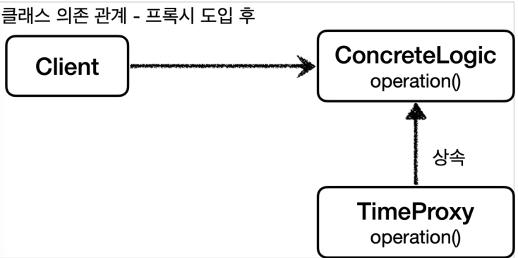
- 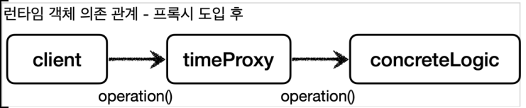

## TimeProxy

- TimeProxy 프록시는 시간을 측정하는 부가 기능을 제공한다. 그리고 인터페이스가 아니라 클래스인 ConcreteLogic 를 상속 받아서 만든다.

- ```java
  package hello.proxy.pureproxy.concreteproxy.code;
  
  import lombok.extern.slf4j.Slf4j;
  
  @Slf4j
  public class TimeProxy extends ConcreteLogic{
  
      private ConcreteLogic concreteLogic;
  
      public TimeProxy(ConcreteLogic concreteLogic) {
          this.concreteLogic = concreteLogic;
      }
  
      @Override
      public String operation() {
          log.info("TImeDecorator 실행");
  
          long startTime = System.currentTimeMillis();
          String result = concreteLogic.operation();
          long endTime = System.currentTimeMillis();
  
          long resultTime = endTime - startTime;
  
          log.info("TimeDecorator 종료 resultTime={}ms", resultTime);
          return result;
      }
  }
  ```

## ConcreteProxyTest - addProxy() 추가

- ```java
  package hello.proxy.pureproxy.concreteproxy;
  
  import hello.proxy.pureproxy.concreteproxy.code.ConcreteClient;
  import hello.proxy.pureproxy.concreteproxy.code.ConcreteLogic;
  import hello.proxy.pureproxy.concreteproxy.code.TimeProxy;
  import hello.proxy.pureproxy.decorator.code.TimeDecorator;
  import org.junit.jupiter.api.Test;
  
  public class ConcreteProxyTest {
  
      @Test
      void addProxy() {
          ConcreteLogic concreteLogic = new ConcreteLogic();
          TimeProxy timeProxy = new TimeProxy(concreteLogic);
          ConcreteClient client = new ConcreteClient(timeProxy);
  
          client.execute();
      }
  }
  
  ```

- ConcreteClient 는  TimeProxy timeProxy 주입받는다. (TimeProxy 는 ConcreteLogic 의 자식클래스)

- TimeProxy 는  ConcreteLogic concreteLogic 를 주입받는다. (실제 Target)

### 실행 결과

- ```
  TimeDecorator 실행
  ConcreteLogic 실행
  TimeDecorator 종료 resultTime=1
  ```

  

> 참고: 자바 언어에서 다형성은 인터페이스나 클래스를 구분하지 않고 모두 적용된다. 해당 타입과 그 타입의 하위 타입은 모두 다형성의 대상이 된다. (자바 기본문법)

# 13. 구체 클래스 기반 프록시 - 적용

- 이번에는 앞서 학습한 내용을 기반으로 구체 클래스만 있는 V2 애플리케이션에 프록시 기능을 적용해보자.

## OrderRepositoryConcreteProxy

- 인터페이스가 아닌 OrderRepositoryV2 클래스를 상속 받아서 프록시를 만든다.

- ```java
  package hello.proxy.config.v1_proxy.interface_proxy;
  
  import hello.proxy.app.v1.OrderRepositoryV1;
  import hello.proxy.trace.TraceStatus;
  import hello.proxy.trace.logtrace.LogTrace;
  import lombok.RequiredArgsConstructor;
  
  @RequiredArgsConstructor
  public class OrderRepositoryInterfaceProxy implements OrderRepositoryV1 {
  
      private final OrderRepositoryV1 target;
      private final LogTrace logTrace;
  
      @Override
      public void save(String itemId) {
          TraceStatus status = null;
          try{
              status = logTrace.begin("OrderRepository.request()");
              //target 호출
              target.save(itemId);
              logTrace.end(status);
          }catch(Exception e){
              logTrace.exception(status, e);
              throw e;
          }
      }
  }
  ```

## OrderServiceConcreteProxy

- ```java
  package hello.proxy.config.v1_proxy.interface_proxy;
  
  import hello.proxy.app.v1.OrderServiceV1;
  import hello.proxy.trace.TraceStatus;
  import hello.proxy.trace.logtrace.LogTrace;
  import lombok.RequiredArgsConstructor;
  
  @RequiredArgsConstructor
  public class OrderServiceInterfaceProxy implements OrderServiceV1 {
  
      private final OrderServiceV1 target;
      private final LogTrace logTrace;
  
      @Override
      public void orderItem(String itemId) {
          TraceStatus status = null;
          try{
              status = logTrace.begin("OrderService.reqeust()");
              target.orderItem(itemId);
              logTrace.end(status);
          }catch (Exception e){
              logTrace.exception(status, e);
              throw e;
          }
      }
  }
  ```

### 클래스 기반 프록시의 단점

- super(null) : OrderServiceV2 : 자바 기본 문법에 의해 자식 클래스를 생성할 때는 항상 super() 로 부모 클래스의 생성자를 호출해야 한다.
  - 이 부분을 생략하면 기본 생성자가 호출된다.
  - 그런데 부모 클래스인 OrderServiceV2 는 기본 생성자가 없고, 생성자에서 파라미터 1개를 필수로 받는다. 따라서 파라미터를 넣어서 super(..) 를 호출해야 한다.
- 프록시는 부모 객체의 기능을 사용하지 않기 때문에 super(null) 을 입력해도 된다.

##  OrderControllerConcreteProxy

- ```java
  package hello.proxy.config.v1_proxy.interface_proxy;
  
  import hello.proxy.app.v1.OrderControllerV1;
  import hello.proxy.app.v1.OrderServiceV1;
  import hello.proxy.trace.TraceStatus;
  import hello.proxy.trace.logtrace.LogTrace;
  import lombok.RequiredArgsConstructor;
  
  @RequiredArgsConstructor
  public class OrderControllerInterfaceProxy implements OrderControllerV1 {
  
      private final OrderControllerV1 target;
      private final LogTrace logTrace;
  
      @Override
      public String request(String itemId) {
          TraceStatus status = null;
  
          try{
              status = logTrace.begin("OrderController.request()");
              String result = target.request(itemId);
              logTrace.end(status);
              return result;
          }catch (Exception e){
              logTrace.exception(status, e);
              throw e;
          }
      }
  
      @Override
      public String noLog() {
          return target.noLog();
      }
  }
  ```

## ConcreteProxyConfig

- ```java
  package hello.proxy.config.v1_proxy;
  
  import hello.proxy.app.v2.OrderControllerV2;
  import hello.proxy.app.v2.OrderRepositoryV2;
  import hello.proxy.app.v2.OrderServiceV2;
  import hello.proxy.config.v1_proxy.concrete_proxy.OrderControllerConcreteProxy;
  import hello.proxy.config.v1_proxy.concrete_proxy.OrderRepositoryConcreteProxy;
  import hello.proxy.config.v1_proxy.concrete_proxy.OrderServiceConcreteProxy;
  import hello.proxy.trace.logtrace.LogTrace;
  import org.springframework.context.annotation.Bean;
  import org.springframework.context.annotation.Configuration;
  
  @Configuration
  public class ConcreteProxyConfig {
  
      @Bean
      public OrderControllerV2 orderControllerV2(LogTrace logTrace) {
          OrderControllerV2 controllerImpl = new OrderControllerV2(orderServiceV2(logTrace));
          return new OrderControllerConcreteProxy(controllerImpl, logTrace);
      }
  
      @Bean
      public OrderServiceV2 orderServiceV2(LogTrace logTrace){
          OrderServiceV2 serviceImpl = new OrderServiceV2(orderRepositoryV2(logTrace));
          return new OrderServiceConcreteProxy(serviceImpl, logTrace);
      }
  
      @Bean
      public OrderRepositoryV2 orderRepositoryV2(LogTrace logTrace){
          OrderRepositoryV2 repositoryImpl = new OrderRepositoryV2();
          return new OrderRepositoryConcreteProxy(repositoryImpl, logTrace);
      }
  }
  ```

## ProxyApplication

- `@Import(ConcreteProxyConfig.class)`

## 실행

- 실행 : `http://localhost:8080/v2/request?itemId=hello`
- 특 x

# 14. 인터페이스 기반 프록시와 클래스 기반 프록시

- 인터페이스가 없어도 클래스 기반으로 프록시를 생성할 수 있다. 
- 클래스 기반 프록시는 해당 클래스에만 적용할 수 있다. 인터페이스 기반 프록시는 인터페이스만 같으면 모든 곳에 적용할 수 있다.
- 클래스 기반 프록시는 상속을 사용하기 때문에 몇가지 제약이 있다.
  - 부모 클래스의 생성자를 호출해야 한다.(앞서 본 예제) 
  - 클래스에 final 키워드가 붙으면 상속이 불가능하다. 
  - 메서드에 final 키워드가 붙으면 해당 메서드를 오버라이딩 할 수 없다.

이렇게 보면 인터페이스 기반의 프록시가 더 좋아보인다. 맞다. 인터페이스 기반의 프록시는 상속이라는 제약에서 자유롭다. 프로그래밍 관점에서도 인터페이스를 사용하는 것이 역할과 구현을 명확하게 나누기 때문에 더 좋다. 인터페이스 기반 프록시의 단점은 인터페이스가 필요하다는 그 자체이다. 인터페이스가 없으면 인터페이스 기반 프록시를 만들 수 없다.

이론적으로는 모든 객체에 인터페이스를 도입해서 역할과 구현을 나누는 것이 좋다. 이렇게 하면 역할과 구현을 나누어서 구현체를 매우 편리하게 변경할 수 있다. 하지만 실제로는 구현을 거의 변경할 일이 없는 클래스도 많다. 인터페이스를 도입하는 것은 구현을 변경할 가능성이 있을 때 효과적인데, 구현을 변경할 가능성이 거의 없는 코드에 무작정 인터페이스를 사용하는 것은 번거롭고 그렇게 실용적이지 않다. 이런곳에는 실용적인 관점에서 인터페이스를 사용하지 않고 구체 클래스를 바로 사용하는 것이 좋다 생각한다. (물론 인터페이스를 도입하는 다양한 이유가 있다. 여기서 핵심은 인터페이스가 항상 필요하지는 않다는 것이다.)

### 결론

실무에서는 프록시를 적용할 때 V1처럼 인터페이스도 있고, V2처럼 구체 클래스도 있다. 따라서 2가지 상황을 모두 대응할 수 있어야 한다.

### 남은 문제점

- 너무 많은 프록시 클래스
  - 잘 보면 프록시 클래스가 하는 일은 LogTrace 를 사용하는 것인데, 그 로직이 모두 똑같다. 대상 클래스만 다를 뿐이다. 만약 적용해야 하는 대상 클래스가 100개라면 프록시 클래스도 100개를 만들어야한다
- 해결 : 동적 프록시 기술