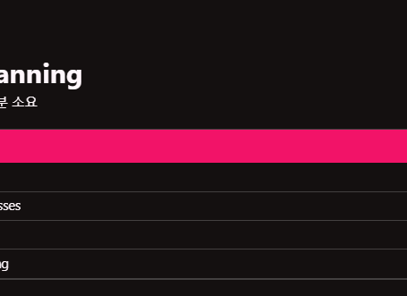

# 컴포넌트 스캐닝이란 뭘까?



- 요약하자면 스프링 내부에서 알아서 스캔해서 경로를 정리해준다.

- 하지만 어떻게?

## Scanning for Component Classes

- Spring will scan yout Java classes for special annotations
  
  - @Component, etc...

- Automatically register the beans in the Spring container

## Annotations

- @SpringBootApplication is composed of the following annotations:
  
  

- Behind the scenes ...
  
  - Creates application context and registers all beans
  
  - Starts the embedded server Tomcat etc...

## More on Component Scanning

- By default, Spring Boot starts component scanning
  
  - From same package as your main Spring Boot application
  
  - Also scans sub-packages recursively

- This implicitly defines a base search package
  
  - Allows you to leverage default component scanning
  
  - No need to explicitly reference the base package name
  
  
  
  - 요약- >기본적으로 같은 패키지에서 스캔후 자동적으로 다른 패키지들도 알아서 스캔함
  
  
  
  - 하지만 위에 그림처럼 위치가 다르면 안됨
  
  - 디폴트로는 메인 어플리케이션 클래스랑 섭 페키지만 스캔함

- Default scanning is fine if everything is under
  
  - com.luv2code.springdemo

- But what about my other packages?
  
  - com.luv2code.util
  
  - org.acme.dcart
  
  - edu.cmu.srs

```java
package com.luv2code.springdemo;

@SpringBootApplication(
    scanBasePackages = {
        "com.luv2code.springdemo",
        "com.luv2code.util",
        "org.acme.dcart",
        "edu.cmu.srs"
} // 이렇게 처리해주면 됨
)
```


- scanBasePackages = {"중괄호"} 
