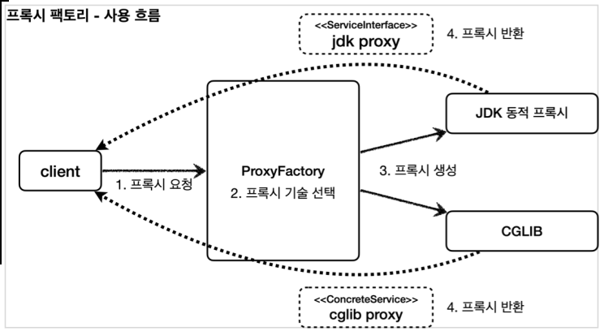
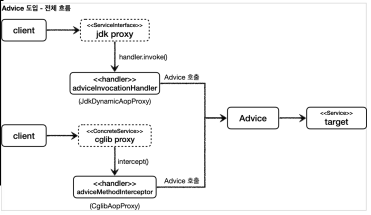
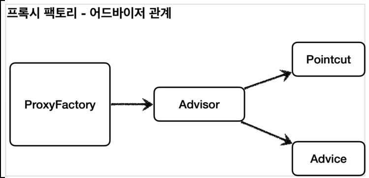
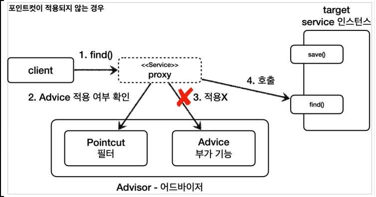
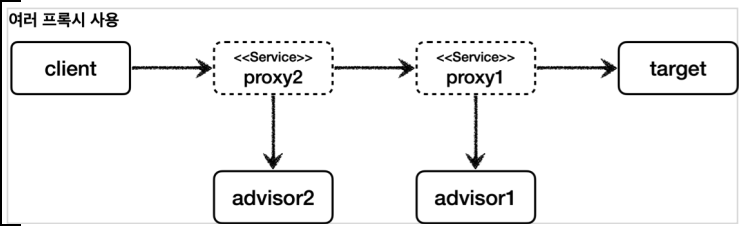
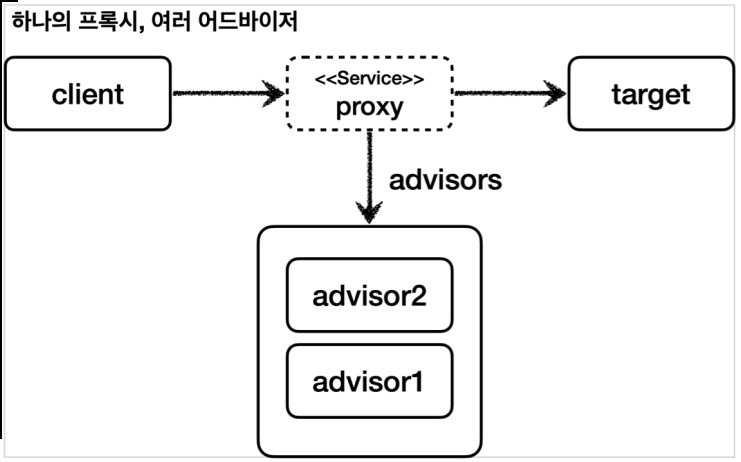

# 0. 프록시 팩토리 - 소개

## 동적 프록시(JDK, CGLIB) 의 문제점

- 인터페이스가 있는 경우에는 JDK 동적 프록시를 적용하고, 그렇지 않은 경우에는 CGLIB를 적용하기 위해 중복 관리해야 한다.
- 기술을 함께 사용할 때 부가 기능을 제공하기 위해 JDK 동적 프록시가 제공하는 InvocationHandler 와 CGLIB가 제공하는 MethodInterceptor 를 각각 중복으로 만들어서 관리해야 한다.

## 프록시 팩토리

- 스프링은 유사한 구체적인 기술들이 있을 때, 그것들을 통합해서 일관성 있게 접근할 수 있고, 더욱 편리하게 사용할 수 있는 추상화된 기술을 제공한다. 스프링은 동적 프록시를 통합해서 편리하게 만들어주는 프록시 팩토리( ProxyFactory )라는 기능을 제공한다.
- 프록시 팩토리는 인터페이스가 있으면 JDK 동적 프록시를 사용하고, 구체 클래스만 있다면 CGLIB를 사용한다. 그리고 이 설정을 변경할 수도 있다.
- 

### Q: 두 기술을 함께 사용할 때 부가 기능을 적용하기 위해 JDK 동적 프록시가 제공하는 InvocationHandler와 CGLIB가 제공하는 MethodInterceptor를 각각 중복으로 따로 만들어야 할까? 

- 스프링은 이 문제를 해결하기 위해 부가 기능을 적용할 때 Advice 라는 새로운 개념을 도입했다. 개발자는 InvocationHandler 나 MethodInterceptor 를 신경쓰지 않고, Advice 만 만들면 된다. 결과적으로 InvocationHandler 나 MethodInterceptor 는 Advice 를 호출하게 된다. 프록시 팩토리를 사용하면 Advice 를 호출하는 전용 InvocationHandler , MethodInterceptor 를 내부에서 사용한다.
- 

# 1. 프록시 팩토리 - 예제 코드1 (src/test)

## Advice 만들기

- Advice 는 프록시에 적용하는 부가 기능 로직이다. 이것은 JDK 동적 프록시가 제공하는 InvocationHandler 와 CGLIB가 제공하는 MethodInterceptor 의 개념과 유사한다. 둘을 개념적으로 추상화 한 것이다. 프록시 팩토리를 사용하면 둘 대신에 Advice 를 사용하면 된다.
- Advice 를 만드는 방법은 여러가지가 있지만, 기본적인 방법은 다음 인터페이스를 구현하면 된다.

## MethodInterceptor - 스프링이 제공하는 코드

- ```java
  package org.aopalliance.intercept;
  
  public interface MethodInterceptor extends Interceptor {
  	Object invoke(MethodInvocation invocation) throws Throwable;
  }
  ```

  - MethodInvocation invocation : 내부에는 다음 메서드를 호출하는 방법, 현재 프록시 객체 인스턴스, args , 메서드 정보 등이 포함되어 있다. 기존에 파라미터로 제공되는 부분들이 이 안으로 모두 들어갔다고 생각하면 된다.

- CGLIB의 MethodInterceptor 와 이름이 같으므로 패키지 이름에 주의하자 
  - 참고로 여기서 사용하는 org.aopalliance.intercept 패키지는 스프링 AOP 모듈( spring-aop ) 안에 들어있다

## TimeAdvice 

- TimeAdvice 는 앞서 설명한 MethodInterceptor 인터페이스를 구현한다. 패키지 이름에 주의하자.

- ```java
  package hello.proxy.common.advice;
  
  import lombok.extern.slf4j.Slf4j;
  import org.aopalliance.intercept.MethodInterceptor;
  import org.aopalliance.intercept.MethodInvocation;
  
  @Slf4j
  public class TimeAdvice implements MethodInterceptor {
      @Override
      public Object invoke(MethodInvocation invocation) throws Throwable {
          log.info("TimeProxy 실행");
          long startTime = System.currentTimeMillis();
  
          //invocation.proceed() 를 호출하면 target 클래스를 호출하고 그 결과를 받는다.
          //target 클래스의 정보는 MethodInvocation invocation 안에 모두 포함되어 있다.
          Object result = invocation.proceed();
  
          long endTime = System.currentTimeMillis();
  
          long resultTime = endTime - startTime;
  
          log.info("TimeProxy 종료 resultTime={}ms", resultTime);
          return result;
      }
  }
  ```

## ProxyFactoryTest

- ```java
  package hello.proxy.proxyfactory;
  
  import hello.proxy.common.advice.TimeAdvice;
  import hello.proxy.common.service.ServiceImpl;
  import hello.proxy.common.service.ServiceInterface;
  import lombok.extern.slf4j.Slf4j;
  import org.assertj.core.api.Assertions;
  import org.junit.jupiter.api.DisplayName;
  import org.junit.jupiter.api.Test;
  import org.springframework.aop.framework.ProxyFactory;
  import org.springframework.aop.support.AopUtils;
  
  import java.security.Provider;
  
  import static org.assertj.core.api.Assertions.*;
  
  @Slf4j
  public class ProxyFactoryTest {
  
      @Test
      @DisplayName("인터페이스가 있으면 JDK 동적 프록시 사용")
      void interfaceProxy(){
          ServiceInterface target = new ServiceImpl();
          
          ProxyFactory proxyFactory = new ProxyFactory(target);
          proxyFactory.addAdvice(new TimeAdvice());
          ServiceInterface proxy = (ServiceInterface) proxyFactory.getProxy();
  
          log.info("targetClass=P{}", target.getClass());
          log.info("proxyClass=P{}", proxy.getClass());
  
          proxy.save();
  
          //프록시 팩토리를 만들었을 때만 사용 가능
          assertThat(AopUtils.isAopProxy(proxy)).isTrue();
          assertThat(AopUtils.isJdkDynamicProxy(proxy)).isTrue();
          assertThat(AopUtils.isCglibProxy(proxy)).isFalse();
      }
  }
  ```

- **new ProxyFactory(target)** : 프록시 팩토리를 생성할 때, 생성자에 프록시의 호출 대상을 함께 넘겨준다. 프록시 팩토리는 이 인스턴스 정보를 기반으로 프록시를 만들어낸다. **만약 이 인스턴스에 인터페이스가 있다면 JDK 동적 프록시를 기본으로 사용하고 인터페이스가 없고 구체 클래스만 있다면 CGLIB를 통해서 동적 프록시를 생성한다.** 여기서는 target 이 new ServiceImpl() 의 인스턴스이기 때문에 ServiceInterface 인터페이스가 있다. 따라서 이 인터페이스를 기반으로 JDK 동적 프록시를 생성한다.
- proxyFactory.addAdvice(new TimeAdvice()) : 프록시 팩토리를 통해서 만든 프록시가 사용할 부가 기능 로직을 설정한다. JDK 동적 프록시가 제공하는 InvocationHandler 와 CGLIB가 제공하는 MethodInterceptor 의 개념과 유사하다. 이렇게 프록시가 제공하는 부가 기능 로직을 어드바이스 ( Advice )라 한다. 번역하면 조언을 해준다고 생각하면 된다.
- **proxyFactory.getProxy()** : 프록시 객체를 생성하고 그 결과를 받는다.

### 실행 결과

```
ProxyFactoryTest - targetClass=class hello.proxy.common.service.ServiceImpl
ProxyFactoryTest - proxyClass=class com.sun.proxy.$Proxy13
TimeAdvice - TimeProxy 실행
ServiceImpl - save 호출
TimeAdvice - TimeProxy 종료 resultTime=1ms
```

### 프록시 팩토리를 통한 프록시 적용 확인

프록시 팩토리로 프록시가 잘 적용되었는지 확인하려면 다음 기능을 사용하면 된다.

- AopUtils.isAopProxy(proxy) : 프록시 팩토리를 통해서 프록시가 생성되면 JDK 동적 프록시나, CGLIB 모두 참이다. 
- AopUtils.isJdkDynamicProxy(proxy) : 프록시 팩토리를 통해서 프록시가 생성되고, JDK 동적 프록시인 경우 참 
- AopUtils.isCglibProxy(proxy) : 프록시 팩토리를 통해서 프록시가 생성되고, CGLIB 동적 프록시인 경우 경우 참

# 2. 프록시 팩토리 - 예제 코드2

## ProxyFactoryTest - concreteProxy 추가

- 구체 클래스만 있는 ConcreteService 에 프록시를 적용 -> CGLIB 사용

- ```java
  @Test
  @DisplayName("구체 클래스만 있으면 CGLIB 사용")
  void concreteProxy(){
      ConcreteService target = new ConcreteService();
      ProxyFactory proxyFactory = new ProxyFactory(target);
      proxyFactory.addAdvice(new TimeAdvice());
      ConcreteService proxy = (ConcreteService) proxyFactory.getProxy();
  
      log.info("targetClass=P{}", target.getClass());
      log.info("proxyClass=P{}", proxy.getClass());
  
      proxy.call();
  
      //프록시 팩토리를 만들었을 때만 사용 가능
      assertThat(AopUtils.isAopProxy(proxy)).isTrue();
      assertThat(AopUtils.isJdkDynamicProxy(proxy)).isFalse();
      assertThat(AopUtils.isCglibProxy(proxy)).isTrue();
  }
  ```

### 실행 결과

- ```
  ProxyFactoryTest - targetClass=class hello.proxy.common.service.ConcreteService
  ProxyFactoryTest - proxyClass=class hello.proxy.common.service.ConcreteService$
  $EnhancerBySpringCGLIB$$103821ba
  TimeAdvice - TimeProxy 실행
  ConcreteService - ConcreteService 호출
  TimeAdvice - TimeProxy 종료 resultTime=1ms
  ```

- 실행 결과를 보면 프록시가 정상 적용된 것을 확인할 수 있다. proxyClass=class..ConcreteService$ $EnhancerBySpringCGLIB$$103821ba 코드를 통해 CGLIB 프록시가 적용된 것도 확인할 수 있다.

## ProxyFactoryTest - proxyTargetClass 추가

- ProxyTargetClass 옵션을 사용하면 인터페이스가 있어도 CGLIB를 사용하고, 클래스 기반 프록시 사용한다.

- ```java
  @Test
  @DisplayName("ProxyTargetClass 옵션을 사용하면 인터페이스가 있어도 CGLIB 를 사용하고, 클래스 기반 프록시 사용")
  void proxyTargetClass(){
      ServiceInterface target = new ServiceImpl();
      ProxyFactory proxyFactory = new ProxyFactory(target);
      proxyFactory.setProxyTargetClass(true);
      proxyFactory.addAdvice(new TimeAdvice());
      ServiceInterface proxy = (ServiceInterface) proxyFactory.getProxy();
  
      log.info("targetClass=P{}", target.getClass());
      log.info("proxyClass=P{}", proxy.getClass());
  
      proxy.save();
  
      //프록시 팩토리를 만들었을 때만 사용 가능
      assertThat(AopUtils.isAopProxy(proxy)).isTrue();
      assertThat(AopUtils.isJdkDynamicProxy(proxy)).isFalse();
      assertThat(AopUtils.isCglibProxy(proxy)).isTrue();
  }	
  ```

  - 프록시 팩토리는 proxyTargetClass 라는 옵션을 제공하는데, 이 옵션에 true 값을 넣으면 인터페이스가 있어도 강제로 CGLIB를 사용한다. 그리고 인터페이스가 아닌 클래스 기반의 프록시를 만들어준다.

###  실행결과

- ```
  ProxyFactoryTest - targetClass=class hello.proxy.common.service.ServiceImpl
  ProxyFactoryTest - proxyClass=class hello.proxy.common.service.ServiceImpl$
  $EnhancerBySpringCGLIB$$2bbf51ab
  TimeAdvice - TimeProxy 실행
  ServiceImpl - save 호출
  TimeAdvice - TimeProxy 종료 resultTime=1ms
  ```

- ServiceImpl$$EnhancerBySpringCGLIB... 를 보면 CGLIB 기반의 프록시가 생성된 것을 확인할 수 있다. 인터페이스가 있지만 proxyTargetClass 옵션에 의해 CGLIB가 사용된다

>  참고
>
> 스프링 부트는 AOP를 적용할 때 기본적으로 proxyTargetClass=true 로 설정해서 사용한다. > 따라서 인터페이스가 있어도 항상 CGLIB를 사용해서 구체 클래스를 기반으로 프록시를 생성한다. > 자세한 이유는 강의 뒷 부분에서 설명한다.

# 3. 포인트컷, 어드바이스, 어드바이저 - 소개

- 포인트컷( Pointcut ): 어디에 부가 기능을 적용할지, 어디에 부가 기능을 적용하지 않을지 판단하는 필터링 로직이다. 주로 클래스와 메서드 이름으로 필터링 한다. 이름 그대로 어떤 포인트(Point)에 기능을 적용할지 하지 않을지 잘라서(cut) 구분하는 것이다. 
- 어드바이스( Advice ): 이전에 본 것 처럼 프록시가 호출하는 부가 기능이다. 단순하게 프록시 로직이라 생각하면 된다. 
- 어드바이저( Advisor ): 단순하게 하나의 포인트컷과 하나의 어드바이스를 가지고 있는 것이다. 쉽게 이야기해서 포인트컷1 + 어드바이스1이다.

정리하면 부가 기능 로직을 적용해야 하는데, 포인트컷으로 어디에? 적용할지 선택하고, 어드바이스로 어떤 로직을 적용할지 선택하는 것이다. 그리고 어디에? 어떤 로직?을 모두 알고 있는 것이 어드바이저이다.

### 역할과 책임

이렇게 구분한 것은 역할과 책임을 명확하게 분리한 것이다. 

- 포인트컷은 대상 여부를 확인하는 필터 역할만 담당한다. 
- 어드바이스는 깔끔하게 부가 기능 로직만 담당한다. 
- 둘을 합치면 어드바이저가 된다. 스프링의 어드바이저는 하나의 포인트컷 + 하나의 어드바이스로 구성된다.

# 4. 예제 코드1 - 어드바이저

- 어드바이저는 하나의 포인트컷과 하나의 어드바이스를 가지고 있다. 프록시 팩토리를 통해 프록시를 생성할 때 어드바이저를 제공하면 어디에 어떤 기능을 제공할 지 알 수 있다.

## AdvisorTest

- ```java
  package hello.proxy.advisor;
  
  import...;
  
  public class AdvisorTest {
  
      @Test
      void advisorTest1(){
          ServiceImpl target = new ServiceImpl();
          ProxyFactory proxyFactory = new ProxyFactory(target);
          DefaultPointcutAdvisor advisor = new DefaultPointcutAdvisor(Pointcut.TRUE, new TimeAdvice());
          proxyFactory.addAdvisor(advisor);
          ServiceInterface proxy = (ServiceInterface) proxyFactory.getProxy();
  
          proxy.save();
          proxy.find();
      }
  }
  ```

  - **new DefaultPointcutAdvisor** : Advisor 인터페이스의 가장 일반적인 구현체이다. 생성자를 통해 하나의 포인트컷과 하나의 어드바이스를 넣어주면 된다. 어드바이저는 하나의 포인트컷과 하나의 어드바이스로 구성된다.
  - **Pointcut.TRUE** : 항상 true 를 반환하는 포인트컷이다. 이후에 직접 포인트컷을 구현해볼 것이다. 
  - **new TimeAdvice()** : 앞서 개발한 TimeAdvice 어드바이스를 제공한다.
  - **proxyFactory.addAdvisor(advisor)** : 프록시 팩토리에 적용할 어드바이저를 지정한다. 어드바이저는 내부에 포인트컷과 어드바이스를 모두 가지고 있다. 따라서 어디에 어떤 부가 기능을 적용해야 할지 어드바이저 하나로 알 수 있다. 프록시 팩토리를 사용할 때 어드바이저는 필수이다.
    - 그런데 생각해보면 이전에 분명히 proxyFactory.addAdvice(new TimeAdvice()) 이렇게 어드바이저가 아니라 어드바이스를 바로 적용했다. 이것은 단순히 편의 메서드이고 결과적으로 해당 메서드 내부에서 지금 코드와 똑같은 다음 어드바이저가 생성된다. DefaultPointcutAdvisor(Pointcut.TRUE, new TimeAdvice())

### 실행 결과

- ```
  #save() 호출
  TimeAdvice - TimeProxy 실행
  ServiceImpl - save 호출
  TimeAdvice - TimeProxy 종료 resultTime=0ms
  #find() 호출
  TimeAdvice - TimeProxy 실행
  ServiceImpl - find 호출
  TimeAdvice - TimeProxy 종료 resultTime=1ms
  ```



# 5. 예제 코드2 - 직접 만든 포인트컷 (src/test)

- 이번에는 save() 메서드에는 어드바이스 로직을 적용하지만, find() 메서드에는 어드바이스 로직을 적용하지 않도록 해보자.
- 과거에 했던 코드와 유사하게 어드바이스에 로직을 추가해서 메서드 이름을 보고 코드를 실행할지 말지 분기를 타도 된다. 하지만 이런 기능에 특화되어서 제공되는 것이 바로 포인트컷이다.

## Pointcut 관련 인터페이스 - 스프링 제공

- ```java
  public interface Pointcut {
   ClassFilter getClassFilter();
   MethodMatcher getMethodMatcher();
  }
  
  public interface ClassFilter {
   boolean matches(Class<?> clazz);
  }
  
  public interface MethodMatcher {
   boolean matches(Method method, Class<?> targetClass);
   //..
  }
  ```

  - 포인트컷은 크게 ClassFilter 와 MethodMatcher 둘로 이루어진다. 이름 그대로 하나는 클래스가 맞는지, 하나는 메서드가 맞는지 확인할 때 사용한다. **둘다 true 로 반환해야 어드바이스를 적용할 수 있다**.

## AdvisorTest - advisorTest2() 추가

- 포인트 컷은 일반적으로 스프링이 이미 만들어둔 구현체를 사용하지만 개념 학습 차원에서 간단히 직접 구현해보자.

- ```java
  @Test
  @DisplayName("직접 만든 포인트컷")
  void advisorTest2(){
      ServiceImpl target = new ServiceImpl();
      ProxyFactory proxyFactory = new ProxyFactory(target);
      DefaultPointcutAdvisor advisor = new DefaultPointcutAdvisor(new MyPointcut(), new TimeAdvice());
      proxyFactory.addAdvisor(advisor);
      ServiceInterface proxy = (ServiceInterface) proxyFactory.getProxy();
  
      proxy.save();
      proxy.find();
  }
  ```

### 포인트 컷

- 현재 메서드 기준으로 로직을 적용하면 된다. 클래스 필터는 항상 true 를 반환하도록 했고, 메서드 비교 기능은 MyMethodMatcher 를 사용한다.

- ```java
  static class MyPointcut implements Pointcut {
      @Override
      public ClassFilter getClassFilter() {
          return ClassFilter.TRUE;
      }
  
      @Override
      public MethodMatcher getMethodMatcher() {
          return new MyMethodMatcher();
      }
  }
  
  static class MyMethodMatcher implements MethodMatcher {
  
      private String matchName = "save";
  
      @Override
      public boolean matches(Method method, Class<?> targetClass) {
          boolean result = method.getName().equals(matchName);
          log.info("포인트 컷 호출 method={} targetClass={}", method.getName(), targetClass);
          log.info("포인트 컷 결과 result={}", result);
          return result;
      }
  
      @Override
      public boolean isRuntime() {
          return false;
      }
  
      @Override
      public boolean matches(Method method, Class<?> targetClass, Object... args) {
          return false;
      }
  }
  ```

### MyMethodMatcher

- 직접 구현한 MethodMatcher 이다. MethodMatcher 인터페이스를 구현한다.
- matches() : 이 메서드에 method , targetClass 정보가 넘어온다. 이 정보로 어드바이스를 적용할지 적용하지 않을지 판단할 수 있다.
  - 여기서는 메서드 이름이 "save" 인 경우에 true 를 반환하도록 판단 로직을 적용했다.
- isRuntime() , matches(... args) : isRuntime() 이 값이 참이면 matches(... args) 메서드가 대신 호출된다. 동적으로 넘어오는 매개변수를 판단 로직으로 사용할 수 있다.
  - isRuntime() 이 false 인 경우 클래스의 정적 정보만 사용하기 때문에 스프링이 내부에서 캐싱을 통해 성능 향상이 가능하지만, isRuntime() 이 true 인 경우 매개변수가 동적으로 변경된다고 가정하기 때문에 캐싱을 하지 않는다. (중요한 부분 아님)

### 실행 결과

- ```
  #save() 호출
  AdvisorTest - 포인트컷 호출 method=save targetClass=class
  hello.proxy.common.service.ServiceImpl
  AdvisorTest - 포인트컷 결과 result=true
  TimeAdvice - TimeProxy 실행
  ServiceImpl - save 호출
  TimeAdvice - TimeProxy 종료 resultTime=1ms
  
  #find() 호출
  AdvisorTest - 포인트컷 호출 method=find targetClass=class
  hello.proxy.common.service.ServiceImpl
  AdvisorTest - 포인트컷 결과 result=false
  ServiceImpl - find 호출
  ```

- 실행 결과를 보면 save() 를 호출할 때는 어드바이스가 적용되지만, find() 를 호출할 때는 어드바이스가 적용되지 않는다.

## 그림으로 정리

### save() 호출

- 
  1. 클라이언트가 프록시의 save() 를 호출한다. 
  2. 포인트컷에 Service 클래스의 save() 메서드에 어드바이스를 적용해도 될지 물어본다. 
  3. 포인트컷이 true 를 반환한다. 따라서 어드바이스를 호출해서 부가 기능을 적용한다. 
  4. 이후 실제 인스턴스의 save() 를 호출한다.

### find() 호출

- 
  1. 클라이언트가 프록시의 find() 를 호출한다. 
  2. 포인트컷에 Service 클래스의 find() 메서드에 어드바이스를 적용해도 될지 물어본다. 
  3. 포인트컷이 false 를 반환한다. 따라서 어드바이스를 호출하지 않고, 부가 기능도 적용되지 않는다. 
  4. 실제 인스턴스를 호출한다.

# 6. 예제 코드3 - 스프링이 제공하는 포인트컷 (src/test)

- 이번에는 스프링이 제공하는 NameMatchMethodPointcut 를 사용해서 구현해보자.

## AdvisorTest - advisorTest3() 추가

- ```java
  @Test
  @DisplayName("스프링이 제공하는 포인트컷")
  void advisorTest3(){
      ServiceImpl target = new ServiceImpl();
      ProxyFactory proxyFactory = new ProxyFactory(target);
  
      //포인트컷 만들기
      NameMatchMethodPointcut pointcut = new NameMatchMethodPointcut();
      pointcut.setMappedNames("save");
  
      DefaultPointcutAdvisor advisor = new DefaultPointcutAdvisor(pointcut, new TimeAdvice());
      proxyFactory.addAdvisor(advisor);
      ServiceInterface proxy = (ServiceInterface) proxyFactory.getProxy();
  
      proxy.save();
      proxy.find();
  }
  ```

### NameMatchMethodPointcut 사용 코드

```java
NameMatchMethodPointcut pointcut = new NameMatchMethodPointcut();
pointcut.setMappedNames("save");
```

- NameMatchMethodPointcut 을 생성하고 setMappedNames(...) 으로 메서드 이름을 지정하면 포인트컷이 완성된다.

### 실행 결과

- ```
  #save() 호출
  TimeAdvice - TimeProxy 실행
  ServiceImpl - save 호출
  TimeAdvice - TimeProxy 종료 resultTime=1ms
  
  #find() 호출
  ServiceImpl - find 호출
  ```

## 스프링이 제공하는 포인트컷

- 대표적인거 몇가지
- NameMatchMethodPointcut : 메서드 이름을 기반으로 매칭한다. 내부에서는 PatternMatchUtils 를 사용한다. 
  - 예) \*xxx\* 허용 
- JdkRegexpMethodPointcut : JDK 정규 표현식을 기반으로 포인트컷을 매칭한다. 
- TruePointcut : 항상 참을 반환한다. 
- AnnotationMatchingPointcut : 애노테이션으로 매칭한다. 
- AspectJExpressionPointcut : aspectJ 표현식으로 매칭한다.

### 가장 중요한 것은 aspectJ 표현식

여기에서 사실 다른 것은 중요하지 않다. 실무에서는 사용하기도 편리하고 기능도 가장 많은 aspectJ 표현식을 기반으로 사용하는 AspectJExpressionPointcut 을 사용하게 된다. 

# 7. 예제 코드4 - 여러 어드바이저 함께 적용 (src/test)

- 어드바이저는 하나의 포인트컷과 하나의 어드바이스를 가지고 있다.
- 만약 여러 어드바이저를 하나의 target 에 적용하려면 어떻게 해야할까?

## 여러 프록시 만들기

- ```java
  package hello.proxy.advisor;
  
  import hello.proxy.common.advice.TimeAdvice;
  import hello.proxy.common.service.ServiceImpl;
  import hello.proxy.common.service.ServiceInterface;
  import lombok.extern.slf4j.Slf4j;
  import org.aopalliance.intercept.MethodInterceptor;
  import org.aopalliance.intercept.MethodInvocation;
  import org.junit.jupiter.api.DisplayName;
  import org.junit.jupiter.api.Test;
  import org.springframework.aop.Pointcut;
  import org.springframework.aop.framework.ProxyFactory;
  import org.springframework.aop.support.DefaultPointcutAdvisor;
  
  @Slf4j
  public class MultiAdvisorTest {
  
      @Test
      @DisplayName("여러 프록시")
      void multiAdvisorTest1(){
          //client -> proxy2(advisor2) -> proxy1(advisor1) -> target
          //프록시 1 생성
          ServiceImpl target = new ServiceImpl();
          ProxyFactory proxyFactory1 = new ProxyFactory(target);
          DefaultPointcutAdvisor advisor1 = new DefaultPointcutAdvisor(Pointcut.TRUE, new Advice1());
          proxyFactory1.addAdvisor(advisor1);
          ServiceInterface proxy1 = (ServiceInterface) proxyFactory1.getProxy();
  
          //프록시 2 생성
          ProxyFactory proxyFactory2 = new ProxyFactory(proxy1);
          DefaultPointcutAdvisor advisor2 = new DefaultPointcutAdvisor(Pointcut.TRUE, new Advice2());
          proxyFactory2.addAdvisor(advisor2);
          ServiceInterface proxy2 = (ServiceInterface) proxyFactory2.getProxy();
  
          //실행
          proxy2.save();
      }
  
      static class Advice1 implements MethodInterceptor{
          @Override
          public Object invoke(MethodInvocation invocation) throws Throwable {
              log.info("advice1 호출");
              return invocation.proceed();
          }
      }
  
      static class Advice2 implements MethodInterceptor{
          @Override
          public Object invoke(MethodInvocation invocation) throws Throwable {
              log.info("advice2 호출");
              return invocation.proceed();
          }
      }
  }
  ```

- 포인트컷은 advisor1 , advisor2 모두 항상 true 를 반환하도록 설정했다. 따라서 둘다 어드바이스가 적용된다.
- 이 코드는 다음과 같이 동작한다.
- 

### 실행결과

```
MultiAdvisorTest$Advice2 - advice2 호출
MultiAdvisorTest$Advice1 - advice1 호출
ServiceImpl - save 호출
```

### 여러 프록시의 문제

- 이 방법이 잘못된 것은 아니지만, 프록시를 2번 생성해야 한다는 문제가 있다. 만약 적용해야 하는 어드바이저가 10개라면 10개의 프록시를 생성해야한다.

## 하나의 프록시, 여러 어드바이저

- 스프링은 이 문제를 해결하기 위해 **하나의 프록시에 여러 어드바이저**를 적용할 수 있게 만들어두었다.

### MultiAdvisorTest - multiAdvisorTest2() 추가

- ```java
  package hello.proxy.advisor;
  
  import hello.proxy.common.advice.TimeAdvice;
  import hello.proxy.common.service.ServiceImpl;
  import hello.proxy.common.service.ServiceInterface;
  import lombok.extern.slf4j.Slf4j;
  import org.aopalliance.intercept.MethodInterceptor;
  import org.aopalliance.intercept.MethodInvocation;
  import org.junit.jupiter.api.DisplayName;
  import org.junit.jupiter.api.Test;
  import org.springframework.aop.Pointcut;
  import org.springframework.aop.framework.ProxyFactory;
  import org.springframework.aop.support.DefaultPointcutAdvisor;
  
  @Slf4j
  public class MultiAdvisorTest {
  
      @Test
      @DisplayName("하나의 프록시, 여러 어드바이저")
      void multiAdvisorTest2(){
          //client -> proxy -> advisor2 -> advisor1 -> target
  
          DefaultPointcutAdvisor advisor1 = new DefaultPointcutAdvisor(Pointcut.TRUE, new Advice1());
          DefaultPointcutAdvisor advisor2 = new DefaultPointcutAdvisor(Pointcut.TRUE, new Advice2());
  
          //프록시 1 생성
          ServiceImpl target = new ServiceImpl();
          ProxyFactory proxyFactory1 = new ProxyFactory(target);
  
          //순서대로 동작하므로 2번 먼저
          proxyFactory1.addAdvisor(advisor2);
          proxyFactory1.addAdvisor(advisor1);
          ServiceInterface proxy = (ServiceInterface) proxyFactory1.getProxy();
  
          //실행
          proxy.save();
      }
  
      static class Advice1 implements MethodInterceptor{
          @Override
          public Object invoke(MethodInvocation invocation) throws Throwable {
              log.info("advice1 호출");
              return invocation.proceed();
          }
      }
  
      static class Advice2 implements MethodInterceptor{
          @Override
          public Object invoke(MethodInvocation invocation) throws Throwable {
              log.info("advice2 호출");
              return invocation.proceed();
          }
      }
  }
  ```

  - 프록시 팩토리에 원하는 만큼 addAdvisor() 를 통해서 어드바이저를 등록하면 된다. 
  - 등록하는 순서대로 advisor 가 호출된다. 여기서는 advisor2 , advisor1 순서로 등록했다.



### 실행 결과

- ```
  MultiAdvisorTest$Advice2 - advice2 호출
  MultiAdvisorTest$Advice1 - advice1 호출
  ServiceImpl - save 호출
  ```

  - 실행 결과를 보면 advice2 , advice1 순서대로 호출된 것을 알 수 있다.

- 결과적으로 여러 프록시를 사용할 때와 비교해서 결과는 같고, 성능은 더 좋다.

>  스프링의 AOP를 처음 공부하거나 사용하면, AOP 적용 수 만큼 프록시가 생성된다고 착각하게 된다. 실제 많은 실무 개발자들도 이렇게 생각하는 것을 보았다. **스프링은 AOP를 적용할 때, 최적화를 진행해서 지금처럼 프록시는 하나만 만들고, 하나의 프록시에 여러 어드바이저를 적용한다.** 정리하면 하나의 target 에 여러 AOP가 동시에 적용되어도, 스프링의 AOP는 target 마다 하나의 프록시만 생성한다. 이부분을 꼭 기억해두자.

# 8. 프록시 팩토리 - 적용1

- 먼저 인터페이스가 있는 v1 애플리케이션에 LogTrace 기능을 프록시 팩토리를 통해서 프록시를 만들어 적용해보자.

## LogTraceAdvice

- ```java
  package hello.proxy.config.v3_proxyfactory;
  
  import hello.proxy.trace.TraceStatus;
  import hello.proxy.trace.logtrace.LogTrace;
  import lombok.extern.slf4j.Slf4j;
  import org.aopalliance.intercept.MethodInterceptor;
  import org.aopalliance.intercept.MethodInvocation;
  
  import java.lang.reflect.Method;
  
  @Slf4j
  public class LogTraceAdvice implements MethodInterceptor {
  
      private final LogTrace logTrace;
  
      public LogTraceAdvice(LogTrace logTrace) {
          this.logTrace = logTrace;
      }
  
      @Override
      public Object invoke(MethodInvocation invocation) throws Throwable {
  
          TraceStatus status = null;
  
          try{
              Method method = invocation.getMethod();
              String message = method.getDeclaringClass().getSimpleName()
                      + "." + method + "()";
              status = logTrace.begin(message);
  
              //로직 호출
              Object result = invocation.proceed();
  
              logTrace.end(status);
  
              return result;
          }catch (Exception e){
              logTrace.exception(status, e);
              throw e;
          }
      }
  }
  ```

- `Method method = invocation.getMethod();` : 메소드의 이름으로 message 를 넘기기 위해 설정

- `Object result = invocation.proceed();` : 로직 호출, 매개변수가 필요없다.

## ProxyFactoryConfigV1

- Controller 쪽 주석 참

- ```java
  package hello.proxy.config.v3_proxyfactory;
  
  import hello.proxy.app.v1.*;
  import hello.proxy.trace.logtrace.LogTrace;
  import lombok.extern.java.Log;
  import lombok.extern.slf4j.Slf4j;
  import org.springframework.aop.Advisor;
  import org.springframework.aop.framework.ProxyFactory;
  import org.springframework.aop.support.DefaultPointcutAdvisor;
  import org.springframework.aop.support.NameMatchMethodPointcut;
  import org.springframework.context.annotation.Bean;
  import org.springframework.context.annotation.Configuration;
  
  @Slf4j
  @Configuration
  public class ProxyFactoryConfigV1 {
  
      @Bean
      public OrderControllerV1 orderControllerV1(LogTrace logTrace) {
          //target 선언
          OrderControllerV1Impl orderController = new OrderControllerV1Impl(orderServiceV1(logTrace));
  
          //proxyFactory 에 target 을 주입하고,
          ProxyFactory factory = new ProxyFactory(orderController);
          //advisor 주입 (getAdivsor 의 반환형이 DefaultPointcutAdvisor)
          factory.addAdvisor(getAdvisor(logTrace));
          //완성된 factory 에서 proxy 를 꺼낸다 proxy 의 타입은 OrderControllerV1
          //그대로 반환해주면 된다. (inline 으로 써도 되지만 보기 편하게 나눴다.)
          OrderControllerV1 proxy = (OrderControllerV1) factory.getProxy();
          log.info("ProxyFactory porxy={}, target={}", proxy.getClass(), orderController.getClass());
  
          return proxy;
      }
  
      @Bean
      public OrderServiceV1 orderServiceV1(LogTrace logTrace) {
          OrderServiceV1Impl orderService = new OrderServiceV1Impl(orderRepositoryV1(logTrace));
  
          ProxyFactory factory = new ProxyFactory(orderService);
          factory.addAdvisor(getAdvisor(logTrace));
          OrderServiceV1 proxy = (OrderServiceV1) factory.getProxy();
          log.info("ProxyFactory porxy={}, target={}", proxy.getClass(), orderService.getClass());
  
          return proxy;
      }
      
      @Bean
      public OrderRepositoryV1 orderRepositoryV1(LogTrace logTrace) {
          OrderRepositoryV1Impl orderRepository = new OrderRepositoryV1Impl();
  
          ProxyFactory factory = new ProxyFactory(orderRepository);
          factory.addAdvisor(getAdvisor(logTrace));
          OrderRepositoryV1 proxy = (OrderRepositoryV1) factory.getProxy();
          log.info("ProxyFactory porxy={}, target={}", proxy.getClass(), orderRepository.getClass());
  
          return proxy;
      }
  
      private Advisor getAdvisor(LogTrace logTrace) {
          //pointcut
          NameMatchMethodPointcut pointcut = new NameMatchMethodPointcut();
          pointcut.setMappedNames("request*", "order*", "save*");
          //advice
          LogTraceAdvice advice = new LogTraceAdvice(logTrace);
  
          //advisor = pointcut + advice
          DefaultPointcutAdvisor advisor = new DefaultPointcutAdvisor(pointcut, advice);
          return advisor;
      }
  }
  ```

- 포인트컷

  - 포인트은 NameMatchMethodPointcut 을 사용한다. 여기에는 심플 매칭 기능이 있어서 * 을 매칭할 수 있다.
  - request* , order* , save* : request 로 시작하는 메서드에 포인트컷은 true 를 반환한다. 나머지도 같다.
  - 이렇게 설정한 이유는 noLog() 메서드에는 어드바이스를 적용하지 않기 위해서다.

- 어드바이스

  - `new LogTraceAdvice(logTrace);` 로 LogTraceAdivce를 사용한다.

- 어드바이저

  - `new DefaultPointcutAdvisor(pointcut, advice);` 로 포인트컷과 어드바이스를 사용
  - getAdvisor 를 통해 DefaultPointcutAdvisor 을 반환받을 수 있다.

## 실행

- 애플리케이션 로딩 로그

  - V1 애플리케이션은 인터페이스가 있기 때문에 프록시 팩토리가 JDK 동적 프록시를 적용한다. 애플리케이션 로딩 로그를 통해서 JDK 동적 프록시가 적용된 것을 확인할 수 있다.

  - ```
    ProxyFactory proxy=class com.sun.proxy.$Proxy50,
    target=class ...v1.OrderRepositoryV1Impl
    ProxyFactory proxy=class com.sun.proxy.$Proxy52,
    target=class ...v1.OrderServiceV1Impl
    ProxyFactory proxy=class com.sun.proxy.$Proxy53,
    target=class ...v1.OrderControllerV1Impl
    ```

- 실행 로그

  - `http://localhost:8080/v1/request?itemId=hello`

  - ```
    [aaaaaaaa] OrderControllerV1.request()
    [aaaaaaaa] |-->OrderServiceV1.orderItem()
    [aaaaaaaa] | |-->OrderRepositoryV1.save()
    [aaaaaaaa] | |<--OrderRepositoryV1.save() time=1002ms
    [aaaaaaaa] |<--OrderServiceV1.orderItem() time=1002ms
    [aaaaaaaa] OrderControllerV1.request() time=1003ms
    ```

# 9. 프록시 팩토리 - 적용2

- 이번에는 인터페이스가 없고, 구체 클래스만 있는 v2 애플리케이션에 LogTrace 기능을 프록시 팩토리를 통해서 프록시를 만들어 적용해보자.

## ProxyFactoryConfigV2 

- ```java
  package hello.proxy.config.v3_proxyfactory;
  
  import hello.proxy.app.v2.OrderControllerV2;
  import hello.proxy.app.v2.OrderRepositoryV2;
  import hello.proxy.app.v2.OrderServiceV2;
  import hello.proxy.config.v3_proxyfactory.advice.LogTraceAdvice;
  import hello.proxy.trace.logtrace.LogTrace;
  import lombok.extern.slf4j.Slf4j;
  import org.springframework.aop.Advisor;
  import org.springframework.aop.framework.ProxyFactory;
  import org.springframework.aop.support.DefaultPointcutAdvisor;
  import org.springframework.aop.support.NameMatchMethodPointcut;
  import org.springframework.context.annotation.Bean;
  import org.springframework.context.annotation.Configuration;
  
  @Slf4j
  @Configuration
  public class ProxyFactoryConfigV2 {
      @Bean
      public OrderControllerV2 orderControllerV2(LogTrace logTrace) {
          OrderControllerV2 orderController = new OrderControllerV2(orderServiceV2(logTrace));
  
          ProxyFactory factory = new ProxyFactory(orderController);
          factory.addAdvisor(getAdvisor(logTrace));
          OrderControllerV2 proxy = (OrderControllerV2) factory.getProxy();
          log.info("ProxyFactory porxy={}, target={}", proxy.getClass(), orderController.getClass());
  
          return proxy;
      }
  
      @Bean
      public OrderServiceV2 orderServiceV2(LogTrace logTrace) {
          OrderServiceV2 orderService = new OrderServiceV2(orderRepositoryV2(logTrace));
  
          ProxyFactory factory = new ProxyFactory(orderService);
          factory.addAdvisor(getAdvisor(logTrace));
          OrderServiceV2 proxy = (OrderServiceV2) factory.getProxy();
          log.info("ProxyFactory porxy={}, target={}", proxy.getClass(), orderService.getClass());
  
          return proxy;
      }
  
      @Bean
      public OrderRepositoryV2 orderRepositoryV2(LogTrace logTrace) {
          OrderRepositoryV2 orderRepository = new OrderRepositoryV2();
  
          ProxyFactory factory = new ProxyFactory(orderRepository);
          factory.addAdvisor(getAdvisor(logTrace));
          OrderRepositoryV2 proxy = (OrderRepositoryV2) factory.getProxy();
          log.info("ProxyFactory porxy={}, target={}", proxy.getClass(), orderRepository.getClass());
  
          return proxy;
      }
  
      private Advisor getAdvisor(LogTrace logTrace) {
          //pointcut
          NameMatchMethodPointcut pointcut = new NameMatchMethodPointcut();
          pointcut.setMappedNames("request*", "order*", "save*");
          //advice
          LogTraceAdvice advice = new LogTraceAdvice(logTrace);
  
          //advisor = pointcut + advice
          DefaultPointcutAdvisor advisor = new DefaultPointcutAdvisor(pointcut, advice);
          return advisor;
      }
  }
  ```

- ProxyFactoryConfigV1 에서 클래스만 변경해주면 된다!

## 실행 결과

- ProxyApplication 에 import 변경 (ProxyFactoryConfigV1 ->ProxyFactoryConfigV2)

- 로딩 로그

  - V2 애플리케이션은 인터페이스가 없고 구체 클래스만 있기 때문에 프록시 팩토리가 CGLIB을 적용한다.

  - ```
    ProxyFactory proxy=class hello.proxy.app.v2.OrderRepositoryV2$$EnhancerBySpringCGLIB$$594e4e8, target=class hello.proxy.app.v2.OrderRepositoryV2
    
    ProxyFactory proxy=class hello.proxy.app.v2.OrderServiceV2$$EnhancerBySpringCGLIB$$59e5130b, target=class hello.proxy.app.v2.OrderServiceV2
    
    ProxyFactory proxy=class hello.proxy.app.v2.OrderControllerV2$$EnhancerBySpringCGLIB$$79c0b9e, target=class hello.proxy.app.v2.OrderControllerV2
    ```

- 실행로그

  - `http://localhost:8080/v2/request?itemId=hello`

  - ```
    [bbbbbbbb] OrderControllerV2.request()
    [bbbbbbbb] |-->OrderServiceV2.orderItem()
    [bbbbbbbb] | |-->OrderRepositoryV2.save()
    [bbbbbbbb] | |<--OrderRepositoryV2.save() time=1001ms
    [bbbbbbbb] |<--OrderServiceV2.orderItem() time=1003ms
    [bbbbbbbb] OrderControllerV2.request() time=1005ms
    ```

## 문제점

### 문제 1 \- 너무 많은 설정

- 바로 ProxyFactoryConfigV1 , ProxyFactoryConfigV2 와 같은 설정 파일이 지나치게 많다는 점이다. 예를 들어서 애플리케이션에 스프링 빈이 100개가 있다면 여기에 프록시를 통해 부가 기능을 적용하려면 100개의 동적 프록시 생성 코드를 만들어야 한다.

### 문제2 - 컴포넌트 스캔

- 애플리케이션 V3처럼 컴포넌트 스캔을 사용하는 경우 지금까지 학습한 방법으로는 프록시 적용이 불가능하다. 
- 왜냐하면 실제 객체를 컴포넌트 스캔으로 스프링 컨테이너에 스프링 빈으로 등록을 다 해버린 상태이기 때문이다.
- 지금까지 학습한 프록시를 적용하려면, 실제 객체를 스프링 컨테이너에 빈으로 등록하는 것이 아니라 ProxyFactoryConfigV1 에서 한 것 처럼, 부가 기능이 있는 프록시를 실제 객체 대신 스프링 컨테이너에 빈으로 등록해야 한다.