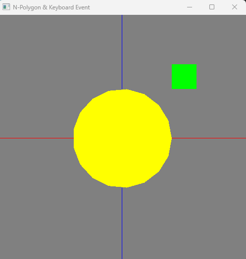
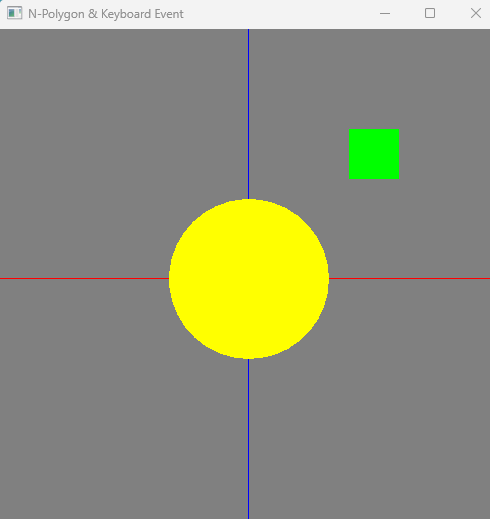
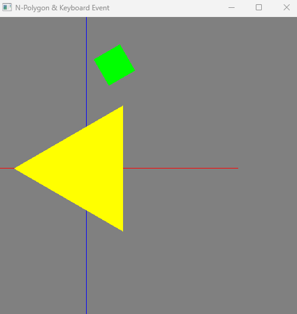

## 원 같은 다각형 그리기(N-Polygon)

그림을 그리기 위해 `glBegin()`과 `glEnd()`를 사용해야 한다. 

두 함수 사이에 도형의 색, 도형의 모양을 결정하는 함수를 사용한다.

1. glColor3f(R,G,B);

		- 도형의 색을 설정하는 함수
  - RGB값을 사용자가 원하는 대로 설정한다.
    - glColor3f(0.0, 0.0, 0.0) : 검은색
    - glColor3f(1.0, 1.0, 1.0) : 흰색

2. glVertex2f(x, y);

  - glVertex는 도형의 모양을 결정하는 함수

  - 2는 이차원을 나타냄

  - f는 float형으로 i이면 int 

  - 사각형을 그리고 싶으면 glVertex를 4번 적음 ➡️ n각형을 그릴 땐  n번 적기 번거로움, 반복문 사용!!

    ## 정17각형 그리기

    점의 개수가 17이고 모든 각의 크기가 동일해야 하므로 한 각의 크기를 `delta`

    원은 전체가 360도 이므로 파이를 사용함 
    $$
    delta = 2*PI/점의 개수
    $$
    이처럼 한각의 크기를 구할 수 있음 
    $$
    theta = delta*i
    $$
    

​		한 각의 크기를 구했다면 각을 이용해 각 점의 좌표를 설정할 수 있다.

​		x좌표와 y좌표는 삼각형의 각을 알 때, 변의 좌표를 구하는 공식을 활용함

​		
$$
x = radius * cos(theta)
$$

$$
y = radius * sin(theta)
$$

반복문을 17각형이므로 num=17 이다!! 

그럼 이제 코드를 살펴보면 이해하기 쉬울 것이다. 

```c++
void Modeling_Circle(void) {
	float	delta, theta;
	float	x, y;

	glColor3f(1.0, 1.0, 0.0);
	glPointSize(3.0);
	delta = 2 * PI / num;

	glBegin(model_type);
	for (int i = 0; i < num; i++) {
		theta = start_angle + delta * i;
		x = radius * cos(theta);
		y = radius * sin(theta);
		glVertex2f(x, y);
	}
	glEnd();
}
```

### 출력결과



# key_event

키보드 자판을 이용해 크기, 점의 개수, 회전 등 다양한 이벤트를 만들 수 있다.

하지만 **Special keyevent**라고 방향키나 F키를 사용할 수 있다.

## Mykey 함수

void MyKey(unsigned char key, int x, int y) 는 키보드의 값을 부호가 없는 char형으로 받는다.

여기서 나는 원을 형성하는 선분의 수를 조정하는 이벤트와 원의 크기 조정, 원이 회전하는 이벤트를 만들었다.

### 1. 원을 형성하는 선분의 수 조정

`num` 점의 개수

오각형을 만들었다고 가정하면, num은 5로 입력 되어있다.

키보드 `n`을 누르면 점의 개수가 1씩 증가해 원에 가까운 다각형으로 만들게 한다.

키보드 `m`을 누르면 점의 개수가 1씩 감소해 다각형이 사라지게 된다. 

​	하지만, 나는 많이 줄인다고 해도 삼각형으로 줄이고 싶기 때문에 `if문`을 사용해 최대로 줄여도 삼각형이 사용자의 눈에 보이도록 만들었다.

```c++
	case 'n':	num += 1;	break;
	case 'm':	num -= 1; 
		if (num < 3) {
			num = 3;
			break;
		}
		break;
```


### 2. 원의 크기 조정

`radius` 반지름

원의 크기는 반지름으로 조정 가능하다.

`big` 을 나타내는 키보드 `b`를 누르면 반지름의 길이가 10.0씩 증가한다.

`small`을 나타내는 키보드 `s`를 누르면 반지름의 길이가 10.0씩 감소한다. 

```c++
case 'b':	radius += 10;	break;
	case 's':	radius -= 10;	
		if (radius <= 10) {
			radius = 10;
			break;
		}
		break;
```

🔥 if문을 사용하지 않았더니 s를 계속 누르면 작아지는 것 같더니 갑자기 커지는 것을 보고 최소 반지름 값을 지정함🔥

### 3. 회전

`angle` 회전 각도  (전역변수 선언함)

도형을 회전시키기 위해선 `glRotatef(회전 각도, x, y, z)`가 필요하다.

float형으로 각도를 선언해서 뒤에 f가 붙음

처음 빌드를 하면 각도가 0으로 나와야하므로 `angle=0.0`으로 선언

`turn`을 의미하는 키보드 `t`를 누르면 45.0도씩 회전하도록 한다. (360이상이 되면 다시 `angle=0.0`으로 설정)

```c++
case 't':	angle += 30.0;
		if (angle > 360.0) {
			angle = 0.0;
			break;
		}
		break;
```

#### 📌 원을 공전하는 사각형..?

사각형도 회전하도록 만들고 싶어서 코드를 작성하였다..

근데 마치 달이 지구를 공전하는 것처럼 실행되어 신기했다

다른 방법들도 찾아봐야겠다!

```c++
void Modeling_Rectangle(void) {
	glColor3f(0.0, 1.0, 0.0);
	glRotatef(angle, 0.0, 0.0, 1.0); // 지구 주위를 공전하는 달처럼 사각형이 원 중심을 공전함 -> 태양계..?

	glBegin(GL_POLYGON);
	glVertex2i(100, 100);
	glVertex2i(150, 100);
	glVertex2i(150, 150);
	glVertex2i(100, 150);
	glEnd();
}
```


## Specialkey 함수

### 원을 나타내는 물체의 모양 변화

|    model_type     |                모양                 |
| :---------------: | :---------------------------------: |
|     GL_POINTS     |                 점                  |
|   GL_LINE_STRIP   |             연결된 선분             |
|   GL_LINE_LOOP    |      시작점과 끝점을 이은 선분      |
|     GL_LINES      |      두개의 정점들을 이은 선분      |
|   GL_TRIANGLES    |        세 개씩 연결한 삼각형        |
| GL_TRIANGLE_STRIP |            연결된 삼각형            |
|  GL_TRIANGLE_FAN  |       중심을 공유하는 삼각형        |
|     GL_QUADS      | 정점 4개씩을 연결하여 사각형을 그림 |
|   GL_QUAD_STRIP   |            연결된 사각형            |
|    GL_POLYGON     |         연결된 블록 다각형          |


### 방향키로 clipping 영역 전환

방향키는 그냥 keyevent인 줄 알았는데 spicialkey였다..! 😮

clipping 은 카메라 렌즈라고 이해하면 쉽다!

렌즈가 이동하면 화면에 보이는 물체들도 이동하는 것처럼 보이게 된다.

이런 방식을 적용하는 함수는 `gluOrtho` 

`gluOrtho2D(standard_x, standard_x + Window_Width, standard_y, standard_y + Window_Height);`

하지만 이것만 적으면 화면이 이상하게 됨..

그래서 이것과 같이 사용해야 한다..!

```
glMatrixMode(GL_PROJECTION);
glLoadIdentity();
```

그럼 방향키로 영역을 전환시킬 수 있다. 


#### clipping 코드

```c++
#define		Window_Width	500
#define		Window_Height	500

float		standard_x = -250.0;
float		standard_y = -250.0;

void MyReshape(int w, int h) {
	glViewport(0, 0, w, h);
	glMatrixMode(GL_PROJECTION);
	glLoadIdentity();
	gluOrtho2D(standard_x, standard_x + Window_Width, standard_y, standard_y + Window_Height);
}

void RenderScene(void) {
	glClearColor(0.5, 0.5, 0.5, 0.0);
	glClear(GL_COLOR_BUFFER_BIT);
	glMatrixMode(GL_PROJECTION);
	glLoadIdentity();
	gluOrtho2D(standard_x, standard_x + Window_Width, standard_y, standard_y + Window_Height);
	Modeling_Axis();		// x축과 y축 
	Modeling_Rectangle();	// 1사분면에 있는 정사각형  
	Modeling_Circle();		// 반지름의 크기가 100인 원

	glFlush();
}
```


#### keyevent 코드

```c++
void MyKey(unsigned char key, int x, int y) {

	switch (key) {
	// 원을 형성하는 선분의 수 조정
	case 'n':	num += 1;	break;
	case 'm':	num -= 1; 
		if (num < 3) {
			num = 3;
			break;
		}
		break;

	// 원의 크기 조정 
	case 'b':	radius += 10;	break;
	case 's':	radius -= 10;	
		if (radius <= 10) {
			radius = 10;
			break;
		}
        break;
	// 원 회전 
	case 't':	angle += 30;
		if (angle > 360) {
			angle = 0;
			break;
		}
        break;
	default:	break;
	}
	glutPostRedisplay();
}

void SpecialKey(int key, int x, int y) { 
	switch (key) {
	// 원을 나타내는 물체의 모양 변화
	case GLUT_KEY_F1:	model_type = GL_POINTS;		break;	// 점
	case GLUT_KEY_F2:	model_type = GL_LINE_STRIP;	break;	// 연결된 선분
	case GLUT_KEY_F3:	model_type = GL_LINE_LOOP;		break;	// 시작점과 끝점을 이은 선분
	case GLUT_KEY_F4:	model_type = GL_LINES;	break;	// 두개의 정점들을 이은 선분
	case GLUT_KEY_F5:	model_type = GL_TRIANGLES;	break;	// 세 개씩 연결한 삼각형
	case GLUT_KEY_F6:	model_type = GL_TRIANGLE_STRIP;	break;	// 연결된 삼각형
	case GLUT_KEY_F7:	model_type = GL_TRIANGLE_FAN;	break;	// 중심을 공유하는 삼각형
	case GLUT_KEY_F8:	model_type = GL_QUADS;	break;	// 정점 4개씩을 연결하여 사각형을 그림
	case GLUT_KEY_F9:	model_type = GL_QUAD_STRIP;	break;	// 연결된 사각형
	case GLUT_KEY_F10:	model_type = GL_POLYGON;	break;	// 연결된 블록 다각형

	// 방향키로 Clipping 영역 변화 
	case GLUT_KEY_UP:		standard_y += 1.0;	break;
	case GLUT_KEY_LEFT:		standard_x -= 1.0; break;
	case GLUT_KEY_DOWN:		standard_y -= 1.0; break;
	case GLUT_KEY_RIGHT:	standard_x += 1.0;	break;
	default:	break;
	}
	glutPostRedisplay();
}
```


# 마무리

## 전체 코드

```c++
#include <windows.h>
#include <math.h>
#include <gl/gl.h>
#include <gl/glut.h> // (or others, depending on the system in use)

#define		PI				3.1415926
#define		Window_Width	500
#define		Window_Height	500

int			model_type = GL_POLYGON;
int			num = 10;
float		radius = 100;
float		angle = 0.0;
float		start_angle = 0.0;
float		standard_x = -250.0;
float		standard_y = -250.0;

void MyReshape(int w, int h) {
	glViewport(0, 0, w, h);
	glMatrixMode(GL_PROJECTION);
	glLoadIdentity();
	gluOrtho2D(standard_x, standard_x + Window_Width, standard_y, standard_y + Window_Height);
}

void Modeling_Circle(void) {
	float	delta, theta;
	float	x, y;

	glColor3f(1.0, 1.0, 0.0);
	glPointSize(3.0);
	glRotatef(angle, 0.0, 0.0, 1.0); // 도형 회전 
	delta = 2 * PI / num;

	glBegin(model_type);
	for (int i = 0; i < num; i++) {
		theta = start_angle + delta * i;
		x = radius * cos(theta);
		y = radius * sin(theta);
		glVertex2f(x, y);
	}
	glEnd();
}

void Modeling_Axis(void) {
	glBegin(GL_LINES);
	glColor3f(1.0, 0.0, 0.0);
	glVertex2f(-250, 0.0);
	glVertex2f(250, 0.0);

	glColor3f(0.0, 0.0, 1.0);
	glVertex2f(0, -250);
	glVertex2f(0, 250);
	glEnd();
}

//사각형
void Modeling_Rectangle(void) {
	glColor3f(0.0, 1.0, 0.0);
	glRotatef(angle, 0.0, 0.0, 1.0); // 지구 주위를 공전하는 달처럼 사각형이 원 중심을 공전함 -> 태양계..?

	glBegin(GL_POLYGON);
	glVertex2i(100, 100);
	glVertex2i(150, 100);
	glVertex2i(150, 150);
	glVertex2i(100, 150);
	glEnd();
}

void Modeling_Ground(void) {
	glColor3f(1.0, 0.0, 1.0);
	glBegin(GL_POLYGON);
	glVertex2i(250, 250);
	glVertex2i(-250, 250);
	glVertex2i(-250, -250);
	glVertex2i(250, -250);
	glEnd();
}

void RenderScene(void) {
	glClearColor(0.5, 0.5, 0.5, 0.0);
	glClear(GL_COLOR_BUFFER_BIT);
	glMatrixMode(GL_PROJECTION);
	glLoadIdentity();
	gluOrtho2D(standard_x, standard_x + Window_Width, standard_y, standard_y + Window_Height);
	Modeling_Axis();		// x축과 y축 
	Modeling_Rectangle();	// 1사분면에 있는 정사각형 
	//Modeling_Axis();		// x축과 y축 
	Modeling_Circle();		// 반지름의 크기가 100인 원

	glFlush();
}


void MyKey(unsigned char key, int x, int y) {

	switch (key) {
	// 원을 형성하는 선분의 수 조절
	case 'n':	num += 1;	break;
	case 'm':	num -= 1; 
		if (num < 3) {
			num = 3;
			break;
		}
		break;

	// 원의 크기 조정 
	case 'b':	radius += 10;	break;
	case 's':	radius -= 10;
		if (radius < 10) {
			radius = 10;
			break;
		}
		break;
	// 원 회전 
	case 't':	angle += 30;
		if (angle > 360) {
			angle = 0;
			break;
		}
		break;

	default:	break;
	}
	glutPostRedisplay();
}

void SpecialKey(int key, int x, int y) { 
	switch (key) {
	// 원을 나타내는 물체의 모양 변화
	case GLUT_KEY_F1:	model_type = GL_POINTS;		break;	// 점
	case GLUT_KEY_F2:	model_type = GL_LINE_STRIP;	break;	// 연결된 선분
	case GLUT_KEY_F3:	model_type = GL_LINE_LOOP;		break;	// 시작점과 끝점을 이은 선분
	case GLUT_KEY_F4:	model_type = GL_LINES;	break;	// 두개의 정점들을 이은 선분
	case GLUT_KEY_F5:	model_type = GL_TRIANGLES;	break;	// 세 개씩 연결한 삼각형
	case GLUT_KEY_F6:	model_type = GL_TRIANGLE_STRIP;	break;	// 연결된 삼각형
	case GLUT_KEY_F7:	model_type = GL_TRIANGLE_FAN;	break;	// 중심을 공유하는 삼각형
	case GLUT_KEY_F8:	model_type = GL_QUADS;	break;	// 정점 4개씩을 연결하여 사각형을 그림
	case GLUT_KEY_F9:	model_type = GL_QUAD_STRIP;	break;	// 연결된 사각형
	case GLUT_KEY_F10:	model_type = GL_POLYGON;	break;	// 연결된 블록 다각형

	// 방향키로 Clipping 영역 변화 
	case GLUT_KEY_UP:		standard_y += 1.0;	break;
	case GLUT_KEY_LEFT:		standard_x -= 1.0; break;
	case GLUT_KEY_DOWN:		standard_y -= 1.0; break;
	case GLUT_KEY_RIGHT:	standard_x += 1.0;	break;
	default:	break;
	}
	glutPostRedisplay();
}


int main(int argc, char** argv) {
	glutInit(&argc, argv);
	glutInitDisplayMode(GLUT_SINGLE | GLUT_RGB);
	glutInitWindowPosition(100, 100);
	glutInitWindowSize(Window_Width, Window_Height);
	glutCreateWindow("N-Polygon & Keyboard Event");
	glutDisplayFunc(RenderScene);
	glutReshapeFunc(MyReshape);
	glutKeyboardFunc(MyKey);
	glutSpecialFunc(SpecialKey);
	glutDisplayFunc(RenderScene);
	glutMainLoop();
	return 0;
}
```


## 출력 결과

