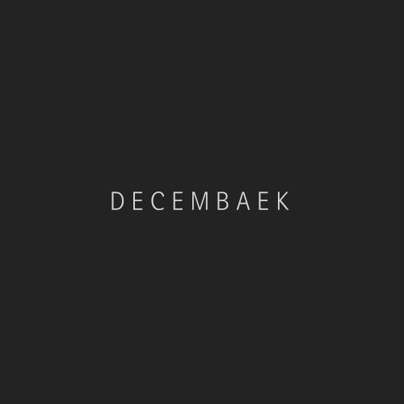

**[공지사항]**[공지사항 안내 드립니다. <- 테스트용 입니다 사이트 없어요](https://decembaek.github.io/community/notice/)
{: .notice--info}

<h4>공지사항입니다.</h4>
<ul>
  <li>테스트1</li>
  <li>테스트2</li>
  <li>테스트3</li>
</ul>

#decembaek 블로그 제작했어요

Win or Learn 꾸준히 해봅시다.

원래 Tistory 블로그 하다가 이번에 Github 블로그로 옮겼습니다.
Wingyu_coder -> decembaek 으로 이름 변경했습니다.
- - -


