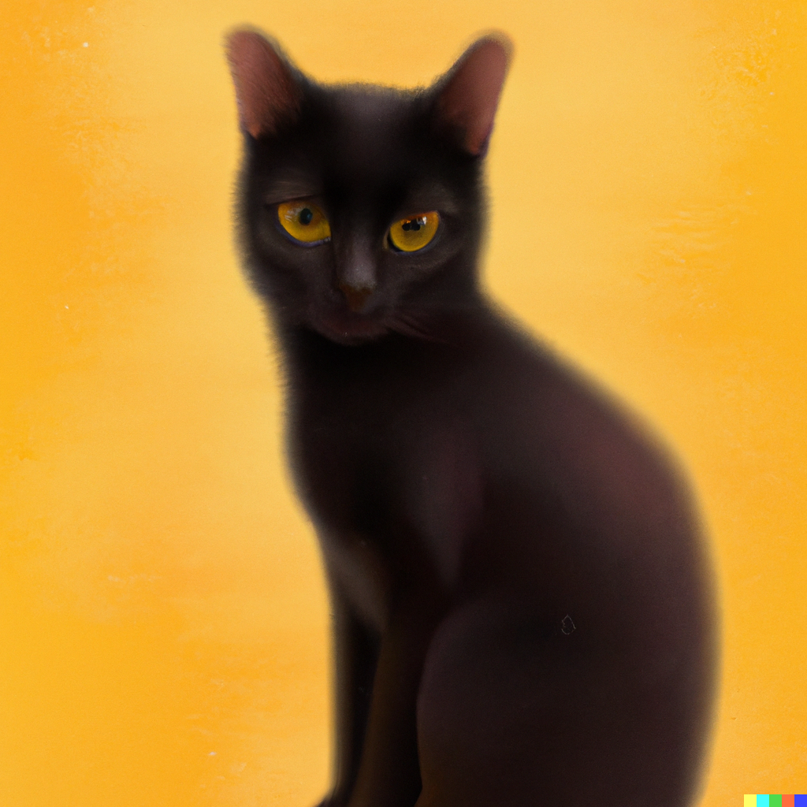

# The Geek Cat's blogging has been started!

Hello World!

The images below are drawn by DELL E the AI.

Test 1: Keep the folder path automatically set by Typora

Test 2: Change the folder path to ..\assets\... which is the folder path in GitHub

Test 3: A new preference for the folder path updated --> This works!

Ruby has been installed!