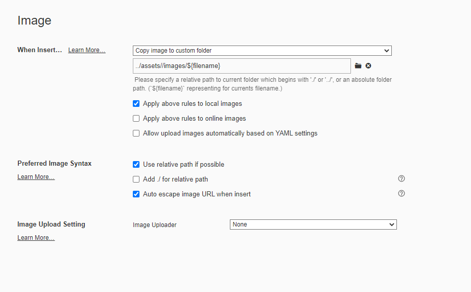
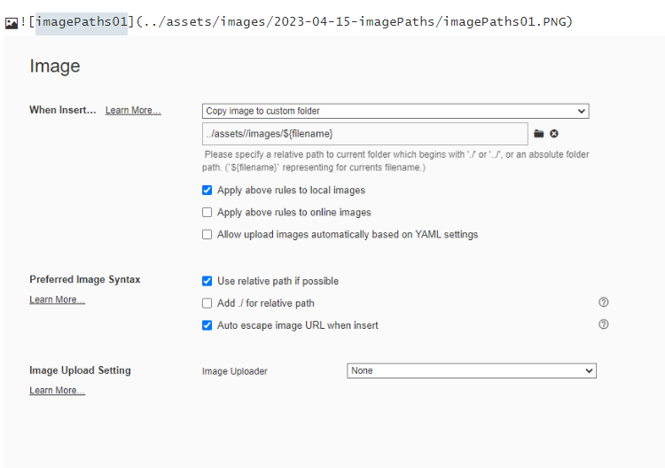
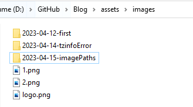
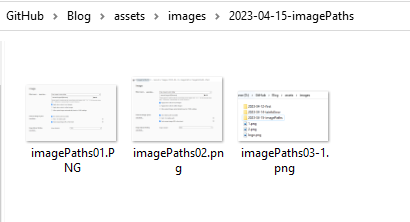
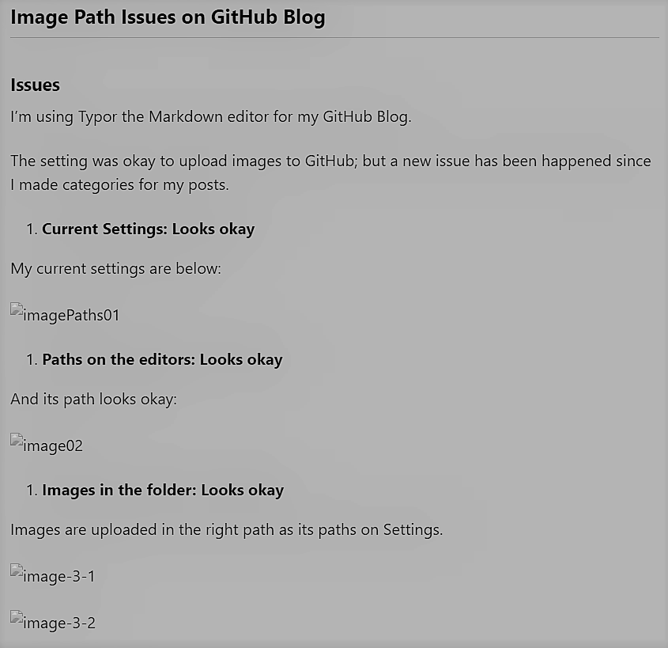

<h2>Image Path Issues on GitHub Blog</h2>

test


<h3>Issues</h3>

I'm using Typor the Markdown editor for my GitHub Blog. 

The setting was okay to upload images to GitHub; but a new issue has been happened since I made categories for my posts.


1. **Current Settings: Looks okay**

My current settings are below:




2. **Paths on the editors: Looks okay**

And its path looks okay:




3. **Images in the folder: Looks okay**

Images are uploaded in the right path as its paths on Settings.





4. **Image errors on posts: Issue happend**

   It looks okay above, however, images are not shown on posts:

   


5. **Image errors on server: Issue happened**

When a post containing images is updated on a local live server, there are error meesages:

```powershell
[2023-04-15 00:50:33] ERROR `/blogging/assets/images/2023-04-15-imagePaths/imagePaths01.PNG' not found.
[2023-04-15 00:50:33] ERROR `/blogging/assets/images/2023-04-15-imagePaths/imagePaths02.png' not found.
[2023-04-15 00:50:33] ERROR `/blogging/assets/images/2023-04-15-imagePaths/imagePaths03-1.png' not found.
[2023-04-15 00:50:33] ERROR `/blogging/assets/images/2023-04-15-imagePaths/imagePaths03-2.png' not found.
[2023-04-15 00:50:33] ERROR `/blogging/assets/images/2023-04-15-imagePaths/imagePaths04-1.png' not found.
```


Based on the error messages, the newly set 'category' is also set as a part of the image path which I have never set. This post belongs to the 'blogging' category, so the 'blogging' is added to the top path.


<h3>Reasons </h3>


<h3>Solutions</h3>


