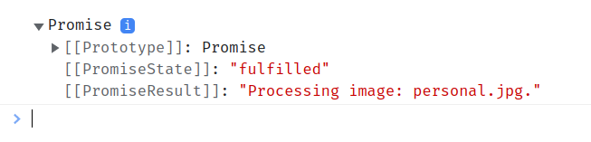

_This article is brought to you by [Herbert Kateu](https://github.com/hkateu), a new contributor. He got started after applying for the fresh new Technical Writer position at our new [Job Board](https://jobs.rockthejvm.com/)!_

## 1. Introduction

With the growing number of cyber-attacks ever increasing, there's a growing need for security in the applications we build.
Http4s comes with several easily configurable security features and in this article, we will cover the two most common, CORS and CSRF.
If you are not familiar with http4s, a good introduction to the library can be found [here](https://blog.rockthejvm.com/http4s-tutorial/)

## 2. Setting Up

To run the code in this article, we'll need to add the following dependencies in our project build:

```scala
libraryDependencies ++= Seq(
    "org.typelevel" %% "cats-core" % "2.8.0",
    "org.typelevel" %% "cats-effect" % "3.3.14"
    "org.http4s" %% "http4s-dsl" % "0.23.16"
    "org.http4s" %% "http4s-ember-server" % "0.23.16"
)

```

We'll also need these two programs installed to follow along.
The [curl](https://curl.se/) command line tool for sending requests in the terminal.
The [serve](https://www.npmjs.com/package/serve) npm package, a lightweight server for static pages.

## 3. Cross-Origin Resource Sharing

Many developers have come across the CORS acronym at some point in their careers, but what does it mean exactly? CORS stands for Cross-Origin Resource Sharing, it's a technique used by browsers to ensure secure requests and data transfers from any origin other than its own. Here's how this would work in 3 simple steps.

1. `img.com` needs to load images on its landing page but these images are hosted on `imagebucket.com`
2. When someone visits `img.com`, his/her browser will send a request for images to `imagebucket.com`, this is called a cross-origin request.
3. If `imagebucket.com` setup cross-origin resource sharing to include `img.com`, then the browser will proceed and load these requests, otherwise the request will be canceled and the images will fail to load.

Imagine for a second that CORS didn't exist, malicious sites could easily request and acquire information from any site by making cross-origin requests. Typically a server should contain a list of approved sites to which cross-origin resource sharing is approved, any requests made from sites outside this list should be denied.

## 4. CORS and Http4s

Http4s provides CORS as part of it's `middleware`, the `CORS` package comes with a number of methods that help in implementing CORS within Http4s.
Let's create our minimalistic server to show how CORS works. The code that follows is written in Scala 3, but can also work with Scala 2:

```scala
import cats.effect.*
import org.http4s.*
import org.http4s.dsl.io.*

object CorsExample extends IOApp {
    val imageService = HttpRoutes.of[IO]{
        case GET -> Root / "image" / name =>
            Ok(s"Processing image: $name." )
    }.orNotFound

    override def run(args: List[String]): IO[ExitCode] = ???
}
```

Here we implement our `imageService` that returns an image when provided a name, it receives a `GET` request and responds with a message telling the user that the image is being returned.
Once the service is created, we will need to bind it to a port number where the requests will be routed, for this, we will use `ember` server:

```scala
import org.http4s.ember.server.EmberServerBuilder
import com.comcast.ip4s.*

val server = EmberServerBuilder
    .default[IO]
    .withHost(ipv4"0.0.0.0")
    .withPort(port"8080")
    .withHttpApp(imageService)
    .build

override def run(args: List[String]): IO[ExitCode] = server.use(_ => IO.never).as(ExitCode.Success)
```

We use `EmberServerBuilder` to build our server on `localhost`, port `8080`. We also configured the server to run indefinitely using `IO.never` on the `run()` method.

Now let's test the server with `curl` and see what kind of result we get:

```bash
curl -v http://localhost:8080/image/personal.jpg

*   Trying ::1:8080...
* Connected to localhost (::1) port 8080 (#0)
> GET /image/personal.jpg HTTP/1.1
> Host: localhost:8080
> User-Agent: curl/7.71.1
> Accept: */*
>
* Mark bundle as not supporting multiuse
< HTTP/1.1 200 OK
< Date: Thu, 13 Apr 2023 18:28:44 GMT
< Connection: keep-alive
< Content-Type: text/plain; charset=UTF-8
< Content-Length: 31
<
* Connection #0 to host localhost left intact
Processing image: personal.jpg.⏎

```

When `curl` is run with the `-v` or `--verbose` flag, it displays the headers that are sent as well as what is returned. Looking at the bottom of the response from the server, we confirm that we receive the appropriate response, `Processing image: personal.jpg`.

Scrutinizing the output reveals that there's no `Origin` Header. This means that CORS has not yet been implemented. Let's fix that now:

```scala
import org.http4s.server.middleware.CORS

val corsService = CORS.policy
        .withAllowOriginAll(imageService)

val server = EmberServerBuilder
    .default[IO]
    .withHost(ipv4"0.0.0.0")
    .withPort(port"8080")
    .withHttpApp(corsService)
    .build
```

Our first implementation of CORS uses the `withAllowOriginAll()` method on the `CORS.policy` object, this method opens the server to process requests from any origin as seen in the output below:

```bash
curl -v http://localhost:8080/image/personal.jpg -H 'Origin: http://img.com'

*   Trying ::1:8080...
* Connected to localhost (::1) port 8080 (#0)
> GET /image/personal.jpg HTTP/1.1
> Host: localhost:8080
> User-Agent: curl/7.71.1
> Accept: */*
> Origin: http://img.com
>
* Mark bundle as not supporting multiuse
< HTTP/1.1 200 OK
< Date: Thu, 13 Apr 2023 18:58:50 GMT
< Connection: keep-alive
< Content-Type: text/plain; charset=UTF-8
< Content-Length: 31
< Access-Control-Allow-Origin: *
<
* Connection #0 to host localhost left intact
Processing image: personal.jpg.⏎

```

`Curl` can pass headers when sending requests through the `-H` flag, in our example, we passed the `Origin` header as `http://img.com`.
Within the response, we see a new header added, `Access-Control-Allow-Origin` which is now displayed with a value `*`, the asterisk signifies that requests from all origins will be accepted by our server.
It's important to note that the CORS configuration won't prevent non-browser requests from going through. CORS is browser specific. The server sends CORS specific headers to the browser which it uses to either block or load requests. The `Origin` header is added automatically by the browser whenever requests are sent, however since we are using `curl`, we add it in manually.

With CORS implemented, we realize that even malicious sites can make requests for our `personal.jpg` image.

We can specify the sites that can access our server by replacing the `withAllowOriginAll()` method with the `withAllowOriginHost()` method. This would be implemented as follows:

```scala
import org.http4s.headers.Origin

val corsService = CORS.policy
    .withAllowOriginHost(Set(
        Origin.Host(Uri.Scheme.http, Uri.RegName("localhost"), Some(5000)),
    ))
    .apply(imageService)
```

The `withAllowOriginHost` method takes a Set of URLs described as `Origin` objects, the `Host` method takes a URI scheme as either `http` or `https`, a hostname and port number. Here we configured our server to only accept requests from `localhost:5000`. Non-browser requests such as those from `curl` will always go through since there's no mechanism to restrict access based on the type of CORS header returned. Let's prove this:

```bash
curl -v http://localhost:8080/image/personal.jpg -H 'Origin:http://img.com'

*   Trying ::1:8080...
* Connected to localhost (::1) port 8080 (#0)
> GET /image/personal.jpg HTTP/1.1
> Host: localhost:8080
> User-Agent: curl/7.71.1
> Accept: */*
> Origin: http://img.com
>
* Mark bundle as not supporting multiuse
< HTTP/1.1 200 OK
< Date: Tue, 18 Apr 2023 12:42:05 GMT
< Connection: keep-alive
< Content-Type: text/plain; charset=UTF-8
< Content-Length: 31
< Vary: Origin
<
* Connection #0 to host localhost left intact
Processing image: personal.jpg.⏎
```

Instead of the `Access-Control-Allow-Origin`, we now receive a `Vary` header, with the value `Origin`. This means that access to our server resources is now restricted for some origins. However, access should have been restricted only to `localhost:5000` but our `personal.jpg` image still gets processed because `curl` doesn't care about CORS headers.

Knowing this let's send the request through a browser. First, we create a folder to store our `HTML` file called `testFolder` and within it, create a `test.html` page to which we save the following code:

```html
<!DOCTYPE html>
<html>
  <script>
    async function fetchdata() {
      url = "http://localhost:8080/image/personal.jpg";
      const response = await fetch(url);
      await console.log(response.text());
    }
  </script>
  <button onClick="fetchdata();">Fetch Image</button>
</html>
```

We embed our request code in JavaScript within the `<script>` tag. Here we use the javascript's `fetch()` API to send the request to our server URL, when the `Fetch Image` button is clicked, the `fetchdata()` function is called and a request is sent to the server URL and the response is logged in the `console` using `await console.log(response.text())`.

We can serve our `test.html` page using the `serve` console command as follows:

```bash
serve testFolder
   ┌───────────────────────────────────────────────┐
   │                                               │
   │   Serving!                                    │
   │                                               │
   │   - Local:            http://localhost:5000   │
   │   - On Your Network:  http://undefined:5000   │
   │                                               │
   │   Copied local address to clipboard!          │
   │                                               │
   └───────────────────────────────────────────────┘
```

Great, now that our server is set up, we can run `localhost:5000/test` in the browser. When you navigate to the console through your browsers developer tools, this should be the output:



This is the expected behavior if CORS is implemented correctly. Assuming we change the port number in our server to `9000`:

```scala
val corsService = CORS.policy
    .withAllowOriginHost(Set(
        Origin.Host(Uri.Scheme.http, Uri.RegName("localhost"), Some(9000)),
    ))
    .apply(imageService)
```

If we run `localhost:5000/test` again in the browser, our request should be blocked with the following log in the console.


We can see that CORS is now being implemented correctly in our server.

Here's the full code for our server:

```scala
import cats.effect.{IO,IOApp,ExitCode}
import org.http4s.*
import org.http4s.dsl.io.*
import org.http4s.ember.server.EmberServerBuilder
import com.comcast.ip4s.*
import org.http4s.server.middleware.CORS
import org.http4s.headers.Origin


object securityHttp4s extends IOApp {
    val imageService = HttpRoutes.of[IO]{
        case GET -> Root / "image" / name =>
            Ok(s"Processing image: $name." )
    }.orNotFound

    val corsService = CORS.policy
        .withAllowOriginHost(Set(
            Origin.Host(Uri.Scheme.http, Uri.RegName("localhost"), Some(5000)),
        ))
        .apply(imageService)

    val server = EmberServerBuilder
        .default[IO]
        .withHost(ipv4"0.0.0.0")
        .withPort(port"8080")
        .withHttpApp(corsService)
        .build

    override def run(args: List[String]): IO[ExitCode] =
      server.use(_ => IO.never).as(ExitCode.Success)
}
```

## 5. The workings of a CSRF attack

### 5.1 The Problem

CSRF stands for Cross-Site Request Forgery, this is a malicious attack by a third party where unsanctioned requests are sent without the knowledge of the user to sites the user is logged into.

Here's a simple example of a CSRF attack
Let's assume that a user hosts all his/her important photos on `photos.com`.
The attacker decides to send the user such an email:

```
Subject: Free Subscription

Hello User,
We realize your birthday is coming up soon, we would love to offer you a free subscription for the coming month for being a loyal photos.com user.
Use this link if you are interested.
```

The link in the above message will lead to a forged URL:

```html
<a
  href="http://photos.com/transfer-images?authorize=true&destination='hacker@email.com'"
  >Grab your free subscription here</a
>
```

Even worse the attacker could use an image to perform a malicious action:

```html

```

If `photos.com` allows image transfers with `GET` requests, such a link would authorize a transfer of private photos to the hackers' email account without the user noticing.

In a situation where image transfers were done with POST requests:

```html
<form
  action="http://photos.com/transfer-images"
  method="POST"
  ,
  id="malicious-form"
>
  <input type="hidden" name="authorize" value="true" />
  <input type="hidden" name="email" value="hacker@email.com" />
  <input type="submit" value="Click to get a free subscription!" />
</form>
```

Such a form could be embedded in an email or within a fake copy of the website. Once this link is clicked, the form would be submitted and the private images would be transferred to the hackers' email.

JavaScript can also be used to submit the above form, just by adding this extra code after the form:

```html
<script>
  document.getElementById("malicious-form").submit();
</script>
```

In this case, the form will automatically be submitted as soon as the HTML has loaded.

### 5.2 The solution

If `photos.com` implemented CSRF protection correctly, this is how the above attack would be stopped.

1. Whenever an HTML form is used to send `POST` requests authorizing transfer photos from `photos.com`, a `CSRF token` must be inserted within a hidden field in the form.
2. Once the `POST` request is received by the `photos.com` server, it checks and verifies the `CSRF token` against its database. If the token is present and valid, the request would go through, however, if the token is missing or wrong, the transfer request would be rejected.

## 6. CSRF protection in Http4s

The `CSRF` module is also part of the Http4s `middleware` package. Let's start by creating the server we shall use in this section:

```scala
import cats.effect.*
import org.http4s.*
import org.http4s.dsl.io.*
import org.http4s.ember.server.EmberServerBuilder
import com.comcast.ip4s.*

object csrfExample extends IOApp {
    val service = HttpRoutes.of[IO]{
        case GET -> Root / "testing" =>
            Ok(s"Testing" )
    }.orNotFound

    override def run(args: List[String]): IO[ExitCode] = server.use(_ => IO.never).as(ExitCode.Success)
}
```

If we test our server, we should receive the string `Testing`:

```bash
curl -v http://localhost:8080/testing

*   Trying ::1:8080...
* Connected to localhost (::1) port 8080 (#0)
> GET /testing HTTP/1.1
> Host: localhost:8080
> User-Agent: curl/7.71.1
> Accept: */*
>
* Mark bundle as not supporting multiuse
< HTTP/1.1 200 OK
< Date: Thu, 13 Apr 2023 21:31:27 GMT
< Connection: keep-alive
< Content-Type: text/plain; charset=UTF-8
< Content-Length: 7
<
* Connection #0 to host localhost left intact
Testing⏎
```

From the output, we see our expected string.
We need a way to receive post requests from the client. To implement this, we shall add another route to the photoService:

```scala
val photoService = HttpRoutes.of[IO]{
    case GET -> Root / "testing" =>
        Ok(s"Testing" )
    case POST -> Root / "photos" =>
        Ok("Processing")
}.orNotFound
```

```bash
curl -v -X POST http://localhost:8080/photos

*   Trying ::1:8080...
* Connected to localhost (::1) port 8080 (#0)
> POST /photos HTTP/1.1
> Host: localhost:8080
> User-Agent: curl/7.71.1
> Accept: */*
>
* Mark bundle as not supporting multiuse
< HTTP/1.1 200 OK
< Date: Thu, 13 Apr 2023 21:51:47 GMT
< Connection: keep-alive
< Content-Type: text/plain; charset=UTF-8
< Content-Length: 10
<
* Connection #0 to host localhost left intact
Processing⏎
```

`Curl` handles `POST` requests by passing the `-X POST` flag as one of its arguments. In this case, we did not provide a payload to keep the example simple. From the result, we receive the expected string `Processing`.
Next, we'll implement the `CSRF` `middleware` into our server:

```scala
import cats.effect.unsafe.IORuntime
import org.http4s.server.middleware.CSRF

implicit override val runtime: IORuntime = IORuntime.global
val cookieName = "csrf-token"
val token = CSRF.generateSigningKey[IO]().unsafeRunSync()

val defaultOriginCheck: Request[IO] => Boolean =
    CSRF.defaultOriginCheck[IO](_,"localhost",Uri.Scheme.http, None)
val csrfBuilder = CSRF[IO,IO](token,defaultOriginCheck)

val csrf = csrfBuilder
    .withCookieName(cookieName)
    .withCookieDomain(Some("localhost"))
    .withCookiePath(Some("/"))
    .build

val csrfServer = csrf.validate()(photoService)

    val server = EmberServerBuilder
    .default[IO]
    .withHost(ipv4"0.0.0.0")
    .withPort(port"8080")
    .withHttpApp(csrfServer)
    .build
```

We start by generating our csrf `token` which is done by running `CSRF.generateSigningKey[IO]().unsafeRunSync()`, this gives us a value of type `SecretKey`.
The `defaultOriginCheck` is a function from `Request[IO] => Boolean` used to check the origin of the request, in our case it is `localhost`.
The first argument to the `defaultOriginCheck` method is the request, we provided an underscore since the request will be coming through `ember` server, however, scala http4s also has a utility for creating Requests within the application.
The third input is the `Uri` scheme which can be `http` or `https` and finally the port number which was provided as `None`.

The next step is assembling the `csrfBuilder` of type `CSRFBuillder[IO,IO]`, this is done by calling the `CSRF[IO,IO]()` function which takes as arguments our `token` and the `defaultOriginCheck` function.
The `csrfBuilder` is the heart of the CSRF implementation in http4s, in our example we provide 4 methods, first the `withCookieName()` method which takes `cookieName`, the name of the cookie as an argument, second is the `withCookieDomain()` which in our case is `localhost`, third is the `withCookiePath()` to which we provided `Some("/")`, this is the path through which we will request for the csrf token. Finally, the `build` method which bundles all these values into a `CSRF` object.

The `csrfServer` now has a `validate()` method which confirms the csrf token received through the `GET` request with what it generated. We also make sure we pass the `csrfServer` to our `server` through the `withHttpApp()` method.

Let's test our application and see how it responds to csrf attacks. First, we send a request without any csrf token:

```bash
curl -v -X POST http://localhost:8080/photos

*   Trying ::1:8080...
* Connected to localhost (::1) port 8080 (#0)
> POST /photos HTTP/1.1
> Host: localhost:8080
> User-Agent: curl/7.71.1
> Accept: */*
>
* Mark bundle as not supporting multiuse
< HTTP/1.1 403 Forbidden
< Date: Thu, 13 Apr 2023 22:52:49 GMT
< Connection: keep-alive
< Content-Length: 0
<
* Connection #0 to host localhost left intact
```

We received a `403 Forbidden error`, this is a step in the right direction. In a normal front-end application, when the page loads, a request would be sent to the server to receive the csrf token, which is then placed within a form. The `withCookiePath()` method from the `csrfBuilder` contains this path which we set to `Some("/")`, let's request for our csrf token:

```bash
curl -v http://localhost:8080

*   Trying ::1:8080...
* Connected to localhost (::1) port 8080 (#0)
> GET / HTTP/1.1
> Host: localhost:8080
> User-Agent: curl/7.71.1
> Accept: */*
>
* Mark bundle as not supporting multiuse
< HTTP/1.1 404 Not Found
< Date: Thu, 13 Apr 2023 23:21:24 GMT
< Connection: keep-alive
< Content-Type: text/plain; charset=UTF-8
< Content-Length: 9
< Set-Cookie: csrf-token=731EB4B0C3387DA4E1A99289ADEA4BB3006640EB4D0002D5F80F54E718654C7B-1681428084141-8C1AA35A16C2E13DC8AEEB4A0F680103882B4F8B; Domain=localhost; Path=/; SameSite=Lax; HttpOnly
<
* Connection #0 to host localhost left intact
Not found⏎
```

Notice that this is a `GET` request, the server sends the csrf token to the browser using the `Set-Cookie` header, this means that the csrf token is set as a cookie on the client's browser with the name `csrf-token`.

Now we can send a `POST` request to the server with the csrf token in order to fetch our photos:

```bash
curl -v -X POST http://localhost:8080/photos -H "Origin:http://localhost"
-H "X-Csrf-Token:731EB4B0C3387DA4E1A99289ADEA4BB3006640EB4D0002D5F80F54E718654C7B-1681428084141-8C1AA35A16C2E13DC8AEEB4A0F680103882B4F8B"
--cookie "csrf-token=731EB4B0C3387DA4E1A99289ADEA4BB3006640EB4D0002D5F80F54E718654C7B-1681428084141-8C1AA35A16C2E13DC8AEEB4A0F680103882B4F8B"

*   Trying ::1:8080...
* Connected to localhost (::1) port 8080 (#0)
> POST /photos HTTP/1.1
> Host: localhost:8080
> User-Agent: curl/7.71.1
> Accept: */*
> Cookie: csrf-token=731EB4B0C3387DA4E1A99289ADEA4BB3006640EB4D0002D5F80F54E718654C7B-1681428084141-8C1AA35A16C2E13DC8AEEB4A0F680103882B4F8B
> Origin:http://localhost
> X-Csrf-Token:731EB4B0C3387DA4E1A99289ADEA4BB3006640EB4D0002D5F80F54E718654C7B-1681428084141-8C1AA35A16C2E13DC8AEEB4A0F680103882B4F8B
>
* Mark bundle as not supporting multiuse
< HTTP/1.1 200 OK
< Date: Thu, 13 Apr 2023 23:25:06 GMT
< Connection: keep-alive
< Content-Type: text/plain; charset=UTF-8
< Content-Length: 10
< Set-Cookie: csrf-token=731EB4B0C3387DA4E1A99289ADEA4BB3006640EB4D0002D5F80F54E718654C7B-1681428306255-7C434E5B03A3AF02DFFE25726C224F107B1E3C4D; Domain=localhost; Path=/; SameSite=Lax; HttpOnly
<
* Connection #0 to host localhost left intact
Processing⏎
```

CSRF is now working since we receive the `Processing` message from the server. Using `curl`, we send a `POST` request by supplying the `-X POST` flag, this is then followed by the server URL which is `http://localhost:8080/photos`. We then add the headers `Origin` and `X-Csrf-Token` with their respective values and finally, we passed the `csrf-token` cookie which was set by the server.

Some gotcha's in this request, this does not apply if your requests are sent through the browser:
If the `Origin` header is missing, the request will fail, this is because the CSRF middleware through the defaultOriginCheck method confirms the origin of the request. The browser will automatically add the Origin header, however, it's the developer's responsibility to add the Origin header for non-browser requests.
If the cookie `csrf-token` is missing, the request will also fail. When the `csrf-token` is requested, the server will send a `Set-Cookie` header to the browser with the `csrf-token` value which sets it as a cookie, if the user visits this page again, the browser would send this cookie back to the server automatically. In the case of `curl`, we need to send this cookie back manually.

Here's the full code for the csrf implementation.

```scala
import cats.effect.*
import org.http4s.*
import org.http4s.dsl.io.*
import org.http4s.ember.server.EmberServerBuilder
import com.comcast.ip4s.*
import cats.effect.unsafe.IORuntime
import org.http4s.server.middleware.CSRF
import javax.crypto.SecretKey

object csrfExample extends IOApp {

    val photoService = HttpRoutes.of[IO]{
        case GET -> Root / "testing" =>
            Ok(s"Testing" )
        case POST -> Root / "photos" =>
            Ok("Processing")
    }.orNotFound

    implicit override val runtime: IORuntime = IORuntime.global
    val cookieName = "csrf-token"
    val token: SecretKey = CSRF.generateSigningKey[IO]().unsafeRunSync()

    val defaultOriginCheck: Request[IO] => Boolean =
        CSRF.defaultOriginCheck[IO](_,"localhost",Uri.Scheme.http, None)
    val csrfBuilder = CSRF[IO,IO](token,defaultOriginCheck)

    val csrf = csrfBuilder
        .withCookieName(cookieName)
        .withCookieDomain(Some("localhost"))
        .withCookiePath(Some("/"))
        .build

    val csrfServer = csrf.validate()(photoService)

    val server = EmberServerBuilder
        .default[IO]
        .withHost(ipv4"0.0.0.0")
        .withPort(port"8080")
        .withHttpApp(csrfServer)
        .build

    override def run(args: List[String]): IO[ExitCode] = server.use(_ => IO.never).as(ExitCode.Success)
}
```

## 7. Conclusion

In this article we went through Cross-Origin Resource Sharing, what it is, and how it's implemented. We also went through Cross-site request forgery attacks, how they occur, and how to prevent them. Both these topics have well-thought-out implementations in Http4s which we covered, and I encourage you to implement them in your servers.
