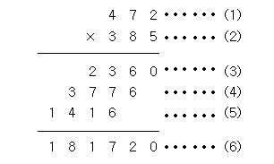

## **백준 2588 “곱셈”**
<br>

### **문제**
---
(세 자리 수) × (세 자리 수)는 다음과 같은 과정을 통하여 이루어진다.

  
<출처 백준 : https://www.acmicpc.net/problem/2588 >  

(1)과 (2)위치에 들어갈 세 자리 자연수가 주어질 때 (3), (4), (5), (6)위치에 들어갈 값을 구하는 프로그램을 작성하시오.


<br>

### **입력**
---
첫째 줄에 (1)의 위치에 들어갈 세 자리 자연수가, 둘째 줄에 (2)의 위치에 들어갈 세자리 자연수가 주어진다.

<br>

### **출력**
---
첫째 줄부터 넷째 줄까지 차례대로 (3), (4), (5), (6)에 들어갈 값을 출력한다.

<br>

### **입력예제**
---
```python
# 입력 : 472
#       385
# 출력 : 2360
#       3776
#       1416
#       181720
```

<br>

### **문제해결**
1. A에서 B의 각 자리 값을 곱한다.
2. B의 값의 INDEX를 활용하기 위하여 문자열로 받는다.
3. INT값으로 다시 전환하여 값을 구한다.
---
```python
# A, B 입력
A = int(input())
B = input()

AxB2 = A * int(B[2])
AxB1 = A * int(B[1])
AxB0 = A * int(B[0])
AxB = A * int(B)

print(AxB2, AxB1, AxB0, AxB, sep='\n')
```  
  
<br>

### **공부한 문법**
---
1. B를 문자열로 입력받아 INDEX를 활용
2. sep = '\n'  
문을 사용하여 뛰어쓰기 print()를 가능하게함

[Backjoon : 2588](https://www.acmicpc.net/problem/2588)

