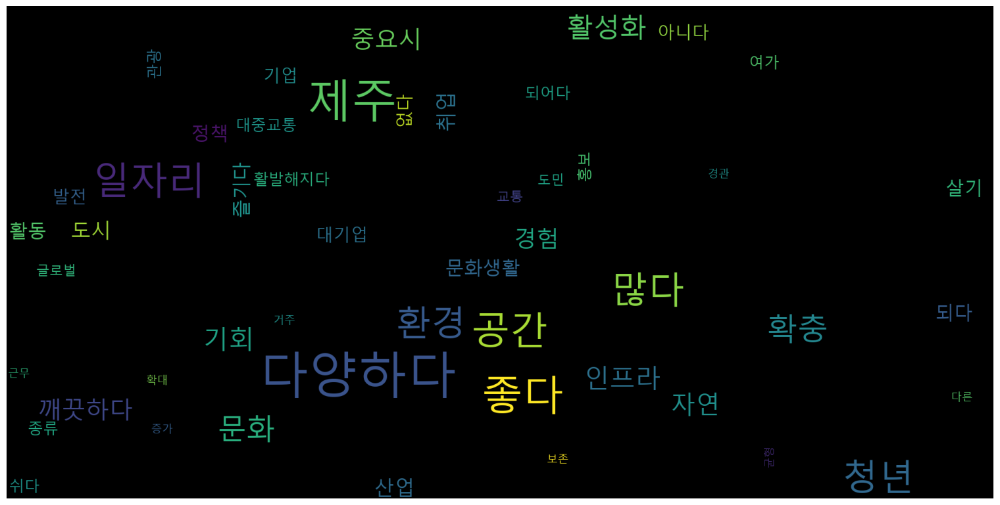

# 오잎클로버 바꾸고 : 우리가 바꾸고싶은 제주

```python
from wordcloud import WordCloud
from PIL import Image # 만약 "No module named 'PIL'" 에러가 발생하면 [ pip install Pillow==5.4.1 ] 로 라이브러리를 설치
import numpy as np
import pandas as pd
import matplotlib.pyplot as plt
```


```python
df = pd.read_csv('wishjeju.csv', encoding='UTF8')
print(df)
```

        대주제                                               세부내용
    0    경험                           청년들이 더 다양한 경험을 할 수 있는 공간
    1    경험                           청년들이 더 다양한 경험을 할 수 있는 공간
    2    경험                           청년들이 더 다양한 경험을 할 수 있는 공간
    3    경험                           청년들이 더 다양한 경험을 할 수 있는 공간
    4    경험                           청년들이 더 다양한 경험을 할 수 있는 공간
    ..   ..                                                ...
    144  기타                            믿을 수 있는 제주가 되었으면 좋겠습니다.
    145  기타  청년 MZ 세대들의 창의적인 사고와 제주 역사 인식을 같이 기를 수 있는 프로그램 개설 
    146  기타                                  무분별한 개발이 없으면 좋겠다.
    147  기타                 대학은 중요하지 않다. 청년들은 하고 싶은 일을 하면 됩니다.
    148  기타                 청년들의 모든 꿈이 이루어지는 활기찬 제주가 되었으면 좋겠다.
    
    [149 rows x 2 columns]


```python
wish = df['세부내용'].tolist()
print(len(wish))

wish = ' '.join(wish)
print(wish)
```

    149
    청년들이 더 다양한 경험을 할 수 있는 공간 청년들이 더 다양한 경험을 할 수 있는 공간 청년들이 더 다양한 경험을 할 수 있는 공간 청년들이 더 다양한 경험을 할 수 있는 공간 청년들이 더 다양한 경험을 할 수 있는 공간 청년들이 더 다양한 경험을 할 수 있는 공간 청년들이 더 다양한 경험을 할 수 있는 공간 청년들이 더 다양한 경험을 할 수 있는 공간 청년 활동 참여 기회가 많았으면 청년자치가 활성화 되었으면 환경을 중요시하는, 깨끗한 환경의 자연 친화적인 공간 제주 환경을 중요시하는, 깨끗한 환경의 자연 친화적인 공간 제주 환경을 중요시하는, 깨끗한 환경의 자연 친화적인 공간 제주 환경을 중요시하는, 깨끗한 환경의 자연 친화적인 공간 제주 환경을 중요시하는, 깨끗한 환경의 자연 친화적인 공간 제주 환경을 중요시하는, 깨끗한 환경의 자연 친화적인 공간 제주 환경을 중요시하는, 깨끗한 환경의 자연 친화적인 공간 제주 환경을 중요시하는, 깨끗한 환경의 자연 친화적인 공간 제주 환경을 중요시하는, 깨끗한 환경의 자연 친화적인 공간 제주 환경을 중요시하는, 깨끗한 환경의 자연 친화적인 공간 제주 환경과 발전이 균형있는 도시 환경과 발전이 균형있는 도시 자연경관이 보존되는 제주 환경 보존 정책이 있으면 좋겠다. 글로벌한 여행지 관광 산업 활성화 특산물 산업 활성화 관광객은 많지만, 쓰레기 없는 제주 문화 인프라 확충 문화 인프라 확충 문화 인프라 확충 문화 인프라 확충 문화 인프라 확충 문화 인프라 확충 문화 인프라 확충 문화 인프라 확충 문화 인프라 확충 문화 인프라 확충 문화 인프라 확충 문화 인프라 확충 놀이공원 여가활동 종류가 다양했으면 좋겠다. 여가활동 종류가 다양했으면 좋겠다. 여가활동 종류가 다양했으면 좋겠다. 여가활동 종류가 다양했으면 좋겠다. 문화생활 즐길 공간이 많았으면 좋겠다. 문화생활 즐길 공간이 많았으면 좋겠다. 문화생활 즐길 공간이 많았으면 좋겠다. 문화생활 즐길 공간이 많았으면 좋겠다. 문화생활 즐길 공간이 많았으면 좋겠다. 문화생활 즐길 공간이 많았으면 좋겠다. 문화 예술 공연 증가 다양한 레저 활동 증가 관광 산업 일자리 발전 관광 산업뿐만 아니라 다른 산업도 발전한 제주 관광 산업뿐만 아니라 다른 산업도 발전한 제주 즐겁게, 오랜 기간 근무할 수 있도록 하는, 충분한 근무 여건이 조성된 제주 타지역에 비해 낮은 임금 인상 공무원이 꿈이 아닌 세상 더 다양하고 많은 기업, 대기업이 많았으면 더 다양하고 많은 기업, 대기업이 많았으면 더 다양하고 많은 기업, 대기업이 많았으면 더 다양하고 많은 기업, 대기업이 많았으면 더 다양하고 많은 기업, 대기업이 많았으면 취업 기회가 많은 곳 취업 기회가 많은 곳 취업 기회가 많은 곳 취업 기회가 많은 곳 취업 기회가 많은 곳 다양한 일자리가 있는 곳 다양한 일자리가 있는 곳 다양한 일자리가 있는 곳 다양한 일자리가 있는 곳 다양한 일자리가 있는 곳 다양한 일자리가 있는 곳 다양한 일자리가 있는 곳 다양한 일자리가 있는 곳 다양한 일자리가 있는 곳 다양한 일자리가 있는 곳 다양한 일자리가 있는 곳 다양한 일자리가 있는 곳 다양한 일자리가 있는 곳 다양한 일자리가 있는 곳 다양한 일자리가 있는 곳 다양한 일자리가 있는 곳 다양한 일자리가 있는 곳 다양한 일자리가 있는 곳 다양한 일자리가 있는 곳 다양한 일자리가 있는 곳 스타트업 취업 지원 확대 문화 관련 취업 공간들이 생긴 제주 다양한, 좋은 일자리 정책 활성화 다양한, 좋은 일자리 정책 활성화 다양한, 좋은 일자리 정책 활성화 다양한, 좋은 일자리 정책 활성화 다양한, 좋은 일자리 정책 활성화 청년들을 쉽게 알 수 있도록 홍보 활발해졌으면 청년들을 쉽게 알 수 있도록 홍보 활발해졌으면 청년들을 쉽게 알 수 있도록 홍보 활발해졌으면 청년들을 쉽게 알 수 있도록 홍보 활발해졌으면 청년 저축 계좌 해당 대상의 확대 인턴 경험을 쌓을 기회가 많았으면 좋겠다. 청년 거주, 주거 문제가 해결되길 청년 거주, 주거 문제가 해결되길 자전거 대여 활성화 버스 시간 등 여러 불만을 수용할 수 있는 플랫폼의 존재 제2 공항이 없었으면 좋겠다. 제2 공항이 있었으면 좋겠다. 서귀포시 일자리, 병원 등 여러 기관 확충 백화점이 생기면 문화공간, 소비 활성화 될 것이다. 높은 건물 그만 세우기 청소년 수련관, 복지 센터 등 활성화 대학로 활성화 컨벤션 센터 증축하여 전시, 박람회가 늘었으면 좋겠다. 대중교통 확충 대중교통 확충 대중교통 확충 대중교통 확충 교통이 편리한 제주 교통이 편리한 제주 더 많은 교통 수단 지하철이 있으면 좋겠다. 트램같은 전철이 있으면 좋겠다. 해저터널 해저터널 스포츠 활성화 체육인이 설 자리가 있으면 좋겠다. 도민이 살기 좋은 제주 도민이 살기 좋은 제주 도민이 살기 좋은 제주 더 다양한 기회의 도시, 제주 더 다양한 기회의 도시, 제주 더 다양한 기회의 도시, 제주 더 다양한 기회의 도시, 제주 더 다양한 기회의 도시, 제주 청년이 살기 좋은 제주 청년이 살기 좋은 제주 청년이 살기 좋은 제주 글로벌 인재 양성에 힘쓰는 제주 글로벌 인재 양성에 힘쓰는 제주 갈등없는 평화의 섬 제주 4.3에 대해 과거, 현재만이 아닌 미래를 좀 더 모색하는 제주 제주 청년들이 적극성이 없는 것 같다. 눈치 안보고 원하는 거 많이 할 수 있는 제주 제주라는 공간이 단순히 관광업뿐만 아니라 관광업과 삶을 결합할 수 있는 공간이 되었으면 (예를 들어 멋진 경관을 보며 재택업무를 하는 등) 믿을 수 있는 제주가 되었으면 좋겠습니다. 청년 MZ 세대들의 창의적인 사고와 제주 역사 인식을 같이 기를 수 있는 프로그램 개설  무분별한 개발이 없으면 좋겠다. 대학은 중요하지 않다. 청년들은 하고 싶은 일을 하면 됩니다. 청년들의 모든 꿈이 이루어지는 활기찬 제주가 되었으면 좋겠다.


```python
from konlpy.tag import Okt

tokenizer = Okt()
raw_pos_tagged = tokenizer.pos(wish, norm=True, stem = True) # POS Tagging
print(raw_pos_tagged)
```

    [('청년', 'Noun'), ('들', 'Suffix'), ('이', 'Josa'), ('더', 'Noun'), ('다양하다', 'Adjective'), ('경험', 'Noun'), ('을', 'Josa'), ('하다', 'Verb'), ('수', 'Noun'), ('있다', 'Adjective'), ('공간', 'Noun'), ('청년', 'Noun'), ('들', 'Suffix'), ('이', 'Josa'), ('더', 'Noun'), ('다양하다', 'Adjective'), ('경험', 'Noun'), ('을', 'Josa'), ('하다', 'Verb'), ('수', 'Noun'), ('있다', 'Adjective'), ('공간', 'Noun'), ('청년', 'Noun'), ('들', 'Suffix'), ('이', 'Josa'), ('더', 'Noun'), ('다양하다', 'Adjective'), ('경험', 'Noun'), ('을', 'Josa'), ('하다', 'Verb'), ('수', 'Noun'), ('있다', 'Adjective'), ('공간', 'Noun'), ('청년', 'Noun'), ('들', 'Suffix'), ('이', 'Josa'), ('더', 'Noun'), ('다양하다', 'Adjective'), ('경험', 'Noun'), ('을', 'Josa'), ('하다', 'Verb'), ('수', 'Noun'), ('있다', 'Adjective'), ('공간', 'Noun'), ('청년', 'Noun'), ('들', 'Suffix'), ('이', 'Josa'), ('더', 'Noun'), ('다양하다', 'Adjective'), ('경험', 'Noun'), ('을', 'Josa'), ('하다', 'Verb'), ('수', 'Noun'), ('있다', 'Adjective'), ('공간', 'Noun'), ('청년', 'Noun'), ('들', 'Suffix'), ('이', 'Josa'), ('더', 'Noun'), ('다양하다', 'Adjective'), ('경험', 'Noun'), ('을', 'Josa'), ('하다', 'Verb'), ('수', 'Noun'), ('있다', 'Adjective'), ('공간', 'Noun'), ('청년', 'Noun'), ('들', 'Suffix'), ('이', 'Josa'), ('더', 'Noun'), ('다양하다', 'Adjective'), ('경험', 'Noun'), ('을', 'Josa'), ('하다', 'Verb'), ('수', 'Noun'), ('있다', 'Adjective'), ('공간', 'Noun'), ('청년', 'Noun'), ('들', 'Suffix'), ('이', 'Josa'), ('더', 'Noun'), ('다양하다', 'Adjective'), ('경험', 'Noun'), ('을', 'Josa'), ('하다', 'Verb'), ('수', 'Noun'), ('있다', 'Adjective'), ('공간', 'Noun'), ('청년', 'Noun'), ('활동', 'Noun'), ('참여', 'Noun'), ('기회', 'Noun'), ('가', 'Josa'), ('많다', 'Adjective'), ('청년', 'Noun'), ('자', 'Suffix'), ('치가', 'Noun'), ('활성화', 'Noun'), ('되어다', 'Verb'), ('환경', 'Noun'), ('을', 'Josa'), ('중요시', 'Noun'), ('하다', 'Verb'), (',', 'Punctuation'), ('깨끗하다', 'Adjective'), ('환경', 'Noun'), ('의', 'Josa'), ('자연', 'Noun'), ('친', 'Noun'), ('화', 'Suffix'), ('적', 'Noun'), ('인', 'Josa'), ('공간', 'Noun'), ('제주', 'Noun'), ('환경', 'Noun'), ('을', 'Josa'), ('중요시', 'Noun'), ('하다', 'Verb'), (',', 'Punctuation'), ('깨끗하다', 'Adjective'), ('환경', 'Noun'), ('의', 'Josa'), ('자연', 'Noun'), ('친', 'Noun'), ('화', 'Suffix'), ('적', 'Noun'), ('인', 'Josa'), ('공간', 'Noun'), ('제주', 'Noun'), ('환경', 'Noun'), ('을', 'Josa'), ('중요시', 'Noun'), ('하다', 'Verb'), (',', 'Punctuation'), ('깨끗하다', 'Adjective'), ('환경', 'Noun'), ('의', 'Josa'), ('자연', 'Noun'), ('친', 'Noun'), ('화', 'Suffix'), ('적', 'Noun'), ('인', 'Josa'), ('공간', 'Noun'), ('제주', 'Noun'), ('환경', 'Noun'), ('을', 'Josa'), ('중요시', 'Noun'), ('하다', 'Verb'), (',', 'Punctuation'), ('깨끗하다', 'Adjective'), ('환경', 'Noun'), ('의', 'Josa'), ('자연', 'Noun'), ('친', 'Noun'), ('화', 'Suffix'), ('적', 'Noun'), ('인', 'Josa'), ('공간', 'Noun'), ('제주', 'Noun'), ('환경', 'Noun'), ('을', 'Josa'), ('중요시', 'Noun'), ('하다', 'Verb'), (',', 'Punctuation'), ('깨끗하다', 'Adjective'), ('환경', 'Noun'), ('의', 'Josa'), ('자연', 'Noun'), ('친', 'Noun'), ('화', 'Suffix'), ('적', 'Noun'), ('인', 'Josa'), ('공간', 'Noun'), ('제주', 'Noun'), ('환경', 'Noun'), ('을', 'Josa'), ('중요시', 'Noun'), ('하다', 'Verb'), (',', 'Punctuation'), ('깨끗하다', 'Adjective'), ('환경', 'Noun'), ('의', 'Josa'), ('자연', 'Noun'), ('친', 'Noun'), ('화', 'Suffix'), ('적', 'Noun'), ('인', 'Josa'), ('공간', 'Noun'), ('제주', 'Noun'), ('환경', 'Noun'), ('을', 'Josa'), ('중요시', 'Noun'), ('하다', 'Verb'), (',', 'Punctuation'), ('깨끗하다', 'Adjective'), ('환경', 'Noun'), ('의', 'Josa'), ('자연', 'Noun'), ('친', 'Noun'), ('화', 'Suffix'), ('적', 'Noun'), ('인', 'Josa'), ('공간', 'Noun'), ('제주', 'Noun'), ('환경', 'Noun'), ('을', 'Josa'), ('중요시', 'Noun'), ('하다', 'Verb'), (',', 'Punctuation'), ('깨끗하다', 'Adjective'), ('환경', 'Noun'), ('의', 'Josa'), ('자연', 'Noun'), ('친', 'Noun'), ('화', 'Suffix'), ('적', 'Noun'), ('인', 'Josa'), ('공간', 'Noun'), ('제주', 'Noun'), ('환경', 'Noun'), ('을', 'Josa'), ('중요시', 'Noun'), ('하다', 'Verb'), (',', 'Punctuation'), ('깨끗하다', 'Adjective'), ('환경', 'Noun'), ('의', 'Josa'), ('자연', 'Noun'), ('친', 'Noun'), ('화', 'Suffix'), ('적', 'Noun'), ('인', 'Josa'), ('공간', 'Noun'), ('제주', 'Noun'), ('환경', 'Noun'), ('을', 'Josa'), ('중요시', 'Noun'), ('하다', 'Verb'), (',', 'Punctuation'), ('깨끗하다', 'Adjective'), ('환경', 'Noun'), ('의', 'Josa'), ('자연', 'Noun'), ('친', 'Noun'), ('화', 'Suffix'), ('적', 'Noun'), ('인', 'Josa'), ('공간', 'Noun'), ('제주', 'Noun'), ('환경', 'Noun'), ('과', 'Josa'), ('발전', 'Noun'), ('이', 'Josa'), ('균형', 'Noun'), ('있다', 'Adjective'), ('도시', 'Noun'), ('환경', 'Noun'), ('과', 'Josa'), ('발전', 'Noun'), ('이', 'Josa'), ('균형', 'Noun'), ('있다', 'Adjective'), ('도시', 'Noun'), ('자연', 'Noun'), ('경관', 'Noun'), ('이', 'Josa'), ('보존', 'Noun'), ('되다', 'Verb'), ('제주', 'Noun'), ('환경', 'Noun'), ('보존', 'Noun'), ('정책', 'Noun'), ('이', 'Josa'), ('있다', 'Adjective'), ('좋다', 'Adjective'), ('.', 'Punctuation'), ('글로벌', 'Noun'), ('한', 'Josa'), ('여행지', 'Noun'), ('관광', 'Noun'), ('산업', 'Noun'), ('활성화', 'Noun'), ('특산', 'Noun'), ('물', 'Noun'), ('산업', 'Noun'), ('활성화', 'Noun'), ('관광객', 'Noun'), ('은', 'Josa'), ('많다', 'Adjective'), (',', 'Punctuation'), ('쓰레기', 'Noun'), ('없다', 'Adjective'), ('제주', 'Noun'), ('문화', 'Noun'), ('인프라', 'Noun'), ('확충', 'Noun'), ('문화', 'Noun'), ('인프라', 'Noun'), ('확충', 'Noun'), ('문화', 'Noun'), ('인프라', 'Noun'), ('확충', 'Noun'), ('문화', 'Noun'), ('인프라', 'Noun'), ('확충', 'Noun'), ('문화', 'Noun'), ('인프라', 'Noun'), ('확충', 'Noun'), ('문화', 'Noun'), ('인프라', 'Noun'), ('확충', 'Noun'), ('문화', 'Noun'), ('인프라', 'Noun'), ('확충', 'Noun'), ('문화', 'Noun'), ('인프라', 'Noun'), ('확충', 'Noun'), ('문화', 'Noun'), ('인프라', 'Noun'), ('확충', 'Noun'), ('문화', 'Noun'), ('인프라', 'Noun'), ('확충', 'Noun'), ('문화', 'Noun'), ('인프라', 'Noun'), ('확충', 'Noun'), ('문화', 'Noun'), ('인프라', 'Noun'), ('확충', 'Noun'), ('놀이', 'Noun'), ('공원', 'Noun'), ('여가', 'Noun'), ('활동', 'Noun'), ('종류', 'Noun'), ('가', 'Josa'), ('다양하다', 'Adjective'), ('좋다', 'Adjective'), ('.', 'Punctuation'), ('여가', 'Noun'), ('활동', 'Noun'), ('종류', 'Noun'), ('가', 'Josa'), ('다양하다', 'Adjective'), ('좋다', 'Adjective'), ('.', 'Punctuation'), ('여가', 'Noun'), ('활동', 'Noun'), ('종류', 'Noun'), ('가', 'Josa'), ('다양하다', 'Adjective'), ('좋다', 'Adjective'), ('.', 'Punctuation'), ('여가', 'Noun'), ('활동', 'Noun'), ('종류', 'Noun'), ('가', 'Josa'), ('다양하다', 'Adjective'), ('좋다', 'Adjective'), ('.', 'Punctuation'), ('문화생활', 'Noun'), ('즐기다', 'Verb'), ('공간', 'Noun'), ('이', 'Josa'), ('많다', 'Adjective'), ('좋다', 'Adjective'), ('.', 'Punctuation'), ('문화생활', 'Noun'), ('즐기다', 'Verb'), ('공간', 'Noun'), ('이', 'Josa'), ('많다', 'Adjective'), ('좋다', 'Adjective'), ('.', 'Punctuation'), ('문화생활', 'Noun'), ('즐기다', 'Verb'), ('공간', 'Noun'), ('이', 'Josa'), ('많다', 'Adjective'), ('좋다', 'Adjective'), ('.', 'Punctuation'), ('문화생활', 'Noun'), ('즐기다', 'Verb'), ('공간', 'Noun'), ('이', 'Josa'), ('많다', 'Adjective'), ('좋다', 'Adjective'), ('.', 'Punctuation'), ('문화생활', 'Noun'), ('즐기다', 'Verb'), ('공간', 'Noun'), ('이', 'Josa'), ('많다', 'Adjective'), ('좋다', 'Adjective'), ('.', 'Punctuation'), ('문화생활', 'Noun'), ('즐기다', 'Verb'), ('공간', 'Noun'), ('이', 'Josa'), ('많다', 'Adjective'), ('좋다', 'Adjective'), ('.', 'Punctuation'), ('문화', 'Noun'), ('예술', 'Noun'), ('공연', 'Noun'), ('증가', 'Noun'), ('다양하다', 'Adjective'), ('레저', 'Noun'), ('활동', 'Noun'), ('증가', 'Noun'), ('관광', 'Noun'), ('산업', 'Noun'), ('일자리', 'Noun'), ('발전', 'Noun'), ('관광', 'Noun'), ('산업', 'Noun'), ('뿐', 'Suffix'), ('만', 'Josa'), ('아니다', 'Adjective'), ('다른', 'Noun'), ('산업', 'Noun'), ('도', 'Josa'), ('발전', 'Noun'), ('한', 'Josa'), ('제주', 'Noun'), ('관광', 'Noun'), ('산업', 'Noun'), ('뿐', 'Suffix'), ('만', 'Josa'), ('아니다', 'Adjective'), ('다른', 'Noun'), ('산업', 'Noun'), ('도', 'Josa'), ('발전', 'Noun'), ('한', 'Josa'), ('제주', 'Noun'), ('즐겁다', 'Adjective'), (',', 'Punctuation'), ('오랜', 'Adverb'), ('기간', 'Noun'), ('근무', 'Noun'), ('하다', 'Verb'), ('수', 'Noun'), ('있다', 'Adjective'), ('하다', 'Verb'), (',', 'Punctuation'), ('충분하다', 'Adjective'), ('근무', 'Noun'), ('여건', 'Noun'), ('이', 'Josa'), ('조성', 'Noun'), ('되다', 'Verb'), ('제주', 'Noun'), ('타', 'Modifier'), ('지역', 'Noun'), ('에', 'Josa'), ('비다', 'Verb'), ('낮다', 'Adjective'), ('임금', 'Noun'), ('인상', 'Noun'), ('공무원', 'Noun'), ('이', 'Josa'), ('꿈', 'Noun'), ('이', 'Josa'), ('아니다', 'Adjective'), ('세상', 'Noun'), ('더', 'Noun'), ('다양하다', 'Adjective'), ('많다', 'Adjective'), ('기업', 'Noun'), (',', 'Punctuation'), ('대기업', 'Noun'), ('이', 'Josa'), ('많다', 'Adjective'), ('더', 'Noun'), ('다양하다', 'Adjective'), ('많다', 'Adjective'), ('기업', 'Noun'), (',', 'Punctuation'), ('대기업', 'Noun'), ('이', 'Josa'), ('많다', 'Adjective'), ('더', 'Noun'), ('다양하다', 'Adjective'), ('많다', 'Adjective'), ('기업', 'Noun'), (',', 'Punctuation'), ('대기업', 'Noun'), ('이', 'Josa'), ('많다', 'Adjective'), ('더', 'Noun'), ('다양하다', 'Adjective'), ('많다', 'Adjective'), ('기업', 'Noun'), (',', 'Punctuation'), ('대기업', 'Noun'), ('이', 'Josa'), ('많다', 'Adjective'), ('더', 'Noun'), ('다양하다', 'Adjective'), ('많다', 'Adjective'), ('기업', 'Noun'), (',', 'Punctuation'), ('대기업', 'Noun'), ('이', 'Josa'), ('많다', 'Adjective'), ('취업', 'Noun'), ('기회', 'Noun'), ('가', 'Josa'), ('많다', 'Adjective'), ('곳', 'Noun'), ('취업', 'Noun'), ('기회', 'Noun'), ('가', 'Josa'), ('많다', 'Adjective'), ('곳', 'Noun'), ('취업', 'Noun'), ('기회', 'Noun'), ('가', 'Josa'), ('많다', 'Adjective'), ('곳', 'Noun'), ('취업', 'Noun'), ('기회', 'Noun'), ('가', 'Josa'), ('많다', 'Adjective'), ('곳', 'Noun'), ('취업', 'Noun'), ('기회', 'Noun'), ('가', 'Josa'), ('많다', 'Adjective'), ('곳', 'Noun'), ('다양하다', 'Adjective'), ('일자리', 'Noun'), ('가', 'Josa'), ('있다', 'Adjective'), ('곳', 'Noun'), ('다양하다', 'Adjective'), ('일자리', 'Noun'), ('가', 'Josa'), ('있다', 'Adjective'), ('곳', 'Noun'), ('다양하다', 'Adjective'), ('일자리', 'Noun'), ('가', 'Josa'), ('있다', 'Adjective'), ('곳', 'Noun'), ('다양하다', 'Adjective'), ('일자리', 'Noun'), ('가', 'Josa'), ('있다', 'Adjective'), ('곳', 'Noun'), ('다양하다', 'Adjective'), ('일자리', 'Noun'), ('가', 'Josa'), ('있다', 'Adjective'), ('곳', 'Noun'), ('다양하다', 'Adjective'), ('일자리', 'Noun'), ('가', 'Josa'), ('있다', 'Adjective'), ('곳', 'Noun'), ('다양하다', 'Adjective'), ('일자리', 'Noun'), ('가', 'Josa'), ('있다', 'Adjective'), ('곳', 'Noun'), ('다양하다', 'Adjective'), ('일자리', 'Noun'), ('가', 'Josa'), ('있다', 'Adjective'), ('곳', 'Noun'), ('다양하다', 'Adjective'), ('일자리', 'Noun'), ('가', 'Josa'), ('있다', 'Adjective'), ('곳', 'Noun'), ('다양하다', 'Adjective'), ('일자리', 'Noun'), ('가', 'Josa'), ('있다', 'Adjective'), ('곳', 'Noun'), ('다양하다', 'Adjective'), ('일자리', 'Noun'), ('가', 'Josa'), ('있다', 'Adjective'), ('곳', 'Noun'), ('다양하다', 'Adjective'), ('일자리', 'Noun'), ('가', 'Josa'), ('있다', 'Adjective'), ('곳', 'Noun'), ('다양하다', 'Adjective'), ('일자리', 'Noun'), ('가', 'Josa'), ('있다', 'Adjective'), ('곳', 'Noun'), ('다양하다', 'Adjective'), ('일자리', 'Noun'), ('가', 'Josa'), ('있다', 'Adjective'), ('곳', 'Noun'), ('다양하다', 'Adjective'), ('일자리', 'Noun'), ('가', 'Josa'), ('있다', 'Adjective'), ('곳', 'Noun'), ('다양하다', 'Adjective'), ('일자리', 'Noun'), ('가', 'Josa'), ('있다', 'Adjective'), ('곳', 'Noun'), ('다양하다', 'Adjective'), ('일자리', 'Noun'), ('가', 'Josa'), ('있다', 'Adjective'), ('곳', 'Noun'), ('다양하다', 'Adjective'), ('일자리', 'Noun'), ('가', 'Josa'), ('있다', 'Adjective'), ('곳', 'Noun'), ('다양하다', 'Adjective'), ('일자리', 'Noun'), ('가', 'Josa'), ('있다', 'Adjective'), ('곳', 'Noun'), ('다양하다', 'Adjective'), ('일자리', 'Noun'), ('가', 'Josa'), ('있다', 'Adjective'), ('곳', 'Noun'), ('스타트업', 'Noun'), ('취업', 'Noun'), ('지원', 'Noun'), ('확대', 'Noun'), ('문화', 'Noun'), ('관련', 'Noun'), ('취업', 'Noun'), ('공간', 'Noun'), ('들', 'Suffix'), ('이', 'Josa'), ('생기다', 'Verb'), ('제주', 'Noun'), ('다양하다', 'Adjective'), (',', 'Punctuation'), ('좋다', 'Adjective'), ('일자리', 'Noun'), ('정책', 'Noun'), ('활성화', 'Noun'), ('다양하다', 'Adjective'), (',', 'Punctuation'), ('좋다', 'Adjective'), ('일자리', 'Noun'), ('정책', 'Noun'), ('활성화', 'Noun'), ('다양하다', 'Adjective'), (',', 'Punctuation'), ('좋다', 'Adjective'), ('일자리', 'Noun'), ('정책', 'Noun'), ('활성화', 'Noun'), ('다양하다', 'Adjective'), (',', 'Punctuation'), ('좋다', 'Adjective'), ('일자리', 'Noun'), ('정책', 'Noun'), ('활성화', 'Noun'), ('다양하다', 'Adjective'), (',', 'Punctuation'), ('좋다', 'Adjective'), ('일자리', 'Noun'), ('정책', 'Noun'), ('활성화', 'Noun'), ('청년', 'Noun'), ('들', 'Suffix'), ('을', 'Josa'), ('쉬다', 'Verb'), ('알', 'Noun'), ('수', 'Noun'), ('있다', 'Adjective'), ('홍보', 'Noun'), ('활발해지다', 'Verb'), ('청년', 'Noun'), ('들', 'Suffix'), ('을', 'Josa'), ('쉬다', 'Verb'), ('알', 'Noun'), ('수', 'Noun'), ('있다', 'Adjective'), ('홍보', 'Noun'), ('활발해지다', 'Verb'), ('청년', 'Noun'), ('들', 'Suffix'), ('을', 'Josa'), ('쉬다', 'Verb'), ('알', 'Noun'), ('수', 'Noun'), ('있다', 'Adjective'), ('홍보', 'Noun'), ('활발해지다', 'Verb'), ('청년', 'Noun'), ('들', 'Suffix'), ('을', 'Josa'), ('쉬다', 'Verb'), ('알', 'Noun'), ('수', 'Noun'), ('있다', 'Adjective'), ('홍보', 'Noun'), ('활발해지다', 'Verb'), ('청년', 'Noun'), ('저축', 'Noun'), ('계좌', 'Noun'), ('해당', 'Noun'), ('대상', 'Noun'), ('의', 'Josa'), ('확대', 'Noun'), ('인턴', 'Noun'), ('경험', 'Noun'), ('을', 'Josa'), ('쌓다', 'Verb'), ('기회', 'Noun'), ('가', 'Josa'), ('많다', 'Adjective'), ('좋다', 'Adjective'), ('.', 'Punctuation'), ('청년', 'Noun'), ('거주', 'Noun'), (',', 'Punctuation'), ('주거', 'Noun'), ('문제', 'Noun'), ('가', 'Josa'), ('해결', 'Noun'), ('되다', 'Verb'), ('청년', 'Noun'), ('거주', 'Noun'), (',', 'Punctuation'), ('주거', 'Noun'), ('문제', 'Noun'), ('가', 'Josa'), ('해결', 'Noun'), ('되다', 'Verb'), ('자전거', 'Noun'), ('대여', 'Noun'), ('활성화', 'Noun'), ('버스', 'Noun'), ('시간', 'Noun'), ('등', 'Noun'), ('여러', 'Noun'), ('불만', 'Noun'), ('을', 'Josa'), ('수용', 'Noun'), ('하다', 'Verb'), ('수', 'Noun'), ('있다', 'Adjective'), ('플랫폼', 'Noun'), ('의', 'Josa'), ('존재', 'Noun'), ('제', 'Noun'), ('2', 'Number'), ('공항', 'Noun'), ('이', 'Josa'), ('없다', 'Adjective'), ('좋다', 'Adjective'), ('.', 'Punctuation'), ('제', 'Noun'), ('2', 'Number'), ('공항', 'Noun'), ('이', 'Josa'), ('있다', 'Adjective'), ('좋다', 'Adjective'), ('.', 'Punctuation'), ('서귀포시', 'Noun'), ('일자리', 'Noun'), (',', 'Punctuation'), ('병원', 'Noun'), ('등', 'Noun'), ('여러', 'Noun'), ('기관', 'Noun'), ('확충', 'Noun'), ('백화점', 'Noun'), ('이', 'Josa'), ('생기', 'Noun'), ('면', 'Josa'), ('문화', 'Noun'), ('공간', 'Noun'), (',', 'Punctuation'), ('소비', 'Noun'), ('활성화', 'Noun'), ('되다', 'Verb'), ('것', 'Noun'), ('이다', 'Josa'), ('.', 'Punctuation'), ('높다', 'Adjective'), ('건물', 'Noun'), ('그만', 'Adverb'), ('세우다', 'Verb'), ('청소년', 'Noun'), ('수련', 'Noun'), ('관', 'Noun'), (',', 'Punctuation'), ('복지', 'Noun'), ('센터', 'Noun'), ('등', 'Noun'), ('활성화', 'Noun'), ('대학로', 'Noun'), ('활성화', 'Noun'), ('컨벤션', 'Noun'), ('센터', 'Noun'), ('증', 'Noun'), ('축하', 'Noun'), ('여', 'Josa'), ('전시', 'Noun'), (',', 'Punctuation'), ('박람회', 'Noun'), ('가', 'Josa'), ('늘다', 'Verb'), ('좋다', 'Adjective'), ('.', 'Punctuation'), ('대중교통', 'Noun'), ('확충', 'Noun'), ('대중교통', 'Noun'), ('확충', 'Noun'), ('대중교통', 'Noun'), ('확충', 'Noun'), ('대중교통', 'Noun'), ('확충', 'Noun'), ('교통', 'Noun'), ('이', 'Josa'), ('편리하다', 'Adjective'), ('제주', 'Noun'), ('교통', 'Noun'), ('이', 'Josa'), ('편리하다', 'Adjective'), ('제주', 'Noun'), ('더', 'Noun'), ('많다', 'Adjective'), ('교통', 'Noun'), ('수단', 'Noun'), ('지하철', 'Noun'), ('이', 'Josa'), ('있다', 'Adjective'), ('좋다', 'Adjective'), ('.', 'Punctuation'), ('트램', 'Noun'), ('같다', 'Adjective'), ('전철', 'Noun'), ('이', 'Josa'), ('있다', 'Adjective'), ('좋다', 'Adjective'), ('.', 'Punctuation'), ('해저터널', 'Noun'), ('해저터널', 'Noun'), ('스포츠', 'Noun'), ('활성화', 'Noun'), ('체육', 'Noun'), ('인', 'Suffix'), ('이', 'Josa'), ('설', 'Noun'), ('자리', 'Noun'), ('가', 'Josa'), ('있다', 'Adjective'), ('좋다', 'Adjective'), ('.', 'Punctuation'), ('도민', 'Noun'), ('이', 'Josa'), ('살기', 'Noun'), ('좋다', 'Adjective'), ('제주', 'Noun'), ('도민', 'Noun'), ('이', 'Josa'), ('살기', 'Noun'), ('좋다', 'Adjective'), ('제주', 'Noun'), ('도민', 'Noun'), ('이', 'Josa'), ('살기', 'Noun'), ('좋다', 'Adjective'), ('제주', 'Noun'), ('더', 'Noun'), ('다양하다', 'Adjective'), ('기회', 'Noun'), ('의', 'Josa'), ('도시', 'Noun'), (',', 'Punctuation'), ('제주', 'Noun'), ('더', 'Noun'), ('다양하다', 'Adjective'), ('기회', 'Noun'), ('의', 'Josa'), ('도시', 'Noun'), (',', 'Punctuation'), ('제주', 'Noun'), ('더', 'Noun'), ('다양하다', 'Adjective'), ('기회', 'Noun'), ('의', 'Josa'), ('도시', 'Noun'), (',', 'Punctuation'), ('제주', 'Noun'), ('더', 'Noun'), ('다양하다', 'Adjective'), ('기회', 'Noun'), ('의', 'Josa'), ('도시', 'Noun'), (',', 'Punctuation'), ('제주', 'Noun'), ('더', 'Noun'), ('다양하다', 'Adjective'), ('기회', 'Noun'), ('의', 'Josa'), ('도시', 'Noun'), (',', 'Punctuation'), ('제주', 'Noun'), ('청년', 'Noun'), ('이', 'Josa'), ('살기', 'Noun'), ('좋다', 'Adjective'), ('제주', 'Noun'), ('청년', 'Noun'), ('이', 'Josa'), ('살기', 'Noun'), ('좋다', 'Adjective'), ('제주', 'Noun'), ('청년', 'Noun'), ('이', 'Josa'), ('살기', 'Noun'), ('좋다', 'Adjective'), ('제주', 'Noun'), ('글로벌', 'Noun'), ('인재', 'Noun'), ('양성', 'Noun'), ('에', 'Josa'), ('힘쓰다', 'Verb'), ('제주', 'Noun'), ('글로벌', 'Noun'), ('인재', 'Noun'), ('양성', 'Noun'), ('에', 'Josa'), ('힘쓰다', 'Verb'), ('제주', 'Noun'), ('갈등', 'Noun'), ('없다', 'Adjective'), ('평화', 'Noun'), ('의', 'Josa'), ('섬', 'Noun'), ('제주', 'Noun'), ('4.3', 'Number'), ('에', 'Josa'), ('대해', 'Noun'), ('과거', 'Noun'), (',', 'Punctuation'), ('현재', 'Noun'), ('만이', 'Josa'), ('아니다', 'Adjective'), ('미래', 'Noun'), ('를', 'Josa'), ('좀', 'Noun'), ('더', 'Noun'), ('모색', 'Noun'), ('하다', 'Verb'), ('제주', 'Noun'), ('제주', 'Noun'), ('청년', 'Noun'), ('들', 'Suffix'), ('이', 'Josa'), ('적극성', 'Noun'), ('이', 'Josa'), ('없다', 'Adjective'), ('것', 'Noun'), ('같다', 'Adjective'), ('.', 'Punctuation'), ('눈치', 'Noun'), ('안보', 'Noun'), ('고', 'Josa'), ('원하다', 'Adjective'), ('거', 'Noun'), ('많이', 'Adverb'), ('하다', 'Verb'), ('수', 'Noun'), ('있다', 'Adjective'), ('제주', 'Noun'), ('제주', 'Noun'), ('라는', 'Josa'), ('공간', 'Noun'), ('이', 'Josa'), ('단순하다', 'Adjective'), ('관광업', 'Noun'), ('뿐', 'Suffix'), ('만', 'Josa'), ('아니다', 'Adjective'), ('관광업', 'Noun'), ('과', 'Josa'), ('삶', 'Noun'), ('을', 'Josa'), ('결합', 'Noun'), ('하다', 'Verb'), ('수', 'Noun'), ('있다', 'Adjective'), ('공간', 'Noun'), ('이', 'Josa'), ('되어다', 'Verb'), ('(', 'Punctuation'), ('예', 'Noun'), ('를', 'Josa'), ('들다', 'Verb'), ('멋지다', 'Adjective'), ('경관', 'Noun'), ('을', 'Josa'), ('보다', 'Verb'), ('재택업무', 'Noun'), ('를', 'Josa'), ('하다', 'Verb'), ('등', 'Noun'), (')', 'Punctuation'), ('믿다', 'Verb'), ('수', 'Noun'), ('있다', 'Adjective'), ('제주', 'Noun'), ('가', 'Josa'), ('되어다', 'Verb'), ('좋다', 'Adjective'), ('.', 'Punctuation'), ('청년', 'Noun'), ('MZ', 'Alpha'), ('세대', 'Noun'), ('들', 'Suffix'), ('의', 'Josa'), ('창의', 'Noun'), ('적', 'Suffix'), ('인', 'Josa'), ('사고', 'Noun'), ('와', 'Josa'), ('제주', 'Noun'), ('역사', 'Noun'), ('인식', 'Noun'), ('을', 'Josa'), ('같이', 'Adverb'), ('기르다', 'Verb'), ('수', 'Noun'), ('있다', 'Adjective'), ('프로그램', 'Noun'), ('개설', 'Noun'), ('무분별', 'Noun'), ('한', 'Josa'), ('개발', 'Noun'), ('이', 'Josa'), ('없다', 'Adjective'), ('좋다', 'Adjective'), ('.', 'Punctuation'), ('대학', 'Noun'), ('은', 'Josa'), ('중요하다', 'Adjective'), ('않다', 'Verb'), ('.', 'Punctuation'), ('청년', 'Noun'), ('들', 'Suffix'), ('은', 'Josa'), ('하다', 'Verb'), ('싶다', 'Verb'), ('일', 'Noun'), ('을', 'Josa'), ('하다', 'Verb'), ('되다', 'Verb'), ('.', 'Punctuation'), ('청년', 'Noun'), ('들', 'Suffix'), ('의', 'Josa'), ('모든', 'Noun'), ('꿈', 'Noun'), ('이', 'Josa'), ('이루어지다', 'Verb'), ('활기차다', 'Adjective'), ('제주', 'Noun'), ('가', 'Josa'), ('되어다', 'Verb'), ('좋다', 'Adjective'), ('.', 'Punctuation')]


```python
del_list = ['를', '이', '은', '는', '있다', '하다', '에']  

word_cleaned = []
for word in raw_pos_tagged:
    if not word[1] in ["Josa", "Eomi", "Punctuation", "Foreign"]: # Foreign == ”, “ 와 같이 제외되어야할 항목들
        if (len(word[0]) != 1) & (word[0] not in del_list): # 한 글자로 이뤄진 단어들을 제외 & 원치 않는 단어들을 제외, 대신 "안, 못"같은 것까지 같이 지워져서 긍정,부정을 파악해야 되는경우는 제외하지 않는다.
            word_cleaned.append(word[0])
        
print(word_cleaned)
```

    ['청년', '다양하다', '경험', '공간', '청년', '다양하다', '경험', '공간', '청년', '다양하다', '경험', '공간', '청년', '다양하다', '경험', '공간', '청년', '다양하다', '경험', '공간', '청년', '다양하다', '경험', '공간', '청년', '다양하다', '경험', '공간', '청년', '다양하다', '경험', '공간', '청년', '활동', '참여', '기회', '많다', '청년', '치가', '활성화', '되어다', '환경', '중요시', '깨끗하다', '환경', '자연', '공간', '제주', '환경', '중요시', '깨끗하다', '환경', '자연', '공간', '제주', '환경', '중요시', '깨끗하다', '환경', '자연', '공간', '제주', '환경', '중요시', '깨끗하다', '환경', '자연', '공간', '제주', '환경', '중요시', '깨끗하다', '환경', '자연', '공간', '제주', '환경', '중요시', '깨끗하다', '환경', '자연', '공간', '제주', '환경', '중요시', '깨끗하다', '환경', '자연', '공간', '제주', '환경', '중요시', '깨끗하다', '환경', '자연', '공간', '제주', '환경', '중요시', '깨끗하다', '환경', '자연', '공간', '제주', '환경', '중요시', '깨끗하다', '환경', '자연', '공간', '제주', '환경', '발전', '균형', '도시', '환경', '발전', '균형', '도시', '자연', '경관', '보존', '되다', '제주', '환경', '보존', '정책', '좋다', '글로벌', '여행지', '관광', '산업', '활성화', '특산', '산업', '활성화', '관광객', '많다', '쓰레기', '없다', '제주', '문화', '인프라', '확충', '문화', '인프라', '확충', '문화', '인프라', '확충', '문화', '인프라', '확충', '문화', '인프라', '확충', '문화', '인프라', '확충', '문화', '인프라', '확충', '문화', '인프라', '확충', '문화', '인프라', '확충', '문화', '인프라', '확충', '문화', '인프라', '확충', '문화', '인프라', '확충', '놀이', '공원', '여가', '활동', '종류', '다양하다', '좋다', '여가', '활동', '종류', '다양하다', '좋다', '여가', '활동', '종류', '다양하다', '좋다', '여가', '활동', '종류', '다양하다', '좋다', '문화생활', '즐기다', '공간', '많다', '좋다', '문화생활', '즐기다', '공간', '많다', '좋다', '문화생활', '즐기다', '공간', '많다', '좋다', '문화생활', '즐기다', '공간', '많다', '좋다', '문화생활', '즐기다', '공간', '많다', '좋다', '문화생활', '즐기다', '공간', '많다', '좋다', '문화', '예술', '공연', '증가', '다양하다', '레저', '활동', '증가', '관광', '산업', '일자리', '발전', '관광', '산업', '아니다', '다른', '산업', '발전', '제주', '관광', '산업', '아니다', '다른', '산업', '발전', '제주', '즐겁다', '오랜', '기간', '근무', '충분하다', '근무', '여건', '조성', '되다', '제주', '지역', '비다', '낮다', '임금', '인상', '공무원', '아니다', '세상', '다양하다', '많다', '기업', '대기업', '많다', '다양하다', '많다', '기업', '대기업', '많다', '다양하다', '많다', '기업', '대기업', '많다', '다양하다', '많다', '기업', '대기업', '많다', '다양하다', '많다', '기업', '대기업', '많다', '취업', '기회', '많다', '취업', '기회', '많다', '취업', '기회', '많다', '취업', '기회', '많다', '취업', '기회', '많다', '다양하다', '일자리', '다양하다', '일자리', '다양하다', '일자리', '다양하다', '일자리', '다양하다', '일자리', '다양하다', '일자리', '다양하다', '일자리', '다양하다', '일자리', '다양하다', '일자리', '다양하다', '일자리', '다양하다', '일자리', '다양하다', '일자리', '다양하다', '일자리', '다양하다', '일자리', '다양하다', '일자리', '다양하다', '일자리', '다양하다', '일자리', '다양하다', '일자리', '다양하다', '일자리', '다양하다', '일자리', '스타트업', '취업', '지원', '확대', '문화', '관련', '취업', '공간', '생기다', '제주', '다양하다', '좋다', '일자리', '정책', '활성화', '다양하다', '좋다', '일자리', '정책', '활성화', '다양하다', '좋다', '일자리', '정책', '활성화', '다양하다', '좋다', '일자리', '정책', '활성화', '다양하다', '좋다', '일자리', '정책', '활성화', '청년', '쉬다', '홍보', '활발해지다', '청년', '쉬다', '홍보', '활발해지다', '청년', '쉬다', '홍보', '활발해지다', '청년', '쉬다', '홍보', '활발해지다', '청년', '저축', '계좌', '해당', '대상', '확대', '인턴', '경험', '쌓다', '기회', '많다', '좋다', '청년', '거주', '주거', '문제', '해결', '되다', '청년', '거주', '주거', '문제', '해결', '되다', '자전거', '대여', '활성화', '버스', '시간', '여러', '불만', '수용', '플랫폼', '존재', '공항', '없다', '좋다', '공항', '좋다', '서귀포시', '일자리', '병원', '여러', '기관', '확충', '백화점', '생기', '문화', '공간', '소비', '활성화', '되다', '높다', '건물', '그만', '세우다', '청소년', '수련', '복지', '센터', '활성화', '대학로', '활성화', '컨벤션', '센터', '축하', '전시', '박람회', '늘다', '좋다', '대중교통', '확충', '대중교통', '확충', '대중교통', '확충', '대중교통', '확충', '교통', '편리하다', '제주', '교통', '편리하다', '제주', '많다', '교통', '수단', '지하철', '좋다', '트램', '같다', '전철', '좋다', '해저터널', '해저터널', '스포츠', '활성화', '체육', '자리', '좋다', '도민', '살기', '좋다', '제주', '도민', '살기', '좋다', '제주', '도민', '살기', '좋다', '제주', '다양하다', '기회', '도시', '제주', '다양하다', '기회', '도시', '제주', '다양하다', '기회', '도시', '제주', '다양하다', '기회', '도시', '제주', '다양하다', '기회', '도시', '제주', '청년', '살기', '좋다', '제주', '청년', '살기', '좋다', '제주', '청년', '살기', '좋다', '제주', '글로벌', '인재', '양성', '힘쓰다', '제주', '글로벌', '인재', '양성', '힘쓰다', '제주', '갈등', '없다', '평화', '제주', '4.3', '대해', '과거', '현재', '아니다', '미래', '모색', '제주', '제주', '청년', '적극성', '없다', '같다', '눈치', '안보', '원하다', '많이', '제주', '제주', '공간', '단순하다', '관광업', '아니다', '관광업', '결합', '공간', '되어다', '들다', '멋지다', '경관', '보다', '재택업무', '믿다', '제주', '되어다', '좋다', '청년', 'MZ', '세대', '창의', '사고', '제주', '역사', '인식', '같이', '기르다', '프로그램', '개설', '무분별', '개발', '없다', '좋다', '대학', '중요하다', '않다', '청년', '싶다', '되다', '청년', '모든', '이루어지다', '활기차다', '제주', '되어다', '좋다']


```python
from collections import Counter
```


```python
result = Counter(word_cleaned)
word_dic = dict(result)
print(word_dic)
```

    {'청년': 24, '다양하다': 48, '경험': 9, '공간': 28, '활동': 6, '참여': 1, '기회': 12, '많다': 25, '치가': 1, '활성화': 13, '되어다': 4, '환경': 23, '중요시': 10, '깨끗하다': 10, '자연': 11, '제주': 39, '발전': 5, '균형': 2, '도시': 7, '경관': 2, '보존': 2, '되다': 6, '정책': 6, '좋다': 32, '글로벌': 3, '여행지': 1, '관광': 4, '산업': 7, '특산': 1, '관광객': 1, '쓰레기': 1, '없다': 5, '문화': 15, '인프라': 12, '확충': 17, '놀이': 1, '공원': 1, '여가': 4, '종류': 4, '문화생활': 6, '즐기다': 6, '예술': 1, '공연': 1, '증가': 2, '레저': 1, '일자리': 27, '아니다': 5, '다른': 2, '즐겁다': 1, '오랜': 1, '기간': 1, '근무': 2, '충분하다': 1, '여건': 1, '조성': 1, '지역': 1, '비다': 1, '낮다': 1, '임금': 1, '인상': 1, '공무원': 1, '세상': 1, '기업': 5, '대기업': 5, '취업': 7, '스타트업': 1, '지원': 1, '확대': 2, '관련': 1, '생기다': 1, '쉬다': 4, '홍보': 4, '활발해지다': 4, '저축': 1, '계좌': 1, '해당': 1, '대상': 1, '인턴': 1, '쌓다': 1, '거주': 2, '주거': 2, '문제': 2, '해결': 2, '자전거': 1, '대여': 1, '버스': 1, '시간': 1, '여러': 2, '불만': 1, '수용': 1, '플랫폼': 1, '존재': 1, '공항': 2, '서귀포시': 1, '병원': 1, '기관': 1, '백화점': 1, '생기': 1, '소비': 1, '높다': 1, '건물': 1, '그만': 1, '세우다': 1, '청소년': 1, '수련': 1, '복지': 1, '센터': 2, '대학로': 1, '컨벤션': 1, '축하': 1, '전시': 1, '박람회': 1, '늘다': 1, '대중교통': 4, '교통': 3, '편리하다': 2, '수단': 1, '지하철': 1, '트램': 1, '같다': 2, '전철': 1, '해저터널': 2, '스포츠': 1, '체육': 1, '자리': 1, '도민': 3, '살기': 6, '인재': 2, '양성': 2, '힘쓰다': 2, '갈등': 1, '평화': 1, '4.3': 1, '대해': 1, '과거': 1, '현재': 1, '미래': 1, '모색': 1, '적극성': 1, '눈치': 1, '안보': 1, '원하다': 1, '많이': 1, '단순하다': 1, '관광업': 2, '결합': 1, '들다': 1, '멋지다': 1, '보다': 1, '재택업무': 1, '믿다': 1, 'MZ': 1, '세대': 1, '창의': 1, '사고': 1, '역사': 1, '인식': 1, '같이': 1, '기르다': 1, '프로그램': 1, '개설': 1, '무분별': 1, '개발': 1, '대학': 1, '중요하다': 1, '않다': 1, '싶다': 1, '모든': 1, '이루어지다': 1, '활기차다': 1}


```python
sorted_word_dic = sorted(word_dic.items(), key=lambda x:x[1], reverse=True)
print(sorted_word_dic)
```

    [('다양하다', 48), ('제주', 39), ('좋다', 32), ('공간', 28), ('일자리', 27), ('많다', 25), ('청년', 24), ('환경', 23), ('확충', 17), ('문화', 15), ('활성화', 13), ('기회', 12), ('인프라', 12), ('자연', 11), ('중요시', 10), ('깨끗하다', 10), ('경험', 9), ('도시', 7), ('산업', 7), ('취업', 7), ('활동', 6), ('되다', 6), ('정책', 6), ('문화생활', 6), ('즐기다', 6), ('살기', 6), ('발전', 5), ('없다', 5), ('아니다', 5), ('기업', 5), ('대기업', 5), ('되어다', 4), ('관광', 4), ('여가', 4), ('종류', 4), ('쉬다', 4), ('홍보', 4), ('활발해지다', 4), ('대중교통', 4), ('글로벌', 3), ('교통', 3), ('도민', 3), ('균형', 2), ('경관', 2), ('보존', 2), ('증가', 2), ('다른', 2), ('근무', 2), ('확대', 2), ('거주', 2), ('주거', 2), ('문제', 2), ('해결', 2), ('여러', 2), ('공항', 2), ('센터', 2), ('편리하다', 2), ('같다', 2), ('해저터널', 2), ('인재', 2), ('양성', 2), ('힘쓰다', 2), ('관광업', 2), ('참여', 1), ('치가', 1), ('여행지', 1), ('특산', 1), ('관광객', 1), ('쓰레기', 1), ('놀이', 1), ('공원', 1), ('예술', 1), ('공연', 1), ('레저', 1), ('즐겁다', 1), ('오랜', 1), ('기간', 1), ('충분하다', 1), ('여건', 1), ('조성', 1), ('지역', 1), ('비다', 1), ('낮다', 1), ('임금', 1), ('인상', 1), ('공무원', 1), ('세상', 1), ('스타트업', 1), ('지원', 1), ('관련', 1), ('생기다', 1), ('저축', 1), ('계좌', 1), ('해당', 1), ('대상', 1), ('인턴', 1), ('쌓다', 1), ('자전거', 1), ('대여', 1), ('버스', 1), ('시간', 1), ('불만', 1), ('수용', 1), ('플랫폼', 1), ('존재', 1), ('서귀포시', 1), ('병원', 1), ('기관', 1), ('백화점', 1), ('생기', 1), ('소비', 1), ('높다', 1), ('건물', 1), ('그만', 1), ('세우다', 1), ('청소년', 1), ('수련', 1), ('복지', 1), ('대학로', 1), ('컨벤션', 1), ('축하', 1), ('전시', 1), ('박람회', 1), ('늘다', 1), ('수단', 1), ('지하철', 1), ('트램', 1), ('전철', 1), ('스포츠', 1), ('체육', 1), ('자리', 1), ('갈등', 1), ('평화', 1), ('4.3', 1), ('대해', 1), ('과거', 1), ('현재', 1), ('미래', 1), ('모색', 1), ('적극성', 1), ('눈치', 1), ('안보', 1), ('원하다', 1), ('많이', 1), ('단순하다', 1), ('결합', 1), ('들다', 1), ('멋지다', 1), ('보다', 1), ('재택업무', 1), ('믿다', 1), ('MZ', 1), ('세대', 1), ('창의', 1), ('사고', 1), ('역사', 1), ('인식', 1), ('같이', 1), ('기르다', 1), ('프로그램', 1), ('개설', 1), ('무분별', 1), ('개발', 1), ('대학', 1), ('중요하다', 1), ('않다', 1), ('싶다', 1), ('모든', 1), ('이루어지다', 1), ('활기차다', 1)]


```python
word_cloud = WordCloud(font_path="/Users/earl/Downloads/맑은고딕/malgun.ttf", # font_path="C:/Windows/Fonts/NanumSquareB.ttf"
                       max_words=50, # max words,
                       width=2000, height=1000, 
                       #background_color='white', 
                       max_font_size=100).generate_from_frequencies(word_dic) # Max font-size

plt.figure(figsize=(15,15))
plt.imshow(word_cloud)
plt.axis("off")
plt.tight_layout(pad=0)
plt.show()

```


    

    


```python
masking_image = np.array(Image.open("/Users/earl/Downloads/clover.png"))

word_cloud = WordCloud(font_path="/Users/earl/Downloads/맑은고딕/malgun.ttf",
                      width = 1000, height = 500,
                      mask = masking_image,
                      background_color = 'white').generate_from_frequencies(word_dic)

plt.figure(figsize=(10,10))
plt.imshow(word_cloud)
plt.axis("off")
plt.tight_layout(pad=0)
plt.show()
```


    


```python
import csv
```


```python
with open('raw_pos_tagged.csv', 'w') as file:
    
    write = csv.writer(file)
    write.writerow(raw_pos_tagged)
```
