# App 관련 기능(process) 설명 및 변수의 이해

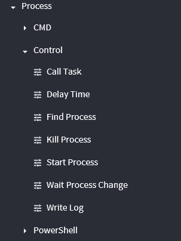

## 1. Process 이벤트

### Start Process()

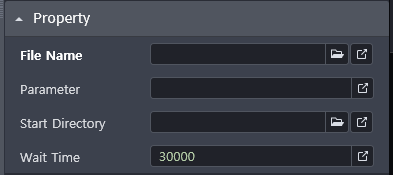

- 프로세스 시작 기능

- 권장하지 않지만 존재하는 기능

- .exe 파일로 되있어야 함. ( File Name - "excel.exe")

- 바로가기 파일이 .exe파일을 가리키고 있으면 같은 결과가 나옴.

- Parameter - 엑셀 파일의 위치를 지정 해주면 된다.
  
  - ex. "C:\\Users\\user\OneDrive\문서\GitHub\upark153.github.io"
  
  - '\' 특수문자로 인식을 하기 때문에 
    
    '\\\' 경로 에 2개를 붙여 줘야 한다.

- Start Workbook에서는 변수로 지정 해서 다른 이벤트에 넘겨 줄 수 있지만, Start Process는 변수 지정이 불가능.

### Kill Process()

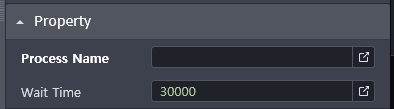

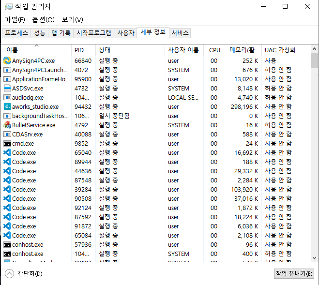

- Process Name에 ".exe"를 적어주면 그 프로세스가 종료가 된다.

### Find Process()

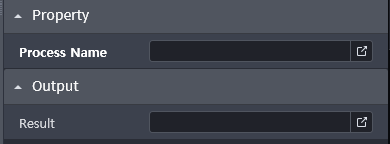

- 마찬가지로 .exe파일을 넣을 수 있다.

- 있으면 True, 없으면 False 반환

- bool 변수를 만들고, 변수 지정

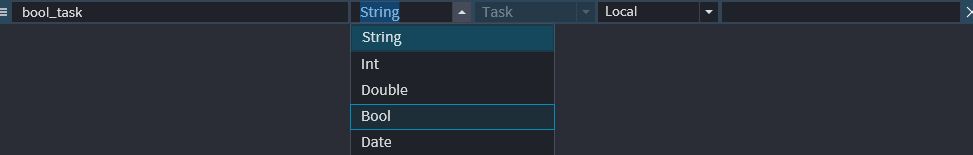

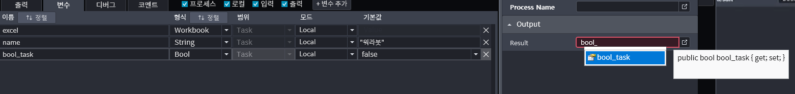

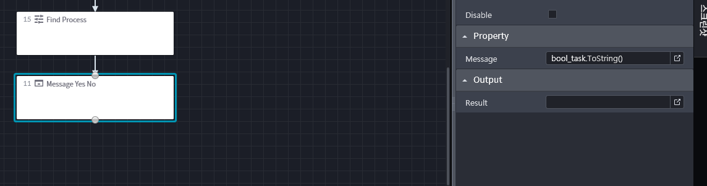

----------------------------------------------------------------

## 2. Window 이벤트

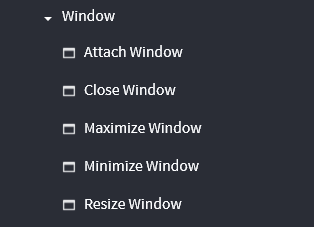

### Attach Window()

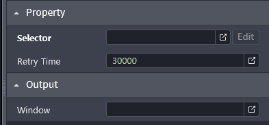

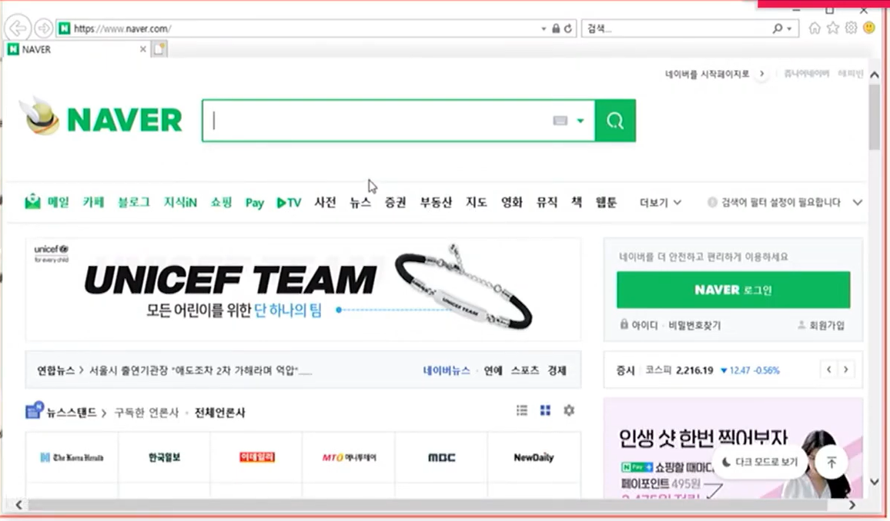

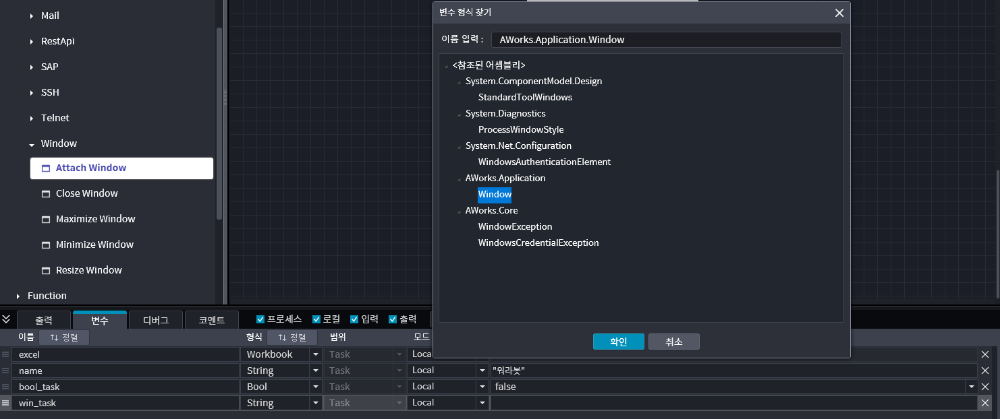

- widow 정보를 담을 변수를 지정 해 준다.

- output window에 변수를 지정 해 주면, attach window() 이벤트로 열린 윈도우 정보를 담을 수 있다.

### Maximize Window()

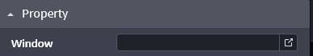

- 어떤 윈도우 창을 전체 창으로 만들 것인지 변수를 입력 해 준다.

### Minimize Window()

- 마찬가지로 최소화 할 창의 변수를 입력 해 준다.

### Close Window()

- 창 닫기 기능 ( 변수 지정 )
