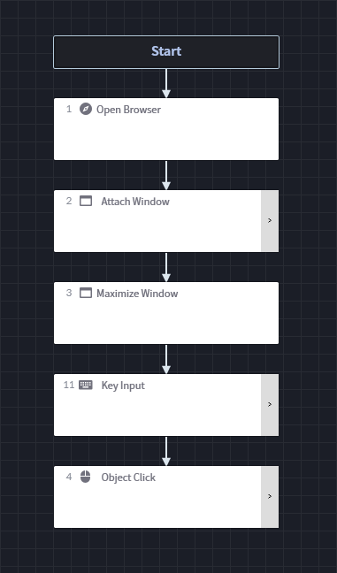
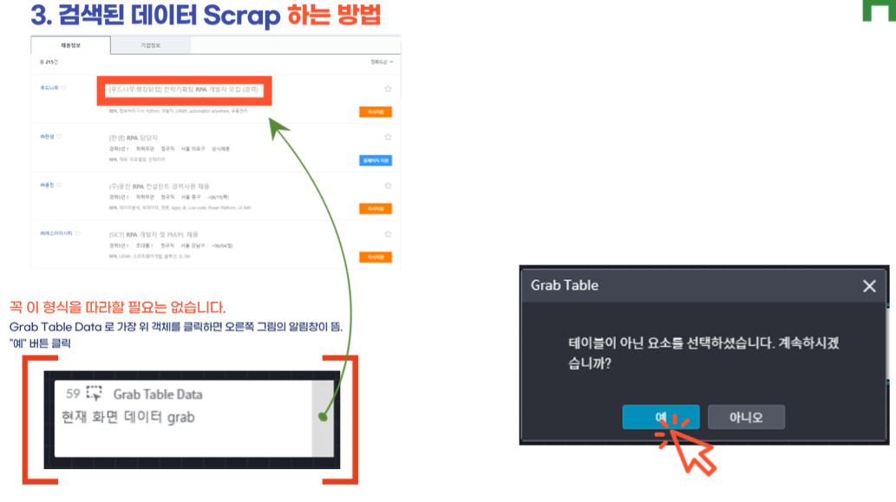
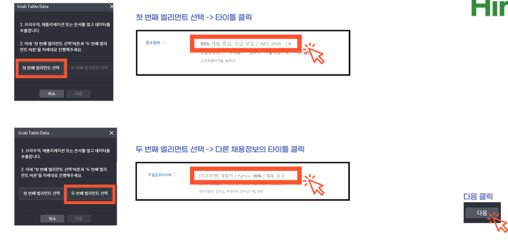
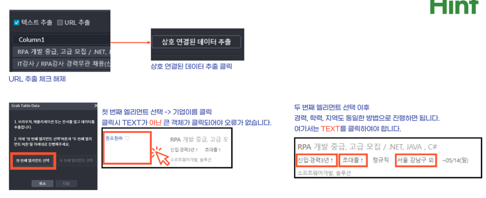
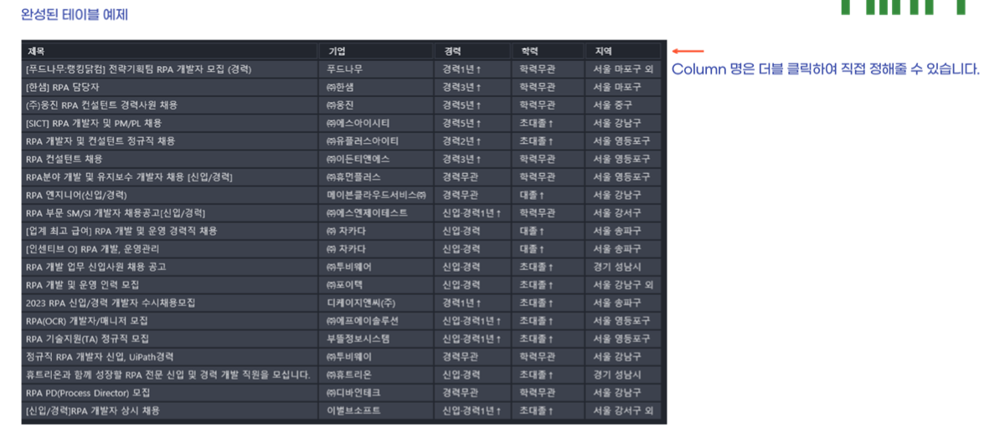

# 채용공고 데이터 얻기

## - 연습 사항 ( 여러 개의 Task를 구성 해 보기 )

### 1. 잡코리아에 접속 후 RPA를 검색한다. ( browser_task)

#### 1.1 Open Browser()

- 원하는 Browser 페이지를 여는 역할

- 브라우저 타입 확인 및 접속 시간 확인 

- Output - 변수 브라우저 타입

#### 1.2 Attach Window()

- 현재 실행중인 Window 중 원하는 window를 첨부하는 역할

- Indicator 을 사용하여 selector 에 window 지정

- Output - 변수 window 타입

#### 1.3 Maximize Window()

- 창 키우는 역할

- Property에 변수 window 타입

#### 1.4 Key Input()

- Keyboard를 이용한 입력 관련 기능 역할

- Input 값 입력 방법 상세
  
  - 1) 쌍따옴표("  ") 안에 입력된 값은 String으로 간주하여 Text 형태로 출력합니다.
    
    2) 쌍따옴표 안에 '제어문자'가 있는 경우 - 입력 : "aa + Enter + bb", 출력 : aa + Enter + bb

- Indicator로 Object 선택 가능

- Verify - 입력이 잘 들어갔는지 검증하는 옵션. 입력 값과 실제 입력 값을 비교합니다. 값이 다른 경우 한번 더 Key 입력을 시도합니다.
  
  - Checked : 값이 다른 경우 한번 더 Key 입력을 시도
  
  - Unchecked : 값이 달라도 무시하고 입력 값으로 처리

- Empty Field - object가 설정된 경우, object에 입력된 기존 값을 삭제 후 key 입력을 다시 시도 
  
  - Checked : 값이 다른 경우 한번 더 Key 입력을 시도
  
  - Unchecked : 값이 없어도 무시하고 입력 값으로 처리

- Focus On - 인식된 객체에 대하여 Focus On 기능 선택
  
  - Checked : 강제로 Focus On 함
  
  - Unchecked : Focus Off하지 않거나 Disable 됨

- Output - 변수 Boolean 타입

#### 1.5 Object Click()

- 선택한 Object를 클릭하는 역할

- Indicator로 선택한 object에 대한 Selector을 가져 온다.

- Output - 변수 Bollean 타입

### 2. 검색된 정보들을 Scrap 한다. ( Scrap_task )

#### 2.1 Object Match()

- Object를 선택하여 해당 위치에 Object가 있는지 판단하는 역할 

- Indicator로 선택한 Object에 대하여 Selector을 가져온다.

- Output - 변수 Boolean 타입

#### 2.2 If 조건문( True, False )

#### 2.3 Grab Table Data()

- 지정된 Object를 포함하는 Table 형식의 데이터를 DataTable로 반환하는 역할.

- 웹 환경에서 Table이나 Non-Table 형태의 데이터를 인식하고 관련 데이터를 모두 가져오는 기능
  
  > *주의* 
  > 
  > Event Item을 실행 시에는 해당 Object가 표시되는 웹 페이지가 실행되고 있어야 한다.

- Max Rows - ( Type: Int, Default: 0 - Unlimited )

- Column Headers - 추출한 DataTable의 첫 번째 행을 Column Headers로 사용할 것인지 선택한다.
  
  - Checked : 첫 번째 행을 Column Headers Name으로 사용
  
  - Unchecked : 첫 번째 행을 Column Headers Name으로 사용하지 않음.

- Output - 변수 DataTable 타입 지정 ( 변수 저장 )

> *주의*
> 
> Scrap 대상이 Table 형식인 경우에는 해당 Table 일괄하여 가져와서 Show 버튼을 통하여 Preview로 확인하여 필요한 Data를 Scrap할 수 있다. 하지만 Non-Table 형식의 Data는 순차적으로 읽어와서 확인하고 추가적으로 Data를 가져오는 방식이다. 사용방법에 대한 숙지가 필요하다.

 

#### 2.4 Loop DataTable( 가져온 Table  loop )

- DataTable에 저장된 Row 개수만큼 반복을 수행하는 역할.
  
  ( 각 Loop마다 Index 0번부터 차례로 Row Alias에 반환 )

- DataTable - 실행하고자 하는 DataTable 변수 명을 지정하는 기능 - data_task

- Row Alias - Loop DataTable 내에서 Get/Set Data와 연결하기 위한 Row Alias를 직접 입력하는 기능 ( 타입 : String ) - dr_Select

#### 2.5 Get Data( 현재 Row의 제목 Get )

- Loop DataTable Event Item 내에서 작동하며, 해당 Loop의 Row에 지정된 Column의 Data를 반환하는 역할
  

- Row - 가져오고자 하는 Column의 Row를 변수로 지정한다. ( 타입 : DataRow ) - dr_Select

- Column Name - 해당 Row에서 읽을 Column의 이름을 지정한다 ( 타입 : String ) -       "제목"

- > Name 혹은 Index 항목 중 1개만 선택입력 가능

- Output - 읽은 Data를 저장하고자 하는 변수 명을 지정한다. ( 타입 : String, Int, Double, Boolean, Data, Object ) - str_Title

#### 2.6 If ( 가져온 텍스트에 RPA가 포함되어 있는가 ? )

- condition - str_Title.Contains("RPA")

#### 2.7 다음 페이지 넘어가기

> 다음 페이지를 넘어가는 것은 언제일까? 데이터 스크랩을 했다.
> 
> 물론 1번째 페이지라 관련 데이터만 스크랩 됬다는 걸 짐작할 수 있다.
> 
> 하지만. 짚고 넘어가야 하지 않을까? 
> 
> 그래야 더 안전하지 않을까?
> 
> 어림짐작으로 알 수 있는 사실을 컴퓨터에게도 알려줘야 한다.
> 
> 그렇다면 다음 페이지 넘어가기 전에 저장된 데이터테이블 변수의 Row를 확인하여,  RPA라는 단어가 포함되어있는지 확인하고 , 포함되어 있지 않은 데이터라면 정제하는 작업이 선행 되어야 할 것이다.
> 
> 흠..우선 이 고민은 추후에 해 보기로 하고 우선 Task를 완성 해 보자.

### 3. 다음 페이지 넘어가기

#### 3.1 Invisible Area Click()

- 다른 어플리케이션에 의해 Window에서 가려진 영역의 이미지를 클릭하는 역할

### 3. RPA와 관련된 채용공고 데이터만 Excel에 저장한다.

## - 심화 과제

### 1. 기본 과제에서 기업정보 데이터를 추가한다.

### 2. 추가된 기업 정보는 새로운 Sheet에 저장한다.