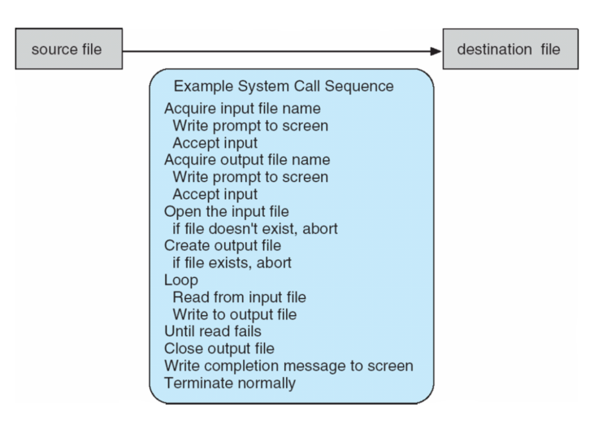
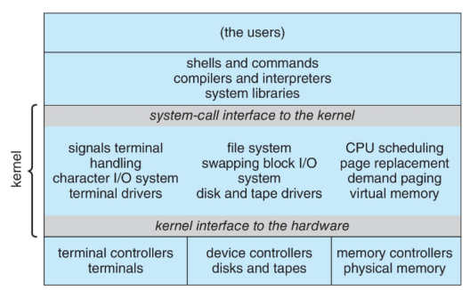
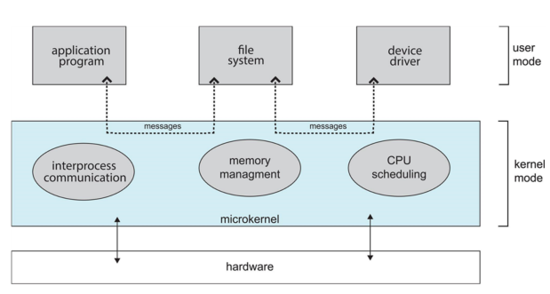

---

layout: single
title:  "Chapter2"
categories: OS
tag: OS
toc: true
author_profile: false
sidebar:
 nav: "docs"

---

> ---
>
> # Chapter Objectives
> 
> ● Identify services provided by an operating system.
> 
> ● Illustrate how system calls are used to provide operating system services
> 
> ● Compare and contrast monolithic, layered, microkernel, modular and hybrid strategies for designing operating system.
>    
>● Illustrate the process for booting an operating system.
> 
>● Apply tools for monitoring operating system performance.
> 
>● Design and implement kernel modules for interacting with a Linux kernel.

## 2.1 Operating System Services

OS는 프로그램의 실행과 프로그램과 사용자를 위한 서비스를 위한 환경을 제공한다.

OS 서비스의 하나의 세트는 사용자에게 유용한 기능을 제공한다.

● User interface : UI는 몇가지 형태가 있는데 CLI, GUI, touch screen, batch 등이 있고 대부분 GUI를 사용한다.

● Program execution : 시스템은 프로그램을 메모리에 적재할 수 있어야 하고 그 프로그램을 실행할 수 있어야 한다. 실행을 정상적이든 비정상적이든 종료할 수 있어야 한다.

● I/O operations : 실행중인 프로그램은 I/O가 필요하고, I/O는 파일 또는 I/O 장치를 포함한다.

● File system manipulation : 파일 시스템은 특히 중요한데, 프로그램은 파일과 디렉토리를 읽고 써야 하고, 그들을 만들고 삭제하고 검색하고 파일 정보를 나열하고 권한을 관리해야 한다.

● Communications : 프로세스는 같은 컴퓨터 또는 네트워크로 연결된 컴퓨터들 간에 정보를 교환할 수 있다

● Error detection : OS는 지속적으로 일어날 수 있는 에러를 감지해야 한다. 에러는 CPU 그리고 메모리 하드웨어, I/O 장치, 사용자 프로그램에서 일어날 수 있다. 각 타입의 에러에 대해서, OS는 정확하고 일관성있는 computing을 위해 적절한 행동을 취해야 한다. debugging facility는 사용자와 프로그래머의 효율적으로 시스템을 사용하는 능력을 매우 향상시켜준다.

● Resource allocation : 여러 사용자 또는 작업이 동시에 돌아갈 때, 자원은 각각에 할당되어야 한다. (CPU cycle, 메인 메모리, 파일 저장소, I/O 장치)

● Logging : 어떤 사양조가 얼마만큼의, 어떤 종류의 컴퓨터 자원들을 사용했는지 추적할 수 있다.

● Protection and security : 다중사용자 또는 네트워크로 연결된 컴퓨터 시스템에 저장된 정보의 소유자는 그러한 정보의 사용을 통제하고 싶어할 수 있고, 동시에 일어난 프로세스들은 서로 방해를 하면 안된다. Protection은 시스템 자원의 모든 접근이 통제돼있음을 보장해야 한다. 외부인으로부터의 시스템의 security는 사용자 인증을 요구하고, 외부 I/O장치를 유효하지 않은 접근 시도로부터 보호하는 것으로 확장된다.

# 2.2 User and Operating System Interface

 앞서 OS의 사용자를 위한 몇가지 인터페이스를 살표봤다. 세가지가 있는데, 그 중 한가지인 CLI, command interpreter는 사용자가 직접적으로 명령을 입력해서 OS에 의해 실행되도록 하는 방법이다.

## 2.2.1 Command Interpreters

CLI는 직접적인 명령을 입력하는 인터페이스의 형식으로, 가끔은 커널에서 구현되고 또 가끔 시스템 프로그램에서 구현된다. 명령을 사용자로부터 가져와서 실행한다. 빌트인 명령일 때도 있고, 어떨때는 프로그램의 이름이 명령인 경우도 있다. 후자인 경우, 새로운 기능을 추가하는 것은 쉘 수정이 필요하지 않다.

## 2.2.2 Graphical User Interface

사용자 친화적인 desktop metaphor interface로, 마우스, 키보드 모니터를 주로 사용하고, 아이콘은 파일, 프로그램, 동작 등을 나타낸다. 인터페이스의 객체의 다양한 마우스 버튼은 다양한 동작을 수행한다. 대부분 시스템은 CLI, GUI 인터페이스를 둘다 사용한다. Microsoft Windows는 커맨드쉘의 CLI가 곁들여진 GUI 방식이다. Mac OS X는 UNIX kernel 그리고 사용가능한 쉘이 있는  Aqua GUI 인터페이스이다. UNIX와 Linux는 선택적 GUI 인터페이스가 있는 CLI이다.

# 2.3 System Calls

 System call은 OS에 의해 사용가능하게 된 서비스에 인터페이스를 제공한다. system call은 C 또는 C++로 작성되고, 저레벨의 동작(예를 들어, 하드웨어에 직접 접근해야 하는 동작)은 어셈블리어로 작성된다.

## 2.3.1 Example 

  어떻게 OS가 system call이 이용가능하게 하는지 얘기하기 전에, system call이 어떻게 사용되는지 설명하는 예시를 보자. 한 파일을 다른 파일에 복사하는 UNIX cp 명령을 보면(파일 이름을 명령의 일부로 전달)

   cp in.txt out.txt

이 명령은 in.txt를 out.txt로 복사한다.

  두번째 접근으로, 파일의 이름을 사용자에게서 입력받는 방식이 있다.

interactive system에서, 이러한 접근은 일련의 system call이 필요하고, 스크린에 메시지를 띄우고, 키보드로부터 두 파일의 이름을 읽는 방식이다.(마우스로 아이콘을 선택 -> I/O system call이 필요하다)

  두 파일의 이름을 얻고 프로그램은 input file을 열고 outfile을 만들고 열어야 한다.(다른 system call 필요) 두 파일이 준비되고 나면, 반복문을 입력해 input file로부터 읽어들이고, output file에 쓴다(다른 system call). input에서 프로그램이 EOF에 도달하거나 하드웨어가 읽는데 실패했다는 것을 찾아낸다.

  결국 전체 파일이 복사되고 나면, 프로그램은 두 파일을 닫는다(두개 system call), 윈도우 또는 콘솔에 메시지를 출력(system call)한다. 최종적으로 정상적으로 종료한다(마지막 system call). 이 과정을 그림으로 나타내면 아래와 같다.

## 2.3.2 Application Programming Interface

  일초에 수천번의 system call이 일어나는 일은 흔하다. 보편적으로 application 개발자들은 API에 따라 프로그램을 디자인한다. API는 프로그래머들이 이용가능한 기능의 세트를 명시한다(각 함수에 전달되는 parameter, 프로그래머가 예상할 수 있는 리턴값 등을 포함한다).

  프로그래머들이 system call을 호출하는 것보다 API를 따라 프로그래밍 하는것을 선호하는 이유는 여러가지가 있다. 그중 하나는 이식성(portability)이다. API를 이용해 프로그램을 디자인하는 app 개발자들은 프로그램이 컴파일 되는것을 기대할 수 있고, 같은 API를 사용하는 어떠한 시스템에서 실행이 가능하다. 게다가 system call은 API보다 더 상세하고 어렵다.

  system call을 다루는데 중요한 요소는 run time environment(RTE)이다. 전체 소프트웨어 제품군은 컴파일러, 인터프리터 뿐 아니라 라이브러리, 로더같은 소프트웨어를 포함한 주어진 프로그래밍 언어로 쓰여진 application을 실행하는데 필요하다.

  전형적으로 각 시스템 콜에 숫자가 연관돼있다. system call interface는 OS 커널의 의도된 system call을 호출하고 system call의 상태 그리고 리턴값을 반환한다.

  caller은 시스템콜이 어떻게 구현되는지 또는 실행중에 어떤일을 하는지 알 필요가 없다. caller은 API에 따르고, 그 시스템 콜의 실행의 결과로써 OS가 어떤일을 하는지 이해해야 한다. 대부분의 OS 인터페이스의 디테일들은 API에 의해 프로그래머로부터 감춰진다. 가끔, 원하는 시스템콜의 ID보다 더 많은 정보가 필요하다. OS와 호출에 따라 정확한 정보의 타입과 양은 다르다. 세가지 보편적인 OS에 parameter를 전달하는 방법이 있다. 가장 간단한 방법은 parameter를 register에 전달하는 방법이다. 그리고 register보다 더 많은 parameter를 가질경우, block, table, memory, register에 parameter로써 전달되는 block의 주소에 parameter가 저장된다(Linux, Solaris). parameter은 프로그램에 의해 스택에 배치되거나 push되고, OS에 의해 스택에서 pop될 수 있다.

## 2.3.3 Types of System Calls

  System call은 6가지 카테고리로 나눠질 수 있다 : process control, file management, device management, information maintenance, communications, protection

# 2.4 System Services

  System program은 프로그램 개발과 실행에 있어서 편리한 환경을 제공한다. 그 종류에는

● File manipulation : 이러한 프로그램들은 파일과 디렉토리들을 생성, 삭제, 복사, 이름 바꾸기, 출력, 목록 작성, 그리고 일반적으로 접근하고 조작할 수 있다.

● Status information : 어떤 프로그램은 시스템에 날짜, 시간, 이용가능한 메모리, 디스크 공간, 사용자 수 같은 정보를 요청한다. 다른 프로그램은 더 상세한 작업, logging, 디버깅 정보를 제공한다. 보통, 이러한 프로그램은 형식을 지정하고 터미널이나 기타 출력장치로 출력한다. 어떤 시스템 구성 정보를 저장하고 검색하는 registry를 지원한다.

● File modification : 몇몇 텍스트 편집기들은 디스크나 다른 저장장치에 저장된 파일의 내용을 수정하고 생성할 수 잇다. 또한 파일의 내용을 검색하거나 텍스트의 변환을 수행하는 special command가 있을 수 있다.

● Programming language support : 프로그래밍 언어에서 흔히 있는 컴파일러, 어셈블러, 디버거, 인터프리터들은 OS와 함께 제공되거나 개별 다운로드를 통해 이용가능하다.

● Program loading and execution : absolute loaders, relocatable loaders, linkage editors, overlay loaders, debugging systems for higher level languages and machine language 제공

● Communications : 프로세스, 사용자, 컴퓨터 시스템간의 virtual connection을 만들기 위한 메커니즘을 제공한다. 사용자가 다른 사용자의 화면에 메시지를 보낼수 있게 하고, 웹페이지를 검색할 수 있게 하고, 이메일을 보낼 수 있게 하고, 원격으로 로그인 할 수 있게 하고, 한 장치에서 다른 장치로 파일을 이동시킬 수 있게 한다.

● Background services : 모든 범용 시스템에는 부팅시 시스템 프로그램 프로세스를 시작하는 방법이 있다. 어떤 프로세스는 그들의 작업이 끝난 후 종료되는 반면, 어떤 프로세스는 시스템이 종료되기 전까지 계속 실행되는 프로세스(services, subsystems, daemons라 불린다) 가 있다. 

● Application programs : 시스템과 관련이 없고 사용자에 의해 실행이 된다. 보통 OS의 부분이 아니며 명령, 마우스 클릭, 손가락 터치로 실행된다.

# 2.5 Linkers and Loaders

  보통 프로그램은 binary 실행파일로 디스크에 존재한다(a.out, prog.exe). 이 절에서, 프로그램 컴파일부터 프로그램을 메모리에 저장하는것 까지 알아보도록 하자.

  소스코드는 물리적 메모리 위치에 적재되도록 만들어진 object file로 컴파일된다(relocatable object file). 그 후 linker은 이러한 relocatable object file을 single binary executable file과 결합한다. 그리고 라이브러리를 include한다. loader은 binary executable file을 CPU 코어에서 실행할 수 있는 메모리에 적재하기 위해 사용된다. relocation은 최종 주소를 프로그램 파트에 할당하고 코드와 데이터를 조정한다.

  현대의 범용 시스템은 실행파일에 라이브러리를 link하지 않는다. 오히려 dynamically linked libraries(DLLs)는 필요할 때 load되며, 동일한 버전의 동일한 라이브러리를 사용하는 모든 사용자가 공유한다.

# 2.6 Why Applications Are Operating System Specifir

  근본적으로 한 OS에서 컴파일된 응용프로그램은 다른 OS에서는 실행가능하지 않다. 여러 OS들은 각자의 고유 system call을 제공한다(고유의 파일 포맷 등).

   · 응용프로그램은 파이썬, 루비같은 다양한 OS에서 사용가능한 인터프리터를 가진 interpreted language로 작성될 수 있다.

   · 응용프로그램은 가상머신을 포함하는 언어로 작성될 수 있다.(JAVA)

   · 응용프로그램 개발자는 컴파일러가 기계에 binary와 OS specific language를 생성하는 표준 언어 또는 API를 사용할 수 있다.

# 2.7 Operating System Design and Implementation

## 2.7.1 Design Goals

  시스템 디자인에서 첫번째 문제는 목표와 사양을 정의하는 것이다. 가장 높은 단계에서, 시스템 디자인은 하드웨어와 시스템의 타입(데스크탑/랩탑, 모바일, 분배, 실시간 ...)의 선택에 의해 영향을 미친다. 이 단계 너머에서의 요구는 명시하기 더 어렵다. 이 요구에는 두가지 타입, 사용자 목표와 시스템 목표가 있다.

  User goals : OS는 사용하기 편리하고, 배우기 쉽고, 믿을만하고 안전하고 빨라야 한다.

  System goals : OS는 디자인하기 쉽고 구현하고 유지하기 쉬워야할 뿐 아니라 유연하고 믿을만하고 에러가 없고 효율적이어야 한다.

## 2.7.2 Mechanisms and Policies

mechanism : 어떻게 할 것인가?

policies : 무엇을 할 것인가?  

policy와 mechanism을 분리하는 것은 매우 중요한 원칙이다.

## 2.7.3 Implementation

  OS가 디자인되면, 구현돼야 한다. OS는 많은 사람들이 오랫동안 작성한 많은 프로그램의 집합이기 때문에 OS가 어떻게 구현되는지에 대한 일반적인 진술을 하기 어렵다.

  초창기 OS는 어셈블리어로 작성됐다. 현재는 대부분 C나 C++같은 고레벨 언어로 작성되었고, 적은양의 시스템이 어셈블리어로 작성되었다. 고레벨 언어로 작성될경우, 빨리 작성할 수 있고, 이해하기 쉽고, 코드가 더 컴팩트해지며  디버깅하기가 쉽다. 그리고 다른 하드웨어로 이식하기도 쉬워진다. 유일한 단점은 속도가 느리고 저장공간을 많이 차지한다. 비록 전문적인 어셈블리어 프로그래머가 효율적인 작은 루틴을 만들 수 있지만, 현대의 컴파일러가 복잡한 분석과 정교한 최적화를 통해 최적의 코드를 만들어낸다.

# 2.8 Operating System Structure

MS-DOS : 다양한 기능을 지원하는 것이 목적

UNIX : 계층단위로 나눔

## 2.8.1 Monolithic Structure

  OS를 구성하는 가장 간단한 구조는 구조가 없는 것이다. kernel의 모든 기능을 하나의 주소공간 안에서 실행되는 single, static binary file에 넣는다. 이러한 접근을 monolithic structure 이라 한다. monolithic kernel의 명백한 단순함에도 불구하고, 구현과 확장하는것이 어렵다. 하지만, monolithic kernel은 뚜렷한 장점이 있고, system call interface에서 overhead가 거의 발생하지 않고, kernel 내의 소통이 빠르다.

## 2.8.2 Layered Approach

  Layered approach는 OS를 여러개의 층으로 나누는 방식이다. 아래 층은 (layer 0) 하드웨어이고, 가장 높은 층은(layer N) 사용자 인터페이스이다. layered approach의 주요 장점은 구성과 디버깅의 단순함이다. 각 층은 낮은 층의 서비스와 기능을 사용하도록 선택된다.

## 2.8.3 Microkernels 

  Microkernel은 OS가 너무 커져서 중요하지 않은 기능을 빼서 사용자 수준의 프로그램으로 구현하는 방법. 필요할 때마다 기능들을 사용한다. 그리고 이 기능들은 메모리나 하드웨어에 적재해 둔다. 장점으로 확장하기가 쉬워지고, 새로운 기기에 이식하기가 쉬워지고, 신뢰할 수 있고(프로그램이 크면 문제를 일으킬 확률이 높다.)  안전하다.

단점으로는 사용자공간에서 커널공간사이 소통을 microkernel을 통해 message를 전달해야 하므로. performance overhead가 커진다.

## 2.8.4 Modules

  loadable kernel modules(LKMs)은  기능을 모두 떼서 실시간으로 동작하는 커널에 실시간으로 붙일 수 있다. microkernel은 통신을 통해 기능을 제공하지만, LKMs은 링크를 통해 기능을 제공한다. LKMs은 객채지향 접근방식을 사용하고, 각 코어의 구성요소는 분리돼있고,  각각은 인터페이스를 통해 소통하며, 각각은 커널 내에서 필요할 때 적재할 수 있다.

## 2.8.5 Hybrid Systems

  Hybrid system은 상황에 따라 monolithic 방식을 사용할 수 있고, microkernel을 사용할 수 있는 방식(실제로는 한가지 구조만 채택하는 OS는 거의 없다.)

## 2.10 Operating System Debugging

  디버깅은 에러나 버그를 찾고 고치는 것이고, OS는 에러 정보를 포함하는 log file을 만들어서 기록한 뒤, 에러가 생기면 해당하는 메모리를 복사(core dump)해서 에러가 났을 때 어떤 메모리 상태였는지 블랙박스같은 역할을 함.

> # Chapter Objectives
>
> ● Identify services provided by an operating system.
>
>  : 운영체제는 파일 시스템 관리, 프로세스 관리, 메모리 관리, 입출력 관리, 네트워킹, 보안, 사용자 인터페이스 등의 서비스를 제공한다.
>
> ● Illustrate how system calls are used to provide operating system services
>
>  : 시스템 콜은 응용프로그램이 운영체제의 서비스를 요청하는 인터페이스이다. 응용프로그램은 시스템 콜을 호출하여 운영체제에게 특정 작업을 요청하고, 운영체제는 해당 작업을 처리한 후 결과를 응용 프로그램에게 반환한다.
>
> ● Compare and contrast monolithic, layered, microkernel, modular and hybrid strategies for designing operating system.
>
>   · monolithic은 모든 운영체제 서비스를 하나의 커널 안에 구현하는 방식.
>
>   · layered는 각각의 서비스를 층으로 나눠 구현하고 상위 계층이 하위 계층의 서비스를 사용하는 방식이다. 
>
>   · microkernel은 핵심 기능을 작은 커널에 구현하고, 나머지 서비스는 사용자 공간의 응용프로그램 형태로 구현하는 방식이다. 
>
>   · modular은 운영체제를 독립적인 모듈로 구성하여 필요한 모듈을 링크하는 방식이다. · hybrid는 앞의 여러 방식을 조합하여 사용하는 말그대로 하이브리드 방식이고, 커널 내부에 일부 서비스를 포함하면서도 외부에서 동작하는 모듈을 혀용한다.
>
> ● Illustrate the process for booting an operating system.
>
> · 전원공급 : 전원이 켜진다.
>
> · 기본 입/출력 시스템(BIOS) 실행 : BIOS는 컴퓨터의 하드웨어를 초기화하고, 부트 디바이스를 검색하여 부트로더를 로드한다.
>
> · 부트로더 실행 : 부트로더는 운영체제의 커널을 메모리로 로드한다. 
>
> · 운영체제 커널 로드 : 부트 로더가 운영체제 커널을 메모리로 로드한다.
>
> · 초기화 및 시스템 서비스 실행 : 운영체제 커널은 초기화 과정을 거친 후, 필요한 시스템 서비스를 실행한다.
>
> ● Apply tools for monitoring operating system performance.
>
> · Top : 리눅스와 유닉스 기반 시스템에서 프로세스의 실시간 상태와 자원을 모니터링하는 명령어/
>
> · Monitor : 윈도우 운영체제에서 제공되는 작업 괸리자와 성능 모니터를 활용하여 프로세스, 메모리, CPU 사용량, 네트워크 등을 모니터링 할 수 있다.
>
> · Profiler : 응용 프로그램의 실행 시간, 함수 호출 및 자원 사용 등을 분석하여 성능 병목현상을 식별하는 도구.
>
> · 로그 분석도구 : 운영체제와 응용프로그램에서 생성되는 로그 파일을 분석하여 성능문제나 오류를 추적할 수 있다.
>
> ● Design and implement kernel modules for interacting with a Linux kernel.
>
> 커널 모듈설계
>
> · 상호작용하고자 하는 기능을 식별하고 목적에 맞는 모듈을 설계한다.
>
> · 커널 모듈의 인터페이스를 정의한다.
>
> · 필요한 데이터 구조 및 알고리즘을 설계하고, 모듈 내부에서 사용될 변수와 함수를 정의한다.
>
> 커널 모듈구현 
>
> · 모듈을 개발하기 위해 C/C++프로그래밍 언어를 사용한다.
>
> · 커널 모듈의 코드를 작성하고, 필요한 헤드파일을 include
>
> · 커널 API를 사용하여 커널과의 상호작용을 구현한다.
>
> · 커널 모듈의 컴파일과 링크를 수행하여 실행 가능한 모듈파일을 생성한다.
>
> 커널 모듈의 로드 및 언로드
>
> · 모듈을 로드하기 위해 insmod 명령어를 사용한다. 
>
> · 모듈을 언로드하기 위해 rmmod 명령어를 사용한다.
>
> · 모듈이 로드되면 해당 기능을 사용할 수 있으며, 필요에 따라 모듈을 수정하고 재컴파일하여 업데이트 할 수 있다.
>
> 