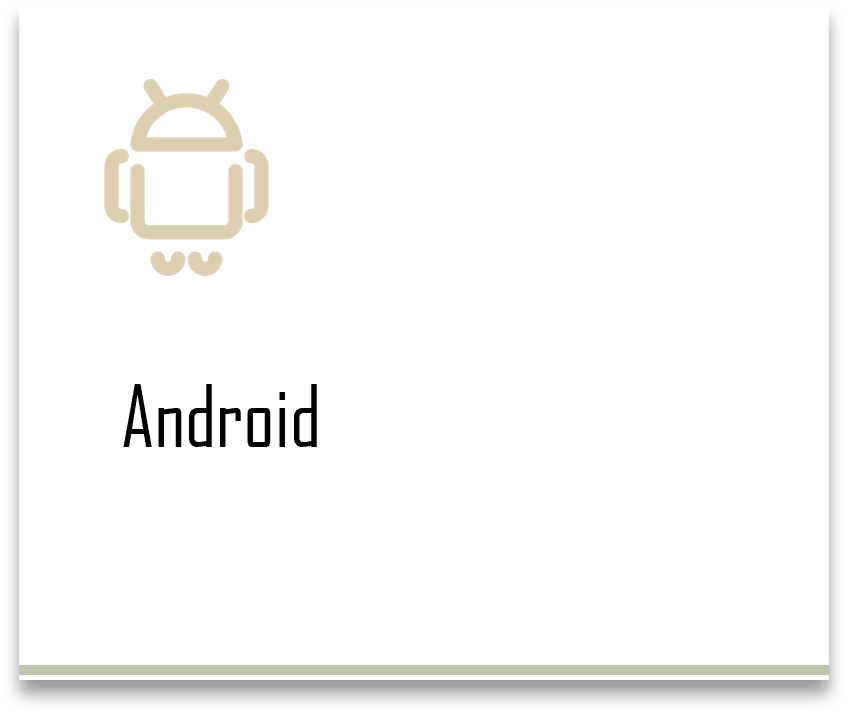
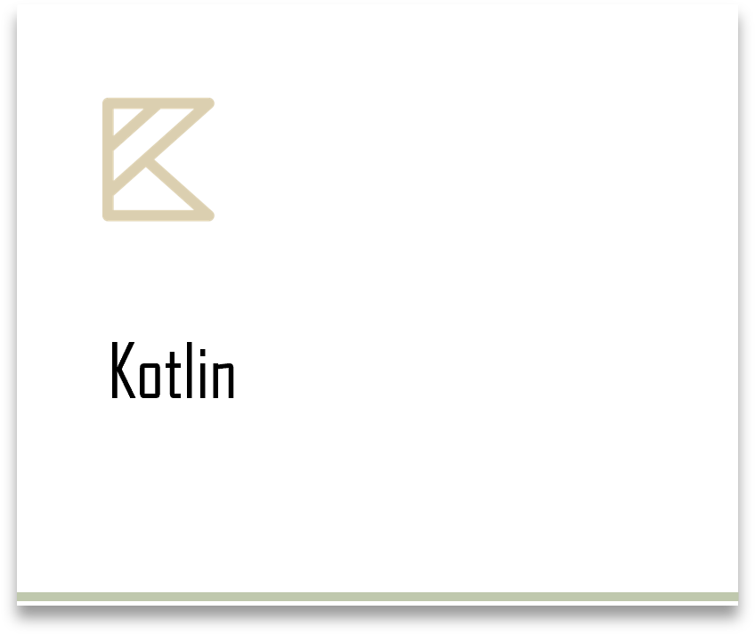
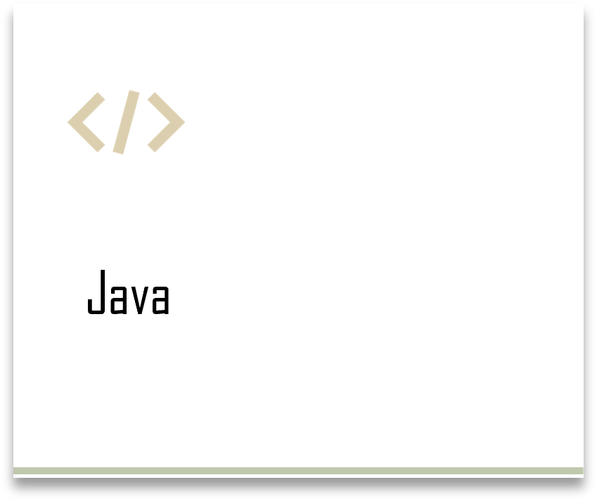
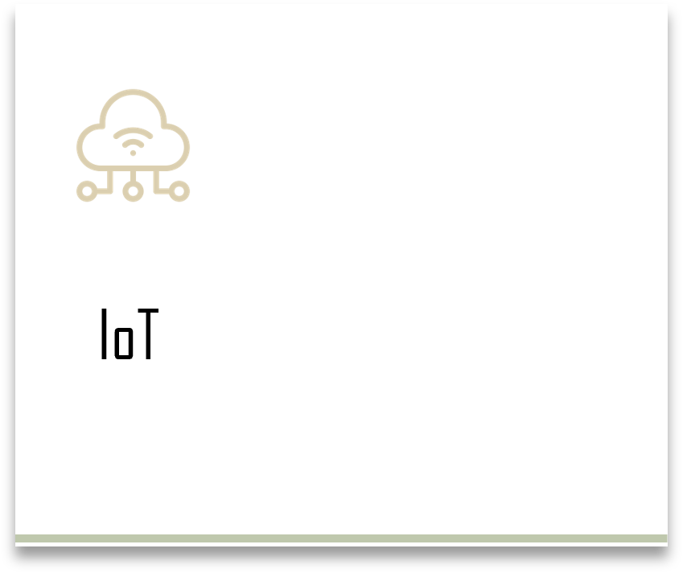

**"Connect the dots"**  

저는 다양한 경험과 새로운 것에 도전하고 탐구하는 것을 좋아합니다.  다양한 경험들과 생각들을 녹여서 앱으로 서비스를 제공하는 것이 저의 목표입니다. 컴퓨터 하나로 사람들에게 감동을 줄 수 있다는 매력에 저는 컴퓨터공학과로 진학하여 IT 지식을 배우고 있습니다. 다양한 분야에 관심이 많아서 IoT, 메타버스, 게임 개발, 인공지능에 대한 교육을 듣고 프로젝트를 진행했습니다.  또한 새로운 도전을 위해 지능형 영상 분석 연구실에 들어가 세미나, 연구 과제, 학술 대회 등 다양한 활동에 참여하고 있습니다.  연구 과제로 참여한 ar을 활용한 지중화 제어반 관리 애플리케이션 개발을 진행하면서 처음으로 안드로이드 개발을 맡아 진행하면서 안드로이드 개발에 큰 재미를 느꼈습니다.

**이를 계기로 저는 새로운 것에 도전하고 배울 수 있는 안드로이드 개발 전문가가 되는 것을 목표로 하고 있습니다.**

2022년 10월부터 저는 안드로이드 개발 공부를 본격적으로 시작하였고 지금까지 작물 질병해 검출 앱, 블루투스를 활용한 가로등 관리 앱, Stable Diffusion을 활용한 달리기 앱, 장애인 맞춤형 일자리 추천 앱 개발 프로젝트를 진행하였고 2022 스마일 게이트 Winter Dev Camp에 참여하여 개인 프로젝트로 블로그 앱 개발 및 팀 프로젝트를 진행했습니다. 앞으로도 저는 끊임없이 도전하고 배울 것입니다.
  

			   		   		 
