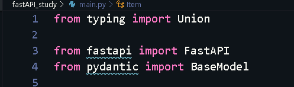
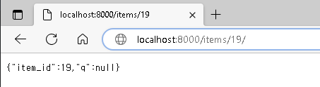
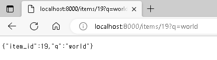
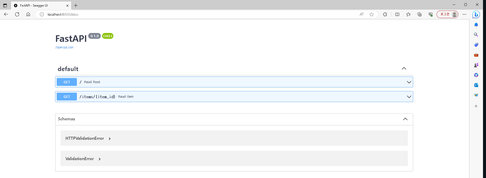
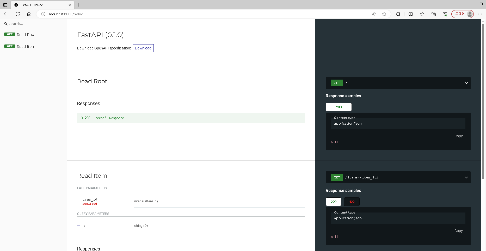
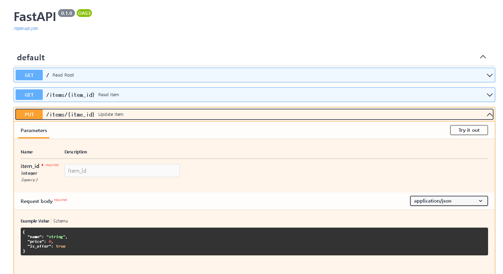

# FastAPI 학습.

## 1. FastAPI란 ?

> FastAPI는 현대적이고, 빠르며, 파이썬 표준 타입 힌트에 기초한 Python3.6+의 API를 빌드하기 위한 웹 프레임 워크입니다.

- 빠르다. NodeJS 및 Go와 대등할 정도로 매우 높은 성능.

[FastAPI 공식 문서]([FastAPI (tiangolo.com)](https://fastapi.tiangolo.com/ko/))

## 2. 가상환경 설정하기

[가상환경 설정]([개발과 일상 (tistory.com)](https://ksr930.tistory.com/306))

[가상환경 패키지 관리]([파이썬 가상환경 venv 사용하기 (패키지 쉽게 관리하기) - 아무튼 워라밸 (hleecaster.com)](https://hleecaster.com/python-venv/))

> 매번 할때마다 설정 해 주는 것이 좋다. 환경 설정 겹치는 것 방지하기 위해서.

1. 가상환경을 만들고자 하는 폴더로 이동한다
   
   - cd (폴더이름)

2. python -m venv venv_fastAPI 입력

3. <가상환경이름>\Scripts\activate 입력
   
   - 가상환경 활성화

> 가상환경을 비활성화 하려면 deactivate 라고 치면 된다.

 

## 3. 라이브러리 설치하기.

- pip install fastapi "uvicorn[standard]"

- pip install --upgrade pip

- touch main.py (리눅스) 
  
  - fsutil file createnew main.py(파일이름.확장자) 0(사이즈)

- pip freeze - 설치된 패키지 목록

- pip freeze > requirements.txt - 프로젝트 폴더 안에 txt파일이 생성되며 가상환경 목록이 작성됨. 
  
  > 나중에 다른 가상환경에 이 목록을 똑같이 설치하거나 삭제할 때 유용하다.
  > 
  > 만약 다른 가상환경에 이 패키지들을 한 방에 설치하려면 이 텍스트 파일을 새로운 프로젝트 폴더 안에 가져와서 pip install -r requirments.txt 라고 써주면 된다. 내가 사용했던 가상환경, 그 안에 설치된 패키지들을 한 방에 삭제하고 싶다면 그냥 과감히 venv로 생성한 가상환경 이름의 폴더를 휴지통으로 보내면 끝이다. ( 가상환경을 삭제 하는 별도의 명령어는 없다. )

- 에디터 사용 할 시 터미널 확인 필수. 

### 3-1. 밑줄로 인식을 못할 경우



- python path 를 잡아주어야 한다.

- Ctrl + Shift + P -> Python select interpretor

- Find -> 해당 가상환경 파일 경로 python.exe 

## 4. 코드 작성 하기.

### 4-1. 실행 코드 예제

```main.py
from typing import Union

from fastapi import FastAPI

app = FastAPI()

@app.get("/")
def read_root():
    return {"Hello": "World"}

@app.get("/items/{item_id}")
def read_item(item_id: int, q: Union[str, None] = None):
    return {"item_id": item_id, "q": q}
```

```
uvicorn main:app --reload
```

> localhost:8000/items/19



> localhost:8000/items/19?q=world



> localhost:8000/docs



> localhost:8000/redoc




```from pydantic import BaseModel 추가
from typing import Union

from fastapi import FastAPI
from pydantic import BaseModel


app = FastAPI()

class Item(BaseModel):
    name: str
    price: float
    is_offer: Union[bool, None] = None


@app.get("/")
def read_root():
    return {"Hello": "World"}

@app.get("/items/{item_id}")
def read_item(item_id: int, q: Union[str, None] = None):
    return {"item_id": item_id, "q": q}

@app.put("/items/{itme_id}")
def update_item(item_id: int, item: Item):
    return {"item_name" : item.name, "item_id": item_id}

```


- 실행결과
  
  
