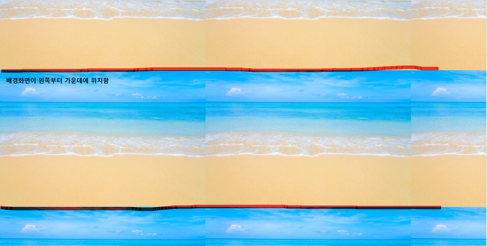
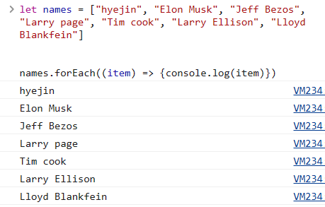
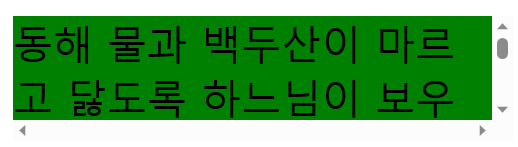
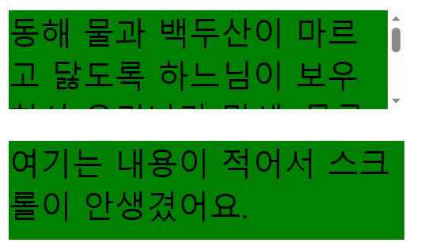

<br/>


# ◆Todo list - javascript

```javascript
let taskinput = document.getElementById("task-input");
let addbutton = document.getElementById("add-button");
let tabs = document.querySelectorAll(".tab-list span");
let underLine = document.getElementById("under-line");
let selectedMenu = "tab-all";
let tasklist=[];
let filterList=[];
let mode = "all"
let color =[" #FCE4EC", "#F8BBD0","#F48FB1", "#F06292","#EC407A","#E91E63","#D81B60","#C2185B","#AD1457","#880E4F","#FF80AB","#FF4081","#F50057","#C51162"];

addbutton.addEventListener("click",addtask);
function addtask(){
    if(taskinput.value == ""){
        alert("내용을 입력해 주세요");
        return;
    }else{
        let task = {
            id : randomIDGenerate(),
            taskcontent: taskinput.value,
            iscomplet : false,
            backgorundcolor:colorchange(),
        };
        console.log(task);
        tasklist.push(task);
        taskinput.value = "";
    }
    render();
}

tabs.forEach((menu)=>menu.addEventListener("click", (e)=>underlineindicator(e)));
function underlineindicator(e){
    selectedMenu = e.target.id;
    underLine.style.width = e.target.offsetWidth + "px";
    underLine.style.left = e.target.offsetLeft + "px";
    e.target.offsetTop + (e.target.offsetHeight) + "px";
}

for(let i =1; i<tabs.length; i++){ 
    tabs[i].addEventListener("click",function(event){
    filter(event);
    });
}

function filter(event){
    mode = event.target.id;
    filterList=[]
    if(mode === "all"){
        render();
    }else if(mode === "ongoing"){
        for(let i =0; i<tasklist.length; i++){
            if(tasklist[i].iscomplet == false){
                filterList.push(tasklist[i]);
            }
        }
        render();
    }else if(mode === "done"){
        for(let i =0; i<tasklist.length; i++){
            if(tasklist[i].iscomplet == true){
                filterList.push(tasklist[i]);
            }
        }
        render();
    }
}

function render(){
    let list =[]
    if(mode === "all"){ 
        list = tasklist;
    }else if(mode === "ongoing" || mode === "done"){ 
        list = filterList;
    }

    let resultHTML ='';
    for(let i=0; i<list.length; i++ ){
        if (list[i].iscomplet == true){
            resultHTML += `<div class = "task" >
            <span  class ="task-done">${list[i].taskcontent}</span>
            <div id="button-box">
            <button onclick = "togglecomplete('${list[i].id}')" class="reword-box"><i class="fa-solid fa-rotate-right fa-lg"></i></button> 
            <button onclick = "deletetask('${list[i].id}')" class="delete-box"><i class="fa-solid fa-trash fa-lg"></i></button>
            </div>
            </div>`;
        } else{
        resultHTML += `<div class = "task" >
        <span style="background-color : ${list[i].backgorundcolor}"> ${list[i].taskcontent}</span>
        <div id="button-box">
        <button onclick = "togglecomplete('${list[i].id}')" class="chcek-box"><i class="fa-solid fa-check fa-lg" style="width : 20px"></i></button>
        <button onclick = "deletetask('${list[i].id}')" class="delete-box"><i class="fa-solid fa-trash fa-lg"></i></button>
        </div>
        </div>`;
        }
    }
    document.getElementById("task-board").innerHTML = resultHTML;
}

function randomIDGenerate(){
    return Math.random().toString(36).substr(2, 16);
}

function colorchange(){
    let random = (Math.floor(Math.random()*13)+1);
    return color[random];
 }

function deletetask(id){ 
    for(let i=0; i<tasklist.length; i++){
        if(tasklist[i].id == id){
            tasklist.splice(i,1);
            break;
        }
    }
    render();
}

function togglecomplete(id){
    for(let i =0; i<tasklist.length; i++){
        if(tasklist[i].id == id){
           tasklist[i].iscomplet = !tasklist[i].iscomplet;
           console.log(tasklist[i]);
           break;
        }
    }
    render();
}

function runScript(e) {
    if(e.keyCode == 13) { 
        if(taskinput.value == ""){
            alert("내용을 입력해 주세요");
            return false;
        }else{
            let task = {
                id : randomIDGenerate(),
                taskcontent: taskinput.value,
                iscomplet : false,
                backgorundcolor:colorchange(),
            };
            console.log(task);
            tasklist.push(task);
            taskinput.value = "";
            render();
            return false;
        }
    }else{
        return true;
    }
}

let today = document.getElementById("Date");
today = new Date();
document.getElementById("Date").innerHTML =today.toLocaleDateString();
```

<br/>

``변수 지정``

```javascript
let taskinput = document.getElementById("task-input");
let addbutton = document.getElementById("add-button");
let tabs = document.querySelectorAll(".task-tab div");
let underLine = document.getElementById("under-line");
let selectedMenu = "tab-all";// tab을 정해주어야지 탭에 맞게 underline이 생김.

let tasklist=[];// 할일들을 배열로 할당함.(render함수에도 사용해야 되서 전역함수로 빼기)
let filterList=[];// 탭을 바꿀 때 taskList가 지워지지 않게 따로 배열 할당함.(render함수에도 사용해야되서 전역함수로 빼기)
let mode = "all"// 처음에 화면에는 모든 list들이 보여야 해서 all로 지정을 해준다.

let color =[" #FCE4EC", "#F8BBD0","#F48FB1", "#F06292","#EC407A","#E91E63","#D81B60","#C2185B","#AD1457","#880E4F","#FF80AB","#FF4081","#F50057","#C51162"];//할일들 목록의 바탕화면에 들어갈 색깔 배열 저장.
```

<br/>

``이벤트 설정``

````javascript
addbutton.addEventListener("click",addtask);// addbutton을 클리하면 addtask함수 실행.

tabs.forEach((menu)=>menu.addEventListener("click", (e)=>underlineindicator(e)));
function underlineindicator(e){// tabs(all, ongoing, done)을 클릭하였을 때 event 함수 적용.
    selectedMenu = e.target.id;// event가 발생하는 요소 id 호출 함수.(all, ongoing, done)
    underLine.style.width = e.target.offsetWidth + "px";// 아이템의 가로길이.
    underLine.style.left = e.target.offsetLeft + "px";// 아이템의 왼쪽만큼 여백.
    e.target.offsetTop + (e.target.offsetHeight - 4) + "px";// 아이템의 위쪽만큼 여백 및 아이템의 세로길이.
}

for(let i =1; i<tabs.length; i++){ 
        tabs[i].addEventListener("click",function(event){
        filter(event);});
}// tabs(all, ongoing, done)를 클릭 할때 마다 filter(event)이벤트를 실행.
 // 이때 filter(event)는 탭스를 클릭할 때마다 보여지는 리스트를 설정한 함수.
````

<br/>

``리스트의 객체설정``

```javascript
function addtask(){
    let task = {
        id : randomIDGenerate(),// 리스트의 각 고유번호 설정.
        taskcontent: taskinput.value,// 리스트 추가한 값의 이름.
        iscomplet : false,// ongiong, done 탭의 리스트 목록을 filtering하기 위해 bloean값 만듬.
        backgorundcolor:colorchange(),//할일들 추가시 배경화면 지정하기 위해 설정.
    };
    console.log(task);
    tasklist.push(task);// 리스트의 객체를 tasklist배열에 입력.
    render();// 화면표시를 위해 render 함수 사용.
}
```

<br/>

``리스트 목록 filtering``

```javascript
function filter(event){
  mode = event.target.id;// 이벤트가 발생한 타겟의 id값을 mode라고 변수지정.
  filterList=[]// filter함수와 tasklist의 호환될 수 있도록 새로운 배열을 만들어 if 사용해서 변경.
  if(mode === "all"){// 만약 id가 all 이라면 render함수를 실행.(전체 목록들 표시(tasklist))
  render();
  }else if(mode === "ongoing"){// 만약 id가 ongoing이라면 for문 실행.
           for(let i =0; i<tasklist.length; i++){
             if(tasklist[i].iscomplet == false){
             filterList.push(tasklist[i]);
           }
     }
     render();// tasklist배열값 중에 iscomplet 값이 false인 값만 filterlist 배열에 입력하고 for문이 끝나면 render함수 실행.
    }else if(mode === "done"){// 만약 id가 done이라면 for문 실행.
        for(let i =0; i<tasklist.length; i++){
            if(tasklist[i].iscomplet == true){
                filterList.push(tasklist[i]);
            }
        }
        render();// tasklist 배열값 중에 iscomplet 값이 true값만, filterlist 배열에 입력하고 for문이 끝나면 render함수 실행.
    }
}
```

<br/>

``화면에 출력될 리스트 내용``

```javascript
function render(){
   let list =[]// list가 tasklist 또는 filterlist인지에 따라 출력값이 달라져야 하기 때문에 list변수값을 설정.
   if(mode === "all"){ 
        list = tasklist;// mode가 all인경우 list 배열에 taskList 배열을 할당.
      }else if(mode === "ongoing" || mode === "done"){
        list = filterList;// mode가 ongoing이거나 done이였을 때 list 배열에 filterList 배열을 할당.
    }

    let resultHTML ='';
    for(let i=0; i<list.length; i++ ){
        if (list[i].iscomplet == true){// list배열의 iscomplet의 값이 true 이면, resultHTML변수에 저장.
            resultHTML += `<div class = "task" >
            <span  class ="task-done">${list[i].taskcontent}</span>
            <div>
            <button onclick = "togglecomplete('${list[i].id}')" class="reword-box"><i class="fa-solid fa-rotate-right fa-lg"></i></button> 
            <button onclick = "deletetask('${list[i].id}')" class="delete-box"><i class="fa-solid fa-trash fa-lg"></i></button>
            </div>
            </div>`;
        } else{// list배열의 iscomplet의 값이 false 이면, resultHTML변수에 저장.
        resultHTML += `<div class = "task" >
        <span style="background-color : ${list[i].backgorundcolor}">${list[i].taskcontent}</span>
        <div>
        <button onclick = "togglecomplete('${list[i].id}')" class="chcek-box"><i class="fa-solid fa-check fa-lg"></i></button>
        <button onclick = "deletetask('${list[i].id}')" class="delete-box"><i class="fa-solid fa-trash fa-lg"></i></button>
        </div>
        </div>`;
        }
    }
document.getElementById("task-board").innerHTML = resultHTML;// id가 task-board인 내용들을 resultHTML;변경.
}
```

<br/>

``리스트 램덤id값 설정``

```javascript
function randomIDGenerate(){
    return Math.random().toString(36).substr(2, 16);
}
```

<br/>

``list 배경색깔 램덤 설정``

```javascript
function colorchange(){
    let random = (Math.floor(Math.random()*13)+1);
    return color[random];
 }// color배열에 총 14가지의 색깔의 저장해두었기 때문에 Math.random()에 13까지 곱해준 뒤 
  // Math.floor함수를 사용하여 숫자를 정수로 바꾸고 
  // 0~13까지 출력되기 때문에 마지막에 1을 더해주면, 총 1부터~14까지 램던숫자 표현가능하다.
```

<br/>

``delete button 클릭시 사용할 함수``

```javascript
function deletetask(id){ 
    for(let i=0; i<tasklist.length; i++){
        if(tasklist[i].id == id){
            tasklist.splice(i,1);// i번째부터 1개 삭제를 뜻하기 때문에 해당 리스트가 삭제.
            break;
        }// 선택한 리스트가 tasklist[i]의 id와 같을 때 해당 리스트 삭제하고 if문 중단
    }
    render();
}
```

<br/>

``체크버튼 클릭시 사용할 함수``

```javascript
function togglecomplete(id){
   for(let i =0; i<tasklist.length; i++){
      if(tasklist[i].id == id){// 선택한 리스트가 tasklist[i]의 id와 같을 때 iscomplet값을 변경(ongoing과 done의 리스트목록을 구분하기 위해 설정함)
         tasklist[i].iscomplet = !tasklist[i].iscomplet;// bolean값을 반복하여 변화하고 싶을 때에는 "!" 사용.
         console.log(tasklist[i]);
         break;
       }
    }
   render();
}
```

<br/>


# ◆프로젝트 중 몰랐던 개념 정리


## <Section tag & article tag>

-html5에서 새로게 추가됭 특정 영역을 감싸는 용도로 사용되는 태그이고 div와 같은 block속성을 가지고 있다.<br/>


### 1)section tag

-주제별 영역들을 그룹화 하기위해 사용하며 h태그(h1~h6)와 컨텐츠가 포함된다.<br/>

```html
<section>
    <h1>졸업식 순서</h1>
    <ul>
        <li>순서1</li>
        <li>순서2</li>
        <li>순서3</li>
    </ul>
</section>
```

<br/>


### 2)article tag

-영역을 그룹화 하기위해 사용하지만 그 영역이 다른 페이지나 영역에 가져다 쓸수있다. 독립적으로 존재할 수 있고 재사용 할 수 있다.<br/>

```html
<article>
    <h1>브랜드 페이스북</h1>
    <ul>
        <li>포스팅1</li>
        <li>포스팅2</li>
        <li>포스팅3</li>
    </ul>
</article>
```

<br/>


## < background 속성>


### 1) background-size

-배경이미지 사이즈 조절하는 속성

|  속성 값  | 설명                                                    |
| :-------: | :------------------------------------------------------ |
|   auto;   | 이미지의 원래 사이즈  그대로 보여줌                     |
|  cover;   | 이미지 비율을 유지하며 화면을 꽉 채움                   |
| contain;  | 가로, 세로 중 먼저 채워지는 쪽에 이미지를 맞추어 보여줌 |
| 100% 100% | 부모요소에 따라 가로 세로 순서대로 퍼센트 값으로 채워짐 |

<br/>


### 2)background-repeat

-배경이미지를 반복해서 배경화면을 채울것인지 설정하는 속성

|  속성 값   | 설명                                                         |
| :--------: | :----------------------------------------------------------- |
| no-repeat; | 반복하지 않고 한번만 보여줌                                  |
| repeat-x;  | 가로 축으로만 반복해서 보여줌                                |
|  repeat-y  | 세로 축으로만 반복해서 보여줌                                |
|  repeat;   | 가로, 세로 모두 반복하여 보여줌                              |
|   space;   | 반복할 수 있을 만큼 반복하고, 공간이 남으면 이미지 사이에 여백을 줌 |

**예제**<br/>

-repeat-x;<br/>


-repeat-y;<br/>


-repeat;


-space;<br/>


<br/>


### 3)background-position

-배경이미지를 지정하는 속성<br/>

|   속성 값    | 설명                                                         |
| :----------: | :----------------------------------------------------------- |
| left center; | 가로속성 종류: left, center, right<br />세로속성 종류: top, center, bottom |
|   70% 50%;   | 가로,세로 순서대로 퍼센트값을 지정                           |
|  50px 25px;  | 가로,세로 순서대로 지정                                      |

**예제**<br/>

-left center;<br/>



<br/>


## < indicator>

-메뉴를 클릭하면 메뉴바가 슬라이드로 넘어가는 기능을 설정 할 수 있다.<br/>

-indicator 설정 방법<br/>

1) HTML : 메뉴바를 표시할 수 있도록 id값을 설정해 준다. (ex  < div id="under-line"></ div>)<br/>
2) CSS : 부모태그에  position을 relative로 적용시켜서 메뉴바의 위치 기준점를 맞추고 메뉴바태그 속성에  postion : absolute style을 적용시킨다.<br/>
3) Javascript : 좌표설정으로 indicator의 시작점의 위치(left, top+height)와 넓이(width)를 설정해 주면 메뉴바가 생긴다.<br/>

```html
<!--HTML-->
<nav>
  <div id="under-line"></div>
   <a>About</a>
   <a>Menu</a>
   <a>Store</a>
   <a>Service</a>
   <a>Responsibility</a>
</nav>
```

```css
/*CSS*/
nav {
    display: flex;
    justify-content: center;
    position: relative;
  }
  
a{
    margin: 2em;
  }
 
#under-line{
    position:absolute;
    background-color: pink;
    height: 2px;
    transition: 0.5s;
  }
```

```javascript
//javascript
let Underline = document.getElementById("under-line");
let Menus = document.querySelectorAll("a");

Menus.forEach((menu)=>
menu.addEventListener("click", (e)=>Indicator(e))
);

function Indicator(e){
Underline.style.left = e.currentTarget.offsetLeft+"px";
Underline.style.width = e.currentTarget.offsetWidth+"px";
Underline.style.top = e.currentTarget.offsetTop + e.currentTarget.offsetHeight+"px";
};
```

<br/>


## < forEach>

-forEach 메서드는 배열을 순회하는 여러 방법 중 하나로써 배열을 순회 하려면 콜백함수 또는 익명함수가 필요하다.<br/>

-형식 :``배열이름.forEach(함수)``

```javascript
let names = ["hyejin", "Elon Musk", "Jeff Bezos", "Larry page", "Tim cook", "Larry Ellison", "Lloyd Blankfein"]

/*function (item) {
  console.log(item)
}
*/

names.forEach(function(item){
  console.log(item);
});
```

콜백 함수는 각 요소에 대해 실행되며, 배열의 요소를 나타내는 매개변수를 반드시 하나 이상 사용해야 된다.<br/>


<br/>


-형식 :``name.forEach(()=>{});`` 

```javascript
let names = ["hyejin", "Elon Musk", "Jeff Bezos", "Larry page", "Tim cook", "Larry Ellison", "Lloyd Blankfein"]

name.forEach((item) => { console.log(itme) });
```



<br/>


## < HTML templating>

HTML templating은 반복적인 HTML 태그 부분을 template로 만들어두고, 서버에서 온 데이터(주로 JSON)와 결합하여 화면에 추가하는 작업을 말한다.

**예제**

```javascript
function render(){    
let resultHTML ='';
    for(let i=0; i<list.length; i++ ){
        if (list[i].iscomplet == true){
            resultHTML += `<div class = "task" >
            <span  class ="task-done">${list[i].taskcontent}</span>
            <div>
            <button onclick = "togglecomplete('${list[i].id}')" class="reword-box"><i class="fa-solid fa-rotate-right fa-lg"></i></button> 
            <button onclick = "deletetask('${list[i].id}')" class="delete-box"><i class="fa-solid fa-trash fa-lg"></i></button>
            </div>
            </div>`;
        }
    }
document.getElementById("task-board").innerHTML = resultHTML;
}
```

 innerHTML노드를 사용하여 내부 HTML 코드를 JavaScript 코드에서 새 내용으로 쉽게 변경하도록 한다.<br/>그래서 document.getElementById("task-board").innerHTML을 이용하여 HTML을  resultHTML값으로 변경하고 기본값은 빈값으로 설정해준 다음 for문과 if문을 통하여 resultHTML값을 조건에 따라 출력할 수 있다.<br/>

만약 고정된 값으로 변경을 원한다면 document.getElementById("task-board").innerHTML = "안녕하세요"로 하면,  id가 task-board인 탭의 문구가 "안녕하세요"로 HTML이 변경된다.

<br/>


## < input 엔터키 입력 감지해서 이벤트 실행>

```html
<!--HTML-->
<input type="text" onkeypress="return runScript(event)" "id="task-input" />
```

```javascript
//javascript

function runScript(e) {
    if(e.keyCode == 13) { //enter키 입력했을 때
        <--실행할 조건식 작성-->
        return false; // 추가적인 이벤트 실행을 방지하기 위해 false 리턴
    } else {
        return true;
    }
}
```

<br/>


## < 버튼 style>

### 1):hover

``:hover``은 버튼을 선택하거나 클릭하지 않고 마우스나 트랙패드를 올릴때 발생하고 모바일화면이나 앱에서 동작하지 않아서 주로 데스크톱, 웹, 애플리케이션에 사용한다.<br/>

 ```css
 /*CSS*/
 .button:hover {
       background-color:#002ead;
       transition: 0.7s;
   }
 ```


### 2):focus

``:focus``는 키보드의 Tab키를 눌러 버튼이 포커스 되었을 때 발생한다. <br/>주로 outline 스타일을 설정하여 변경한다.<br/>*transparent : 투명

```css
/*CSS*/
.button:focus {
    outline-color: transparent;
    outline-style:solid;
    transition: 0.7s;
}
```


### 3):active

``:active``는 버튼을 마우스로 눌렀을 때 발생한다.

```css
/*CSS*/
.button:active {
    background-color: #ffbf00;
}
```

<br/>


## < 현재날짜 표시방법>

**형식**

```javascript
//javascript
let today = new Date();

console.log(today.toLocaleDateString());
```

<br/>


## < overflow>

-크기가 제한된 영역에서 많은 양의 컨텐츠를 보여줄 때 유용하다.<br/>

```html
/*HTML*/
<p id = "task">
    동해 물과 백두산이 마르고 닳도록 하느님이 보우하사 우리나라 만세. 무궁화
  삼천리 화려 강산 대한 사람, 대한으로 길이 보전하세.
    </p>
```


### 1)scroll

```css
#task{
  overflow: scroll;
  width: 200px;
  height: 50px;
  background-color : green;
```



<br/>

### 2)auto

-내용의 양이 가변적이어서 스크롤바를 보여줘야 할지 결정하기 어려운 경우에는 auto를 사용하여 내용의 크기가 설정한 공간을 넘어가는 경우에만 스크롤바가 생긴다.<br/>

```css
#task{
  overflow: auto;
  width: 200px;
  height: 50px;
  background-color : green;
}
```

