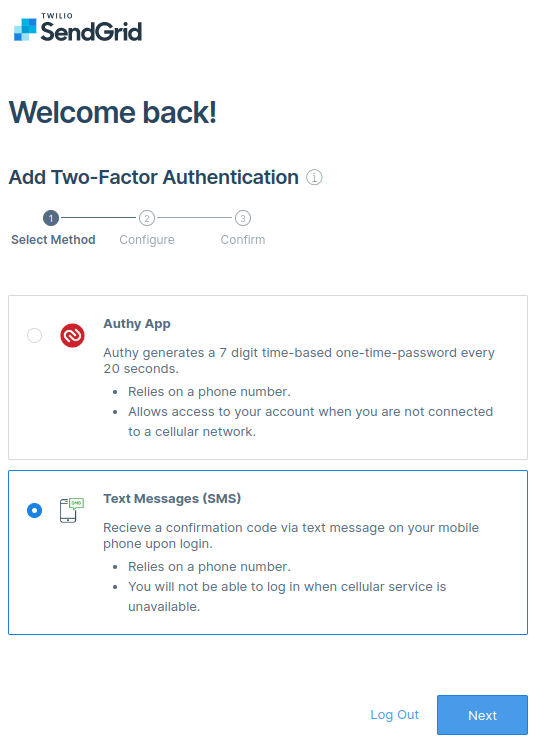
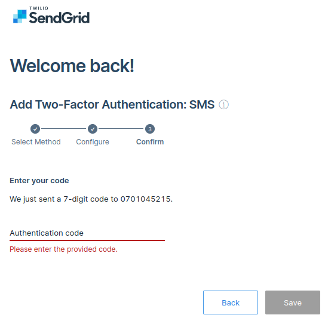
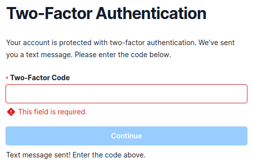
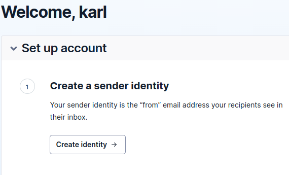
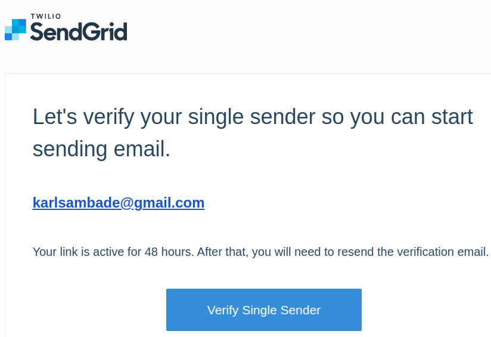
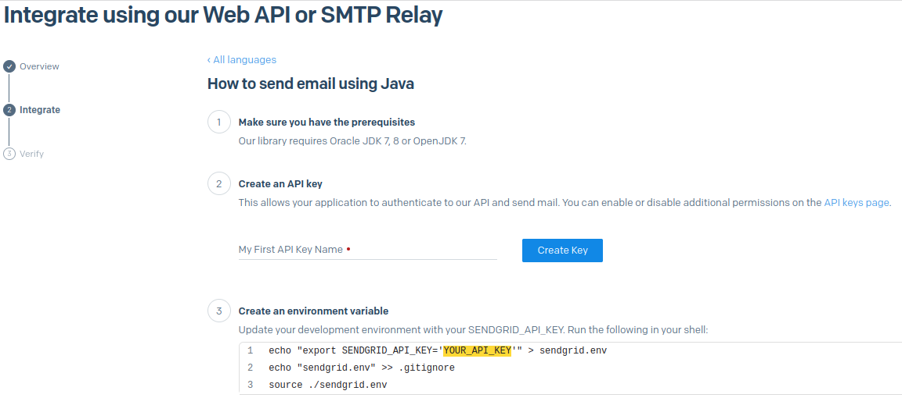
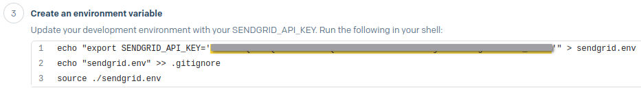

_by [Herbert Kateu](https://github.com/hkateu)_

> Hey, it's Daniel here. You're reading a big article about a real-life use of the Http4s library. Herbert outdid himself in this article!
>
> If you want to master the Typelevel Scala libraries (including Http4s) with real-life practice, check out the [Typelevel Rite of Passage](https://rockthejvm.com/p/typelevel-rite-of-passage) course, a full-stack project-based course. It's my biggest and most jam-packed course yet.

## 1. Introduction

This article is a continuation of the authentication methods that were covered in [the other article on http4s authentication](/scala-http4s-authentication). Here we will cover two more advanced authentication methods which include One Time Password (OTP) and Two Factor Authentication (2FA).

You can find the entire code on [GitHub](https://github.com/hkateu/MyHttp4sCode/tree/main/otpauth/src/main/scala/com/xonal).

### 1.1 Requirements

To follow along with this tutorial, you will need to add the following to your build.sbt file:

```scala
val scala3Version = "3.2.2"

val Http4sVersion = "0.23.18"
val OtpJavaVersion = "2.0.1"
val ZxingVersion = "3.5.1"
val SendGridVersion = "4.9.3"
val Log4CatsVersion = "2.6.0"
val Sl4jApiVersion =  "2.0.7"

val http4sDsl =       "org.http4s"                  %% "http4s-dsl"          % Http4sVersion
val emberServer =     "org.http4s"                  %% "http4s-ember-server" % Http4sVersion
val emberClient =     "org.http4s"                  %% "http4s-ember-client" % Http4sVersion
val otpJava =         "com.github.bastiaanjansen"    % "otp-java"            % OtpJavaVersion
val zxing =           "com.google.zxing"             % "javase"              % ZxingVersion
val sendGrid =        "com.sendgrid"                 % "sendgrid-java"       % SendGridVersion
val log4CatsCore =    "org.typelevel"               %% "log4cats-core"       % Log4CatsVersion
val log4CatsSlf4j =   "org.typelevel"               %% "log4cats-slf4j"      % Log4CatsVersion
val sl4jApi =         "org.slf4j"                    % "slf4j-api"           % Sl4jApiVersion
val sl4jSimple =      "org.slf4j"                    % "slf4j-simple"        % Sl4jApiVersion

lazy val otpauth = project
    .in(file("otpauth"))
    .settings(
    name := "othauth",
    version := "0.1.0-SNAPSHOT",
    scalaVersion := scala3Version,
    scalacOptions ++= Seq("-java-output-version", "11"),
    libraryDependencies ++= Seq(
        http4sDsl,
        emberServer,
        emberClient,
        otpJava,
        zxing,
        sendGrid,
        log4CatsCore,
        log4CatsSlf4j,
        sl4jApi,
        sl4jSimple
    )
)
```

The latest version of java `sendgrid-java` uses java 11, therefore we needed to add `scalacOptions ++= Seq("-java-output-version", "11")` to our build.

## 2. One Time Password (OTP)

A One Time Password is a form of authentication that is used to grant access to a single login session or transaction.

The One Time Password authentication method is defined in the [RFC 2289](https://www.ietf.org/rfc/rfc2289.txt) internet standard which provides a detailed explanation of how OTP is implemented.

OTP tokens can either be generated by a software application running on a computer or phone, or they can also be generated using hardware and there is a wide array of devices on the market providing this functionality.

There are a variety of industry-standard algorithms that are used to generate OTP tokens such as SHA256, however, they require two inputs, a static value known as a secret key and a moving factor which changes each time an OTP value is generated. There a two main types of OTP tokens namely HOTP (HMAC-based One Time Password) and TOTP (Time-based One Time Password).

### 2.1 HMAC-based One Time Password (HOTP)

The `H` in HOTP stands for HMAC (Hash-based Message Authentication Code). This is a cryptographic technique that requires a hash function such as SHA256 and a set of parameters (secret key, moving factor). Under HOTP, the moving factor is based on a counter.
Each time a user requests for the HOTP, the counter is incremented. When the server receives the HOTP, it also increments its counter after validating the token, thereby keeping in sync with the OTP generator.
It is possible to generate many HOTP tokens without validating with the server, this throws the two entities out of sync, because of this, different HOTP generators provide different methods for resynchronization.
The HOTP standard is defined under [RFC 4226](https://www.ietf.org/rfc/rfc4226.txt) which gives a detailed explanation of how HOTP operates.

**HOTP scala implementation**

HOTP generation is quite tedious, therefore for simplicity, we will use a java library, [otp-java](https://github.com/BastiaanJansen/otp-java) by Bastiaan Jansen.
First, we'll need to acquire a secret key. The library provides a mechanism to generate this:

```scala
import com.bastiaanjansen.otp.*

val secret = SecretGenerator.generate()
```

Next, we will use the builder to generate an HOTP instance.

```scala
val hotp = new HOTPGenerator.Builder(secret)
              .withPasswordLength(6)
              .withAlgorithm(HMACAlgorithm.SHA256)
              .build()
```

Here we instantiate a new `HOTPGenerator` class, pass it the `secret`, a password length of 6, and an algorithm type as `SHA256`. We can now use `hotp` to generate the code.

```scala
val counter = 5
val code = hotp.generate(counter)
```

In the code above, we initialized the counter to 5 and used that to generate the `hotp` code.

When the server receives this code, it can verify it in the following way:

```scala
val isValid = hotp.verify(code, counter)
```

Remember the client and server must keep their counters in sync for the verification phase to work otherwise resynchronization is needed.

### 2.2 Time-based One Time Password (TOTP)

The TOTP token is generated similarly to HOTP with the main difference being the moving factor. Here the moving factor is based on a time counter. The time counter is calculated by dividing the current Unix time by a timestep value which is the life span of a TOTP usually 30 seconds.

**TOTP scala implementation**

Otp-java also provides an implementation for TOTP token generation:

```scala
import java.time.Duration

val secret = SecretGenerator.generate()

val totp = new TOTPGenerator.Builder(secret)
    .withHOTPGenerator(builder => {
            builder.withPasswordLength(6)
            builder.withAlgorithm(HMACAlgorithm.SHA256)
    })
    .withPeriod(Duration.ofSeconds(30))
    .build()
```

Here the `TOTPGenerator` class is instantiated with a `secret`, the `withHOTPGenerator()` method gives access to a `builder` that we use to set the password length and algorithm type. The last method is `withPeriod()` where we set the duration to 30 seconds, which is the lifespan for each `TOTP`.

```scala
val codeValue = totp.now()
```

The `now()` method on the `TOTPGenerator` class is used to generate the token.
In order to verify totp tokens, we also use the `verify()` method:

```scala
totp.verify(code)
```

## 3. Two Factor Authentication (2FA)

Two Factor Authentication is an authentication method that requires a user to provide two distinct forms of identification to access a website or resource. Here's how it works.

1. When a user tries to perform a transaction or action on a system, he or she will present some credentials like an email or a phone number.
1. The system will send a temporary secure PIN-code or token to the user by email or phone number valid for only that session.
1. When the PIN-code is presented to the system and verified, access will be granted to the user otherwise it will be denied.

The code or token is the One Time Password that we generated in the previous sections

### 3.1. Two Factor Authentication (2FA) Implementation in Scala

In this section, we will create a small application to showcase 2FA using java-otp, Http4s, SendGrid, Google Zxing, and Google Authenticator.

We will need to simulate a user database where the application retrieves information about our logged-in user, we do this by defining a `UserDB` case class with required fields. Create a `UserDB.scala` file and add the following information:

```scala
package com.rockthejvm

case class UserDB(username: String, email: String) {
  private var counter: Long = 5L
  private var encryptedSecret = ""
  var isSecretUpdated = false

  def getCounter = counter
  def incrementCounter = counter += 1

  def getSecret = encryptedSecret
  def updateSecret(secretValue: String) = {
    encryptedSecret = secretValue
    isSecretUpdated = true
  }
}
```

The `UserDB` case class will hold a `username` and `email`. The case class also contains a `counter` variable, `getCounter()`, and `incrementCounter()` methods that we will use in the case of `Hotp`.
It also contains the user's secret value, stored in `encryptedSecret`, `isSecretUpdated`, a boolean variable showing if the secret value is updated or not, a `getSecret()`, and `updateSecret()` function.

**Note that secret values should not be stored in plain text but should be encrypted for security reasons.**

Let's create a Generator.scala file and add the following code:

```scala
package com.rockthejvm

enum Generator {
  case Hotp, Totp
}
```

`Generator` is an `enum` with two cases that will help us choose between `Hotp` and `Totp` implementations depending on our needs.

Google Authenticator gives us two options to capture the OTP code, we can type it manually or scan a bar code. Here we create a `BarCodeService.scala` where we make use of the Google zxing library for barcode generation.

```scala
package com.rockthejvm

import com.rockthejvm.Generator.*

object BarCodeService {
  def getGoogleAuthenticatorBarCode(
      secretKey: String,
      account: String,
      issuer: String,
      generator: Generator,
      counter: Int
  ): String =
    generator match {
      case Hotp =>
        s"otpauth://hotp/$issuer:$account?secret=$secretKey&issuer=$issuer&algorithm=SHA256&counter=$counter"
      case Totp =>
        s"otpauth://totp/$issuer:$account?secret=$secretKey&issuer=$issuer&algorithm=SHA256"
    }
}
```

The `getGoogleAuthenticatorBarCode()` method takes a `secretKey`, an `account` and `issuer` which is the email address and name of the business or person issuing the barcode respectively, and a `generator` which is of type `Hotp` or `Totp` (used to choose the type of `otp`), and a `counter` value in case of `Hotp`.
This function creates a `URI` in the format `otpauth://TYPE/LABEL?PARAMETERS` that we'll use to create the QR Bar Code image in the next section. We also specify the algorithm as `SHA256` for both otp implementations.

```scala
import com.google.zxing.common.BitMatrix
import com.google.zxing.MultiFormatWriter
import com.google.zxing.BarcodeFormat
import java.io.FileOutputStream
import com.google.zxing.client.j2se.MatrixToImageWriter
import cats.effect.IO

object BarCodeService{
    // ...
  def createQRCode(
      barCodeData: String,
      filePath: String = "barCode.png",
      height: Int = 400,
      width: Int = 400
  ): IO[Unit] =
    IO {
      val matrix: BitMatrix = new MultiFormatWriter().encode(
        barCodeData,
        BarcodeFormat.QR_CODE,
        width,
        height
      )
      val outVal: FileOutputStream = new FileOutputStream(filePath)
      MatrixToImageWriter.writeToStream(matrix, "png", outVal)
    }
}
```

The `createQRCode()` function creates the BarCode image. It takes as parameters, `barCodeData` which is our `URI`, a `filePath`, and `height` and `width` of our image, all of which we initialize to `barCode.png`, `400` and `400` respectively giving use an `IO[Unit]`.
The `MultiFormatWriter` class has an `encode()` method that takes our arguments and creates a 2D matrix of bits.
The `writeToStream()` method on the `MatrixToImageWriter` object takes the `matrix` (of type `BitMatrix`), `"png"` as the image format and a `FileOutputStream`, writes the image to a png file and saves it to the file path.

Here's the full code:

```scala
package com.rockthejvm

import com.rockthejvm.Generator.*
import com.google.zxing.common.BitMatrix
import com.google.zxing.MultiFormatWriter
import com.google.zxing.BarcodeFormat
import java.io.FileOutputStream
import com.google.zxing.client.j2se.MatrixToImageWriter
import cats.effect.IO

object BarCodeService {
  def getGoogleAuthenticatorBarCode(
      secretKey: String,
      account: String,
      issuer: String,
      generator: Generator,
      counter: Int
  ): String =
    generator match {
      case Hotp =>
        s"otpauth://hotp/$issuer:$account?secret=$secretKey&issuer=$issuer&algorithm=SHA256&counter=$counter"
      case Totp =>
        s"otpauth://totp/$issuer:$account?secret=$secretKey&issuer=$issuer&algorithm=SHA256"
    }


  def createQRCode(
      barCodeData: String,
      filePath: String = "barCode.png",
      height: Int = 400,
      width: Int = 400
  ): IO[Unit] =
    IO {
      val matrix: BitMatrix = new MultiFormatWriter().encode(
        barCodeData,
        BarcodeFormat.QR_CODE,
        width,
        height
      )
      val outVal: FileOutputStream = new FileOutputStream(filePath)
      MatrixToImageWriter.writeToStream(matrix, "png", outVal)
    }
}
```

Create an `OtpService.scala` file that will contain our implementation for `Hotp` and `Totp`, and add the following code:

```scala
package com.rockthejvm

import scala.util.*
import com.rockthejvm.Generator
import com.bastiaanjansen.otp.*

class OtpService(generator: Generator, user: UserDB) {
  if (!user.isSecretUpdated) {
      user.updateSecret(new String(SecretGenerator.generate(512)))
    }

  private val secret: Array[Byte] = user.getSecret.getBytes()
}
```

We create `OtpService` as a class in order to pass `Generator` and `UserDB` as constructor arguments during instantiation. We first check if the user's secret is updated, if it's not, we generate a new secret value and update the user's secret by calling, `user.updateSecret()` with the generated secret value as a parameter. Calling `SecretGenerator.generate(512)` generates a secret with 512 bits.

We then retrieve the secret value from the `UserDB` and assign it to the variable `secret` as an `Array[Byte]`.

```scala
import java.time.Duration

class OtpService(generator: Generator, user: UserDB) {
    // ...
  private val hotpGen =
    new HOTPGenerator.Builder(secret)
      .withPasswordLength(6)
      .withAlgorithm(HMACAlgorithm.SHA256)
      .build()

  private val totpGen =
    new TOTPGenerator.Builder(secret)
      .withHOTPGenerator { builder =>
        builder.withPasswordLength(6)
        builder.withAlgorithm(HMACAlgorithm.SHA256)
      }
      .withPeriod(Duration.ofSeconds(30))
      .build()
}
```

The `hotpGen()` and `totpGen()` are instances of `HOTPGenerator` and `TOTPGenerator` respectively. Note that Google Authenticator displays a token length of 6 therefore we supply the same value to our function implementations. We also use the same algorithm type, `SHA256` that we defined in our `URI` string. They are both created as `private` so that they are only used within this class.

```scala
import cats.effect.IO
import com.rockthejvm.Generator.*

class OtpService(generator: Generator, user: UserDB) {
 // ...
  def getToken: IO[String] =
    IO {
      generator match {
        case Hotp =>
          hotpGen.generate(user.getCounter)
        case Totp =>
          totpGen.now()
      }
    }
}
```

The `getToken()` function generates a token and returns an `IO[String]` depending on the type of generator supplied.

```scala
class OtpService(generator: Generator, user: UserDB) {
    // ...
  def verifyCode(code: String): IO[Boolean] =
    IO {
      generator match {
        case Hotp =>
          hotpGen.verify(code, user.getCounter)
        case Totp =>
          totpGen.verify(code)
      }
    }
}
```

The `verifyCode()` function is used to check if the code the user sends to our service is genuine. It takes the `code` (the otp token) and counter value `user.getCounter()` for the case of `Hotp` and returns an `IO[Boolean]` which shows if verification has failed or passed.

```scala
class OtpService(generator: Generator, user: UserDB) {
  // ...
  def makeBarCodeImg(account: String, issuer: String): IO[Unit] =
    BarCodeService.createQRCode(
      BarCodeService.getGoogleAuthenticatorBarCode(
        new String(secret),
        account,
        issuer,
        generator,
        user.getCounter.toInt - 1
      )
    )
}
```

The `makeBarCodeImg()` function calls `createQRCode()` with `getGoogleAuthenticatorBarCode()` from the `BarCodeService` as a parameter representing the bar code `URI`, and returns `IO[Unit]` after the bar code image is created. It takes an `account` and `issuer` as parameters. We also subtract 1 from `user.getCounter.toInt` to match our authenticator's counter value.

Here is the full code:

```scala
package com.rockthejvm

import cats.effect.IO
import com.bastiaanjansen.otp.*
import java.time.Duration
import scala.util.*
import com.rockthejvm.Generator.*

class OtpService(generator: Generator, user: UserDB) {

  if (!user.isSecretUpdated) {
    user.updateSecret(new String(SecretGenerator.generate(512)))
  }

  private val secret: Array[Byte] = user.getSecret.getBytes()

  private val hotpGen =
    new HOTPGenerator.Builder(secret)
      .withPasswordLength(6)
      .withAlgorithm(HMACAlgorithm.SHA256)
      .build()

  private val totpGen =
    new TOTPGenerator.Builder(secret)
      .withHOTPGenerator { builder =>
        builder.withPasswordLength(6)
        builder.withAlgorithm(HMACAlgorithm.SHA256)
      }
      .withPeriod(Duration.ofSeconds(30))
      .build()

  def getToken: IO[String] =
    IO {
      generator match {
        case Hotp =>
          hotpGen.generate(user.getCounter)
        case Totp =>
          totpGen.now()
      }
    }

  def verifyCode(code: String): IO[Boolean] =
    IO {
      generator match {
        case Hotp =>
          hotpGen.verify(code, user.getCounter)
        case Totp =>
          totpGen.verify(code)
      }
    }

  def makeBarCodeImg(account: String, issuer: String): IO[Unit] =
    BarCodeService.createQRCode(
      BarCodeService.getGoogleAuthenticatorBarCode(
        new String(secret),
        account,
        issuer,
        generator,
        user.getCounter.toInt - 1
      )
    )
}

```

Let's create an `OtpInteractiveService.scala` file and add the following contents:

```scala
package com.rockthejvm

class OtpInteractiveService(generator: Generator, user: UserDB) {
  def otpService = new OtpService(generator, user)
}
```

The `OtpInteractiveService` class will be used to create an instance of `OtpService` with the appropriate constructor arguments.

```scala
package com.rockthejvm

import cats.effect.IO
import com.sendgrid.Response

class OtpInteractiveService(generator: Generator, user: UserDB) {
  // ...
  def send2FA(sendto: UserDB): IO[Either[String, Response]] = ???
}
```

It also contains a `send2FA()` function used to send an email to a user with our QR Bar Code image as an attachment. To send this email we'll use Sendgrid's email java API, but it requires an API key.

Follow these steps to get your API Key

1. Head over to sendgrid.com and click on the pricing tab.
   SendGrid offers 100 emails per day for free, which is more than enough for this tutorial.
   Click the Start for free button to register

   

1. Fill in your email address and password and create the account.

   

1. Fill in the required information and click get started.

   

1. Check your inbox and click the link to set up 2FA.

1. Select the Text Messages option and click Next.

   

1. Select your country code and input your mobile number then click next.

   

1. Check your sms and fill in the authentication code and save.

   

1. Log back into SendGrid, You will be prompted for another authentication code.
   Sometimes it's not sent, your can resend it with the link provided. Then click continue.
   After which you will be sent to a welcome screen.

   

1. Click the create identity button.

   

1. Fill in the details and create a sender

   

1. Check the sender email you supplied to verify the single sender.

   

1. Under Email Api and Integration Guide, select Web API, then choose JAVA

   

1. Add an API key name then click the Create Key button.

   

1. Finally follow the steps in part 3 to add your key as an environment variable in the root of our project.

   

Now let's define our `send2FA()` function:

```scala
import com.sendgrid.helpers.mail.objects.{Email, Content}
import java.nio.file.Paths

class OtpInteractiveService(generator: Generator, user: UserDB) {
  // ...
  def send2FA(sendto: UserDB): IO[Either[String, Response]] = {
    val from = new Email("hkateu@gmail.com")
    val to = new Email(sendto.email)

    val subject = "OtpAuth Test Application"
    val message = s"""
            |<H3>Website Login</H3>
            |<p>Please complete the login process using google authenticator</p>
            |<p>Scan the QR Barcode attached and send us the token number.</p>
            """.stripMargin

    val file = Paths.get("barCode.png")
    val content = new Content("text/html", message)
  }
}
```

We start by defining some variables needed to send an email. The `from` and `to` variables represent the person sending the email and the person to whom the email will be sent. SendGrid provides an `Email` class to structure these email addresses. Notice that we pass the email address of the person we are sending to as a function parameter.

We also define `subject` as a string and `message` as a string containing HTML. The `file` variable is a `Path` to the BarCode png image. `content` is an instance of the `Content` class that tells SendGrid what type of message we are sending, in our case `text/html`:

```scala
import com.sendgrid.helpers.mail.objects.{Email, Content, Attachments}
import com.sendgrid.helpers.mail.Mail
import java.util.Base64
import java.nio.file.{Paths, Files}

// ...
def send2FA(sendto: UserDB): IO[Either[String, Response]] = {
// ...
    val mail = new Mail(from, subject, to, content)
    val attachments = new Attachments()
    attachments.setFilename(file.getFileName().toString())
    attachments.setType("application/png")
    attachments.setDisposition("attachment")
    val attachmentContentBytes = Files.readAllBytes(file)
    val attachmentContent =
      Base64.getEncoder().encodeToString(attachmentContentBytes)
    attachments.setContent(attachmentContent)
    mail.addAttachments(attachments)
}
```

SendGrid provides a `Mail` class that takes our `from`, `subject`, `to`, and `content` variables as parameters to structure our email. We then create `attachments` which is an instance of the `Attachments` class, it provides `setFilename()`, `setType()`, and `setDisposition()` methods to structure our attachment.

We use the `readAllBytes()` method from `Files` to convert our png image to type `Array[Byte]` and store it in `attachmentContentBytes`, then encode it to Base64 and store it in `attachmentContent` since SendGrid requires Base64 encoding to send attachments.

We then call `attachments.setContent(attachmentContent)` and `mail.addAttachments(attachments)` to add our file as an attachment on our `Mail` instance.

```scala
import scala.util.*
import com.sendgrid.{SendGrid, Method, Request, Response}

// ...
def send2FA(sendto: UserDB): IO[Either[String, Response]] = {
// ...
    val sg = new SendGrid(Properties.envOrElse("SENDGRID_API_KEY", "undefined"))
    val request = new Request()
    val response: IO[Either[String, Response]] =
      IO {
        Try {
          request.setMethod(Method.POST)
          request.setEndpoint("mail/send")
          request.setBody(mail.build())
          val res = sg.api(request)
          res
        }.toEither.left.map(_.getMessage)
      }

    response
}
```

`sg` is an instance of the `SendGrid` class that takes our API Key as an argument. Since the API Key is saved as an environment variable, we call `Properties.envOrElse("SENDGRID_API_KEY","undefined")` to fetch it. If it doesn't exist, this function will set it to `undefined`.

We create a `Request` class and use that to build our mail. Within the response variable we call `setMethod()`, `setEndpoint()`, and `setBody()` methods on the `request` class and return `sg.api(request)` as a `Try[Response]` then call `.toEither.left.map(_.getMessage)` to convert it to an `Either[String,Response]`. `Response` will hold the response from the SendGrid server, however, if an error occurred sending the email, the error message is mapped to a `Left`. Finally, we return our `response` on the last line of the function.

Here is the full code:

```scala
package com.rockthejvm

import com.sendgrid.{SendGrid, Method, Request, Response}
import com.sendgrid.helpers.mail.objects.{Email, Content, Attachments}
import com.sendgrid.helpers.mail.Mail
import java.nio.file.{Paths, Files}
import java.util.Base64
import scala.util.*
import cats.effect.IO

class OtpInteractiveService(generator: Generator, user: UserDB) {
  def otpService = new OtpService(generator, user)

  def send2FA(sendto: UserDB): IO[Either[String, Response]] = {
    val from = new Email("hkateu@gmail.com")
    val to = new Email(sendto.email)

    val subject = "OtpAuth Test Application"
    val message = s"""
            |<H3>Website Login</H3>
            |<p>Please complete the login process using google authenticator</p>
            |<p>Scan the QR Barcode attached and send us the token number.</p>
            """.stripMargin

    val file = Paths.get("barCode.png")
    val content = new Content("text/html", message)

    val mail = new Mail(from, subject, to, content)
    val attachments = new Attachments()
    attachments.setFilename(file.getFileName().toString())
    attachments.setType("application/png")
    attachments.setDisposition("attachment")
    val attachmentContentBytes = Files.readAllBytes(file)
    val attachmentContent =
      Base64.getEncoder().encodeToString(attachmentContentBytes)
    attachments.setContent(attachmentContent)
    mail.addAttachments(attachments)

    val sg = new SendGrid(Properties.envOrElse("SENDGRID_API_KEY", "undefined"))
    val request = new Request()
    val response: IO[Either[String, Response]] =
      IO {
        Try {
          request.setMethod(Method.POST)
          request.setEndpoint("mail/send")
          request.setBody(mail.build())
          val res = sg.api(request)
          res
        }.toEither.left.map(_.getMessage)
      }

    response
  }
}
```

In the next section, we create the routes and server using http4s. First, we create `OtpAuth.scala` and add the following code:

```scala
import cats.effect.{IOApp, IO, ExitCode}
import com.rockthejvm.OtpInteractiveService
import com.rockthejvm.UserDB
import com.rockthejvm.Generator.*
import org.typelevel.log4cats.Logger
import org.typelevel.log4cats.slf4j.Slf4jLogger

object OtpAuth extends IOApp {
  val user = UserDB("john", "johndoe@email.com")
  val tokenService = new OtpInteractiveService(Hotp, user)

  given logger: Logger[IO] = Slf4jLogger.getLogger[IO]

  override def run(args: List[String]): IO[ExitCode] = ???
}
```

Here we create an instance of `OtpInteractiveService` to which we supply a `Generator` of type `Hotp` and `user` as constructor arguments. We also define a `given`, `logger` from `log4cats` which we will use for logging some messages to the console.

```scala
import org.http4s.*
import org.http4s.dsl.io.*
import scala.util.*
  // ...
  val routes: HttpRoutes[IO] =
    HttpRoutes.of[IO] {
      case GET -> Root / "login" =>
        // create barcode image
        tokenService.otpService
          .makeBarCodeImg("<business@email.com>", "<business>")
          .attempt
          .flatMap {
            // successful barcode image creation
            case Right(_) =>
              // Log token
              tokenService.otpService.getToken
                .flatMap { token =>
                  logger.info(s"Token value: $token")
                }
                .handleErrorWith { ex =>
                  logger.error(s"GetToken Error: ${ex.getMessage}")
                } *>
                // send email
                tokenService.send2FA(user).flatMap {
                  // successful email
                  case Right(res) =>
                    logger.info(s"Response Body: ${res.getBody()}") *>
                    logger.info(s"Response Status Code: ${res.getStatusCode()}") *>
                    logger.info(s"Response Headers: ${res.getHeaders()}") *>
                    Ok("We sent you an email, please follow the steps to complete the signin process.")
                  // failed email
                  case Left(ex) =>
                    logger.error(s"Response Error: $ex") *>
                    Ok("Oops, something went wrong, please try again later.")
                }
            // failed bar code image creation
            case Left(ex) =>
              logger.error(s"QR Code Error: ${ex.getMessage}") *>
              Ok("Error occurred generating QR Code...")
          }
    }
    override def run(args: List[String]): IO[ExitCode] =  ???
```

Let's break this down section by section
We create our routes using the `HttpRoutes.of[IO]` method. When a user tries to log into the application using the `/login` route, we use the `tokenService` to try to create the bar code image by calling the `tokenService.otpService.makeBarCodeImg()` function which takes an `account` (the business email) and `issuer` (the business name) as arguments. The `attempt()` method creates `IO[Either[String, Unit]]` that we `flatMap` on and pattern match.

If the bar code image was successfully created, we ignore the `unit` value in `Right(_)` and proceed to acquire the token value using the following code:

```scala
tokenService.otpService.getToken
   .flatMap { token =>
       logger.info(s"Token value: $token")
   }
   .handleErrorWith { ex =>
       logger.error(s"GetToken Error: ${ex.getMessage}")
   }
```

In case the token was successfully created we log the token value by calling `logger.info(s"Token value: $token")` otherwise we handle the error and also log it to the console by calling `logger.error(s"GetToken Error: ${ex.getMessage}")`. The `*>` means that we are going to replace the result of the previous computation with that of the next, which is sending our email:

```scala
// send email
tokenService.send2FA(user).flatMap {
    // successful email
    case Right(res) =>
        logger.info(s"Response Body: ${res.getBody()}") *>
        logger.info(s"Response Status Code: ${res.getStatusCode()}") *>
        logger.info(s"Response Headers: ${res.getHeaders()}") *>
        Ok("We sent you an email, please follow the steps to complete the signin process.")
    // failed email
    case Left(ex) =>
        logger.error(s"Response Error: $ex") *>
        Ok("Oops, something went wrong, please try again later.")
}
```

Here we pattern match on our `Either[String, Response]` from the `tokenService.send2FA(user)` function. If the email was sent successfully, we log the body, status code, and headers to the console for debugging purposes by calling `res.getBody()`, `res.getStatusCode()`, and `res.getHeaders()` on `response` respectively, and inform the user to check his or her email, otherwise, we print the error to the console and inform the user that an error occurred.

In case an error occurred creating the bar code image, we log the error to the console and notify the user as shown below:

```scala
// failed bar code image creation
case Left(ex) =>
    logger.error(s"QR Code Error: ${ex.getMessage}") *>
    Ok("Error occurred generating QR Code...")
```

The `/code/value` route receives the code from the user and verifies it by calling `tokenService.otpService.verifyCode(value)` where `value` is the 6-digit code:

```scala
val routes: HttpRoutes[IO] =
    HttpRoutes.of[IO] {
    // ...
      case GET -> Root / "code" / value =>
        // verify code
        tokenService.otpService
          .verifyCode(value)
          .flatMap { result =>
            if (result) {
              IO(user.incrementCounter) *>
              IO(user.isSecretUpdated = false) *>
              Ok(s"Code verification passed")
            } else Ok(s"Code verification failed")
          }
          .handleErrorWith { ex =>
            logger.error(s"Verification Error: ${ex.getMessage}") *>
            Ok("An error occured during verification")
          }
    }
```

If the code is correctly verified we increment the user's counter by 1, set `user.isSecretUpdated` back to `false` and respond with `Ok(s"Code verification passed")`, this way every time the user logs in, a new secret is generated. Assuming that the verification failed, we respond with `Ok(s"Code verification failed")`.

Supposing an error occurred during the verification process, we log the error to the console and respond with `Ok("An error occurred during verification")`.

```scala
import com.comcast.ip4s.*
import org.http4s.ember.server.EmberServerBuilder
  // ...
  val server =
    EmberServerBuilder
      .default[IO]
      .withHost(ipv4"0.0.0.0")
      .withPort(port"8080")
      .withHttpApp(routes.orNotFound)
      .build

  override def run(args: List[String]): IO[ExitCode] =
    server.use(_ => IO.never).as(ExitCode.Success)
```

Finally, we use ember to create our `server` and add it the the `run` function.

Here is the full code.

```scala
import cats.effect.*
import cats.implicits.*
import org.http4s.*
import org.http4s.dsl.io.*
import com.comcast.ip4s.*
import org.http4s.ember.server.EmberServerBuilder
import com.rockthejvm.OtpInteractiveService
import com.rockthejvm.UserDB
import com.rockthejvm.Generator.*
import org.typelevel.log4cats.Logger
import org.typelevel.log4cats.slf4j.Slf4jLogger

object OtpAuth extends IOApp {
  val user = UserDB("john", "johndoe@email.com")
  val tokenService = new OtpInteractiveService(Hotp, user)

  given logger: Logger[IO] = Slf4jLogger.getLogger[IO]

  val routes: HttpRoutes[IO] =
    HttpRoutes.of[IO] {
      case GET -> Root / "login" =>
        // create barcode image
        tokenService.otpService
          .makeBarCodeImg("<business@email.com>", "<business>")
          .attempt
          .flatMap {
            // successful barcode image creation
            case Right(_) =>
              // Log token
              tokenService.otpService.getToken
                .flatMap { token =>
                  logger.info(s"Token value: $token")
                }
                .handleErrorWith { ex =>
                  logger.error(s"GetToken Error: ${ex.getMessage}")
                } *>
                // send email
                tokenService.send2FA(user).flatMap {
                  // successful email
                  case Right(res) =>
                    logger.info(s"Response Body: ${res.getBody()}") *>
                      logger
                        .info(
                          s"Response Status Code: ${res.getStatusCode()}"
                        ) *>
                      logger.info(s"Response Headers: ${res.getHeaders()}") *>
                      Ok(
                        "We sent you an email, please follow the steps to complete the signin process."
                      )
                  // failed email
                  case Left(ex) =>
                    logger.error(s"Response Error: $ex") *>
                    Ok("Oops, something went wrong, please try again later.")
                }
            // failed bar code image creation
            case Left(ex) =>
              logger.error(s"QR Code Error: ${ex.getMessage}") *>
              Ok("Error occurred generating QR Code...")
          }
      case GET -> Root / "code" / value =>
        // verify code
        tokenService.otpService
          .verifyCode(value)
          .flatMap { result =>
            if (result) {
              IO(user.incrementCounter) *>
              IO(user.isSecretUpdated = false) *>
              Ok(s"Code verification passed")
            } else Ok(s"Code verification failed")
          }
          .handleErrorWith { ex =>
            logger.error(s"Verification Error: ${ex.getMessage}") *>
              Ok("An error occured during verification")
          }
    }

  val server =
    EmberServerBuilder
      .default[IO]
      .withHost(ipv4"0.0.0.0")
      .withPort(port"8080")
      .withHttpApp(routes.orNotFound)
      .build

  override def run(args: List[String]): IO[ExitCode] =
    server.use(_ => IO.never).as(ExitCode.Success)
}
```

Before we start our server and test our application, make sure you provide an actual email to our user, this is where the token will be sent.

```scala
val user = User("john", "johndoe@email.com")

```

We will also need issuers credentials to create the bar code image

```scala
tokenService.otpService
          .makeBarCodeImg("<business@email.com>", "<business>")
```

And finally, make sure you run the following in your root folder:

```bash
source sendgrid.env
```

So that the environmental variables are present.

Now let's test our application.

```bash
curl -vv http://localhost:8080/login
*   Trying ::1:8080...
* Connected to localhost (::1) port 8080 (#0)
> GET /login HTTP/1.1
> Host: localhost:8080
> User-Agent: curl/7.71.1
> Accept: */*
>
* Mark bundle as not supporting multiuse
< HTTP/1.1 200 OK
< Date: Thu, 06 Jul 2023 16:02:41 GMT
< Connection: keep-alive
< Content-Type: text/plain; charset=UTF-8
< Content-Length: 77
<
* Connection #0 to host localhost left intact
We sent you an email, please follow the steps to complete the signin process.⏎
```

Here's what we printed to the console.

```bash
829449

202
[info] running OtpAuth
[io-compute-4] INFO org.http4s.ember.server.EmberServerBuilderCompanionPlatform - Ember-Server service bound to address: [::]:8080
[io-compute-4] INFO <empty>.OtpAuth - Token value: 486981
[io-compute-4] INFO <empty>.OtpAuth - Response Body:
[io-compute-4] INFO <empty>.OtpAuth - Response Status Code: 202
[io-compute-4] INFO <empty>.OtpAuth - Response Headers: {Strict-Transport-Security=max-age=600; includeSubDomains, Server=nginx, Access-Control-Allow-Origin=https://sendgrid.api-docs.io, Access-Control-Allow-Methods=POST, Connection=keep-alive, X-Message-Id=qsasLSGIQbaptS_obj_ZSg, X-No-CORS-Reason=https://sendgrid.com/docs/Classroom/Basics/API/cors.html, Content-Length=0, Access-Control-Max-Age=600, Date=Thu, 06 Jul 2023 16:02:38 GMT, Access-Control-Allow-Headers=Authorization, Content-Type, On-behalf-of, x-sg-elas-acl}

```

We can see that SendGrid successfully sent our email.
You can now open your mail and scan the BarCode image with Google Authenticator then pass the 6-digit code to the verification URL. The code outputted by Google Authenticator should be the same as what's displayed in your console.

```bash
curl -vv http://localhost:8080/code/486981
*   Trying ::1:8080...
* Connected to localhost (::1) port 8080 (#0)
> GET /code/486981 HTTP/1.1
> Host: localhost:8080
> User-Agent: curl/7.71.1
> Accept: */*
>
* Mark bundle as not supporting multiuse
< HTTP/1.1 200 OK
< Date: Thu, 06 Jul 2023 16:03:49 GMT
< Connection: keep-alive
< Content-Type: text/plain; charset=UTF-8
< Content-Length: 24
<
* Connection #0 to host localhost left intact
Code verification passed⏎
```

The server feedback should be the same as above.

Repeat the same process for `Totp` by making the following change to OtpAuth.scala

```scala
val tokenService = new OtpInteractiveService("Totp", user)
```

Note that for `Totp` to work, **make sure your phone and computer date and time down to the seconds are the same and current**. You can use the network time for both devices, this should give you the same results.

One may also limit the time the user takes to submit the code as an extra security measure for the case of `Hotp`.

## 3. Conclusion

In this tutorial we learned about One Time Password Authentication, we explored HMAC-based One Time Password (HOTP) and Time-based One Time Password (TOTP) and created a small application where we implemented Two Factor Authentication using the knowledge we learned. 2FA has gained traction in recent years and as displayed, adds another layer of security to your application.

The code for this implementation can be found on [GitHub](https://github.com/hkateu/MyHttp4sCode/tree/main/otpauth/src/main/scala/com/xonal).
