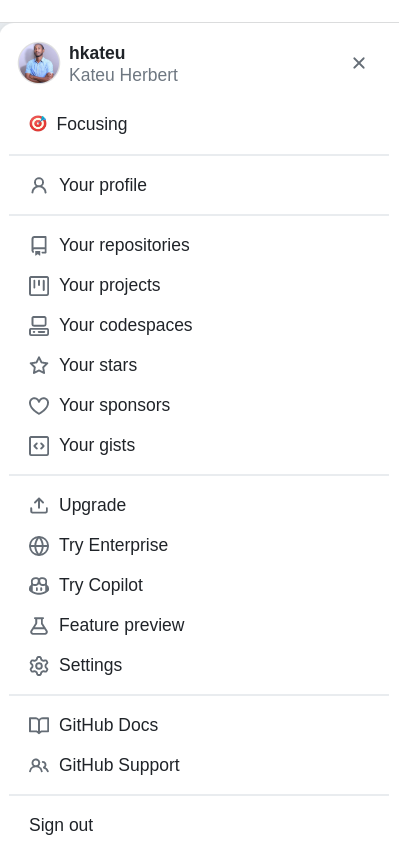
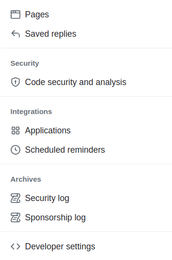
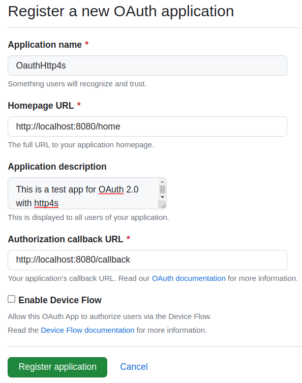
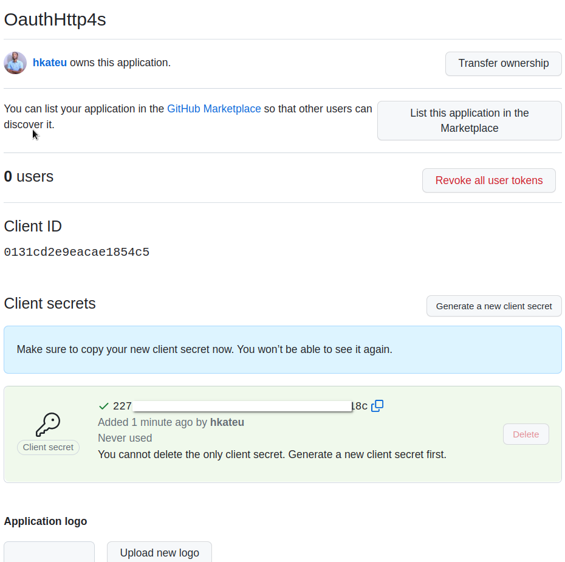
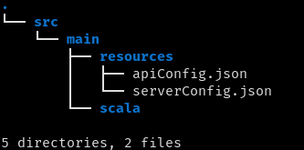
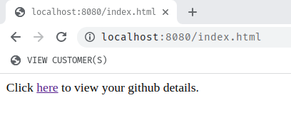
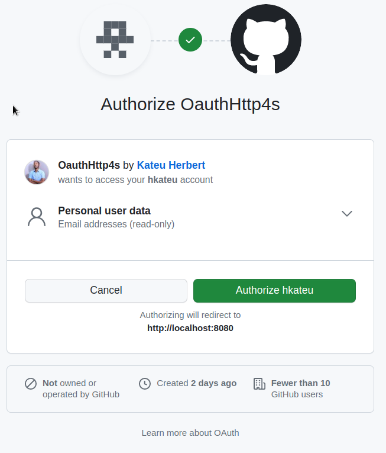
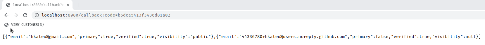

_by [Herbert Kateu](https://github.com/hkateu)_

## 1. Introduction

This is a follow-up to the [Two Factor Authentication](https://blog.rockthejvm.com/otp-authentication-scala-http4s/) article that was written earlier, and as such is the third article in the series.

OAuth which stands for Open Authorization is an open standard framework that allows the user to permit a website or application to interact with another without giving up his or her password.

1. When the user tries to log into app1, the user is redirected to an authorization server owned by app2.
1. The authorization server provides the user with a prompt, asking the user to grant app1 access to app2 with a list of permissions.
1. Once the prompt is accepted, the user is redirected back to app1 with a single-use authorization code.
1. app1 will respond to app2 with the same authorization code, a client id, and a client secret.
1. The authorization server on app2 will respond with a token id and an access token
1. app1 can now request the user's information from app2's API using the access token.

The OAuth standard is defined under [RFC 6749](https://www.ietf.org/rfc/rfc6749.txt), here we'll find an in-depth explanation of how the mechanism works.

For the video version of this tutorial, check below:



## 2. Accessing the Github API through OAuth

### 2.1. Setting Up

In this section, we'll build an application that connects to GitHub using OAuth and request user information using the GitHub API.

To build this application we will need to add the following to our build.sbt file:

```scala
val scala3Version = "3.3.0"
val Http4sVersion = "0.23.18"
val CirisVersion = "3.2.0"
val CirceVersion = "0.14.1"

val emberServer =     "org.http4s"                %% "http4s-ember-server" % Http4sVersion
val emberClient =     "org.http4s"                %% "http4s-ember-client" % Http4sVersion
val http4sDsl =       "org.http4s"                %% "http4s-dsl"          % Http4sVersion
val ciris =           "is.cir"                    %% "ciris"               % CirisVersion
val cirisCirce =      "is.cir"                    %% "ciris-circe"         % CirisVersion
val circeLibs =  Seq(
  "io.circe" %% "circe-core",
  "io.circe" %% "circe-parser"
).map(_ % CirceVersion)

  lazy val oauth = project
  .in(file("oauth"))
  .settings(
    name := "oauth",
    version := "0.1.0-SNAPSHOT",
    scalaVersion := scala3Version,
    libraryDependencies ++= Seq(
      emberServer,
      emberClient,
      http4sDsl,
      http4sCirce,
      ciris,
      cirisCirce
    ) ++ circeLibs
  )
```

We use Scala 3 in this tutorial, if you need to use Scala 2.13, you can do so with minimal code changes.

### 2.2. Registering our OAuth App on GitHub

Before we dive into Scala code, we need to register our application on github.com, Github will provide us with important credentials relevant for our app to function.

Follow the following steps to register our app with GitHub:

1. In the upper right corner of your GitHub account, click your profile photo, then click settings.

   

1. Click developer settings in the left sidebar.

   

1. In the left sidebar, click OAuth apps. If you've never created an app before this button will say, Register a new application.

   

1. Fill in the necessary fields according to the image below and finally register the application.

   

1. Copy the Client ID somewhere safe. Also, generate a new client secret and save it in the same location.

   

1. Click the update application button at the bottom of the page.

### 2.3. Configuring our application.

In the following sections, we'll build our Scala application using [Http4s](https://blog.rockthejvm.com/http4s-tutorial/) for the routing and serving the application, Circe for JSON parsing, and Ciris for configuration.

Create a resources folder inside your main folder. Then within it create an `apiConfig.json` file and add the Client Id and Client Secret we saved earlier from GitHub in the following format.

```json
{
  "key": "0131cd2e9eacae1854c5",
  "secret": "227............18c" // put your application secret
}
```

Also, create a `serverConfig.json` file and add the following contents:

```json
{
  "host": "localhost",
  "port": "8080"
}
```

Here we set the host to `localhost` and the port to `8080`.

We will be using Ciris for configuration in the coming section. At this point, our directory structure should look like this:



Let's create an `ApiConfig.scala` file in the following path, `src/main/scala/com/xonal/config/ApiConfig.scala`, and add the following code.

```scala
package com.xonal.config
import ciris.Secret

final case class ApiConfig(key: String, secret: Secret[String])
```

The `ApiConfig` final case class will hold the `key` and `secret` values when retrieved from `apiConfig.json`. Ciris provides a `Secret` class that replaces our `secret` value with the first 7 characters of the SHA-1 hash, convenient for passing around sensitive details within our application.

When handling configuration with Ciris, values are passed around as `ConfigValue`s. Here's how the official Ciris website defines a ConfigValue:

> "`ConfigValue` is the central concept in the library. It represents a single configuration value or a composition of multiple values."

Therefore we'll need to represent our values in this type before we start passing them around the application. Since we saved our values in `.json` files, we will need to decode the JSON strings, this is where `circe` and `ciris-circe` come into play.

```scala
package com.rockthejvm.config

import java.nio.file.Paths
import ciris.{ConfigDecoder,ConfigValue,file,Effect,Secret}
import ciris.circe.circeConfigDecoder
import io.circe.Decoder
// ...

object ApiConfig {
  given apiDecoder: Decoder[ApiConfig] = Decoder.instance { h =>
    for {
      key <- h.get[String]("key")
      secret <- h.get[String]("secret")
    } yield ApiConfig(key, Secret(secret))
  }

  given apiConfigDecoder: ConfigDecoder[String, ApiConfig] =
    circeConfigDecoder("ApiConfig")
}

val apiConfig: ConfigValue[Effect, ApiConfig] = file(
  Paths.get("oauth/src/main/resources/apiConfig.json")
).as[ApiConfig]
```

This section can be confusing, so we'll explain starting from the bottom.

The value `apiConfig` is of type `ConfigValue[Effect, ApiConfig]` which is the format we will use passing config values. `Ciris` provides a `file()` function that takes the path to our configuration file. This function returns a type `ConfigValue[Effect, String]`, we use the `as()` function to convert our value to a `ConfigValue[Effect, ApiConfig]` type however it requires an implicit `ConfigDecoder` value, here's the function signature:

```scala
final def as[B](implicit decoder: ConfigDecoder[String, B]): ConfigValue[Effect, B]
```

We defined an implicit `ConfigDecoder[String, ApiConfig]` within the `ApiConfig` companion object, in the previous line, the `apiConfigDecoder` `given` is created using `ciris-circe`'s `circeConfigDecoder()` function which takes a type name as an argument, in our case "ApiConfig". It however also requires an implicit `Decoder` that we also defined in the previous lines, here's the function signature.

```scala
final def circeConfigDecoder[A](typeName: String)(implicit decoder: Decoder[A]): ConfigDecoder[String, A]
```

The `apiDecoder` `given` provides the ability to parse our JSON string to an `ApiConfig` case class using `circe`'s `Decoder.instance` function, this given is what's picked up by `circeConfigDecoder()`.

Let's create `ServerConfig.scala` file and add the following content:

```scala
package com.xonal.config

import com.comcast.ip4s.{Host,Port, host, port}
import io.circe.Decoder
import io.circe.generic.semiauto.*
import ciris.{ConfigDecoder,ConfigValue,file,Effect}
import ciris.circe.circeConfigDecoder
import java.nio.file.Paths

final case class ServerConfig(hostValue: Host, portValue: Port)

object ServerConfig{
  given serverDecoder: Decoder[ServerConfig] = Decoder.instance { h =>
    for {
      hostValue <- h.get[String]("host")
      portValue <- h.get[String]("port")
    } yield ServerConfig(
      Host.fromString(hostValue).getOrElse(host"0.0.0.0"),
      Port.fromString(portValue).getOrElse(port"5555")
    )
  }

  given serverConfigDecoder: ConfigDecoder[String, ServerConfig] =
    circeConfigDecoder("ServerConfig")
}

val serverConfig: ConfigValue[Effect, ServerConfig] = file(
  Paths.get("oauth/src/main/resources/serverConfig.json")
).as[ServerConfig]
```

The logic for `ServerConfig.scala` is similar to `ApiConfig.scala`, we create a `ServerConfig` case class to hold the configuration data and then a companion object to handle JSON parsing with Ciris. For this section, we use the `fromString()` method available in `Host` and `Port` for our `serverDecoder` and then chain the `getOrElse()` method to set default values for our configuration.

The last file in our config folder is Config.scala.

```scala
package com.xonal.config

import ciris.{ConfigValue,Effect}
import cats.syntax.all.*

final case class Config(api: ApiConfig, server: ServerConfig)

val configuration: ConfigValue[Effect, Config] =
  (
    apiConfig,
    serverConfig
  ).parMapN(Config.apply)
```

Here the `Config` case class acts as a master configuration class through which we access all the other configurations. In case more configurations are needed, they are eventually added to `Config`.
We use the `parMapN()` method to add the `serverConfig` and `apiConfig` configurations to the `Config` apply method.

### 2.4. OAuth application logic

In this section, we'll define `OauthImpl` which is an object that will house all the OAuth implementation logic for the application.

Create an `OauthImpl.scala` file with the following path, `src/main/scala/com/xonal/oAuth/OauthImpl.scala`.

```scala
package com.xonal.oAuth

object OauthImpl{
  final case class GithubResponse(
      accessToken: String,
      tokenType: String,
      scope: String
  )
}
```

We start by defining `GithubResponse` as a case class that will hold the response from the GitHub API.
We'll also need a way to transform the string sent from the GitHub API to a `GithbuResponse`.

```scala
package com.xonal.oAuth

import io.circe.{Decoder, Error}
import io.circe.parser.decode

object OauthImpl{
  // ...
  private object GithubResponse{
    given decoder: Decoder[GithubResponse] = Decoder.instance { h =>
      for {
        access_token <- h.get[String]("access_token")
        token_type <- h.get[String]("token_type")
        scope <- h.get[String]("scope")
      } yield GithubResponse(access_token, token_type, scope)
    }
  }

  private def decodeJson(jsonString: String): Either[Error, GithubResponse] =
    decode[GithubResponse](jsonString)

}
```

To achieve this, we create a companion object for `GithubResponse` and add a `given` `Decoder.instance` method that will go through the JSON response and produce a `GithubResponse` case class.

The `decodeJson()` method takes the JSON string as an argument and produces an `Either[Error, GithubResponse]`. It makes use of the `decode` method from `io.circe.parser` to produce the `Either` with a `circe.Error` object and a `GithubResponse` case class in case of decoding failure and success respectfully.

```scala
// ...
import org.http4s.ember.client.EmberClientBuilder
import cats.effect.Async
import org.http4s.*

object OauthImpl{
  // ...
  private def getJsonString[F[_]: Async](req: Request[F]): F[String] =
    EmberClientBuilder
      .default[F]
      .build
      .use(client => client.expect[String](req))
}
```

`getJsonString()` is a utility method that sends a request to an API and returns its response. The `use()` method from `EmberClientBuilder` gives us access to a `Client` which submits `Request`s to a server and processes the `Response`. The `client.expect[String]()` method decodes the Response to a string on success.

Note: `client.expect` could fail for several reasons and will return an appropriate status code depending on the reason, however, we'll handle these errors in the coming section.

Since this function is polymorphic in `F`, we'll need to bind an implicit `Async` from cats effect for this function to work. All the functions in this application will be polymoprhic in `F` to allow for the use of any effect type, not necessarily `IO`.

```scala
// ...
import com.xonal.config.Config
import org.http4s.implicits.uri
import org.http4s.headers.{Accept,Authorization}

object OauthImpl{
  // ...
  private def fetchJsonString[F[_]: Async](
      code: String,
      config: Config
  ): F[String] = {
    val form = UrlForm(
      "client_id" -> config.api.key,
      "client_secret" -> config.api.secret.value,
      "code" -> code
    )

    val req = Request[F](
      Method.POST,
      uri"https://github.com/login/oauth/access_token",
      headers = Headers(Accept(MediaType.application.json))
    ).withEntity(form)

    getJsonString(req)
  }
}
```

The `fetchJsonString()` function takes the single-use authorization code from the server and responds with the same `code`, a `client_id` and `client_secret`. These three values are defined as a `UrlForm` object. The `client_id` and `client_secret` are got from our `Config` case class.

In addition, we add a `Request` object that takes a `POST` method, a `URI` where the request will be sent, and a `MediaType.application.json` header since we expect to receive a JSON string as a response. Furthermore, we attach our `form` using the `withEntity()` method on the `Request` object.

We eventually use our `getJsonString()` utility function to send the request and decode the `Response` to a `String`. This JSON String will contain the access token needed for the next step.

```scala
object OauthImpl{
  // ...
  private def fetchGithubDetails[F[_]: Async](
      access_token: String
  ): F[String] = {
    val req = Request[F](
      Method.GET,
      uri"https://api.github.com/user/emails",
      headers = Headers(
        Accept(MediaType.application.json),
        Authorization(Credentials.Token(AuthScheme.Bearer, access_token))
      )
    )
    getJsonString(req)
  }
}
```

Similar to `fetchJsonString()`, the `fetchGithubDetails()` defines a Request and passes it to `getJsonString()`. This method is the final step in our Oauth flow, where we use the access token to access the GitHub API. The REST endpoint uri, `https://api.github.com/user/emails` will provide a list of email addresses for the authenticated user, and specify which ones are visible to the public.
For this request, we specify an `Accept` request HTTP header as `json` and pass the `access_token` to a second `Authorization Bearer` header. Some REST endpoints may require additional headers therefore it's important to check the GitHub API documentation.

```scala
import com.xonal.config.Config
import cats.syntax.all.*

object OauthImpl {
  // ...
  def getOauthResults[F[_]: Async](code: String, config: Config): F[String] =
    for {
      decodedJson <- fetchJsonString[F](code, config).map(decodeJson)
      githubDetails <- decodedJson match {
        case Right(v)  => fetchGithubDetails(v.accessToken)
        case Left(err) => err.pure[F].map(_.getMessage)
      }
    } yield githubDetails
}
```

In the code above, we compose all the functions defined previously to mimic the OAuth flow defined in the introduction by using a for comprehension for the body of the `getOauthResults()` function.

The `getOauthResults()` function takes a `code` and `Config` value as arguments which are passed to the `fetchJsonString()`, this returns a JSON string of type `F[String]`. We further `map` this result to `decodeJson` which gives us an `F[Either[Error, GithubResponse]]`, on which we `flatMap` and store the `Either` in `decodedJson`.

In the next line, we pattern match on the `Either`, in case of a `Right` (successfully decoded JSON), we pass the access token from `GithubResponse` to `fetchGithubDetails()` otherwise we call `pure[F]` on the `Error` object from `circe`, this returns F[Error], which we map on and conclude by calling the `getMessage()` method on the `Error` object yielding an `F[String]`.

Therefore `githubDetails` could either be an error message or the response from the GitHub API.

Here is the full code:

```scala
package com.xonal.oAuth

import io.circe.{Decoder, Error}
import io.circe.parser.decode
import org.http4s.ember.client.EmberClientBuilder
import cats.effect.Async
import org.http4s.*
import com.xonal.config.Config
import org.http4s.implicits.uri
import org.http4s.headers.{Accept, Authorization}
import cats.syntax.all.*

object OauthImpl {
  final case class GithubResponse(
      accessToken: String,
      tokenType: String,
      scope: String
  )

  private object GithubResponse{
    given decoder: Decoder[GithubResponse] = Decoder.instance { h =>
      for {
        access_token <- h.get[String]("access_token")
        token_type <- h.get[String]("token_type")
        scope <- h.get[String]("scope")
      } yield GithubResponse(access_token, token_type, scope)
    }
  }

  private def decodeJson(jsonString: String): Either[Error, GithubResponse] =
    decode[GithubResponse](jsonString)

  private def getJsonString[F[_]: Async](req: Request[F]): F[String] =
    EmberClientBuilder
      .default[F]
      .build
      .use(client => client.expect[String](req))

  private def fetchJsonString[F[_]: Async](
      code: String,
      config: Config
  ): F[String] = {
    val form = UrlForm(
      "client_id" -> config.api.key,
      "client_secret" -> config.api.secret.value,
      "code" -> code
    )

    val req = Request[F](
      Method.POST,
      uri"https://github.com/login/oauth/access_token",
      headers = Headers(Accept(MediaType.application.json))
    ).withEntity(form)

    getJsonString(req)
  }

  private def fetchGithubDetails[F[_]: Async](
      access_token: String
  ): F[String] = {
    val req = Request[F](
      Method.GET,
      uri"https://api.github.com/user/emails",
      headers = Headers(
        Accept(MediaType.application.json),
        Authorization(Credentials.Token(AuthScheme.Bearer, access_token))
      )
    )
    getJsonString(req)
  }

  def getOauthResults[F[_]: Async](code: String, config: Config): F[String] =
    for {
      decodedJson <- fetchJsonString[F](code, config).map(decodeJson)
      githubDetails <- decodedJson match {
        case Right(v)  => fetchGithubDetails(v.accessToken)
        case Left(err) => err.pure[F].map(_.getMessage)
      }
    } yield githubDetails

}
```

### 2.5. The application routes

The next step is to define routes for our application. Let's create `AppRoutes.scala` in the following path, `oauth/src/main/scala/com/xonal/routes/AppRoutes.scala`.
In this section we will define two routes, the first will show our landing page which will be static HTML and the second will handle the call back from GitHub after the user authorizes our Oauth application.

```scala
package com.xonal.routes

import org.http4s.*
import org.http4s.dsl.Http4sDsl
import cats.effect.Async
import com.xonal.config.Config

object GithubRoutes{
  def githubRoutes[F[_]: Async](config: Config): HttpRoutes[F] = {
    val dsl = Http4sDsl[F]
    import dsl.*
    HttpRoutes.of[F] {
      case request @ GET -> Root / "index.html" =>
        StaticFile
          .fromString(
            "oauth/src/main/scala/com/xonal/index.html",
            Some(request)
          )
          .getOrElseF(NotFound()) // In case the file doesn't exist
    }
  }
}
```

Above, we define a `githubRoutes()` function within the `GithubRoutes` object which takes `Config` as an argument and returns `HttpRoutes[F]`.
The `/index.html` route serves an `index.html` static file to the browser. We use `StaticFile.fromString()` which takes the URL to our file as a `String` and an `Option` of `request` passed from `case request @ GET`. Finally, we call `getOrElseF(NotFound())` that returns `404` status code in case the file is not found.

```scala
import com.xonal.oAuth.OauthImpl.getOauthResults
import org.http4s.dsl.impl.QueryParamDecoderMatcher
import cats.syntax.all.*

object GithubRoutes{
  object GithubTokenQueryParamMatcher
      extends QueryParamDecoderMatcher[String]("code")
  def githubRoutes[F[_]: Async]: HttpRoutes[F] = {
      // ...
      case GET -> Root / "callback" :? GithubTokenQueryParamMatcher(code) =>
        getOauthResults(code).handleError(_.getMessage).flatMap(Ok(_))
  }
}
```

The second route `/callback?code={single-use authorization code}` contains the URL parameter, `code` which we handle with `http4s`. This is done through the use of the `QueryParamDecoderMatcher` class from `org.http4s.dsl.impl` that takes the parameter key in our case `code`, and returns its value.

We apply this class by extending `GithubTokenQueryParamMatcher` and calling it as part of the route, `case GET -> Root / "callback" :? GithubTokenQueryParamMatcher(code)`.

We then call `getOauthResults(code)` which returns an F[String] containing the response from GitHub's API, however in case the function fails for any reason we use the `handleError(_.getMessage)` method to take care of any errors. We conclude by sending the result back to the browser by calling `.flatMap(Ok(_))`. Here the result is either the error message or the GitHub server response.

Here's the full code:

```scala
package com.xonal.routes

import org.http4s.dsl.impl.QueryParamDecoderMatcher
import org.http4s.*
import org.http4s.dsl.Http4sDsl
import com.xonal.oAuth.OauthImpl.getOauthResults
import cats.effect.Async
import cats.syntax.all.*
import com.xonal.config.Config

object GithubRoutes {
  object GithubTokenQueryParamMatcher
      extends QueryParamDecoderMatcher[String]("code")

  def githubRoutes[F[_]: Async](config: Config): HttpRoutes[F] = {
    val dsl = Http4sDsl[F]
    import dsl.*
    HttpRoutes.of[F] {
      case request @ GET -> Root / "index.html" =>
        StaticFile
          .fromString(
            "oauth/src/main/scala/com/xonal/index.html",
            Some(request)
          )
          .getOrElseF(NotFound()) // In case the file doesn't exist
      case GET -> Root / "callback" :? GithubTokenQueryParamMatcher(code) =>
        getOauthResults(code, config).handleError(_.getMessage).flatMap(Ok(_))
    }
  }
}
```

Now let's create our index.html file in the following path, `oauth/src/main/scala/com/xonal/index.html` and paste the following code.

```html
<html>
  <p>
    Click
    <a
      href="https://github.com/login/oauth/authorize?scope=user:email&client_id=YOUR_CLIENT_ID_HERE"
      >here</a
    >
    to view your github details.
  </p>
</html>
```

This HTML page prompts the user to click the link to receive his or her GitHub details. The link contains a scope and client_id as URL parameters. When the user clicks the link, he or she will be directed to GitHub and asked to sign in if not already. The user will then be prompted to authorize our OAuth app with the defined scope, after which GitHub will redirect the user to the above callback route.

### 2.6. The application server

In this section, we'll work on the server. Create a `ServerUtil.scala` file in the following path, `oauth/src/main/scala/com/xonal/server/ServerUtil.scala` and add the following code.

```scala
package com.xonal.server

import cats.effect.Async
import com.xonal.config.Config
import org.http4s.HttpRoutes
import cats.effect.Resource
import org.http4s.ember.server.EmberServerBuilder
import org.http4s.server.Server

object ServerUtil {
  def oauthServer[F[_]: Async](
      config: Config,
      service: HttpRoutes[F]
  ): Resource[F, Server] =
      EmberServerBuilder
        .default[F]
        .withHost(config.server.hostValue)
        .withPort(config.server.portValue)
        .withHttpApp(service.orNotFound)
        .build
}
```

The `ServerUtil` object contains the `oauthServer()` function which takes `Config` and `HttpRoutes[F]` as parameters and returns a `Resource[F, Server]`.
We configure our server using `EmberServerBuilder` and pass it host and port values as `config.server.hostValue` and `config.server.portValue` respectfully. It also takes our `service` as a parameter through the `withHttpApp()` method.

### 2.7. The application's entry point

In this last section, we create our main function. Create a file called `OauthMain.scala` and save it in the following path, `oauth/src/main/scala/com/xonal/OauthMain.scala`. Add the following code.

```scala
package com.xonal

import cats.effect.*
import com.xonal.server.ServerUtil
import com.xonal.config.configuration
import com.xonal.routes.GithubRoutes.githubRoutes
import org.http4s.server.Server

object OauthMain extends IOApp.Simple {
  def run(args: List[String]): IO[ExitCode] =
    for {
      configValue <- configuration.load[IO]
      server <- ServerUtil
        .oauthServer[IO](configValue, githubRoutes(configValue))
        .use(_ => IO.never)
    } yield ()
}
```

In the first line we call `configuration.load[IO]` which gives us an `IO[Config]`, flatmapping on this expression gives us access to `configValue` (our `Config`).

In the second line of the for comprehension, we pass `configValue` to `oauthServer[IO]()` and `githubRoutes()`, the latter being passed as a second parameter to the `oauthServer[IO]()` function as well.

Finally, we call `use()` on the `Resource` returned by the server builder which we keep alive by using `IO.never`. This lets our server run indefinitely.

We can now run the application and then navigate to `localhost:8080/index.html` in the browser.



When you click the link, you will be redirected to GitHub and prompted to authorize our OauthHttp4s app.



Once authorization is provided, you will be redirected to our application with a similar response.



## 3. Conclusion

We have learned about OAuth, and how to connect an application to another using this framework protocol. Once you are familiar with the OAuth [flow](https://auth0.com/docs/get-started/authentication-and-authorization-flow/which-oauth-2-0-flow-should-i-use), implementing it becomes easier. For more information on GitHub's web application flow, check out this [link](https://docs.github.com/en/apps/oauth-apps/building-oauth-apps/authorizing-oauth-apps). You can find the full code on my [GitHub](https://github.com/hkateu/MyHttp4sCode/tree/main/oauth/src/main) page.
