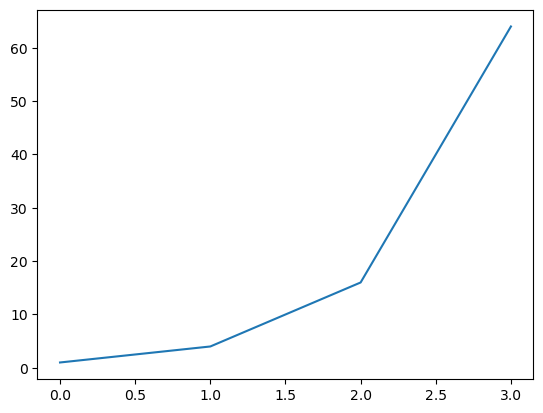

# 0. 시작하며


```python
# 프로그래밍을 시작하면서 Hello World를 출력해야합니다.
print("Hello World")
```

    Hello World
    

# 1. Jupyter Notebook 익혀보기 

- jupyter notebook은 web browser(Chrome, firefox 등)에서 작동하는 파이썬을 interactive하게 다룰 수 있는 툴입니다. cell로 구성되어 있으며, cell은 크게 글이나 그림을 적을 수 있는 markdown cell과 파이썬 코드를 적을 수 있는 code cell로 나누어져 있습니다.


```python
1+1
```


    2


## 1.1 Markdown 작성해보기 

- jupyter notebook에서 cell을 누르고, <kbd>m</kbd>키를 누르면 markdown cell로 바뀌게 됩니다. 그러면 지금처럼 자유롭게 편집을 할 수 있으며, 편집모드에 들어갈땐 <kbd>Enter</kbd>를 누르고, 완료가 되면 <kbd>Shift</kbd> + <kbd>Enter</kbd>를 눌러 실행합니다.

## 1.2 Jupyter Notebook 단축키 

<kbd>m</kbd>: 현재 cell을 markdown cell로 바꿉니다.

<kbd>D</kbd>+<kbd>D</kbd>: 현재 cell을 삭제합니다.

<kbd>o</kbd>: 현재의 cell의 실행결과를 on/off 합니다.

<kbd>Shift</kbd>+<kbd>Arrow up/Arrow down</kbd>: 화살표를 통해 현재 cell을 포함한 여러 cell을 선택합니다.

<kbd>Shift</kbd>+<kbd>Tab</kbd>: [press these two buttons at the same time, once] 함수에 대한 설명이 나옵니다.

# <kbd>1</kbd> : H1

## <kbd>2</kbd> : H2

### <kbd>3</kbd> : H3

#### <kbd>4</kbd> : H4

> 실습: markdown cell을 하나 만들어, 좋아하는 문구 하나씩 작성해 봅니다.


## 1.3 Code 작성 및 Interactive Python 


```python
# 그래프 작성을 위한 라이브러리를 불러옵니다.
import matplotlib.pyplot as plt
# 이미지 입출력을 위한 라이브러리를 불러옵니다.
from PIL import Image
```


```python
plt.plot([1, 4, 16, 64])
plt.show()
```


    

    


```python
Image.open('./baby_cat.jpeg')
```


    

    


```python

```
