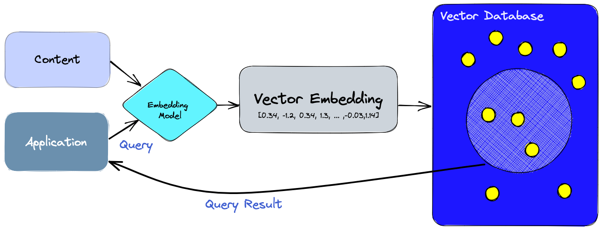

# Vector Database 관련글

## Vector Database란 무엇인가? (pinecone 제공)

*→ 해당 글만 영문 번역해서 읽어보면 대략적인 이해가 가능해 보임*

[What is a Vector Database?](https://www.pinecone.io/learn/vector-database/)

### 웹 페이지 **요약 :**

**"벡터 데이터베이스, AI 혁명의 중심에 서다!"**

우리가 지금 있는 이 시점, AI 혁명이 한창이다. 큰 언어 모델, 생성 AI 등이 대두되면서, 이런 것들을 다루기 위한 벡터 임베딩이 중요해지고 있다. 일반적인 데이터베이스로는 이런 복잡한 데이터를 다루기 버거운데, 벡터 데이터베이스가 이 문제를 해결해주고 있다.

벡터 데이터베이스는 이런 데이터를 특별히 다루도록 설계됐고, 데이터를 최대한 활용할 수 있는 성능과 유연성을 제공하기에 AI에 고급 기능을 추가할 수 있으며 기술 발전에 큰 역할을 하고 있다.

우리는 AI 혁명의 한가운데에 있습니다. 이것은 건드리는 어떤 산업이든 뒤바꾸고 있으며, 위대한 혁신을 약속하고 있지만 새로운 도전도 제기하고 있습니다. **큰 언어 모델, 생성 AI, 의미론적 검색을 포함한 응용 프로그램에서 효율적인 데이터 처리가 어느 때보다 중요**해졌습니다.

이러한 새로운 응용 프로그램은 모두 **벡터 임베딩이라는 데이터 표현 형식에 의존하며, 이것은 AI가 복잡한 작업을 실행할 때 이해하고 장기 메모리를 유지할 수 있도록 도와주는 중요한 의미 정보를 담고 있습니다**.

임베딩은 AI 모델(예: 대형 언어 모델)에 의해 생성되며, 많은 수의 속성이나 특징을 가지고 있어 표현하는 것이 관리하기 어려움입니다. AI와 기계 학습의 맥락에서 이러한 특징들은 **데이터의 다양한 차원을 나타내며, 패턴, 관계, 기본 구조를 이해하는 데 필수적**입니다.

벡터 임베딩을 다루는 도전은 전통적인 스칼라 기반 데이터베이스가 이러한 데이터의 복잡성과 규모를 따라잡지 못해 통찰력을 추출하고 실시간 분석을 수행하는 것이 어렵다는 것입니다. 벡터 데이터베이스가 여기서 중요한 역할을 하며, 이러한 유형의 데이터를 처리하도록 의도적으로 설계되었고, 데이터에서 최대의 이익을 취하기 위해 필요한 성능, 확장성, 유연성을 제공합니다.

벡터 데이터베이스를 사용하면 AI에 의미 정보 검색, 장기 기억 등의 고급 기능을 추가할 수 있습니다. 아래 다이어그램은 이러한 유형의 응용 프로그램에서 벡터 데이터베이스의 역할에 대한 더 나은 이해를 제공합니다.

1. 첫째, 우리는 색인하려는 내용에 대한 벡터 임베딩을 생성하기 위해 임베딩 모델을 사용한다.
2. 벡터 임베딩은 임베딩이 생성된 원래 내용에 대한 참조와 함께 벡터 데이터베이스에 삽입된다.
3. 응용 프로그램이 쿼리를 발행하면, 우리는 쿼리를 위한 임베딩을 생성하기 위해 동일한 임베딩 모델을 사용하고, 그 임베딩을 사용해 데이터베이스에서 유사한 벡터 임베딩을 쿼리한다. 그리고 앞서 언급했듯이, 그 유사한 임베딩은 그것을 생성하는 데 사용된 원래 내용과 연관되어 있다.

## Vector Database 설명 영상

[AI 이미지 검색 엔진 만들기 - 벡터 데이터베이스 설명과 Chroma DB 튜토리얼](https://youtu.be/7WCRhW1Z8NI)

# 참고 자료

[[GN] Vector Database가 무엇인가요?](https://discuss.pytorch.kr/t/gn-vector-database/1516)