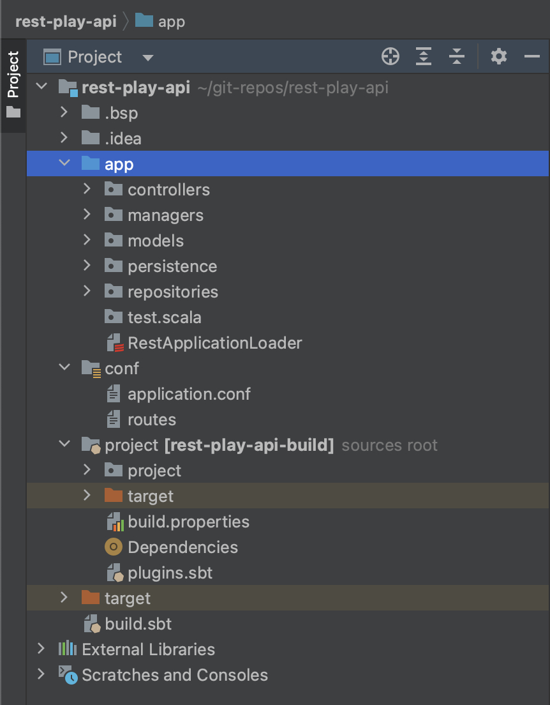
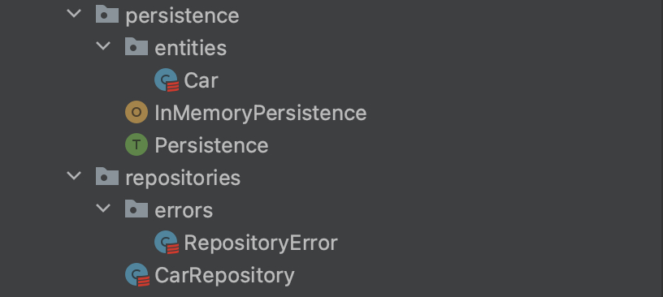
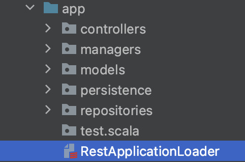
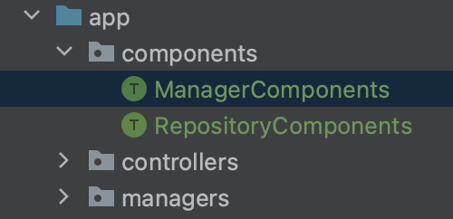
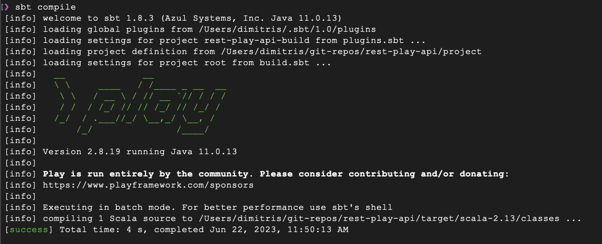
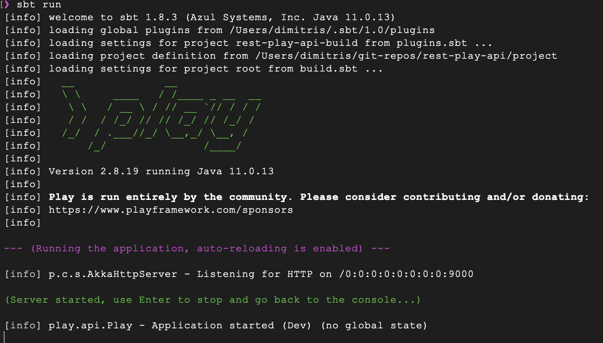

_by [Dimitris Tsolis](https://github.com/dimitrisre)_

## 1. Introduction

One of the simplest and well documented ways to build a web API is to follow the REST paradigm. REST APIs provide a simple and uniform way to
access data and not only through URLs, across the web.
[Play Framework](https://www.playframework.com/) "makes it easy to build web applications with Java & Scala", as it is stated on their site, and it's true. Using Akka under the hood, you get all the benefits of a Reactive system. In this article we will try to develop a basic skeleton for a REST API using Play and Scala.

## 2. Setting Up

Let's start by adding our dependencies on our sbt files.

On `plugins.sbt` add the following plugins. PlayScala plugin defines default settings for Scala-based applications.

```scala
addSbtPlugin("com.typesafe.play" % "sbt-plugin" % "2.8.19")
addSbtPlugin("com.typesafe.sbt" % "sbt-native-packager" % "1.8.1")
```

Finally add on `build.sbt` we add our dependencies on our project
```scala
import sbt._
import Keys._

ThisBuild / version := "0.1.0-SNAPSHOT"

ThisBuild / scalaVersion := "2.13.11"

val playVersion = "2.8.19"
val macWireVersion = "2.5.8"

// this one is redundant as the PlayScala plugin already brings it, but showing here for completeness
val playFramework = "com.typesafe.play" %% "play" % playVersion
val macwire = "com.softwaremill.macwire" %% "macros" % macWireVersion % "provided"

lazy val root = (project in file("."))
  .settings(
    name := "rest-play-api",
    libraryDependencies ++= Seq(playFramework, macwire)
  ).enablePlugins(PlayScala)
```

After using all this you should be ready to create the codebase for our rest api.

## 3. Basic REST Api skeleton project

The image below shows the basic folder and package structure for our project. It is organized based on each layer of concern.



On each layer we define the data (models) and logic (managers, services) that can help us organize and follow the growth of our project and not get lost. This example is extremely simple but for the sake of completion we include all layers. As our project becomes more and more complex, these layers are becoming more useful. Below we will see each layer individually.

## 3.1 Persistence

It is the layer where we define the basic persistence entities and persistence methods. We could use any method that we want, be a database, in memory, a file, should be defined and handled on this layer.



On a persistence trait we define basic functions given from our underlying persistence mechanism. Here we define the mechanism for example purposes. As we can see basic operations on a persisted dataset are defined. We use types A, B, C[_] to make our Persistence layer as abstract as possible.

`A` defines the types we save in our datastore. `B` defines the type of our primary key and `C[_]` defines the type of data structure that we use for persisting our entities. As you will see on the sections that follows for our specific example A corresponds to Car type, B corresponds to Long and C[_] to a ListBuffer.
With this implementation we can easily swap this Layer and use other persistent types.

```scala
package com.rockthejvm.playdemo.persistence

trait Persistence[A, B, C[_]]{
  val db: C[A]
  def insert(entity: A): A
  def find(id: B): Option[A]
  def update(entity: A): Unit
  def delete(id: B): Unit
  def findAll(): List[A]
}
```


Our persisted entity for this model we use a simple Car object. We define below both the case class itself and its DTO (data transfer object) which is able to serialize this case class into a format applicable to our particular database. For convenience, we add some conversion methods between the case class and its DTO.

```scala
package com.rockthejvm.playdemo.persistence.entities

import play.api.libs.json.{Format, Json}

case class Car(id: Long, brand: String, model: String, cc: Int) {
  def toDTO(): CarDTO = CarDTO(Some(id), brand, model, cc)
}

object Car{
  def fromDTO(carDTO: CarDTO): Car = Car(carDTO.id.getOrElse(0L), carDTO.brand, carDTO.model, carDTO.cc)
}

case class CarDTO(id: Option[Long], brand: String, model: String, cc: Int) {
  def toCar(): Car = Car(id.getOrElse(0L), brand, model, cc)
}

object CarDTO{
  implicit val format: Format[CarDTO] = Json.format[CarDTO]
  def fromCar(car: Car): CarDTO = CarDTO(Some(car.id), car.brand, car.model, car.cc)
}
```

We can use a variety of databases with our project. Because our focus is Play itself, we simplify the database as an in-memory object. It is a simple ListBuffer which we can use to do basic operations to insert, find, update, and delete Car entities. We implement basic validations as to avoid duplicates on insert and missing entities on delete and update.

```scala
package com.rockthejvm.playdemo.persistence

import scala.collection.mutable.ListBuffer
import scala.util.Random
import entities.Car

object InMemoryPersistence extends Persistence[Car, Long, ListBuffer]{
  override val db: ListBuffer[Car] = ListBuffer.empty
  val idGenerator = Random

  def insert(car: Car): Car = {
    val idx = db.indexWhere(_.id == car.id)
    val newCar = car.copy(id=idGenerator.nextLong())
    if(idx > -1) throw new RuntimeException(s"Duplicate element with id: ${car.id}")
    else db.addOne(newCar)

    newCar
  }
  def find(id: Long): Option[Car] = db.find(_.id == id)

  def update(car: Car): Unit = {
    val idx = db.indexWhere(_.id == car.id)
    if(idx > -1) db.update(idx, car)
    else throw new RuntimeException(s"No element to update with id: ${car.id}")
  }

  def delete(id: Long): Unit = {
    val idx = db.indexWhere(_.id == id)
    if(idx > -1 ) db.remove(idx)
    else throw new RuntimeException(s"No element to delete with id: ${id}")
  }

  def findAll(): List[Car] = db.toList
}
```

One layer above persistence is the repository layer: a repository is able to retrieve data at a higher level with possibly more complex operations than the database can handle natively. Below we have an example of such a repository for cars - the implementations are simple wrappers over the persistence layer, but we can easily imagine more complex operations.

The purpose of this new layer is to eliminate the mental burden required for bigger operations, e.g. which tables to access the data from, what kinds of joins, etc.

Another important aspect of this layer is error handling, which we include below, in the form of a specific exception which will be thrown at this level.

```scala
package com.rockthejvm.playdemo.repositories

import persistence.Persistence
import persistence.entities.Car
import repositories.errors.RepositoryError

import scala.collection.mutable.ListBuffer
import scala.util.Try

class CarRepository(val db: Persistence[Car, Long, ListBuffer]){
  def findById(id: Long): Either[RepositoryError, Option[Car]] = handleIfErrors(db.find(id))
  def save(car: Car): Either[RepositoryError, Car] = handleIfErrors(db.insert(car))
  def update(car: Car): Either[RepositoryError, Unit] = handleIfErrors(db.update(car))
  def delete(id: Long): Either[RepositoryError, Unit] = handleIfErrors(db.delete(id))
  def findAll(): Either[RepositoryError, List[Car]] = handleIfErrors(db.findAll())

  private def handleIfErrors[A](f: => A) =
    Try(f).fold(e => Left(RepositoryError(e.getMessage)), v => Right(v))

}
```

```scala
package com.rockthejvm.playdemo.repositories.errors

case class RepositoryError(message: String)
```

## 3.2 Managers

The "managers" (or "services") layer usually contains logic to manage multiple resources e.g. repositories, transactions, connections, securitym etc. The objective of this layer is the real _business logic_ of our application. Everything else is abstracted away.

Here we define a simple manager for car entities. As good practice, each manager has its own trait with its own implementation taking some constructor arguments in the style of classical "dependency injection".


```scala
package com.rockthejvm.playdemo.managers

import com.rockthejvm.playdemo.managers.errors.ManagerError
import com.rockthejvm.playdemo.persistence.entities.CarDTO
import com.rockthejvm.playdemo.repositories.CarRepository
import com.rockthejvm.playdemo.repositories.errors.RepositoryError

trait CarManager {
  def get(id: Long): Either[ManagerError, Option[CarDTO]]
  def save(car: CarDTO): Either[ManagerError, CarDTO]
  def update(car: CarDTO): Either[ManagerError, Unit]
  def delete(car: CarDTO): Either[ManagerError, Unit]
  def getAll(): Either[ManagerError, List[CarDTO]]
}

class CarManagerLive(repository: CarRepository) extends CarManager {
  override def get(id: Long): Either[ManagerError, Option[CarDTO]] =
    repository
      .findById(id)
      .fold(
        error => Left(toManagerError(error)),
        car => Right(car.map(_.toDTO()))
      )

  override def save(carDTO: CarDTO): Either[ManagerError, CarDTO] =
    repository
      .save(carDTO.toCar())
      .fold(error => Left(toManagerError(error)), car => Right(car.toDTO()))

  override def update(carDTO: CarDTO): Either[ManagerError, Unit] =
    repository
      .update(carDTO.toCar())
      .fold(error => Left(toManagerError(error)), _ => Right(()))

  override def delete(carDTO: CarDTO): Either[ManagerError, Unit] =
    repository
      .delete(carDTO.id.getOrElse(0L))
      .fold(error => Left(toManagerError(error)), _ => Right(()))

  override def getAll(): Either[ManagerError, List[CarDTO]] =
    repository
      .findAll()
      .fold(
        error => Left(toManagerError(error)),
        carList => Right(carList.map(_.toDTO()))
      )

  private def toManagerError(repositoryError: RepositoryError) =
    ManagerError(repositoryError.message)

}
```

We also include an error type for this layer as well.

```scala
package managers.errors

case class ManagerError(val message: String)
```

The example in the code above is very simple because we simply invoke methods from the repository. But assume we also wanted to keep track of the most popular cars that were requested (so that the marketing department can do their thing with the data), so we'd do some more than just fetching the cars from the database. For example, we could keep a field on our database entity for how many sales does a car model do in a month. We would then modify our manager to fetch the cars and order them by the new sales field.

Below you can see how our entity and manager would change: we add a new field in the Car data type, a new method in the Manager trait and the implementation of that method in the "live" version of the manager.

```scala
case class Car(id: Long, brand: String, model: String, cc: Int, /* new field -> */sales: Long)

trait CarManager {
  // ... rest of the code
  // new method
  def getCarsOrderedBySales(): Either[ManagerError, List[CarDTO]]
}

class CarManagerLive(repository: CarRepository) extends CarManager {

  // ... rest of the code
  // new method implementation
  override def getCarsOrderedBySales(): Either[ManagerError, List[CarDTO]] =
    repository
      .findAll()
      .sortBy(_.sales)
      .reverse
      .fold(error => Left(toManagerError(error)), carList => Right(carList.map(_.toDTO())))
}
```

As you can see, it's relatively easy to add or change implementations of business logic, because the rest of the layers are independent.

## 3.3 Controllers

Above the business layer logic, we need to expose a public HTTP API. This is where the "controllers" live: the implementation of the public REST API.

```scala
package controllers

import controllers.actions.CarActions
import play.api.mvc.{BaseController, ControllerComponents, PlayBodyParsers}
import managers.CarManager
import models.CarDTO
import play.api.libs.json.Json

import scala.concurrent.ExecutionContext

class HomeController(val carManager: CarManager, val controllerComponents: ControllerComponents)(implicit val ec: ExecutionContext)
  extends BaseController {

  def get(id: Long) = Action{
    carManager
      .get(id)
      .fold(
        error => BadRequest(error.message),
        result => result.map(car => Ok(Json.toJson(car))).getOrElse(NoContent)
      )
  }

  def getAll() = Action {
    carManager
      .getAll()
      .fold(
        error => BadRequest(error.message),
        result => Ok(Json.toJson(result))
      )
  }

  def update() = Action(parse.json[CarDTO]){ implicit request =>
      carManager
      .update(request.body)
      .fold(
        error => BadRequest(error.message),
        _ => NoContent
      )
  }

  def save() = Action(parse.json[CarDTO]){ implicit request =>
    carManager
      .save(request.body)
      .fold(
        error => BadRequest(error.message),
        car => Ok(Json.toJson(car))
      )
  }

  def index() = Action{
    Ok("This is a test")
  }
}
```

[Actions](https://www.playframework.com/documentation/2.8.x/ScalaActions) are the building block for Play framework. It is the way the web client makes an HTTP request and receives back an HTTP Response.

An Action is essentially a `Request[A] => Result` function that handles the communication with the web client. The `A` type parameter represents the type of the request body.

Actions provide some minimum operations on the Requests like providing a parser for the body. Depending on the content type of our request (json, xml etc) we can implement how our application will decode the Requests body, by providing a [BodyParser](https://www.playframework.com/documentation/2.8.x/JavaBodyParsers#What-is-a-body-parser?) to our Action. We have for free the `DefaultBodyParsers` that can handle any common type of request body(text/plain, application/json, application/xml, application/text-xml, application/XXX+xml, application/x-www-form-urlencoded, multipart/form-data).

On `Actions` we implement the `apply` function that contains the logic we apply on a request to get the desired result back.

```scala
 val echo = Action { request =>
   Ok("Got request [" + request + "]")
 }
```

In the above simple example, we see how we can implement a simple echo Action that return an HTTP `200 OK` response with the request as the content of the response.

You may have noticed that our `HomeController` currently lacks an implementation of a "delete" endpoint. That's a more complex operation.

We usually use [ActionBuilder](https://www.playframework.com/documentation/2.8.x/ScalaActionsComposition#Custom-action-builders), as we do in our project, to create chainable `Actions` composing the apply function of each one. This is especially helpful if we want to compose together common logic to many different actions.


Below we define our simple Actions trait for cars, for our simple use-case .

```scala
package com.rockthejvm.playdemo.controllers.actions

import com.rockthejvm.playdemo.managers.CarManager
import com.rockthejvm.playdemo.persistence.entities.CarDTO
import play.api.mvc.{ActionBuilder, ActionTransformer, AnyContent, BodyParser, BodyParsers, PlayBodyParsers, Request, WrappedRequest}

import scala.concurrent.{ExecutionContext, Future}

trait CarActions {
  def playBodyParsers: PlayBodyParsers
  def carManager: CarManager

  implicit val ec: ExecutionContext

  class CarRequest[A](val carDTO: Option[CarDTO], request: Request[A]) extends WrappedRequest[A](request)

  def carAction(id: Long) = new ActionBuilder[CarRequest, AnyContent]
    with ActionTransformer[Request, CarRequest] {
    def transform[A](request: Request[A]): Future[CarRequest[A]] = {
      Future{
        carManager.get(id).fold(_ => new CarRequest(None, request), car => new CarRequest(car, request))
      }(executionContext)
    }

    override def parser: BodyParser[AnyContent] = playBodyParsers.default

    override protected def executionContext: ExecutionContext = ec
  }
}
```

This is especially useful in case we need to refine the request to our application. In this specific example we create a [WrappedRequest](https://www.playframework.com/documentation/2.8.x/api/scala/play/api/mvc/WrappedRequest.html) to add the entity information on our Request when a user passes the id on a call.

We use the [ActionBuilder](https://www.playframework.com/documentation/2.8.x/api/scala/play/api/mvc/ActionBuilder.html) to create an Action that takes a CarRequest instead of a Request. We mix in the [ActionTransformer](https://www.playframework.com/documentation/2.8.x/api/scala/play/api/mvc/ActionTransformer.html) so we can transform the Request object to a CarRequest by doing a call to our manager layer and retrieving a car DTO.

With this new complex action, we can implement our "delete" endpoint as follows:

```scala
class HomeController(val carManager: CarManager, val controllerComponents: ControllerComponents)(implicit val ec: ExecutionContext)
  extends BaseController {

  // ... the rest of the code
  def delete(id: Long) = CarAction(id){ implicit request =>
    request.carDTO.map(car =>
      carManager
        .delete(car)
        .fold(
          error => BadRequest(error.message),
          _ => NoContent
        )
    ).getOrElse(BadRequest)
  }

  override def playBodyParsers: PlayBodyParsers = controllerComponents.parsers
}
```

A note: the "delete" endpoint could have been written with the same constructs (plain Actions) as the other endpoints; we wanted to show you how we can build custom actions that map HTTP requests to other types that are more relevant for our application.

At this point, we only have the endpoints' implementation - we also need to map them to the URIs that they will respond to.
This is achieved through the routes file, that is placed inside our `conf` directory:


```text
GET     /                 controllers.HomeController.index()
GET     /car/:id          controllers.HomeController.get(id: Long)
GET     /cars             controllers.HomeController.getAll()

+ nocsrf
DELETE  /car/delete/:id    controllers.HomeController.delete(id: Long)
+ nocsrf
PUT     /car/update        controllers.HomeController.update()
+ nocsrf
POST    /car/save          controllers.HomeController.save()
```

Here we define the HTTP method for a specific URI and the method from our controllers layer that will get called when the URI is hit.

## 3.4 Application Loader

Finally, we need to put all of the above together and define our main application entry.



We use application loaders to wire everything together and make our application ready to available for service. We provide a context and get back an application.

```scala
  final case class Context(
      environment: Environment,
      initialConfiguration: Configuration,
      lifecycle: ApplicationLifecycle,
      devContext: Option[DevContext]
  )
```
The [Context](https://www.playframework.com/documentation/2.8.x/api/scala/play/api/ApplicationLoader$$Context.html) is gathered from system data needed for the application to run. like the environment which describes where all the classes will be found for this application, where the application will be deployed and in which mode, dev, test, production.

We also find `initialConfiguration`, which is the configuration that the application may need to get to the running state. It up to the developer to use, extend or ignore this initial configuration object. The `lifecycle` is where we can define hooks for startup initialization or cleanup.  The `devContext` is extra data provided when the application is initialized in dev mode.

To load an application we need to provide all the necessary components like the routes of our application, the configuration needed which consists of the [built-in components](https://www.playframework.com/documentation/2.8.x/api/scala/play/api/BuiltInComponents.html) that we extend with our components like our managers, controllers and routes. This is the place where we instantiate our classes.

Here we define and initialize our main entry point. Initialize all needed components like Managers, Repositories, Routers etc. and finally return an instance of our application.

```scala
import controllers.HomeController
import managers.CarManager
import persistence.InMemoryPersistence
import play.api.mvc.EssentialFilter
import play.filters.HttpFiltersComponents
import play.api.routing.Router
import play.api.{Application, ApplicationLoader, BuiltInComponentsFromContext}
import play.filters.csrf.CSRF
import repositories.CarRepository
import router.Routes


class RestApplicationLoader extends ApplicationLoader{
  def load(context: ApplicationLoader.Context): Application = {
    val components = new RestApiComponents(context)

    components.application
  }
}

class RestApiComponents(context: ApplicationLoader.Context)
  extends BuiltInComponentsFromContext(context) with HttpFiltersComponents{

  lazy val carRepository: CarRepository = new CarRepository(InMemoryPersistence)
  lazy val carManager: CarManager = new CarManager(carRepository)
  lazy val homeController: HomeController = new HomeController(carManager, controllerComponents)
  lazy val router: Router = new Routes(httpErrorHandler, homeController, "/")

  override def httpFilters: Seq[EssentialFilter] = super.httpFilters
}
```

## 4 Dependency Injection

In this simple example we initialize all needed classes "by hand", manual Dependency injection, but as the project is getting more complex we may want to switch to a more advanced framework, like [Guice](https://github.com/google/guice) or [Macwire](https://github.com/softwaremill/macwire), included in our `build.sbt` (see the beginning of the article).

For example instead of having all components initialized on RestApiComponents we could have them grouped in different component traits and on the application loader we could mix in those traits. In those traits a DI framework could help as drop the tedious work of manually passing all variables needed.

We could add a components package containing our grouped components:


that have this structure:

```scala
package components
import com.softwaremill.macwire._
import managers.CarManager

trait ManagerComponents {
  lazy val carManager: CarManager = wire[CarManager]
}
```
```scala
package components

import com.softwaremill.macwire.wire
import persistence.entities.Car
import persistence.{InMemoryPersistence, Persistence}
import repositories.CarRepository

import scala.collection.mutable.ListBuffer

trait RepositoryComponents {
  lazy val persistence: Persistence[Car, Long, ListBuffer] = InMemoryPersistence
  lazy val carRepository: CarRepository = wire[CarRepository]
}
```

So the application loader would be transformed like this:
```scala
import components.{ManagerComponents, RepositoryComponents}
import controllers.HomeController
import play.api.mvc.EssentialFilter
import play.filters.HttpFiltersComponents
import play.api.routing.Router
import play.api.{Application, ApplicationLoader, BuiltInComponentsFromContext}
import router.Routes


class RestApplicationLoader extends ApplicationLoader {
  def load(context: ApplicationLoader.Context): Application = {
    val components = new RestApiComponents(context)

    components.application
  }
}

class RestApiComponents(context: ApplicationLoader.Context)
  extends BuiltInComponentsFromContext(context)
    with HttpFiltersComponents
    with ManagerComponents
    with RepositoryComponents { // mix traits here

  lazy val homeController: HomeController = new HomeController(carManager, controllerComponents)
  lazy val router: Router = new Routes(httpErrorHandler, homeController, "/")

  override def httpFilters: Seq[EssentialFilter] = super.httpFilters
}
```

We combine the ManagerComponents and RepositoryComponents and we have our instances with minimum effort to initialize them. For this example this is an over-engineered change, but in a more complex project this could be very useful.

We need to add the framework dependency on build.sbt

## 5 Building and running the project

In order to build and run our project we start an sbt compile and run our application.

```bash
sbt compile
sbt run
```

After running sbt compile you should see something like this:



After running sbt run you should see something like this:


The app truly starts on the first request, and reloads automatically upon code changes.

## 6 Conclusion

Play framework is relatively straightforward to learn, compared to others, e.g. Spring MVC. It uses technologies like Akka that are established, have extensive documentation and tools to debug. It is designed so that you can use parts of the framework as you need, and this makes your applications lighter. Its integration with Scala is very good, but it follows a more Object oriented approach than a more functional one, as is the case for other libraries like http4s. You can write tests for your application using ScalaTest which for a Scala developer it is a plus.

All in all it is a fun and easy way to write from simple to more complex applications, definitely get your hands dirty with Play framework.
