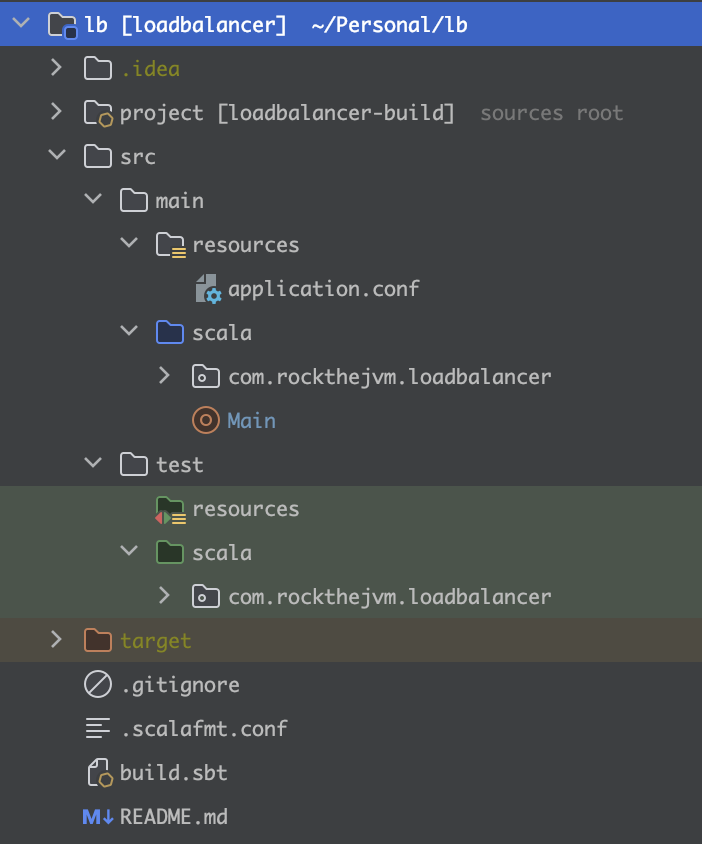

_by [Anzori (Nika) Ghurtchumelia](https://github.com/ghurtchu)_

Video version:



## 1. Introduction

> _"What I cannot build, I do not understand"_
> Richard Feynman

In this article we will make use of `cats.effect.Ref`, `cats.effect.IO` and `http4s` to build an application layer load balancer.

A load balancer usually sits in front of a few servers and forwards the HTTP requests to them based on some algorithm. The goal of a load balancer is
to "balance the load" by distributing it to the available backends.

There are different algorithms that can be used to achieve this goal, in this case we're going to be using Round Robin algorithm.

Our load balancer must:
- be effective in distributing requests to the backends (Round Robin Algorithm)
- make sure that requests are forwarded only to the available backends (Reliability)
- manage the state safely while the backends die and come back online (Periodic health checks)

## 2. Project Structure

We will use Scala 3.3.0, SBT 1.9.4 and several monumental libraries to complete our project.

The initial project skeleton:
- `src/main/scala` groups production code
- `src/test/scala` groups tests
- `src/main/resources/application.conf` defines the project configuration
- `.scalafmt.conf` is used to format the code
- `build.sbt` is responsible for building the project and generating `lb.jar` which we can run with `java` or `scala`


Let's have a look at the libraries listed in `build.sbt`:
- first three dependencies which start with `org.http4s` are concerned with the HTTP server & client and handy dsl for creating `HttpRoutes`
- `munit`and `munit-cats-effect-3` are libraries which will help us in testing both, synchronous and effectful (IO-based) code
- last two libraries will be used for logging and loading project configuration respectively

```scala
val Http4sVersion          = "0.23.23"
val CirceVersion           = "0.14.5"
val MunitVersion           = "0.7.29"
val LogbackVersion         = "1.4.11"
val MunitCatsEffectVersion = "1.0.7"

lazy val root = (project in file("."))
  .settings(
    organization                     := "com.rockthejvm",
    name                             := "loadbalancer",
    scalaVersion                     := "3.3.0",
    libraryDependencies ++= Seq(
      "org.http4s"            %% "http4s-ember-server" % Http4sVersion,
      "org.http4s"            %% "http4s-ember-client" % Http4sVersion,
      "org.http4s"            %% "http4s-dsl"          % Http4sVersion,
      "org.scalameta"         %% "munit"               % MunitVersion           % Test,
      "org.typelevel"         %% "munit-cats-effect-3" % MunitCatsEffectVersion % Test,
      "ch.qos.logback"         % "logback-classic"     % LogbackVersion         % Runtime,
      "com.github.pureconfig" %% "pureconfig-core"     % "0.17.4",
    ),
    assembly / assemblyMergeStrategy := {
      case "module-info.class" => MergeStrategy.discard
      case x                   => (assembly / assemblyMergeStrategy).value.apply(x)
    },
    assembly / mainClass             := Some("Main"),
    assembly / assemblyJarName       := "lb.jar",
  )
```

and a one line definition in `project/plugins.sbt`:
```scala
addSbtPlugin("com.eed3si9n" % "sbt-assembly" % "2.1.1") // SBT plugin for using assembly command
```

Every non-trivial project must include at least two packages:
- `domain` - which describes the business entities of the application
- `services` - isolated pieces of logic which use `domain` and other `services` to achieve some goals

In our case we will also have additional two packages:
- `errors` - for grouping different error representations
- `http` - for grouping `HttpClient`, `HttpServer`, `HttpServerStatus` and related entities

With that we can move on to defining some data models.

## 3. Domain Modeling
The domain of load balancer is pretty straightforward. Let's unfold it step by step.

In a load balancer, you often need to handle requests and route them to different backend servers based on the URL or other request attributes. The `Url` case class which we'll write provides a convenient way to represent and manipulate URLs in a strongly-typed manner, making it easier to work with URL-related logic in the load balancer. Using a dedicated `Url` type makes the code more self-explanatory and provides a clear and meaningful abstraction for URLs.

So, let's define it in the `domain` package, extend `AnyVal` for the compiler to optimize boxing where it's possible (we could have used Scala 3 `opaque type` but it doesn't work well with `pureconfig` unfortunately) and override its `toString` method for logging purposes:

```scala
package com.rockthejvm.loadbalancer.domain

final case class Url(value: String) extends AnyVal:
  override def toString: String = value
```

In a load balancer, we typically need to manage a collection of backend server URLs to distribute incoming requests. The `Urls` case class which we will define in `domain` module provides a structured and type-safe way to store and manipulate these URLs as a collection:

```scala
package com.rockthejvm.loadbalancer.domain

import scala.util.Try

final case class Urls(values: Vector[Url]) extends AnyVal {

  def currentOpt: Option[Url] =
    Try(currentUnsafe).toOption

  def currentUnsafe: Url =
    values.head

  def remove(url: Url): Urls =
    copy(values.filter(_ != url))

  def add(url: Url): Urls =
    if (values contains url) this
    else copy(values :+ url)
}

object Urls {
  def empty: Urls = Urls(Vector.empty)
}
```

The `add` and `remove` methods allow you to dynamically manage the list of backend servers. This is valuable because in a real-world scenario, backend servers may come online or go offline, and the load balancer needs to adapt accordingly. These methods ensure that you don't deal with incorrect set of URLs, which could lead to uneven load distribution.

`currentUnsafe` and `currentOpt` methods are pretty much self-explanatory.

As a next step we can write some unit tests to make sure that `Urls` API is sound. Such unit tests help ensure the correctness of the `Urls` class's functionality and behavior in various scenarios. They are essential for catching bugs or regressions when making changes to the `Urls` class.

So, let's introduce `munit` library and create `UrlsTest.scala`:

```scala
package com.rockthejvm.loadbalancer.domain

import com.rockthejvm.loadbalancer.domain.{Url, Urls}
import munit.FunSuite

class UrlsTest extends FunSuite {

  private def sequentialUrls(from: Int, to: Int): Urls = Urls {
    (from to to)
      .map(i => Url(s"url$i"))
      .toVector
  }

  test("Urls(url1, url2, ...).currentOpt must return Some(url1)") {
    val urls     = sequentialUrls(1, 5)
    val obtained = urls.currentOpt.map(_.value)
    val expected = Some("url1")

    assertEquals(obtained, expected)
  }

  test("Urls.empty.currentOpt must return None") {
    val obtained = Urls.empty.currentOpt.map(_.value)

    assertEquals(obtained, None)
  }

  test("Urls(url1, url2, ...).currentUnsafe must return url1") {
    val urls     = sequentialUrls(1, 5)
    val obtained = urls.currentUnsafe.value
    val expected = "url1"

    assertEquals(obtained, expected)
  }

  test("Urls.empty.currentUnsafe should throw NoSuchElementException (based on Vector implementation)") {
    intercept[NoSuchElementException] {
      Urls.empty.currentUnsafe
    }
  }

  test("Urls(url1, url2, ...).remove should drop url1") {
    val urls     = sequentialUrls(1, 5)
    val obtained = urls.remove(Url("url1"))
    val expected = sequentialUrls(2, 5)

    assertEquals(obtained, expected)
  }

  test("Urls(url2, url3, ...).add should append url1 to the end of the Vector") {
    val urls     = sequentialUrls(2, 5)
    val obtained = urls.add(Url("url1"))
    val expected = Urls(urls.values :+ Url("url1"))

    assertEquals(obtained, expected)
  }
}
```

Let's run tests in SBT:
```shell
sbt:loadbalancer> test
[info] compiling 1 Scala source to ~/loadbalancer/target/scala-3.3.0/test-classes ...
com.rockthejvm.loadbalancer.domain.UrlsTest:
  + Urls(...).next must put url1 in the end of the list and url2 at the top 0.005s
  + Urls(url1).next must return the same - Urls(url1) 0.0s
  + Urls(url1, url2, ...).currentOpt must return Some(url1) 0.001s
  + Urls.empty.currentOpt must return None 0.0s
  + Urls(url1, url2, ...).currentUnsafe must return url1 0.001s
  + Urls.empty.currentUnsafe should throw NoSuchElementException (based on Vector implementation) 0.0s
  + Urls(url1, url2, ...).remove should drop url1 0.0s
  + Urls(url2, url3, ...).add should append url1 to the end of the Vector 0.0s
[info] Passed: Total 8, Failed 0, Errors 0, Passed 8
[success] Total time: 0 s, completed Sep 9, 2023, 10:58:09 AM
```

Good start!

Later we will need to define the model for working with configuration - a case class `Config`, but it will require to have a model for describing the health check intervals in a type safe manner, let's put it under `domain` as well:
```scala
package com.rockthejvm.loadbalancer.domain

final case class HealthCheckInterval(value: Long) extends AnyVal
```

`HealthCheckInterval` will indicate the delay between checking server healths in a Round Robin fashion.

Now it's time to make load balancer configurable, this way it will be more flexible and easy to tweak.

By default, the configuration file locations is: `src/main/resources/application.conf` and it follows `HOCON` format.

You may have different ideas as to what to configure, but I believe there are four must have things:
- `port` - load balancer port
- `host` - load balancer host (port + host = url)
- `backends` - this setting is crucial for a load balancer as it defines the pool of backend servers that the load balancer will distribute incoming requests to, so a collection of backend url-s
- `health-check-interval` - this setting specifies the frequency at which the load balancer should conduct health checks on the backend servers. (`HealthCheckInterval` which we defined above)

So, the actual `application.conf` may look like:

```conf
port=8080,
host="localhost",
backends=[
 "http://localhost:8081",
 "http://localhost:8082",
 "http://localhost:8083"
],
health-check-interval=3
```

In summary, this configuration is important when implementing a load balancer because it determines how incoming client requests are received, which backend servers they are forwarded to, and how the health and availability of these servers are monitored. Proper configuration and management of these settings are crucial for ensuring that the load balancer operates effectively, efficiently balances the load, and provides high availability for the application or service it serves.

Now we can create the `Config` model under `domain` package for capturing the aforementioned idea:

```scala
package com.rockthejvm.loadbalancer.domain

import com.rockthejvm.loadbalancer.domain.Url
import pureconfig.ConfigReader
import pureconfig._
import pureconfig.generic.derivation.default._

final case class Config(
    port: Int,
    host: String,
    backends: Urls,
    healthCheckInterval: HealthCheckInterval
) derives ConfigReader

object Config {
  given urlsReader: ConfigReader[Urls] = ConfigReader[Vector[Url]].map(Urls.apply)

  given urlReader: ConfigReader[Url] = ConfigReader[String].map(Url.apply)

  given healthCheckReader: ConfigReader[HealthCheckInterval] =
  ConfigReader[Long].map(HealthCheckInterval.apply)
}
```

Let's explain what these `givens` do in the companion object of `Config`:

First of all the `derives ConfigReader` annotation instructs `PureConfig` to automatically derive a configuration reader for this case class, allowing it to be used to parse configuration files into `Config` instances. This requires that there must be `given` ConfigReaders for all members (recursively). Because extending `AnyVal` prevents using `derives` clauses, so need to define the `given`-s ourselves.

`given urlsReader: ConfigReader[Urls]:` This custom reader is defined for the `Urls` type and instructs `PureConfig` to read a configuration value of type `Vector[Url]` and map it to an `Urls` instance using the `Urls.apply` constructor.

`given urlReader: ConfigReader[Url]:` This custom reader is defined for the Url type and instructs `PureConfig` to read a configuration value of type `String` and map it to a `Url` instance using the `Url.apply` constructor.

`given healthCheckReader: ConfigReader[HealthCheckInterval]:` This custom reader is defined for the `HealthCheckInterval` type and instructs `PureConfig` to read a configuration value of type `Long` and map it to a `HealthCheckInterval` instance using the `HealthCheckInterval.apply` constructor.

Splendid!

It may happen that the `application.conf` is configured incorrectly, and we should not allow the app to be run, for that let's create some sort of error type. In order to do to that we first need to create `errors` package under `com.rockthejvm.loadbalancer` and put the following code there under `config` object:
```scala
package com.rockthejvm.loadbalancer.errors

object config {
  type InvalidConfig = InvalidConfig.type

  case object InvalidConfig extends Throwable {
    override def getMessage: String =
      "Invalid port or host, please fix Config"
  }
}
```


Ok, what about the fact that our load balancer should incorporate concurrency and thread-safety?

It is apparent that the load balancer will have to handle concurrent requests from different clients which can be issued even the same time! So we need to make sure that the state updates for
`Urls` are atomic.

For that we can make use of `cats.effect.Ref`, however we need to distinguish between two completely separate problems:
- forwarding requests to the backends and returning the response to the clients (main feature)
- checking the health of the backends (secondary feature)

So, clearly we see that we need to have two separate instances which wrap `cats.effect.Ref`. Let's name them as `Backends` and `HealthChecks` and put them under `domain` package:

```scala
package com.rockthejvm.loadbalancer.domain

import cats.effect.{IO, Ref}

enum UrlsRef(val urls: Ref[IO, Urls]) {
  case Backends(override val urls: Ref[IO, Urls])     extends UrlsRef(urls)
  case HealthChecks(override val urls: Ref[IO, Urls]) extends UrlsRef(urls)
}
```

In this code, the `UrlsRef` enumeration is used to represent different types of references (possibly mutable state) related to URL management in a load balancer or a similar application. The use of `Ref[IO, Urls]` suggests that these references are handled within the Cats Effect's IO monad, which is used for handling effectful operations in a purely functional manner.

The actual usage and behavior of these references would depend on the rest of the codebase where this enumeration is used. They might be used for managing, updating, or querying the URLs or health checks in a load balancer system in a thread-safe and functional way.

Before moving on let's actually make sure that our code compiles:
```shell
sbt:loadbalancer> compile
[info] compiling 2 Scala sources to ~/loadbalancer/target/scala-3.3.0/classes ...
[success] Total time: 1 s, completed Sep 9, 2023, 11:01:17 AM
```

With this we have finished modeling the domain and tested it. Now we can move on to the more interesting part - defining services.

## 3. Services

There are a handful of services which can be useful to abstract over to make them reusable, isolated and testable:
- parsing `org.http4s.Uri`-s from strings (since we work with `http4s` we need to build `org.http4s.Uri`-s, otherwise we won't be able to make HTTP requests)
- adding request paths to the backend urls (we may receive the request on the url: `http://localhost:8080/items/1` and the current backend url is `http://localhost:8082`, we need some piece of logic which creates the following URL: `http://localhost:8082/items/1`)
- having the abstraction of HTTP client for sending requests which will make testing dependent services easier
- sending requests to backends (main feature) and health checks (secondary feature)
- applying Round Robin to `HealthChecks` and `Backends` on each request (through the `cats.effect.Ref` API)
- updating `Backends` based on health check responses (adding or removing backends through `cats.effect.Ref` API)

Let's gradually follow the list above:

As we mentioned, we need a proper service for constructing `org.http4s.Uri` because we'll be using `http4s` and its inclusive ecosystem to write the HTTP server for our load balancer.

So, the initial `Uri` parser could look like:

```scala
package com.rockthejvm.loadbalancer.services

import cats.syntax.either._
import org.http4s.Uri

trait ParseUri {
  def apply(uri: String): Either[Throwable, Uri]
}

object ParseUri {

  object Impl extends ParseUri {
    /**
     * Either returns proper Uri or InvalidUri
     */
    override def apply(uri: String): Either[Throwable, Uri] =
      Uri
        .fromString(uri)
        .leftMap(_ => ???)
  }
}
```

There's a room for improvement here, instead of `Throwable` we could create some sort of error representation under `parsers` object in the `errores` package and use that here. We can name it `InvalidConfig` which will look like this:
```scala
package com.rockthejvm.loadbalancer.errors

object parsing {
  final case class InvalidUri(uri: String) extends Throwable {
    override def getMessage: String =
      s"Could not construct proper URI from $uri"
  }
}
```

So, now let's refactor our initial `ParseUri`:
```scala
package com.rockthejvm.loadbalancer.services

import com.rockthejvm.loadbalancer.errors.parsing.InvalidUri
import cats.syntax.either._
import org.http4s.Uri

trait ParseUri {
  def apply(uri: String): Either[InvalidUri, Uri]

  object ParseUri {
    object Impl extends ParseUri {
      /**
       * Either returns proper Uri or InvalidUri
       */
      override def apply(uri: String): Either[InvalidUri, Uri] =
        Uri
          .fromString(uri)
          .leftMap(_ => InvalidUri(uri))
    }
  }
}
```

And the tests for `ParseUri`:
```scala
package com.rockthejvm.loadbalancer.services

import com.rockthejvm.loadbalancer.errors.parsing.InvalidUri
import munit.FunSuite
import org.http4s.Uri
import cats.syntax.either._

class ParseUriTest extends FunSuite {
  val parseUri = ParseUri.Impl

  test("try parsing valid URI and return Right(Uri(...))") {
    val uri      = "0.0.0.0/8080"
    val obtained = parseUri(uri)

    assertEquals(obtained, Uri.unsafeFromString(uri).asRight)
  }

  test("try parsing invalid URI and return Left(InvalidUri(...))") {
    val uri      = "definitely invalid uri XD"
    val obtained = parseUri(uri)

    assertEquals(obtained, InvalidUri(uri).asLeft)
  }
}
```

And run them via SBT:
```shell
sbt:loadbalancer> test
[info] compiling 1 Scala source to ~/loadbalancer/target/scala-3.3.0/classes ...
[info] compiling 2 Scala sources to ~/loadbalancer/target/scala-3.3.0/test-classes ...
com.rockthejvm.loadbalancer.domain.UrlsTest:
  + Urls(...).next must put url1 in the end of the list and url2 at the top 0.025s
  + Urls(url1).next must return the same - Urls(url1) 0.001s
  + Urls(url1, url2, ...).currentOpt must return Some(url1) 0.001s
  + Urls.empty.currentOpt must return None 0.0s
  + Urls(url1, url2, ...).currentUnsafe must return url1 0.0s
  + Urls.empty.currentUnsafe should throw NoSuchElementException (based on Vector implementation) 0.0s
  + Urls(url1, url2, ...).remove should drop url1 0.001s
  + Urls(url2, url3, ...).add should append url1 to the end of the Vector 0.0s
com.rockthejvm.loadbalancer.services.ParseUriTest:
  + try parsing valid URI and return Right(Uri(...)) 0.235s
  + try parsing invalid URI and return Left(InvalidUri(...)) 0.014s
[info] Passed: Total 10, Failed 0, Errors 0, Passed 10
[success] Total time: 2 s, completed Sep 9, 2023, 11:23:36 AM
```

Going good so far!

Now we need some sort of service which correctly maps the load balancer request URL to the appropriate backend URL. I decided to name it as `AddRequestPathToBackendUrl`:
```scala
package com.rockthejvm.loadbalancer.services

import cats.effect.IO
import org.http4s.Request

trait AddRequestPathToBackendUrl {
  def apply(backendUrl: String, request: Request[IO]): String
}

object AddRequestPathToBackendUrl {
  object Impl extends AddRequestPathToBackendUrl {
    override def apply(backendUrl: String, request: Request[IO]): String =
      val requestPath = request.uri.path.renderString
        .dropWhile(_ != '/')

      backendUrl concat requestPath
  }
}
```

Let's explain what's going on in the implementation:
- `val requestPath = request.uri.path.renderString` extracts the request path from the `request.uri.` (e.g the request URL can be `http://localhost:8080/items/1`)
- `dropWhile(_ != '/')` removes characters from the beginning of the request path until the first `/` is encountered. (e.g if the request URL is `http://localhost:8080/items/1` it will return `/items/1`)
- `backendUrl concat requestPath` concatenates the `backendUrl` and the modified `requestPath` to form the final URL. (if the backend url is `http://localhost:8082` and request path is `/items/1` then the proper backend url becomes `http://localhost:8082/items/1`)

I believe tests should explain the intentions better:
```scala
package com.rockthejvm.loadbalancer.services

import munit.FunSuite
import org.http4s.{EntityBody, *}

class AddRequestPathToBackendUrlTest extends FunSuite {

  val impl          = AddRequestPathToBackendUrl.Impl
  val backendUrl = "http://localhost:8082"

  test("add '/items/1 to backendUrl") {
    val obtained = impl(backendUrl = backendUrl, Request(uri = Uri.unsafeFromString("localhost:8080/items/1")))
    val expected = "http://localhost:8082/items/1"

    assertEquals(obtained, expected)
  }

  test("since request doesn't have path just return backendUrl") {
    val obtained = impl(backendUrl = backendUrl, Request(uri = Uri.unsafeFromString("localhost:8080")))
    val expected = backendUrl

    assertEquals(obtained, expected)
  }
}
```

Let's run all the tests once again:
```shell
sbt:loadbalancer> test
[info] compiling 1 Scala source to ~/loadbalancer/target/scala-3.3.0/test-classes ...
com.rockthejvm.loadbalancer.domain.UrlsTest:
  + Urls(...).next must put url1 in the end of the list and url2 at the top 0.004s
  + Urls(url1).next must return the same - Urls(url1) 0.001s
  + Urls(url1, url2, ...).currentOpt must return Some(url1) 0.0s
  + Urls.empty.currentOpt must return None 0.0s
  + Urls(url1, url2, ...).currentUnsafe must return url1 0.0s
  + Urls.empty.currentUnsafe should throw NoSuchElementException (based on Vector implementation) 0.0s
  + Urls(url1, url2, ...).remove should drop url1 0.003s
  + Urls(url2, url3, ...).add should append url1 to the end of the Vector 0.0s
com.rockthejvm.loadbalancer.services.ParseUriTest:
  + try parsing valid URI and return Right(Uri(...)) 0.187s
  + try parsing invalid URI and return Left(InvalidUri(...)) 0.015s
com.rockthejvm.loadbalancer.services.AddRequestPathToBackendUrlTest:
  + add '/items/1 to backendUrl 0.267s
  + since request doesn't have path just return backendUrl 0.0s
[info] Passed: Total 12, Failed 0, Errors 0, Passed 12
[success] Total time: 1 s, completed Sep 9, 2023, 11:33:13 AM
```

What about HTTP Client? This part is important because it will be used by other services which we will define later.

If we create even the simplest abstraction for HTTP Client it will definitely help us easily test the dependent services.

For that let's create `http` package under `com.rockthejvm.loadbalancer` and put the following code there:

```scala
package com.rockthejvm.loadbalancer.http

import cats.effect.IO
import org.http4s.client.{Client, UnexpectedStatus}
import org.http4s.{Request, Uri}

import scala.concurrent.duration.DurationInt

trait HttpClient {
  def sendAndReceive(uri: Uri, requestOpt: Option[Request[IO]]): IO[String]

  object HttpClient {

    def of(client: Client[IO]): HttpClient = new HttpClient {
      override def sendAndReceive(uri: Uri, requestOpt: Option[Request[IO]]): IO[String] =
        requestOpt match {
          case Some(request) => client.expect[String](request.withUri(uri))
          case None          => client.expect[String](uri)
        }
    }
  }
}
```

It's worthwile to mention, that:
- `def of(client: Client[IO]): HttpClient:` - This is a factory method that creates an instance of `HttpClient`. It takes a `Client[IO]` as a parameter, which is presumably an HTTP client provided by the `http4s` library. It returns a new `HttpClient` instance.

- `override def sendAndReceive(uri: Uri, requestOpt: Option[Request[IO]]): IO[String]`: This method overrides the `sendAndReceive` method declared in the `HttpClient` trait. It takes a `Uri` and an optional `Request[IO]`. Depending on whether a request is provided `(Some(request))` or not `(None)`, it uses the `client.expect[String]` method to send an HTTP request and receive a response. The response body is expected to be of type `String`, and it is returned wrapped in an `IO` monad.  If a request is provided `(Some(request))`, it sends the request with the specified uri.  If no request is provided `(None)`, it just pings the specified uri directly.

Now that we have `HttpClient` in place we can move on and implement more interesting services, such as `SendAndExpect[A]` which directly uses `HttpClient`.

But before we do so we need to define the data type for understanding whether the server is alive or not, this will be pretty straightforward:
```scala
package com.rockthejvm.loadbalancer.http

enum ServerHealthStatus {
  case Alive, Dead
}
```

Now, back to `SendAndExpect[A]`,

This will be a special service which:
- forwards request to the backend, receives response and returns it to the client
- pings the backend to check its health

Let's translate this to code:
```scala

import com.rockthejvm.loadbalancer.http.{HttpClient, ServerHealthStatus}
import org.http4s.client.UnexpectedStatus
import org.http4s.{Request, Uri}
import cats.syntax.option.*
import cats.effect.IO
import org.typelevel.log4cats.Logger
import org.typelevel.log4cats.slf4j.Slf4jLogger
import org.typelevel.log4cats.syntax.*
import cats.syntax.applicative._

import scala.concurrent.duration.DurationInt

trait SendAndExpect[A] {
  def apply(uri: Uri): IO[A]
}

object SendAndExpect {

  implicit def logger: Logger[IO] = Slf4jLogger.getLogger[IO]

    def toBackend(httpClient: HttpClient, req: Request[IO]): SendAndExpect[String] =
      new SendAndExpect[String] {
        override def apply(uri: Uri): IO[String] =
          info"[LOAD-BALANCER] sending request to $uri" *> httpClient
            .sendAndReceive(uri, req.some)
            .handleErrorWith {
                case UnexpectedStatus(org.http4s.Status.NotFound, _, _) =>
                s"resource was not found"
                  .pure[IO]
                  .flatTap(msg => warn"$msg")
                case _                   =>
                  s"server with uri: $uri is dead"
                    .pure[IO]
                    .flatTap(msg => warn"$msg")
            }
      }

    def toHealthCheck(httpClient: HttpClient): SendAndExpect[ServerHealthStatus] =
      new SendAndExpect[ServerHealthStatus] {
        override def apply(uri: Uri): IO[ServerHealthStatus] =
          info"[HEALTH-CHECK] checking $uri health" *>
            httpClient
              .sendAndReceive(uri, none)
              .as(ServerHealthStatus.Alive)
              .flatTap(_ => info"$uri is alive")
              .timeout(5.seconds)
              .handleErrorWith(_ => warn"$uri is dead" *> ServerHealthStatus.Dead.pure[IO])
      }
}
```


The code above a trait `SendAndExpect[A]` and companion object `SendAndExpect`. This code is all about HTTP client functionality for sending requests and handling responses. Let me break down the code for you:

- import statements: The code starts with several import statements that import necessary libraries and modules, such as HTTP client libraries, logging libraries, and other utility libraries.
- `SendAndExpect[A]` trait: defines a single abstract method `apply(uri: Uri): IO[A]`. It represents a function that sends an HTTP request to a given URI and returns an effectful result of type `A` wrapped in `IO`. This trait is intended to be extended to create specific implementations for sending requests and handling responses.
- `SendAndExpect` companion object: The companion object `SendAndExpect` contains some utility methods and implicit instances.
- `logger`: It defines an implicit logger for the IO effect using the `Slf4jLogger` library. This logger can be used for logging messages within the code.
- `toBackend`: This method takes an `HttpClient` and an HTTP request `(Request[IO])` and creates an implementation of `SendAndExpect[String]`. It sends the HTTP request to the specified URI using the `HttpClient` and handles errors, such as a `"Not Found"` response, by returning appropriate messages.
- `toHealthCheck`: This method takes an `HttpClient` and creates an implementation of `SendAndExpect[ServerHealthStatus]`. It performs a health check by sending a request to the specified URI using the `HttpClient` and returning the health status. It also handles timeouts and errors.

Overall, this code defines a flexible way to send HTTP requests and handle responses in a functional and effectful manner using the IO monad. It also provides logging functionality for monitoring the process. The implementations of `SendAndExpect` can be used to send different types of requests and handle different types of responses, making it a versatile tool for working with HTTP requests and responses.

Awesome! Let's write some tests to make sure that our definitions meet the criteria but for that we will need to add one mock value in `SendAndExpect` companion object, such as:
```scala
// Inside SendAndExpect companion object:
val BackendSuccessTest: SendAndExpect[String] = _ => IO("Success")
```

Moreover, it is apparent that testing this service will require us to use some sort of `HttpClient`. So, going to `HttpClient` companion object and putting a few mock values there will be useful:
```scala
// Inside HttpClient companion object:
  val Hello: HttpClient                   = (_, _) => IO.pure("Hello")
  val RuntimeException: HttpClient        = (_, _) => IO.raiseError(new RuntimeException("Server is dead"))
  val TestTimeoutFailure: HttpClient      = (_, _) => IO.sleep(6.seconds).as("")
  val BackendResourceNotFound: HttpClient = (_, _) =>
    IO.raiseError {
      UnexpectedStatus(
        org.http4s.Status.NotFound,
        org.http4s.Method.GET,
        Uri.unsafeFromString("localhost:8081"),
      )
    }
```

Now we're ready to write unit tests for `SendAndExpect[A]` with the help of `CatsEffectSuite` - suite which helps you to run IO-based tests:
```scala
package com.rockthejvm.loadbalancer.services

import com.rockthejvm.loadbalancer.http.{HttpClient, HttpServer, ServerHealthStatus}
import cats.effect.IO
import org.http4s.{Request, Uri}
import munit.{CatsEffectSuite, FunSuite}

class SendAndExpectTest extends CatsEffectSuite {

  val localhost8080 = "localhost:8080"
  val backend       = Uri.fromString(localhost8080).toOption.get
  val emptyRequest  = Request[IO]()

  test("toBackend [Success]") {
    val sendAndExpect = SendAndExpect.toBackend(HttpClient.Hello, emptyRequest)
    val obtained      = sendAndExpect(backend)

    assertIO(obtained, "Hello")
  }

  test("toBackend [Failure]") {
    val sendAndExpect = SendAndExpect.toBackend(HttpClient.RuntimeException, emptyRequest)
    val obtained      = sendAndExpect(backend)

    assertIO(obtained, s"server with uri: $localhost8080 is dead")
  }

  test("toHealthCheck [Alive]") {
    val sendAndExpect = SendAndExpect.toHealthCheck(HttpClient.Hello)
    val obtained      = sendAndExpect(backend)

    assertIO(obtained, ServerHealthStatus.Alive)
  }

  test("toHealthCheck [Dead due to timeout]") {
    val sendAndExpect = SendAndExpect.toHealthCheck(HttpClient.TestTimeoutFailure)
    val obtained      = sendAndExpect(backend)

    assertIO(obtained, ServerHealthStatus.Dead)
  }

  test("toHealthCheck [Dead due to exception]") {
    val sendAndExpect = SendAndExpect.toHealthCheck(HttpClient.RuntimeException)
    val obtained      = sendAndExpect(backend)

    assertIO(obtained, ServerHealthStatus.Dead)
  }
}
```

Cool!

We need a few more services before we write the whole logic for load balancer or backend health checks, so, let's move on.

Now we need a special piece of logic which will be responsible for applying Round Robin logic to `UrlsRef`-s, so to the `Backends` and `HealthChecks` which we defined in the `domain` part.

I would implement that in the following way:
```scala
package com.rockthejvm.loadbalancer.services

import cats.Id
import cats.effect.IO
import com.rockthejvm.loadbalancer.domain.{Url, Urls, UrlsRef}
import cats.syntax.option.*

import scala.util.Try

trait RoundRobin[F[_]] {
  def apply(ref: UrlsRef): IO[F[Url]]
}

object RoundRobin {

  type BackendsRoundRobin     = RoundRobin[Option]
  type HealthChecksRoundRobin = RoundRobin[Id]

  def forBackends: BackendsRoundRobin = new BackendsRoundRobin:
    override def apply(ref: UrlsRef): IO[Option[Url]] =
      ref.urls
        .getAndUpdate(next)
        .map(_.currentOpt)

  def forHealthChecks: HealthChecksRoundRobin = new HealthChecksRoundRobin:
    override def apply(ref: UrlsRef): IO[Id[Url]] =
      ref.urls
        .getAndUpdate(next)
        .map(_.currentUnsafe)

  private def next(urls: Urls): Urls =
    Try(Urls(urls.values.tail :+ urls.values.head))
      .getOrElse(Urls.empty)

  val TestId: RoundRobin[Id]            = _ => IO.pure(Url("localhost:8081"))
  val LocalHost8081: RoundRobin[Option] = _ => IO.pure(Some(Url("localhost:8081")))
}
```

What's happening up there?

- `RoundRobin` is a trait with a type parameter `F[_]`. It defines a single abstract method `apply(ref: UrlsRef): IO[F[Url]]`. This trait represents a round-robin load balancing strategy, where `UrlsRef` is a reference to a list of URLs or backends, and F is a type constructor that determines the return type of the selected URL.
- `RoundRobin` companion object provides type aliases and factory methods for creating instances of `RoundRobin`.
- `BackendsRoundRobin`: a type alias for `RoundRobin[Option]`, which means it selects backends and returns them wrapped in an `Option`. This implies that it might return `Some(Url)` if a backend is available or `None` if not.
- `HealthChecksRoundRobin`: a type alias for `RoundRobin[Id]`, which means it selects health check URLs and returns them directly as an `Id[Url]`. In this context, `Id` is used to indicate that no additional wrapping is applied, and the URL is returned as is because we never remove or add new urls to `HealthChecks`.
- `forBackends`: creates an instance of `BackendsRoundRobin`. It selects a backend from the `UrlsRef` by invoking the private `next` method and returns the current backend as an `Option[Url]`.
- `forHealthChecks`: creates an instance of `HealthChecksRoundRobin`. It selects a health check URL from the `UrlsRef` by invoking its `next` method and returns the current health check URL as an `Id[Url]`.
- `next`: implements a round-robin algorithm for cycling through the backend server URLs. This is a common load balancing strategy where each request is routed to the next server in the list. The next method ensures that requests are evenly distributed among the available servers, which is a fundamental aspect of load balancing.
- `TestId`: predefined instance of `RoundRobin[Id]` that always returns the URL `"localhost:8081"`. It will be useful for testing purposes later.
- `LocalHost8081`: predefined instance of `RoundRobin[Option]` that always returns `Some(Url("localhost:8081"))`. It is also useful for testing and may represent a local backend.

Overall, this code provides a flexible and generic way to implement round-robin load balancing for different types of URLs or backends. It allows you to select URLs or backends based on your application's needs, and the `RoundRobin` trait abstracts away the load-balancing logic.

(I omitted the tests for `RoundRobin` because it's really huge, you can view whole the source code in the end)

Nice!

It's time to create something that based on `ServerHealthStatus` will update the `Backends` atomically - either remove or add new `Url` to it:

```scala
package com.rockthejvm.loadbalancer.services

import com.rockthejvm.loadbalancer.domain.*
import com.rockthejvm.loadbalancer.domain.UrlsRef.Backends
import com.rockthejvm.loadbalancer.domain.Url
import com.rockthejvm.loadbalancer.domain.Urls
import com.rockthejvm.loadbalancer.http.ServerHealthStatus
import cats.effect.IO

trait UpdateBackendsAndGet {
  def apply(backends: Backends, url: Url, status: ServerHealthStatus): IO[Urls]
}

object UpdateBackendsAndGet {

  object Impl extends UpdateBackendsAndGet {
    override def apply(backends: Backends, url: Url, status: ServerHealthStatus): IO[Urls] =
      backends.urls.updateAndGet { urls =>
        status match {
          case ServerHealthStatus.Alive => urls.add(url)
          case ServerHealthStatus.Dead  => urls.remove(url)
        }
      }
  }
}
```

- `UpdateBackendsAndGet` trait - defines a single abstract method `apply(backends: Backends, url: Url, status: ServerHealthStatus): IO[Urls]`. This trait represents an operation that updates the list of backends (`Backends`) based on the provided `Url` and its `ServerHealthStatus`. It returns the updated list of URLs (`Urls`) wrapped in an `IO` effect.
- `UpdateBackendsAndGet` companion object - provides an implementation of the `UpdateBackendsAndGet` trait using the `Impl` object.
- `Impl object`: defines the apply method, which takes the current backends, a url, and a status. Depending on the status (whether it's "Alive" or "Dead"), it updates the list of URLs (urls) inside the backends by adding or removing the provided url. It uses the `updateAndGet` method to perform this operation atomically. If the status is "Alive," the url is added to the list of backends; if the status is "Dead," the url is removed from the list.
- `apply` - returns the updated urls wrapped in an `IO` effect.

So, the code above updates the list of `Backends` based on the `ServerHealthStatus`. It's designed to be flexible and can be used to add or remove backends from the list depending on their health. The use of `IO` suggests that this operation is performed in a safe and asynchronous manner, which is common in functional programming and asynchronous environments.

Let's have a look at tests for `UpdateBackendsAndGet`:

```scala
package com.rockthejvm.loadbalancer.services

import com.rockthejvm.loadbalancer.domain.{Url, Urls}
import com.rockthejvm.loadbalancer.domain.UrlsRef.Backends
import com.rockthejvm.loadbalancer.http.ServerHealthStatus
import cats.effect.IO
import munit.CatsEffectSuite

class UpdateBackendsAndGetTest extends CatsEffectSuite {

  val updateBackendsAndGet = UpdateBackendsAndGet.Impl
  val localhost8083            = "localhost:8083"
  val initialUrls = Vector("localhost:8081", "localhost:8082").map(Url.apply)

  test("Add the passed url to the Backends when the server status is Alive") {
    val urls = Urls(initialUrls)
    val obtained = for
      ref     <- IO.ref(urls)
      updated <- updateBackendsAndGet(Backends(ref), Url(localhost8083), ServerHealthStatus.Alive)
    yield updated

    assertIO(obtained, Urls(initialUrls :+ Url(localhost8083)))
  }

  test("Add the passed url to the Backends when the server status is Dead") {
    val urls   = Urls(initialUrls :+ Url(localhost8083))
    val obtained = for
      ref     <- IO.ref(urls)
    updated   <- updateBackendsAndGet(Backends(ref), Url(localhost8083), ServerHealthStatus.Dead)
    yield updated

    assertIO(obtained, Urls(initialUrls))
  }
}
```

With these services available we have everything we need to implement two main bosses:
- load balancer
- backend health checks

Let's start with the simpler one - `HealthCheckBackends`.

This service will use definitions from `domain` and `services` to check the availability of backends, so effectively it will:
- apply Round Robin to `HealthChecks`
- parse uri string to `Uri`
- ping the `Uri`
- update the `Backends` based on `ServerHealthStatus`
- sleep for the predetermined amount of time and do the same again (functional `while (true)` loop if I can say so)

Let's express this idea as code:
```scala
package com.rockthejvm.loadbalancer.services

import com.rockthejvm.loadbalancer.domain.*
import com.rockthejvm.loadbalancer.domain.UrlsRef.*
import com.rockthejvm.loadbalancer.http.ServerHealthStatus
import com.rockthejvm.loadbalancer.services.RoundRobin.HealthChecksRoundRobin
import cats.effect.IO

import scala.concurrent.duration.DurationLong

object HealthCheckBackends {

  def periodically(
    healthChecks: HealthChecks,
    backends: Backends,
    parseUri: ParseUri,
    updateBackendsAndGet: UpdateBackendsAndGet,
    healthChecksRoundRobin: HealthChecksRoundRobin,
    sendAndExpectStatus: SendAndExpect[ServerHealthStatus],
    healthCheckInterval: HealthCheckInterval,
  ): IO[Unit] =
    checkHealthAndUpdateBackends(
      healthChecks,
      backends,
      parseUri,
      updateBackendsAndGet,
      healthChecksRoundRobin,
      sendAndExpectStatus,
    ).flatMap(_ => IO.sleep(healthCheckInterval.value.seconds)).foreverM

  private[services] def checkHealthAndUpdateBackends(
    healthChecks: HealthChecks,
    backends: Backends,
    parseUri: ParseUri,
    updateBackendsAndGet: UpdateBackendsAndGet,
    healthChecksRoundRobin: HealthChecksRoundRobin,
    sendAndExpectStatus: SendAndExpect[ServerHealthStatus],
  ): IO[Urls] =
    for {
      currentUrl <- healthChecksRoundRobin(healthChecks)
      uri        <- IO.fromEither(parseUri(currentUrl.value))
      status     <- sendAndExpectStatus(uri)
      updated    <- updateBackendsAndGet(backends, currentUrl, status)
    } yield updated
}
```

The code above defines an object `HealthCheckBackends`, which periodically checks the health of backends (URLs) and updating `Backends` based on the results of health checks.

`periodically` method - takes several parameters, including `healthChecks`, `backends`, `parseUri`, `updateBackendsAndGet`, `healthChecksRoundRobin`, `sendAndExpectStatus` and `healthCheckInterval`.  It calls the `checkHealthAndUpdateBackends` method and then sleeps for a specified interval (determined by `healthCheckInterval`) using `IO.sleep`. The `foreverM` method ensures that this process runs indefinitely.

Breaking down the algorithm of `checkHealthAndUpdateBackends`:
- selects a `URL` from `healthChecks` using `healthChecksRoundRobin`.
- parses the selected `URL` into a `org.http4s.URI`.
- sends an HTTP request to the parsed `URI` using `sendAndExpectStatus` to determine the health status.
- updates the `Backends` (removes or adds `currentUrl`) using `updateBackendsAndGet`.
- returns the updated list of URLs `(Urls)`.

So, this piece of logic provides a mechanism for periodically checking the health of backends, and updating the `Backends` based on the results of health checks. It leverages the provided `sendAndExpectStatus` to perform the requests and `updateBackendsAndGet` to update the `Backends`. The process runs in a loop with a specified interval to ensure continuous health monitoring.

We can write tests for `LoadBalancer.checkHealthAndUpdateBackends`, that's why it's extracted with `private[services]` modifier so that we can call that in tests.

```scala
package com.rockthejvm.loadbalancer.services

import com.rockthejvm.loadbalancer.domain.*
import com.rockthejvm.loadbalancer.domain.UrlsRef.*
import com.rockthejvm.loadbalancer.http.HttpClient
import munit.{CatsEffectSuite, FunSuite}
import cats.effect.IO

class HealthCheckBackendsTest extends CatsEffectSuite {

  test("add backend url to the Backends as soon as health check returns success") {
    val healthChecks = Urls(Vector("localhost:8081", "localhost:8082").map(Url.apply))
    val obtained = for
      backends     <- IO.ref(Urls(Vector(Url("localhost:8082"))))
      healthChecks <- IO.ref(healthChecks)
      result       <- HealthCheckBackends.checkHealthAndUpdateBackends(
        HealthChecks(healthChecks),
        Backends(backends),
        ParseUri.Impl,
        UpdateBackendsAndGet.Impl,
        RoundRobin.forHealthChecks,
        SendAndExpect.toHealthCheck(HttpClient.Hello)
      )
    yield result

    assertIO(obtained, Urls(Vector("localhost:8082", "localhost:8081").map(Url.apply)))
  }

  test("remove backend url from the Backends as soon as health check returns failure") {
    val urls = Urls(Vector("localhost:8081", "localhost:8082").map(Url.apply))
    val obtained = for
      backends     <- IO.ref(urls)
      healthChecks <- IO.ref(urls)
      result       <- HealthCheckBackends.checkHealthAndUpdateBackends(
        HealthChecks(healthChecks),
        Backends(backends),
        ParseUri.Impl,
        UpdateBackendsAndGet.Impl,
        RoundRobin.forHealthChecks,
        SendAndExpect.toHealthCheck(HttpClient.TestTimeoutFailure)
      )
    yield result

    assertIO(obtained, Urls(Vector("localhost:8082").map(Url.apply)))
  }
}
```

Awesome, we've come the long way and we can move to `LoadBalancer` now, finally!

This will be a service which:
- accepts any request (let's say `"localhost:8080/users/1"`)
- applies Round Robin to `Backends` (let's say the current backend will be `"localhost:8083"`)
- updates uri in the following fashion: `"localhost:8080/users/1"` => `"localhost:8083/users/1"` (so that it hits the correct backend resource)
- parses uri
- sends request to uri
- sends response to the client

```scala
package com.rockthejvm.loadbalancer.services

import com.rockthejvm.loadbalancer.domain.*
import com.rockthejvm.loadbalancer.domain.UrlsRef.*
import com.rockthejvm.loadbalancer.services.RoundRobin.BackendsRoundRobin
import org.http4s.Uri.Path.Segment
import org.http4s.dsl.Http4sDsl
import org.http4s.{HttpRoutes, Request}
import cats.effect.IO

object LoadBalancer {
  def from(
    backends: Backends,
    sendAndExpectResponse: Request[IO] => SendAndExpect[String],
    parseUri: ParseUri,
    addRequestPathToBackendUrl: AddRequestPathToBackendUrl,
    backendsRoundRobin: BackendsRoundRobin,
  ): HttpRoutes[IO] = {
    val dsl = new Http4sDsl[IO] {}
    import dsl._
    HttpRoutes.of[IO] { request =>
      backendsRoundRobin(backends).flatMap {
        _.fold(Ok("All backends are inactive")) { backendUrl =>
          val url = addRequestPathToBackendUrl(backendUrl.value, request)
          for {
            uri      <- IO.fromEither(parseUri(url))
            response <- sendAndExpectResponse(request)(uri)
            result   <- Ok(response)
          } yield result
        }
      }
    }
  }
}
```

The code above looks similar to `HealthCheckBackends` but it's a bit different and also returns `HttpRoutes[IO]`.

`from` - takes several parameters, including `backends`, `sendAndExpectResponse`, `parseUri`, `addRequestPathToBackendUrl`, and `backendsRoundRobin`. It creates an HTTP route using the HttpRoutes.of[IO] constructor.
- it uses the `backendsRoundRobin` function to select a backend URL from the `Backends`.
- if there are no active backends (i.e., no backend URL could be selected), it responds client with `"All backends are inactive"` using `Ok("All backends are inactive").`
- of an active backend URL is selected, it constructs a new URL by adding the request path from the incoming HTTP request to the selected backend URL using the `addRequestPathToBackendUrl` function.
- it then parses the constructed URL into a `org.http4s.Uri` using the `parseUri` function.
- next, it sends an HTTP request to the parsed URI using the `sendAndExpectResponse` function. This function takes an HTTP request and returns a `SendAndExpect[String]`, which is expected to send the request to the selected backend and return a response.
- finally, it responds with the received response body by wrapping it in an `Ok` response using `Ok(response)`.

In summary, this code defines a load balancer that routes incoming HTTP requests to one of the available backend URLs based on a round-robin selection mechanism. It assumes that the provided functions (sendAndExpectResponse, parseUri, addRequestPathToBackendUrl, and backendsRoundRobin) are correctly implemented to handle the load balancing logic and backend communication.

Now we can write tests for that:

```scala
package com.rockthejvm.loadbalancer.services

import com.rockthejvm.loadbalancer.domain.Urls
import com.rockthejvm.loadbalancer.domain.Url
import com.rockthejvm.loadbalancer.domain.UrlsRef.Backends
import com.rockthejvm.loadbalancer.http.HttpClient
import org.http4s.{Request, Uri}
import munit.{CatsEffectSuite, FunSuite}
import cats.effect.IO
import cats.effect.unsafe.implicits.global

class LoadBalancerTest extends CatsEffectSuite {

  test("All backends are inactive because Urls is empty") {
    val obtained = (
      for {
          backends <- IO.ref(Urls.empty)
          loadBalancer = LoadBalancer.from(
            Backends(backends),
            _ => SendAndExpect.BackendSuccessTest,
            ParseUri.Impl,
            AddRequestPathToBackendUrl.Impl,
            RoundRobin.forBackends
          )
          result <- loadBalancer.orNotFound.run(Request[IO]())
        } yield result.body.compile.toVector.map(bytes => String(bytes.toArray))
      ).flatten

    assertIO(obtained, "All backends are inactive")
  }

  test("Success case") {
    val obtained = (
      for {
          backends <- IO.ref(Urls(Vector("localhost:8081", "localhost:8082").map(Url.apply)))
          loadBalancer = LoadBalancer.from(
            Backends(backends),
            _ => SendAndExpect.BackendSuccessTest,
            ParseUri.Impl,
            AddRequestPathToBackendUrl.Impl,
            RoundRobin.LocalHost8081
          )
          result <- loadBalancer.orNotFound.run(Request[IO](uri = Uri.unsafeFromString("localhost:8080/items/1")))
        } yield result.body.compile.toVector.map(bytes => String(bytes.toArray))
      ).flatten

    assertIO(obtained, "Success")
  }

  test("Resource not found (404) case") {
    val obtained = (
      for {
          backends <- IO.ref(Urls(Vector("localhost:8081", "localhost:8082").map(Url.apply)))
          emptyRequest = Request[IO]()
          loadBalancer = LoadBalancer.from(
            Backends(backends),
            _ => SendAndExpect.toBackend(HttpClient.BackendResourceNotFound, Request[IO]()),
            ParseUri.Impl,
            AddRequestPathToBackendUrl.Impl,
            RoundRobin.forBackends
          )
          result <- loadBalancer.orNotFound.run(Request[IO](uri = Uri.unsafeFromString("localhost:8080/items/1")))
        } yield result.body.compile.toVector.map(bytes => String(bytes.toArray))
      ).flatten

    assertIO(obtained, s"resource was not found")
```

Awesome, we defined the `LoadBalancer` which will return `HttpRoutes[IO]` and `http4s` will run it.

What's left are
- `HttpServer`
- `Main`

We can define `HttpServer` as follows:
```scala
package com.rockthejvm.loadbalancer.http

import cats.effect.IO
import com.comcast.ip4s.*
import com.rockthejvm.loadbalancer.domain.*
import com.rockthejvm.loadbalancer.domain.UrlsRef.{Backends, HealthChecks}
import com.rockthejvm.loadbalancer.services.RoundRobin.{BackendsRoundRobin, HealthChecksRoundRobin}
import com.rockthejvm.loadbalancer.services.{
  AddRequestPathToBackendUrl,
  HealthCheckBackends,
  LoadBalancer,
  ParseUri,
  SendAndExpect,
  UpdateBackendsAndGet,
}
import org.http4s.ember.client.EmberClientBuilder
import org.http4s.ember.server.EmberServerBuilder
import org.http4s.server.middleware.Logger

object HttpServer {

  def start(
    backends: Backends,
    healthChecks: HealthChecks,
    port: Port,
    host: Host,
    healthCheckInterval: HealthCheckInterval,
    parseUri: ParseUri,
    updateBackendsAndGet: UpdateBackendsAndGet,
    backendsRoundRobin: BackendsRoundRobin,
    healthChecksRoundRobin: HealthChecksRoundRobin,
  ): IO[Unit] =
    (
      for {
          client <- EmberClientBuilder.default[IO].build
          httpClient = HttpClient.of(client)
          httpApp = Logger.httpApp(logHeaders = false, logBody = true)(
              LoadBalancer.from(
                  backends,
                  SendAndExpect.toBackend(httpClient, _),
                  parseUri,
                  AddRequestPathToBackendUrl.Impl,
                  backendsRoundRobin,
                ).orNotFound
              )
          _ <- EmberServerBuilder
              .default[IO]
              .withHost(host)
              .withPort(port)
              .withHttpApp(httpApp)
              .build
          _ <- HealthCheckBackends.periodically(
                  healthChecks,
                  backends,
                  parseUri,
                  updateBackendsAndGet,
                  healthChecksRoundRobin,
                  SendAndExpect.toHealthCheck(httpClient),
                  healthCheckInterval,
              ).toResource
        } yield ()
      ).useForever
}
```

Let's break down what's going on up there:


`start` takes several parameters, things which we defined in `domain` and `services`

Inside the method, it performs the following actions:
- uses the `EmberClientBuilder` to build an `HTTP` client (httpClient) for making HTTP requests to backend servers. This client is constructed using the `EmberClientBuilder.default[IO].build` method
- defines an HTTP application (httpApp) by creating a `LoadBalancer` using the `LoadBalancer.from` method. This application routes incoming HTTP requests to available backend servers based on a round-robin selection mechanism. It also performs logging using the `Logger.httpApp` middleware.
- configures and starts an HTTP server using EmberServerBuilder. The server listens on the specified host and port and uses the httpApp as the HTTP application.
- sets up periodic health checks for backends using the `HealthCheckBackends.periodically` method. The health checks run at regular intervals (healthCheckInterval) and use the provided `updateBackendsAndGet` function to update the health status of backends. Health checks are performed using the `SendAndExpect.toHealthCheck(httpClient)` function.
- `useForever` method is used to keep the resources acquired during server and health check setup running indefinitely.

To sum up, this code sets up an HTTP server that acts as a load balancer and performs health checks on the backends it balances requests to. It uses the Ember HTTP client and server libraries and integrates them with other load balancing and health checking components to create a functioning load balancer with health monitoring.

And now finally time has come to see how "the end of the world" would look like:

```scala
import com.rockthejvm.loadbalancer.domain.UrlsRef.*
import com.rockthejvm.loadbalancer.domain.*
import com.rockthejvm.loadbalancer.domain.Url
import com.rockthejvm.loadbalancer.errors.config.InvalidConfig
import com.rockthejvm.loadbalancer.http.HttpServer
import com.rockthejvm.loadbalancer.services.{ParseUri, RoundRobin, UpdateBackendsAndGet}
import cats.effect.{IO, IOApp}
import cats.implicits.{catsSyntaxTuple2Parallel, catsSyntaxTuple2Semigroupal}
import com.comcast.ip4s.{Host, Port}
import org.typelevel.log4cats.Logger
import org.typelevel.log4cats.slf4j.Slf4jLogger
import org.typelevel.log4cats.syntax.*
import pureconfig.{ConfigReader, ConfigSource}

object Main extends IOApp.Simple {

  implicit def logger: Logger[IO] = Slf4jLogger.getLogger[IO]

  private def hostAndPort(
   host: String,
   port: Int,
  ): Either[InvalidConfig, (Host, Port)] =
    (
      Host.fromString(host),
      Port.fromInt(port),
    ).tupled.toRight(InvalidConfig)

  override def run: IO[Unit] =
    for {
      config <- IO(ConfigSource.default.loadOrThrow[Config])
      backendUrls = config.backends
      backends     <- IO.ref(backendUrls)
      healthChecks <- IO.ref(backendUrls)
      hostAndPort  <- IO.fromEither(hostAndPort(config.host, config.port))
      (host, port) = hostAndPort
      _ <- info"Starting server on $host:$port"
      _ <- HttpServer.start(
        Backends(backends),
        HealthChecks(healthChecks),
        port,
        host,
        config.healthCheckInterval,
        ParseUri.Impl,
        UpdateBackendsAndGet.Impl,
        RoundRobin.forBackends,
        RoundRobin.forHealthChecks,
      )
    } yield ()
}
```

- `import` Statements - the code includes various import statements to import necessary libraries and modules, such as domain definitions, error handling, HTTP server setup, and logging.

- `Main` object: the Main object extends `IOApp.Simple`, which is a convenient trait for creating a simple `IO-based` app.
- `run` method (override): - an entry point of the application, and it returns an IO effect representing the program's execution.

Inside the run method, the following steps are performed:
- It loads the application configuration from the default configuration source using `PureConfig` and stores it in the config variable.
- the backend URLs are extracted from the configuration.
- `IO.ref` is used to create two IO references: `backends` and `healthChecks`. These references are initialized with the backend URLs from the configuration.
- the `host` and `port` are extracted from the configuration and stored in the `(host, port)` tuple.
- logging messages are printed to indicate that the server is starting on a specific host and port.
- the `HttpServer.start` method is called to start the HTTP server. It is configured with various parameters, including references to the backend and health check URLs, the host, port, health check interval, and implementations for parsing URIs, updating backends, and round-robin selection.

hostAndPort private method - a function takes a `host` (as a string) and a `port` (as an integer) and returns an `Either` that represents either a successful tuple of `(Host, Port)` or an `InvalidConfig` error.
- uses `Host.fromString` and `Port.fromInt` to convert the host and port values into `Host` and `Port` instances, respectively.
- `.tupled` method combines the two `Option` values into an `Option` of a tuple.
- `.toRight(InvalidConfig)` converts the `Option` into an `Either`, where `InvalidConfig` is returned if either the host or port conversion fails.

Let's compile:
```shell
sbt:loadbalancer> compile
[info] compiling 7 Scala sources to ~/loadbalancer/target/scala-3.3.0/classes ...
[success] Total time: 4 s, completed Sep 9, 2023, 1:26:52 PM
```

and test:
```shell
sbt:loadbalancer> test
[info] compiling 2 Scala sources to ~/loadbalancer/target/scala-3.3.0/test-classes ...
Urls(Vector(url1))
com.rockthejvm.loadbalancer.domain.UrlsTest:
  + next [success] 0.013s
  + next [1 value] 0.002s
  + currentOpt [success] 0.001s
  + currentOpt [failure] 0.0s
  + currentUnsafe [success] 0.0s
  + currentUnsafe [failure] 0.0s
  + remove 0.001s
  + add 0.0s
com.rockthejvm.loadbalancer.services.UpdateBackendsAndGetTest:
  + Add the passed url to the Backends when the server status is Alive 0.028s
com.rockthejvm.loadbalancer.services.RoundRobinTest:
  + forBackends [Some, one url] 0.028s
  + Add the passed url to the Backends when the server status is Dead 0.003s
Urls(Vector(localhost:8081, localhost:8083, localhost:8082))
  + forBackends [Some, multiple urls] 0.009s
  + forBackends [None] 0.001s
  + forHealthChecks [Some, one url] 0.002s
  + forHealthChecks [Some, multiple urls] 0.003s
  + forHealthChecks [Exception, empty urls] 0.003s
  + forBackends [Some, with stateful Ref updates] 0.004s
com.rockthejvm.loadbalancer.services.ParseUriTest:
  + try parsing valid URI and return Right(Uri(...)) 0.244s
  + try parsing invalid URI and return Left(InvalidUri(...)) 0.007s
13:28:04.636 [io-compute-8] INFO com.rockthejvm.loadbalancer.services.SendAndExpect -- [HEALTH-CHECK] checking localhost:8081 health
13:28:04.647 [io-compute-3] INFO com.rockthejvm.loadbalancer.services.SendAndExpect -- localhost:8081 is alive
com.rockthejvm.loadbalancer.services.HealthCheckBackendsTest:
13:28:04.652 [io-compute-5] INFO com.rockthejvm.loadbalancer.services.SendAndExpect -- [HEALTH-CHECK] checking localhost:8081 health
com.rockthejvm.loadbalancer.services.AddRequestPathToBackendUrlTest:
  + with request path 0.328s
  + without request path 0.0s
13:28:04.679 [io-compute-2] INFO com.rockthejvm.loadbalancer.services.SendAndExpect -- [LOAD-BALANCER] sending request to localhost:8080
com.rockthejvm.loadbalancer.services.SendAndExpectTest:
13:28:04.689 [io-compute-2] INFO com.rockthejvm.loadbalancer.services.SendAndExpect -- [LOAD-BALANCER] sending request to localhost:8080
13:28:04.691 [io-compute-2] WARN com.rockthejvm.loadbalancer.services.SendAndExpect -- server with uri: localhost:8080 is dead
13:28:04.692 [io-compute-4] INFO com.rockthejvm.loadbalancer.services.SendAndExpect -- [HEALTH-CHECK] checking localhost:8080 health
13:28:04.692 [io-compute-0] INFO com.rockthejvm.loadbalancer.services.SendAndExpect -- localhost:8080 is alive
13:28:04.693 [io-compute-2] INFO com.rockthejvm.loadbalancer.services.SendAndExpect -- [HEALTH-CHECK] checking localhost:8080 health
com.rockthejvm.loadbalancer.services.LoadBalancerTest:
13:28:04.705 [io-compute-3] INFO com.rockthejvm.loadbalancer.services.SendAndExpect -- [LOAD-BALANCER] sending request to localhost:8081/items/1
13:28:04.706 [io-compute-3] WARN com.rockthejvm.loadbalancer.services.SendAndExpect -- resource was not found
  + All backends are inactive because Urls is empty 0.268s
  + Success case 0.002s
  + Resource not found (404) case 0.004s
13:28:09.663 [io-compute-5] WARN com.rockthejvm.loadbalancer.services.SendAndExpect -- localhost:8081 is dead
  + add backend url to the Backends as soon as health check returns success 0.218s
  + remove backend url from the Backends as soon as health check returns failure 5.013s
13:28:09.698 [io-compute-7] WARN com.rockthejvm.loadbalancer.services.SendAndExpect -- localhost:8080 is dead
13:28:09.700 [io-compute-0] INFO com.rockthejvm.loadbalancer.services.SendAndExpect -- [HEALTH-CHECK] checking localhost:8080 health
13:28:09.701 [io-compute-3] WARN com.rockthejvm.loadbalancer.services.SendAndExpect -- localhost:8080 is dead
  + toBackend [Success] 0.01s
  + toBackend [Failure] 0.002s
  + toHealthCheck [Alive] 0.001s
  + toHealthCheck [Dead due to timeout] 5.007s
  + toHealthCheck [Dead due to exception] 0.003s
[info] Passed: Total 31, Failed 0, Errors 0, Passed 31
[success] Total time: 6 s, completed Sep 9, 2023, 1:28:09 PM
```

Almost done!

## 4. Backends, binaries and shell scripts

Before testing the load balancer manually we need to have some backends up and running.

For that I wrote really simple Python flask application (`backend.py`) which looks like this:

```python
from flask import Flask
import sys

app = Flask(__name__)
host = "localhost"
port = int(sys.argv[1])

@app.route("/")
def hello():
    return f"hello from {url(host, port)}"

@app.route("/health")
def health():
    return f"{url(host, port)} is alive and healthy ^_^"

def url(host, port):
    return f"http://{host}:{port}"

if __name__ == '__main__':
    app.run(host=host, port=port, debug=True)
```

Put `backend.py` in the root folder of the project.

Now we can create two shell scripts for running load balancer and backends easily and put both of them in the project root directory as well.

We can write a shell script - `be`, with which we can run the python flask app:
```shell
#!/bin/sh

python3 backend.py $1
```

Before writing the shell script for running the load balancer we need to:
- compile it
- create `lb.jar`
- put it in the root directory

So, let's do it step by step, start SBT and run `assembly`:
```shell
sbt:loadbalancer> assembly
[info] compiling 2 Scala sources to ~/loadbalancer/target/scala-3.3.0/classes ...
[info] 5 file(s) merged using strategy 'Rename' (Run the task at debug level to see the details)
[info] 45 file(s) merged using strategy 'Discard' (Run the task at debug level to see the details)
[info] Built: ~/loadbalancer/target/scala-3.3.0/lb.jar
[info] Jar hash: 14436864ac45f76c460b16df6020b615a01c842a
[success] Total time: 7 s, completed Sep 9, 2023, 1:00:51 PM
```

move `lb.jar` from `target/scala-3.3.0/` to the root directory:
- `mv target/scala-3.3.0/lb.jar lb.jar`

and finally write the separate shell script - `lb` in order to run the load balancer:
```shell
#!/bin/sh

scala lb.jar
```

## 5. Conclusion

We have built together an application layer load balancer with health checking capabilities. Here's a summary of what we've accomplished, the tools and libraries used, and how we did it:

**What We Built:**
We built an HTTP load balancer that distributes incoming HTTP requests to a set of backend servers or URLs. The load balancer selects backends using a round-robin algorithm. Additionally, it periodically performs health checks on the backends to ensure they are responsive and healthy. If a backend is found to be unhealthy, it is temporarily removed from the pool of available backends.

**Tools and Libraries Used:**
- `Scala 3`: The code is written in the Scala programming language.
- `SBT`: Build tool which helped us to `run`, `test` and `assembly` the `lb.jar`
- `Cats Effect`: We used the Cats Effect library for managing asynchronous and effectful operations using the IO monad.
- `HTTP4s`: The HTTP4s library is used for building HTTP clients and servers, handling HTTP requests and responses, and defining routes.
- `PureConfig`: PureConfig is used for loading application configuration from a configuration file.
- `Ember`: The Ember library is used for building the HTTP client and server.
- `Log4Cats`: Log4Cats is used for logging messages within the application.

**How We Did It:**
- `Round-Robin Load Balancing`: We implemented round-robin load balancing logic to evenly distribute incoming requests across a pool of backend servers.
- `Health Checking`: We periodically perform health checks on the backend servers using HTTP requests. If a server is found to be unhealthy, it is temporarily removed from the pool of available backends.
- `Functional Programming`: The code is designed using functional programming principles, leveraging the Cats Effect library for handling side effects and IO operations.
- `Configurability`: Application configuration is loaded from a configuration file using `PureConfig`, allowing flexibility in configuring backend URLs, host, port, and other settings.
- `Logging`: We use `Log4Cats` for logging messages, which can be helpful for monitoring and debugging.
- `Testability`: The code is designed to be testable. It uses dependency injection to pass components (e.g., HTTP clients, round-robin strategies) as arguments to functions and objects, making it easy to substitute mock implementations for testing.

In this video you can see the live testing of load balancer:


If you want to see the whole project you can view _[Source code](https://github.com/Ghurtchu/lb)_

Thank you for your time!
