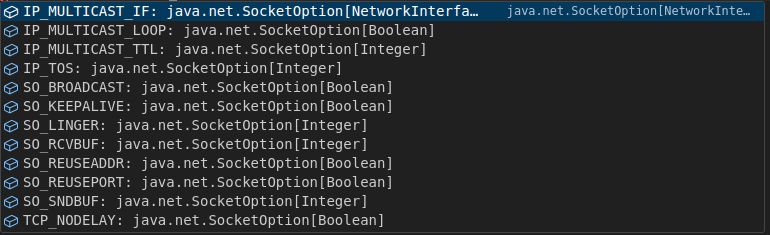
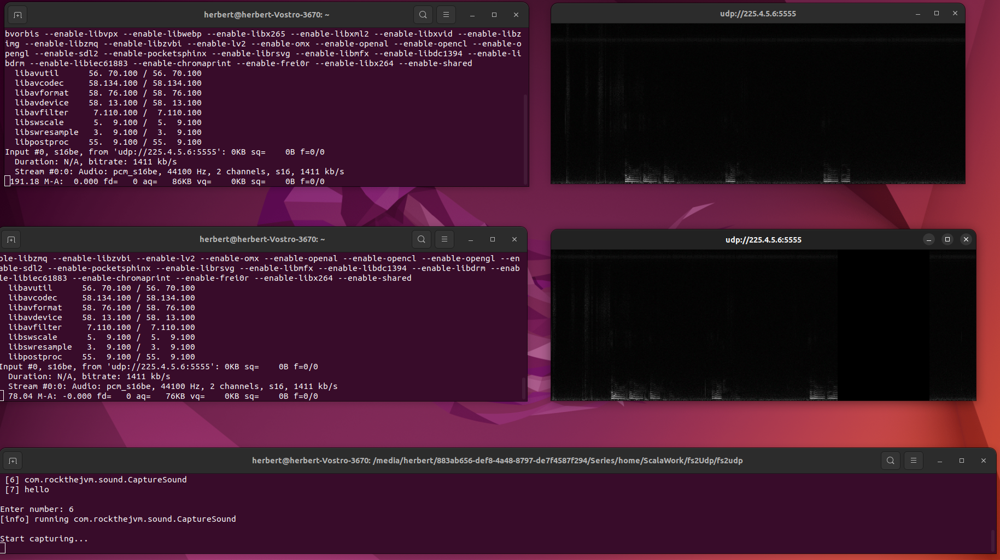

_by [Herbert Kateu](https://github.com/hkateu)_

## 1. Introduction
UDP stands for User Datagram Protocol, it's a transport layer communication protocol built on top of IP that is used to transmit data across a network. It works by bundling up data in a UDP packet, adding header information, and sending these packets to the target destination. 
The UDP header is fixed at 8 bytes and contains a source port, destination port, the checksum used to verify packet integrity by the receiving device, and the length of the packet which equates to the sum of the payload and header.

UDP has the following characteristics:
- Packet sizes are limited to what can be contained in a single IP packet which is at most 65,507 bytes.
- Packets may lost or arrive in a different order compared to how they were transmitted.
- It's a connectionless protocol since the sender simply sends data without waiting for an acknowledgment of receipt.

UDP is mainly used for time-sensitive communications where occasionally dropping packets is better than waiting, such applications include live video streaming and VoIP, online gaming, and live broadcast streams. 

In this article, we will first understand how to implement UDP with Java NIO and gradually transition to [Fs2's](https://blog.rockthejvm.com/fs2/) io library which provides binding for UDP networking. In the last section, we'll create a live audio streaming server with the knowledge we've gained.

## 2. Setting Up
Let's create a new Scala 3 project and add the following to your `build.sbt` file.

```scala
val scala3Version = "3.3.1"

lazy val root = project
  .in(file("."))
  .settings(
    name := "fs2udp",
    version := "0.1.0-SNAPSHOT",

    scalaVersion := scala3Version,

    libraryDependencies += "co.fs2" %% "fs2-core" % "3.9.2",
    libraryDependencies += "co.fs2" %% "fs2-io" % "3.9.2"
  )
```
To follow along, we'll need `fs2`'s core and io libraries, this installs [cats](https://rockthejvm.com/p/cats) and [cats-effect](https://rockthejvm.com/p/cats-effect) as dependencies in our project. 

We'll also need the [FFplay](https://ffmpeg.org/ffplay.html) library which is installed as part of [FFmpeg](https://ffmpeg.org/download.html). We can confirm it's installed by running `ffplay -version`. 

## 3. UDP with NIO
In this section, we'll learn how to create a UDP echo server and client using Java NIO and get an in-depth explanation of how this API works.
## 3.1 The UDP Server
To implement UDP in NIO we'll make use of the `DatagramChannel` class which supports concurrent reading and writing, however at most one thread may be reading and at most one thread may be writing at any given time. Create a `NioUdp.scala` file in the following path, `src/main/scala/com/rockthejvm/nioUdp/NioUdp.scala`, and add the following code:

```scala
package com.rockthejvm.nioUdp
import cats.effect.IOApp

object NioUdp extends IOApp {
  def server: Unit = {
      val port: Int = 5555
      val ip: String = "127.0.0.1"
  }
  def run(args: List[String]): IO[ExitCode] = ???
}
```
Here we define an IOApp with its run method, we also have our `server` function where we've defined the `port` number and `ip` address on which the server will be waiting for incoming connections. 

```scala
...
import scala.util.Try
import scala.util.Failure
import scala.util.Success
import java.nio.channels.DatagramChannel
import java.net.StandardProtocolFamily

object NioUdp extends IOApp {
  def server: Unit = {
    ...
    Try {
      val datagramChannel: DatagramChannel =
        DatagramChannel.open(StandardProtocolFamily.INET)
      if (datagramChannel.isOpen()) {
        println("[server] Udp server is successfully opened")
      } else {
          println("[server] The channel cannot be opened!")
        }
    } match {
      case Failure(ex) =>
        println(s"[client] ${ex.getMessage}")
      case Success(_) =>
        println("[client] Everything works fine")
    }
  }
  ...
}
```
We start by opening a Datagram channel using the `open()` method on `DatagramChanel` and passing it a `ProtocolFamily` parameter, here we use `StandardProtocolFamily.INET` meant for IPv4, the `StandardProtocolFamily` enum also provides two other options, `StandardProtocolFamily.INET6` for IPv6 and `StandardProtocolFamily.UNIX` for UNIX domain interprocess communication depending on your needs. 

We confirm if `datagramChannel` is indeed open by calling `datagramChannel.isOpen()` with the help of an if statement whose body will have a notification message printed if this is true or false. This implementation is wrapped in a `Try` which we pattern match to either print an error message in case of a `Failure` or a success message in case no errors occur.  

Let's build on our if statement:

```scala
...
import java.net.StandardSocketOptions
import java.net.InetSocketAddress

if (datagramChannel.isOpen()) {
  println("[server] Udp server is successfully opened")

  datagramChannel.setOption(StandardSocketOptions.SO_RCVBUF, 4 * 1024)
  datagramChannel.setOption(StandardSocketOptions.SO_SNDBUF, 4 * 1024)

  datagramChannel.bind(new InetSocketAddress(ip, port))
  println(
    "[server] Udp server is bound to:" + datagramChannel.getLocalAddress()
  )
} 
...
```
Here we define some socket options using the `setOption()` method which takes a `SocketOption` and it's associated value. 

The `StandardSocketOptions.SO_RCVBUF` and `StandardSocketOptions.SO_SNDBUF` are options for the datagram socket receive buffer and socket send buffer respectively which we set to 4 kilobytes each. 

The size could be increased for high-volume connections and in the case of the receive buffer, reduced to limit the possible backlog of incoming data. StandardSocketOptions provides multiple options for fine-grained control of a DatagramChannel:



We also make sure to bind our datagramChannel to a `SocketAddress` using the `bind()` method, this creates an association between the socket and the local address. In the code above we use `InetSocketAddress` which is a subclass of `SocketAddress`, and in the next line, print the address it's bound to. 

Let's see how we can send our data packets:

```scala
...
import java.nio.ByteBuffer
import java.net.SocketAddress

val content: ByteBuffer = ByteBuffer.allocate(65507)
if (datagramChannel.isOpen()) {
  ...
  while (true) {
    val clientAddress: SocketAddress = datagramChannel.receive(content)
    content.flip()
    println(
      s"[server] I've received ${content.limit()} bytes " +
        s"from ${clientAddress.toString()}! Sending them back ..."
    )
    datagramChannel.send(content, clientAddress)
    content.clear()
  }
} 
...
```
Here we showcase how the echo server works. The logic is defined within an infinite `while` loop where our datagram channel continuously listens for incoming Datagrams or packets from clients. 

We use the `datagramChannel.receive()` method to capture these packets, it takes a `ByteBuffer` as a parameter which we defined as `content`, this method transfers the incoming datagrams to the `ByteBuffer` like a write operation. This operation returns the `SocketAddress` of the client.

The `flip()` method on `content` makes the `ByteBuffer` ready for a new sequence of channel writes. We then print a message showing the bytes received and the client address, then we send `content` which now contains what was sent by the client back by calling `datagramChannel.send()`, this takes a `ByteBuffer` and `SocketAddress`. Finally, we call `clear()` on `content` to reuse the buffer.

Here's the full code:
```scala
package com.rockthejvm.nioUdp

import cats.effect.{IOApp, ExitCode, IO}
import scala.util.Try
import scala.util.Failure
import scala.util.Success
import java.nio.channels.DatagramChannel
import java.net.StandardProtocolFamily
import java.net.StandardSocketOptions
import java.net.InetSocketAddress
import java.nio.ByteBuffer
import java.net.SocketAddress

object NioUdp extends IOApp {
  def server: Unit = {
    val port: Int = 5555
    val ip: String = "127.0.0.1"
    val content: ByteBuffer = ByteBuffer.allocate(65507)

    Try {
      val datagramChannel: DatagramChannel =
        DatagramChannel.open(StandardProtocolFamily.INET)
      if (datagramChannel.isOpen()) {
        println("[server] Udp server is successfully opened")

        datagramChannel.setOption(StandardSocketOptions.SO_RCVBUF, 4 * 1024)
        datagramChannel.setOption(StandardSocketOptions.SO_SNDBUF, 4 * 1024)

        datagramChannel.bind(new InetSocketAddress(ip, port))
        println(
          "[server] Udp server is bound to:" + datagramChannel.getLocalAddress()
        )

        while (true) {
          val clientAddress: SocketAddress = datagramChannel.receive(content)
          content.flip()
          println(
            s"[server] I've received ${content.limit()} bytes " +
              s"from ${clientAddress.toString()}! Sending them back ..."
          )
          datagramChannel.send(content, clientAddress)
          content.clear()
        }
      } else {
        println("[server] The channel cannot be opened!")
      }
    } match {
      case Failure(ex) =>
        println(s"[server] ${ex.getMessage}")
      case Success(_) =>
        println("[server] Everything works fine")
    }
  }

    def run(args: List[String]): IO[ExitCode] = ???
}
```

## 3.2. The UDP Client
Creating a UDP client is very similar to creating a server, the only change is we'll be preparing the data to send to the server which we later decode and print once it's echoed back.
Here's how it's implemented:

```scala
import java.nio.charset.Charset
import java.nio.charset.CharsetDecoder

object NioUdp extends IOApp {
  ...
  def client = {
    val serverPort: Int = 5555
    val serverIp: String = "127.0.0.1"

    val charSet: Charset = Charset.defaultCharset()
    val decoder: CharsetDecoder = charSet.newDecoder()

    val echoText: ByteBuffer =
      ByteBuffer.wrap("[message] I was sent back from the server!".getBytes())
    val content: ByteBuffer = ByteBuffer.allocate(65507)

    Try {
      val datagramChannel = DatagramChannel.open(StandardProtocolFamily.INET)
      if (datagramChannel.isOpen()) {
        datagramChannel.setOption(StandardSocketOptions.SO_RCVBUF, 4 * 1024)
        datagramChannel.setOption(StandardSocketOptions.SO_SNDBUF, 4 * 1024)

        val sent = datagramChannel.send(
          echoText,
          new InetSocketAddress(serverIp, serverPort)
        )
        println(s"[client] I have successfully sent $sent bytes to the Echo Server!")

        datagramChannel.receive(content)

        content.flip()
        val charBuffer = decoder.decode(content)
        println(charBuffer.toString())
        content.clear()
        datagramChannel.close()
      } else {
        println("[client] The channel cannot be opened!")
      }
    } match {
      case Failure(ex) =>
        println(s"[client] ${ex.getMessage}")
      case Success(_) =>
        println("[client] Everything works fine")
    }
  }
  ...
}
```

Here we define a `Charset` by calling `Charset.defaultCharset()`, then create a decoder using the `newDecoder()` method on `CharSet` which will be used to decode the byte data sent by the server. We also define `echoText`, a `ByteBuffer` containing the text that we want to send, we use the `ByteBuffer.wrap()` method that wraps our message into the buffer. 

We also define a `DatagramChannel`, check if it's open then send `echoText` to the server using the `send()` method. When we receive the response from the server, it's written to `content` and decoded using the `decode()` method from the `CharsetDecoder` that we defined earlier. We then close the socket by calling `datagramChannel.close()` since we are done sending messages.


Lastly let's define our run method and then test the application:

```scala
import cats.syntax.parallel.*
import scala.concurrent.duration.*

object NioUdp extends IOApp {
  ...
  def run(args: List[String]): IO[ExitCode] =
    (IO(server), IO.sleep(500.millis).flatMap(_ => IO(client)))
      .parMapN((s, c) => ())
      .as(ExitCode.Success)
}
```
Here we wrap both functions in `IO` and then run them concurrently using the `parMapN()` from `cats`, however, we delay the execution of the `client` by 500 milliseconds to give the `server` time to start. These are the results after running the application

```bash
[server] Udp server is successfully opened
[server] Udp server is bound to:/127.0.0.1:5555
[client] I have successfully sent 42 bytes to the Echo Server!
[server] I've received 42 bytes from /127.0.0.1:49841! Sending them back ...
[message] I was sent back from the server!
[client] Everything works fine
```
Looking at the output everything works, notice that we didn't bind an address and port number to the `client`, this was done automatically by NIO, if we run this program again, a different address will be assigned.

## 3.3 A Connected Client
NIO provides an alternative client implementation where the client first connects to the server before sending and receiving packets, there are some minor changes compared to the previous section, here's the code:

```scala
  def connectedClient = {
    val serverPort: Int = 5555
    val serverIp: String = "127.0.0.1"

    val charSet: Charset = Charset.defaultCharset()
    val decoder: CharsetDecoder = charSet.newDecoder()

    val echoText: ByteBuffer =
      ByteBuffer.wrap("[message] I was sent back from the server!".getBytes())
    val content: ByteBuffer = ByteBuffer.allocate(65507)

    Try {
      val datagramChannel = DatagramChannel.open(StandardProtocolFamily.INET)
      if (datagramChannel.isOpen()) {
        datagramChannel.setOption(StandardSocketOptions.SO_RCVBUF, 4 * 1024)
        datagramChannel.setOption(StandardSocketOptions.SO_SNDBUF, 4 * 1024)
        
        datagramChannel.connect(new InetSocketAddress(serverIp, serverPort))
      
        if(datagramChannel.isConnected()){
          val sent = datagramChannel.write(echoText)
          println(
            s"[client] I have successfully sent $sent bytes to the Echo Server!"
          )

          datagramChannel.read(content)

          content.flip()
          val charBuffer = decoder.decode(content)
          println(charBuffer.toString())
          content.clear()
          datagramChannel.close()
        }
      } else {
        println("[client] The channel cannot be opened!")
      }
    } match {
      case Failure(ex) =>
        println(s"[client] ${ex.getMessage}")
      case Success(_) =>
        println("[client] Everything works fine")
    }
  }
```
After the `datagramChannel` is open, we connect to the server by calling `datagramChannel.connect()` and passing it an `InetSocketAddress`, this is the main difference. We also check if the connection is established by calling `datagramChannel.isConnected()`, then implement our code.

Another change is the use `datagramChannel.write` and `datagramChannel.read` to send and receive our messages. In addition, we no longer need to pass the `InetSocketAddress` to the `write()` since the datagram channel is already connected to the server address and knows where the data will be sent.

Why use this method? Once `datagramChannel.connect()` is called, the `read()` and `write()` methods will only send and receive datagram packets from the address it's connected to. Note that UDP is a connectionless protocol and the `connect()` method doesn't mean an actual connection is established.

Lastly, we can either call `datagramChannel.disconnect()` or `datagramChanel.close()` once we are done using the channel. Calling `datagramChannel.disconnect()` on a closed channel or one that's not connected has no effect. If we call our `run` method with `connectedClient`, the results should be the same.

Let's recap on how we implemented UDP:
- Defined the port and address values.
- Opened a DatagramChannel and set the ProtocolFamily value.
- Set some Socket options.
- Bind the socket to an address in case of a server.
- Then sent and received the data.
- Lastly, close the socket in case of a client.

Can we do the same with a higher-level API like Fs2?

## 4. UDP with Fs2
Fs2 supports UDP through the `fs2.io.net package`, this provides abstractions on top of NIO but provides the resource safety guarantees known in fs2 streams.

## 4.1 The UDP Server
Create `Fs2Udp.scala` in the following path, `src/main/scala/com/rockthejvm/fs2Udp/Fs2Udp.scala` and add the following code:

```scala
package com.rockthejvm.fs2Udp

import cats.effect.{IOApp, ExitCode, IO}
import fs2.Stream
import fs2.io.net.Network
import com.comcast.ip4s.*

object Fs2Udp extends IOApp {
  def server =
    Stream
      .resource(
        Network[IO].openDatagramSocket(
          address = Some(ip"127.0.0.1"),
          port = Some(port"5555"),
        )
      )

  def run(args: List[String]): IO[ExitCode] = ???
}
```
Just like Java NIO, we start by opening a `DatagramChannel`, or in this case a `DatagramSocket` using the `Network[IO].openDatagramSocket()` method and passing it `address` and `port` values. 

The `com.comcast.ip4s` library provides us with convenient string interpolation methods for constructing these values. Wrapping this method in `Stream.resource()` gives us a `Stream[IO, DatagramSocket[IO]]`. 


Let's set the socket options, and `ProtocolFamily` :

```scala
...
import fs2.io.net.SocketOption
import java.net.StandardSocketOptions
import java.net.StandardProtocolFamily

object Fs2Udp extends IOApp {
  def server =
    Stream
      .resource(
        Network[IO].openDatagramSocket(
          address = Some(ip"127.0.0.1"),
          port = Some(port"5555"),
          options = List(
            SocketOption(StandardSocketOptions.SO_RCVBUF, 1024 * 4),
            SocketOption(StandardSocketOptions.SO_SNDBUF, 1024 * 4)
          ),
          protocolFamily = Some(StandardProtocolFamily.INET)
        )
      )

    def run(args: List[String]): IO[ExitCode] = ???
}
```
To define socket options, the `openDatagramSocket()` method allows for an options parameter that takes a `List[DatagramSocketOption]`, if we dig into this type definition, we'll find that `DatagramSocketOption` is an alias for the `SocketOption` [trait](https://blog.rockthejvm.com/scala-3-traits/) from `fs2.io.net`:

```scala
package object net {
...
  type DatagramSocketOption = SocketOption
  val DatagramSocketOption = SocketOption
}
```
The `SocketOption` companion object has an apply method that takes a `StandardSocketOptions` option as a key with its corresponding value, the same as Java NIO. We also define the protocol family using `StandardProtocolFamily.INET` for IPv4. 

It's also fine to provide only the port value to `openDatagramSocket()`:

```scala
object Fs2Udp extends IOApp {
  def server =
    Stream
      .resource(
        Network[IO].openDatagramSocket(
          port = Some(port"5555")
        )
      )
  ...
}
```
This still works since `127.0.0.1` also known as Localhost is the address IP address of the local computer, and allows the machine to connect and communicate with itself, it's set by default. The protocol family and `StandardSocketOptions`, `SO_RCVBUF`, and `SO_SNDBUF` also have default values depending on your system.

```scala
def server =
  Stream
    .resource(
      Network[IO].openDatagramSocket(
        ...
      )
    )
    .evalTap(socket =>
      IO.println("[server] Udp server is successfully opened") *>
        socket.localAddress.flatMap { address =>
          IO.println(s"[server] Udp server is bound to: ${address.toString}")
        }
    )
```
Here we use the `evalTap()` function on `fs2.Stream[IO, DatagramSocket[IO]]` to print out some observations, this gives us access to the `DatagramSocket[IO]` but still keeps it available for the next operation. 

If the `openDatagramSocket()` method succeeds, we print a successfully opened message as well as the address that the server is bound to by flat mapping on `socket.localAddress` and printing the `address` of type `SocketAddress[IpAddress]` as a string.

The next step is to read incoming datagrams:

```scala
def server =
  Stream
    .resource(
      ...
    )
    .evalTap(socket =>
      ...
    )
    .flatMap { socket =>
      socket.reads
        .evalTap { datagram =>
          IO.println(
            s"[server] I've received ${datagram.bytes.size} bytes " +
              s"from ${datagram.remote.toString}! Sending them back ..."
          )
        }
        .through(socket.writes)
    }
```
The `reads()` method on `DatagramSocket[IO]` returns a `Stream[IO, Datagram]`, we `evalTap` on this to print out the bytes size of the incoming datagram and the address of the client by calling `datagram.bytes.size` and `datagram.remote.toString` respectively. 

Lastly, calling `through(socket.writes)` takes the `Stream` of incoming `Datagram`'s and writes it back to the address where they originated:

The final step is to handle any errors that may occur using `handleErrorWith`:

```scala
def server =
  Stream
    .resource(
      ...
    )
    .evalTap(socket =>
      ...
    )
    .flatMap { socket =>
      ...
    }
    .handleErrorWith { error =>
        Stream.eval(
          IO.println(s"[server] ${error.getMessage}")
        )
      }
```
Here we print the error message as a string by calling `error.getMessage`.

This is the full code:
```scala
package com.rockthejvm.fs2Udp

import cats.effect.{IOApp, ExitCode, IO}
import fs2.Stream
import fs2.io.net.Network
import com.comcast.ip4s.*
import fs2.io.net.SocketOption
import java.net.StandardSocketOptions
import java.net.StandardProtocolFamily
import fs2.io.net.DatagramSocket

object Fs2Udp extends IOApp {
  def server =
    Stream
      .resource(
        Network[IO].openDatagramSocket(
          address = Some(ip"127.0.0.1"),
          port = Some(port"5555"),
          options = List(
            SocketOption(StandardSocketOptions.SO_RCVBUF, 1024 * 4),
            SocketOption(StandardSocketOptions.SO_SNDBUF, 1024 * 4)
          ),
          protocolFamily = Some(StandardProtocolFamily.INET)
        )
      )
      .evalTap(socket =>
        IO.println("[server] Udp server is successfully opened") *>
          socket.localAddress.flatMap { address =>
            IO.println(s"[server] Udp server is bound to: ${address.toString}")
          }
      )
      .flatMap { socket =>
        socket.reads
          .evalTap { datagram =>
            IO.println(
              s"[server] I've received ${datagram.bytes.size} bytes " +
                s"from ${datagram.remote.toString}! Sending them back ..."
            )
          }
          .through(socket.writes)
      }
      .handleErrorWith { error =>
        Stream.eval(
          IO.println(s"[server] ${error.getMessage}")
        )
      }
  def run(args: List[String]): IO[ExitCode] = ???
}
```

## 4.2 The UDP Client
The UDP client will look very similar to our server with a few minor changes. Let's define the client function:

```scala
object Fs2Udp extends IOApp {
  ...
  def client = {
    val serverAddress: SocketAddress[IpAddress] =
      SocketAddress(ip"127.0.0.1", port"5555")
    Stream
      .resource(Network[IO].openDatagramSocket())
  }
  ...
}
```
We start by defining the socket address of the server as a `SocketAddress[IpAddress]`, this is a case class that comes from `com.comcast.ip4s` and should not be confused with `SocketAddress` from `java.net`. 

Next, we open the datagram socket but don't supply any arguments since we'll be assigned by the system, server ports need to be known beforehand, however, client ports can be ephemeral meaning they are discarded after use. 

Our server will get the client address from the datagram header and use that to echo back. 

```scala
import fs2.text

def client = {
    ...
    Stream
      .resource(...)
      .flatMap { socket =>
        Stream("[message] I was sent back from the server!")
          .through(text.utf8.encode)
          .chunks
          .flatMap { data =>
            Stream(Datagram(serverAddress, data))
              .evalTap { datagram =>
                IO.println(
                  s"[client] Sending ${datagram.bytes.size} bytes to the Echo Server!"
                )
              }
          }.through(socket.writes)
          .drain
      }
}
```
In this section we prepare our message as an `fs2.Stream`, encode it into a stream of bytes by calling `through(text.utf8.encode)` and outputting `chunks` from the resulting stream.

We then `flatMap` and pass data of type `Chunk[Byte]` to a `Datagram` stream along with `serverAddress` and print out the size of the data being sent. Lastly, we write this data the server and drain the stream.

```scala
...
.through(socket.writes)
.drain ++
socket.reads
  .flatMap(datagram => Stream.chunk(datagram.bytes))
  .through(text.utf8.decode)
  .foreach { response =>
    IO.println(response)
  }
```
Here we use the `++` operator to concatenate another stream that reads datagrams from the same `socket` resulting in a `Stream[IO, Datagram]` whose bytes we then `chunk`, `decode`, and `print` to the console. Notice that the process here is the reverse of the previous paragraph. 

Because of the `++` operator, `socket.reads` is only starts after the previous stream has completed.

Here's the full code:

```scala
import fs2.text

def client = {
    val serverAddress: SocketAddress[IpAddress] =
      SocketAddress(ip"127.0.0.1", port"5555")
    Stream
      .resource(Network[IO].openDatagramSocket())
      .flatMap { socket =>
        Stream("[message] I was sent back from the server!")
          .through(text.utf8.encode)
          .chunks
          .flatMap { data =>
            Stream(Datagram(serverAddress, data))
              .evalTap { datagram =>
                IO.println(
                  s"[client] Sending ${datagram.bytes.size} bytes to the Echo Server!"
                )
              }
          }
          .through(socket.writes)
          .drain ++
          socket.reads
            .flatMap(datagram => Stream.chunk(datagram.bytes))
            .through(text.utf8.decode)
            .foreach { response =>
              IO.println(response)
            }
      }      
      .handleErrorWith { error =>
        Stream.eval(
          IO.println(s"[client] ${error.getMessage}")
        )
      }
  }
```
We also make sure to handle any errors that may occur by calling `handleErrorWith`.

Let's define the run method and test our application:

```scala
...
import scala.concurrent.duration.*

object Fs2Udp extends IOApp {
  ...
  def run(args: List[String]): IO[ExitCode] =
    server
      .concurrently(Stream.sleep[IO](500.millis) ++ client)
      .compile
      .drain
      .as(ExitCode.Success)
}
```

Just like before we run both `server` and `client` concurrently but give the server 500 milliseconds to first start up. Here are the results:

```bash
[server] Udp server is successfully opened
[server] Udp server is bound to: 127.0.0.1:5555
[client] Sending 42 bytes to the Echo Server!
[server] I've received 42 bytes from 127.0.0.1:49763! Sending them back ...
[message] I was sent back from the server!
```
The `fs2.io.net` NIO abstractions use the `DatagramChannel`'s `send()` and `receive()` methods under the hood since it's possible to send and receive datagrams to and from different addresses.

## 5. Multicasting
Multicasting is a group communication protocol where a sender can send data to multiple receivers simultaneously. Here's how it works:
1. A multicast group is created with a multicast IP address which should be between 224.0.0.1 and 239.255.255.255.
2. A server streams to a multicast socket address while a client should connect to the associated multicast group to start listening for incoming datagrams.
3. The client also has the option to leave the multicast group if there's a need to do so.

For Multicasting to work, we need to have a network interface capable of multicasting available. A network interface is the point of interconnection between a computer and a private or public network. 

We can use the `ip link` command in the terminal to check if any is present. Here's the output from my computer:

```bash
1: lo: <LOOPBACK,UP,LOWER_UP> mtu 65536 qdisc noqueue state UNKNOWN mode DEFAULT group default qlen 1000
    link/loopback 00:00:00:00:00:00 brd 00:00:00:00:00:00
2: enp1s0: <NO-CARRIER,BROADCAST,MULTICAST,UP> mtu 1500 qdisc fq_codel state DOWN mode DEFAULT group default qlen 1000
    link/ether 8c:ec:4b:ad:75:12 brd ff:ff:ff:ff:ff:ff
3: wlxb4b024bc35a7: <BROADCAST,MULTICAST> mtu 1500 qdisc noop state DOWN mode DEFAULT group default qlen 1000
    link/ether b4:b0:24:bc:35:a7 brd ff:ff:ff:ff:ff:ff
```
This shows I have two interfaces that I could use for multicasting, enp1s0 is the in-built Network Interface Card that came with the computer while wlxb4b024bc35a7 is the USB wireless adapter that I normally use. 

At the moment they are both in a `DOWN` state because none are connected to a network. To change this state we could connect your interface to a wifi network or securely connect your ethernet cable to an existing network.

```bash
3: wlxb4b024bc35a7: <BROADCAST,MULTICAST,UP,LOWER_UP> mtu 1500 qdisc noqueue state UP mode DORMANT group default qlen 1000
    link/ether b4:b0:24:bc:35:a7 brd ff:ff:ff:ff:ff:ff
```
The state state changed after I connected to my phone's wifi network.

Lets see how we can search for network interfaces in scala:

```scala
import cats.effect.{IOApp, ExitCode, IO}
import java.net.NetworkInterface
import java.util.Enumeration
import java.net.InetAddress

object GetInterfaces extends IOApp {
  def getInterfaces = {
    val enumInterfaces: Enumeration[NetworkInterface] =
      NetworkInterface.getNetworkInterfaces()
    while (enumInterfaces.hasMoreElements()) {
      val ni: NetworkInterface = enumInterfaces.nextElement()
      val enumIP: Enumeration[InetAddress] = ni.getInetAddresses()
      println(s"""
          Network Interface: ${ni.getDisplayName()}
          - Up and running: ${ni.isUp()}
          - Supports Multicasting: ${ni.supportsMulticast()}
          - Name: ${ni.getName()}
          - Is virtual: ${ni.isVirtual()}
          - Ip Addresses:
        """)
      while (enumIP.hasMoreElements()) {
        val ip: InetAddress = enumIP.nextElement()
        println(s"""
               -$ip 
          """)
      }
    }
  }
  def run(args: List[String]): IO[ExitCode] =
    IO(getInterfaces).as(ExitCode.Success)
}
```

Here we call `NetworkInterface.getNetworkInterfaces()` to get `Enumeration[NetworkInterface]`, an Enumeration only traverses the collection but doesn`t allow for modifications. We traverse this using a while loop and printing out details of the `NetworkInterface` and its associated IP addresses.
Here are my results:

```bash
          Network Interface: wlxb4b024bc35a7
          - Up and running: true
          - Supports Multicasting: true
          - Name: wlxb4b024bc35a7
          - Is virtual: false
          - Ip Addresses:
        

               -/fe80:0:0:0:46de:2f6:e418:3479%wlxb4b024bc35a7 
          

               -/192.168.122.32 
          

          Network Interface: lo
          - Up and running: true
          - Supports Multicasting: false
          - Name: lo
          - Is virtual: false
          - Ip Addresses:
        

               -/0:0:0:0:0:0:0:1%lo 
          

               -/127.0.0.1 
```
Notice `enp1s0` didn't appear since its state is `DOWN`.

## 5.1. Multicast Server in NIO
For this example, we'll create a server that sends the current date and time as an endless stream to any client that connects to the multicast group. Create a file called `NioUdpMulticast.scala` in the following path, `src/main/scala/com/rockthejvm/nioUdp/NioUdpMulticast.scala` and add the following code:

```scala
package com.rockthejvm.nioUdp 

import cats.effect.{IOApp, ExitCode, IO}
import java.nio.ByteBuffer
import scala.util.{Try, Failure, Success}
import java.nio.channels.DatagramChannel
import java.net.{
  StandardProtocolFamily,
  StandardSocketOptions,
  InetSocketAddress,
  NetworkInterface,
  InetAddress
}
import java.util.Date

object NioUdpMulticast extends IOApp {
  def server: Unit = {
    val port: Int = 5555
    val groupIp: String = "225.4.5.6"
    val content: ByteBuffer = ByteBuffer.allocate(65507)

    Try {
      val datagramChannel: DatagramChannel =
        DatagramChannel.open(StandardProtocolFamily.INET)

      if (datagramChannel.isOpen()) {
        println("[multicast server] Udp server is successfully opened")

        val networkInterface: NetworkInterface =
          NetworkInterface.getByName(
            "wlxb4b024bc35a7"
          ) // Pass the interface name that matches what you have.

        datagramChannel.setOption(
          StandardSocketOptions.IP_MULTICAST_IF,
          networkInterface
        )
        datagramChannel.setOption(StandardSocketOptions.SO_REUSEADDR, true)

        datagramChannel.bind(new InetSocketAddress(port))
        println(
          s"[multicast server] Udp server is bound to: ${datagramChannel.getLocalAddress()}"
        )

        println(
          "[multicast server] Udp server will start sending date time info shortly..."
        )

        while (true) {
          try {
            Thread.sleep(10000)
          } catch {
            case e => println(e.getMessage)
          }

          println("Sending data ...")
          val datetime = ByteBuffer.wrap(new Date().toString().getBytes())
          datagramChannel.send(
            datetime,
            new InetSocketAddress(InetAddress.getByName(groupIp), port)
          )
          datetime.flip()
        }
      } else {
        println("[multicast server] The channel cannot be opened!")
      }
    } match {
      case Failure(ex) =>
        println(s"[multicast server] ${ex.getMessage}")
      case Success(_) =>
        println("[multicast server] Everything works fine")
    }
  }

  def run(args: List[String]): IO[ExitCode] = ???
}
```
Let's go through and compare the changes to the previous NIO server implementation:

First, we changed the IP address from localhost to a Multicast address, `225.4.5.6`. This address will form the multicast group and is where the datagrams will be sent.

We also added two new socketOptions, `StandardSocketOptions.IP_MULTICAST_IF` and `StandardSocketOptions.SO_REUSEADDR`. 

The `IP_MULTICAST_IF` option is used to set the network interface that will be used for sending multicast datagrams, here I'll be using my wifi network adapter by calling `NetworkInterface.getByName("wlxb4b024bc35a7")` and passing the interface display name. Make sure you use the name of the multicast interface that you have on your computer or laptop.

The `SO_REUSEADDR` option is used to tell the system if the address can be reused, this enables multiple programs to bind to the same address and is essential for multicasting.

When calling the bind method, we only provide the `port` number, the `InetSocketAddress` has a constructor that allows for this, meaning that it provides a wildcard or placeholder address, typically `0.0.0.0`.

Lastly, we have an infinite while loop that sends a date string every 10,000 milliseconds to all members of the multicast group by calling `datagramChannel.send()` and passing it the date, and the multicast socket address got by calling `new InetSocketAddress(InetAddress.getByName(groupIp), port)`.

## 5.2. Multicast Client in NIO
Let's start by creating our client function and add the following code:

```scala
...
import java.nio.charset.Charset
import java.nio.charset.CharsetDecoder
import java.nio.channels.MembershipKey

object NioUdpMulticast extends IOApp {
  ...
  def client = {
    val port: Int = 5555
    val groupIp: String = "225.4.5.6"

    val charSet: Charset = Charset.defaultCharset()
    val decoder: CharsetDecoder = charSet.newDecoder()
    val content: ByteBuffer = ByteBuffer.allocate(65507)

    Try {
      val datagramChannel = DatagramChannel.open(StandardProtocolFamily.INET)

      val group: InetAddress = InetAddress.getByName(groupIp)
      if (group.isMulticastAddress()) {
        if (datagramChannel.isOpen()) {
          val networkInterface = NetworkInterface.getByName("wlxb4b024bc35a7")
          datagramChannel.setOption(
            StandardSocketOptions.SO_REUSEADDR,
            true
          )

          datagramChannel.bind(new InetSocketAddress(port))
          println(
            s"[multicast client] client is bound to: ${datagramChannel.getLocalAddress()}"
          )

          val key: MembershipKey = datagramChannel.join(group, networkInterface)
          while (true) {
            if (key.isValid()) {
              datagramChannel.receive(content)
              content.flip()
              val charBuffer = decoder.decode(content)
              println(charBuffer.toString())
              content.clear()
            } else {
              println("[multicast client] Invalid join key")
            }
          }
        } else {
          println("[multicast client] The channel cannot be opened!")
        }
      } else {
        println("[multicast client] This is not multicast address")
      }
    } match {
      case Failure(ex) =>
        println(s"[multicast client] ${ex.getMessage}")
      case Success(_) =>
        println("[multicast client] Everything works fine")
    }
  }
  ...
}
```
Again, the multicast client looks similar to the previous NIO client with a few changes:

Similar to the multicast server, we start by defining the port number and multicast group IP address, `groupIp`.

Within our `Try` we first define `group` as an `InetAddress` by calling `InetAddress.getByName(groupIp)`, this gives us access to some extra methods on `group`, one of which is `group.isMulticastAddress()` that checks if the address provided is an IP multicast address. Once this is confirmed, within an if statement we proceed to open the `datagramChannel` and set the `SO_REUSEADDR` socket option to true.

Unlike the previous NIO client implementations, for multicast we bind the `datagramChannel` to a `SocketAddress`, here we use a placeholder address and port 5555 similar to our server. 

The next step is to join a multicast group, we do this by calling `datagramChannel.join(group, networkInterface)` where the `join()` method takes our multicast address and a network interface. This returns a `MembershipKey` which is a token representing the membership of the IP multicast group.

Within the while loop, we first check if the `MembershipKey` is valid then start receiving datagrams. `MembershipKey` also has a `drop()` method which can be called if we want to opt out of the multicast group.

Lastly, let's define our run method and test our application:

```scala
import cats.syntax.parallel.*

object NioUdpMulticast extends IOApp {
  ...
  def run(args: List[String]): IO[ExitCode] =
    (IO(server), IO(client)).parMapN((s, c) => ()).as(ExitCode.Success)
}
```
Here are the results:

```bash
[multicast server] Udp server is successfully opened
[multicast server] Udp server is bound to: /0.0.0.0:5555
[multicast server] Udp server will start sending date time info shortly...
[multicast client] client is bound to: /0.0.0.0:5555
Sending data ...
Tue Oct 24 13:48:19 EAT 2023
Sending data ...
Tue Oct 24 13:48:29 EAT 2023
Sending data ...
Tue Oct 24 13:48:39 EAT 2023
Sending data ...
Tue Oct 24 13:48:49 EAT 2023

```
When we analyse the output we can see that both the multicast server and client are bound to the same port, this is possible because we set the `SO_REUSEADDR` to true in both functions.

Here's a recap of how UDP multicasting works:
- Defined the port and multicast group address values.
- Check if the address is indeed multicast.
- Open a `DatagramChannel` and set the `ProtocolFamily` value.
- Set the following Socket options, `IP_MULTICAST_IF` for the multicast server and `SO_REUSEADDR` for both the multicast server and client.
- Bind the socket to an address.
- Join a multicast group in case of a client.
- Start receiving data sent by the multicast server
- Opt out of membership if needed.

Let's see if we can translate this to Fs2.

## 5.3. Multicast Server in Fs2
Let's create a new file, `Fs2UdpMulticast.scala` in the following path, `src/main/scala/com/rockthejvm/fs2Udp/Fs2UdpMulticast.scala` and add the following server code:

```scala
package com.rockthejvm.fs2Udp

import cats.effect.{IOApp, ExitCode, IO}
import com.comcast.ip4s.*
import fs2.{Stream, text}
import fs2.io.net.Network
import fs2.io.net.SocketOption
import java.net.StandardSocketOptions
import java.net.StandardProtocolFamily
import java.net.NetworkInterface
import java.util.Date
import fs2.io.net.Datagram
import scala.concurrent.duration.*

object Fs2UdpMulticasting extends IOApp {
  def server = {
    val multicastAddress = SocketAddress(ip"225.4.5.6", port"5555")
    Stream
      .resource(
        Network[IO].openDatagramSocket(
          port = Some(port"5555"),
          options = List(
            SocketOption(
              StandardSocketOptions.IP_MULTICAST_IF,
              NetworkInterface.getByName("wlxb4b024bc35a7")
            ),
            SocketOption(
              StandardSocketOptions.SO_REUSEADDR,
              true
            )
          ),
          protocolFamily = Some(StandardProtocolFamily.INET)
        )
      )
      .evalTap{socket =>
        IO.println("[multicast server] Udp server is successfully opened") *>
          socket.localAddress.flatMap(addr =>
            IO.println(
              s"[multicast server] Udp server is bound to: ${addr.toString}"
            )
          ) *>
          IO.println(
            "[multicast server] Udp server will start sending date time info shortly..."
          )
      }
      .flatMap { socket =>
        Stream
          .repeatEval(IO(new Date().toString()))
          .through(text.utf8.encode)
          .chunks
          .map(data => Datagram(multicastAddress, data))
          .metered(10000.millis)
          .evalTap(_ => IO.println("Sending data ..."))
          .through(socket.writes)
          .drain
      }
      .handleErrorWith { error =>
        Stream.eval(
          IO.println(s"[multicast server]: ${error.getMessage}")
        )
      }
  }

  def run(args: List[String]): IO[ExitCode] = ???
}
```
Most of this should look familiar by now, we start by opening the UDP socket by calling `Network[IO].openDatagramSocket()`, we pass it the `port` value but leave the server address value to default to a placeholder address. 

We then add `IP_MULTICAST_IF` and `SO_REUSEADDR` socket options, and pass `StandardProtocolFamily.INET` as the `protocolFamily` value. 

Next, we call `evalTap()` on our resource to give us access to the `socket`, then use this to print the address that the server is bound to by flat mapping on `socket.localAddress` along with other relevant messages.

In the following section, we call `flatMap` and then create an infinite stream of date values by calling `Stream.repeatEval(IO(new Date().toString()))`, these values then are encoded, chunked, and mapped to a `Datagram` along with the `multicastAddress`. 

Before we write our values, the stream is `metered` so that any client that joins this multicast group will receive a date value every 10,000 milliseconds.

We end by handling any errors with `handleErrorWith()`.

## 5.4. Multicast Client in Fs2

Append the following client code still within the `Fs2UdpMulticasting` object:

```scala
object Fs2UdpMulticasting extends IOApp {
  ...
  def client = {
    Stream
      .resource(
        Network[IO].openDatagramSocket(
          port = Some(port"5555"),
          options = List(
            SocketOption(
              StandardSocketOptions.SO_REUSEADDR,
              true
            )
          ),
          protocolFamily = Some(StandardProtocolFamily.INET)
        )
      )
      .evalTap { socket =>
        socket.localAddress.flatMap(addr =>
          IO.println(
            s"[multicast server] client is bound to: ${addr.toString}"
          )
        )
      }
      .flatMap { socket =>
        val groupMembership: IO[socket.GroupMembership] = socket.join(
          MulticastJoin.fromString("225.4.5.6").get,
          NetworkInterface.getByName("wlxb4b024bc35a7")
        )

        Stream.eval(groupMembership) ++
          socket.reads
            .flatMap(datagram => Stream.chunk(datagram.bytes))
            .through(text.utf8.decode)
            .foreach { response =>
              IO.println(response)
            }
      }
      .handleErrorWith { error =>
        Stream.eval(
          IO.println(s"[multicast client] Error: ${error.getMessage}")
        )
      }
  }
  ...
}
```
Similar to our server, we open the datagram, set the `port` value, set `SO_REUSEADDR` as a socket option, add a `protocolFamily` and `evalTap` to print the socket address. 

Next we `flatMap`, and call the `join()` method on `socket` to join a multicast group. `join()` takes a `MulticastJoin[IpAddress]` from `com.comcast.ip4s` and a `NetworkInterface` to return an `IO[socket.GroupMembership]` that we assigned to `groupMembership`.

We then call `Stream.eval(groupMembership)` and join this `Stream` to `socket.reads` using `++`, lastly we use the `handleErrorWith()` to print out any error that may occur.

The `GroupMembership` trait has a `drop()` method we can call in case we need to leave the multicast group.

Let's create our `run()` method and test the application:

```scala
object Fs2UdpMulticasting extends IOApp {
  ...
  def run(args: List[String]): IO[ExitCode] =
    server.concurrently(client).compile.drain.as(ExitCode.Success)
}
```
Here are the results:
```bash
[multicast server] Udp server is successfully opened
[multicast server] Udp server is bound to: 0.0.0.0:5555
[multicast server] Udp server will start sending date time info shortly...
[multicast server] client is bound to: 0.0.0.0:5555
Sending data ...
Tue Oct 24 15:21:50 EAT 2023
Sending data ...
Tue Oct 24 15:22:00 EAT 2023
Sending data ...
Tue Oct 24 15:22:10 EAT 2023
Sending data ...
Tue Oct 24 15:22:20 EAT 2023
```
The output is similar to our NIO example.

## 6. A Practical Example
In this section, we'll cover a common use case, streaming live audio, for this build we'll be streaming audio from an online radio station and interested listeners will be able to listen through FFplay.

Let's create a new file, `RadioServer.scala` in the following path, `src/main/scala/com/rockthejvm/radio/RadioServer.scala`, and add the following code.

```scala
package com.rockthejvm.radio

import cats.effect.{IOApp, ExitCode, IO}
import com.comcast.ip4s.*
import fs2.io
import java.net.URL
import fs2.Stream
import fs2.io.net.{Network, SocketOption, Datagram}
import java.net.{
  StandardSocketOptions,
  StandardProtocolFamily,
  NetworkInterface
}

object RadioServer extends IOApp {
  def radioServer(link: String) = {
    val multicastAddress: SocketAddress[IpAddress] =
      SocketAddress(ip"225.4.5.6", port"5555")
    val url: Stream[IO, Byte] = io.readInputStream[IO](
      IO(
        new URL(
          link
        ).openConnection.getInputStream
      ),
      1024
    )
    Stream
      .resource(
        Network[IO].openDatagramSocket(
          port = Some(port"5555"),
          options = List(
            SocketOption(
              StandardSocketOptions.IP_MULTICAST_IF,
              NetworkInterface.getByName("wlxb4b024bc35a7")
            ),
            SocketOption(
              StandardSocketOptions.SO_REUSEADDR,
              true
            )
          ),
          protocolFamily = Some(StandardProtocolFamily.INET)
        )
      )
      .evalTap { socket =>
        IO.println("[multicast server] Udp server is successfully opened") *>
          socket.localAddress.flatMap(addr =>
            IO.println(
              s"[multicast server] Udp server is bound to: ${addr.toString}"
            )
          ) *>
          IO.println(
            "[multicast server] The Radio stream is starting..."
          )
      }
      .flatMap { socket =>
        url.chunks
          .map(data => Datagram(multicastAddress, data))
          .through(socket.writes)
          .drain
      }
      .handleErrorWith { error =>
        Stream.eval(
          IO.println(s"[multicast server] Error: ${error.getMessage}")
        )
      }
  }

  override def run(args: List[String]): IO[ExitCode] =
    radioServer(
      "http://media-ice.musicradio.com:80/ClassicFM-M-Movies"
    ).compile.drain
      .as(ExitCode.Success)
}
```
This code should be familiar now, here we create a `radioServer()` function that sends audio to a multicast address which is on port `5555` and IP address `225.4.5.6`. It takes a link to the online radio stream as an argument.

To create our byte stream, `url`, we use the `io.readInputStream[IO]()` function that reads bytes from a specified `InputStream` to a buffer with a specified `chunkSize`. Here's the function signature.

```scala
def readInputStream[F[_$1]](
  fis: F[InputStream], 
  chunkSize: Int, 
  closeAfterUse: Boolean = true)
  (implicit F: Sync[F]): fs2.Stream[F, Byte]
```
To create this stream we create a Java `URL` class, pass it the `link` to our online radio station, then call `.openConnection.getInputStream` on the result to return an `InputStream` that reads from this open connection.

We set `F[_]` to `IO` on `io.readInputStream[IO]()` and also wrap our `InputStream` in `IO` as required by the function. `chunkSize` is set `1024` and `closeAfterUse` is left as the default.

To create our datagrams we use the `url.chunks` method and pass the data chunk to the `Datagram()` case class then pipe these to `socket.writes`.

Before we run our server, we should make sure our multicast interface is connected, if everything runs correctly, we should get the following output:

```bash
[info] running com.rockthejvm.radio.RadioServer 
[multicast server] Udp server is successfully opened
[multicast server] Udp server is bound to: 0.0.0.0:5555
[multicast server] The Radio stream is starting...
```
We can now connect to our stream using `FFplay` in the following way:

```bash
ffplay udp://225.4.5.6:5555
```
This should bring up a popup screen with some audio visualizations while the radio station is playing. 
Here's a picture of this program running on Ubuntu 22.04 with two clients connected.



Note: The application may fail incase the online radio link is unreachable, you can always replace it with a working link of your choosing.

## 7. Conclusion
In this article, we've learned how to implement a UDP server and client in NIO and then used that knowledge to implement the same application in Fs2. 

We covered what multicasting is, how it works, and we developed a UDP multicast server to stream an online radio station to multiple clients. 

We've seen that the `fs2.io.net` package provides an easier purely functional interface for building UDP applications, the implementation is shorter, more concise, and readable code compared to NIO. 

I encourage you to dive more into `fs2.io.net` package to see what it offers as well as the `com.comcast.ip4s` package documentation that provided some of the important data structures that we used in this article. As always this code will be available on my [GitHub](https://github.com/hkateu/fs2Udp/tree/main) page. 