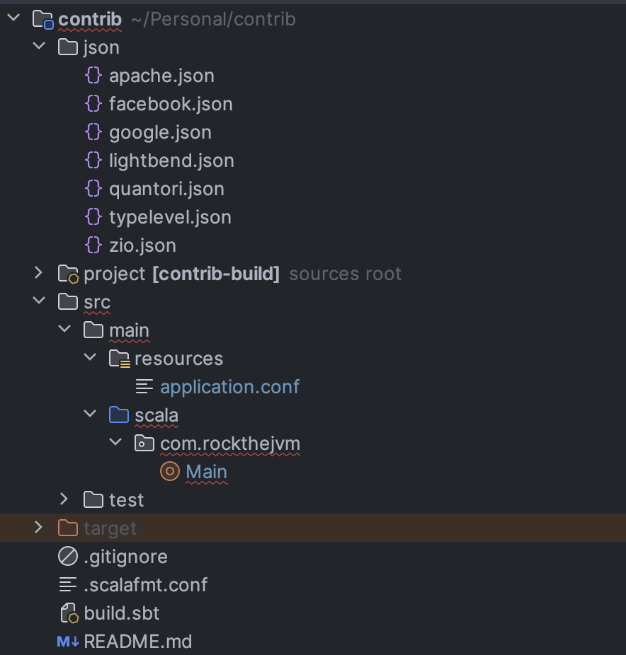

_by [Anzori (Nika) Ghurtchumelia](https://github.com/ghurtchu)_

## 1. Introduction

🚀 Welcome to a journey where functional programming meets the social media hub for developers - GitHub! 🌐.
If you've ever wondered how to turbocharge your software projects with parallelism, you're in for a treat. 
Today, we're diving into the world of Scala and Cats-Effect fibers by solving a practical problem.

Picture this: GitHub as the bustling city for developers, with repositories as towering skyscrapers and code collaborations. Now, what if I told you there's a way to navigate this huge metropolis within seconds? Enter functional programming, the superhero caped in composability and scalability 😊.

In the vast landscape of open-source collaboration, aggregating the valuable contributions of an organization's contributors can be a challenge. In this blog, we embark on a journey to streamline and enhance this process using the power of parallelism. Join me as we unravel an efficient solution to aggregate contributors concurrently. Let's dive into the world of parallelism and witness how we can transform the task of "contributors aggregation" into a "piece of cake".

In a nutshell: we will build the http server which will aggregate and sort the contributions for the specified GitHub organization.

## 2. Project Structure

We will use Scala 3.3.0, SBT 1.9.4 and other useful libraries to complete our project. 

The initial project skeleton:
- `json` folder contains the JSON outputs for each organization
- `src/main/scala/Main.scala` is a single file 150 LOC solution
- `src/main/resources/application.conf` defines the project configuration
- `.scalafmt.conf` is used to format the code
- `build.sbt` is responsible for building the project and generating `app.jar` which we can run with `java` or `scala`
- 

