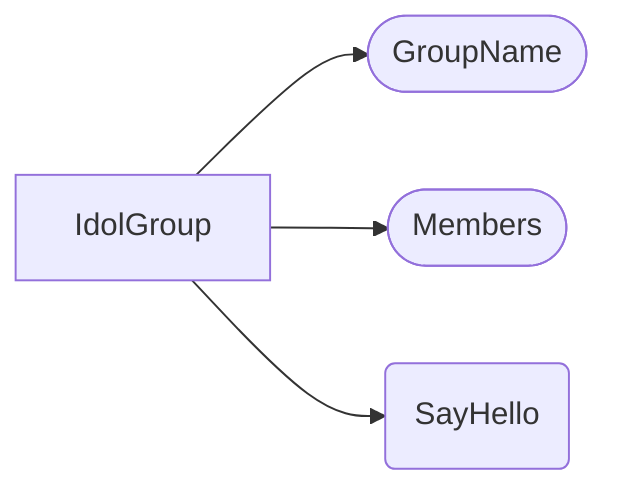
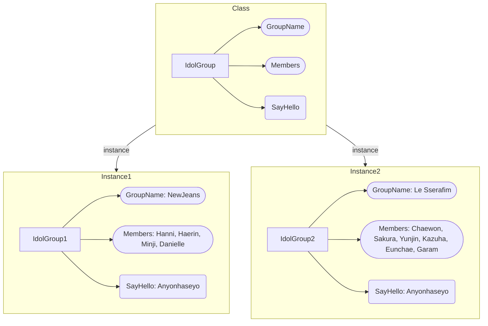

本ページはDartについて学習した内容を記録したものです。

# クラス（Class）

DartはOOPだ。OOPとは？

Object Oriented Programingの頭文字だ。

難しいことをこの記事で説明するつもりはない。

今は単純に関係あるデータと機能の集まりと覚えておこう。

以下の図をみてみよう。



アイドルグループというクラスがあるとしよう。

アイドルグループにはデータとしてグループ名（GroupName）と各メンバーのリスト（Members）を持っていて機能として挨拶（SayHello）を持っているとしよう。

この時点でアイドルグループは形だけであって実際に何かできることはない。

クラスはインスタンス化してから使えるようになる。インスタンス化とはこのクラス型の変数を宣言し、該当クラスを設定することだ。

イメージとしては次のようなものだ。



小さくなって見にくいが、IdolGroupという型を使ってNewjeansとLesserafimという実際に機能するオブジェクトとしてインスタンス化するとのことだ。

理解できなくても直接タイピングしながら、慣れれば良い。

実際にコードをみてみよう。

まずは上で示したIdorGroupクラスの一般的な形だ。


初期化してないのでエラーになる。初期化してインスタンスを作ってみよう。

```dart
void main() {
  IdolGroup lesserafim = IdolGroup();
  lesserafim.sayHello();
}

class IdolGroup {
  String groupName = 'ル・セラフィム';
  List<String> members = [
    'サクラ',
    'チェウォン',
    'ユンジン',
    'カズハ',
    'ウンチェ',
  ];
  
  void sayHello() {
    for(var member in members) {
      print('$memberです！');
    }
    print('私たちは$groupNameです！');
  }
}
```

```shell
サクラです！
チェウォンです！
ユンジンです！
カズハです！
ウンチェです！
私たちはル・セラフィムです！
```

他の言語ではnewというキーワードを使うが、Dartでは必要ない。インスタンスをもう一つ作ってみよう。

```dart
void main() {
  IdolGroup lesserafim = IdolGroup();
  lesserafim.sayHello();
  IdolGroup newJeans = IdolGroup();
  newJeans.sayHello();
}

class IdolGroup {
  String groupName = 'ル・セラフィム';
  List<String> members = [
    'サクラ',
    'チェウォン',
    'ユンジン',
    'カズハ',
    'ウンチェ',
  ];
  
  void sayHello() {
    for(var member in members) {
      print('$memberです！');
    }
    print('私たちは$groupNameです！');
  }
}
```

```shell
サクラです！
チェウォンです！
ユンジンです！
カズハです！
ウンチェです！
私たちはル・セラフィムです！
サクラです！
チェウォンです！
ユンジンです！
カズハです！
ウンチェです！
私たちはル・セラフィムです！
```

もう一つインスタンスを作ったのに内容が変わらず、面白くないのでインスタンス化の時に初期データを設定してみよう。

# コンストラクタ（Constructor）

クラスにはコンストラクタという特殊なメソッドがあり、コンストラクタはクラスをインスタンス化した時に１回のみ実行される。

>クラスに含まれるファンクションはファンクションではあるがメソッド（Method）と呼ぶ。

コンストラクタの作り方はクラスと同じ名前のメソッドを返却タイプ指定なしで宣言することだ。


何か怒られている。まだメンバー変数が初期化されてないと怒られている。初期化するかlateキーワードを使えと言っている。

lateはDartの機能の一つで後から初期化する変数に対して明示的に指定することだ。ではlateキーワードを指定して実行してみよう。

```dart
void main() {
  IdolGroup lesserafim = IdolGroup(
    'ル・セラフィム',
    [
      'サクラ',
      'チェウォン',
      'ユンジン',
      'カズハ',
      'ウンチェ',
    ],
  );
  lesserafim.sayHello();
  IdolGroup newJeans = IdolGroup(
    'ニュージーンズ',
    [
      'ミンジ',
      'ハニ',
      'ダニエル',
      'ヘリン',
      'ヘイン',
    ],
  );
  newJeans.sayHello();
}

class IdolGroup {
  late String groupName;
  late List<String> members;

  IdolGroup(String name, List<String> members) {
    groupName = name;
    this.members = members;
  }

  void sayHello() {
    for (var member in members) {
      print('$memberです！');
    }
    print('私たちは$groupNameです！');
  }
}
```

```shell
サクラです！
チェウォンです！
ユンジンです！
カズハです！
ウンチェです！
私たちはル・セラフィムです！
ミンジです！
ハニです！
ダニエルです！
ヘリンです！
ヘインです！
私たちはニュージーンズです！
```

思った通りに実行できた。コンストラクタ内でthisキーワードが見えるか。Dartではクラス内でメンバー変数を使う時にthisキーワードは必須ではない。今回thisキーワードを使ったのはパラメータと変数の名前が一緒だったので区分するために使った。Dartではこのように名前が一緒の変数を区別する時以外はthisキーワードは使わない。

これからはDartでの便利な機能というか、省略表現のような形でコンストラクタを変更してみる。

```dart
void main() {
  IdolGroup lesserafim = IdolGroup(
    'ル・セラフィム',
    [
      'サクラ',
      'チェウォン',
      'ユンジン',
      'カズハ',
      'ウンチェ',
    ],
  );
  lesserafim.sayHello();
  IdolGroup newJeans = IdolGroup(
    'ニュージーンズ',
    [
      'ミンジ',
      'ハニ',
      'ダニエル',
      'ヘリン',
      'ヘイン',
    ],
  );
  newJeans.sayHello();
}

class IdolGroup {
  late String groupName;
  late List<String> members;

  IdolGroup(String name, List<String> members)
      : groupName = name,
        this.members = members;

  void sayHello() {
    for (var member in members) {
      print('$memberです！');
    }
    print('私たちは$groupNameです！');
  }
}
```

{}で処理を囲まずにメソッドの（）の後にコロン（：）してやりたい処理をコンマ（,）で区分して入力する。最後にセミコロン（；）だ。

シンプルに宣言できるので楽だ。

でも、もっとシンプルになる方法がある。

```dart
void main() {
  IdolGroup lesserafim = IdolGroup(
    'ル・セラフィム',
    [
      'サクラ',
      'チェウォン',
      'ユンジン',
      'カズハ',
      'ウンチェ',
    ],
  );
  lesserafim.sayHello();
  IdolGroup newJeans = IdolGroup(
    'ニュージーンズ',
    [
      'ミンジ',
      'ハニ',
      'ダニエル',
      'ヘリン',
      'ヘイン',
    ],
  );
  newJeans.sayHello();
}

class IdolGroup {
  late String groupName;
  late List<String> members;

  IdolGroup(this.groupName, this.members);

  void sayHello() {
    for (var member in members) {
      print('$memberです！');
    }
    print('私たちは$groupNameです！');
  }
}
```

コンストラクタのパラメータにthisキーワードを使ってメンバー変数を入力するとこのポジションに渡される値はこのメンバー変数に設定する指示だ。

このような省略された表現はlateキーワードを使わなくても怒られない。多くのサンプルはこの形をしているのでこれから慣れると思う。

今まではポジショナル・パラメータ（Positional Parameter）であったが、ネームド・パラメータ（Named Parameter）もやってみよう。

まずは基本的なやり方だ。

```dart
void main() {
  IdolGroup lesserafim = IdolGroup(
    name: 'ル・セラフィム',
    members: [
      'サクラ',
      'チェウォン',
      'ユンジン',
      'カズハ',
      'ウンチェ',
    ],
  );
  lesserafim.sayHello();
  IdolGroup newJeans = IdolGroup(
    name: 'ニュージーンズ',
    members: [
      'ミンジ',
      'ハニ',
      'ダニエル',
      'ヘリン',
      'ヘイン',
    ],
  );
  newJeans.sayHello();
}

class IdolGroup {
  String groupName;
  List<String> members;

  IdolGroup({required String name, required List<String> members})
      : groupName = name,
        this.members = members;

  void sayHello() {
    for (var member in members) {
      print('$memberです！');
    }
    print('私たちは$groupNameです！');
  }
}
```

結果は一緒だ。ネームドパラメータでは、requiredキーワードでパラメータを必須にしないとnull許容できないと怒られる。使わずにnull許容することもできるが、できるだけnullを許容しないのが安全だ。

これもさらに省略できる。

```dart
void main() {
  IdolGroup lesserafim = IdolGroup(
    groupName: 'ル・セラフィム',
    members: [
      'サクラ',
      'チェウォン',
      'ユンジン',
      'カズハ',
      'ウンチェ',
    ],
  );
  lesserafim.sayHello();
  IdolGroup newJeans = IdolGroup(
    groupName: 'ニュージーンズ',
    members: [
      'ミンジ',
      'ハニ',
      'ダニエル',
      'ヘリン',
      'ヘイン',
    ],
  );
  newJeans.sayHello();
}

class IdolGroup {
  String groupName;
  List<String> members;

  IdolGroup({
    required this.groupName,
    required this.members,
  });

  void sayHello() {
    for (var member in members) {
      print('$memberです！');
    }
    print('私たちは$groupNameです！');
  }
}
```
