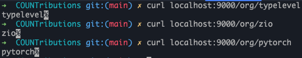
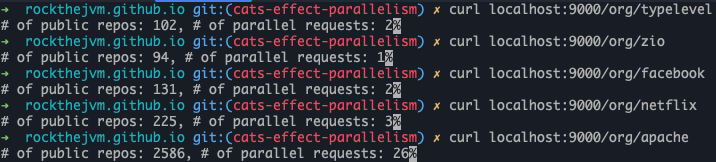
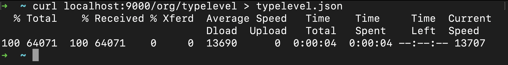
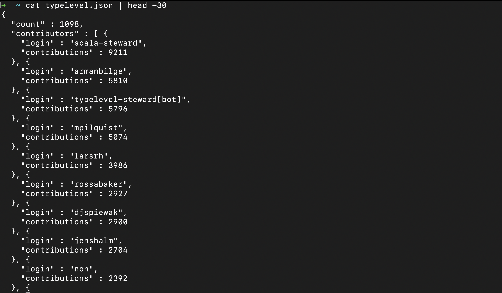

_by [Anzori (Nika) Ghurtchumelia](https://github.com/ghurtchu)_


## 1. Introduction

🚀 Welcome to a journey where functional programming meets the social media hub for developers - GitHub! 🌐.

If you've ever wondered how to turbocharge your software projects with parallelism, you're in for a treat. 

Today, we're diving into the world of Scala and Cats-Effect fibers by solving a practical problem.

Picture this: GitHub as the bustling city for developers, with repositories as towering skyscrapers and code collaborations. Now, what if I told you there's a way to navigate this huge metropolis within seconds? Enter functional programming, the superhero caped in composability and scalability 😊.

In the vast landscape of open-source collaboration, aggregating an organization's contributions can be a challenge. In this blog, we unravel an efficient solution to aggregate contributors concurrently. We will witness how Scala's support for parallel programming can transform the task of "contributors aggregation" into a "piece of cake".

Simply put, we're creating an HTTP server to compile and organize contributors from a specific GitHub organization, like Google or Typelevel. The response will be sorted based on the quantity of each developer's contributions.

## 2. Project Structure

We will use Scala 3.3.0, SBT 1.9.4 and a handful of useful libraries to complete our project. 

The initial project skeleton looks like the following:


- `json` folder contains the JSON outputs for each organization
- `src/main/scala/com/rockthejvm/Main.scala` is a single file 150 LOC solution
- `src/main/resources/application.conf` defines the project configuration (in this case only a GitHub token for authorizing GitHub requests)
- `.scalafmt.conf` is used to format the code (UI/UX is important, even for backend devs 😉)
- `build.sbt` is responsible for building the project and generating `app.jar` which we can run with `java` or `scala`

Let's have a look at the libraries listed in `build.sbt`:
```scala
val Http4sVersion = "0.23.23"

lazy val root = (project in file("."))
  .settings(
    organization := "com.rockthejvm",
    name := "contrib",
    scalaVersion := "3.3.0",
    libraryDependencies ++= Seq(
      "org.http4s" %% "http4s-ember-server" % Http4sVersion,
      "org.http4s" %% "http4s-ember-client" % Http4sVersion,
      "org.http4s" %% "http4s-dsl" % Http4sVersion,
      "com.typesafe.play" %% "play-json" % "2.10.3",
      "com.github.pureconfig" %% "pureconfig-core" % "0.17.4",
      "ch.qos.logback" % "logback-classic" % "1.4.12" % Runtime,
    ),
  )
```

- first three dependencies which start with `org.http4s` are concerned with the HTTP server & client and handy dsl for creating `HttpRoutes`
- `play-json` is a JSON library for Scala
- last two libraries will be used for managing project configuration and logging respectively

## 3. Prerequisites
Before doing anything, please generate personal GitHub access token and put it in `src/main/resources/application.conf`, like this:


It is necessary to use GitHub token because we'll be using GitHub API for which the requests must be authorized. Also, GitHub token will ensure that GitHub API rate limiter will allow us to issue many requests at once.

Please, have a look at the [GitHub docs](https://docs.github.com/en/authentication/keeping-your-account-and-data-secure/managing-your-personal-access-tokens) to do it.

## 4. Planning
What are we going to do and how exactly? To answer these questions we must investigate existing GitHub API so that we know what kind of data is exposed and how.

Some of the interesting questions can be:
- How can I fetch basic data about an organization?
- How do I find out how many public projects are owned by the organization?
- What is the number of contributors for each project owned by the organization?
- ...

## 5. Quickstart

Let's just create a `Main.scala` and run a basic HTTP server with health check endpoint to ensure that everything is fine.
 
```scala
package com.rockthejvm

import cats.effect.{IO, IOApp}
import org.http4s.dsl.io.*
import org.http4s.ember.server.EmberServerBuilder
import org.http4s.HttpRoutes
import org.typelevel.log4cats.Logger
import org.typelevel.log4cats.slf4j.Slf4jLogger
import org.typelevel.log4cats.syntax.LoggerInterpolator
import com.comcast.ip4s.*

object Main extends IOApp.Simple {

  given logger: Logger[IO] = Slf4jLogger.getLogger[IO]

  override val run: IO[Unit] =
    (for {
      _ <- info"starting server".toResource
      _ <- EmberServerBuilder
        .default[IO]
        .withHost(host"localhost")
        .withPort(port"9000")
        .withHttpApp(routes.orNotFound)
        .build
    } yield ()).useForever

  def routes: HttpRoutes[IO] =
    HttpRoutes.of[IO] { case GET -> Root =>
      Ok("hi :)")
    }
}
```

To start the app we need to execute `sbt` and `run` commands:

- `sbt`
- `run`

and then test our server by curling it:

`curl localhost:9000`

To illustrate all that:


Great! Now it's time to move on to some domain modeling.

## 6. Domain Modeling

It turns out that GitHub API responses support JSON format, it means that we'll need to define custom JSON deserializers for our domain models.

Since we're working on "GitHub Organization Contributors Aggregator" we'd probably need to think in terms of following nouns:
- Organization
- Project
- Contributor
- ...

Also, it's important to keep in mind what is returned by each REST API request so that our deserializers do not fail unexpectedly.

Let's start by Organization. Organization is a group of developers that develops multiple open source projects, however the only thing we're interested is the amount of public repositories it owns.

Turns out that if we send a basic request to ```"https://api.github.com/orgs/$orgName"``` we will get a JSON response back, in which we could find the amount of public repositories.

For example, let's pick an organization - `typelevel` and test it:


Nice, so we have our first interesting domain object - Amount of public repositories, let's model that, shall we? :)

Since it's just a number we could use `Int` or `Long` but Scala 3 supports `opaque types`, so it's better to use that.

Let's create a `domain` object in `Main.scala` and put everything there with the intention of being compact and fitting everything in one picture.

```scala
object domain {

  opaque type PublicRepos = Int

  object PublicRepos {
    val Empty: PublicRepos = PublicRepos.apply(0)
    def apply(value: Int): PublicRepos = value
  }

  extension (repos: PublicRepos) 
    def value: Int = repos
}
```

We've defined an [`opaque type`](https://blog.rockthejvm.com/scala-3-opaque/) which essentially is an `Int`. It has an `apply` constructor and `Empty` value. `apply` defines the method in the companion object. It allows you to create instances of `PublicRepos` by calling `PublicRepos` as if it was a function, passing an integer value as an argument, this way we could avoid additional wrapping cost over simple integers.

`Empty` value can be used in case the key is absent in JSON, or in case it has a negative value. The latter one is less likely to happen, but let's choose the safer road and insure ourselves with a sensible fallback - 0.

With the `value` extension method, we can easily retrieve the underlying Int value for `PublicRepos`.

As for the deserializer for `PublicRepos` - it will be really simple. We would just want to read `"public_repos"` key from JSON, so we'd define that in `domain` object in the following way:
```scala
object domain {
  
  import play.api.libs.json.*
  import play.api.libs.*
  import Reads.{IntReads, StringReads}

  /**
   * some PublicRepos definitions 
   * ..
   * ..
   */

  given ReadsPublicRepos: Reads[PublicRepos] = (__ \ "public_repos").read[Int].map(PublicRepos.apply)
}
```

Let's break down step by step what is going on here:
- `given ReadsPublicRepos`: This declares an implicit value named `ReadsPublicRepos` of type `Reads[PublicRepos]`. In Scala 3, `given` keyword is used to define implicit values.
- `Reads[PublicRepos]`: This indicates that the implicit value is an instance of the `Reads` type class for the `PublicRepos` type. The `Reads` type class is typically used in Play JSON to define how to read JSON values into Scala types.
- `(__ \ "public_repos")`: This is a Play JSON combinator that specifies the path to the `"public_repos"` field in a JSON structure. It is part of the Play JSON DSL and is used to create a reads for the specified field.
- `.read[Int]`: This part of the code specifies that the value at the path `"public_repos"` in the JSON structure should be read as an Int. It's defining how to extract an Int value from the JSON.
- `.map(PublicRepos.apply)`: This maps the `Int` value obtained from reading the `"public_repos"` field to a `PublicRepos` instance using the `PublicRepos.apply` method. It essentially converts the extracted Int value into a `PublicRepos` instance.

So, when you have JSON data representing a structure with a `"public_repos"` field, you can use this given `Reads` instance (`ReadsPublicRepos`) to convert that JSON into a `PublicRepos` instance.

As soon as we have `PublicRepos` we could also define something like a placeholder for the repository name, maybe - `RepoName`.

`RepoName` is as trivial as `PublicRepos`, however, obviously it's not a number:
```scala
object domain {

  import play.api.libs.json.*
  import play.api.libs.*
  import Reads.{IntReads, StringReads}

  /**
   * code
   * ..
   * code
   */

  opaque type RepoName = String
  
  object RepoName {
    def apply(value: String): RepoName = value
  }
  
  extension (repoName: RepoName) 
    def value: String = repoName
  
  given ReadsRepo: Reads[RepoName] = (__ \ "name").read[String].map(RepoName.apply)
}
```

We basically used the same mechanism as we used for `PublicRepos`:
- defined `opaque type`
- created `apply` constructor for it
- added `extension` method
- defined `Reads`

Splendid!

What about `Contributor` though? How would we want to represent each contributor? I guess it's important to have at least:
- `username` (text)
- `contributions` (number)

But, before modeling our contributor, it's worth checking what GitHub API returns when we request for contributors.

For that, again, we can pick some organization and open source project owned by that organization and ping some endpoints.

e.g, let's pick `typelevel` (`$orgName`) and `cats` (`$repoName`).

Paginated API endpoint looks like: `https://api.github.com/repos/$orgName/$repoName/contributors?per_page=100&page=$page`

Notice, that the response is a JSON array. Important fields for us should be first and last of each - `"login"` and "`contributions`":


So, our `Contributor` model could look like this:

```scala
object domain {
  
  import play.api.libs.json.*
  import play.api.libs.*
  import Reads.{IntReads, StringReads}
  import cats.syntax.all.*

  /**
   * old definitions
   */

  final case class Contributor(login: String, contributions: Long)
  
  given ReadsContributor: Reads[Contributor] = json =>
    (
      (json \ "login").asOpt[String],
      (json \ "contributions").asOpt[Long],
    ).tupled.fold(JsError("parse failure, could not construct Contributor"))((lo, co) => JsSuccess(Contributor(lo, co)))

  given WritesContributor: Writes[Contributor] = Json.writes[Contributor]
}
```

The `case class` definition needs no explanation, but... you may be thinking... why do we have `Writes` at all?

Good question! `Writes[Contributor]` is necessary because our HTTP server should also return this data to the client (more on that later).

This `Reads[Contributor]` can be a bit of tricky, so let's explain what is going on there:

- `json => ...` is an anonymous function taking a JSON value as input.
- `(json \ "login").asOpt[String]` extracts the value associated with the key `"login"` from the JSON object as an optional `String`.
- `(json \ "contributions").asOpt[Long]` extracts the value associated with the key `"contributions"` as an optional `Long`.
- `(lo, co) => JsSuccess(Contributor(lo, co))` is a function that takes the extracted values and constructs a `Contributor` instance.
- `.tupled` extension method is coming from `import cats.syntax.all.*` and is used to convert the tuple `(Option[String], Option[Long])` into an `Option[(String, Long)]`.
- `fold` method is used to handle the case where either of the options is `None`. If any of them is `None`, it returns a `JsError("parse failure")`; otherwise, it returns a `JsSuccess` with the constructed `Contributor` instance.

We could have also used default values for each field and create an empty `Contributor` such as `Contributor(login="", contributions=0)`, you're free to choose.

Great!

Before we move on defining business logic, we should define one more domain object - `Contributions`. It may be a bit unclear why, let me explain.

We are building an HTTP server which is going to respond us JSON object, and you're free to choose the format, however I'd go with something like this:

```scala
object domain {
  
  import play.api.libs.json.*
  import play.api.libs.*
  import Reads.{IntReads, StringReads}
  import cats.syntax.all.*

  /**
   * old definitions
   */

  final case class Contributions(count: Long, contributors: Vector[Contributor])

  given WritesContributions: Writes[Contributions] = Json.writes[Contributions]
}
```
This is where the previous definition of `Writes[Contributor]` becomes useful, it is internally (implicitly) used by `Writes[Contributions]`.

In that case class definition the `count` will be just the amount of contributors for an organization whereas `contributors` will be a `Vector` of `Contributor`-s, sorted by `Contributor#contributions` field.

With that, we can finish the domain modeling and switch to the next part - building blocks for business logic.

## 7. Building blocks for business logic

Our goal is to make contributors aggregation fast. We've seen that there are more than a few API requests we need to make, some of them are paginated, some of them are not. Also, it's important to define the order of execution and the general flow of the program.

After a few iterations and refinements I came up with something like this:
- send request to our HTTP server with organization name
- use organization name to find out how many public repos are available for organization name (let's say 10)
- use this number (10) to issue N amount of parallel requests so that our server starts retrieving contributors for each project in parallel
  - since there is no way to know how many contributors are available for a project we will need to send requests iteratively until they are exhausted, meaning that at some point the JSON response will contain less than 100 contributors, assuming that we expect to retrieve 100 contributors per page.
  
First of all, we will need to define a basic route which will let us accept organization name as a query parameter, so let's add a new case for our `routes` definition: 

```scala
def routes: HttpRoutes[IO] = {
  HttpRoutes.of[IO] { 
    case GET -> Root => Ok("hi :)")
    case GET -> Root / "org" / orgName => Ok(orgName)
  }
}
```

Let's quickly test the new route and then proceed with the important stuff.



Great!

Here's a list of things we need to prepare before writing the main logic:
- handling GitHub Token (configuration, loading, attaching to request headers)
- mechanism to create proper GitHub REST API URL-s (parameterization, pagination)
- general approach for issuing a single HTTP request (deserialization, error handling)

As soon as we have those components, we can start composing our main piece of logic.

Since this is a small project, it is not required to overwhelm ourselves with the approaches that quickly can turn into the rabbit hole of overengineering practices.

I suggest that we create a simple private methods in `Main.scala` which will be just called multiple times inside `routes` definition.

### 7.1 Handling Github Token

Github token is just a string which must be attached to request headers so that Github REST API rate limiter doesn't prohibit us issuing huge amount of requests. 

Let's be simple and model that as a single field case class:

```scala

// other imports
import pureconfig.ConfigReader
import pureconfig.generic.derivation.default.*
// other imports

object Main extends IOApp.Simple {

  final case class Token(token: String) derives ConfigReader {
    override def toString: String = token
  }

  /**
   * other code
   */
}
```

We've defined a case class named `Token` which derives from `ConfigReader` suggesting that it may be used in some configuration reading context.

The derives clause is part of the new Scala 3 feature called "derivation," which allows automatic generation of type class instances for case classes and other data types. In this case, it generates a `ConfigReader` instance for our `Token` class, allowing us to read instances of `Token` from some configuration source.

In general, there are a few options for managing such things:
- configuration
  - easy to set up
- env variable 
  - easy to set up
- key chains or secret management systems
  - not so easy and requires some time to set up, definitely an overkill for a small project such as ours
- hardcoding
  - very good for prototyping and development but extremely unsafe, as soon as you publish your token, GitHub will immediately expire it so that nobody can abuse it on your behalf

Since we've already seen `ConfigReader` and `pureconfig` dependency in our `build.sbt` it's fairly easy to guess which option we're using in this project, just a personal preference.

In terms of loading, it will just require one simple line of code in our `run` definition in:

```scala
object Main extends IOApp.Simple {

  /**
   * Token and logger definitions
   */
    
  override val run: IO[Unit] =
    (for {
      _ <- info"starting server".toResource
      token <- IO.delay(ConfigSource.default.loadOrThrow[Token]).toResource
      // .. other code
    } yield ()).useForever
```

Time to move on the next step.

### 7.2 Building GitHub REST API URL-s

There's only a handful of URL-s we need to build for each organization:
- URL for loading the amount of public repositories (`PublicRepos`) for some organization
- URL for loading the names of public repositories (`Vector[RepoName]`) for some organization
- URL for loading paginated contributors (`Vector[Contributor]`) for `X` repository owned by `Y` organization

Let's create such functions step by step in `Main.scala`:

```scala
def publicRepos(orgName: String) = s"https://api.github.com/orgs/$orgName"
```

It's apparent that `orgName` will be injected in the base URL, giving us `PublicRepos` URL.

```scala
def repos(orgName: String, page: Int): String =
  s"https://api.github.com/orgs/$orgName/repos?per_page=100&page=$page"
```

Here, `orgName` and `page` will be injected in respective places, giving us URL which upon requesting data returns the collection of repositories, from which we'll read `RepoName` and turn that into `Vector[RepoName]` in the end.

```scala
def contributorsUrl(repoName: String, orgName: String, page: Int): String =
    s"https://api.github.com/repos/$orgName/$repoName/contributors?per_page=100&page=$page"
```

`repoName`, `orgName`, `page` will be injected in placeholders, yielding us URL which returns the list of paginated contributors. After processing the responses, our app will turn this data into `Vector[Contributor]`.

### 7.3 HTTP request fetch functionality

In order to implement a generic `HTTP GET` we will need to have a few other things in place. 

Please keep in mind, that we're working with `http4s` server and client, which means that eventually we'll need to create things such as:
- `http4s.org.Request[IO]`
- `http4s.org.Uri`
- `org.http4s.client.Client[IO]`
- ...

Let's define a function which will build `Uri` or `IO[Uri]` from the unsafe string.

```scala
import org.http4s.Uri

def uri(url: String): IO[Uri] = IO.fromEither(Uri.fromString(url))
```

`Uri.fromString(url)` gives us `Either[IO, Uri]` and with the help of `IO#Either` constructor - `IO.fromEither` we're able to convert that into `IO[Uri]`.

Before defining the `HTTP GET` we need one more thing - function which creates the `Request[IO]`:

```scala
import org.http4s.Header.Raw
import org.typelevel.ci.CIString
import org.http4s.{Method, Request, Uri}

def req(uri: Uri)(using token: Token) = Request[IO](Method.GET, uri)
    .putHeaders(Raw(CIString("Authorization"), s"Bearer ${token.token}"))
```

Here's the breakdown of the code:

- `def req(uri: Uri)(using token: Token)` declares a function named `req` that takes a `Uri` and an `implicit Token` parameter.
- `Request[IO](Method.GET, uri)` creates an HTTP request with the `GET` method and the provided URI using the `http4s` library.
- `.putHeaders(...)` adds headers to the request.
- `Raw(CIString("Authorization"), s"Bearer ${token.token}")` constructs the `"Authorization"` header with the value `"Bearer ${token.token}"`.

So, in essence this function creates a request with an `Authorization` header, where the token is taken from the implicit `Token` parameter which we've defined earlier.

Sometimes, working with JSON can make our code a bit clumsy, so I suggest we add a nice syntax for de/serialization:

```scala
object syntax {
  extension (self: String) 
    def into[A](using r: Reads[A]): A = Json.parse(self).as[A]
    
  extension [A](self: A) 
    def toJson(using w: Writes[A]): String = Json.prettyPrint(w.writes(self))
}
```

This will enable easy conversion between our case classes and their JSON equivalents. As an example with a dummy case class:
```scala
case class Data(x: Int, y: Int)

given DataFormat: Format[Data] = Json.format[Data]

val data = Data(x = 1, y = 2)

val dataJsonString = data.toJson // "{"x":1,"y":2}"
val dataFromJsonString = dataJsonString.into[Data] // Data(x = 1, y = 2)
```

Now we can define a general `HTTP GET` functionality which will be used later multiple times:
```scala
def fetch[A: Reads](uri: Uri, client: Client[IO], default: => A)(using token: Token): IO[A] =
    client
        .expect[String](req(uri)) // issue request
        .map(_.into[A]) // transform the JSON into A using Reads[A]
        .onError(IO.println) // print out any errors
        .handleError(_ => default) // if IO computation fails, return the default value of A
```
This function is designed for fetching data from an HTTP endpoint, parsing the response as JSON into a type `A`, and handling errors gracefully by providing a default value. The use of type classes like `Reads` indicates that are using type class-based decoding for type `A`.

Explanation:
- `client.expect[String](req(uri))` sends an HTTP request using the `req` function from our previous example and expects the response as a `String` (it is assumed that the response body is expected to be a JSON string).
- `.map(_.into[A])` transforms the JSON body into the concrete instance of `A` using `Reads[A]`
- `.onError(IO.println)` logs the error if an exception occurs during the HTTP request. The `IO.println` function is used to print the error to the console.
- `.handleError(_ => default)` If an error occurs in IO computation, it falls back to the `default` value for `A`.

With that, we can move on to the most important part of our project - business logic.

## 8. Business logic

We have defined the domain and several building blocks for actually implementing the business logic, however, before writing the code we need to define the flow / plan and then execute it.

After a few revisions and refinement this is the plan I came up with:
- choose the organization (e.g `typelevel`)
- send HTTP request to our app on `host:port/org/typelevel`
- fetch public repositories information for `typelevel` from a GitHub API endpoint
- calculate the number of pages based on the number of public repositories (100 repositories per page) that is owned by `typelevel`
  - this number will let us issue N amount of parallel requests in the next step
- use the computed number and fetch information about repositories to accumulate the list of repository names
  - we will end up here with smth like `Vector("cats", "cats-effect", ... ,"fs2")`
- for each repository, start fetching contributors in parallel and accumulate their contributions sequentially
  - So, if we have 3 repositories we will create 3 separate fibers and start accumulating paginated contributors sequentially until they are exhausted. It means that fiber A may take 500 millis, fiber B - 600 millis, fiber C - 300 millis. So, in total, we will have all results in 600 millis since it's based on fork-join algorithm.
  - Unfortunately there is no clear way of parallelising fetching the contributors for repository because we don't know in advance how many contributors there are. However, if you feel brave you can play with different ideas and also try parallelising that, e.g you can use `fibonacci` approach and issue N amount of request on each iteration until they are exhausted, more on that later. 
- group and sum contributions by contributor login
- create a `Vector[Contributor]` instances sorted by contributions
- generate a JSON response containing information about contributors and contributions
- send back the HTTP response with the JSON content

Let's begin!

### 8.1 Accept organization name and define the # of parallel requests

```scala
object Main extends IOApp.Simple {

  override val run: IO[Unit] =
    (for {
      _      <- info"starting server".toResource
      token  <- IO.delay(ConfigSource.default.loadOrThrow[Token]).toResource
      client <- EmberClientBuilder.default[IO].build
      _      <- EmberServerBuilder
              .default[IO]
              .withHost(host"localhost")
              .withPort(port"9000")
              .withHttpApp(routes(client, token).orNotFound)
              .build
    } yield ()).useForever
  

  def routes(client: Client[IO], token: Token): HttpRoutes[IO] = {

    given tk: Token = token

    HttpRoutes.of[IO] {
      case GET -> Root => Ok("hi :)")
      case GET -> Root / "org" / orgName =>
        for {
          publicReposUri <- uri(publicRepos(orgName))
          publicRepos <- fetch[PublicRepos](publicReposUri, client, PublicRepos.Empty)
          pages = (1 to (publicRepos.value / 100) + 1).toVector // # of parallel requests that we can make later, e.g Vector(1, 2, 3) - 3 pages, so that we can have Vector of repository names
          response <- Ok(s"# of public repos: $publicRepos, # of parallel requests: ${pages.size}")
        } yield response
    }
  }
}
```

As you can see, we updated `routes` definition so that it finds out how many public repositories are available per organization.

The steps are:
- define a `publicReposUri`
- issue HTTP request to `publicReposUri`
- deserialize JSON response to `PublicRepos` which is an amount of public repositories
- send response 200 OK with computed result

Below you can see how could we test this functionality:



### 8.2 Fetching all repository names

At this point we've already calculated the `pages` which holds the number of pages based on the number of public repositories (100 repositories per page) that is owned by some organization.

Since we have this value available, we can issue N amount of paginated requests and get back the `Vector[RepoName]`, let me demonstrate this to you:

```scala
// other imports  
import cats.syntax.all.*
import cats.instances.all.*
// other imports
  
object Main extends IOApp.Simple { 
  
  // other definitions

  def routes(client: Client[IO], token: Token): HttpRoutes[IO] = {

    given tk: Token = token

    HttpRoutes.of[IO] {
      case GET -> Root => Ok("hi :)")
      case GET -> Root / "org" / orgName =>
        for {
          publicReposUri <- uri(publicRepos(orgName))
          publicRepos <- fetch[PublicRepos](publicReposUri, client, PublicRepos.Empty)
          pages = (1 to (publicRepos.value / 100) + 1).toVector
          // let's calculate the vector of repository names
          repositories <- pages.parUnorderedFlatTraverse { page =>
            uri(repos(orgName, page)).flatMap(fetch[Vector[RepoName]](_, client, Vector.empty[RepoName]))
          }
          response <- Ok(repositories.toString)
        } yield response
    }
  }
}
```

Let me explain how we calculated `repositories` step by step:
- The `parUnorderedFlatTraverse` function is used to perform parallel and unordered traversing of the `pages` vector. For each page, it fetches the repositories using the `uri(repos(orgName, page))` to construct the `URI` and `fetch[Vector[RepoName]](_, client, Vector.empty[RepoName])` to fetch the repository names from the GitHub API. The result is a `Vector[Vector[RepoName]]` representing repositories for each page.
- The `parUnorderedFlatTraverse` combines the vectors from different pages into a single `Vector[RepoName]` by flattening and concatenating them in a parallel and unordered manner.
- The resulting `Vector[RepoName]` is assigned to the repositories value.
- Finally, the route responds with an HTTP Ok `Ok(repositories.toString)` containing the string representation of the vector of repository names.

Let's manually test the output for different organizations:


### 8.3 Start fetching contributors for each project in parallel and exhaust each iteratively

Since we have all the repositories, now we can start fetching the contributors of each project in parallel. We must notice that the results for this one are also paginated, however, we don't know exactly how many contributors are out there for each project, it means that we're limited in parallelism here and we have to iteratively fetch "next contributors list" until it returns the less than 100 results, indicating that it's the last one.

```scala
// other imports  
import cats.syntax.all.*
import cats.instances.all.*
// other imports
  
object Main extends IOApp.Simple { 
  
  // other definitions
  def routes(client: Client[IO], token: Token): HttpRoutes[IO] = {
    given tk: Token = token

    HttpRoutes.of[IO] {

      case GET -> Root => Ok("hi :)")

      case GET -> Root / "org" / orgName =>
        for {
          publicReposUri <- uri(publicRepos(orgName))
          publicRepos <- fetch[PublicRepos](publicReposUri, client, PublicRepos.Empty)
          pages = (1 to (publicRepos.value / 100) + 1).toVector
          repositories <- pages.parUnorderedFlatTraverse { page =>
            uri(repos(orgName, page))
                    .flatMap(fetch[Vector[RepoName]](_, client, Vector.empty[RepoName]))
          }
          contributors <- repositories
                  .parUnorderedFlatTraverse { repoName =>
                    def getContributors(
                      page: Int,
                      contributors: Vector[Contributor],
                      isEmpty: Boolean = false,
                    ): IO[Vector[Contributor]] =
                      if ((page > 1 && contributors.size % 100 != 0) || isEmpty) IO.pure(contributors)
                      else {
                        uri(contributorsUrl(repoName.value, orgName, page))
                                .flatMap { contributorUri =>
                                  for {
                                    newContributors <- fetch[Vector[Contributor]](contributorUri, client, Vector.empty)
                                    next <- getContributors(
                                      page = page + 1,
                                      contributors = contributors ++ newContributors,
                                      isEmpty = newContributors.isEmpty,
                                    )
                                  } yield next
                                }
                      }

                    getContributors(page = 1, contributors = Vector.empty)
                  }
                  .map {
                    _.groupMapReduce(_.login)(_.contributions)(_ + _).toVector
                            .map(Contributor(_, _))
                            .sortWith(_.contributions > _.contributions)
                  }
          response <- Ok(Contributions(contributors.size, contributors).toJson)
        } yield response
    }
  }
}
```

In the code snippet above, `contributors` and `response` are two important components of the HTTP route handling logic. Let's break down their meanings:

`contributors`:

- `contributors` is a value that represents a collection of contributors to GitHub repositories belonging to a specific organization.
- It is computed using parallel and unordered traversal (`parUnorderedFlatTraverse`) over the repositories vector.
- For each repository (`repoName`), it fetches the contributors from the GitHub API in a paginated manner.
- The `contributors` are accumulated into a `Vector[Contributor]`, and the final result is a collection of contributors from all repositories.
- The contributors are grouped by their `login` names and `contributions` using `groupMapReduce`.
- The resulting grouped `contributors` are then transformed into a `Vector[Contributor]` and sorted based on the contributions in descending order.

`response`:

- `response` is the final HTTP response that the route will return.
- It is constructed using the `Ok` constructor and contains the result of the entire computation.
- The result is an instance of the `Contributions` case class, which wraps information about the total number of contributors and the sorted vector of contributors.
- The `contributors` are sorted based on their contributions in descending order.
-The final result is serialized to JSON using the toJson method and included in the HTTP response body.

- In summary, `"contributors"` represents the processed and aggregated data about GitHub contributors, and `"response"` is the HTTP response containing this information in a serialized form. The route is designed to fetch information about public repositories, their contributors, and then provide a sorted list of contributors along with some summary statistics in the HTTP response.

Amazing! We should test it now, shan't we?

Assuming that server is running, we can just ping it with `typelevel` and save the JSON output in `typelevel.json`.

That way we can also see how many seconds it takes to do this operation:



You can see that it takes only 4 seconds to aggregate the contributors for `typelevel` - powered by functional parallel programming.

Let's also have a quick look at the first 30 lines of `typelevel.json`:



## 9. Summary

We have built together the GitHub organization contributors aggregator. Here's a summary of what we've accomplished, the tools and libraries used, and how we did it:

**What We Built:**
We built an HTTP server that accepts organization name and aggregates GitHub organization contributors in a matter of seconds. Our program is using minimal but sufficient domain modeling with `play-json` power do work with data. Additionally, it's heavily backed up by the powerful extension method - `parUnorderedFlatTraverse` from `cats` which ensures that each HTTP request is performed in a separate fiber (hence, the power of `cats.effect.IO`).

**Tools and Libraries Used:**
- `Scala 3`: the code is written in the Scala programming language.
- `sbt`: build tool which helped us to `compile`, `build` and `run` our project
- `cats/cats-effect`: we used the Cats Effect library for managing asynchronous and effectful operations using the IO monad.
- `http4s`: the http4s library is used for building HTTP clients and servers, handling HTTP requests and responses, and defining routes.
- `pureconfig`: used for loading application configuration from a configuration file.
- `ember`: used for building the HTTP client and server.
- `play-json`: awesome JSON library for Scala
- `log4cats`: used for logging messages within the application.

**How We Did It:**
- `Exploration`: We explored GitHub REST API a bit and planned the execution step by step
- `Domain modeling`: We modeled domain objects with the help of Scala 3 opaque types
- `Functional Programming`: The code is designed using functional programming principles, leveraging the Cats Effect library for handling side effects and IO operations.
- `Parallel Programming`: We used the powerful extension method - `parUnorderedFlatTraverse` which traverses the collection and runs an effect in a separate fiber for each object.
- `Configurability`: Application configuration is loaded from a configuration file using `PureConfig`, allowing us to configure GitHub personal access token.

If you want to see the whole project you can view _[Source code](https://github.com/Ghurtchu/COUNTributions)_

Thank you for your time and patience! Hope you learned something new today 😊


