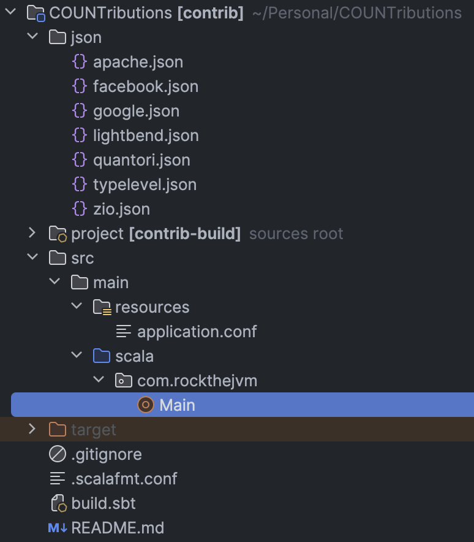
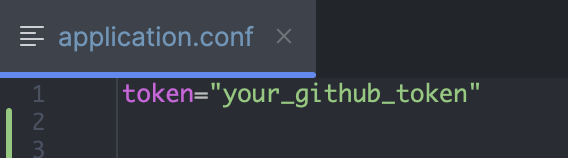
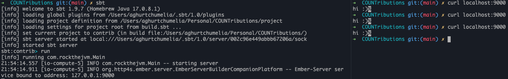
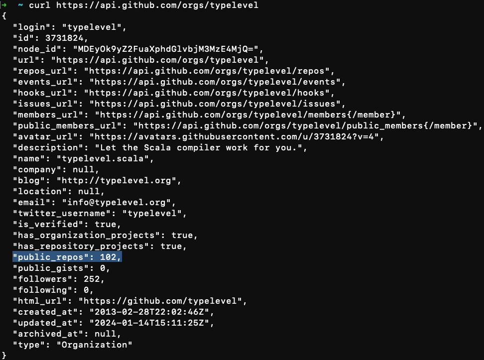
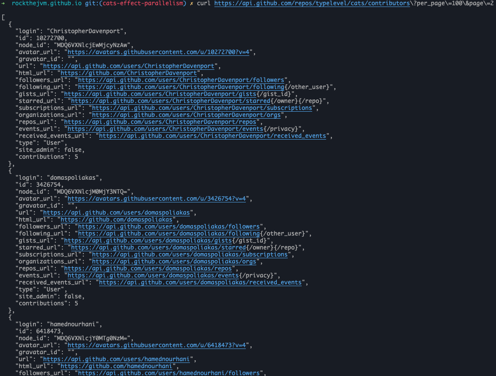

_by [Anzori (Nika) Ghurtchumelia](https://github.com/ghurtchu)_

## 1. Introduction

🚀 Welcome to a journey where functional programming meets the social media hub for developers - GitHub! 🌐.
If you've ever wondered how to turbocharge your software projects with parallelism, you're in for a treat. 
Today, we're diving into the world of Scala and Cats-Effect fibers by solving a practical problem.

Picture this: GitHub as the bustling city for developers, with repositories as towering skyscrapers and code collaborations. Now, what if I told you there's a way to navigate this huge metropolis within seconds? Enter functional programming, the superhero caped in composability and scalability 😊.

In the vast landscape of open-source collaboration, aggregating the valuable contributions of an organization's contributors can be a challenge. In this blog, we embark on a journey to streamline and enhance this process using the power of parallelism. Join me as we unravel an efficient solution to aggregate contributors concurrently. Let's dive into the world of parallelism and witness how we can transform the task of "contributors aggregation" into a "piece of cake".

Simply put, we're creating an HTTP server to compile and organize contributors from a specific GitHub organization, like Google or Typelevel. The response will be sorted based on the quantity of each developer's contributions.

## 2. Project Structure

We will use Scala 3.3.0, SBT 1.9.4 and a handful of useful libraries to complete our project. 

The initial project skeleton looks like the following:


- `json` folder contains the JSON outputs for each organization
- `src/main/scala/com/rockthejvm/Main.scala` is a single file 150 LOC solution
- `src/main/resources/application.conf` defines the project configuration (in this case only a GitHub token for authorizing GitHub requests)
- `.scalafmt.conf` is used to format the code (UX is important, even for backend devs 😉)
- `build.sbt` is responsible for building the project and generating `app.jar` which we can run with `java` or `scala`

Let's have a look at the libraries listed in `build.sbt`:
```scala
val Http4sVersion = "0.23.23"

lazy val root = (project in file("."))
  .settings(
    organization := "com.rockthejvm",
    name := "contrib",
    scalaVersion := "3.3.0",
    libraryDependencies ++= Seq(
      "org.http4s" %% "http4s-ember-server" % Http4sVersion,
      "org.http4s" %% "http4s-ember-client" % Http4sVersion,
      "org.http4s" %% "http4s-dsl" % Http4sVersion,
      "com.typesafe.play" %% "play-json" % "2.10.3",
      "com.github.pureconfig" %% "pureconfig-core" % "0.17.4",
      "ch.qos.logback" % "logback-classic" % "1.4.12" % Runtime,
    ),
  )
```

- first three dependencies which start with `org.http4s` are concerned with the HTTP server & client and handy dsl for creating `HttpRoutes`
- `play-json` is a JSON library for Scala
- last two libraries will be used for managing project configuration and logging respectively

## 3. Prerequisites
Before doing anything, please generate GitHub token and put it in `src/main/resources/application.conf`, like this:


It is necessary to use GitHub token because we'll be using GitHub API for which the requests must be authorized. Also, GitHub token will ensure that GitHub API rate limiter will allow us to issue many requests at once.

## 4. Planning
What are we going to do and how exactly? To answer this questions we must investigate existing GitHub API so that we know what kind of data is exposed and how.

Some of the interesting questions can be:
- How can I fetch basic data about organization?
- How do I find out how many public projects are owned by the organization?
- What is the number of contributors for each project owned by organization?
- ...

## 5. Quickstart

Let's just create a `Main.scala` and run a basic HTTP server with health check endpoint to ensure that everything is fine.
 
```scala
package com.rockthejvm

import cats.effect.{IO, IOApp}
import org.http4s.dsl.io.*
import org.http4s.ember.server.EmberServerBuilder
import org.http4s.HttpRoutes
import org.typelevel.log4cats.Logger
import org.typelevel.log4cats.slf4j.Slf4jLogger
import org.typelevel.log4cats.syntax.LoggerInterpolator
import com.comcast.ip4s.*

object Main extends IOApp.Simple {

  given logger: Logger[IO] = Slf4jLogger.getLogger[IO]

  override val run: IO[Unit] =
    (for {
      _ <- info"starting server".toResource
      _ <- EmberServerBuilder
        .default[IO]
        .withHost(host"localhost")
        .withPort(port"9000")
        .withHttpApp(routes.orNotFound)
        .build
    } yield ()).useForever

  def routes: HttpRoutes[IO] =
    HttpRoutes.of[IO] { case GET -> Root =>
      Ok("hi :)")
    }
}
```

To start the app we need to execute `sbt` and `run` commands:

- `sbt`
- `run`

and then test our server by curling it:

`curl localhost:9000`

To illustrate all that:


Great! Now it's time to move on to some domain modeling.

## 6. Domain Modeling

It turns out that GitHub API responses support JSON format, it means that we'll need to define custom JSON deserializers for our domain models.

Since we're working on "GitHub Organization Contributors Aggregator" we'd probably need to think in terms of following nouns:
- Organization
- Project
- Contributor
- ...

Also, it's important to keep in mind what is returned by each REST API request so that our deserializers do not fail unexpectedly.

Let's start by Organization. Organization is a group of developers that develops multiple open source projects, however the only thing we're interested is the amount of public repositories it owns.

Turns out that if we send a basic request to ```"https://api.github.com/orgs/$orgName"``` we will get a JSON response back, in which we could find the amount of public repositories.

For example, let's pick an organization - `typelevel` and test it:


Nice, so we have our first interesting domain object - Amount of public repositories, lets model that, shall we? :)

Since it's just a number we could use `Int` or `Long` but Scala 3 supports `opaque types`, so it's better to use that.

Let's create a `domain` object in `Main.scala` and put everything there with the intention of being compact and fitting everything in one picture.

```scala
object domain {

  opaque type PublicRepos = Int

  object PublicRepos {
    val Empty: PublicRepos = PublicRepos.apply(0)
    def apply(value: Int): PublicRepos = value
  }

  extension (repos: PublicRepos) 
    def value: Int = repos
}
```

We've defined `opaque type` which essentially is an `Int`. It has an `apply` constructor and `Empty` value. `apply` defines the method in the companion object. It allows you to create instances of `PublicRepos` by calling `PublicRepos` as if it was a function, passing an integer value as an argument, this way we could avoid additional wrapping cost over simple integers.

`Empty` value can be used in case the key is absent in JSON, or in case it has a negative value. The latter one is less likely to happen, but the more time I spent working as a software developer, the less trust I have in programmers, so let's choose the safer road and insure ourselves with a sensible fallback - 0.

With the `value` extension method, we can easily retrieve the underlying Int value for `PublicRepos`.

As for the deserializer for `PublicRepos` - it will be really simple. We would just want to read `"public_repos"` key from JSON, so we'd define that in `domain` object in the following way:
```scala
object domain {
  
  import play.api.libs.json.*
  import play.api.libs.*
  import Reads.{IntReads, StringReads}

  /**
   * some PublicRepos definitions 
   * ..
   * ..
   */

  given ReadsPublicRepos: Reads[PublicRepos] = (__ \ "public_repos").read[Int].map(PublicRepos.apply)
}
```

Let's break down step by step what is going on here:
- `given ReadsPublicRepos`: This declares an implicit value named `ReadsPublicRepos` of type `Reads[PublicRepos]`. In Scala 3, `given` keyword is used to define implicit values.
- `Reads[PublicRepos]`: This indicates that the implicit value is an instance of the `Reads` type class for the `PublicRepos` type. The `Reads` type class is typically used in Play JSON to define how to read JSON values into Scala types.
- `(__ \ "public_repos")`: This is a Play JSON combinator that specifies the path to the `"public_repos"` field in a JSON structure. It is part of the Play JSON DSL and is used to create a reads for the specified field.
- `.read[Int]`: This part of the code specifies that the value at the path `"public_repos"` in the JSON structure should be read as an Int. It's defining how to extract an Int value from the JSON.
- `.map(PublicRepos.apply)`: This maps the `Int` value obtained from reading the `"public_repos"` field to a `PublicRepos` instance using the `PublicRepos.apply` method. It essentially converts the extracted Int value into a `PublicRepos` instance.

So, when you have JSON data representing a structure with a `"public_repos"` field, you can use this implicit `Reads` instance (`ReadsPublicRepos`) to convert that JSON into a `PublicRepos` instance.

As soon as we have `PublicRepos` we could also define something like a placeholder for the repository name, maybe - `RepoName`.

`RepoName` is as trivial as `PublicRepos`, however, obviously it's not a number:
```scala
object domain {

  import play.api.libs.json.*
  import play.api.libs.*
  import Reads.{IntReads, StringReads}

  /**
   * code
   * ..
   * code
   */

  opaque type RepoName = String
  
  object RepoName {
    def apply(value: String): RepoName = value
  }
  
  extension (repoName: RepoName) 
    def value: String = repoName
  
  given ReadsRepo: Reads[RepoName] = (__ \ "name").read[String].map(RepoName.apply)
}
```

We basically used the same mechanism as we used for `PublicRepos`:
- defined `opaque type`
- created `apply` constructor for it
- added `extension` method
- defined `Reads`

Splendid!

What about `Contributor` though? How would we want to represent each contributor? I guess it's important to have at least:
- `username` (text)
- `contributions` (number)

But, before modeling our contributor, it's worth checking what GitHub API returns when we request for contributors.

For that, again, we can pick some organization and open source project owned by that organization and ping some endpoints.

e.g, let's pick `typelevel` (`$orgName`) and `cats` (`$repoName`).

Paginated API endpoint looks like: `https://api.github.com/repos/$orgName/$repoName/contributors?per_page=100&page=$page`

Please, notice that the response is a JSON array. Important fields for us should be first and last of each - `"login"` and "`contributions`":



So, our `Contributor` model could look like this:

```scala
objecet domain {
  
  import play.api.libs.json.*
  import play.api.libs.*
  import Reads.{IntReads, StringReads}
  import cats.syntax.all.*

  /**
   * old definitions
   */

  final case class Contributor(login: String, contributions: Long)
  
  given ReadsContributor: Reads[Contributor] = json =>
    (
      (json \ "login").asOpt[String],
      (json \ "contributions").asOpt[Long],
    ).tupled.fold(JsError("parse failure"))((lo, co) => JsSuccess(Contributor(lo, co)))

  given WritesContributor: Writes[Contributor] = Json.writes[Contributor]
}
```

The `case class` definition needs no explanation, you may be thinking... why do we have `Writes` at all?

Good question! `Writes[Contributor]` is necessary because our HTTP server should also return this data to the client (more on that later).

This `Reads[Contributor]` can be a bit of tricky, so let's explain what is going on there:

- `json => ...` is an anonymous function taking a JSON value as input.
- `(json \ "login").asOpt[String]` extracts the value associated with the key `"login"` from the JSON object as an optional `String`.
- `(json \ "contributions").asOpt[Long]` extracts the value associated with the key `"contributions"` as an optional `Long`.
- `(lo, co) => JsSuccess(Contributor(lo, co))` is a function that takes the extracted values and constructs a `Contributor` instance.
- `.tupled` extension method is coming from `import cats.syntax.all.*` and is used to convert the tuple `(Option[String], Option[Long])` into an `Option[(String, Long)]`.
- `fold` method is used to handle the case where either of the options is `None`. If any of them is `None`, it returns a `JsError("parse failure")`; otherwise, it returns a `JsSuccess` with the constructed `Contributor` instance.

Great!

Before we move on defining business logic, we should define one more domain object - `Contributions`. It may be a bit unclear why, let me explain.

We are building an HTTP server which is going to respond us JSON object, and you're free to choose the format, however I'd go with something like this:

```scala
objecet domain {
  
  import play.api.libs.json.*
  import play.api.libs.*
  import Reads.{IntReads, StringReads}
  import cats.syntax.all.*

  /**
   * old definitions
   */

  final case class Contributions(count: Long, contributors: Vector[Contributor])

  given WritesContributions: Writes[Contributions] = Json.writes[Contributions]
}
```

In that case class definition the `count` will be just the amount of contributors for an organization whereas `contributors` will be a `Vector` of `Contributor`-s, sorted by `Contributor#contributions` field.

With that, we can finish the domain modeling and switch to the meaty part - business logic.

## 7.Business logic


