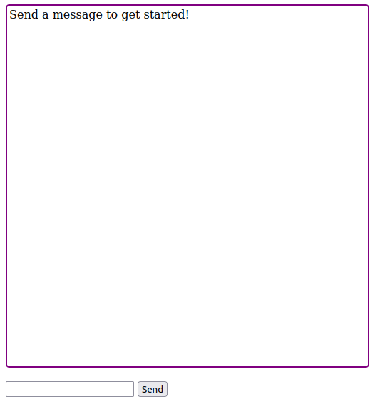
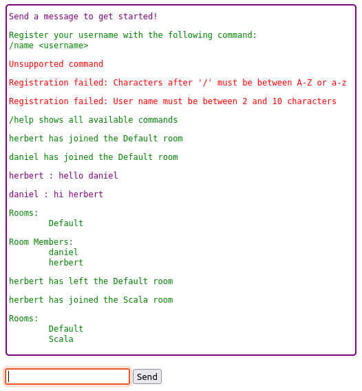
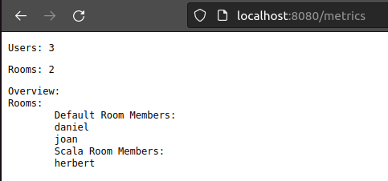

_by [Herbert Kateu](https://github.com/hkateu)_

## 1. Introduction

The WebSocket protocol enables persistent two-way communication between a client and a server where packets can be passed in both directions without the need for additional HTTP requests.

The specification for this protocol is outlined in [RFC 6455](https://datatracker.ietf.org/doc/html/rfc6455). WebSockets are used in applications such as Instant Messaging, Gaming, Simultaneous editing, and stock tickers to mention but a few.

In this article, we'll be creating a chat application using Http4s' implementation of WebSockets.

## 2. Setting Up

### 2.1. Updating `build.sbt`

To follow along add the following code to the `build.sbt`:

```scala
val Http4sVersion = "0.23.23"
val CirceVersion = "0.14.6"
val LogbackVersion = "1.4.11"
val CatsParseVersion = "0.3.10"

lazy val root = (project in file("."))
  .settings(
    organization := "rockthejvm",
    name := "websockets",
    version := "0.0.1-SNAPSHOT",
    scalaVersion := "3.3.0",
    libraryDependencies ++= Seq(
      "org.http4s" %% "http4s-ember-server" % Http4sVersion,
      "org.http4s" %% "http4s-circe" % Http4sVersion,
      "io.circe" %% "circe-generic" % CirceVersion,
      "org.http4s" %% "http4s-dsl" % Http4sVersion,
      "org.typelevel" %% "cats-parse" % CatsParseVersion,
      "ch.qos.logback" % "logback-classic" % LogbackVersion,
    )
  )

```

### 2.2. Serving the Chat Page
To demonstrate WebSockets, we'll be using Http4s for the WebSocket server and Javascript for the client implementation. Let's start by creating an HTML page that will be served to access the application.

First, create a `resources` folder under `main`, then under `resources` add a `chat.html` file with the following code:

```html
<!Doctype html>

<body>
    <div>
        <div id="output" style="height: 500px;
            width: 500px;
            text-align: left;
            overflow-y: scroll;
            border-radius: 5px;
            padding: 3px;
            border: solid purple 2px;">
        </div>
        <br />
        <form id="chatform">
            <input type="text" name="entry" id="entry" />
            <button type="submit">Send</button>
        </form>
    </div>
</body>

</html>
```

Here we create a `<div>` component with an `output` id where chat messages will be appended as well as a form with an `input` component and a submit button which will be used for sending messages to the WebSocket server.

Secondly, we'll implement the routes, create a `Routes.scala` file in the following path, `src/main/scala/rockthejvm/websockets/better/Routes.scala`, and add the following code:

```scala
package rockthejvm.websockets

import org.http4s.{HttpApp, HttpRoutes}
import org.http4s.dsl.Http4sDsl
import org.http4s.StaticFile
import fs2.io.file.Files
import cats.MonadThrow

class Routes[F[_]: Files: MonadThrow] extends Http4sDsl[F] {
  def service: HttpApp[F] = {
    HttpRoutes.of[F] { case request @ GET -> Root / "chat.html" =>
      StaticFile
        .fromPath(
          fs2.io.file.Path(getClass.getClassLoader.getResource("chat.html").getFile),
          Some(request)
        )
        .getOrElseF(NotFound())
    }
  }.orNotFound
}
```

Here we have a `Routes` class that extends `Http4sDsl[F]`, it contains a `service()` function when called returns an `HttpApp[F]`, additionally, we create our first route as `/chat.html`.

Within the `HttpRoutes.of[F]{}` method, we use the `StaticFile.fromPath()` method to which we pass an fs2 `Path` with the relative path to `chat.html` and a `Some(request)` as arguments then call `getOrElseF(NotFound())` that sends a 404 error code incase the file isn't found.

For this to work we need to add `Files` and `MonadThrow` as implicit arguments to `Routes`.

Next, we need an application server, create a `Server.scala` file in the following path, `src/main/scala/rockthejvm/websockets/Server.scala` and add the following code:

```scala
package rockthejvm.websockets

import org.http4s.ember.server.EmberServerBuilder
import com.comcast.ip4s.*
import cats.effect.kernel.Async
import cats.syntax.all.*
import fs2.io.net.Network
import fs2.io.file.Files

object Server {
  def server[F[_]: Async: Files: Network]: F[Unit] = {
    val host = host"0.0.0.0"
    val port = port"8080"
    EmberServerBuilder
      .default[F]
      .withHost(host)
      .withPort(port)
      .withHttpApp(new Routes().service)
      .build
      .useForever
      .void
  }
}
```

In the body of the `server()` function, we use the `EmberServerBuilder`, pass it a host value, port value and in addition, pass an instance of `Routes()` while subsequently calling the `service()` function to `withHttpApp()` then `build()` giving us a `Resource[F, Server]`.

The `useForever`, and `void` methods allocate the resource to a non-terminating action and discards everything returning F[Unit] respectively.

Lastly, we create a `Program.scala` file in the following path, `src/main/scala/rockthejvm/websockets/Program.scala`, and add the following code:

```scala
package rockthejvm.websockets

import cats.effect.IOApp
import cats.effect.IO
import Server.server

object Program extends IOApp.Simple {
  override def run: IO[Unit] = server[IO]
}
```

Above, we define the `run()` function that calls `server[IO]`. Finally, we can run our application by calling `sbt run` in the terminal. When we navigate to `localhost:8080/chat.html` in our browser we should get the following page:



## 3. WebSocket Introduction

In this section, we'll learn some important information about WebSockets needed to understand the code in the sections to come. WebSockets send and receive data in a data structure called a WebSocket Frame that can be divided into two types, namely, **Data frames** and **Control frames**.

### 3.1. Data Frames

Data Frames are used by WebSockets to carry application-layer and/or extension-layer data. There are two types of data frames, **Text** and **Binary** data frames each identified by an opcode where the most significant bit of the opcode is 0.

The **opcode** determines the interpretation of the data, where 0x1 and 0x2 are opcodes used for Text and Binary data frames respectively while 0x3 - 0x7 are reserved for non-control frames yet to be determined.

The Text data frame carries its payload as text data encoded in **UTF-8 format** while the Binary data frame carries its payload as arbitrary **binary data** whose interpretation is solely up to the application layer.

### 3.2. Control Frames

Control frames are used to communicate the **state** of the WebSocket and can be identified by opcodes where the most significant bit of the opcode is 1. These must have a payload length of 125 bytes or less and must not be fragmented.

There are three types of control frames, which include, **Close**, **Ping**, and **Pong** frames whose opcodes are 0x8, 0x9, and 0xA respectively.

A Close frame is sent when the WebSocket is closed or disconnected and may contain a body with the reason for closing.

The reason may or may not be human-readable but can be used for debugging purposes. Moreover, the application must not send any more data frames after sending a Close frame.

A Ping frame may contain application data and when received, the endpoint must respond with a Pong frame containing the same application data that was sent. Ping frames can serve as a means to verify that the endpoint is still responsive creating a heartbeat of the WebSocket.

## 4. WebSocket Implementation

To implement the WebSocket in Http4s, we'll need to add another route in `Routes.scala` as follows:

```scala
import org.http4s.server.websocket.WebSocketBuilder2
import fs2.Stream
import org.http4s.websocket.WebSocketFrame
import fs2.Pipe

class Routes[F[_]: Files: MonadThrow] extends Http4sDsl[F] {
  def service (
    wsb: WebSocketBuilder2[F]
  ): HttpApp[F] = {
    HttpRoutes.of[F] {
      ...
      case GET -> Root / "ws" =>
        val send: Stream[F, WebSocketFrame] = ???

        val receive: Pipe[F, WebSocketFrame, Unit] = ???

        wsb.build(send, receive)
    }
  }
}
```

Http4s provides `WebSocketBuilder2` for WebSocket creation, above, we pass this as an argument in the `service()` function. The `wsb.build()` method takes two arguments, `receive` of type `Pipe[F, WebSocketFrame, Unit]`, and send of type `Stream[F, WebSocketFrame]`.

The `receive` `Pipe`, receives a `Stream` of WebSocket frames from the client and transforms that to a `Stream` of `Unit` while `send` is a `Stream` of WebSocket Frames that's pushed to the client.

To act like a chat application we'll need to send the WebSocket frames that are received back to the client. For this to work, we use a `Queue` from Cats Effect:

```scala
...
import cats.effect.kernel.Concurrent
import cats.effect.std.Queue
import cats.syntax.all.*

class Routes[F[_]: Files: Concurrent] extends Http4sDsl[F] {
  def service (
    wsb: WebSocketBuilder2[F]
  ): HttpApp[F] = {
    HttpRoutes.of[F] {
      ...
      case GET -> Root / "ws" =>
        val wrappedQueue: F[Queue[F, WebSocketFrame]] = {
          Queue.unbounded[F, WebSocketFrame]
        }

        wrappedQueue.flatMap { actualQueue =>
          val send: Stream[F, WebSocketFrame] = {
            Stream.fromQueueUnterminated(actualQueue)
          }

          val receive: Pipe[F, WebSocketFrame, Unit] = {
            _.foreach(actualQueue.offer)
          }

          wsb.build(send, receive)
        }
    }
  }
}
```

Here we create `wrappedQueue` of type `F[Queue[F, WebSocketFrame]]` that's unbounded. Next, we `flatMap` and pass the `actualQueue` to the `send` and `receive` handles.

As a result, the receive handle can offer each `WebSocketFrame` received from the client to `Queue` while the `send` handle retrieves frames from the `Queue` by calling `Stream.fromQueueUnterminated(actualQueue)`.

We'll need to bind `F` to `Concurrent` for the `Queue` to work as well as import `cats.syntax.all.*` to `flatMap` on it.

Now that one of our routes is a WebSocket, we'll need to update `Server.scala` as follows:

```diff
  def server[F[_]: Async: Files: Network]: F[Unit] = {
    val host = host"0.0.0.0"
    val port = port"8080"
    EmberServerBuilder
      .default[F]
      .withHost(host)
      .withPort(port)
-     .withHttpApp(new Routes().service)
+     .withHttpWebSocketApp(wsb => new Routes().service(wsb))
      .build
      .useForever
      .void
  }
```

Here, we now use the `withHttpWebSocketApp()` function that takes as an argument a function of type `WebSocketBuilder2[F] => HttpApp[F]`.

To implement the WebSocket client, add the following code to `chat.html`:

```html
<!Doctype html>

<body>
    <div>
      ...
    </div>
    <script>
        const output = document.getElementById("output");
        const form = document.getElementById("chatform");

        output.append("Send a message to get started! \n");

        const socket = new WebSocket("ws://localhost:8080/ws");
    </script>
</body>

</html>
```
We start by accessing the chat `<div>` and `<form>` elements by `id`, then append an instruction for the user to get started.

Next, we initialize a WebSocket connection by passing the path to `new WebSocket()` which gives us access to functions that help manage WebSocket data and state:

```html
<script>
  ...
  socket.onmessage = function (event) {
      output.append(event.data + "\n");
  };
  socket.onclose = function (event) {
      output.append("[closed] server connection ended");
  };
  socket.onerror = function (error) {
      output.append("[Error] An error occured while processing data");
      console.log("[error]" + error.data + "\n");
  };
</script>
```

The `socket.onmessage` function handles data that the WebSocket receives, in the body we append the data to the output `<div>` component.

Close frames are handled by `socket.onclose`, here we append a message to output `<div>` showing the user that the connection ended.

The `socket.onerror` function handles errors encountered by the WebSocket. Similar to the above, we append an error message and subsequently `console.log` the actual error.

Lastly, we see how to send messages to the WebSocket using the `HTML` form defined earlier:

```html
<script>
  ...
  form.addEventListener('submit', (event) => {
      event.preventDefault();
      const message = document.getElementById('entry').value;
      socket.send(message);
      document.getElementById('entry').value = '';
  });
</script>
```

First, we add an event listener for submit events to our form element. Next, we call `event.preventDefault()` to prevent the form from submitting and refreshing the page.

Third, we access the value in the input field, by calling accessing `document.getElementById('entry').value` and then send this value using the `socket.send()` method.

Finally, we clear the value in the input element by changing its value to an empty string, this will happen after every form submission.

If we run our application at this point and try to send messages, they will be received from the server and appended to the output `<div>` proving that our WebSocket server and client are connected and working.

## 5. Chat Application
In this section, we build a chat application using http4s WebSocket implementation, the code in the following sections is inspired by [work](https://github.com/MartinSnyder/http4s-chatserver) done by [Martin Snyder](https://github.com/MartinSnyder).

### 5.1 Topic for Message Pipeline

If we open two pages in our browser and navigate to `chat.html`, when we try to send messages in one, they won't appear in the other, in other words, each user is chatting with his/herself.

To fix this issue we'll need a `Topic` which is a concurrency primitive from Fs2 used to implement a publish-subscribe pattern:

```scala
import fs2.concurrent.Topic

class Routes[F[_]: Files: Concurrent] extends Http4sDsl[F] {
  def service (
      wsb: WebSocketBuilder2[F],
      q: Queue[F, WebSocketFrame],
      t: Topic[F, WebSocketFrame]
  ): HttpApp[F] = {
    HttpRoutes.of[F] {
      ...
      case GET -> Root / "ws" =>
        val send: Stream[F, WebSocketFrame] = {
          t.subscribe(maxQueued = 1000)
        }

        val receive: Pipe[F, WebSocketFrame, Unit] = {
          _.foreach(q.offer)
        }

        wsb.build(send, receive)
    }
  }.orNotFound
}
```

Here we promote, the `Queue` and `Topic` to the top level by passing them as parameters to the `service()` function, the `Queue` is still needed to order messages as First In First Out (FIFO).

Furthermore, the `receive` handle remains unchanged but the `send` handle now subscribes to the `Topic` using the `subscribe()` method which takes `maxQueued` as a parameter. This is the maximum number of elements to enqueue to the subscription queue before blocking publishers.

We'll also need to update `Server.scala` and pass Topic and Queue as parameters:

```diff
+ import fs2.concurrent.Topic
+ import org.http4s.websocket.WebSocketFrame
+ import cats.effect.std.Queue

  object Server{
    def server[F[_]: Async: Files: Network](
      q: Queue[F, WebSocketFrame],
      t: Topic[F, WebSocketFrame]
    ): F[Unit] = {
      val host = host"0.0.0.0"
      val port = port"8080"
      EmberServerBuilder
        .default[F]
        .withHost(host)
        .withPort(port)
-       .withHttpWebSocketApp(wsb => new Routes().service(wsb))
+       .withHttpWebSocketApp(wsb => new Routes().service(wsb, q, t))
        .build
        .useForever
        .void
    }
  }
```

We do the same to `Program.scala` with some extra updates:

```scala
import fs2.concurrent.Topic
import org.http4s.websocket.WebSocketFrame
import cats.effect.std.Queue
import fs2.Stream

object Program extends IOApp.Simple{
  def program: IO[Unit] = {
    for {
      q <- Queue.unbounded[IO, WebSocketFrame]
      t <- Topic[IO, WebSocketFrame]
      s <- Stream(
        Stream.fromQueueUnterminated(q).through(t.publish),
        Stream.eval(server[IO](q, t))
      ).parJoinUnbounded.compile.drain
    } yield s
  }

  override def run: IO[Unit] = program
}
```
Here we define `program()` that returns `IO[Unit]` and create a for comprehension where we initialize `Queue` and `Topic`. Next, we pass the data from the Queue to the Topic by calling, `Stream.fromQueueUnterminated(q).through(t.publish)`.

Additionally, we join these two streams by calling `parJoinUnbounded`. Finally we `compile`, and `drain` the `Stream`, then call `program` in the body of the `run()` function.

If we run our program now, we should see the same messages received across all users who access the WebSocket.

### 5.2. The Websocket Heartbeat

When we run our WebSocket, we'll notice that after 60 seconds, we get a timeout exception on the server prompting the `socket.onclose()` function to run on the client.

The fix for this is to create a heartbeat for our application, we do this by sending Ping frames to the browser which should automatically respond with a Pong frame:

```scala
import scala.concurrent.duration.*

object Program extends IOApp.Simple{
  def program: IO[Unit] = {
    for {
      q <- Queue.unbounded[IO, WebSocketFrame]
      t <- Topic[IO, WebSocketFrame]
      s <- Stream(
        Stream.fromQueueUnterminated(q).through(t.publish),
        Stream
          .awakeEvery[IO](30.seconds)
          .map(_ => WebSocketFrame.Ping())
          .through(t.publish),
        Stream.eval(server[IO](q, t))
      ).parJoinUnbounded.compile.drain
    } yield s
  }

  override def run: IO[Unit] = program
}
```

Here we add a `Stream` that publishes a `WebSocketFrame.Ping()` to our `Topic` every 30 seconds. This is enough to keep our WebSocket connection alive.

## 6. Advanced Chat Application Features
In this section, we modify our application and add a lot of extra features such as user names, rooms, and metrics.

To properly follow along with the code example, check out the code on [GitHub](https://github.com/hkateu/WebsocketChatApp) since this section may contain large code snippets.

### 6.1. Users and Rooms

We want to add the ability to register and switch between rooms by use of commands. For this, we'll need to create `User` and `Room` case classes to hold the user and room names respectively.

Create `Util.scala` in the following path, `src/main/scala/rockthejvm/websockets/Util.scala` and add the following code:

```scala
package rockthejvm.websockets

import cats.data.Validated
import cats.syntax.all.*

def validateItem[F](
    value: String,
    userORRoom: F,
    name: String
): Validated[String, F] = {
  Validated.cond(
    (value.length >= 2 && value.length <= 10),
    userORRoom,
    s"$name must be between 2 and 10 characters"
  )
}

case class User(name: String)
object User {
  def apply(name: String): Validated[String, User] = {
    validateItem(name, new User(name), "User name")
  }
}

case class Room(room: String)
object Room{
  def apply(room: String): Validated[String, Room] = {
    validateItem(room, new Room(room), "Room")
  }
}

case class ChatState(
    userRooms: Map[User, Room],
    roomMembers: Map[Room, Set[User]]
)
object ChatState {
  def apply(userRooms: Map[User, Room], roomMembers: Map[Room, Set[User]]) = {
    new ChatState(userRooms, roomMembers)
  }
}
```

Here we create a `User` and `Room` case classes both of which take a value of type `String` and within each companion object, we call `validateItem()` in the `apply()` method to validate their inputs.

The `validateItem()` function takes as parameters a `String` input from the `apply()` function, an instance of the case class, and a `name` of type `String` that becomes part of an error message.

In the body, we use `Validated.cond()` function to produce a `User` or `Room` if the value is between 2 and 10 characters since we don't want very short or very long user/room names.

Lastly, we have `ChatState`, a case class that holds all the rooms and users in the chat application at a particular moment.

It takes two parameters, `userRooms` of type `Map[User, Room]` that shows which room each user is in, and `roomMembers` of type `Map[Room, Set[User]]` that shows all the users in each room.

### 6.2. The Output Message
Next, we create an `OutputMessage` ADT to represent the messages sent to the WebSocket client. Create `OutputMessage.scala` and add the following code:

```scala
package rockthejvm.websockets

sealed trait OutputMessage

case class Register(
    user: Option[User],
    msg: String = """|Register your username with the following command:
                     |/name <username>""".stripMargin
) extends OutputMessage

case class ParsingError(user: Option[User], msg: String) extends OutputMessage
```

Here we create our first two `OutputMessage` messages, `Register` and `ParsingError`, that both take a `user` of type `Option[User]` and a `msg` of type `String` which instructs the user how to register or passes an error message in case registration failed respectively:

```scala
sealed trait OutputMessage
...
case class SuccessfulRegistration(
    user: User,
    msg: String = ""
) extends OutputMessage
object SuccessfulRegistration {
  def apply(user: User) = {
    user match {
      case User(name) =>
        new SuccessfulRegistration(user, s"$name entered the chat")
    }
  }
}
```

For cases of successful registration, we use a `SuccessfulRegistration` message that takes a `User` and `String`. In addition, we create an `apply()` method to construct a custom success message.

We still have extra scenarios to cater for:

```scala
...
case class UnsupportedCommand(
    user: Option[User],
    msg: String = "Unsupported command"
) extends OutputMessage

case object KeepAlive extends OutputMessage

case object DiscardMessage extends OutputMessage

case class SendToUser(user: User, msg: String) extends OutputMessage {
  def forUser(targetUser: User): Boolean = targetUser == user
}

case class ChatMsg(from: User, to: User, msg: String) extends OutputMessage {
  def forUser(targetUser: User): Boolean = targetUser == to
}
```

From the top, the `UnsupportedCommand` will be used when unsupported commands are received, `KeepAlive` will represent `WebSocketFrame.Ping()`, `DiscardMessage` will be used to filter unwanted message before we send to all users, `SendToUser` will represent messages meant for a particular user and lastly, `ChatMsg` will represent regular chat messages sent by registered users.

### 6.3. Protocols
Next, we'll need to process commands sent through the WebSocket, in this section, we'll define a set of protocols needed to process the incoming commands. Create a file called `Protocol.scala`, and add the following code:

```scala
package rockthejvm.websockets

import cats.Monad
import cats.data.Validated.Valid
import cats.data.Validated.Invalid
import cats.syntax.all.*
import cats.effect.kernel.Ref

trait Protocol[F[_]] {
  def register(name: String): F[OutputMessage]
  def isUsernameInUse(name: String): F[Boolean]
  def enterRoom(user: User, room: Room): F[List[OutputMessage]]
  def chat(user: User, text: String): F[List[OutputMessage]]
  def help(user: User): F[OutputMessage]
  def listRooms(user: User): F[List[OutputMessage]]
  def listMembers(user: User): F[List[OutputMessage]]
  def disconnect(userRef: Ref[F, Option[User]]): F[List[OutputMessage]]
}

object Protocol {
  def make[F[_]: Monad](chatState: Ref[F, ChatState]): Protocol[F] = {
    new Protocol[F] {
      override def register(name: String): F[OutputMessage] = {
        User(name) match {
          case Valid(u) =>
            SuccessfulRegistration(u).pure[F]
          case Invalid(e) =>
            ParsingError(None, e.toString).pure[F]
        }
      }
      override def isUsernameInUse(name: String): F[Boolean] = ???
      override def enterRoom(user: User, room: Room): F[List[OutputMessage]] = ???
      override def chat(user: User, text: String): F[List[OutputMessage]] = ???
      override def help(user: User): F[OutputMessage] = ???
      override def listRooms(user: User): F[List[OutputMessage]] = ???
      override def listMembers(user: User): F[List[OutputMessage]] = ???
      override def disconnect(userRef: Ref[F, Option[User]]): F[List[OutputMessage]] = ???
    }
  }
}
```

Here we create a `Protocol` trait with multiple methods, key among which is `register()` that takes a `String` and returns an `F[OutputMessage]`, in the companion object we define a `make()` function that takes a `Ref[F, ChatState]` as a parameter and returns a `Protocol[F]`.

In the body of the `register()` function we pass `name` to `User` and pattern match against it. If the result is of type `Valid`, we return `SuccessfulRegistration` otherwise we return `ParsingError`.

In both cases, we lift the value into an `F` using the `pure[F]` method which works because we bound `F` to `Monad` in the function definition of `make()`:

```scala
object Protocol {
  def make[F[_]: Monad](chatState: Ref[F, ChatState]): Protocol[F] = {
    new Protocol[F] {
      ...
      override def isUsernameInUse(name: String): F[Boolean] = {
        chatState.get.map { cs =>
          cs.userRooms.keySet.exists(_.name == name)
        }
      }
      ...
    }
  }
}
```
The `isUsernameInUse()` function checks if the user name provided is already in use. Here we access `chatState` and call `cs.userRooms.keySet` to get a `Set` of all users in the application, we then call `exists(_.name == name)` to check if the user exists or not returning an `F[Boolean]`:

```scala
object Protocol {
  def make[F[_]: Monad](chatState: Ref[F, ChatState]): Protocol[F] = {
    new Protocol[F] {
      ...
      override def help(user: User): F[OutputMessage] = {
        val text = """Commands:
            | /help             - Show this text
            | /room             - Change to default/entry room
            | /room <room name> - Change to specified room
            | /rooms            - List all rooms
            | /members          - List members in current room
        """.stripMargin
        SendToUser(user, text).pure[F]
      }
      ...
    }
  }
}
```
The `help()` function takes a `User` and returns a `SendToUser(user, text).pure[F]` of type `F[OutputMessage]`, here the user receives a `String` showing all the available commands in our application and what they do:

```scala
object Protocol {
  def make[F[_]: Monad](chatState: Ref[F, ChatState]): Protocol[F] = {
    new Protocol[F] {
      ...
      override def listRooms(user: User): F[List[OutputMessage]] = {
        chatState.get.map { cs =>
          val roomList =
            cs.roomMembers.keys
              .map(_.room)
              .toList
              .sorted
              .mkString("Rooms:\n\t", "\n\t", "")
          List(SendToUser(user, roomList))
        }
      }
      ...
    }
  }
}
```
The `listRooms()` function lists all the rooms in the application. Here we access `cs` the `ChatState` and call `cs.roomMembers.keys.map(_.room)` to list all the rooms as strings which are sorted and formatted and finally passed to `List(SendToUser(user, roomList))`:

```scala
object Protocol {
  def make[F[_]: Monad](chatState: Ref[F, ChatState]): Protocol[F] = {
    new Protocol[F] {
      ...
      override def listMembers(user: User): F[List[OutputMessage]] = {
        chatState.get.map { cs =>
          val memberList =
            cs.userRooms.get(user) match {
              case Some(room) =>
                cs.roomMembers
                  .getOrElse(room, Set())
                  .map(_.name)
                  .toList
                  .sorted
                  .mkString("Room Members:\n\t", "\n\t", "")
              case None => "You are not currently in a room"
            }
          List(SendToUser(user, memberList))
        }
      }
      ...
    }
  }
}
```
The `listMembers()` function lists all the members in the room where the user is currently located. Here we access `cs`, the `ChatState` then call `cs.userRooms.get(user)` that returns an `Option[Room]` that we pattern match on.

In case of a `Some(room)` which shows the user belongs to a certain room, we call `cs.roomMembers.getOrElse(room, Set())` to get the list of members in the room, sorting and formatting the result as a `String`.

In case we receive a `None`, we inform the user that he or she is not currently in a room, and the resulting string, `membersList` is finally passed to `List(SendToUser(user, memberList))` along with the `user`:

```scala
import cats.Applicative

object Protocol {
  def make[F[_]: Monad](chatState: Ref[F, ChatState]): Protocol[F] = {
    new Protocol[F] {
      ...
      override def chat(user: User, text: String): F[List[OutputMessage]] = {
        for {
          cs <- chatState.get
          output <- cs.userRooms.get(user) match {
            case Some(room) =>
              broadcastMessage(cs, room, ChatMsg(user, user, text))
            case None =>
              List(SendToUser(user, "You are not currently in a room")).pure[F]
          }
        } yield output
      }
      ...
    }
  }

  private def broadcastMessage[F[_]: Applicative](
      cs: ChatState,
      room: Room,
      om: OutputMessage
  ): F[List[OutputMessage]] = {
    cs.roomMembers
      .getOrElse(room, Set.empty[User])
      .map { u =>
        om match {
          case SendToUser(user, msg)  => SendToUser(u, msg)
          case ChatMsg(from, to, msg) => ChatMsg(from, u, msg)
          case _                      => DiscardMessage
        }
      }
      .toList
      .pure[F]
  }
}
```
The `chat()` function is used to process normal chat messages sent by the user, it takes a `User` and `text` of type `String` as parameters.

Here we use a for comprehension to check which room the user belongs to, in case we receive a `None` we inform the user that he or she doesn't belong to any room, otherwise, we call `broadcastMessage()` to send each `ChatMsg` to all members of that room:

The `broadcastMessage()` function takes a `ChatState`, `Room`, and `OutputMessages` as parameters. Then we call `cs.roomMembers.getOrElse(room, Set.empty[User])` to get all the users in the room that the user currently is in.

Notice in `chat()` we passed `ChatMsg(user, user, text)` with the same `user` to the `from` and `to` parameters, when we `map` and pattern match on `OutputMessage` when we receive a `ChatMsg`, we replace all the `to` values with members in the `room`.

We do the same thing for `SendToUser` messages and finally return `DiscardMessage` for the rest of the messages:

```scala
object Protocol {
  def make[F[_]: Monad](chatState: Ref[F, ChatState]): Protocol[F] = {
    new Protocol[F] {
      ...
      override def enterRoom(user: User, room: Room): F[List[OutputMessage]] = {
        chatState.get.flatMap { cs =>
          cs.userRooms.get(user) match {
            case Some(r) =>
              if (r == room) {
                List(
                  SendToUser(user, s"You are already in the ${room.room} room")
                ).pure[F]
              } else {
                val leaveMessages = removeFromCurrentRoom(chatState, user)
                val enterMessages = addToRoom(chatState, user, room)
                for {
                  leave <- leaveMessages
                  enter <- enterMessages
                } yield leave ++ enter
              }
            case None =>
              addToRoom(chatState, user, room)
          }
        }
      }
      ...
    }
  }
}
```
The `enterRoom()` function adds a user to a room but also removes the user from their current room if they belong to one. It takes a `User` and `Room` as parameters and returns an `F[List[OutputMessage]]`.

We start by accessing `ChatState` and pattern match on `cs.userRooms.get(user)` to check if the user belongs to a room, if he or she doesn't, we call the `addToRoom()` function that adds a user to a specific room.

Otherwise, we first check if the room the user wants to join is the same as the room the user currently is in, if this is true, we inform the user he or she is already in the room.

If this is false we call `removeFromCurrentRoom()` then `addToRoom()` to remove the user from the current room and subsequently add the user to the new room respectively:

```scala
object Protocol {
  ...
  private def addToRoom[F[_]: Monad](
      stateRef: Ref[F, ChatState],
      user: User,
      room: Room
  ): F[List[OutputMessage]] = {
    stateRef
      .updateAndGet { cs =>
        val updatedMemberList = cs.roomMembers.getOrElse(room, Set()) + user
        ChatState(
          cs.userRooms + (user -> room),
          cs.roomMembers + (room -> updatedMemberList)
        )
      }
      .flatMap {
        broadcastMessage(
          _,
          room,
          SendToUser(user, s"${user.name} has joined the ${room.room} room")
        )
      }
  }
}
```
`addToRoom()` is a private function that takes a `Ref[F, ChatState]`, `User`, and `Room` as parameters. Here we update the `ChatState` by calling `stateRef.updateAndGet()`.

First, we get the current members in the room then add the new member by calling `cs.roomMembers.getOrElse(room, Set()) + user` to get an updated member list, then add this list to `ChatState` along with the user's current room with the following code:

```scala
ChatState(
  cs.userRooms + (user -> room),
  cs.roomMembers + (room -> updatedMemberList)
)
```
We then `flatMap` and call `broadcastMessage()`, to inform each room member that someone has joined the room:

```scala
object Protocol {
  ...
  private def removeFromCurrentRoom[F[_]: Monad](
      stateRef: Ref[F, ChatState],
      user: User
  ): F[List[OutputMessage]] = {
    stateRef.get.flatMap { cs =>
      cs.userRooms.get(user) match {
        case Some(room) =>
          val updateMembers = cs.roomMembers.getOrElse(room, Set()) - user
          stateRef
            .update { ccs =>
              ChatState(
                ccs.userRooms - user,
                if (updateMembers.isEmpty) {
                  ccs.roomMembers - room
                } else {
                  ccs.roomMembers + (room -> updateMembers)
                }
              )
            }
            .flatMap(_ =>
              broadcastMessage(
                cs,
                room,
                SendToUser(user, s"${user.name} has left the ${room.room} room")
              )
            )
        case None =>
          List.empty[OutputMessage].pure[F]
      }
    }
  }
}
```
The `removeFromCurrentRoom()` function takes a  `Ref[F, ChatState]` and `User` as parameters, here we first access `cs` the `ChatState` to check if the user belongs to a room by calling `cs.userRooms.get(user)`.

In case the user doesn't belong to a room, we return `List.empty[OutputMessage].pure[F]`, an empty list, however, if he or she is already in a room, we first update the members by getting all room members and removing the user by calling `cs.roomMembers.getOrElse(room, Set()) - user` then proceed to update the `stateRef`:
```scala
stateRef
  .update(ccs =>
    ChatState(
      ccs.userRooms - user,
      if (updateMembers.isEmpty) {
        ccs.roomMembers - room
      } else {
        ccs.roomMembers + (room -> updateMembers)
      }
    )
  )
```

First, we call `ccs.userRooms - user` to remove the user from `userRooms`, then we check if `updateMembers` is empty, if this is true we call `ccs.roomMembers - room` to remove the room from `roomMembers` since we don't want idle rooms with no users. Otherwise, we call `ccs.roomMembers + (room -> updateMembers)` to update the room members:

```scala
object Protocol {
  def make[F[_]: Monad](chatState: Ref[F, ChatState]): Protocol[F] = {
    new Protocol[F] {
      ...
      override def disconnect(
          userRef: Ref[F, Option[User]]
      ): F[List[OutputMessage]] = {
        userRef.get.flatMap {
          case Some(user) => removeFromCurrentRoom(chatState, user)
          case None       => List.empty[OutputMessage].pure[F]
        }
      }
      ...
    }
  }
}
```
Finally the `disconnect()` function removes the user from the current room in case the WebSocket connection is broken or cut to reflect an up-to-date `ChatState`.

### 6.4. Parsing String Inputs

In this section, we'll learn how to parse the input messages we receive from the WebSocket. Create `InputMessage.scala` in `src/main/scala/rockthejvm/websockets/InputMessage.scala` and add the follwing code:

```scala
package rockthejvm.websockets

import cats.data.Validated
import cats.effect.kernel.Ref
import cats.Monad
import cats.syntax.all.*

trait InputMessage[F[_]] {
  def defaultRoom: Validated[String, Room]
  def parse(
      userRef: Ref[F, Option[User]],
      text: String
  ): F[List[OutputMessage]]
}

object InputMessage {
  def make[F[_]: Monad](
      protocol: Protocol[F]
  ): InputMessage[F] = {
    new InputMessage[F] {
      override def parse(
          userRef: Ref[F, Option[User]],
          text: String
      ): F[List[OutputMessage]] = ???
    }
  }
}
```

We start by creating an `InputMessage` trait with `defaultRoom`, a function that returns `Validated[String, Room]` and a `parse()` function that takes a `Ref[F, Option[User]]` and a `String` and returns an `F[List[OutputMessage]]`.

Similar to `Protocol` we create a `make()` function where we provide the implementations for `InputMessage`. We make sure to bind `F` to `Monad` for the following implementation of `parse()`.

```scala
...
override def parse(
    userRef: Ref[F, Option[User]],
    text: String
): F[List[OutputMessage]] = {
  text.trim match {
    case "" => DiscardMessage.pure[F]
    case txt =>
      userRef.get.flatMap { u =>
        u.fold {// unregistred
        ???
          } { //registred
        ???
           }
      }
  }
}
...
```

Here, we call `text.trim()` to remove any surrounding white spaces in our `text` and then pattern match on the result, in case we get an empty string, we discard the message by returning `DiscardMessage.pure[F]`.

Otherwise we, access `Option[User]` from `userRef` and fold on it to handle messages from registered and unregistered users. We'll get back to this soon, first, we look at how we'll use the `cats-parse` library to parse the text commands:

```scala
...
import cats.parse.Parser
import cats.parse.Parser.char
import cats.parse.Rfc5234.{alpha, sp, wsp}

...
case class TextCommand(left: String, right: Option[String])

object InputMessage {
  ...
  private def commandParser: Parser[TextCommand] = {
    val leftSide = (char('/').string ~ alpha.rep.string).string
    val rightSide: Parser[(Unit, String)] = sp ~ alpha.rep.string
    ((leftSide ~ rightSide.?) <* wsp.rep.?).map((left, right) =>
      TextCommand(left, right.map((_, s) => s))
    )
  }

  private def parseToTextCommand(
      value: String
  ): Either[Parser.Error, TextCommand] = {
    commandParser.parseAll(value)
  }
}
```

Here, we create a case class `TextCommand` that will hold text commands, it takes, two parameters, `left` of type `String` and `right` value of type `Option[String]`. We use an `Option` because we'll be implementing more commands that may not have the right side present.

Next, we implement `commandParser` that returns a `Paser[TextCommand]`, the `Parser` type comes from cats-parse. Furthermore, `Paser[TextCommand]` means that whatever is parsed through this parser should return a `TextCommand` on success.

The beauty of cats-parse is that we can combine different parsers to create a single parser using the different combinator functions that work as follows:

- `~` combines two items to produce a tuple with both types, (leftType, rightType)
- `<*` this ignores the value on the right and returns the left value only (leftType)
- `*>` this ignores the value on the left and returns the right value only (rightType)

In the `commandParser` implementation we create `leftSide` which is of type `Parser[String]`, since all commands should start with a `/`, we represent this with `char('/').string` and combine it with `alpha.rep.string` on the right using `~`.

`alpha` on its own is of type `Parser[Char]` and only parses characters containing the alphabet in either lower or uppercase, calling rep transforms the parser to `Parser[NonEmptyList[Char]]`, meaning that we are now parsing one or more characters and finally calling `string` converts means that we can now parse a `String`.

The statement `val leftSide = (char('/').string ~ alpha.rep.string).string` means that `leftSide` parses a string that starts with a `/` followed by characters that contain a-z or A-Z.

The `rightSide` parser is defined by `sp ~ alpha.rep.string` parses strings that start with a space followed by a `string` (a-z or A-Z) and returns a `Parser[(Unit, String)]` since `sp` is of `Parser[Unit]`.

The last section of our parser is defined by:

```scala
((leftSide ~ rightSide.?) <* wsp.rep.?).map((left, right) =>
  TextCommand(left, right.map((_, s) => s))
)
```
Can be broken down as follows:
`(leftSide ~ rightSide.?)` means we combine the two parses using the `~` meaning that we keep results from both sides. However the `?` on `rightSide.?` means that rightSide may be present or not. In other words, the same parser can also handle commands with only the `leftSide` for example a help command issued as `/help`, this doesn't require an extra parameter.

`<* wsp.rep.?` means if there's white space that follows our command, we ignore it. Finally, we map the left and right values to `TextCommand`, on the right side we ignore the `Unit` value and only map the `String`.

The `parseToTextCommand()` takes our command string and passes it to `commandParser.parseAll()` returning an `Either[Parser.Error, TextCommand]`, where `Parser.Error` is returned in case of a parsing failure.

Next, we'll process text values for registered and unregistered users starting with the latter:

```scala
object InputMessage {
  ...
  private def processText4UnReg[F[_]: Monad](
      text: String,
      protocol: Protocol[F],
      userRef: Ref[F, Option[User]],
      room: Room
  ): F[List[OutputMessage]] = {
    if (text.charAt(0) == '/') {
      parseToTextCommand(text).fold(
        _ =>
          List(
            ParsingError(
              None,
              "Characters after '/' must be between A-Z or a-z"
            )
          ).pure[F],
        v => ???
      )
    } else {
      List(Register(None)).pure[F]
    }
  }
}
```

The `processText4UnReg()` function processes texts for unregistered users, it takes a `text` (string command), `protocol`, `userRef`, and `room` of type `String`, `Protocol[F]`,`Ref[F, Option[User]]` and `Room` respectively and returns an `F[List[OutputMessage]]`.

First, we check if `text` is a command or normal text by calling `text.charAt(0)` to check if it starts with `/`. In case it's a normal text we return `List(Register(None)).pure[F]` otherwise we call `parseToTextCommand(text)` and fold on it.

If we fail to parse the text command, we return a `List` of `ParsingError` that provides an error for the user, otherwise, we pattern match on the resulting `TextCommand` as follows:

```scala
parseToTextCommand(text).fold(
  _ =>
    ...,
  v =>
    v match {
      case TextCommand("/name", Some(n)) =>
        protocol.isUsernameInUse(n).flatMap { b =>
          if (b) {
            List(ParsingError(None, "User name already in use")).pure[F]
          } else {
            ???
          }
        }
      case _ =>
        List(UnsupportedCommand(None)).pure[F]
    }
)
```

In the case of `TextCommand("/name", Some(n))`, we check if the user name is already used by calling `protocol.isUsernameInUse(n)` and if the resulting boolean is true, we return a `ParsingError` informing the user that the user name is in use. If the user passed any other command we return `List(UnsupportedCommand(None)).pure[F]`:

```scala
if(b) {
  ...
} else {
  protocol.register(n).flatMap {
    case SuccessfulRegistration(u, _) =>
      for {
        _ <- userRef.update(_ => Some(u))
        om <- protocol.enterRoom(u, room)
      } yield {
        List(
          SendToUser(
            u,
            "/help shows all available commands"
          )
        ) ++ om
      }
    case parsingerror @ ParsingError(_, _) =>
      List(parsingerror).pure[F]
    case _ => List.empty[OutputMessage].pure[F]
  }
}
```

If the user name isn't in use, we call `protocol.register(n)` passing it the user name, this returns `F[OutputMessage]` that we `flatMap` and pattern match on, in case of `SuccessfulRegistration`, we update `userRef` with the new user name, then `flatMap` and call `protocol.enterRoom()` which adds the new user to a room.

Lastly, we tell the user about the `/help` command, adding this output message to that from the `protocol.enterRoom(u, room)` operation. Finally if registration results in a `ParsingError` we return `List(parsingerror).pure[F]` and `List.empty[OutputMessage].pure[F]` in case of anything else.

Here's the full code for `processText4UnReg()`:
```scala
  private def processText4UnReg[F[_]: Monad](
      text: String,
      protocol: Protocol[F],
      userRef: Ref[F, Option[User]],
      room: Room
  ): F[List[OutputMessage]] = {
    if (text.charAt(0) == '/') {
      parseToTextCommand(text).fold(
        _ =>
          List(
            ParsingError(
              None,
              "Characters after '/' must be between A-Z or a-z"
            )
          ).pure[F],
        v =>
          v match {
            case TextCommand("/name", Some(n)) =>
              protocol.isUsernameInUse(n).flatMap { b =>
                if (b) {
                  List(ParsingError(None, "User name already in use")).pure[F]
                } else {
                  protocol.register(n).flatMap {
                    case SuccessfulRegistration(u, _) =>
                      for {
                        _ <- userRef.update(_ => Some(u))
                        om <- protocol.enterRoom(u, room)
                      } yield {
                        List(
                          SendToUser(
                            u,
                            "/help shows all available commands"
                          )
                        ) ++ om
                      }
                    case parsingerror @ ParsingError(_, _) =>
                      List(parsingerror).pure[F]
                    case _ => List.empty[OutputMessage].pure[F]
                  }
                }
              }
            case _ =>
              List(UnsupportedCommand(None)).pure[F]
          }
      )
    } else {
      List(Register(None)).pure[F]
    }
  }
```
Let's now look at `procesText4Reg()`, a function that processes texts for registered users:

```scala
...
import cats.Applicative
import cats.data.Validated.Valid
import cats.data.Validated.Invalid

object InputMessage {
  ...
  private def procesText4Reg[F[_]: Applicative](
      user: User,
      text: String,
      protocol: Protocol[F]
  ): F[List[OutputMessage]] = {
    if (text.charAt(0) == '/') {
      parseToTextCommand(text).fold(
        _ =>
          List(
            ParsingError(
              None,
              "Characters after '/' must be between A-Z or a-z"
            )
          ).pure[F],
        v =>
          v match {
            case TextCommand("/name", Some(n)) =>
              List(ParsingError(Some(user), "You can't register again")).pure[F]
            case TextCommand("/room", Some(r)) =>
              Room(r) match {
                case Valid(room) =>
                  protocol.enterRoom(user, room)
                case Invalid(e) =>
                  List(ParsingError(Some(user), e)).pure[F]
              }
            case TextCommand("/help", None) =>
              protocol.help(user).map(List(_))
            case TextCommand("/rooms", None) =>
              protocol.listRooms(user)
            case TextCommand("/members", None) =>
              protocol.listMembers(user)
            case _ => List(UnsupportedCommand(Some(user))).pure[F]
          }
      )
    } else {
      protocol.chat(user, text)
    }
  }
}
```

Here we define `procesText4Reg()` that takes a `user`, `text`, and `protocol` of type `User`, `String`, and `Protocol[F]` respectively as parameters. The implementation is similar to `processText4UnReg()`, except that we pattern match on a few more commands.

Depending on the command passed we call the respective method from `Protocol[F]`. If we match with a `TextCommand("/name", Some(n))`, we inform the user that he or she can't register again.

In the case of `TextCommand("/room", Some(r))`, which is the command to switch rooms, we first pass the room name to the `Room` `apply()` function, if it's valid we call `protocol.enterRoom(user, room)` otherwise we call `List(ParsingError(Some(user), e)).pure[F]` passing the error as the message.

In the case of `TextCommand("/help", None)`, `TextCommand("/rooms", None)` and `TextCommand("/members", None)`, we call `protocol.help(user).map(List(_))`, `protocol.listRooms(user)` and `protocol.listMembers(user)` respectively and if any other command is passed we respond with `List(UnsupportedCommand(Some(user))).pure[F]`.

Lastly, if we receive a regular message, we call `protocol.chat(user, text)`.

We can now update our `make()` function as follows using the `processText4UnReg()` and `procesText4Reg()` functions:

```scala
object InputMessage {
  def make[F[_]: Monad](
      protocol: Protocol[F]
  ): InputMessage[F] = {
    new InputMessage[F] {
      override def defaultRoom: Validated[String, Room] = {
        Room("Default")
      }

      override def parse(
          userRef: Ref[F, Option[User]],
          text: String
      ): F[List[OutputMessage]] = {
        text.trim match {
          case "" => List(DiscardMessage).pure[F]
          case txt =>
            userRef.get.flatMap { u =>
              u.fold {
                defaultRoom match {
                  case Valid(r) =>
                    processText4UnReg(txt, protocol, userRef, r)
                  case Invalid(e) => List(ParsingError(u, e)).pure[F]
                }
              } { user => procesText4Reg(user, txt, protocol) }
            }
        }
      }
    }
  }
  ...
}
```
In the case of unregistered users, we call `processText4UnReg(txt, protocol, userRef, r)`, passing `Default` as the entry room for new users, otherwise, we call `procesText4Reg(user, txt, protocol)` for registered users.

### 6.5. Application Routes
In this section, we define all the necessary routes for the chat application. We'll now modify `Routes.scala`:

```scala
...
import cats.effect.kernel.Ref
import cats.effect.Temporal

class Routes[F[_]: Files: Temporal] extends Http4sDsl[F] {
  def service (
      wsb: WebSocketBuilder2[F],
      q: Queue[F, OutputMessage],
      t: Topic[F, OutputMessage],
      im: InputMessage[F],
      protocol: Protocol[F]
  ): HttpApp[F] = {
    HttpRoutes.of[F] {
      ...
      case GET -> Root / "ws" =>
        for {
          uRef <- Ref.of[F, Option[User]](None)
          uQueue <- Queue.unbounded[F, OutputMessage]
          ws <- wsb.build(
            send(t,uQueue,uRef),
            receive(protocol, im, uRef, q, uQueue)
          )
        } yield ws
    }
  }
}
```

Here, we not only update the `service()` parameters, `Queue` and `Topic` to `OutputMessage` instead of `WebSocketFrame` but also add `InputMessage[F]`, and `Protocol[F]` as parameters.

At the `/ws` route level, we now use a for comprehension where we have `userRef` a `Ref[F, Option[User]]` that we initialize to `None` for unregistered users when they first access the WebSocket and `uQueue`, a second `Queue[F, OutputMessage]`, to handle messages for new users until they are registered.

This is necessary since every new user is identified by a `None`, it would be hard to filter messages for unregistered users, so we give each of them a private queue until they get registered.

Finally, we call `wsb.build()` with custom `send()` and `recieve()` functions. We'll see how these are implemented starting with the latter:

```scala
...
import scala.concurrent.duration.*

class Routes[F[_]: Files: Temporal] extends Http4sDsl[F] {
  ...
  private def handleWebSocketStream (
      wsf: Stream[F, WebSocketFrame],
      im: InputMessage[F],
      protocol: Protocol[F],
      uRef: Ref[F, Option[User]]
  ): Stream[F, OutputMessage] = {
    for {
      sf <- wsf
      om <- Stream.evalSeq(
        sf match {
          case WebSocketFrame.Text(text, _) =>
            im.parse(uRef, text)
          case WebSocketFrame.Close(_) =>
            protocol.disconnect(uRef)
        }
      )
    } yield om
  }

  private def receive (
      protocol: Protocol[F],
      im: InputMessage[F],
      uRef: Ref[F, Option[User]],
      q: Queue[F, OutputMessage],
      uQueue: Queue[F, OutputMessage]
  ): Pipe[F, WebSocketFrame, Unit] = { wsf =>
    handleWebSocketStream(wsf, im, protocol, uRef)
      .evalMap { m =>
        uRef.get.flatMap {
          case Some(_) =>
            q.offer(m)
          case None =>
            uQueue.offer(m)
        }
      }
      .concurrently {
        Stream
          .awakeEvery(30.seconds)
          .map(_ => KeepAlive)
          .foreach(uQueue.offer)
      }
  }
}
```

The new `receive()` function takes a `Protocol[F]`, `InputMessage[F]`, `Ref[F, Option[User]]` and two `Queue`'s of type `Queue[F, OutputMessage]`, one that feeds into our `Topic` and one that processes messages for unregistered users.

We start by calling `handleWebSocketStream()`, a function that takes a `Stream[F, WebSocketFrame]`, `InputMessage[F]`, `Protocol[F]`, and `Ref[F, Option[User]]` and returns a `Stream[F, OutputMessage]`.

It uses a for comprehension where we access `sf`, a `WebSocketFrame` that we pattern match on, for cases of type `WebSocketFrame.Text(text, _)`, we pass the text value to `im.parse()` along with a `Ref[F, Option[User]]` which returns `F[List[OutputMessage]]`.

While for cases of type `WebSocketFrame.Close(_)`, we call `protocol.disconnect(uRef)`. Lastly, we wrap the pattern match results in `Stream.evalSeq()` to produce a `Stream[F, OutputMessage]`.

In the `receive()` function, we call `evalMap` on `handleWebSocketStream()` and offer the `OutputMessage` to either `q` or `uQueue` for cases of registered and unregistered users respectively.

This all results in a `Stream[F, Unit]` that we run concurrently with another stream that offers a `KeepAlive` message to `uQueue` acting as a heartbeat for unregistered users, we also make sure to bind `F` to `Temporal` since we are dealing with duration:

```scala
import io.circe.generic.auto.*
import io.circe.syntax.*

class Routes[F[_]: Files: Temporal] extends Http4sDsl[F] {
  ...
  private def filterMsg (
      msg: OutputMessage,
      userRef: Ref[F, Option[User]]
  ): F[Boolean] = {
    msg match {
      case DiscardMessage => false.pure[F]
      case sendtouser @ SendToUser(_, _) =>
        userRef.get.map { _.fold(false)(u => sendtouser.forUser(u)) }
      case chatmsg @ ChatMsg(_, _, _) =>
        userRef.get.map { _.fold(false)(u => chatmsg.forUser(u)) }
      case _ => true.pure[F]
    }
  }

  private def processMsg(msg: OutputMessage): WebSocketFrame = {
    msg match {
      case KeepAlive => WebSocketFrame.Ping()
      case msg @ _   => WebSocketFrame.Text(msg.asJson.noSpaces)
    }
  }

  private def send (
      t: Topic[F, OutputMessage],
      uQueue: Queue[F, OutputMessage],
      uRef: Ref[F, Option[User]]
  ): Stream[F, WebSocketFrame] = {
    def uStream =
      Stream
        .fromQueueUnterminated(uQueue)
        .filter {
          case DiscardMessage => false
          case _              => true
        }
        .map(processMsg)

    def mainStream =
      t.subscribe(maxQueued = 1000)
        .evalFilter(filterMsg(_, uRef))
        .map(processMsg)

    Stream(uStream, mainStream).parJoinUnbounded
  }
}
```

The new `send()` function takes a `Topic[F, OutputMessage]`, `Queue[F, OutputMessage]` and `Ref[F, Option[User]]` as arguments.

In the body, we define `uStream`, where we create a `Stream[F, OutputMessage]` for unregistered users by calling `Stream.fromQueueUnterminated(uQueue)`, then filter out all messages of type `DiscardMessage`.

Lastly, we map to the `processMsg()` function that converts `KeepAlive` messages to `WebSocketFrame.Ping()` and the rest to `WebSocketFrame.Text()`, however, we call `msg.asJson.noSpaces` to pass these messages as a `JSON` string.

The `mainStream` function subscribes to `Topic[F, OutputMessage]` and uses `filterMsg()`, a custom filter function that takes the `OutputMessage` and a `Ref[F, Option[User]]` to produce an `F[Boolean]`.

The `filterMsg()` function first pattern matches on `msg` to filter out `DiscardMessage`, in cases of `SendToUser` and `ChatMsg`, we access `Option[User]` from  `Ref[F, Option[User]]` and filter out all messages when we have a `None`.

Otherwise, we use the `forUser()` method to filter based on the user. Lastly, we also map these messages to `processMsg()`.

In the final, section of the `send()` we join both these functions using the `parJoinUnbounded()` method.

It's possible to observe our application if we also pass `Ref[F, ChatState]` to the `service()` function giving us access to `ChatState`:

```scala
...
import org.http4s.MediaType
import org.http4s.headers.`Content-Type`

class Routes[F[_]: Files: Temporal] extends Http4sDsl[F] {
  def service (
      wsb: WebSocketBuilder2[F],
      q: Queue[F, OutputMessage],
      t: Topic[F, OutputMessage],
      im: InputMessage[F],
      protocol: Protocol[F],
      cs: Ref[F, ChatState]
  ): HttpApp[F] = {
    HttpRoutes.of[F] {
      ...
      case GET -> Root / "metrics" =>
        def currentState: F[String] = {
          cs.get.map { cState =>
            s"""
                |<!Doctype html>
                |<title>Chat Server State</title>
                |<body>
                |<pre>Users: ${cState.userRooms.keys.size}</pre>
                |<pre>Rooms: ${cState.roomMembers.keys.size}</pre>
                |<pre>Overview:
                |${cState.roomMembers.keys.toList
                .map(room =>
                  cState.roomMembers
                    .getOrElse(room, Set())
                    .map(_.name)
                    .toList
                    .sorted
                    .mkString(s"${room.room} Room Members:\n\t", "\n\t", "")
                )
                .mkString("Rooms:\n\t", "\n\t", "")}
                |</pre>
                |</body>
                |</html>
            """.stripMargin
          }
        }

        currentState.flatMap { currState =>
          Ok(currState, `Content-Type`(MediaType.text.html))
        }
      ...
    }
  }.orNotFound
  ...
}
```
Here we create a new route `/metrics`, that gives a snapshot of our application. Using an `HTML` string, we show the number of users and the number of rooms by calling `cState.userRooms.keys.size` and `cState.roomMembers.keys.size` respectively.

We also give an overview of the application by showing the users in each room. Finally, we pass this `HTML` string to `Ok()` where we also specify the content type by adding `MediaType.text.html` header.

Last but not least, we'll update `Server.scala` and `Program.scala` to use `OutputMessage` instead of `WebSocketFrame`:

```scala
object Server {
  def server[F[_]: Async: Files: Network](
      q: Queue[F, OutputMessage],
      t: Topic[F, OutputMessage],
      im: InputMessage[F],
      protocol: Protocol[F],
      cs: Ref[F, ChatState]
  ): F[Unit] = {
    val host = host"0.0.0.0"
    val port = port"8080"
    EmberServerBuilder
      .default[F]
      .withHost(host)
      .withPort(port)
      .withHttpWebSocketApp(wsb =>
        new Routes().service(wsb, q, t, im, protocol, cs)
      )
      .build
      .useForever
      .void
  }
}
```

The `server()` function is not only updated to use `OutputMessage` but we also pass `InputMessage[F]`, `Protocol[F]`, and `Ref[F, ChatState]` as parameters that feed into the `service()` method:

```scala
package rockthejvm.websockets

import cats.effect.IOApp
import cats.effect.IO
import cats.effect.std.Queue
import fs2.concurrent.Topic
import cats.effect.kernel.Ref
import fs2.Stream
import scala.concurrent.duration.*
import Server.server

object Program extends IOApp.Simple {
  def program: IO[Unit] = {
    for {
      q <- Queue.unbounded[IO, OutputMessage]
      t <- Topic[IO, OutputMessage]
      cs <- Ref.of[IO, ChatState](ChatState(Map.empty, Map.empty))
      protocol <- IO(Protocol.make[IO](cs))
      im <- IO(InputMessage.make[IO](protocol))
      s <- Stream(
        Stream.fromQueueUnterminated(q).through(t.publish),
        Stream
          .awakeEvery[IO](30.seconds)
          .map(_ => KeepAlive)
          .through(t.publish),
        Stream.eval(server[IO](q, t, im, protocol, cs))
      ).parJoinUnbounded.compile.drain
    } yield s
  }

  override def run: IO[Unit] = program
}
```
In `Program.scala` we got rid of `WebSocketFrame` and switched to `OutputMessage`, we also initialize `ChatState`, `Protocol`, and `InputMessage` by calling `Ref.of[IO, ChatState](ChatState(Map.empty, Map.empty))`, `IO(Command.make[IO](cs))` and `IO(InputMessage.make[IO](protocol))` respectively then pass these values to `server()`.

Lastly, we update our WebSocket client implementation, since we now need to process `JSON` not `String` messages. Open `chat.html` and add the following code:

```html
<script>
  const output = document.getElementById("output");
  const form = document.getElementById("chatform");

  function colorText(txt, color) {
      let pre = document.createElement("pre");
      pre.style.color = color
      pre.textContent = txt
      return pre
  }
  ....
</script>
```

We start by creating a `colorText()` function that creates a `<pre>` element, appends text, and styles it with the color passed in. We use a `<pre>` element since it preserves white space, this function will be used for styling messages passed to the output <div>:

```html
<script>
  ...
  output.append(colorText("Send a message to get started!", "purple"));

  const socket = new WebSocket("ws://localhost:8080/ws");
  socket.onmessage = function (event) {
      let obj = JSON.parse(event.data);
      if (obj.Register) {
          output.append(colorText(obj.Register.msg, "green"))
      } else if (obj.ParsingError) {
          output.append(colorText("Registration failed: " + obj.ParsingError.msg, "red"))
      } else if (obj.SuccessfulRegistration) {
          output.append(colorText(obj.SuccessfulRegistration.msg, "purple"))
      } else if (obj.UnsupportedCommand) {
          output.append(colorText(obj.UnsupportedCommand.msg, "red"))
      }if (obj.SendToUser) {
          output.append(colorText(obj.SendToUser.msg, "green"))
      } else if (obj.ChatMsg) {
          output.append(colorText(obj.ChatMsg.from.name + " : " + obj.ChatMsg.msg, "purple"))
      } else { }
      output.scrollTop = output.scrollHeight;
  };

  socket.onclose = function (event) {
      output.append(colorText("[closed] server connection ended", "red"));
      output.scrollTop = output.scrollHeight;
  };
  socket.onerror = function (error) {
      output.append(colorText("[Error] An error occurred while processing data", "red"));
      console.log("[error]" + error.data + "\n");
      output.scrollTop = output.scrollHeight;
  };
  ...
</script>
```
The `socket.onmessage` function now parses the data using the `JSON.parse` function, `obj` now has access to the different types of messages being sent.

We don't print out the user for all message types except `ChatMsg`. Here error messages, notification messages, and chat messages are printed in red, green, and purple respectively using the `colorText()` function.

We also add `output.scrollTop = output.scrollHeight;` to each of the above handles, this code ensures that we focus on the latest appended message.

Here's an example of how `/chat.html` should behave:



Here's sample output from `/metrics`:




## 7. Conclusion
In summary, this article shows how to implement a WebSocket server and client in Http4s and Javascript respectively. We built a chat application and learned how to process multiple messages and monitor the status of our application.

We've only been handling text data, however many chat applications also handle other file formats like images, audio, video, and documents, this can be an area for further research. As always, the code for this application can be found [over on GitHub](https://github.com/hkateu/WebsocketChatApp).
