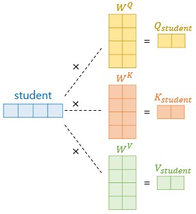

# 1. Introduction
RNN, LSTM, g-RNN 등이 sequence modeling 과 transductive 문제에서 좋은 성능을 보임. 

#### - Sequence Modeling
순서를 가지는 데이터(sequential data)로부터 또 다른 순서를 가지는 데이터를 생성하는 작업(task)을 수행하는 모델을 의미함. 기존 순환모델들은 모든 데이터를 한번에 처리하기보단 순서 위치(sequence position)에 따라 순차적으로 입력해야함.

#### - Trasduction (Transductive Problem) 
학습 시 사전에 미리 train dataset 뿐만 아니라 test dataset도 관측한 상태. test dataset의 label은 미관측 상태지만 학습이 진행되는 동안 train dataset 내 labeled data의 특징이나 데이터간 연관성, 패턴 등을 공유하거나 전파하는 등 추가적인 정보를 활용함으로써 test dataset의 label을 추론함. 

# 2. Background
#### - 기존 NLP 연구들에서 CNN 기반 모델들의 특징
sequential 계산을 줄이기 위해 CNN 기반 모델들(Extended Neural GPU, ByteNet, ConvS2S 등)은 블록을 쌓으며 모든 입출력 위치에 대한 숨겨진 표현을 병렬적으로 계산함. 이 모델들은 임의의 입력 또는 출력 위치 간 신호를 연결하는데 필요한 연산량이 증가하므로 먼 위치 간의 의존성 학습이 난해해짐. 이런 단점을 보완하기 위해 Transformer를 도입. 단, attention의 가중치가 적용된 position의 평균을 이용하기 때문에 유효 해상도가 낮아지는 단점이 존재.

#### - Attention

Attention Mechanism은 다양한 작업에서 강력한 sequence modeling 및 transductive model의 필수적인 부분이 되었으며 input과 output sequence에서 거리와 관계없이 의존성을 모델링 가능. 본 논문에서 순환과정(recurrence)을 피하는 대신 input과 output 사이의 global dependency를 찾는 attention mechanism만 사용. 또한 Transformer 구조는 더 많은 병렬처리가 가능해 최고 수준까지도 도달.

- 
- Position-wise Feed-Forward Networks
- Embeddings and Softmax
- Positional Encoding

- 장점
1. 층당 전체 연산 수 감소
2. 병렬화 가능 계산
3. 신경망 내 장거리 의존성 간 경로 길이가 짧아져 학습이 용이

#### - Self-Attention
Self-Attention은 input sequence 내에서 서로 관련된 부분들을 찾아 집중하는 방식으로 작동하는 메커니즘. 기존 RNN 모델처럼 sequence를 순차적으로 처리하지 않고, 모든 위치 간의 관계를 동시에 고려해 학습하도록 작동. 
Query, Key, Value 의 시작값이 동일. 자기 자신과의 내적을 통해 (각각에 대한 weight matrix를 곱) 고유의 값을 가지도록함.

# 3. Model Architecture
- overall architecture

## 3.1. Attention

- Scaled Dot-Product Attention
 

$Attention(Q,K,V) = softmax({Q{K^{T}}/\sqrt{d_v}}) * V$ 
위 수식으로 Attention 매커니즘을 작동

input : queries and keys of dimensions $d_{k}$ (= $d_{q}$), values of $d_{v}$

1. Q와 K의 내적
2. 1번의 결과값을 $\sqrt{d_v}$로 나눠줌으로써 scaling
3. Mask(opt.)

4. 3번의 결과값에 SoftMax 함수를 취함 -> 왜 softmax 사용? 다른 활성화함수 있잖
5. 마지막으로 4번의 결과값에 V를 곱함

- Multi-Head Attention
 

## 3.1. Encoder & Decoder Stacks
- Notation
$(x_1, x_2, ... , x_n)$ : an input sequence of symbol representations
$ \mathbf{z} = (z_1, z_2, ... , z_n)$ : a sequence of continuous representations
$(y_1, y_2, ... , y_n)$ : an output sequence 

- overall architecture
#### 3.1.1. Encoder
본 논문에서 N=6의 동일한 레이어로 구성된 스택으로 이루어짐.
$(x_1, x_2, ... , x_n)$을 $(z_1, z_2, ... , z_n)$로 mapping
 
#### 3.1.2. Decoder
$\mathbf{z}$가 주어졌을 때, 한번에 하나씩 $(y_1, y_2, ... , y_n)$을 생성
각 단계에서 모델은 autoregressive이며, 이전에 생성한 심볼은 다음 심볼을 생성할 때 추가 입력으로 사용.

- Applications of Attention in our Model

# 4. Why Self-Attention

# 참고
- attention is all you need
https://brave-greenfrog.tistory.com/19

- sequence model
https://wooono.tistory.com/241
https://dos-tacos.github.io/translation/transductive-learning/
https://jadon.tistory.com/29

- inductive problem
https://velog.io/@kimdyun/Inductive-Transductive-Learning-%EC%B0%A8%EC%9D%B4%EC%A0%90

- self-attention
https://codingopera.tistory.com/43

# 참고 논문
BERT
NEURAL MACHINE TRANSLATION BY JOINTLY LEARNING TO ALIGN AND TRANSLATE
Vision Transformer
