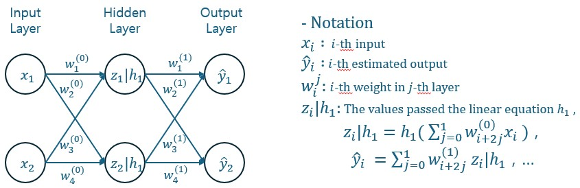
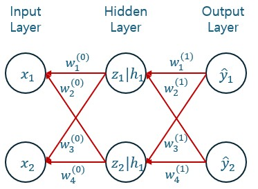

# 1. Loss Function
손실함수는 실제값과 예측값 사이의 차이를 표현한 것입니다. 주로 사용하는 손실함수로는 LogLoss, L2-Error, CrossEntropy, KL Divergence 등이 있습니다. 

# 2. Forward Propagation
입력층에서 출력층 방향으로 오차를 전파시키며 각 층의 가중치를 업데이트하는 방법입니다.

위 그림에서 확인할 수 있듯이, 입력층에서 출력층으로 연산을 진행하며 가중치와 기울기를 계산합니다. 이 과정에서 Hidden layer의 수가 증가하면 할수록 필요한 연산의 수는 기하급수적으로 증가합니다.

# 3. BackPropagation
Forward Propagation과 반대 반향으로 오차를 전파시키며 각 층의 가중치를 업데이트하는 방법입니다. 

Forward Propagation에서 계산한 오차 $(L(y_1-\widehat{y}_1))$를 기반으로, 출력층에서 입력층으로 오차에 대한 기울기를 연쇄 법칙으로 계산함으로써 모든 가중치를 업데이트합니다. 이러한 방법으로 모든 데이터에 대해 학습을 진행합니다. 이 과정을 반복해 손실 함수를 통해 계산되는 손실 점수를 최소화하는 가중치를 탐색합니다.

# 참고
https://www.philgineer.com/2021/09/27-5.html
https://davinci-ai.tistory.com/20